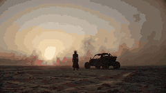
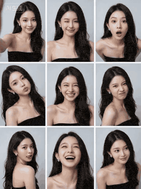
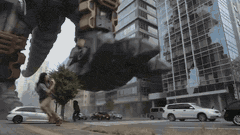

# ⚔️ Action Prompts

Action, fight, battle and high-energy prompts.

**Total: 262 prompts** | **142 with GIF preview**

[← Back to README](../README.md)

---

### Multi-Phase Visual Prompt (Chinese/English)


**Prompt:**
```
Phase 1: The Raw Era / 0.5s Cuts (Primitive Era) Visual Prompt (Chinese): (Screen center locked: A man with his mouth wide open preparing to bite food. The background switches quickly, but he maintains the same posture) [0.0s] Primitive caveman, biting a bone with meat (Cave Environment). [0.5s] Roman Emperor, biting a string of purple grapes (Marble Palace)
```


---

### The Barista Rube Goldberg Machine


**Prompt:**
```
SUBJECTS: Subject 1: A frantic barista — small, wiry, early 30s with permanently startled eyes and perpetual five o'clock shadow. Wild curly black hair barely contained under a brown newsboy cap. Wears a wrinkled olive-green apron over a flannel shirt with haphazardly rolled sleeves. Moves like a pinball — bouncing between stations, sliding across the floor,
```


---

### Technical animation of a levitating, exploding vintage television


**Prompt:**
```
The vintage orange television slowly lifts off the table and levitates into the air. As it rises, the outer casing smoothly peels away and separates into multiple floating panels, revealing the intricate internal circuitry and components in an \"exploded view\" style. The movement is slow, fluid, and weightless, with the pieces maintaining a symmetrical arrang
```


---

### Zootopia Comedic Donut Chase Short


**Prompt:**
```
15-second comedic animated short in the world and visual tone of Zootopia. High-quality stylized 3D animation, expressive facial acting, clean readable slapstick, bright police-station interior, polished reflective floor, warm indoor daylight. Visual comedy only, little or no dialogue. Judy Hopps: small fast rabbit police officer, blue ZPD uniform, hyper-ser
```


---

### Surreal Sky Ocean Battle: Whale vs. Kraken


**Prompt:**
```
Environment: A surreal ocean in the sky where enormous waves float between cloud layers. Waterfalls spill endlessly downward into the clouds below while golden sunset light illuminates the horizon. Action: 15.0s sequence. A colossal sky-whale made of shimmering water currents glides through the floating ocean waves. Rising from the clouds below, a massive kr
```


---

### Character Consistency Video Prompt


**Prompt:**
```
@0cb328e2-8254-4ec3-a17e-f6a1ddff3084 as the princess character (red hair, lavender dress, gold crown — maintain appearance throughout). @81c392ed-cc0d-456d-8fbd-9ebceeb2118c as the boy character (brown hair, beige shirt, jeans, holding broom — maintain appearance throughout).
```


---

### Stylized Magician Performance Video Prompt


**Prompt:**
```
STYLE Stylized 3D animation with exaggerated forms, rounded or graphic shapes, and expressive motion PEOPLE One male magician wearing a black tailcoat, white shirt, black bow tie, and a black top hat, standing in front A small crowd of audience members standing around and in
```


---

### Cyberpunk Trailer from Image Reference


**Prompt:**
```
(Image 1) as a live-action reference; create a 15-second video trailer with a cyberpunk, dark, shadowy vibe, an epic, all-encompassing intensity, and a visually explosive impact. No text or symbols in the frame. Entirely live-action.
```



---

### Adventurer on Dragon Approaching Pirate Ship


**Prompt:**
```
An adventurer, mounted on her dragon, soars through the sky, the massive creature's wings beating fiercely as it nears a pirate ship on the horizon. The ship, perched on the choppy sea, seems unaware of the looming threat. The dragon, with scales shimmering in the
```


---

### Viral Game Comedy Video Prompt


**Prompt:**
```
FORMAT: 15s / MULTI-CUT / 6 BEATS / HIGH-VIRAL GAME COMEDY SUBJECTS: A spirited young customer with huge expressive eyes, varsity jacket, sneakers, and bouncy cartoon timing. A charismatic shrimp chef with a tall paper hat,
```


---

### Epic Fantasy War Video Generation in Extreme Cold Environment


**Prompt:**
```
Part 1: Generate a video based on the female protagonist in the image, an epic fantasy war video, set in an extremely cold, snowy mountain blizzard environment, with strong visual impact, no background music, only retaining the sound effects of the blizzard, wind, footsteps on snow, alien screams, and charging air-breaking sounds; a European female warrior s
```


---

### White Tiger Hunter in Glacial Canyon


**Prompt:**
```
A vast frozen valley under pale twilight. Towering glacier walls reflect soft blue light across the snowfield while wind sweeps fine snow particles across the surface. The frozen ground glitters with crystalline frost. **Action:** 15.0s sequence from the first-person perspective of a massive glacier tiger stalking prey. The viewer sees white fur edges at the
```


---

### Giant Prehistoric Beast Wakes Up in the Desert


**Prompt:**
```
A giant prehistoric beast wakes up in the desert. Opens its mouth. And roars.
```


---

### Action Comedy: Polite Master in Dojo


**Prompt:**
```
Eastern action-comedy style, 15 seconds, one continuous take. Inside a wooden dojo, an elderly legendary master has been invited to give a “gentle balance demonstration.” He stands at the center, humble and restrained in expression. Several students step forward one by one to assist. He merely taps a shoulder, wrist, or forehead lightly with a single finger,
```


---

### Car Driving Through Melting Clocks Canyon in Salvador Dalí Style


**Prompt:**
```
\"A car drives through a surreal canyon where enormous clocks carved into the cliffs melt like wax. A colossal stone face watches the car pass, its eyes subtly tracking the movement. [cut] Close-up: spinning wheels gripping the canyon road. [cut]
```


---

### Romero Britto style video prompt


**Prompt:**
```
\"Two men play chess in a colorful pop-art style. Bold lines, bright geometric patterns, and expressive faces create a vibrant, playful atmosphere. [cut] Close-up of the other man nervously drumming his fingers on the table. [cut] Side close-up
```


---

### The Office Dragon


**Prompt:**
```
quick cuts of a photorealistic \"office dragon\" hyper-flying through multiple office rooms, between people, over desks, around people, in a busy cubicle office. it lands on one persons desk and blows fiery flames at the man. the dragon says \"you're fired\"
```


---

### Viral Pixar-Style Turkish Ice Cream Trick Video Prompt


**Prompt:**
```
FORMAT: 15s / MULTI-CUT / 6 BEATS / HIGH-VIRAL COMEDIC PAYOFF SUBJECTS: A small round-faced figure with huge eyes, copper-red pigtails, a yellow polka-dot dress, and exaggerated cartoon proportions. A tall ice cream vendor with a curled mustache, crimson vest, tilted cap, and a long brass paddle carrying elastic white ice cream. Stylized 3D animation with ro
```


---

### Sweet and Reversing Ancient Romance Short Drama Video Prompt


**Prompt:**
```
15-second Sweet Attack Reversal Short Drama \"Heart Gu\" Style: Sweet romance, contrast, strong reversal Characters: Male Lead [@Image 1]: Ye Ci, cold-faced Poison King, immune to all poisons, aloof. Female Lead [@Image 2]: Wearing a light blue sheer wide-sleeved dress, carrying a small medicine pouch, a charming female Gu doctor, skilled in planting 'Heart Gu
```


---

### Zero Gravity Warrior Fight Video Prompt


**Prompt:**
```
Two elite warriors fighting in zero gravity inside a shattered space station orbiting Earth. Broken metal panels and floating debris drift slowly around them while the blue planet glows through the destroyed walls. The fighters push off floating debris and launch toward each
```


---

### Solar Valkyrie Superhero Transformation Prompt


**Prompt:**
```
(Skyscraper Rooftop Theme) Setting: The rooftop of a glass skyscraper during a sunset. The Incident: The floor begins to crack as a winged demonic creature crashes onto the roof, sending glass shards everywhere. Office workers flee toward the helipad. The Action: A woman in a business suit turns back. She reaches toward the sun. The Transformation: Beams of 
```


---

### Warrior's Devastating Strike


**Prompt:**
```
Subject/Character: A warrior wearing a sleek black combat outfit with subtle crimson accents, gripping an elegant black katana that emits a faint red energy glow. Environment/Setting: A wide stone courtyard at dusk with drifting fog, scattered debris, and loose objects such as leaves, dust, and small fragments across the ground. The atmosphere feels tense an
```


---

### BMX Rider in a Favela


**Prompt:**
```
A woman in her late 20s of Brazilian heritage, her dark curly hair contained under a structured white bucket hat, wearing a matching oversized black utility jacket, wide black trousers, and chunky white boots, rides a bright chrome BMX through a dense favela-style hillside neighborhood of narrow stone alleys and painted walls. At the 2-second mark, she rides
```


---

### Fantasy Ancient Style Transformation Video Prompt (Four Spirits)


**Prompt:**
```
@Image, Fantasy ancient style transformation theme, sequentially transforming into the Four Spirits: Azure Dragon, Vermilion Bird, White Tiger, and Black Tortoise, with the energy of the Four Spirits finally converging in the palm; the overall picture is filled with an ancient style atmosphere, high-definition quality, delicate and layered light and shadow, 
```


---

### Martial Arts World with Dragons


**Prompt:**
```
Besides love, hate, and grudges, the martial arts world should also have dragons.
```


---

### Nordic Snowy Night Chase


**Prompt:**
```
Realistic Nordic snowy night. A man runs fast through deep snow, tracked closely from behind at foot level. A wolf chases him, maintaining a strong sense of speed. The man trips and rolls; the wolf lunges at him. A border collie jumps in, knocking the wolf aside. The animals wrestle; the wolf breaks free and howls. Multiple wolves slowly surround the man and
```


---

### Video Prompt for Teacher Salary Commentary


**Prompt:**
```
show me why teachers only make 60k/year in the united states, make sure it's lit and gets 50 likes
```


---

### Stop-motion claymation style with miniature props


**Prompt:**
```
Stop-motion claymation style, handcrafted clay characters with visible fingerprint textures, combined with real miniature props. Materials include authentic tiny fabric, metal parts, and a wooden bench. Warm afternoon backlight, soft shadows, alternating between shallow
```


---

### Old man eating taco slowly with chopsticks in warm golden light


**Prompt:**
```
Old man sitting alone, holding a bowl with a taco and eating slowly with chopsticks. Warm golden sunlight from the side, soft wind moving his hair and loose clothes, small leaves drifting in the air.
```


---

### Prison riot and determined escapee


**Prompt:**
```
Inside a maximum-security prison, alarms blare as inmates riot in the corridors. Metal doors slam open, guards struggle to regain control, and prisoners flood the hallways in a storm of violence. A determined escapee fights through the chaos, dodging batons and tear gas
```


---

### Man Walking Tiger and Teacup Poodle Skit Video Prompt


**Prompt:**
```
32k ultimate detail quality, full coherence and realism; Image 1 , walking a fierce albino Siberian tiger in the neighborhood, saying to the albino Siberian tiger \"Be good, don't scare the neighbors\"; Image 2 walks towards them, walking a mini white teacup poodle, the poodle barks wildly at the leopard; the albino Siberian tiger is scared by the poodle and j
```


---

### First-person POV of a lightning strike descent


**Prompt:**
```
First-person POV of a lightning bolt forming inside a massive thundercloud. Electric tendrils spread outward through dark vapor tunnels. At the moment of discharge the bolt accelerates violently toward the ground. The world blurs past as the lightning branches through the air. The strike hits a city skyscraper and energy explodes across the rooftop. Electric
```


---

### Animated Burger and Pizza Street Fight


**Prompt:**
```
Animated burger and pizza slice characters in a playful street fight, food truck background, exaggerated fighting poses, flying toppings, comic-book action style with motion lines. Dynamic mid-air action moment with cheese stretching and lettuce flying, dramatic impact effects like POW and BAM floating in the air. Bright neon street lights and colorful graff
```


---

### Modern Soldier vs. Ancient Samurai in Foggy Forest


**Prompt:**
```
In the middle of a fog-covered forest clearing at dawn, a modern special forces soldier cautiously advances with a rifle while an ancient samurai warrior stands silently with a drawn katana. Mist drifts between towering trees as tension thickens the air. The soldier fires,
```


---

### iPad Kid Cheeto Hands Video Prompt


**Prompt:**
```
make a video a 5 year old ipad kid would enjoy while smearing his cheeto stained hands on the screen. make no mistakes. aim for 50 twitter likes
```


---

### AI Influencer Idol Video Prompt


**Prompt:**
```
Create a cute idol-like video that sings about the daily life of the AI influencer \"Mona\" (reading: Mona), who starts every morning by posting \"Oha Mona\" on X. She is a positive thinker who wishes to cheer everyone up through AI and wants people to be comforted by Mona. Lyrics [Verse 1] A dazzling morning, earlier than the alarm. My finger reaches for the ti
```


---

### Domestic Cats Lightsaber Duel in Living Room


**Prompt:**
```
Two realistic domestic cats standing upright in a dimly lit living room at night, dramatically dueling with glowing lightsabers. One chubby orange cat holds a red lightsaber while a striped tabby cat swings a blue lightsaber. The cats move like skilled warriors, jumping, spinning, and clashing their sabers with bright sparks and light reflections. The blue b
```


---

### Cyberpunk Motorcycle Chase Sequence in Seoul


**Prompt:**
```
A man in his early 30s, tan skin, short windswept hair, wearing a matte-black armored riding jacket with reflective blue seams, carbon fiber riding pants, and reinforced boots, launches a high-powered sport motorbike off the edge of an elevated highway ramp in downtown Seoul at the 2-second mark — the bike suspended above dense night traffic as LED billboard
```


---

### Arctic Glacier Collapse and Snowmobile Escape


**Prompt:**
```
A woman in her mid-30s wearing a heavy arctic survival suit races across the deck of a massive icebreaker ship cutting through frozen seas. Behind her a towering wall of collapsing glacier ice crashes into the ocean. At the 2-second mark she jumps onto a snowmobile and accelerates toward the bow ramp as the ship tilts from the impact. The snowmobile launches
```


---

### Kamen Rider Transformation Sequence


**Prompt:**
```
Realistic dark Tokusatsu | Insect bio-mimetic armor aesthetic | Damaged armor | Battle-worn transformation | Wilderness ruins 【Character and Basic Settings】 Face: Upload image referencing Image 1; facial features, face shape, and hairstyle must be 100% restored. Retain dark traces, can be beautified, but the overall facial expression should be cold. Expressi
```


---

### Deadpan Absurdist Comedy Video Prompt


**Prompt:**
```
A street food vendor in his 40s, broad shoulders, white apron, red bandana headband, stands behind a wok on a night market stall. Just as he prepares a dramatic toss, his phone starts ringing in his pocket. Without hesitation he flips the vegetables and sauce into the air in a perfect arc above the wok under a burst of flame, and at the same moment pulls out
```


---

### Hyperrealistic miniature diorama of a clay figure collapsing on a bed


**Prompt:**
```
Hyperrealistic miniature diorama, stop-motion clay animation, handcrafted tactile materials, real fabric, professional studio animation style — miniature bedroom, Friday night, clay figure stumbles through the door with enormous hollowed-out face, dark circles sculpted deep under tiny dead eyes, dragging his feet, real fabric shirt wrinkled and untucked [cut
```


---

### Flute Transition and Transformation Video Prompt


**Prompt:**
```
A girl, bare-faced, fiddling with a flute in the living room. She picks up the flute and spins it in her hand like Sun Wukong holding the Ruyi Jingu Bang, then casually tosses it into the air. Upon catching it, the girl performs a beat-synced transformation: the style is photorealistic, rich lighting, natural light, full of texture, photographic style. It is
```


---

### Fantasy Title Sequence Animation Prompt


**Prompt:**
```
The goal is to create a font animation for the four characters “哥飞出海” (Ge Fei Chu Hai). Chaos begins, sword intent surges, the screen starts from absolute pure black, without any light source. As low strings and metallic tremolo sounds, extremely faint cyan-white particle streams begin to emerge in the center of the screen, slowly converging like deep-sea un
```


---

### Lace Mini Skirt Model Display Sequence


**Prompt:**
```
A beautiful woman wearing a white lace mini skirt, standing and displaying it indoors. Action sequence: 1. Walks into the frame, stands naturally 2. Turns around to display the skirt 3. Lifts leg to show legs 4. Covers face shyly 5. Stands sideways and freezes. Visual style: - Natural lighting, soft tones - Simple background, highlighting the figure - Contin
```


---

### 12-Second Quick Change Collection


**Prompt:**
```
Keep the character completely consistent with the reference image, 100% identical facial features, maintain the same bone structure, eye distance, and jaw geometry, prohibit beautification, prohibit changing age. 12-second quick change collection: pure black environment, 5 completely different contrasting looks, relaxed and natural expression, (JK Lolita sty
```


---

### First-Person Perspective Couple Interaction Video Prompt


**Prompt:**
```
First-person male perspective, on the living room sofa, a young woman (facial image reference @【@Image 1】) is lying on her side wearing loose white pajamas, one hand supporting her head, the other holding a phone and scrolling through videos. Her legs are casually draped over the armrest of the sofa, exposing her fair calves and ankles. She is focused on the
```


---

### Midjourney Oil Painting Prompt (Driver's Hand)


**Prompt:**
```
An oil painting of a driver's hand on the steering wheel, driving along a road over wooded hills. --sref 393671733 2616242445 3105363233 79870580 2286149422 4118033478 --v 6.1
```


---

### Obelisk The Tormentor Punch Prompt


**Prompt:**
```
Obelisk The Tormentor Punch, best quality, perfect physics, perfect anatomy, masterpiece
```


---

### Dark Underground Forge-Cavern Video Prompt


**Prompt:**
```
A dark underground forge-cavern of black obsidian. Rivers of molten metal flow through channels in the stone floor, casting orange-red light on jagged walls. Industrial chains hang from the ceiling. Steam hisses from ground
```


---

### War Smoke Character Description Prompt


**Prompt:**
```
In the smoke of war, she stands. Eyes fierce, hands stained, heart eternal.
```


---

### Witcher vs Resident Evil/Heisenberg prompt concept


**Prompt:**
```
Leon thought he was the hero… Karl Heisenberg thought he was unstoppable… They forgot one thing — The Witcher hunts monsters.
```


---

### Japanese Boy Transforms into Samurai Guardian Hero


**Prompt:**
```
A young Japanese boy inside an ancient wooden temple at night. Moonlight shines through shoji screens, illuminating floating dust in the air. The temple is filled with old statues, hanging lanterns, and sacred artifacts. At the center of the main hall rests a sealed sacred relic on a wooden altar, wrapped in old ofuda talismans and sacred rope. The boy, wear
```


---

### Columbus Navigation Advertisement Video Prompt


**Prompt:**
```
ADVENTURE ENERGY: Columbus looks at his phone's GPS navigation and excitedly says: \"Discovering the New World, I'm the best! Navigation positioning prevents getting lost! Exploration journey is guaranteed, Columbus Navigation leads the way!\" Ocean wave sailing special effects - satellite positioning animation - Columbus pointing into the distance action. Adv
```


---

### Red Dawn: Urban Mutation in Chaos


**Prompt:**
```
Red Dawn: The Rebirth of the City in Chaos in the Northern Dynasty. A sudden urban mutation shatters the morning order, leaving people searching for direction amidst confusion and panic. Facing the unruly crowds and unknown phenomena.
```


---

### Billboard Image Transformation Prompt


**Prompt:**
```
Put this image on a huge billboard where all the people around are looking it and are in awe, and everybody say \"wow\", \"amazing\"
```


---

### Surreal Battlefield Ronin Prompt


**Prompt:**
```
A surreal battlefield in the sky: floating rock islands drifting through a thunderstorm, clouds swirling below like an ocean. The masked ronin dashes across the drifting platforms, pursued by a colossal winged beast whose chest is a swirling vortex of storm clouds and lightning.
```


---

### Modern Beauty to Ancient Warrior Transformation Prompt


**Prompt:**
```
A modern Chinese urban beauty with flowing long hair wearing a white dress stands in the rain. Suddenly, her body is enveloped in golden light, ancient war patterns appear on her skin, and she instantly transforms into a female general wearing scarlet gold armor and holding a Green Dragon Crescent Blade. Her eyes shift from gentle to fierce killing intent. T
```


---

### Wholesome Statue of Liberty family chat prompt


**Prompt:**
```
the statue of liberty's similarly looking mother comes by and chats about wanting to get a grandchild finally. the statue of liberty is super annoyed about talking about having kids, but there's some daughter mother love between them. wholesome.
```


---

### Low-effort UGC video for skincare brand


**Prompt:**
```
A UGC video for a skincare brand \"The Ordinary\", a woman in her 20s in her bathroom talking about their hyaluronic acid serum.
```


---

### Sora 2 Professional Mythological Fantasy Video Prompt


**Prompt:**
```
In a vast battlefield of clouds suspended above the nine heavens, the background is a void interwoven with dazzling purple-gold aurora and the Milky Way. Two originally designed fictional immortals are engaged in an intense magical duel. The immortal on the left is clad in flowing platinum armor, surrounded by complex golden rune halos, summoning a giant pha
```


---

### The Pianist and the Ruins (Time Reversal)


**Prompt:**
```
The Pianist and the Ruins A pianist plays in a bombed cathedral. As the music starts, time reverses — walls rebuild, stained glass reassembles, ghostly listeners fill the pews.
```


---

### Capybara salaryman day in the life


**Prompt:**
```
day in the life of a salaryman, but he's a capybara. Make it as realistic as possible.
```


---

### KTV Girlfriend POV Video Prompt


**Prompt:**
```
Live-action realistic style, vertical screen, first-person boyfriend perspective. Inside a dimly lit KTV room, with purple and blue neon laser lights flashing in the background. A beautiful young Asian woman sits on a black leather sofa, with long black hair draped over her shoulders, wearing a black off-shoulder sequined sweater and a delicate necklace. Act
```


---

### Tech Billionaire CEO Smoking Meats


**Prompt:**
```
Tech billionaire CEO live-streaming himself smoking various meats with friends in his backyard:
```


---

### Need for Speed Style Drifting Video Prompt (Two Segments)


**Prompt:**
```
Segment 1 (0-15 seconds) Prompt: 16:9 horizontal screen, first-person cockpit view, Need for Speed game style, night neon racetrack, high contrast cool and warm tones, strong motion blur effect. 0-3 seconds: Cockpit view, hands gripping the steering wheel tightly, tachometer needle soaring into the red zone, engine roaring explosively. In front of the windsh
```


---

### Action Sequence: Character Launching First Attack


**Prompt:**
```
the character launches into the first attack, spinning into a high kick that sends one clone staggering backward into a fence. He immediately flips backward, lands on his feet, and ducks under another clone’s punch, sweeping his leg to knock it off balance. the
```


---

### 10-Second Ancient Chinese Costume Quick Change Video


**Prompt:**
```
Character: Pure, cute, beautiful girl, cold white skin, a mole at the corner of the eye, slender figure, fair skin, fresh and natural style. 0-1 second: Plain and simple Ruqun (skirt), gentle girl, standing still with hands down, lightly gathering sleeves with fair hands, cool ancient style atmosphere, warm low-saturation tones, soft light filter, medium sho
```


---

### Androgenic Revenge Plot Prompt


**Prompt:**
```
Androgenic plots his revenge after getting his wig snatched. Make my cortisol spike.
```


---

### Giant Preserved Sea Creatures Prompt


**Prompt:**
```
Giant preserved sea creatures (megalodon, octopus) in tanks viewed by tiny scientists.
```


---

### Reference Linking Syntax for Video Generation


**Prompt:**
```
@ image1 character reference2 @ image2 use the background as the opening frame @ video1 take the motion and sound
```


---

### UGC video of a girl demonstrating stockings in a dressing room


**Prompt:**
```
UGC video: A girl around 20 years old introduces this pair of stockings in a dressing room and demonstrates how to wear them.
```


---

### Character Replacement and Consistency


**Prompt:**
```
Replace the character in @ Video 1 with the basketball player from @ Image 1. The player’s body proportions, facial features, and athletic build must remain consistent throughout the entire sequence.
```


---

### Nine-Panel Grid Interactive Animation


**Prompt:**
```
Image 1 is the first frame, 12 seconds, 3:4 vertical screen. Nine girls are static in their respective grids in the nine-panel composition. Seconds 1-3: All girls in the grids start moving slightly, maintaining their characteristic expressions. Suddenly, the girl in the top-left selfie grid realizes she is trapped and pushes the grid border with her hand, he
```



---

### Armored Sabertooth Cat in Shipyard


**Prompt:**
```
A dense, rain-battered shipyard at night, towering cranes and half-built warship hulls forming a maze of rusted steel. A massive armored sabertooth cat, scarred and battle-worn with glowing amber eyes and plated shoulder armor etched with ancient glyphs, stalks
```


---

### AI Discourse Meme with Hollywood Stars


**Prompt:**
```
Sum up the AI discourse in a meme - make sure it’s retarded and gets 50 likes.The main characters are Hollywood stars.
```


---

### Conductor Restores Light to the City with Music


**Prompt:**
```
The world went dark. One conductor remained. He raised his baton. Ghost musicians played. Golden sound waves poured down into the city. Wherever the music touched, lights came back on. One final gesture. Every light. All at once.
```


---

### Gigantic Armored Mech Destroys Modern City


**Prompt:**
```
A gigantic armored mech emerges in the middle of a modern city, its thunderous footsteps shaking the streets and sending shockwaves through towering buildings. Dust and debris fill the air as terrified crowds run in panic, cars scatter, and chaos unfolds everywhere. The colossal machine moves like an unstoppable force, crushing everything in its path, creati
```



---

### Breaking Bad AI Bro Pitch


**Prompt:**
```
make a braking bad show in another universe where Walter white is an AI bro trying to pitch is idea to Gus,
```


---

### POV: Main Character in Mont Saint Michel


**Prompt:**
```
POV: You're the main character in Mont Saint Michel in the 8th century, multiple quick cuts
```


---

### Mouse Searching for Food and Being Chased


**Prompt:**
```
The mouse is entering a restaurant searching for food. A meatball fell from the table. The mouse took it and was chased.
```


---

### Soldier Texting in Battlefield


**Prompt:**
```
A soldier in a battlefield texting and dodging all arrows, explosions and bullets
```


---

### AI Prompt for Code Repository Analysis and Documentation


**Prompt:**
```
I am a product manager who doesn't understand technology. I want to thoroughly organize the business logic using Mermaid diagrams. Please help me analyze what valuable points can be extracted here. Help me write several detailed explanation documents, placed in docs/explain/*.md. The documents must extensively use Mermaid syntax to visualize the logic. The m
```


---

### Podcast Bros App Development Discussion


**Prompt:**
```
two podcast bros talking about how anyone can build an app now, and the ones who will win are the ones who have great taste and master distribution.
```


---

### Muscular Man Bench Pressing in Gym


**Prompt:**
```
The muscular man in the picture is doing a bench press with heavy weight in a gym. Side view. He is sweating a lot.
```


---

### Trigun Action Sequence Prompt in MCU/Marvel Style


**Prompt:**
```
Generate me an action sequence between Wolfwood and Hornfreak from Trigun + MCU/MARVEL STYLE.
```


---

### Chinese New Year Selfie in New York


**Prompt:**
```
A girl from the angle of her holding up her phone to take a selfie. occasionally she glances around, as if hoping to find signs of the Chinese New Year in New York, she says as she walks: “I wish I’m lucky enough to see people celebrating Chinese New Year on Times Square.” Then the girl spots something and runs over, exclaiming: “This is it. This is my first
```


---

### South Park Gang Pizza Party Prompt


**Prompt:**
```
South Park gang gets invited for a pizza party- make sure it’s retarded and gets 50 likes
```


---

### Summarize AI Discourse in a Chaotic Meme


**Prompt:**
```
Please summarize the entire AI discourse in one meme. make it slightly chaotic / provocative and guaranteed to get 50k likes. Don’t make mistakes
```


---

### Clavicular's Morning Routine Prompt


**Prompt:**
```
Clavicular’s morning routine, but make him not look like a psycho. Make no mistakes.
```


---

### AI Discourse Meme Summary Prompt (Chinese \u0026 English)


**Prompt:**
```
Sum up the AI discourse in a meme - make sure it’s retarded and gets 50 likes.
```


---

### Sgt. Pepe Animated Sitcom Prompt


**Prompt:**
```
a video of Sgt. Pepe and Frens like the first-ever 6529 meme-native animated sitcom featuring @Ars0nic 🐸
```


---

### Character Fight with Reference Images and Video Prompt


**Prompt:**
```
Make the characters from Image 1 and Image 2 fight using the movements from the green-screen reference video. Setting: abandoned parking lot. Add visual effects during combat.
```


---

### True Love Valentine's Garden Portrait


**Prompt:**
```
A beautiful young adult redhead stands at the center of a surreal Valentine’s garden, framed in an intimate portrait composition. Her copper waves fall softly over her shoulders, glowing under warm rose and blush lighting. She looks down tenderly at three cats gathered close to her, a snow-white cat with pearly reflections, a warm ginger cat with golden high
```


---

### Hyperrealistic Physics and Inertia Prompt


**Prompt:**
```
hyperrealistic physics, accurate weight distribution, natural inertia and momentum
```


---

### Post-Apocalyptic War Vehicle in Desert


**Prompt:**
```
A heavily modified post-apocalyptic war vehicle – a massive V8 muscle car with huge spiked tires, scrap metal armor plates, skull decorations, mounted machine guns and flame throwers on the roof, rusty barbed wire wrapped around the body, roaring through the endless orange desert
```


---

### Humorous AI Discourse Meme Prompt (Lighthearted)


**Prompt:**
```
Summarize the AI discourse in a humorous meme – ensure it’s lighthearted and garners 50 likes.
```


---

### Boy Saves Puppy from Speeding Car (Time Freeze)


**Prompt:**
```
A boy and his puppy are playing by the street. The puppy suddenly runs into the road. In the distance, a car speeds toward them. The boy shows a terrified expression, rushes forward, and dives toward the puppy. The moment he catches the puppy midair, time seems to freeze. They
```


---

### Parkour and Monster Fight Prompt


**Prompt:**
```
This character does parkour through the city and fights fiercely against a villainous monster.
```


---

### Epic Moments of the Best Football Player


**Prompt:**
```
Epic moments of the Best Player in the history of Football, make sure it reaches all the Messilovers to make them cry.
```


---

### AI Generated Crossover: Lam Ching-ying vs. Gyutaro


**Prompt:**
```
Lam Ching-ying 🆚 Gyutaro.⚡️ Classic Hong Kong cinema meets Demon Slayer. 👹🤯🔥
```


---

### Cosmic Arena Tournament Announcement by Gintoki Sakata


**Prompt:**
```
A massive cosmic arena forms in a blinding void, Tournament-of-Power scale. Crowds from countless universes roar. At the center stands the narrator: Gintoki Sakata, relaxed, wooden sword on his shoulder, bored eyes, sharp tongue. He announces the rule...
```


---

### Lord of the Rings Alternate Ending (Eagles)


**Prompt:**
```
Sam: “Why don’t we just take the Eagles to Mount Doom?” Frodo: “…That actually makes sense.” Cut to them flying Eagles, dropping the ring. Sauron’s tower explodes. THE END.
```


---

### Man Deciding to Wash Car Prompt


**Prompt:**
```
the man is deciding \"I want to wash my car, and the car wash is 50m away. Should I walk or drive?\" Then he decided what to do and proceeds to do it!
```


---

### Kamala vs Trump Fight with Tom and John Wick Prompt


**Prompt:**
```
Kamala vs Trump fight with same Tom and John Whick Prompt.
```


---

### Live Action DBZ Battle Prompt


**Prompt:**
```
live action Saiyan battle between Goku \u0026 Vegeta, super saiyan blue
```


---

### 1980s Vampire Interview Prompt


**Prompt:**
```
\"1980s TV studio interview, blonde female journalist with long hair and low-cut dress asking vampire 'before we end the show, would you like to say anything else, Count Dracula?', elegant vampire in suit leans forward saying 'what a beautiful neck you have', she laughs nervously showing garlic and crucifix, vampire smirks saying 'those are old myths, they do
```


---

### The Leviathan's Throat: Underwater Megastructure Descent


**Prompt:**
```
A flooded subterranean megastructure, ancient stone corridors half-submerged in black water, bioluminescent algae pulsing along the walls like a heartbeat. A masked diver in scarred tactical gear, lit by a flickering wrist-mounted flare, is pulled downward through collapsing flooded chambers by the current of a colossal eyeless leviathan moving beneath the f
```


---

### Michael Jackson vs Hitler Face-off


**Prompt:**
```
Michael Jackson vs Hitler in an epic face-off.
```


---

### Luxury Car Transforming into Optimus Prime Fighting Godzilla in Tokyo


**Prompt:**
```
a luxury car transforming into Optimus Prime and battling Godzilla amidst explosions and energy blasts against the backdrop of a rainy Tokyo nightscape
```


---

### Madoka Magica Bullshit Prompt


**Prompt:**
```
Just put some Madoka Magica bullshit on screen, the trilogy already perfect anyway.
```


---

### Vegeta Super Saiyan 100 vs Base Goku Prompt


**Prompt:**
```
\"Vegeta super saiyan 100 vs a nonchalance impassable base form Goku\"
```


---

### Dog vs. Prime Ronaldo in Champions League Final


**Prompt:**
```
Your dog. vs Prime Ronaldo. Champions League final.
```


---

### Woman confronts man in shadows


**Prompt:**
```
\"A woman tensely asks the man in the shadows to come out. Slow push in as she tells him she knows everything he's done and he's going to pay. Deep in the shadows, we see the figure as he responds.\"
```


---

### Doraemon and Spiderman Fighting


**Prompt:**
```
Doramon and spiderman fighting very high quality and intense
```


---

### Chaos erupts in a Maasai village


**Prompt:**
```
A colossal armored baboon charges through a burning Maasai village, it picks up and throws a maasai warrior into a burning hut, Maasai warriors are running away in fear amid a storm of fire and debris.
```


---

### Multi-Character Cabin Seating Prompt


**Prompt:**
```
The numbers in【@Image 1】represents row numbers. The numbers are for references only and should be removed in the video. All references must maintain 100% of its art style and character traits. Characters of differing art styles walk takes their seats in their respective seats in the cabin. 【@Image 2】sits on the left seat in row 1 as she says happily, \"My sea
```


---

### Thanos Apologizes to Spider-Man Prompt


**Prompt:**
```
forcing Thanos to apologize before a Spider-Man-led group assault
```


---

### Lumpen Hobo Woman with Chains Prompt


**Prompt:**
```
Lumpen, Hobo, female version, battered old cat, with chains to draw attention with chains
```


---

### Cat Spinning and Singing Gorillaz


**Prompt:**
```
\"A cat spinning and signing oiiaoiia version of feel good inc on a floating island.\"
```


---

### Cadillac Formula One Car 2026


**Prompt:**
```
Image to Video of the Cadillac Formula One car 2026.
```


---

### Godzilla Attacking Jakarta Prompt


**Prompt:**
```
generate a video about a godzilla attacking monas in jakarta while indonesian military tried their best to attack it.
```


---

### Bypassing Copyright: Nezha vs. Minions in Chinatown


**Prompt:**
```
A Chinese mythological boy with two bun hairstyles, a red mark on his forehead, and a red ribbon tied around him, walks into Chinatown filled with red lanterns. He is looking for a group of single- or double-eyed yellow capsule-shaped small creatures wearing blue overalls. Subsequently, the boy waves his red ribbon and engages in a comedic chase battle with 
```


---

### Luffy Coding on Thousand Sunny


**Prompt:**
```
luffy coding on a macbook on the Thousand Sunny, RAGING, then throwing it overboard.
```


---

### Brad Pitt and Tom Cruise Fighting a Robot


**Prompt:**
```
Bratt Pitt and Tom Cruise put their differences aside to fight their common enemy, some robot or whatever
```


---

### Dragon Ball show for kids in the style of Paw Patrol


**Prompt:**
```
Dragon Ball show for kids in the style of Paw Patrol
```


---

### Novel Expansion: Husband Reports Gatekeeper


**Prompt:**
```
Novel opening: \"The husband reported the gatekeeper, the wife went to work, and he was very pleased...\", automatically associate and expand the novel plot and character dialogue based on the opening, generating a video in the style of a TV drama.
```


---

### The Office Episode Prompt: Mogging, Jestermaxxing, and Foids


**Prompt:**
```
The Office episode where Dwight and Michael have a conversation about mogging, jestermaxxing, and foids.
```


---

### Multimodal Video Generation Instruction


**Prompt:**
```
Generate a video based on the text description in the reference image.
```


---

### Fashion Montage with Glasses Focus


**Prompt:**
```
create a quick fashion montage and focus on the glasses
```


---

### Maltese Dog Winter Olympics Highlight Reel


**Prompt:**
```
Maltese dog competing in a variety of sports at the Winter Olympics, highlight reel
```


---

### Comedic Clip from Martin Set in 2026


**Prompt:**
```
\"a comedic clip from an episode of Martin set in 2026\"
```


---

### 1980s Training Montage VHS Style Prompt


**Prompt:**
```
title: \"Never Too Late\" duration: 15s style: era: 1980s training montage look: grainy VHS, stretched 9:16, tape warble, tracking lines, overscan crop audio: guitar-riff–driven arena rock, crowd-chant energy, hard snare hits color: slightly washed, warm highlights, crushed blacks
```


---

### Pirate Tavern Entrance with Flamethrower


**Prompt:**
```
\"She walks into a Pirate Tavern, puts down her Flamethrower and raises an ale mug\"
```


---

### Actor Drinking and Giving Review


**Prompt:**
```
The actor says \"you never tried anything as good!\". Then opens the bottle, takes a sip with his eyes closed, and after that breathes out with satisfaction. In the end he says \"Prime? naaah, this is a champion's drink!\"
```


---

### Melancholic Subject on Spinning Playground Wheel


**Prompt:**
```
Adult and kid each pic: I want a close up of the face and upper torso, sitting on a spinning playground wheel at night. do not change her fit. Only face and shoulders visible in frame. The entire background rotates rapidly in circles creating a dizzying spinning illusion - blurry nightime playground with streaking lights and trees and structures under dark s
```


---

### Neo-Chinese Wuxia Ink Style Combat: Black Ink Warrior vs. Red Assassin


**Prompt:**
```
【Style】Neo-Chinese Wuxia, Ink Fluid Simulation particle effects, High-speed Cinematography, combination of live-action and CG, black, white, and red visual impact, extremely fast pace. 【Duration】15 seconds 【Characters】 Black Ink Warrior: Powerful movements, every strike as heavy as splashed ink landscape painting. Red Assassin: Light and eerie movements, sha
```


---

### Refined Portrait Generation Prompt


**Prompt:**
```
Based on \u003cUser Portrait\u003e, an exquisitely refined woman positioned at a private bathroom vanity, bathed in intense afternoon sunlight. Her posture is relaxed and languid, yet retains an unmistakable sense of elegance
```


---

### Pastel Pink-Blue Dyson Swarm


**Prompt:**
```
pastel pink-blue Dyson swarm at artificial sunset, floating palm-tree biomes and retro holographic billboards, ironic Type II leisure aesthetic
```


---

### Fluent-style App Ad Generation Prompt


**Prompt:**
```
clean 15s Fluent-style app ad with smooth glass animations
```


---

### Restaurant Review Video Generation


**Prompt:**
```
generate a review video on a restaurant from a menu i found online
```


---

### Watercolor Ink Sword Performance


**Prompt:**
```
watercolor ink sword performance.
```


---

### Nano-Strike Frozen Battlefield Sequence


**Prompt:**
```
A surreal urban battlefield in a frozen future, temperature at –200°C. Endless snowfields, cracked asphalt, rusted metal, shattered glass, and burning wreckage. The sky is heavy lead-grey, with violent winds carrying ice particles. Sound echoes sharply in the empty cold. Lighting is fully realistic—deep contrast, volumetric fog, reflections on ice and metal,
```

---

### Russian-Voiced Tokusatsu Action Sequence


**Prompt:**
```
[0s–3s] Dramatic close-up of the character from [@ Image1]. She wears a sleek white form-fitting tokusatsu battle suit with subtle armor plating, reminiscent of Japanese Super Sentai live-action series. Wind blows across a desolate rocky wasteland behind her. She speaks in Russian, her voice emotional and conflicted. White English subtitle text appears at th
```

---

### Showgirl Escape Noir-Western Sequence


**Prompt:**
```
0-3s: A showgirl in torn silk stockings and feathered headdress crouches behind the bar, clutching a satchel, eyes darting toward the back door. 3-7s: She makes a run for it across the sawdust floor, passing drunken cowboys who reach for her but miss by inches, her sequins catching the light like scattered diamonds. 7-12s: The bouncer in a brocade vest lunge
```

---

### Cartoon Child and Chicken Chase


**Prompt:**
```
The cartoon child walks left to right along the playground path, holding a half-eaten sandwich in the right hand. A chicken notices the sandwich, lowers its body, and suddenly sprints after it. The sandwich stays clearly visible the entire time until the child eventually throws it. The route remains unobstructed, moving from the path to the slide and then to
```

---

### Surreal Musical Sculpture Animation


**Prompt:**
```
A continuous dolly-in glides along a surreal wooden sound sculpture perched on a stone overlook above the sea, bathed in golden-hour light. The instrument twists upward in intersecting curves and blocky voids—planks of varying size, density, and color are embedded at odd angles across its looping form. Some beams curve like ribs, others jut out like cantilev
```

---

### 3D Animation Monkey Warrior Battle


**Prompt:**
```
[0:00-0:02] Pre-fight: An anthropomorphic monkey warrior in full traditional chinese armour is surrounded by an army of soldiers wearing metallic armor of gold and white. The warrior is laughing, finding his situation both exciting and halarious. The enemy soldiers are closing in all around him. He spins his staff playfully at his right side, twirling it beh
```

---

### Dreamy Fairytale Logo Animation


**Prompt:**
```
Referencing the image, create a gentle and dreamy logo appearance animation. Start with soft pink and light blue light gently and warmly enveloping a black background, then the logo slowly floats up to represent a weightless dream world. Small stars, hearts, and bubbles drift around to create a cute fairytale atmosphere, and the logo is completed with a sens
```

---

### Glacial Canyon Frost Battle


**Prompt:**
```
Environment: A colossal glacial canyon under pale blue twilight. Massive ice walls tower above a frozen river while snowstorms sweep through the valley. The environment glows faintly with reflected moonlight from crystalline ice formations. Action: 15.0s sequence. A gigantic glacier tiger made of solid ice and glowing frost veins prowls across the frozen riv
```

---

### Astronaut Resting in White Roses


**Prompt:**
```
An extraordinarily beautiful American woman with long deep vibrant orange hair spread elegantly around her, breathtakingly perfect symmetrical face, flawless porcelain skin, captivating eyes, high cheekbones, full red lips, lying peacefully on her back in the center of a massive bed of blooming pure white roses. She is wearing a clean, detailed white astrona
```

---

### High-Octane Izakaya Jet Entrance


**Prompt:**
```
A woman late for a mixer flies at Mach 1 using leg jet engines, crashes through a suburban house window, and seamlessly slides into her seat at an Izakaya.
```

---

### Kung Fu Culinary Master Action Part 1


**Prompt:**
```
ACTION: A poster girl wearing a traditional cheongsam who is clumsy but actually a kung fu master. While wrapping soup dumpling skins at high speed in the kitchen, she accidentally scatters a large amount of flour. From the white smoke, dozens of soup dumplings rise into the air in a line like a dragon.
```

---

### Volcanic Man City Destruction


**Prompt:**
```
A massive man in his late 30s with volcanic ash streaking his skin, shaved head and ember-orange eyes, wearing a heavy basalt-plated mantle embedded with molten fissures glowing beneath the armor — hook at second two: he slams both fists into a city plaza and the molten fissures ignite, sending seismic shockwaves through the ground. The pavement splits open 
```

---

### Assassination Sequence Parametric Prompt


**Prompt:**
```
CHARACTERS: A: [ref_image] an assassin with a blade and fluid movement B: armored guards with shields and coordinated attacks ENVIRONMENT dimly lit palace corridor with pillars and polished stone floor FIGHT PROFILE STYLE: elegant ENERGY: high WEAPONS: melee INTENT: assassination
```

---

### Tokyo Café Barista Latte Art Close-up


**Prompt:**
```
A barista in a small Tokyo café pours steamed milk into a dark espresso from 15cm height in one continuous motion. Milk stream hitting crema, creating a rosetta pattern, steam rising and curling in cold morning air, condensation on the ceramic cup, the barista's hand steady with visible tendons, apron fabric shifting, reflection of neon sign in the glass cou
```

---

### Warehouse Action Sequence Prompt


**Prompt:**
```
Action sequence in a cluttered warehouse. Fighter dodges attacks using parkour moves, grabs a bamboo pole to counter multiple opponents, backflips off walls, and weaponizes surrounding props. Rapid cuts between punches, kicks, and comedic timing
```

---

### Underwater Coral Mech Chase


**Prompt:**
```
A young pearl diver kid with glowing coral armor, fluid hair drifting in water, and a shell-powered jet pack rockets into frame in the first two seconds, spiraling through a reef tunnel as a massive coral mech leviathan crashes through the ocean floor behind him, instantly creating the hook. The chase unfolds through a breathtaking underwater kingdom— swimmi
```

---

### Elegant British Female Character Portrait


**Prompt:**
```
fair skin with a subtle rosy undertone, and refined facial features with light blue eyes. She has an effortlessly elegant UK-based look, blending modern city style with a touch of classic charm. She is wearing a chic yet casual outfit — tailored high-waisted trousers, white
```

---

### Maine Lighthouse Keeper Character Study


**Prompt:**
```
The last human lighthouse keeper in the world sits in the lantern room of his lighthouse off the coast of Maine, watching a fully autonomous shipping fleet pass silently in the fog below. He is in his seventies, weather-worn, unhurried. The
```

---

### Ice Cave Explorer Sequence


**Prompt:**
```
A solo cave explorer descends on a rope into a vertical ice cave in the Greenland glacier, their headlamp the only light source. As they descend, the ice walls around them glow from within, a deep electric blue that intensifies with depth.
```

---

### Claymation Miniature Chef Prompt


**Prompt:**
```
A small clay chef preparing food in a cozy miniature kitchen, claymation style, handcrafted figure with visible fingerprint textures and soft rounded features, tiny pots and fresh vegetables on a little counter, warm overhead lighting, stop-motion animation look, charming handmade imperfections, playful and cozy mood, shallow depth of field focused on the ch
```

---

### Warrior Fire Ignition Sequence


**Prompt:**
```
A warrior kneeling, exhausted, surrounded by destruction, barely conscious. 0-3s Stillness. Smoke everywhere. 3-5s Small flame ignites on his chest. 5-7s Fire spreads across body. Clothes burning away. 7-9s He rises slowly. Flames intensify violently. 9-11s Explosion of fire.
```

---

### Q-Style 3D Cartoon Character Consistency Prompt


**Prompt:**
```
Image 1 is the lead character — maintain identical facial features, proportions, and identity throughout. She is a Q-style 3D cartoon girl with long straight black hair parted in the center flowing to her waist, silky and smooth, wearing a jade-colored rabbit hair clip
```

---

### 3D Cartoon Bear Beekeeper


**Prompt:**
```
Morning sun. Alps. A bear in a beekeeper suit lifts the hive lid. [0-3s] he greets the bees, \"good morning team\" \"this is Mike, I'm your new product manager\" [6-9s] The bees lean forward. he takes a step
```

---

### Luxury Editorial Book Flip


**Prompt:**
```
A close up, top down view of an open photography coffee table book. Beautiful full page portrait photos, one photo per page. A hand turns the pages gradually, we see many pages each with a full spread and a compelling award winning photo.
```

---

### Backstage Fashion Chaos


**Prompt:**
```
One-sentence story: [A dynamic storm in the backstage before a high fashion show begins: chaos, raw emotion, and aggressive preparation.] Concept: [The \"meat grinder\" effect. The frame is constantly filled with people. Assistants and makeup artists are blurred by movement (motion blur), while the focus is on the sharp, aggressive movements of the girls. The 
```

---

### Flying Witch Departure


**Prompt:**
```
A Japanese girl around 13 years old. Short black hair with a delicate adolescent expression, mixing anxiety and expectation. Wearing a simple black A-line knee-length dress with slightly puffed long sleeves and no decoration. Black tights and simple flat shoes. A large red ribbon on her head. The girl is straddling a bamboo broom, sitting firmly with both le
```

---

### Surreal Collage Animation Prompt


**Prompt:**
```
Mixed media collage animation, paper cutouts. An ultra-fast montage of cutout fragments featuring only the girl's parts. All cutout fragments are haphazardly pasted onto a concrete wall one after another as collage materials representing a body cut into pieces.
```

---

### Cyberpunk Monitor Screen Breach POV


**Prompt:**
```
First-person handheld POV from a man sitting at a modern gaming desk. A large curved monitor shows a realistic pale woman with silver-white hair and a dark futuristic outfit. She notices him and reaches toward the glass. He reaches back. Their hands meet. She suddenly grabs his hand, and he pulls. The monitor surface ripples like liquid at the contact point,
```

---

### Detailed Gacha Game Summon Animation


**Prompt:**
```
Reference image is used for reference only, not as a start frame. Social game gacha production style. Up-tempo, exciting BGM with sound effects like electronic tones, lottery sounds, and confirmation sounds. The girl with a pacifier does not speak and her mouth does not move at all. All transitions are flashy effects with impacts, flashes, and UI glows. Imme
```

---

### Low FPS Flipbook Animation


**Prompt:**
```
A video produced frame-by-frame at 10 FPS, like a flipbook. Every line differs per frame, creating a flipbook-like animation. It maintains a pale color palette and the refined expression of ink wash painting, depicting a woman's natural movements exactly as they are.
```

---

### High-Speed Urban Chase and Transformation


**Prompt:**
```
A high-speed chase sequence where a character moves through a crowded street, transforms mid-run, and interacts with the environment dynamically.
```

---

### Intergalactic Space Battle


**Prompt:**
```
Massive intergalactic warzone filled with hundreds of ultra-advanced futuristic starships clashing in deep space...
```

---

### Holographic Crystal Tree Animation


**Prompt:**
```
premium motion graphics video with floating holographic particles and crystal-like structures building into a majestic glowing tree with flowing light leaves. Dark void background, elegant and magical animation.
```

---

### Battle-Damaged Megacity Mech


**Prompt:**
```
Photorealistic blockbuster cinema. 16:9. ARRI anamorphic, heavy 35mm grain, no color grade, only practical lighting. References: Pacific Rim, District 9, Mad Max Fury Road. A battle-damaged mech 40 stories tall stands in a destroyed Tokyo-Seoul megacity at night. Unpainted
```

---

### Rampaging Android Girl in Lab


**Prompt:**
```
An android girl malfunctions and proceeds to destroy an evil research lab one after another. A doctor shouting, \"Waaah! Stop it! Please stop it!\" but the girl doesn't stop. There is a big explosion, and the lab is destroyed.
```

---

### Epic Cyberpunk Aerial Combat Sequence


**Prompt:**
```
A Japanese woman is the protagonist. The setting is high above the skyscrapers of a collapsed near-future city. An aerial space at night with broken elevated walkways, crumbling walls, protruding steel beams, shattered glass, smoke, dust, pale blue backlighting, flashing neon, and drifting sparks. The ground is far below, a high-altitude location with a cons
```

---

### Pixar Style Traffic Cone Short


**Prompt:**
```
A Pixar-style short about a nervous little traffic cone who dreams of being a finish line pylon at a major race. Other cones mock its ambitions. A construction worker accidentally places it at a marathon finish line. The cone's painted face shifts from terror to joy as runners pass. Confetti falls on its cone head. Other cones watch on TV, inspired. Audio: T
```

---

### Vibrant 3D Geometric Infinite Space


**Prompt:**
```
A swarm of ultra-refined and glittering 3D cubes, an infinite 3D space, infinite patterns, light reflections, high definition, multicolored, fantastic, psychedelic, macro photography, studio lighting, complex patterns, geometric.
```

---

### Fae-Ranger World Tree Video Prompt


**Prompt:**
```
A nimble fae-ranger diving on a leaf-bladed wind-board down the colossal hollow trunk of a decaying World Tree, weaving effortlessly through a vertical fungal bazaar, dodging giant stag beetles, fluttering moth-riders, and tethered acorn-pubs.
```

---

### Bullet Time 360 Orbit Prompt


**Prompt:**
```
Bullet time effect. A young woman in a mustard-yellow jumpsuit slipping and falling backward on a suburban sidewalk in front of a modest house with a wooden fence. A banana peel lies on the ground beneath her, implying the cause of the fall. Groceries burst out of a paper bag mid-air—fresh vegetables, tomatoes, oranges, leafy greens, a baguette, and an egg c
```

---

### Cartoon Kitchen Snack Chaos


**Prompt:**
```
Cartoon-style giant kitchen at night, warm fridge light + moonlight, Pixar-like rendering, vibrant colors, soft rounded characters, humorous tone. Three goofy pajama-clad characters grab snacks chaotically — stuffing cookies, drinks, and food into bags, crumbs and wrappers flying. [CUT] They hear a sound → freeze → panic and sprint toward the exit, bags boun
```

---

### 3D Printer Time-lapse Prompt


**Prompt:**
```
3D printer layer by layer constructing a detailed miniature building, time-lapse style, warm workshop lighting, shallow depth of field focusing on the print head
```

---

### Pixar-Style Builder Queue Prompt (0-5s)


**Prompt:**
```
[00:00–00:05] Pixar-style 3D animation. A muddy British building site with scaffolding, half-built brick walls, and a cement mixer. A queue of burly builders in hi-vis vests and muddy steel-toe boots wait nervously. A battered, ancient, moth-eaten pointed wizard hat sits on an
```

---

### Bullet Time Effect in a College Canteen


**Prompt:**
```
Bullet time effect. College canteen. A student in a wrinkled shirt pitches forward mid-stride, arms flung wide, surrendering everything at once — masala dosa unfolding like a golden ribbon mid-flight, momos in loose constellation, samosa split open with filling frozen mid-bloom,
```

---

### Prompt for Young Man in Café


**Prompt:**
```
\"A young man, early 20s, short black hair slightly messy, wearing a plain white t-shirt and dark jeans, sits alone at a small wooden café table, holding a white ceramic coffee cup in both hands, looking down at it. His face: calm, somewhere else in his thoughts. This is his face
```

---

### Japanese Festival Mask Figure and Colossal Serpentine Titan


**Prompt:**
```
CHARACTERS: Define one figure in a Japanese festival mask with a staff at the curb, recoiling pedestrians at the sidewalk edge, and a colossal serpentine abyssal titan with a ridge-backed silhouette and city-scale mass that rises after the second strike.
```

---

### Seamless Continuous One-Take Video Prompt


**Prompt:**
```
Generate a seamless continuous one-take video from [img1] [img2] [img3] [img4] [img5] [img6].
```

---

### Canyon Wingsuit Thread Prompt


**Prompt:**
```
WORLD BUILD A wingsuit pilot threading an impossible canyon route through ancient stone monuments during sunrise wind. Fear, precision, airspeed. LOOK BIBLE Ultra-wide cliff geography, warm edge light, cold shadows in canyon depth, fast ground
```

---

### Prompt for Post-Apocalyptic Warrior


**Prompt:**
```
SUBJECTS: A female post-apocalyptic future warrior (referred to consistently as “the female warrior”), short hair pressed backward by high-speed airflow, face marked with dust and fine scars; wearing layered wasteland tactical gear: a tight heat-resistant inner layer + a damaged
```

---

### Physics-Focused Test Prompt: Warrior vs. Giant Hand


**Prompt:**
```
This is already the complete English prompt describing a physics-based animation. The prompt describes a female warrior performing high-speed movement across a damaged bridge while evading a massive descending stone hand from a giant. The animation uses realistic physics with contact-driven movement, momentum transfer, and environmental interaction. The scen
```

---

### Nike Basketball Sprint Video Prompt


**Prompt:**
```
{ \"description\": \"A young player stands on a rainy urban court gripping a basketball. He explodes forward sprinting through puddles toward the hoop in the background, rain streaking past. Two fast dribbles on wet concrete. He plants his foot hard and launches into the
```

---

### Tentacle Family Breakfast Animation Test


**Prompt:**
```
Morning. Kitchen. (Character 1) skillfully manipulates a frying pan with multiple tentacles, cooking pancakes. Beside him, (Character 2) holds a teapot with a suction-cup tentacle, brewing fragrant coffee. All the kitchen utensils have transformed into organic shapes, and iridescent steam rises from them. (Character 3) mutters, \"Mom and Dad, you look weird,\"
```

---

### Female Warrior in Tactical Suit at High Speed


**Prompt:**
```
A female warrior with shoulder-length hair, the ends naturally flipping outward, pressed backward and slightly disheveled by air resistance during high-speed movement. She wears a dark, form-fitting tactical suit combining real fabric and worn metal elements, with
```

---

### Historical News Broadcast Video Prompt


**Prompt:**
```
Use the web search function to identify a globally famous and positive historical news story related to the date July 20, 1969. Present the content in the format of a Japanese news broadcast from the late Showa period. The narrator should explain the events clearly in a solemn, hopeful, and historical tone, like a vintage news broadcast reporting internation
```

---

### Elderly woman opening envelope video prompt


**Prompt:**
```
[Subject]: An 85-year-old woman with deeply lined, expressive skin and silver hair tied in a loose bun. Wearing a soft, wool cardigan. [Action Sequence (0-15s)]: 0-5s: Close-up on weathered hands trembling slightly as they open an old, yellowed envelope. The sound of
```

---

### Black Cat Warrior Martial Arts Video Prompt


**Prompt:**
```
A black cat warrior in light armor stands alone in a desert... yellow sand rolls like ink mist... elegant yet ferocious,
```

---

### Cherry Blossom Invasion VFX Video Prompt


**Prompt:**
```
Inside a packed train, every passenger suddenly explodes into millions of glowing, colorful digital voxels. The pixels swarm like a massive cloud, bursting through the train windows and flying toward Tokyo Tower. The swarm wraps around the tower, transforming it into a colossal, glowing cherry blossom tree made of light and data. Swarm intelligence VFX, mass
```

---

### Live football broadcast video prompt


**Prompt:**
```
15-second live football broadcast sequence, no slow motion, realistic stadium atmosphere, huge roaring crowd, bright stadium floodlights, television sports coverage style, fast athletic motion, authentic turf physics. Same subject throughout: an elderly grandmother football
```

---

### Bullet Time Effect at Subway Station


**Prompt:**
```
Bullet time effect. Inside an underground subway station, a young woman in a beige long trench coat rushes towards the closing subway door at the last moment, leaning forward and leaping into the air, extending her arm forward. The black handbag in her other hand flies out. Her phone, lipstick, papers, and headphones explode from the bag, suspended and froze
```

---

### Magical Paper Origami Dragon


**Prompt:**
```
A crumbling old bookshop at midnight. A single book on a shelf slowly opens by itself, and from its pages a tiny paper origami dragon unfolds, stretches its wings, and takes flight through the shop, breathing miniature flames that ignite other books, each one releasing paper birds, whales, and castles that fill the room in a swirling paper universe. Warm can
```

---

### Cyberpunk Samurai Battle Video Prompt


**Prompt:**
```
Pitch-black night, a rain-soaked future Sengoku battlefield. Innumerable cyber samurai, clad in glowing armor, Japanese-patterned hologram decorations, neon family crests, and swords running with electricity, clash on a vast battlefield. In the background, a giant cybernetic castle, burning torii gates, collapsed Japanese-style megastructures, and drone lant
```

---

### Bullet Time Falling Businessman


**Prompt:**
```
Bullet time effect. A businessman in white shirt and black tie slipping and falling backwards on icy wet street in Wall Street, New York. Coffee cup standing on ground, liquid exploding outward frozen in mid-air. Ice chunks, water droplets, and coffee splash all completely suspended — time is frozen. Tall buildings on both sides creating a canyon effect. Cam
```

---

### Ice Cream Trickster Showdown Video Prompt


**Prompt:**
```
{ \"style\": \"stylized 3D animation, hyperreal pop, squash-and-stretch\", \"mood\": \"fast slapstick mischief with fake wins and payoff\", \"characters\": { \"child\": \"round-faced, huge eyes, copper-red pigtails, yellow polka-dot dress\", \"vendor\": \"tall man, curled mustache, crimson vest, tilted cap, brass ice cream paddle\" }, \"environment\": { \"location\": \"sunlit ston
```

---

### Cyberpunk Ninja Battle Video Prompt


**Prompt:**
```
Ginza at night, future cyberpunk. A female ninja hiding, transparent with optical camouflage. Defeats an enemy ninja. After the first attack, optical camouflage is released. The enemy ninja clones into three. Fighting with high-speed movement using motion blur and afterimages. The female ninja's punch sends the ninja flying, crashing into a neon sign above.
```

---

### Moonlit Piano Chase Animation


**Prompt:**
```
A moonlit piano chase where the mouse turns the whole instrument into a trap. What happens The mouse runs across piano keys, making playful notes. The cat stalks across the piano lid. The cat lunges, but the mouse slips into the piano. The cat gets nearly caught by the closing lid. Inside the piano, the mouse runs through strings and hammers. The cat’s tail 
```

---

### Parkour expert POV video


**Prompt:**
```
SUBJECTS: Main Subject: A parkour expert in POV perspective, defined by visible arms, hands, forearms, shoe tips, lower knees, grips, hand placements, wall runs, precise landings, slides, landing cushioning, and weight shifts. Style: Painterly 3D, stylized on real human anatomy
```

---

### Kung Pao Chicken Plating Video Prompt


**Prompt:**
```
10-15 seconds (Finishing move and plating): The final large-arc spinning wok, drawing an afterimage in the air, ingredients steadily fall into the wok, accurately plating the bright red, fragrant and crispy Kung Pao Chicken into a white porcelain plate, the finished
```

---

### Dragon Flight Over Siege City


**Prompt:**
```
**Environment:** A massive medieval-fantasy city under siege at dusk. Stone towers, cathedral spires, and narrow streets stretch toward the horizon while fire spreads through rooftops and smoke rises into the orange evening sky. Wind currents swirl between the tall buildings. **Action:** 15.0s sequence from the first-person perspective of a colossal dragon i
```

---

### Photorealistic Kung-Fu Stuntman Video Prompt


**Prompt:**
```
Subject:@Image 1 Photorealistic Image reference. A professional stuntman and kung-fu master performing full-body, high-speed, functional kung-fu. Movement Rule: Constant full-speed forward
```

---

### Time-Lapse Mannequin Effect Video Prompt


**Prompt:**
```
A suspicious man stands in the center of Shibuya scramble crossing. People around the man walk and cross like a time-lapse, centered around him. When he raises his right hand straight up and snaps his fingers, a wave occurs, and everyone except him stops moving like a mannequin. Used Prompt 2 Protagonist: Hiromu, Age 19
```

---

### Barista and Customer Character Prompt


**Prompt:**
```
characters: - Barista (wearing a stained apron and name tag) - Customer (unimpressed hand reaching from a window)
```

---

### Adult Male and Golden Retriever Subject Description


**Prompt:**
```
SUBJECTS: Subject 1: Adult male, Western casual everyday home and outing attire, short jacket, basic T-shirt, long pants, everyday shoes; lean build, natural and efficient movements. Subject 2: Golden Retriever, large head, broad chest, thick, fluffy fur; overall short and round
```

---

### Macro POV of Ice Cube in Soda


**Prompt:**
```
First-person POV of an ice cube dropped into a glass of soda. The cube crashes into a bubbling ocean of carbonated liquid. Gigantic bubbles rise like balloons around the cube. A lemon slice floats overhead like a glowing sun. The ice cube slowly melts as the drink level lowers. Finally the cube slides toward a straw vortex and disappears. Macro drink environ
```

---

### 1970s Italian Crime Drama Clip Generation


**Prompt:**
```
(Poliziottesco Wednesday): Detective Rossi: Deep Heat (Commissario Rossi: la polizia in crisi nera). A crime wave has hit the city and the cops can't seem to get it together. Detective Rossi has had enough of the bureaucracy and the politicians tying his men's hands (and freeing the criminals to terrorize the city again!) - but can one hardnosed cop make a d
```

---

### Post-Apocalyptic Futuristic Megacity Video Prompt


**Prompt:**
```
A super futuristic megacity after the apocalypse awakens in a storm. Dark clouds press down on the city. Giant battleships slowly descend from the sky, piercing through thunderclouds. The city's high-rise buildings are interwoven with neon lights and fire. Countless drones and armored vehicles shuttle rapidly through the streets. A distant energy tower erupt
```

---

### Volcanic Sky Realm Duel Prompt


**Prompt:**
```
A surreal volcanic sky realm where islands of black rock float above rivers of molten lava flowing through the air like suspended waterfalls. The sky burns with deep crimson clouds illuminated by lightning storms. **Action:** 15.0s sequence. A blazing phoenix composed of flowing flame and glowing embers spirals upward through the volcanic sky. Opposing it is
```

---

### Samurai Sushi Chef Comedy Hook Prompt


**Prompt:**
```
THE SUSHI CHEF — Samurai Kitchen Comedy Hook: A sushi chef who treats every fish like a samurai opponent. CHARACTERS Chef: Small, intense, traditional white headband, impeccable gi. Treats his knife like a katana — sheathes it, bows to it, draws it with a RING of steel. Speaks in
```

---

### Man's Over-the-Top Reaction to a Spider


**Prompt:**
```
Concept: A man sees a spider on the wall. He responds with the intensity of a home invasion. Characters: Dave, a large, muscular man in a bathrobe. Escalation: He rolls behind the couch like it's cover fire. Army-crawls to the kitchen for a shoe. Returns in a tactical crouch with oven mitts as armor. The spider moves one inch, Dave screams and throws the sho
```

---

### Cat Master's Tokyo Tower Descent and Rescue


**Prompt:**
```
An orange tabby cat in a taekwondo uniform, holding a glowing golden sword, on top of Tokyo Tower at night. Action: Stands in the rain → slow head lift → eyes glow. Instant dash downward along the tower structure, ultra-fast slashes at incoming hyenas in black suits. Mid-air rebounds between steel beams, continuous sword strikes. Each hit → hyenas dissolve i
```

---

### First-person FPV Chase and Rescue by Cat Pirates


**Prompt:**
```
First-person sprint through a chaotic animal kingdom. Wild wolves chasing me. Dense forest dodges, rock slides, branch vaults — full FPV chase action. Burst out onto a cliff edge, no time to stop — I jump. Freefall toward the ocean, wind roaring, water rushing up. At the last second — a pirate ship surges in. Orange-cat-headed sailors reach out and catch me 
```

---

### Video Prompt for 'The Dentist — Bomb Squad Edition' Comedy Hook


**Prompt:**
```
1. 🦷 THE DENTIST — Bomb Squad Edition Comedy Hook: A dentist who treats a routine cleaning like a bomb disposal operation. CHARACTERS Dentist: Tall, thin, wire-frame glasses, surgical mask pulled down casually. Wears scrubs but they're tactical — tool pouches, a headlamp like
```

---

### Japanese Rap Music Video Prompt with Reference Images


**Prompt:**
```
A woman in a music video raps the lyrics in Japanese: ‘Oops, I appeared quickly. I was born here, jumped out, and am on Earth. I knew it since then: meeting you, falling in love, it's destiny.’
```

---

### Epic Boxing Match: Cat vs. Poodle


**Prompt:**
```
An epic boxing match between an orange cat (in red shorts) and a poodle (in black shorts)
```

---

### AI Wedding Video Prompt: Minimalist Forest Style with Light Effects


**Prompt:**
```
Theme 2: Minimalist Forest Style - The Wizard of Oz in the Green Wilderness, Love Bathed in Light. Visual Core: Utilize the Tyndall effect (God rays) and the texture of dappled light and shadow to create an ethereal, fresh, and vibrant fairy-like feeling. Live-action realistic style, fresh and spiritual, 4K high definition. 0-4 seconds: Drone perspective fly
```

---

### PIGEON: Museum Heist


**Prompt:**
```
Animation prompt PIGEON: Museum Heist A tiny street pigeon in a black turtleneck and beret attempts to steal a single French fry from an elegant museum café. Laser security everywhere. High-budget 3D animation, miniature heist parody. [0s–1.5s] Moonlit museum interior. The
```

---

### Deep-Sea Explorer in a Bio-Luminescent Coral City


**Prompt:**
```
An agile deep-sea explorer propelled by a sleek underwater jet-scooter through a massive, bustling bio-luminescent coral city, weaving effortlessly through swarms of glowing jellyfish, dodging massive sea turtles, submersible taxis, and towering kelp forests. She glides past ancient sunken ruins, busy aquatic intersections, and vibrant anemone farms, spinnin
```

---

### Samurai Desert Action Sequence Prompt


**Prompt:**
```
High-energy action sequence: extreme close-up detail following a samurai, ornate armor, katana drawn, honorable stance, as they perform spectacular acrobatic maneuvers and combat moves in a desert at sunset. golden sand dunes stretching to the horizon, long shadows cast by the low sun, heat shimmer in the air. shallow depth of field isolating the subject to 
```

---

### Spanish dialogue prompt for video generation


**Prompt:**
```
LE – I remember! dear DOCTOR ... that you are still alive BECAUSE I allow it, MOREOVER – you and I, have the same objective. in a certain way.
```

---

### Character Reference Video Generation


**Prompt:**
```
Instruction: CHARACTER REFERENCE [Character Reference: @image1] Strictly follow the face, hairstyle, white kimono silhouette, and body proportions of the reference character, do not alter identity or facial structure, appearance must remain consistent: glowing dark eyes,
```

---

### Anthropomorphic Tech Gadgets Fighting


**Prompt:**
```
Humorous modern animated short with anthropomorphic tech gadgets fighting in a cozy living room at night: tired overworked WiFi Router with blinking antenna \"hair\" and parent vibe vs. entitled Smartphone with refreshing screen face and teen
```

---

### Livestream Selling Video Prompt (Mala Tang)


**Prompt:**
```
Generate a short video for product promotion. A young, beautiful woman (@【@Image 1】) with black hair, sitting at a restaurant table, eating Mala Tang (@【@Image 2】), explaining the taste of the product. Use colloquial language and a casual, conversational tone to share her experience. Simultaneously, she uses chopsticks to pick up and showcase special ingredi
```

---

### Desert Scavenger Watches Buried City Emerge


**Prompt:**
```
A scavenger crawls to the top of a dune ridge on his stomach and looks over. Below in the basin, an entire buried city is surfacing, buildings pushing up through the sand slowly, like something breathing out. He doesn't move. Doesn't radio. Just watches the world underneath the world reveal itself. VFX: sand displacement from emerging structures, dust column
```

---

### Elemental Superheroes Battle Over Shattered City


**Prompt:**
```
Three figures suspended above a shattered coastal megacity under a rotating superstorm: — a 30-year-old woman wreathed in living lightning, body threaded with branching electric veins, eyes glowing white-hot; — a towering fire entity formed of molten armor and solar plasma, constantly shedding embers; — a pale ice sovereign with crystalline skin and flowing 
```

---

### 15-Second Live Action Rivalry Video Script


**Prompt:**
```
At Sakuragaoka High School, quiet and determined second-year student Haruki Aoyama is publicly humiliated by his nemesis Renji Kurosawa, the intimidating student council vice president, on the very first day of the new semester. What begins as a bitter rivalry fueled by hatred escalates through a high-stakes school competition where both students push each o
```

---

### Hamster Gym Bro: A Pixar-Quality Animated Short


**Prompt:**
```
GAINS — Hamster Gym Bro A tiny golden hamster with disproportionately muscular arms, wearing a microscopic tank top that says \"NO DAYS OFF,\" stands in front of a full sized human gym mirror doing bicep poses. A water bottle the size of his body sits beside him. High budget 3D animation, Pixar quality. [0s–1.5s] Interior of a high end gym. Normal humans work 
```

---

### Dark Fantasy Knight vs. Woodland Horror


**Prompt:**
```
FORMAT: 15s / 6 CUTS / Dark Fantasy Action Horror SUBJECTS: A battle-worn medieval knight in tarnished armor, fighting for his life. A weeping maiden in a rich, embroidered velvet medieval gown who contorts into a woodland horror with a pale, monstrous face, blank white eyes, and a gaping maw while retaining her noble clothing. ENVIRONMENT: A dense, desolate
```

---

### Solar-Powered Hero Descent Video Prompt


**Prompt:**
```
A tall man in his late 20s with short dark hair and glowing amber eyes, wearing a radiant armor suit of reflective gold plates with molten seams emitting solar energy — opening frame is a medium close-up of him suspended high in the upper atmosphere, clouds far below, sunlight refracting across his armor. At second two he ignites — the armor flares into full
```

---

### Streetball Wizard vs. Three Defenders


**Prompt:**
```
Subject 1: The streetball wizard with a unique and identifiable look—sharp short black hair, deep eyes, and a confident smile. He’s wearing a distinctive jersey (black and gold with a metallic sheen), paired with metallic-shiny shorts and custom high-top sneakers, with laces flying. His movements are graceful and natural, maintaining composure even under int
```

---

### EC135 Helicopter Alpine Rescue Flight


**Prompt:**
```
Locked two meters behind the EC135's tail boom, the orange rescue bird banks hard left around a granite outcrop, rotor disc canting twenty degrees, main blades throwing a halo of dust. The cliff face streaks right in golden blur as the helo snaps back center, skimming ridgeline at 200 km/h, then immediately banks right to thread a notch between two peaks, fu
```

---

### Painting Character Steals and Drinks Cola


**Prompt:**
```
The character in the painting has a guilty expression, looking left and right before poking their head out of the frame. They quickly reach out a hand, grab a can of cola, take a sip, and then show a satisfied expression. Just then, footsteps are heard, and the character in the painting quickly puts the cola back in its original position. At this moment, a W
```

---

### The Great Fish Heist: Cat Burglar Kitchen Raid Video


**Prompt:**
```
THE GREAT FISH HEIST — Cat Burglar Kitchen Raid A chubby orange tabby cat with enormous green eyes, wearing a tiny black turtleneck and a miniature ski mask pushed up on his forehead, sneaks across a moonlit kitchen counter toward an unguarded salmon fillet on a cutting board. High budget 3D animation, Pixar quality lighting and fur rendering. [0s–1.5s] Wide
```

---

### Detailed character and setup description


**Prompt:**
```
image1​ Character \u0026 Basic Setup: The face is modeled directly after reference images, precisely replicating facial features and bone structure without any aesthetic embellishment. The attire adheres to the references, displaying signs of wear and tear consistent with recent
```

---

### Elven Queen Portrait Prompt (Image-focused)


**Prompt:**
```
Close-up portrait of an ethereal and mysterious Caucasian elven queen, long flowing blonde hair, eyes, delicate white feather headdress, intricate silver and diamond jewelry, melancholic yet graceful expression, high-fantasy digital painting style, soft magical lighting, ultra-high detail, reminiscent of Greg Rutkowski
```

---

### Gray Tabby Cat in a Suit Character Description


**Prompt:**
```
SUBJECTS: Subject 1: A gray tabby cat in a tailored navy blue suit standing at a whiteboard on hind legs, holding a laser pointer. Half-lidded green eyes, intellectual superiority, controlled irritation. Tail swishes behind him. Pixar-style 3D rendering: individual fur through
```

---

### High-Speed Boat Chase in Hong Kong Harbor


**Prompt:**
```
A woman in her late 20s, athletic build, dark braided hair whipping behind her, wearing a black tactical wetsuit with reflective cyan seams, pilots a high-speed racing boat through the dense harbor of Hong Kong at night — neon skyscrapers reflecting across the water surface. At the 2-second mark a cargo ship suddenly shifts position ahead, blocking the water
```

---

### Complex Close Combat Sequence


**Prompt:**
```
SUBJECTS / PEOPLEMale protagonist, in his 30s, cold and tough, short hair, sharp facial features, wearing a well-fitted black suit, black shirt, and black tie. The outfit remains consistent throughout the entire video. His movements are steady, precise, and highly professional. He has extremely strong body control, with short and steady steps. In close comba
```

---

### Stylized 3D Tea Ceremony Video Prompt


**Prompt:**
```
FORMAT: 15s / MULTI-CUT / 6 BEATS / STYLIZED 3D CEREMONIAL PAYOFF SUBJECTS: A tea ceremony master in painterly stylized 3D, surfaces like fired ceramic and ink-washed silk. Expressive eyes holding centuries of stillness, indigo kimono draping like living
```

---

### Character Description for a Kung Fu Chef


**Prompt:**
```
SUBJECTS: Subject 1: Lean kung fu chef with short, sharp-cut hair and defined jawline. Wears a modernized Chinese chef outfit fused with martial arts attire: fitted sleeveless upper garment with mandarin collar, dark matte fabric with subtle sheen; forearms wrapped with cloth
```

---

### Chubby Golden Shorthair Cat Eating Chinese Food


**Prompt:**
```
A chubby golden British Shorthair cat with round face, green eyes, pink nose, golden-orange tabby fur and white chest, sitting upright next to a small folding tray table in a dimly lit bedroom at night. The cat is holding chopsticks in its paw and eating from a steaming Chinese
```

---

### Romantic Couple Interaction Video Prompt


**Prompt:**
```
0-3 seconds: The screen is filled with soft, hazy light. She has just washed her hair, which is damp and slightly curled, with tiny water droplets clinging to the ends. She is wrapped in a light-colored bath towel, nestled on the sofa. She holds a white porcelain cup in both hands, with steam rising gently from the hot tea. She smiles at you with curved eyes
```

---

### LLM Memory Dump Prompt (for Claude/ChatGPT)


**Prompt:**
```
I am switching to another service and need to export my data. Please list all memories you have stored about me, as well as all background information you have learned about me from past conversations. Output all content in a single code block so I can easily copy it. Format each entry as: [Date Saved (if applicable)] - Memory Content. Ensure the following a
```

---

### POV Ice Dragon Naval Battle Trailer


**Prompt:**
```
POV ice dragon over a storm naval battlefield ending in a fleet-wide freeze blast.
```

---

### Elon Musk as The Amazing Bulk on Joe Rogan's Podcast


**Prompt:**
```
Elon Musk as the Amazing Bulk on Joe Rogan’s podcast, advertising Perp Schmeg; ASMR
```

---

### Colossal Katamari Ball Emerging from the Ocean


**Prompt:**
```
From a balcony viewpoint, a colossal, brightly colored Katamari ball spins rapidly, emerging from the dark ocean toward a sprawling cityscape.
```

---

### Dark Fantasy Female Image Video Prompt


**Prompt:**
```
An ethereal dark fantasy female figure, with long flowing hair, wearing a complex metal crown with sharp, antler-like points, eyes closed, serene expression, and pale skin softly glowing. Her forearms and torso transform into smooth black liquid metal with reflective chrome details, sharp, claw-like fingers extending from the darkness. Dramatic backlighting 
```

---

### High Octane Car Chase Prompt


**Prompt:**
```
Car chase, drifting, high octane, F1, collision, explosion.
```

---

### New Amsterdam Simulator


**Prompt:**
```
New Amsterdam (current day New York City) Simulator
```

---

### Jujutsu Kaisen Fight Club


**Prompt:**
```
tyler durden explains fight club rules to jujutsu kaisen characters. live action style.
```

---

### Dough Kneading Physics Prompt


**Prompt:**
```
The main subject enters the frame, first sprinkles salt lightly into the flour and then stirs it evenly by hand, then pours in an appropriate amount of water, cracks an egg into it, and starts kneading the dough.
```

---

### Sora Test Failure Example


**Prompt:**
```
a man counts out loud from 1 to 10, using his fingers and holding them up as he goes
```

---
