# ⚔️ Action & General Prompts

Action, general and other prompts.

**Total: 959 prompts** | **458 with preview GIF**

[← Back to README](../README.md)

---

### Hollywood Haute Couture Fantasy Video Prompt

**Prompt:**
```
[Style] Hollywood Haute Couture Fantasy blockbuster, 8K ultra-clear, Photorealistic, High-fashion Editorial Style, Unreal Engine 5 fluid rendering, visual illusion. [Duration] 15 seconds. [Scene] An endless, real-life Salar de Uyuni (Sky Mirror) salt flat. The sky is filled with oppressive dark clouds, and the ground perfectly reflects everything like a mirr
```


> 🔗 [Original Source](https://x.com/johnAGI168)

---

### The 'Fat Note' Transformation Prompt

**Prompt:**
```
Theme: Fat Note. Image: Writing a name in the note makes one fat. The subject picks up a note lying on the roadside (pitch black cover, white text title). Opening the note reveals many mysterious languages written inside. To test it, they open a new page and write their name 'YaReYaRu'. Then, a flashback scene plays, showing them eating steak, ramen, sushi,
```

> 🔗 [Original Source](https://x.com/YaReYaRu30Life)

---

### Neon Laundromat Rhythm Cinema Prompt

**Prompt:**
```
FORMAT: 15s / 140 BPM / 15 SHOTS SUBJECT: @[image1] WARDROBE: Oversized vintage denim jacket, white tank, gold hoops ENVIRONMENT: Neon-lit laundromat at night MOOD: Bored → magnetic STYLE: Lo-fi rhythm cinema CORE IDEA: The washing machine's spin cycle becomes her personal beat drop SHOT FLOW: Sitting on machine → low hum builds Fingers tap thigh → snare pat
```

> 🔗 [Original Source](https://x.com/Mr_TuanDoan)

---

### Jewelry Shop Smash-and-Grab Sequence

**Prompt:**
```
[0:00–0:02] A dark car bonnet punches through the glass frontage of a small jewelry shop. Glass fractures in a starburst pattern. Camera low, wide angle.
```

> 🔗 [Original Source](https://x.com/duttasomrattwt)

---

### Hyper-Realistic NYC Action Sequence

**Prompt:**
```
A hyper-realistic cinematic action sequence set on a busy New York City street during late afternoon golden hour. The main subject is a confident, powerful woman matching the exact appearance of the reference image (same facial features, hairstyle, proportions, and identity consistency). She is dressed in a sharp, high-fashion formal outfit — a tailored fitt
```

> 🔗 [Original Source](https://x.com/mehvishs25)

---

### Nano-Strike Frozen Battlefield Sequence

**Prompt:**
```
A surreal urban battlefield in a frozen future, temperature at –200°C. Endless snowfields, cracked asphalt, rusted metal, shattered glass, and burning wreckage. The sky is heavy lead-grey, with violent winds carrying ice particles. Sound echoes sharply in the empty cold. Lighting is fully realistic—deep contrast, volumetric fog, reflections on ice and metal,
```

> 🔗 [Original Source](https://x.com/RizwanAly07)

---

### Brutalist Dystopian SUV Escape

**Prompt:**
```
Use reference images lock the consistency 100% Cinematic video, 15 seconds duration, brutalist dystopian style, hyper-realistic, photorealistic 4K. Timeline: 0-5 seconds: A powerful brutalist character wearing a long black hooded coat, stone-textured robotic arms and boots, and a cracked concrete helmet with a glowing horizontal orange visor stands next to a
```

> 🔗 [Original Source](https://x.com/ShamsAmin56)

---

### Hologram to sports car transformation

**Prompt:**
```
Shot 1 (0:00 – 0:02) | Opening Frame A close-up of a tattooed male arm with a sleek black smartwatch in a futuristic LED-lit corridor. The person raises their wrist and taps it. A faint, minimal holographic UI briefly appears (subtle glow), not the main focus. Camera quickly shifts attention away. Shot 2 (0:02 – 0:04) | Quick Interaction Fast swipe gesture.
```

> 🔗 [Original Source](https://x.com/ShamiWeb3)

---

### No Ticket, No Problem Action Comedy

**Prompt:**
```
TITLE: “No Ticket, No Problem” Seedance 2 | 15-second cinematic action-comedy | jungle adventure parody | high-speed chaos | dark American humor dialogue | exaggerated reactions | dynamic camera | punchy sound design A rugged jungle theme park entrance. Primitive wooden fences, tall gates, and a massive hanging wooden sign reading “CAT UNIVERSE.” Lush overgr
```

> 🔗 [Original Source](https://x.com/drjoetw)

---

### Russian-Voiced Tokusatsu Action Sequence

**Prompt:**
```
[0s–3s] Dramatic close-up of the character from [@ Image1]. She wears a sleek white form-fitting tokusatsu battle suit with subtle armor plating, reminiscent of Japanese Super Sentai live-action series. Wind blows across a desolate rocky wasteland behind her. She speaks in Russian, her voice emotional and conflicted. White English subtitle text appears at th
```

> 🔗 [Original Source](https://x.com/IamEmily2050)

---

### Dragonflight Trials POV

**Prompt:**
```
First-person POV from a rider approaching a massive black dragon from behind on a wooden mountain platform. The dragon stands at a starting ramp facing a wooden gate reading \"DRAGONFLIGHT TRIALS START\" with dragon-emblem banners on each side. Mountains and clouds beyond. The rider wears worn white leather gloves, dirt on hands. A white leather saddle with st
```

> 🔗 [Original Source](https://x.com/pabloprompt)

---

### Storm-Wyrm and Shaolin Monk Battle

**Prompt:**
```
A hyper-realistic, high-octane cinematic video still set in a narrow, labyrinthine desert canyon at night. A colossal Storm-Wyrm—a serpentine dragon forged from turbulent thunderclouds and internal lattice-works of blue lightning—violently erupts from a dry riverbed, breaching like a whale through the canyon floor. It sends explosive shockwaves of pulverized
```

> 🔗 [Original Source](https://x.com/aiwithadb)

---

### Japanese Schoolgirl Scale-Shifting Adventure

**Prompt:**
```
photrealism movie style 0:00 – 0:02 EXT. PARK – DAY – TREE BRANCH A Japanese schoolgirl crouches on a branch— She launches forward decisively. Camera dives with her. 0:02 – 0:04 0:02 – 0:04 FREE FALL → PICNIC TABLE She drops fast toward a picnic table— IMPACT— The moment she hits— Scale snap: she’s now tiny (soda-can size). Table surface becomes a vast lands
```

> 🔗 [Original Source](https://x.com/OlivioSarikas)

---

### Fairy and Puppy Macro Perspective Structured Prompt

**Prompt:**
```
{ \"cinematography\": { \"camera_perspective\": \"Extreme low-angle 'ant-view' tracking, looking up from the puppy's snout toward the fairy's descent; camera then snaps to a side-profile 'drag-race' shot alongside the fairy's face.\", \"lens\": \"5mm ultra-fisheye; the puppy’s whiskers appear as massive, obsidian-black bridge cables stretching into the horizon.\", \"de
```

> 🔗 [Original Source](https://x.com/itxabdullaa)

---

### Multi-Shot High Speed Car Chase

**Prompt:**
```
SHOT 01 Ultra-low front tracking shot inches above asphalt, a high-performance sports car already at full speed blasting through a tight urban street, suspension compressed, reflections streaking across glossy body panels, extreme motion blur on surroundings, no buildup, immediate velocity, hyper-realistic, cinematic, 8k detail. SHOT 02 Side close tracking s
```

> 🔗 [Original Source](https://x.com/kingofdairyque)

---

### Showgirl Escape Noir-Western Sequence

**Prompt:**
```
0-3s: A showgirl in torn silk stockings and feathered headdress crouches behind the bar, clutching a satchel, eyes darting toward the back door. 3-7s: She makes a run for it across the sawdust floor, passing drunken cowboys who reach for her but miss by inches, her sequins catching the light like scattered diamonds. 7-12s: The bouncer in a brocade vest lunge
```

> 🔗 [Original Source](https://x.com/GlitterPixely)

---

### Greenery and Environmental Evolution Video Prompt

**Prompt:**
```
Importance of Greenery in Human Life “Start with a dull, grey city filled with pollution, dry trees, and tired people coughing. The sky looks hazy and lifeless. Slowly transition as greenery begins to grow—trees sprout, grass spreads, flowers bloom, and the sky turns bright blue. Show people breathing fresh air, smiling, and children playing happily. Birds f
```

> 🔗 [Original Source](https://x.com/JosieMorgan__)

---

### Female warrior transformation combat

**Prompt:**
```
Cinematic continuous single-take shot, IMAX film simulation, Panavision C-series 35mm lens, f/4, strong backlighting, heavy shadows, desaturated grey tones. Low-angle shot from behind a battle-worn Western female warrior sitting motionless on a massive black warhorse on dark soil under a dull grey sky. She wears damaged black armor, long blonde hair partiall
```

> 🔗 [Original Source](https://x.com/Just_sharon7)

---

### Beat-Driven Streetwear Video

**Prompt:**
```
FORMAT: 15s / 150 BPM / 15 SHOTS SUBJECT: @[image1] WARDROBE: Streetwear ENVIRONMENT: Street MOOD: Playful → stylish STYLE: Beat-driven cinematic CORE IDEA: Her actions create exaggerated sound effects SHOT FLOW: Step → bass hit Turn → whoosh Hand move → click Walk synced with beat She notices Plays with movement Builds rhythm Full sequence Stylish walk Sync
```

> 🔗 [Original Source](https://x.com/ChillaiKalan__)

---

### European Piazza guitar performance

**Prompt:**
```
Cinematic, high-quality video of a beautiful young woman with auburn hair in a messy romantic updo, wearing an elegant, flowy, off-the-shoulder white dress. She is sitting gracefully on the cobblestone ground of a sunlit, grand European piazza, gently strumming a white acoustic guitar and singing a song. A fluffy white Ragdoll cat with a bushy tail is walkin
```

> 🔗 [Original Source](https://x.com/ZaraIrahh)

---

### Secret Cat Economy Underground Base Prompt

**Prompt:**
```
hyper-realistic nighttime city apartment setting. The scene begins with a quiet, dimly lit room where a household cat sits calmly on a sofa while the human sleeps in the background. Subtle moonlight enters through the window, creating a mysterious atmosphere. As the clock hits midnight, the cat suddenly becomes alert. The camera follows in smooth cinematic m
```

> 🔗 [Original Source](https://x.com/aiwithaly)

---

### Futuristic hovercraft savanna chase

**Prompt:**
```
Start high above a vast savanna as the camera dives in a fast circling orbit. Below, a futuristic hovercraft-spacecraft hybrid streaks along a pale hardpack trail, skimming just above the ground. Its design is sleek and unforgettable: obsidian body, razor-curved wings, glowing red energy seams, and a luminous anti-gravity core that ripples the air beneath it
```

> 🔗 [Original Source](https://x.com/ChangningL29508)

---

### Cat in High Heels Security Footage

**Prompt:**
```
[store type and name] security camera, 2019, grainy overhead wide shot, [store name] security guard tells woman they cant let their cat walk in high heels in their store, a silky short fur black bombay cat in red high heels walks back and forth in front of them she responds to the guard \"but she loves them!\" 12fps
```

> 🔗 [Original Source](https://x.com/BrentLynch)

---

### High-Speed Kinetic Typography 'Nekozamurai' Motion Graphics

**Prompt:**
```
The cat in the image is at the back of the layer and swings a sword repeatedly in sync with the sound. Completely ignore the background of the reference image. Ultra-fast kinetic typography (15 seconds total), futuristic minimalist motion graphics, high-end After Effects style. Color palette is black, white, and red. Extremely high-tempo staccato rhythm, pre
```

> 🔗 [Original Source](https://x.com/Naonekozamurai)

---

### Tiny Agent Casino Heist Action

**Prompt:**
```
0:00 – 0:02 INT. CASINO – TABLE LEVEL – NIGHT Ultra low-angle macro shot tracking him from the side. A 3 cm tall agent in a suit sprints across a casino table. Giant chips, dice, dollar bills, champagne glasses, and handguns tower around him. Shallow depth of field, cinematic lighting, motion blur. 0:02 – 0:05 CONTINUOUS – HIGH SPEED RUN camera tracking him
```

> 🔗 [Original Source](https://x.com/OlivioSarikas)

---

### Fantasy Warhorse Aqueduct Action Shot

**Prompt:**
```
Warhorse sprint on a cliff aqueduct (15 seconds, single continuous shot) A sweeping wide of ancient cliffs and a narrow aqueduct clinging to them. The camera dives to a tiny moving spark: a rider on a warhorse sprinting impossibly fast along the stone channel. Lock-on: hooves strike, water splashes, stone chips fly. The camera slingshots past, whips around,
```

> 🔗 [Original Source](https://x.com/ChangningL29508)

---

### Urban Shockwave Tracking Shot

**Prompt:**
```
A lone figure standing still in the middle of a street, wind starting to rise. A massive shockwave expands from behind, tearing through buildings and streets instantly. Urban environment disintegrating outward in all directions. Wide tracking shot pushing toward the figure, shockwave catching up, debris flying past lens, environment collapsing in real time.
```

> 🔗 [Original Source](https://x.com/CharaspowerAI)

---

### Autonomous High-Speed Chase

**Prompt:**
```
High-speed urban environment under extreme pressure. Hyper-realistic, grounded physics. The tone shifts from human tension to machine-level precision. Shot on 35mm anamorphic lens, f/2.8. Natural motion blur, realistic exposure, high dynamic range. Golden hour light cutting through dust, glass particles, and atmospheric haze. Subject: A skilled driver under
```

> 🔗 [Original Source](https://x.com/AllaAisling)

---

### Prehistoric POV Paragliding Action

**Prompt:**
```
VISUAL STYLE: Use live-action feature film realism with crisp action-camera sharpness and ancient atmospheric haze. CHARACTERS: Define a pair of gloved human hands gripping worn paraglider toggles, dark flying boots, and multiple massive prehistoric predators crossing the flight path. STAGE: Set a vast prehistoric canyon that drops from open sky into fern-ch
```

> 🔗 [Original Source](https://x.com/Xaroon_x)

---

### Continuous Life Transformation Sequence

**Prompt:**
```
Cinematic continuous side-scrolling sequence, 16:9, 15 seconds. One unbroken shot — the camera tracks smoothly from left to right without cutting, following a single person through their entire life as the environment transforms
```

> 🔗 [Original Source](https://x.com/TechieBySA)

---

### Animated Penguin Winter Slide Prompt

**Prompt:**
```
Imagine a charming, animated penguin stepping onto a glossy, icy surface under the bright glow of a cinematic winter sun. The camera captures a close-up of the penguin’s determined face as it attempts to walk, only to comically slide forward with a little stumble.
```

> 🔗 [Original Source](https://x.com/kaan_alper)

---

### Pixar-Style Magical Girl in Library

**Prompt:**
```
A breathtaking 3D Pixar-style magical animated video, 15 seconds long, set inside a vast ancient circular library with towering wooden bookshelves reaching infinitely upward. SCENE 1 (0-4 sec): A cute magical girl with blonde curly pigtails tied with big pink bows, wearing a dark crimson fantasy dress with white frills and a tiny crown, stands before a large
```

> 🔗 [Original Source](https://x.com/im_shahid7)

---

### Underground Crystal Cavern Mag-Lev Racing

**Prompt:**
```
Start inside the mouth of a colossal underground cavern as the camera rushes forward and drops in a spiraling dive into the depths. Below, a mag-lev racing pod hurtles along a natural crystal rail formation deep underground, banking through impossible geological curves. Its design is minimal and luminous: a teardrop-shaped transparent cockpit revealing the p
```

> 🔗 [Original Source](https://x.com/sebatheepan)

---

### Olympic Hammer Throw Broadcast Simulation

**Prompt:**
```
[BROADCAST SETUP] Live TV sports broadcast signal, 1080i HD resolution, 50fps. Shot on professional ENG stadium cameras. Standard TV color balance with natural daylight. No color grading, no cinematic filters, no artificial post-processing. Real-world stadium acoustics and ambient light. Audio Style: Immersive spatial sound design. Loud stadium atmosphere, c
```

> 🔗 [Original Source](https://x.com/techhalla)

---

### Action Thriller Leviathan Chase

**Prompt:**
```
Using the uploaded reference image as the subject: (0–2.5s) A frantic, vibrating handheld tracking shot follows her as she sprints across a shattered bridge, wearing a pink hoodie. The footage speed-ramps from fast-forward into ultra slow motion. Behind her, a colossal leviathan—formed from bioluminescent water and jagged ice scales—surges forward. The camer
```

> 🔗 [Original Source](https://x.com/ZaraIrahh)

---

### Kuwait City Apartment Night Mood

**Prompt:**
```
Ultra-realistic 15s vertical video, cozy high-rise apartment overlooking Kuwait City at night. Warm interior glow vs cool deep blue skyline, cinematic lighting, soft motion, 8K detail. 0–3s Close-up of warm Edison bulbs → quick pan over wooden counter (mug, books, plants). 3–6s Camera glides toward large window, interior reflections fading as city comes into
```

> 🔗 [Original Source](https://x.com/Just_sharon7)

---

### GYM Rush Morning Beat-Synced Routine

**Prompt:**
```
FORMAT: 15s / 145 BPM / 15 SHOTS / beat-synced routine SUBJECT: @[image1] \u003c ATTACH YOUR IMAGE. WARDROBE: Sleep tee and lounge shorts at home. Compression tee, joggers, training shoes outside. ENVIRONMENT: Small bedroom, dim bathroom light, stairwell echo, early street haze, neon-lit gym, locker room mirror. Everything feels raw, humid, and kinetic. MOOD: Sle
```

> 🔗 [Original Source](https://x.com/Strength04_X)

---

### Vintage Shaw Brothers Wuxia Style

**Prompt:**
```
1960s Shaw Brothers wuxia-comedy meets absurd romance, dramatic lighting, theatrical acting, exaggerated reactions, old Hong Kong film grain, punchy sound effects, dark American humor dialogue, playful fourth-wall breaks, light
```

> 🔗 [Original Source](https://x.com/ChangningL29508)

---

### Chef Spicy Food Prank POV

**Prompt:**
```
The scene opens from a first-person POV at a polished wooden dining table inside the kitchen, capturing local ceramic dishware and copper-rimmed serving bowls under warm amber and white light. The chef sits across the table, dressed in a white chef's coat, enjoying a spread of regional dishes. The mood is relaxed, ambient kitchen sounds fill the air. At 0s,
```

> 🔗 [Original Source](https://x.com/ChangningL29508)

---

### Wasteland Sister Battle

**Prompt:**
```
Close-up of @[reference image 1] in a white skin-tight combat suit, saying in Korean, \"Sister, do we really have to fight?\" Cut to @[reference image2] in a black skin-tight combat suit, saying in Korean, \"Yes, this is our fate, little sister.\" They charge at each other and break into an intense, high-speed battle across the wasteland. The camera whirls dizzy
```

> 🔗 [Original Source](https://x.com/Iancu_ai)

---

### Emotional Hospital Interaction

**Prompt:**
```
A calm, modern hospital room. A patient is lying on a bed while a professional, kind doctor stands beside him, gently checking his pulse and speaking softly. The camera slowly tracks from the side in a single continuous motion for the full 15 seconds. As the doctor leans slightly closer to examine the patient, the patient looks at the doctor and becomes emot
```

> 🔗 [Original Source](https://x.com/DoctorAmna11)

---

### Paris Runway Transformation

**Prompt:**
```
Created based on Paris Fashion Week BGM and actual runway scenes. [00:00-00:8] An extremely beautiful model walking the Paris Fashion Week runway; her outfit smoothly transforms from a mini-skirt to a long skirt. Simultaneously, the top also smoothly transforms into a long dress. [00:08-00:15] The beautiful model poses at the end of the runway before turning
```

> 🔗 [Original Source](https://x.com/old_pgmrs_will)

---

### Ancient Indian Kingdom FPV Flight

**Prompt:**
```
extremely fast-paced cinematic FPV flying through the ancient Indian Videha kingdom, hyper-realistic, 4K, dynamic motion, rushing through grand palaces, temples, marketplaces, courtyards, scholars, people, golden sunlight, dramatic lighting, depth of field, epic scale, lush greenery, riverbanks, horses and chariots in motion, immersive, cinematic color gradi
```

> 🔗 [Original Source](https://x.com/shushant_l)

---

### Urban Rampage Tracking Shot

**Prompt:**
```
A driver gripping the wheel, eyes wide, swerving violently at full speed. Dodges collapsing buildings as a giant creature rampages through the city. Urban streets being destroyed, cars flipping, dust clouds rising. Front tracking shot pulling backward from the car, creature appearing in background, debris crashing around, cinematic destruction synced with mo
```

> 🔗 [Original Source](https://x.com/CharaspowerAI)

---

### Glacial Canyon Frost Battle

**Prompt:**
```
Environment: A colossal glacial canyon under pale blue twilight. Massive ice walls tower above a frozen river while snowstorms sweep through the valley. The environment glows faintly with reflected moonlight from crystalline ice formations. Action: 15.0s sequence. A gigantic glacier tiger made of solid ice and glowing frost veins prowls across the frozen riv
```

> 🔗 [Original Source](https://x.com/LudovicCreator)

---

### Found-Footage Talking Rabbits

**Prompt:**
```
3D animated film style, ultra high quality, cinematic lighting, global illumination, soft shadows, depth of field, ultra detailed fur, cute characters, smooth animation, natural lighting, handheld camera feel, found-footage comedy style, realistic camera movement, playful atmosphere Scene: A group of fluffy forest rabbits stand in a bright forest clearing. T
```

> 🔗 [Original Source](https://x.com/oggii_0)

---

### Ancient Battlefield to Microscopic Civilization

**Prompt:**
```
Epic wide-angle shot of a vast ancient battlefield at golden hour, thousands of warriors clashing with swords and shields under a hazy amber sky thick with smoke and ash. A lone archer in weathered bronze armor, face streaked with dirt, draws a longbow with deliberate tension. The arrow releases with a sharp twang. Camera immediately snaps behind the arrow,
```

> 🔗 [Original Source](https://x.com/itxabdullaa)

---

### Jungle Explorer One-Shot

**Prompt:**
```
One fearless female explorer in beige crop top, jungle shorts, rope belt, muddy skin, long dark hair loose. Swinging from giant vines above ancient forest. Main frame from rear. Small rectangular inset top-right shows front face and torso. SCENE: Camera locked behind her as she is already mid-swing at high speed over massive jungle canyon. No cuts. Maintain
```

> 🔗 [Original Source](https://x.com/FutureVibesAi)

---

### War-Torn Street Emotional Scene

**Prompt:**
```
A war-torn street with destroyed buildings and smoke in the background. A small child sits alone holding a damaged toy, dust on face, eyes filled with fear and confusion. Slow camera zoom, muted colors, cinematic lighting, emotional atmosphere, realistic style.
```

> 🔗 [Original Source](https://x.com/JosieMorgan__)

---

### Post-Apocalyptic Sci-Fi Action Sequence

**Prompt:**
```
Image1 character as the subject a male, black oversized hoodie, black oversized baggy jeans, black sneakers. Radiation-enhanced superhuman speed and strength, awakened orange-yellow glowing pupils, veins bulging. intense aura. Scene: Abandoned Chicago high-rise ruins, exposed rebar, cracked concrete, suspended derelict vehicles, rusted steel walkways, mutant
```

> 🔗 [Original Source](https://x.com/harboriis)

---

### Daily Routine Split-Screen Comparison

**Prompt:**
```
Split screen: STYLE: High-end stylized 3D animated character, cinematic lighting, expressive faces, polished materials, exaggerated but believable motion, comedic visual storytelling with split-screen sequences. WARDROBE: Man Image2 — oversized graphic tee and jogger pants entire film, never changes. Woman Image1 — western casuals shots 1–6, sharp blazer tro
```

> 🔗 [Original Source](https://x.com/dasachins)

---

### Shadow Monarch Tundra Scene

**Prompt:**
```
Hyperrealistic cinematic shot, 35mm anamorphic lens, heavy film grain, aggressive handheld camera with visible sway. Teal and amber palette with violet-purple accents. No zoom. Snowstorm atmosphere, volumetric fog, breath vapor visible [0s-3s] Low-angle shot from ground level. Vast frozen tundra, dark overcast sky, heavy snow falling. @ShadowMonarch walks fo
```

> 🔗 [Original Source](https://x.com/im_shahid7)

---

### Kawaii Chibi Phoebe with Baby Chicks

**Prompt:**
```
Use the same face from the reference image without changing facial features. ultra-kawaii 3D chibi CGI animation, plush toy aesthetic with realistic fabric and fur textures. Cute blonde anime girl Phoebe from Wuthering Waves as chibi: huge head, tiny body, long blonde hair with white wide-brim hat, blue ribbon and butterfly clip, blue cape and white-black ou
```

> 🔗 [Original Source](https://x.com/Just_sharon7)

---

### Astronaut Resting in White Roses

**Prompt:**
```
An extraordinarily beautiful American woman with long deep vibrant orange hair spread elegantly around her, breathtakingly perfect symmetrical face, flawless porcelain skin, captivating eyes, high cheekbones, full red lips, lying peacefully on her back in the center of a massive bed of blooming pure white roses. She is wearing a clean, detailed white astrona
```

> 🔗 [Original Source](https://x.com/aiimagine_daily)

---

### Epic Wildlife Campaign Trailer

**Prompt:**
```
Create a 16-second ultra-cinematic wildlife trailer in vertical 9:16 format featuring three iconic animals: an elephant, a cheetah, and a gorilla. The film must feel epic, emotional, powerful, and expensive — like a luxury nature campaign mixed with a cinematic movie
```

> 🔗 [Original Source](https://x.com/AuraDomoAi)

---

### High-Octane Izakaya Jet Entrance

**Prompt:**
```
A woman late for a mixer flies at Mach 1 using leg jet engines, crashes through a suburban house window, and seamlessly slides into her seat at an Izakaya.
```

> 🔗 [Original Source](https://x.com/eijo_AIart)

---

### Kung Fu Culinary Master Action Part 1

**Prompt:**
```
ACTION: A poster girl wearing a traditional cheongsam who is clumsy but actually a kung fu master. While wrapping soup dumpling skins at high speed in the kitchen, she accidentally scatters a large amount of flour. From the white smoke, dozens of soup dumplings rise into the air in a line like a dragon.
```

> 🔗 [Original Source](https://x.com/HanaPetalAI)

---

### Glowing Humanoid Protagonist and Desert Ruins

**Prompt:**
```
image1 as the glowing humanoid protagonist and starting pose (lone powerful figure with dramatic blue energy glow, keep exact biomechanical design, intricate mechanical-organic fusion, and intense presence), image4 as the ancient desert coliseum ruins environment and awakening
```

> 🔗 [Original Source](https://x.com/folarihn)

---

### Orbital Ring Structural Failure

**Prompt:**
```
Gigantic orbital ring around an alien planet, structural failure propagating at high velocity, entire sections tearing apart while traffic is still moving across it. Wide shot: the ring mid-rotation, a fracture suddenly racing along its surface faster than expected. Hard tracking: camera locked to the crack as it splits structural layers, tearing through hab
```

> 🔗 [Original Source](https://x.com/AllaAisling)

---

### Iris Transition into Memory World

**Prompt:**
```
camera orbits 90 degrees to the left then rapidly iris in to the girl, going through her iris into a mirrored world with inverted colors of a shattered world. Dozens of shards of glass, each reflecting a different fragment of memory from the girl's past floats in a dark mysterious void.
```

> 🔗 [Original Source](https://x.com/PocketScreenAI)

---

### Product Review UGC Prompt

**Prompt:**
```
Woman talking to camera, reviewing product how happy she is with it saying \"Meno is best supplement i ever used!\"
```

> 🔗 [Original Source](https://x.com/Lukakharatishv6)

---

### Volcanic Man City Destruction

**Prompt:**
```
A massive man in his late 30s with volcanic ash streaking his skin, shaved head and ember-orange eyes, wearing a heavy basalt-plated mantle embedded with molten fissures glowing beneath the armor — hook at second two: he slams both fists into a city plaza and the molten fissures ignite, sending seismic shockwaves through the ground. The pavement splits open
```

> 🔗 [Original Source](https://x.com/LudovicCreator)

---

### Immersive High-Speed Office Melee

**Prompt:**
```
15-second, no-dialogue, fully immersive high-speed brutal fight short film. Two characters @ image1 and @ image2 . Live-action realistic style. Close-quarters, high-speed chaotic melee combat with no rules, fully out-of-control brawling. No flashy choreography—pure raw. Continuous exchange of punches, kicks, blocks, body checks, throws, and grappling entangl
```

> 🔗 [Original Source](https://x.com/doctorwasif)

---

### Funny Cat Breakfast Wake-up Call

**Prompt:**
```
A hyper-realistic video shot in a modern Western-style bedroom in the morning. An American couple is sleeping peacefully in bed with soft, natural daylight coming through the window. A tabby orange cat is running through the bedroom doorway, holding its own food bowl in its mouth. The cat jumps onto the bed and runs between the two sleeping figures. First, i
```

> 🔗 [Original Source](https://x.com/ElserAIOfficial)

---

### Dark Lava Creature Transformation Prompt

**Prompt:**
```
Character reference strictly follow face identity Final form dark lava creature inspirationLocation destroyed battlefield police surrounding0-3 seconds medium shot slow pushMain character kneeling breathing heavily injuredHands on ground slight trembling visiblePolice enter frame
```

> 🔗 [Original Source](https://x.com/Sheldon056)

---

### Flying Carpet Escape Scene

**Prompt:**
```
Continuous uncut handheld tracking shot, photorealistic, 24fps. YOUR IMAGE on a flying carpet races through ancient Egyptian desert ruins under overcast skies. Massive sand golems hurl boulders — he dodges with dives, sharp pull-ups and snap-rolls, carpet flexing with realistic physics, debris flying past the lens.
```

> 🔗 [Original Source](https://x.com/rahulnanda86)

---

### Colored Pencil Time-lapse Flower Field

**Prompt:**
```
A fantastic landscape of a flower field meticulously drawn with colored pencils, with spreading colorful flowers (densely blooming from small to large), and every single petal and leaf carefully rendered. A clear blue sky with soft clouds floating slowly, deep blue gradients, and the texture of the sky expressed through characteristic colored pencil strokes.
```

> 🔗 [Original Source](https://x.com/Naonekozamurai)

---

### Orange Cat Adventure: Pyramid Simulation

**Prompt:**
```
STORY FORMAT: 15s / 152 BPM / ONE CONTINUOUS SHOT / 3D adventure-comedy / stylized ancient-tomb fantasy TONE: tense survival → frantic ingenuity → claustrophobic horror → absurd cosmic twist SUBJECTS: Orange cat explorer in rugged fedora-style hat, brown leather outfit, holding a torch, axe strapped at waist; Ancient sarcophagi; Swarm of black scarab beetles
```

> 🔗 [Original Source](https://x.com/drjoetw)

---

### Assassination Sequence Parametric Prompt

**Prompt:**
```
CHARACTERS: A: [ref_image] an assassin with a blade and fluid movement B: armored guards with shields and coordinated attacks ENVIRONMENT dimly lit palace corridor with pillars and polished stone floor FIGHT PROFILE STYLE: elegant ENERGY: high WEAPONS: melee INTENT: assassination
```

> 🔗 [Original Source](https://x.com/aimikoda)

---

### Complex Action Sequence with Transformations

**Prompt:**
```
## Phase C (0.20s): Lantern Activation, Explosion, Panoramic View (0.07s) Instant cut to black. Fixed camera. Blackout where only human silhouettes are visible (silence before special move). A flower emblem (5 petals, red+gray, 40% width) appears in center, golden explosion light radiates in 8 directions. Vertical golden energy beam extends downward from emb
```

> 🔗 [Original Source](https://x.com/ShadeLurk)

---

### Tokyo Café Barista Latte Art Close-up

**Prompt:**
```
A barista in a small Tokyo café pours steamed milk into a dark espresso from 15cm height in one continuous motion. Milk stream hitting crema, creating a rosetta pattern, steam rising and curling in cold morning air, condensation on the ceramic cup, the barista's hand steady with visible tendons, apron fabric shifting, reflection of neon sign in the glass cou
```

> 🔗 [Original Source](https://x.com/AImaniaChannel)

---

### Plot to Megacity Construction Timelapse

**Prompt:**
```
Cinematic timelapse sequence, 16:9, 15 seconds. Opens with a wide aerial shot looking down at a completely empty flat plot of land — dirt, nothing around it, golden morning light. Time begins accelerating. Foundation crews arrive, concrete is poured, steel frames rise from the ground. Roads begin forming outward in every direction. Buildings grow upward at t
```

> 🔗 [Original Source](https://x.com/ChangningL29508)

---

### Mother's Day Atmosphere Video Prompt

**Prompt:**
```
FORMAT: 15s / single continuous impossible camera move / no dialogue STYLE: Early morning Mother’s Day atmosphere, soft golden sunrise, warm pastel tones, gentle natural light bloom, cozy suburban garden, cinematic depth of field, photorealistic 8K
```

> 🔗 [Original Source](https://x.com/alifcoder)

---

### Taekwondo Cat Rooftop Chase

**Prompt:**
```
A sleepy orange cat in a crisp white taekwondo uniform dozes off in the middle of a disciplined dojo within the first two seconds, while rows of other cats practice punches with perfect focus, instantly creating a humorous hook, and the scene snaps into motion as a stern black cat master in a gray Taoist robe storms in and scolds him before grabbing a fly sw
```

> 🔗 [Original Source](https://x.com/im_shahid7)

---

### Ancient Indian Kingdom FPV

**Prompt:**
```
extremely fast-paced cinematic FPV flying through the ancient Indian Matsya Kingdom at sunrise, hyper-realistic, detailed sandstone palaces, grand forts, bustling markets, warriors in traditional armor, royal processions, temples with intricate carvings, flowing rivers and lush greenery, dynamic camera movements with rapid dives, sharp turns, epic scale, atm
```

> 🔗 [Original Source](https://x.com/shushant_l)

---

### Graphite to Carbon Fiber Transformation

**Prompt:**
```
pencil sketch fades as 3d geometry rises eraser marks vanish, leaving real heat haze camera arcs from 2d lines to glossy finish
```

> 🔗 [Original Source](https://x.com/FarAICoder)

---

### Rotating Sneaker Ad Sequence

**Prompt:**
```
An ad for a pair of running shoes, the sneakers are rotating on a pedestal in a dark studio while a mountain trail scene is projected onto them. Top-notch ad sound effects, No Monologue
```

> 🔗 [Original Source](https://x.com/JohnnyWang8802)

---

### Stone Colossus Action Sequence

**Prompt:**
```
A 15-second cinematic action sequence that starts instantly with an epic ultra-wide shot of a gigantic stone colossus striding through a storm-covered desert while tiny riders race across the dunes below at full speed. The camera is already moving fast from the first frame, sweeping low and aggressive past shattered pillars and exploding sand. At 7 seconds e
```

> 🔗 [Original Source](https://x.com/im_shahid7)

---

### Coastal City Evolution 10,000-Year Timelapse

**Prompt:**
```
[CINEMATIC SETUP] Film Style: Photorealistic 8K, 65mm IMAX. One continuous forward dolly — no cuts. The camera glides steadily forward at chest height, as if walking through time, while the coastal landscape and city evolve dramatically around it over 10,000 years. Lens: 24mm wide-angle, shallow horizon line with subtle sea mist and horizon glow. Color Grade
```

> 🔗 [Original Source](https://x.com/ChangningL29508)

---

### Nostalgic Dream Meadow Sequence

**Prompt:**
```
15-second cinematic video, vertical 9:16. A surreal golden meadow at sunset. A young girl (8–10 years old) standing barefoot in tall glowing grass. Liquid sunlight rays flow and bend around her like soft ribbons. Translucent memory echoes of the same girl appear around her — laughing, running, fading into glowing particles. Character face remains consistent,
```

> 🔗 [Original Source](https://x.com/SimplyAnnisa)

---

### Time-Lapse City Evolution in 8K IMAX

**Prompt:**
```
Film Style: Photorealistic 8K, 65mm IMAX. One continuous forward dolly — no cuts. The camera glides steadily forward at chest height, as if walking through time, while the coastal landscape and city evolve dramatically around it over 10,000 years. Lens: 24mm
```

> 🔗 [Original Source](https://x.com/MrDasOnX)

---

### Warehouse Action Sequence Prompt

**Prompt:**
```
Action sequence in a cluttered warehouse. Fighter dodges attacks using parkour moves, grabs a bamboo pole to counter multiple opponents, backflips off walls, and weaponizes surrounding props. Rapid cuts between punches, kicks, and comedic timing
```

> 🔗 [Original Source](https://x.com/vista8)

---

### Evolution of Civilization Video Prompt

**Prompt:**
```
\"Every civilization begins with a dream.\" A single neuron firing → synapses connecting into a brain → a child's eye opening → hand drawing on cave wall → pyramid under construction → Renaissance city with domes and spires → industrial revolution with steam and gears → digital age with holographic displays → quantum realm with impossible architecture floating
```

> 🔗 [Original Source](https://x.com/vista8)

---

### Tropical Seaplane Aerial Adventure

**Prompt:**
```
Create a hyper-realistic, cinematic 14-second aerial adventure video in 4K, shot on RED camera with anamorphic lenses, vibrant color grading, golden sunlight, and crystal-clear turquoise water. Style: mix of National Geographic documentary and Hollywood action (think Top Gun meets Maldives travel film). Dynamic drone-style camera movement, motion blur on fas
```

> 🔗 [Original Source](https://x.com/Maercihh)

---

### Soviet Hospital Rooftop Horror Sequence

**Prompt:**
```
A hyper-real cinematic horror-thriller sequence set on an abandoned rooftop of a crumbling Soviet-era hospital at dusk. Orange dying light, heavy wind, loose debris rolling across concrete. Sound includes metallic creaking, distant sirens, and thousands of bird wings.
```

> 🔗 [Original Source](https://x.com/viktoryia_hedz)

---

### Glacier Planet Escape

**Prompt:**
```
The female protagonist is running rapidly on a glacier on an icy planet, with a giant glacier about to collapse behind her. A helicopter flies in, and at the moment the glacier is about to collapse, she jumps and grabs the rope hanging from the helicopter, successfully escaping the collapsing glacier. Then, the camera follows with a rising aerial shot. Reali
```

> 🔗 [Original Source](https://x.com/ChangningL29508)

---

### Sneaker Material Morph Transformation

**Prompt:**
```
Ultra-realistic cinematic video, 15s, 24fps. A single sneaker sits on a clean infinite white surface, rotating slowly 360°. The sneaker's silhouette and shape never change - only its material and texture morph continuously. CAMERA: Slow elegant orbit around the sneaker, smooth dolly push-ins to highlight texture detail, occasional extreme close-up on sole, l
```

> 🔗 [Original Source](https://x.com/FutureVibesAi)

---

### Comedic Cat VTuber Parody Prompt

**Prompt:**
```
Style: hyper-comedic, dramatic soap-opera parody, fast cuts, exaggerated reactions, anime-realism hybrid, vibrant lighting, TikTok UI overlays, chaotic energy Scene 1 (0–1s) Interior, messy bedroom. A white tiger in loose pajamas slurps instant noodles at a cluttered desk, eyes glued to a glowing monitor. SFX: slurp slurp White Tiger (muttering): “Let’s see
```

> 🔗 [Original Source](https://x.com/drjoetw)

---

### Tokyo Tsunami Disaster Scene

**Prompt:**
```
A catastrophic 200-meter tsunami wall looms on the horizon beyond Tokyo's iconic skyline at dusk, Shot 1 — Wide establishing shot from a helicopter perspective, high above the city. The massive wave approaches in the distance, backlit by dying golden light,
```

> 🔗 [Original Source](https://x.com/kaan_alper)

---

### High-Stakes Bank Heist Action

**Prompt:**
```
Cinematic high-stakes bank heist escape featuring a sharp male character (use Image1 as face reference). Ultra-realistic, intense pacing, seamless action transitions. Character: Face must stay consistent with Image1. Focused, slightly tense expression. Wearing a dark suit, slightly messy, sweat visible. Environment: Modern bank interior turning chaotic, alar
```

> 🔗 [Original Source](https://x.com/harboriis)

---

### Gothic City Detective

**Prompt:**
```
In a rain-soaked Gothic city, a detective stands on the edge of a high-rise building, his trench coat flapping violently in the strong wind. The camera slowly pulls back from his determined profile, revealing a bird's-eye night view of the entire city, where neon lights are blurred by the rain. A voice-over rings out: \"In this city, everyone has a secret.\" F
```

> 🔗 [Original Source](https://x.com/CodeByPoonam)

---

### Fisheye POV Glide Sequence

**Prompt:**
```
START — Ground POV (Fisheye distortion) Camera placed extremely low, almost touching the ground. Concrete texture stretched and curved due to fisheye lens. Transition: smooth tilt-up as she rides into frame. GLIDE — Side Tracking (Wide distortion) Camera tracks alongside her.
```

> 🔗 [Original Source](https://x.com/SimplyAnnisa)

---

### Endless Runner Mobile Game Video Prompt

**Prompt:**
```
Vertical endless runner, front 3/4 camera (no side view). A young mobile app maker runs and jumps toward camera across office platforms, collecting floating coins clearly labeled ‘MRR’ (glowing text on each coin). A giant corporate 9-to-5 boss monster chases directly behind him in the same lane, almost catching him. Fast, bright, addictive mobile game style
```

> 🔗 [Original Source](https://x.com/david_attisaas)

---

### Synthetic human stealth infiltration routine

**Prompt:**
```
FORMAT: 15s / 145 BPM / 15 SHOTS / beat-synced infiltration routine SUBJECT: A synthetic human with chrome jawline plating. WARDROBE: Translucent cooling mesh top. Form-fitting matte-black stealth suit, tactical harness, and magnetic climbing boots. ENVIRONMENT: Neon-lit
```

> 🔗 [Original Source](https://x.com/Dheepanratnam)

---

### Food Delivery Rush Storyboard

**Prompt:**
```
FOOD DELIVERY RUSH” VERSION FORMAT: 15 seconds / 145 BPM / 15 beat-synced shots SUBJECT: @[image1] 📍 ENVIRONMENT: Bedroom → street → traffic → restaurant → customer doorstep 🎭 MOOD ARC: Chill → urgency → time pressure → fast execution → small relief ⚡ SHOT LIST
```

> 🔗 [Original Source](https://x.com/AIwithSynthia)

---

### Fantasy Griffin Nesting and Goblin Selfie

**Prompt:**
```
A majestic griffin weaves an impossibly perfect nest of golden feathers, ancient runes and glowing crystals in the fork of an enchanted oak in a sun-drenched fantasy forest, every strand placed with architectural intention. The camera orbits slowly like a nature documentary — golden backlit feathers glowing like cathedral glass, dramatic close-ups of each de
```

> 🔗 [Original Source](https://x.com/oggii_0)

---

### Fantasy Village Character Montage

**Prompt:**
```
Refer to the attached character reference sheet @image_1 and select various scenes from @image_1 to create a cinematic multi-shot sequence of the woman walking through a fantasy village. various settings. 24fps. Cinematic montage, fantasy solo harp music score
```

> 🔗 [Original Source](https://x.com/iampauldonis)

---

### Dust Devil Playground Viral Video

**Prompt:**
```
A hyper-real handheld mobile phone video set in an open dusty field in rural Brazil. Dry sandy ground, scattered trees, distant low houses. Bright midday sunlight, warm tones, slight haze. Visual style is slightly compressed with natural shake and motion blur, like real phone footage. Ambient sound includes wind, children laughing, and dust swirling. Shot 1
```

> 🔗 [Original Source](https://x.com/rahulnanda86)

---

### Continuous Easter Sunrise Aerial Shot

**Prompt:**
```
FORMAT: 15s / single continuous impossible camera move / no dialogue STYLE: Early morning Easter atmosphere, soft golden sunrise, dew-covered grass, pastel tones, natural light bloom, photorealistic ground-to-aerial cinematic 8K Shot 01 (0:00–2:00): Camera begins
```

> 🔗 [Original Source](https://x.com/RAVIKUMARSAHU78)

---

### Stylized 3D Character Beat-Synced Sequence

**Prompt:**
```
FORMAT: 15s / 15 SHOTS / chaotic routine synced to beat SUBJECT: Dark-skinned young female character, purple eyes, twin afro buns with purple beads, expressive face (based on reference image) STYLE: High-end stylized 3D
```

> 🔗 [Original Source](https://x.com/ImozemhePeniel)

---

### Minimalist Bauhaus Motion Graphics Evolution

**Prompt:**
```
[Visual Core]: Pure black background with self-illuminating white lines, continuous one-shot without edits. [Motion Path]: 1. [Origin]: Central white point pulsing with dissipating ripples. 2. [Line]: Stretching horizontally to the edges. 3. [Geometry]: Lines evolve into a 9x9 grid, then curve into a perfect circle. 4. [3D Transition]: The circle stretches i
```

> 🔗 [Original Source](https://x.com/origan260224)

---

### Slow Motion NYC Winter Bullet Time

**Prompt:**
```
Cinematic 8K ultra-realistic slow-motion scene of a woman in a white button-down shirt and black trousers slipping mid-air on an icy New York City street. Time freezes at the exact moment of imbalance as shards of ice, scattered cubes, and a spilled coffee cup explode outward, with liquid droplets suspended in perfect detail. A subtle red digital glitch mask
```

> 🔗 [Original Source](https://x.com/meng_dagg695)

---

### FPV flying through Kuru Kingdom

**Prompt:**
```
extremely fast-paced cinematic FPV flying through the ancient Indian Kuru Kingdom at golden hour, hyper-realistic, 4K. high-speed aerial dive over vast fertile plains and the Ganges river, then weave through grand palaces of Hastinapura with intricate carvings, towering pillars, and royal courtyards filled with warriors, elephants, chariots, and citizens in
```

> 🔗 [Original Source](https://x.com/shushant_l)

---

### Sci-Fi Warrior vs Giant Mecha Beast

**Prompt:**
```
Character Setting: Image 1 (Subject) A cold and dangerous female warrior with pale skin, black braided hair, wearing high-reflectivity black bio-mechanical armor (Image 2) with exposed skeleton and metal spine, wearing a starry-textured dark cloak and holding a giant black sword. Image 3 (Equipped Form): High-tech combat form with liquid black machinery cove
```

> 🔗 [Original Source](https://x.com/john87445528)

---

### Bullet Time Selfie - Primitive Caveman

**Prompt:**
```
FORMAT: 15s / ONE CONTINUOUS SHOT / BULLET TIME SELFIE PARAMS: \u003cCHARACTER\u003e: a caveman in primitive fur clothing, athletic and alert, holding a wooden spear \u003cENVIRONMENT\u003e: an open rocky plain with dust, scattered bones, and harsh daylight \u003cUNEXPECTED_EVENT\u003e: a
```

> 🔗 [Original Source](https://x.com/aimikoda)

---

### Bullet Time Selfie - Survival Warrior

**Prompt:**
```
FORMAT: 15s / ONE CONTINUOUS SHOT / BULLET TIME SELFIE PARAMS: \u003cCHARACTER\u003e: an exhausted young woman in weathered fur-and-leather survival gear, carrying a two-handed sword \u003cENVIRONMENT\u003e: a foggy forest path at dusk with soft diffused light and low visibility
```

> 🔗 [Original Source](https://x.com/aimikoda)

---

### Sorceress Sigil Battle

**Prompt:**
```
Shot 1 (00: 00–00:01) – MS, Dolly in + Whip Pan A white-haired sorceress stands in an ancient archive filled with hanging talismans and bells, painting a sigil. Dark mist erupts from the ground—she reacts instantly, dodging and countering with a sweeping brush strike. VFX: Distorted, pulsing shadow mist. SFX: Paper rustle, soft bells, low hum. Shot 2 (00: 01
```

> 🔗 [Original Source](https://x.com/0xbeinginvested)

---

### Elegant British Female Character Portrait

**Prompt:**
```
fair skin with a subtle rosy undertone, and refined facial features with light blue eyes. She has an effortlessly elegant UK-based look, blending modern city style with a touch of classic charm. She is wearing a chic yet casual outfit — tailored high-waisted trousers, white
```

> 🔗 [Original Source](https://x.com/ShamiWeb3)

---

### Evolution of an Empire Timeline

**Prompt:**
```
Visualize \"Time builds empires\". From a single grain of sand → desert → village → city-state → palace → emergence of an empire.
```

> 🔗 [Original Source](https://x.com/MiguelMaestroIA)

---

### Blink and Move Mannequin Horror

**Prompt:**
```
Scene: Security room, multiple monitors A guard watches a still mannequin in a hallway. He blinks. It’s closer. He rewinds footage. Every time he blinks… it moves. He forces his eyes open. Tears stream. The camera glitches. The mannequin is gone. A hand touches his shoulder.
```

> 🔗 [Original Source](https://x.com/yourPlugAI)

---

### Stone Giant Desert Crossing

**Prompt:**
```
A fast-moving cinematic shot shows a stone giant crossing a desert as riders race below. Slow motion captures a rider on its arm, then the camera dives to reveal a glowing city within.
```

> 🔗 [Original Source](https://x.com/SmartToolsDaily)

---

### Beat-Synced Fitness Journey Arc

**Prompt:**
```
FORMAT: 15 seconds / 142 BPM / 15 beat-synced shots SUBJECT: A Girl with blonde hair ENVIRONMENT: Messy room → mirror → wardrobe → door → street → gym → weights → mirror → treadmill → sweat → exit → street → home → mirror → room MOOD ARC: Insecure → determined →
```

> 🔗 [Original Source](https://x.com/AIwithSynthia)

---

### Overgrown Megacity Jungle

**Prompt:**
```
A dense jungle in 2200 where nature has fully reclaimed a megacity. Skyscraper frames are wrapped in 200 years of vines and growth, their interiors now ecosystems. But the technology embedded in the city still functions. Neon signs
```

> 🔗 [Original Source](https://x.com/tussiwe)

---

### Mariana Trench Submersible Descent

**Prompt:**
```
A deep sea submersible descends slowly through the complete darkness of the Mariana Trench, its exterior floodlights the only illumination in an absolute black void. The camera sits at the nose of the vessel looking
```

> 🔗 [Original Source](https://x.com/SaniBulaAI)

---

### Maine Lighthouse Keeper Character Study

**Prompt:**
```
The last human lighthouse keeper in the world sits in the lantern room of his lighthouse off the coast of Maine, watching a fully autonomous shipping fleet pass silently in the fog below. He is in his seventies, weather-worn, unhurried. The
```

> 🔗 [Original Source](https://x.com/tussiwe)

---

### Floating Victorian Ballroom in the Clouds

**Prompt:**
```
An impossibly grand Victorian ballroom floats suspended above the clouds at 10,000 feet, its walls made entirely of glass revealing an endless sky in every direction. Dozens of couples in formal
```

> 🔗 [Original Source](https://x.com/SaniBulaAI)

---

### Ice Cave Explorer Sequence

**Prompt:**
```
A solo cave explorer descends on a rope into a vertical ice cave in the Greenland glacier, their headlamp the only light source. As they descend, the ice walls around them glow from within, a deep electric blue that intensifies with depth.
```

> 🔗 [Original Source](https://x.com/tussiwe)

---

### Laundromat Blues Folk Trio

**Prompt:**
```
Wide, static shot: really loud mint-green washers thrum down both walls while fluorescents buzz, dryers whum-whum, wet laundry thuds ka-THUNK-ka-THUNK, and ceiling vents breathe a steady whoosh. A folk trio—guitar, upright bass, washboard—sit
```

> 🔗 [Original Source](https://x.com/guicastellanos1)

---

### Claymation Miniature Chef Prompt

**Prompt:**
```
A small clay chef preparing food in a cozy miniature kitchen, claymation style, handcrafted figure with visible fingerprint textures and soft rounded features, tiny pots and fresh vegetables on a little counter, warm overhead lighting, stop-motion animation look, charming handmade imperfections, playful and cozy mood, shallow depth of field focused on the ch
```

> 🔗 [Original Source](https://x.com/Just_sharon7)

---

### Parkour Character Composition Prompt

**Prompt:**
```
composite the character `image_1` and animation over the reference `video_1` The character should follow the camera pan, walking from right to left while performing parkour moves, and finish by striking a pose for the camera.
```

> 🔗 [Original Source](https://x.com/tea_story_hoshi)

---

### Chibi Baby Go-Kart Race Montage

**Prompt:**
```
Format: 15s / 150 BPM / 15 shots / cute animal-suit babies racing go-karts through a giant supermarket Subjects: 9 chibi baby characters based on @[image1], exact face style, oversized glossy eyes, round cheeks, pacifiers kept in mouth, soft plush
```

> 🔗 [Original Source](https://x.com/hAru_mAki_ch)

---

### Aquatic Warrior Orca Ride

**Prompt:**
```
A powerful aquatic warrior riding a massive orca, long hair flowing in water, wearing sleek ocean armor. She holds a large ancient trident, glowing faintly, her expression focused and intense. 0-3s Wide underwater shot. She rides the orca at high speed through deep ocean.
```

> 🔗 [Original Source](https://x.com/CharaspowerAI)

---

### High-Speed Motorcycle Action

**Prompt:**
```
A rider at full speed, aggressive control, no hesitation. 0-3s Low tracking behind bike. Extreme speed. 3-5s Helicopter above. Shadow passing. 5-7s Ground impacts around him. Near misses. 7-9s Sharp turn. Camera whip pan. 9-11s Jump over obstacle. 11-13s Slow motion.
```

> 🔗 [Original Source](https://x.com/CharaspowerAI)

---

### Warrior Fire Ignition Sequence

**Prompt:**
```
A warrior kneeling, exhausted, surrounded by destruction, barely conscious. 0-3s Stillness. Smoke everywhere. 3-5s Small flame ignites on his chest. 5-7s Fire spreads across body. Clothes burning away. 7-9s He rises slowly. Flames intensify violently. 9-11s Explosion of fire.
```

> 🔗 [Original Source](https://x.com/CharaspowerAI)

---

### Collapsing Colosseum Gladiatorial Action

**Prompt:**
```
A Roman gladiator, covered in dust and blood, standing in a collapsing colosseum. 0-3s Camera rushes through arena. Crowd screaming. 3-5s Massive crack in the ground. Structure begins collapsing. 5-7s Columns fall. Dust explosion everywhere. 7-9s Camera spins around gladiator
```

> 🔗 [Original Source](https://x.com/CharaspowerAI)

---

### Desert Warrior Sandstorm Sequence

**Prompt:**
```
A desert warrior on foot, wrapped in cloth, barely visible in the storm. 0-3s Massive sandstorm wall approaching. 3-5s Camera rushes into storm. Visibility drops instantly. 5-7s Sand hitting violently. Figures forming in storm. 7-9s Warrior fights through them. Ultra fast
```

> 🔗 [Original Source](https://x.com/CharaspowerAI)

---

### Epic Ink-Wash Fantasy Warrior Scene

**Prompt:**
```
Subject Character: A young female warrior with long black hair braided into multiple strands, her hair flying in the wind like ink-colored banners. Her face is cold and pale, eyes deep-set, lips pursed, and her gaze is as sharp as a blade. She wears all-black metallic armor with faint starlight flowing on its surface, as if galaxy shards were forged into ste
```

> 🔗 [Original Source](https://x.com/john87445528)

---

### Ancient Kingdom FPV Flight

**Prompt:**
```
extremely fast-paced cinematic FPV flying through the ancient Gandhara kingdom at its peak, hyper-realistic, 4K detail, golden-hour lighting, soaring over grand Buddhist stupas, Greco-Indian architecture, bustling ancient marketplaces, monks in saffron robes, intricate stone carvings, silk road traders, dramatic mountain backdrops, epic scale, immersive dept
```

> 🔗 [Original Source](https://x.com/shushant_l)

---

### Chinese Dim Sum Shop Girl Character

**Prompt:**
```
SUBJECTS: Character: a young Chinese dim sum shop girl, delicate chibi proportions, refined and cute facial features but with a tense expression, slightly furrowed brows and rapid breathing, carrying a clear sense of pressure and a hint of fear; short hair slightly flipped
```

> 🔗 [Original Source](https://x.com/0xbisc)

---

### Martian Mecha Combat

**Prompt:**
```
A sleek, agile aerial mecha with glowing blue thrusters transitions smoothly from flying into a dramatic superhero landing on a dusty, red Martian battlefield. The moment it lands, it seamlessly transitions into hand-to-hand combat, delivering a devastating spinning back kick to a larger, blocky, spider-like enemy tank. Dust kicks up in a massive cloud, lens
```

> 🔗 [Original Source](https://x.com/harboriis)

---

### First-Person POV Hangzhou Dining Prank

**Prompt:**
```
realistic live-action, single continuous shot, full first-person POV, no cuts, no angle changes, no scene transitions, no montage, no flash cuts, no music, no subtitles. Only two characters: my unseen first-person POV and @ Image1 sitting across from me. Natural ambient sound only: light restaurant noise, tableware, distant water, faint voices, chewing, spit
```

> 🔗 [Original Source](https://x.com/IamEmily2050)

---

### Vinyl Record to Sandstone Canyon Transition

**Prompt:**
```
A weathered hand places a turntable needle onto a spinning vinyl, warm golden light, dust particles. Camera tracks the needle into the groove. Grooves expand into vast sandstone canyons. Miniature cloaked nomads with torches move through. The needle's shadow looms
```

> 🔗 [Original Source](https://x.com/Yoni_attlan)

---

### Porsche 911 GT3 RS Night Street Race

**Prompt:**
```
Cinematic night street racing sequence featuring a Porsche 911 GT3 RS with a focused female driver (use Image1 as the face reference). Maintain exact facial identity from the reference image throughout the entire video. Ultra-realistic visuals with smooth transitions between interior and exterior shots. Driver Young female driver whose face matches Image1 ex
```

> 🔗 [Original Source](https://x.com/john_my07)

---

### Majestic Ballet and Humpback Whale Prompt

**Prompt:**
```
A hyper-realistic, high-octane cinematic video. A colossal, barnacled humpback whale violently erupts from a turbulent, deep blue ocean in a massive, twisting breach, sending explosive shockwaves of frothing white water high into the air. Riding the apex of the whale's back is a fiercely athletic ballerina in a shimmering, electric-blue tutu. Instead of rema
```

> 🔗 [Original Source](https://x.com/IqraSaifiii)

---

### Glitch Reality Living Room Transition

**Prompt:**
```
Style 100% real-life filmed texture, iPhone documentary look, handheld single take feeling, natural low-light environment, slight breathing shake, subtle focus hunting, soft sensor noise in shadows. Character Reference: Use Image1 as the exact character reference. Face, body, posture, clothing must remain identical. No stylization drift. Environment A dark l
```

> 🔗 [Original Source](https://x.com/egeberkina)

---

### NYC Bullet-Time Coffee Spill

**Prompt:**
```
15-second cinematic bullet-time sequence. Scene: A businesswoman wearing a white button-down shirt, black trousers, and black heels slips on an icy New York City sidewalk. As her foot slides forward, time suddenly freezes mid-fall. Action: Her body is suspended mid-air in a dramatic falling pose while a cup of coffee explodes into a huge brown liquid splash
```

> 🔗 [Original Source](https://x.com/j_smeaton99)

---

### Urban Time-Freeze Sequence

**Prompt:**
```
FORMAT: 15s / 135 BPM / 13 SHOTS / beat-synced SUBJECT: @[image1] WARDROBE: Neutral streetwear, long coat ENVIRONMENT: Busy city street → everything frozen mid-motion MOOD: Confusion → curiosity → quiet control MUSIC: Pulsing ambient electronic COLOR LOGIC: Muted tones with sharp highlights STYLE: Ultra-real cinematic SHOT FLOW: CU phone glitching time (08:1
```

> 🔗 [Original Source](https://x.com/ChillaiKalan__)

---

### Colossal Scale Surprise Interaction

**Prompt:**
```
A character is the focus of the image. The character is positioned in a busy outdoor location during the golden hour (late afternoon), with warm, natural sunlight. A tiny figure is actively climbing the character. The camera is positioned at a dramatic low angle, looking up from the ground, starting close to the tiny figure and panning up alongside the chara
```

> 🔗 [Original Source](https://x.com/ertanlabs)

---

### Ancient Indian Kingdom FPV Flight

**Prompt:**
```
extremely fast-paced cinematic FPV flying through the ancient Indian Anga kingdom, hyper-realistic, 4K, golden-hour lighting, richly detailed ancient architecture with sandstone palaces, bustling marketplaces, warriors in traditional armor, elephants marching, priests performing rituals near rivers, flowing silk garments, fire torches, temples, and royal cou
```

> 🔗 [Original Source](https://x.com/shushant_l)

---

### Cat Opera Hero Action Sequence

**Prompt:**
```
A cinematic, stylized 16:9 animated sequence set in a grand opera house, blending comedy, action, and musical chaos, following this fast-paced shot-by-shot script (each shot ~0.6–1.0s): [Shot 1] 0s-0.8s: Narrow backstage corridor. An orange cat wearing a conical hat, black leather jacket, and jeans clutches a guitar, nervously shuffling forward. Dim warm lig
```

> 🔗 [Original Source](https://x.com/drjoetw)

---

### The Secret Life of a Pet Parrot

**Prompt:**
```
Cinematic 8K live-action style video. A dimly lit bedroom at night. Extremely shallow depth of field (F1.2), with perfect focus only on the parrot in the foreground and a heavily blurred background. No UI or text on screen. The protagonist is a tiny rosy-faced lovebird with pale blue feathers, a white face, and bright pink round cheeks. It is tucked under a
```

> 🔗 [Original Source](https://x.com/genel_ai)

---

### Surreal Skater Dachshund

**Prompt:**
```
Fisheye lens skatepark shot on a sunny day with chain-link fences and graffiti-covered ramps in the background. Camera starts low on the empty concrete bowl, then a skater in a white t-shirt, baggy jeans, and a red cap rolls into frame - standing on top of a dachshund dog that runs along like a living skateboard, its little legs pumping. The skater balances
```

> 🔗 [Original Source](https://x.com/oggii_0)

---

### Luxury Editorial Book Flip

**Prompt:**
```
A close up, top down view of an open photography coffee table book. Beautiful full page portrait photos, one photo per page. A hand turns the pages gradually, we see many pages each with a full spread and a compelling award winning photo.
```

> 🔗 [Original Source](https://x.com/noman23761)

---

### Backstage Fashion Chaos

**Prompt:**
```
One-sentence story: [A dynamic storm in the backstage before a high fashion show begins: chaos, raw emotion, and aggressive preparation.] Concept: [The \"meat grinder\" effect. The frame is constantly filled with people. Assistants and makeup artists are blurred by movement (motion blur), while the focus is on the sharp, aggressive movements of the girls. The
```

> 🔗 [Original Source](https://x.com/noman23761)

---

### Micro-Scale Ant POV Construction Site

**Prompt:**
```
{ \"shot\": { \"composition\": \"POV ant extremely low to ground with terrain-scale distortion\", \"lens\": \"macro ground lens with deep depth exaggeration\", \"camera_movement\": \"fast ground sprint, vertical climb, sudden drops, obstacle weaving\" }, \"subject\": { \"description\": \"ant running at extreme speed across construction site at insect scale\", \"props\": \"rocks, t
```

> 🔗 [Original Source](https://x.com/noman23761)

---

### Flying Witch Departure

**Prompt:**
```
A Japanese girl around 13 years old. Short black hair with a delicate adolescent expression, mixing anxiety and expectation. Wearing a simple black A-line knee-length dress with slightly puffed long sleeves and no decoration. Black tights and simple flat shoes. A large red ribbon on her head. The girl is straddling a bamboo broom, sitting firmly with both le
```

> 🔗 [Original Source](https://x.com/AIakira23)

---

### Serene Luxury Spa Visual

**Prompt:**
```
Cinematic 15-second visual set in a luxurious marble bathroom with warm golden ambient lighting reflecting softly across water and glass. A woman reclines in a foam-filled bathtub, calm and composed. The camera begins with a slow side-profile close-up as she gently looks away. Movement is smooth and unhurried, with soft slow-motion as her fingers glide acros
```

> 🔗 [Original Source](https://x.com/mmendie__)

---

### Victorian Gothic Man on Sofa

**Prompt:**
```
@Image1 as the first frame. A grief-stricken man in a dark Victorian suit sits on a crimson sofa in a dim Gothic room. Drunken camera, swaying handheld, soft defocused, tilted dutch angle, blurred edges. He lurches forward off the sofa, grabs a crystal decanter from the side
```

> 🔗 [Original Source](https://x.com/kiwikiwi_jo)

---

### Stylized Library Combat Scene

**Prompt:**
```
A 19-year-old woman with micro braids dyed deep indigo, warm brown skin, wearing a shredded athletic wrap top and cargo trousers - hook: extreme snap zoom to her eyes, pupils dilate, she exhales smoke in cold air, then launches a dynamic surge directly into frame. Combat takes place in an abandoned symmetrical library - towering bookshelves as leading lines,
```

> 🔗 [Original Source](https://x.com/AIwithSarah_)

---

### NBA Finals Game-Winning Moment

**Prompt:**
```
Theme: The final play in the atmosphere of the NBA Finals, a superstar's step-back three-pointer for the game-winning shot. Duration: 15 seconds. Frame: 9:16. Vertical screen. Style: Ultra-realistic sports live broadcast + cinematic bullet time replay of key moments. Core principle: Like a live broadcast, not a game, not a commercial studio shoot. 15-second
```

> 🔗 [Original Source](https://x.com/underwoodxie96)

---

### Fairy FPV Flight Macro World

**Prompt:**
```
Extreme macro FPV tracking shot, camera tightly attached to a fairy's back, synchronized with wing flapping frequency. 8mm probe lens ultra wide macro with extreme perspective distortion, grass blades appear like towering skyscrapers at frame edges. Very shallow depth of field (f/1.4 simulated) with radial motion blur, foreground bokeh from fast-moving polle
```

> 🔗 [Original Source](https://x.com/jzaib4269)

---

### Black Cat Warrior Martial Arts Fight

**Prompt:**
```
Black cat warrior, desert sandstorm, backlit ink-mist. Fast/slow-mo. Ferocious short-weapon combat. Tattered robes. Cold, lonely cinematic oriental martial arts style, shallow DOF.
```

> 🔗 [Original Source](https://x.com/AliceInTheData)

---

### SUV Studio Projection Prompt

**Prompt:**
```
An ad for a modern SUV, the car is driving in a studio while a countryside scene is projected onto it
```

> 🔗 [Original Source](https://x.com/fofrAI)

---

### Lacoste Surreal Tennis Match

**Prompt:**
```
Handheld documentary realism, natural sunlight, tennis match atmosphere, slight motion shake. Character Reference: Use Image1 as the exact tennis player reference. Maintain identical face, body structure, hairstyle, and outfit identity. Environment: Luxury tennis stadium in Monaco. Crowd watching quietly. Hook (0–3s): The clay court suddenly splits open. A m
```

> 🔗 [Original Source](https://x.com/egeberkina)

---

### The Seed - Time and Scale Transition

**Prompt:**
```
THE SEED — Amazon Rainforest, One Tree, All Time One impossible continuous shot. Through matter. Through scale. Through time. No cuts. [0s–2s] The camera floats in the canopy of the Amazon rainforest. Dense, dripping, impossibly green. Toucans call. Monkeys move through branches. The camera drifts downward through layers of leaves — each layer a different sh
```

> 🔗 [Original Source](https://x.com/noman23761)

---

### KTV Mirror Scene Narrative

**Prompt:**
```
Realistic photorealistic style, vertical 9:16, 10 seconds, first-person perspective, in front of a large mirror on the KTV private room wall, warm golden wall lamps + blue-purple laser background, 0-3 seconds: The shot (i.e., \"I\") sees her in the mirror [Picture 1]—she stands with her back to the camera in front of the mirror, adjusting her hair, black backl
```

> 🔗 [Original Source](https://x.com/noman23761)

---

### Epic Temple Adventure Sequence

**Prompt:**
```
Film scene starting . Adventure epic film.The explorer img1 enters the temple and sees the lichen-covered sandstone and tree roots. She sees a carved img2 on one of the walls and touches it. She moves toward a corridor with volumetric light and comes across a dark corridor. Bold contrast, vibrant jungle greens against weathered grey stone, sharp focus. Film
```

> 🔗 [Original Source](https://x.com/anacoding)

---

### Scrolling Kitten Storyboard

**Prompt:**
```
SHOT 1: Camera: Top-down, static Kitten tucked in blanket burrito, exactly like the start frame. Phone glowing on its face. One paw lazily swiping up on the phone. Other paw reaching into the chip bag, bringing a chip to mouth. Slow crunching. Eyes glazed
```

> 🔗 [Original Source](https://x.com/1littlecoder)

---

### Kaleidoscope Cat Motion Control Prompt

**Prompt:**
```
Kaleidoscope rotation: Based on s14 Phase C. - The entire screen starts rotating counter-clockwise (2-3 degrees/f). - 8-12 white cats (#3) and black cats (#4) are arranged in a kaleidoscope pattern (Large/Medium/Small). - The character (#1) remains in the center. Cats individually maintain a sine wave sway. - 'Somebody's calling — I can't hear a thing': Text
```

> 🔗 [Original Source](https://x.com/ShadeLurk)

---

### NYC Icy Slip Bullet Time

**Prompt:**
```
Cinematic 8K, ultra-realistic slow-motion video of a woman in a white button-down shirt and black trousers mid-air as she slips on an icy New York City street. Large cubes of ice and a spilled cup of coffee with a massive brown splash are suspended in the air around her. She has a red patterned digital glitch mask over her eyes. The camera performs a 360-deg
```

> 🔗 [Original Source](https://x.com/ChillaiKalan__)

---

### Multi-Reference Chibi Adventure

**Prompt:**
```
SUBJECTS Character: Chibi-style young adventurer @[image1] Treasure Chest: Exquisite and noble treasure chest @[image2] Sword: Rare legendary sword @[image3] ENVIRONMENT A narrow cave extending in a single direction toward the end, with uneven ground featuring broken stone steps
```

> 🔗 [Original Source](https://x.com/0xbisc)

---

### Western Narrative Multi-Cut Video Prompt

**Prompt:**
```
@_girl01: The first image __b6p3w5d.png. @_man01: The second image _r4t8v1n.png. The setting is a dusty Western movie scene. [Cut 0] @_girl01 enters the frame from the left, brushing back her bangs as if feeling the heat, and looks up at the sky. [Cut 1] A bright, shining sun. [Cut 2] Over-the-shoulder shot of @_girl01 seeing @_man01. @_girl01's back is on t
```

> 🔗 [Original Source](https://x.com/mikumiku_aloha)

---

### POV Rooftop Chase Prompt

**Prompt:**
```
Handheld POV chase sequence across rain-soaked rooftops at night. The runner leaps from one building to the next — the moment their foot leaves the edge, the building behind them begins crumbling and folding inward like a collapsing cardboard box. Camera stays tight
```

> 🔗 [Original Source](https://x.com/rezkhere)

---

### Roman Gladiator Coliseum Epic

**Prompt:**
```
Epic cinematic scene of a powerful Roman gladiator standing in the center of a massive ancient colosseum arena, wearing detailed bronze armor and a red plume helmet, holding a large battle shield and sword, thousands of spectators in the background cheering in stone stands, golden sunset lighting casting long shadows across the sand, dust particles in the ai
```

> 🔗 [Original Source](https://x.com/j_smeaton99)

---

### Modern Architecture Glide Prompt

**Prompt:**
```
Cinematic daytime scene in a modern architectural space with soft natural light Camera glides toward a floating glass-like window Inside it fragments of scenes particles and light streaks merge into one final frame Minimal environment clean reflections slow motion
```

> 🔗 [Original Source](https://x.com/kate_osita_)

---

### Stormy Sea Monster Encounter

**Prompt:**
```
A lone man struggles to steady himself on a small boat in the middle of a violent ocean storm. Thunder cracks and heavy rain lashes down as towering waves crash around him. Suddenly, a sea monster bursts from the dark water, its massive jaws opening wide.
```

> 🔗 [Original Source](https://x.com/Just_sharon7)

---

### Speeder Chase Cliffside City Action

**Prompt:**
```
Speeder chase across a cliff city (single continuous shot) From a monumental cliffside city carved into stone, the camera dives toward a tiny streak of light ripping along a narrow ledge-road. Lock-on: a speeder hugging the wall at insane speed. The camera slingshots ahead, whips back, then drops tight to the rear thrusters: heat haze, grit snapping off the
```

> 🔗 [Original Source](https://x.com/ZaraIrahh)

---

### Surfer on a Big Wave

**Prompt:**
```
A daytime scene of a white surfer riding a big wave shining in emerald green. Riding through a tube-shaped wave. Intense water spray flying around. Grand scale. 8k.
```

> 🔗 [Original Source](https://x.com/AIakira23)

---

### High-Speed Urban Chase and Transformation

**Prompt:**
```
A high-speed chase sequence where a character moves through a crowded street, transforms mid-run, and interacts with the environment dynamically.
```

> 🔗 [Original Source](https://x.com/AIFrontliner)

---

### Character Painting Time-lapse

**Prompt:**
```
time-lapse video of this character painting this room orange, when he finishes painting, the camera zooms into his face, and he waves.
```

> 🔗 [Original Source](https://x.com/fuserstudio)

---

### Cat vs Kung Fu Master Duel

**Prompt:**
```
Create a cinematic kung fu duel between a small, highly skilled cat and a legendary human kung fu master in an ancient temple courtyard at dusk. The cat moves with lightning-fast paw strikes, agile flips, low sweeping footwork, tail-balanced spins, and precise martial-arts poses.
```

> 🔗 [Original Source](https://x.com/azed_ai)

---

### Intergalactic Space Battle

**Prompt:**
```
Massive intergalactic warzone filled with hundreds of ultra-advanced futuristic starships clashing in deep space...
```

> 🔗 [Original Source](https://x.com/Trisha_Techie)

---

### Character Fall Sequence - Segment 1

**Prompt:**
```
0-3s (Initial Descent): The character falls through the daytime sky in free fall, eyes closed, frowning slightly. Hair flies violently against the wind. Red electrical arcs begin to flicker on the skin. Motion blur on the surrounding clouds is intense.
```

> 🔗 [Original Source](https://x.com/adsgeniestudio)

---

### Ancient Kingdom of Urartu FPV

**Prompt:**
```
extremely fast-paced cinematic FPV flying through the ancient Kingdom of Urartu at its peak, sweeping over massive stone fortresses, terraced mountains, and ancient cities around Lake Van, dynamic high-speed motion with sharp turns, dives, and climbs, realistic ancient architecture, warriors, markets, and temples in motion, golden hour lighting, volumetric s
```

> 🔗 [Original Source](https://x.com/shushant_l)

---

### Singing Woman Character Reference Prompt

**Prompt:**
```
Generate a scene of a young Japanese woman singing under weeping cherry blossoms using \u003cimage_1\u003e as a character reference. Lip-sync with the input audio. No microphone. Multi-shot.
```

> 🔗 [Original Source](https://x.com/Artoid_XYZ)

---

### Battle-Damaged Megacity Mech

**Prompt:**
```
Photorealistic blockbuster cinema. 16:9. ARRI anamorphic, heavy 35mm grain, no color grade, only practical lighting. References: Pacific Rim, District 9, Mad Max Fury Road. A battle-damaged mech 40 stories tall stands in a destroyed Tokyo-Seoul megacity at night. Unpainted
```

> 🔗 [Original Source](https://x.com/plasm0)

---

### Rampaging Android Girl in Lab

**Prompt:**
```
An android girl malfunctions and proceeds to destroy an evil research lab one after another. A doctor shouting, \"Waaah! Stop it! Please stop it!\" but the girl doesn't stop. There is a big explosion, and the lab is destroyed.
```

> 🔗 [Original Source](https://x.com/JessyRosyyy)

---

### Samurai Sword Slash and Noto Ritual

**Prompt:**
```
Extreme close-up from low angle. The torso twists away from the draw side — the left shoulder drops forward, the right shoulder pulls back, weight loading into the rear hip. Magenta energy arcs swirl around the torso, building intensity. A bright flash ignites at the sword hilt.The body uncoils — explosive rush directly toward the camera with heavy motion bl
```

> 🔗 [Original Source](https://x.com/ShadeLurk)

---

### Horror Carnival Transformation

**Prompt:**
```
Cinematic horror-fantasy sequence at a brightly lit night carnival. Starts with a close-up of a cute, small, fluffy blue cotton candy monster looking shocked. Cut to several young children greedily eating blue cotton candy. Back to the small monster looking furious as its eyes glow. The monster then explodes into a massive cloud of blue smoke that towers ove
```

> 🔗 [Original Source](https://x.com/ChillaiKalan__)

---

### Asteroid City Impact Scene

**Prompt:**
```
A glowing asteroid enters the atmosphere above a sprawling metropolis at night. The camera tracks the meteor streaking across the sky before it slams into the city center. A massive shockwave blasts outward, flattening buildings and throwing cars through the air. A gigantic fireball rises above the crater as dust clouds engulf the skyline. Asteroid impact di
```

> 🔗 [Original Source](https://x.com/LudovicCreator)

---

### Epic Cyberpunk Aerial Combat Sequence

**Prompt:**
```
A Japanese woman is the protagonist. The setting is high above the skyscrapers of a collapsed near-future city. An aerial space at night with broken elevated walkways, crumbling walls, protruding steel beams, shattered glass, smoke, dust, pale blue backlighting, flashing neon, and drifting sparks. The ground is far below, a high-altitude location with a cons
```

> 🔗 [Original Source](https://x.com/onofumi_AI)

---

### Pixar Style Traffic Cone Short

**Prompt:**
```
A Pixar-style short about a nervous little traffic cone who dreams of being a finish line pylon at a major race. Other cones mock its ambitions. A construction worker accidentally places it at a marathon finish line. The cone's painted face shifts from terror to joy as runners pass. Confetti falls on its cone head. Other cones watch on TV, inspired. Audio: T
```

> 🔗 [Original Source](https://x.com/ArtificialAnlys)

---

### 1990s VHS Home Video Style

**Prompt:**
```
Create a 15-second cinematic home-video style outdoor scene set in the early 1990s. Several children are playing together in a neighborhood park, capturing the authentic spirit of 1990s childhood. The environment feels genuinely period-correct: simple playground equipment, worn metal swings, old slide, dusty paths, apartment blocks in the background, parked
```

> 🔗 [Original Source](https://x.com/ertanlabs)

---

### Industrial Ring Battle Environment

**Prompt:**
```
Visual reference for the battle atmosphere and composition Scene setting: The fight takes place inside a ring surrounded by tall metal fences. The environment is enclosed, creating a sense of pressure and intensity. The fences should feel heavy, industrial, and destructible.
```

> 🔗 [Original Source](https://x.com/FVRB_FanProject)

---

### Ancient Book Stormy Sea Diorama

**Prompt:**
```
A hyper-realistic, cinematic video captures an ancient, open book transforming into a living diorama of a stormy sea. The camera, in an extreme close-up, glides over the book's yellowed pages and a simple illustration of a boat on a choppy sea. The sound of a storm begins to fade in, breaking the silence of an old library.
```

> 🔗 [Original Source](https://x.com/IqraSaifiii)

---

### Universal Freeze-Frame Prompt

**Prompt:**
```
Use the provided image as the very first frame. Create a single continuous shot where time is 100% frozen in place - absolute zero motion from any human, vehicle, flame, snow, smoke or particle. The camera moves with high energy: dramatic dolly zoom, orbiting, weaving between objects, low and high angles. Cinematic film look, only camera is moving.
```

> 🔗 [Original Source](https://x.com/lukasersil)

---

### Fae-Ranger World Tree Video Prompt

**Prompt:**
```
A nimble fae-ranger diving on a leaf-bladed wind-board down the colossal hollow trunk of a decaying World Tree, weaving effortlessly through a vertical fungal bazaar, dodging giant stag beetles, fluttering moth-riders, and tethered acorn-pubs.
```

> 🔗 [Original Source](https://x.com/sebatheepan)

---

### Police Station Narrative Sequence Prompt

**Prompt:**
```
A man arrives at the police station and parks. [cut] Smoke from the hood. [cut] Takes the flower and gets out. [cut] Enters; a police officer is suspicious behind the counter. Sign: 'License Renewal'. [cut] Leaves the flower and ID card. [cut] She is astonished. [cut] He laughs nervously. No music.
```

> 🔗 [Original Source](https://x.com/lisaknowsai)

---

### Bullet Time 360 Orbit Prompt

**Prompt:**
```
Bullet time effect. A young woman in a mustard-yellow jumpsuit slipping and falling backward on a suburban sidewalk in front of a modest house with a wooden fence. A banana peel lies on the ground beneath her, implying the cause of the fall. Groceries burst out of a paper bag mid-air—fresh vegetables, tomatoes, oranges, leafy greens, a baguette, and an egg c
```

> 🔗 [Original Source](https://x.com/noman23761)

---

### Toy Battle Macro Cinematography

**Prompt:**
```
two toy figures waking up and fighting on a desktop at midnight. macro photography to make 3-inch models look massive. dust particles in the light shaft. sparks on weapon collision. compact rhythm. late-night study atmosphere.
```

> 🔗 [Original Source](https://x.com/rryssf_)

---

### Sea Monster Storm Survival

**Prompt:**
```
A lone man struggles to steady himself on a small boat in the middle of a violent ocean storm. Thunder cracks and heavy rain lashes down as towering waves crash around him. Suddenly, a sea monster bursts from the dark water, its massive jaws opening wide. It clamps its teeth onto the boat, splintering the wood, and violently drags it beneath the churning oce
```

> 🔗 [Original Source](https://x.com/rovvmut_)

---

### 3D Printer Time-lapse Prompt

**Prompt:**
```
3D printer layer by layer constructing a detailed miniature building, time-lapse style, warm workshop lighting, shallow depth of field focusing on the print head
```

> 🔗 [Original Source](https://x.com/AImaniaChannel)

---

### First-Person POV Sword Flying

**Prompt:**
```
Generate a first-person perspective (POV) video of a woman in green (@Image1) flying on a sword through mountains. Real-life cinematic style. The camera mimics human eyes (no face/body shown, only the sword). Shot 1: Looking down at shoes and dress. Shot 2: Looking forward while flying. Extreme shaking and speed. One-take flow. Only environmental sounds, no
```

> 🔗 [Original Source](https://x.com/ChangningL29508)

---

### First-Person POV White Crane Flight

**Prompt:**
```
Hyper-realistic first-person flight video, fully simulating the POV of the white crane from @Image1. Flying through cloud seas and immortal mountains. Passing near ancient cliff buildings, diving, skimming over tiled pavilions. Tyndall light beams through clouds. Strong wind noise, immersive POV, rich details, camera movement fits bird flight logic. Smooth f
```

> 🔗 [Original Source](https://x.com/ChangningL29508)

---

### São Paulo Parkour at Sunset Prompt

**Prompt:**
```
VERTICAL CITY — São Paulo Parkour at Sunset A teenage girl, 17, athletic, black curly hair flying free, wearing faded yellow shorts and a white tank top with scuffed trainers, runs full speed across the rooftops of São Paulo's dense favela skyline as the sun sets blood orange
```

> 🔗 [Original Source](https://x.com/sebatheepan)

---

### Pixar-Style Builder Queue Prompt (0-5s)

**Prompt:**
```
[00:00–00:05] Pixar-style 3D animation. A muddy British building site with scaffolding, half-built brick walls, and a cement mixer. A queue of burly builders in hi-vis vests and muddy steel-toe boots wait nervously. A battered, ancient, moth-eaten pointed wizard hat sits on an
```

> 🔗 [Original Source](https://x.com/real_michal)

---

### Classic 1920s Harlem Barbershop Scene with Color-Popping Barber Pole

**Prompt:**
```
Classic 1920s Harlem barbershop interior scene in full black-and-white / sepia tone except for the vibrant spinning barber pole (bright red, white, and blue stripes with glowing motion blur) which is the ONLY thing in full color. At least three dapper barbers in vintage aprons and white shirts actively cutting hair with scissors and clippers, chatting and la
```

> 🔗 [Original Source](https://x.com/Bic_Revelation)

---

### Chameleon Sneeze Comedy Short

**Prompt:**
```
FORMAT: 12s / 1 Continuous Dolly Shot / Vibrant 3D Animation / Extreme Squash and Stretch SUBJECTS: A tiny, bug-eyed chameleon. A fluffy, yellow, pollen-covered butterfly. ENVIRONMENT: A lush, highly detailed tropical jungle branch. Warm sunlight filtering through green leaves. MOOD: Escalating panic, silent comedy, cartoon physics. TIMELINE: 0:00–0:03: Clos
```

> 🔗 [Original Source](https://x.com/Kiber_Alla)

---

### Prehistoric Dirt Bike POV: Racing Against Dinosaurs

**Prompt:**
```
VISUAL STYLE: Use live-action feature film realism with crisp action-camera sharpness and prehistoric atmospheric haze. Subtle motion blur from vibration, micro-jitters from suspension stress. CHARACTERS: Define a strict POV with mud-slick gloved hands gripping a dirt bike handlebar. Right hand aggressively feathering a sticking throttle, left hand riding a
```

> 🔗 [Original Source](https://x.com/ai_gezgini)

---

### FPV Drone Racing Chase in Apocalyptic City

**Prompt:**
```
FPV drone camera chasing a pack of 2 racing cars speeding together on a super narrow curvy road in a ruined apocalyptic city. The cars are racing and chasing each other aggressively, drifting through sharp turns, overtaking, bumping slightly, and competing for position. The FPV camera flies low behind them, swinging left and right, diving and rising with the
```

> 🔗 [Original Source](https://x.com/ZaraIrahh)

---

### Fluffy Cat Watchmaker Scene Prompt

**Prompt:**
```
Create a 15-second ultra-realistic workshop scene with a fluffy cat acting like a meticulous watchmaker. The cat sits upright at a wooden workbench under a bright lamp, wearing tiny round glasses and a miniature work apron, surrounded by gears, watch parts, tools, and magnifying lenses. 0–5s: the cat carefully holds a small watch with both paws, inspecting d
```

> 🔗 [Original Source](https://x.com/ertanlabs)

---

### Kids TV Studio Pig Man Host Prompt

**Prompt:**
```
Bright colourful kids TV studio, funny playful energy, the pig man host stands centre stage in a cheerful children’s show set, wearing his black robe and scarf, big pig ears, smiling as he leads a silly dance. Beside him, a monkey man in a bright red costume plays
```

> 🔗 [Original Source](https://x.com/CaptainHaHaa)

---

### Wide shot of an astronaut skiing on a lunar plain

**Prompt:**
```
Wide shot. A lone astronaut in a dusty orange pressure suit with dark blue-gray harness straps and black boots skis across a vast lunar plain, leaving two long parallel tracks in the gray regolith behind. The astronaut is mid-stride, poles planted,
```

> 🔗 [Original Source](https://x.com/maxescu)

---

### 2D Carving Morphing into Human Woman

**Prompt:**
```
The 2D carved woman gradually becomes human. Natural skin colour starts to appear in her finger tips and the natural skin colour quickly spreads across her skin. Her face turns towards the camera as it morphs into a beautiful woman's face that has the same features as the stone carving. Her bracelet, necklace and headdress become real gold and are embedded w
```

> 🔗 [Original Source](https://x.com/pzf_ai)

---

### Bullet Time Effect in a College Canteen

**Prompt:**
```
Bullet time effect. College canteen. A student in a wrinkled shirt pitches forward mid-stride, arms flung wide, surrendering everything at once — masala dosa unfolding like a golden ribbon mid-flight, momos in loose constellation, samosa split open with filling frozen mid-bloom,
```

> 🔗 [Original Source](https://x.com/harsha3d)

---

### Glam-Comedy Pigeon Fashion Short

**Prompt:**
```
15-second glam-comedy fashion short, luxury event lighting. Same subject throughout: a plump city pigeon with glossy feathers and absurd confidence strutting down a celebrity red carpet. 0–3s: photographers flash while the pigeon walks toward camera like a superstar. 3–6s: human celebrities step aside as the pigeon owns the runway, head bob perfectly in rhyt
```

> 🔗 [Original Source](https://x.com/sebatheepan)

---

### Handheld Astronaut Footage Prompt

**Prompt:**
```
SINGLE TAKE. Handheld by a second astronaut on the surface. Shaky. Human. Camera operator breathes too loud. Framing drifts. Feels like a personal clip that leaked. LIGHTING: Raw sunlight from camera left. No fill. High contrast. AUDIO: Two sets of breathing on open channel.
```

> 🔗 [Original Source](https://x.com/maxescu)

---

### 15-Second Continuous Action Sequence

**Prompt:**
```
15-second continuous single-shot action sequence. No cuts. No scene transitions. Hyper-realistic cinematic fantasy, large-scale creature physics, volumetric fire simulation, heat distortion, dynamic airflow, atmospheric perspective Single continuous subject: rider firmly
```

> 🔗 [Original Source](https://x.com/Artedeingenio)

---

### AR Mixed-Media Video Prompt: Furina in a Glass Cup

**Prompt:**
```
Static close-up shot. A realistic human hand interacts with a flat 2D animated character of Furina — a blue and white dress anime girl with long light blue hair — inside a clear glass cup placed on a wooden table. [0-2s] The hand pushes the 2D Furina character into the glass from above, she resists and grips the rim. [2-5s] She loses grip and falls to the bo
```

> 🔗 [Original Source](https://x.com/Mayz1169)

---

### Pupu Pulling Up a Willow Tree: Shaw Brothers Wuxia Style

**Prompt:**
```
The video is based on the style of 1970s Shaw Brothers martial arts films, featuring obviously artificial rockeries and fake farmhouse courtyards. Technicolor, high saturation, unnatural dramatic lighting, old film grain texture, and a studio set feel. No subtitles. [0-7s] The camera slowly pushes in with a low-angle upward shot, the focus firmly locked on P
```

> 🔗 [Original Source](https://x.com/johnAGI168)

---

### Epic Battle Between Giant Python and Chinese Dragon

**Prompt:**
```
Ultra-realistic cinematic disaster epic, single continuous shot, no cuts, no montage, no multiple-camera language, documentary-style realism, IMAX-scale clarity, natural film grain, high dynamic range, physically accurate daylight, realistic atmospheric perspective, authentic reflections, volumetric dust and smoke, true-to-life city lighting and environmenta
```

> 🔗 [Original Source](https://x.com/johnAGI168)

---

### Ultra-Refined Motion Design Sequence

**Prompt:**
```
Ultra-refined motion design sequence. Absolute black background. Monochrome white visual language with subtle accents of negative space. Single continuous shot — no cuts, no camera movement. All transformation emerges from the center. Self-illuminated geometry, razor-sharp edges, no noise, no gradients. 0–1s [GENESIS] A thin vertical white beam fades into ex
```

> 🔗 [Original Source](https://x.com/Ciri_ai)

---

### 2D Animated Fight Scene

**Prompt:**
```
A 2D animated fight scene between two characters, Anya and Kannakamui. Anya moves quickly, circling around and delivering many punches and flying kicks. The ground cracks and dust rises into the air. Kannakamui twists and turns her body rapidly, using quick movements, dodges, and blocks to avoid the attacks. Each strike creates gusts of wind and loud impact
```

> 🔗 [Original Source](https://x.com/Itswsm105f)

---

### 15-second seamless one-take transition video

**Prompt:**
```
Create a 15-second seamless one-take cinematic video transitioning through [ Image 1 to Image 6] Strictly no hard cuts, no fades, and no opacity changes. Use fluid, continuous camera movements (like whip-pans or zooms)
```

> 🔗 [Original Source](https://x.com/opener_ai)

---

### Underground City 'ARC' Tour VFX Prompt

**Prompt:**
```
[Cinematic Location VFX: 15 seconds] [0-3s]: In POV (first-person perspective), an old underground door, located at @image1, slowly opens. From the gap in the door, a warm, vivid \"neon gold\" light spills out, contrasting sharply with the cold concrete texture. [3-7s]: As the camera passes through the door, the surrounding walls shatter into pieces with a \"cr
```

> 🔗 [Original Source](https://x.com/TechTalkNAVI)

---

### Prompt for Young Man in Café

**Prompt:**
```
\"A young man, early 20s, short black hair slightly messy, wearing a plain white t-shirt and dark jeans, sits alone at a small wooden café table, holding a white ceramic coffee cup in both hands, looking down at it. His face: calm, somewhere else in his thoughts. This is his face
```

> 🔗 [Original Source](https://x.com/nsketchai)

---

### iPhone Free-Fall Multi-Dimensional Chase Video Prompt

**Prompt:**
```
Core Concept: A continuous free-fall illusion where an iPhone 17 Pro Max \"drops\" facing upwards, and the character leaps after it. As they fall together, rapid match-cut background and wardrobe changes simulate passing through multiple dimensions. THE \"UNREACHABLE\" RULE: During the entire flight sequence (Scenes 2-5), the woman is strictly unable to catch th
```

> 🔗 [Original Source](https://x.com/Kiber_Alla)

---

### Continuous Shot Downhill Longboard Run

**Prompt:**
```
15s / 180 BPM / ONE CONTINUOUS SHOT / 360 POV downhill longboard run, viral energy, max chaos. SUBJECTS: First-person downhill longboard rider, front foot, deck nose, and flickering trucks appearing low in frame during drops, slides, and stair gaps. Flower pots, café chairs, scooters, cats, delivery bikes, tourists, and laundry erupt around the rider as sudd
```

> 🔗 [Original Source](https://x.com/ertanlabs)

---

### Japanese Festival Mask Figure and Colossal Serpentine Titan

**Prompt:**
```
CHARACTERS: Define one figure in a Japanese festival mask with a staff at the curb, recoiling pedestrians at the sidewalk edge, and a colossal serpentine abyssal titan with a ridge-backed silhouette and city-scale mass that rises after the second strike.
```

> 🔗 [Original Source](https://x.com/aimikoda)

---

### Woman Falling from Rooftop into Surreal Dreamscape

**Prompt:**
```
\"A young woman with long dark hair, wearing a white blouse, a flowing burgundy skirt, and white sneakers, stands on the edge of a high rooftop at night, looking out over a glowing modern city. A shadowy figure suddenly rushes in from behind and violently pushes her off the edge. Her expression turns from confusion to shock as she begins to fall. The camera f
```

> 🔗 [Original Source](https://x.com/TopviewAIhq)

---

### Seamless Continuous One-Take Video Prompt

**Prompt:**
```
Generate a seamless continuous one-take video from [img1] [img2] [img3] [img4] [img5] [img6].
```

> 🔗 [Original Source](https://x.com/egeberkina)

---

### Kaiju Scorpion Desert Battle Video Prompt

**Prompt:**
```
n intensely realistic, VFX-heavy cinematic sequence shot on ARRI Alexa 65. In a vast, heat-shimmering desert, a lone warrior faces a mountain-sized scorpion kaiju. The camera tracks low as the creature's massive right pincer, textured like ancient stone and obsidian
```

> 🔗 [Original Source](https://x.com/IqraSaifiii)

---

### Kung Fu Girl Image-to-Video Action Scene

**Prompt:**
```
Using the input image as the exact character reference, generate a 15-second high-quality 3D cinematic fighting video. The character starts from the same pose, pulls back the hand gesture, then bursts forward into intense close-combat choreography with dodging, rapid punches, elbow strikes, spinning kicks, a brief airborne moment, and a powerful landing dash
```

> 🔗 [Original Source](https://x.com/johnAGI168)

---

### Canyon Wingsuit Thread Prompt

**Prompt:**
```
WORLD BUILD A wingsuit pilot threading an impossible canyon route through ancient stone monuments during sunrise wind. Fear, precision, airspeed. LOOK BIBLE Ultra-wide cliff geography, warm edge light, cold shadows in canyon depth, fast ground
```

> 🔗 [Original Source](https://x.com/Dheepanratnam)

---

### Watchmaker Close-up Orbit Prompt

**Prompt:**
```
Extreme close-up on an elderly watchmaker’s hands delicately assembling a tiny mechanical gear inside an open pocket watch. The camera slowly orbits 360 degrees around the hands while the fingers make precise micro-adjustments. Dust motes float in a single beam of morning
```

> 🔗 [Original Source](https://x.com/myothercoolname)

---

### Shaw Brothers Style Cat Fight Video Prompt

**Prompt:**
```
Mimic the style of Shaw Brothers films, set in a wild snowy mountain, with cold tones, high-contrast lighting, and heavy film grain. The orange cat protagonist (wearing coarse cloth woodcutter clothes, carrying a machete on its shoulder) walks through the snow, with the wind and snow howling. It squats down and gently places a gray mouse next to a dying whit
```

> 🔗 [Original Source](https://x.com/drjoetw)

---

### Prompt for Post-Apocalyptic Warrior

**Prompt:**
```
SUBJECTS: A female post-apocalyptic future warrior (referred to consistently as “the female warrior”), short hair pressed backward by high-speed airflow, face marked with dust and fine scars; wearing layered wasteland tactical gear: a tight heat-resistant inner layer + a damaged
```

> 🔗 [Original Source](https://x.com/0xbisc)

---

### Grounded Action Sequence in a Gothic Cathedral

**Prompt:**
```
I tried a completely \"grounded\" action sequence inside a gothic cathedral, far from neon lights and exaggerated VFX. The realism level is tremendous with Arri Alexa texture and natural lighting. A solid fight choreography that adheres to the laws of physics...
```

> 🔗 [Original Source](https://x.com/0kncn)

---

### High-Tempo Dark Fantasy Action Trailer

**Prompt:**
```
high-tempo dark fantasy action trailer, Use Image for all character and logo. [0-2s] ultra-low drone shot skimming across ruined fantasy fortress, storm, lightning illuminating walls, low string pizzicato begins; [2-4s] extreme close-up of hero's eyes emerging from darkness, slow deliberate sword draw; [4-5s] low angle — hero raises sword shouting in Japanes
```

> 🔗 [Original Source](https://x.com/SSSS_CRYPTOMAN)

---

### Hyper-realistic Cyberpunk POV Action Sequence

**Prompt:**
```
Hyper-realistic first-person POV inside a dense cyberpunk megacity at night, the camera represents the character’s eyes, both hands frequently entering frame with subtle finger motion, slight tremble from adrenaline. Action sequence: the POV character sprints through a narrow neon-lit alley, heavy breathing driving camera rhythm, rapid head turns scanning su
```

> 🔗 [Original Source](https://x.com/LudovicCreator)

---

### Soulslike 3D Action Game Boss Introduction

**Prompt:**
```
A video in the style of a Soulslike 3D action game. A boss introduction movie. A mage character enters the hall of a crystal cave. Then, as the ground shakes, the ceiling cracks, and a giant humanoid demon falls down. A battle begins between the terrifyingly roaring demon and the young girl! Fight, Tarnished.
```

> 🔗 [Original Source](https://x.com/naoyuki_okada)

---

### Epic Fantasy Battle Sequence Prompt

**Prompt:**
```
Cinematic 10-second epic fantasy battle sequence in the style of Lord of the Rings, opening with a sweeping aerial crane shot pulling back over a massive ruined battlefield where thousands of armored Norse warriors charge through ash and smoke toward three colossal stone giants crackling with blue lightning, then cutting to a low ground-level tracking shot r
```

> 🔗 [Original Source](https://x.com/a_shimanski)

---

### Glowing Portal in Paris Prompt

**Prompt:**
```
One continuous shot: a mysterious glowing portal suddenly appears and starts tearing apart a rainy Paris avenue.
```

> 🔗 [Original Source](https://x.com/Gugombly)

---

### Physics-Focused Test Prompt: Warrior vs. Giant Hand

**Prompt:**
```
This is already the complete English prompt describing a physics-based animation. The prompt describes a female warrior performing high-speed movement across a damaged bridge while evading a massive descending stone hand from a giant. The animation uses realistic physics with contact-driven movement, momentum transfer, and environmental interaction. The scen
```

> 🔗 [Original Source](https://x.com/noman23761)

---

### Cat Master Fairy Tale Thriller Video Prompt

**Prompt:**
```
Seedance 2 Prompt (15 seconds total, each shot ~0.6–1.2s) Cinematic dark fairy-tale thriller with comedic twist, eerie enchanted forest, low-key lighting, cold moonlight filtering through dense trees, volumetric fog, high contrast shadows, dynamic handheld camera, expressive character animation, fast-paced storytelling. S1 (0.9s) Wide shot: An orange cat old
```

> 🔗 [Original Source](https://x.com/drjoetw)

---

### Animated Tomato Character Giving Food Storage Advice

**Prompt:**
```
A cute, plump red tomato character speaks directly to the camera. With perfect lip-sync, it says in an energetic voice, \"Everyone, are you putting us tomatoes in the refrigerator? Actually, that's a no-go! The cold takes away the sweetness, so please store us at room temperature! It's best to chill us just before eating!\" The character makes slight bouncing
```

> 🔗 [Original Source](https://x.com/tanabe_fragm)

---

### Espionage-Thriller Fight Scene Prompt with Image References

**Prompt:**
```
Mei Tactical suit.png = Mei: East Asian woman, long straight black hair, black leather tactical suit with gold accent piping along collar, shoulders, and wrist cuffs, gold buckle utility belt, dual thigh holsters, black flat-heeled boots with gold chevron trim. Dex Rei Tactical suit.png = Dex Rei: East Asian woman, dark green twin ponytails with blunt-cut ba
```

> 🔗 [Original Source](https://x.com/KimAkiyama81)

---

### Packed Sports Bar Phone Camera Aesthetic

**Prompt:**
```
aesthetic: phone held up in a packed sports bar, wall of TVs glowing behind audio: crowd chant building, stomping getting louder, bass underneath timeline: - \"0-4s: Phone camera inside a packed sports bar. Hundreds of people. Wall of screens behind them.
```

> 🔗 [Original Source](https://x.com/maxescu)

---

### Nike Basketball Sprint Video Prompt

**Prompt:**
```
{ \"description\": \"A young player stands on a rainy urban court gripping a basketball. He explodes forward sprinting through puddles toward the hoop in the background, rain streaking past. Two fast dribbles on wet concrete. He plants his foot hard and launches into the
```

> 🔗 [Original Source](https://x.com/koldo2k)

---

### Kit Kat Baseball Throw Video Prompt

**Prompt:**
```
{ \"description\": \"Over the shoulder of a young man in a beanie and jacket on a wet urban street at golden hour. He winds up and hurls a baseball toward the building across the street. The camera stays attached to the ball as it spins forward crossing the street,
```

> 🔗 [Original Source](https://x.com/koldo2k)

---

### GoPro Logo Transformation Video Prompt

**Prompt:**
```
{ \"description\": \"The GoPro logo on the stormy wave begins to vibrate. The four colored squares eject outward and reshape into the limbs of a surfer holding a GoPro Hero 12 camera in one hand. The surfer drops into the barrel, arm extended filming with the camera. A
```

> 🔗 [Original Source](https://x.com/koldo2k)

---

### Elemental Chaos Battle on a Coastal Battlefield

**Prompt:**
```
A massive coastal battlefield where ocean, land, and sky collide. Three colossal creatures engage: — a sky dragon with metallic scales and storm wings — a fire colossus emerging from volcanic fissures — a giant ocean leviathan rising from the sea Opening frame: wide shot of coastline — ocean churning, volcano erupting, storm clouds gathering overhead. Hook a
```

> 🔗 [Original Source](https://x.com/LudovicCreator)

---

### Fast-Paced Dragon Launch Continuation

**Prompt:**
```
Create a fast-paced cinematic continuation with rapid action and dynamic camera movement. The dragon instantly launches off the cliff with explosive force — no pause. Rocks and debris scatter outward as wings snap open mid-air. Camera immediately locks into a high-speed tracking
```

> 🔗 [Original Source](https://x.com/ulprompts)

---

### Transformation Blockbuster Video Prompt

**Prompt:**
```
A speeding bus ______\u003e A towering T-Rex mecha in the middle of a storm . Rain physics Mechanical detail. Cinematic camera work that feels straight out of IMAX .🔥
```

> 🔗 [Original Source](https://x.com/shien119)

---

### Hyperreal FPV Downhill Stair Run

**Prompt:**
```
FORMAT: 15s / 180 BPM / ONE CONTINUOUS SHOT / 360 POV downhill stair run, viral energy, max chaos SUBJECTS: First-person cyclist, handlebars and front wheel flashing low in frame during drops and hard turns. Vendors, laundry, scooters, dogs, chickens, cars, and pedestrians erupt around the rider as sudden obstacles. ENVIRONMENT: Dense Brazilian hillside stre
```

> 🔗 [Original Source](https://x.com/IqraSaifiii)

---

### Female Warrior in Tactical Suit at High Speed

**Prompt:**
```
A female warrior with shoulder-length hair, the ends naturally flipping outward, pressed backward and slightly disheveled by air resistance during high-speed movement. She wears a dark, form-fitting tactical suit combining real fabric and worn metal elements, with
```

> 🔗 [Original Source](https://x.com/0xbisc)

---

### Cyberpunk Action Scene: Freefall and Car Interception Prompt (Chapter 2)

**Prompt:**
```
Chapter 2 (0–15 seconds): Freefall · Purple AITO R7 Enters the Frame Style: Rough realism style, using real footage, 35mm handheld camera, with subtle natural shake and film grain. Camera: Single continuous third-person tracking shot (no cuts), high-speed vertical tracking throughout, no cuts. Lighting: Dazzling, high-contrast Chongqing midday sun, strong gl
```

> 🔗 [Original Source](https://x.com/john87445528)

---

### JSON Prompt Structure for Macro FPV Fairy Flight

**Prompt:**
```
{ \"cinematography\": { \"camera_perspective\": \"extreme macro FPV tracking shot, camera tightly attached to the fairy's back, synchronized with wing flapping frequency\", \"lens\": \"8mm probe lens ultra wide macro, extreme perspective distortion, grass blades appear like towering skyscrapers at frame edges\", \"depth_of_field\": \"very shallow depth of field (f/1.4 si
```

> 🔗 [Original Source](https://x.com/EHuanglu)

---

### Dark Fantasy FPV Battle Video Prompt

**Prompt:**
```
Psychic powers, monster combat, destruction, and cinematic scale, all from a single prompt
```

> 🔗 [Original Source](https://x.com/MayorKingAI)

---

### Surreal Japanese Scene with Bounty Hunters Prompt

**Prompt:**
```
A surreal Japanese scene in pink and pastel tones using Manga aesthetics. Scene composition: Bokeh background of cherry blossom trees in bloom and flowers floating away gently. Static camera with sharp focus on mid-ground where a centre-frame buff male pianist is seen from the back, dressed in a tuxedo and playing a grand piano. Frame-right is a cool looking
```

> 🔗 [Original Source](https://x.com/asheem01)

---

### Laundromat Rave Phone Camera Aesthetic

**Prompt:**
```
aesthetic: phone camera from deep in the crowd, low angle, shaky, vertical energy audio: thumping house music, bass rattling washer doors, spin cycles as percussion, crowd screaming timeline: - \"0-3s: Phone pushes through a door into a brightly lit laundromat.
```

> 🔗 [Original Source](https://x.com/maxescu)

---

### Summer Pool Party Montage Video Prompt

**Prompt:**
```
[Style] Summer Pool Party Montage, Rapid Cuts, 4K high definition, high saturation bright tones [Duration] 15 seconds [Scene] Sunny outdoor pool party, two-story apartment building background, pool edge crowded with people, yellow inflatable floats on the water surface [Characters] Blonde woman, redhead woman, black-haired woman, all wearing colorful pattern
```

> 🔗 [Original Source](https://x.com/johnAGI168)

---

### Slapstick Spy Cat Firecracker Scene Prompt

**Prompt:**
```
Playful high-stakes slapstick cinematic scene in an abandoned wooden warehouse with warm amber sunlight and cool industrial shadows. A mischievous ginger tabby cat wearing a tiny tactical harness performs a secret “spy mission” while suspended from a rope, holding a lit firecracker. Below him, a plump white chicken wearing a blue nightcap sleeps on grain sac
```

> 🔗 [Original Source](https://x.com/ShamiWeb3)

---

### Ghibli Style Egyptian Market Scene with Crocodile Servant

**Prompt:**
```
Ghibli animation style. Scene 1: In a bustling Egyptian market, a wealthy human master and his muscular crocodile servant stand in front of another vendor's stall. The master is examining the vendor's goods, while the muscular crocodile servant, looking serious and bored, holds the master's goods over his head. The crocodile servant is muscular, wearing ring
```

> 🔗 [Original Source](https://x.com/migrok293703)

---

### Historical News Broadcast Video Prompt

**Prompt:**
```
Use the web search function to identify a globally famous and positive historical news story related to the date July 20, 1969. Present the content in the format of a Japanese news broadcast from the late Showa period. The narrator should explain the events clearly in a solemn, hopeful, and historical tone, like a vintage news broadcast reporting internation
```

> 🔗 [Original Source](https://x.com/KimikoOsugi)

---

### Museum Crowd Phone Camera Aesthetic

**Prompt:**
```
aesthetic: phone held up in the middle of a packed crowd inside a museum gallery audio: bass booming off marble, every sound doubled by the echo timeline: - \"0-5s: Surrounded by a massive crowd, filmed with a phone camera inside a grand museum gallery. High
```

> 🔗 [Original Source](https://x.com/maxescu)

---

### Salmon Bite Sensory Experience Prompt

**Prompt:**
```
15-second cinematic video, ultra-smooth camera, natural focus pulls, warm-to-cool color shift, photorealistic 8K, ARRI Alexa look. Macro close-up of a Michelin-style salmon rose—glossy, orange-pink layers. Knife makes a slow precise slice, oils shimmer (0–3s). Focus pulls to a calm young man in side profile as he lifts a bite (3–5s). Extreme close-up bite—sl
```

> 🔗 [Original Source](https://x.com/ShamiWeb3)

---

### Romantic Comedy Scene: Wall Pin and Flirtation

**Prompt:**
```
Seedance V2 👌 Character tone: high-end romantic comedy, deadpan flirtation, over-serious male lead, quick-witted female lead, cinematic realism, sweet-chaotic chemistry, every frame like a poster Male lead: bespoke black suit, white shirt collar slightly open, handsome and severe, powerful aura, trying very hard to look cold and dominant, but secretly nervo
```

> 🔗 [Original Source](https://x.com/IamEmily2050)

---

### First-Person Shooter POV Scene

**Prompt:**
```
First-person shooter in a warehouse, fast movement, gunfight, explosions, cinematic handheld POV.
```

> 🔗 [Original Source](https://x.com/NovaIAHQ)

---

### AAA Game Trailer Style Futuristic Neon City Video Prompt

**Prompt:**
```
Futuristic neon city, cinematic camera moves, high realism, reflections, immersive game trailer style.
```

> 🔗 [Original Source](https://x.com/EmmaUsesAi)

---

### Action Hero Combat Scene

**Prompt:**
```
Action hero in neon ruined city, energy blade combat, cinematic camera, fast cuts, boss reveal.
```

> 🔗 [Original Source](https://x.com/TheAva_AI)

---

### Miniature Fantasy Battle on Desk Video Prompt

**Prompt:**
```
Miniature fantasy battle on desk, macro cinematic shots, dust particles, dramatic lighting.
```

> 🔗 [Original Source](https://x.com/TheoBuildsAI)

---

### Elderly woman opening envelope video prompt

**Prompt:**
```
[Subject]: An 85-year-old woman with deeply lined, expressive skin and silver hair tied in a loose bun. Wearing a soft, wool cardigan. [Action Sequence (0-15s)]: 0-5s: Close-up on weathered hands trembling slightly as they open an old, yellowed envelope. The sound of
```

> 🔗 [Original Source](https://x.com/lukasersil)

---

### Rucker Park Slam Dunk Viral Video

**Prompt:**
```
Raw mobile phone footage, vertical handheld shot, shaky cam, grainy texture. At the legendary Rucker Park basketball court at dusk, a heavy-set elderly black woman in a floral dress and sneakers is dribbling a basketball against a young, athletic streetballer in a jersey. The woman performs a lightning-fast crossover dribble, blowing past the stunned defende
```

> 🔗 [Original Source](https://x.com/Viafin23)

---

### Epic Post-Apocalyptic Warrior Transformation Video Prompt

**Prompt:**
```
A dark, post-apocalyptic city covered in smoke, debris, and burning ruins, cinematic wide aerial shot, dramatic cloudy sky with fire embers floating in the air, destroyed buildings on both sides, abandoned cars, cracked roads glowing faintly with heat A powerful female warrior descends rapidly from the sky, long hair flowing in slow motion, camera follows he
```

> 🔗 [Original Source](https://x.com/AIwithSynthia)

---

### Basketball Dribbling Social Media Video Prompt

**Prompt:**
```
Social media video,shaky camera: Medium shot of a man in his back garden, dribbling a basketball, with a mini basketball court behind him. He is positioned as if he is about to do a reverse shot without looking at the hoop. A cute dog is walking in the background,
```

> 🔗 [Original Source](https://x.com/buraktuyan)

---

### Japanese City Street Photography Video Prompt

**Prompt:**
```
Overall Style: Japanese city street photography, fast-paced fragmented editing. Interweaving cold and warm light and shadow, night scenes with a slight cyberpunk neon atmosphere, cinematic quality. BGM and Sound Effects: Fast-paced and bright Japanese pop-rock, clear drum beats, vocals full of emotional tension, strict synchronization of scene cuts with musi
```

> 🔗 [Original Source](https://x.com/johnAGI168)

---

### Contrast Transformation Video Prompt: Office Worker to Gothic Queen

**Prompt:**
```
A contrast video containing a seamless transition. Scene 1: First-person handheld everyday camera movement. Bright office corridor, white walls and grid ceiling, uniform and realistic lighting. An Asian female wearing black-rimmed glasses and a small pink hair clip, dressed in a loose black hooded sweatshirt with white letters and black pants. She shows the
```

> 🔗 [Original Source](https://x.com/johnAGI168)

---

### Black Cat Warrior Martial Arts Video Prompt

**Prompt:**
```
A black cat warrior in light armor stands alone in a desert... yellow sand rolls like ink mist... elegant yet ferocious,
```

> 🔗 [Original Source](https://x.com/FellMentKE)

---

### Image-to-Video Transformation Sequence

**Prompt:**
```
Seedance Image-to-Video Prompt: Reference the four-panel comic strip in @Image 1 for a fast, beat-synced transformation, 15 seconds vertical screen. 0-2 seconds: Dynamic transformation of the first panel—woman in black with a surprised expression in a ruined city, slow push-in shot; 3-5 seconds: Second panel—black tentacles surge out from the ground fissure,
```

> 🔗 [Original Source](https://x.com/joshesye)

---

### Action-Horror Underwater Chase Prompt

**Prompt:**
```
Visual Style: Action-horror cinematography, fast-paced editing, volumetric sun rays, gritty texture, hyper-realistic water bubbles, and visceral blood physics, 8k resolution. 0-1: Extreme Wide Shot - The Pursuit A high-octane chase scene. The diver streaks like a torpedo through
```

> 🔗 [Original Source](https://x.com/Daeng_Tinggi)

---

### Cherry Blossom Invasion VFX Video Prompt

**Prompt:**
```
Inside a packed train, every passenger suddenly explodes into millions of glowing, colorful digital voxels. The pixels swarm like a massive cloud, bursting through the train windows and flying toward Tokyo Tower. The swarm wraps around the tower, transforming it into a colossal, glowing cherry blossom tree made of light and data. Swarm intelligence VFX, mass
```

> 🔗 [Original Source](https://x.com/TechTalkNAVI)

---

### Firefly Jar Release Image-to-Video prompt

**Prompt:**
```
First Frame Image Prompt: A cozy children's picture book lies open on a wooden table, showing a detailed illustration of a glass mason jar filled with glowing cartoon fireflies, a metal lid on top. A realistic human hand enters from the right, fingers gripping the edge of the illustrated lid as if about to twist it open. Close-up shot, dim warm evening atmos
```

> 🔗 [Original Source](https://x.com/noorwithwifi)

---

### Live football broadcast video prompt

**Prompt:**
```
15-second live football broadcast sequence, no slow motion, realistic stadium atmosphere, huge roaring crowd, bright stadium floodlights, television sports coverage style, fast athletic motion, authentic turf physics. Same subject throughout: an elderly grandmother football
```

> 🔗 [Original Source](https://x.com/sebatheepan)

---

### Dialogue Scene in a Van

**Prompt:**
```
There are three characters. The black-haired man in the passenger seat is Clock, the white-haired man driving is Weiss, and the woman in the back seat is Reina. Make the facial expressions and acting change according to the dialogue. Photorealistic, high-definition 2.5D animation. Inside a moving Hiace van. The camera is a bust shot of Reina.
```

> 🔗 [Original Source](https://x.com/_3912657840)

---

### Abandoned Hospital Dream Infection Video

**Prompt:**
```
Abandoned Hospital Dream Infection (8 shots, ~15s) – Organic-Tech ParasiteDim abandoned hospital corridor at night, flickering emergency lights, overgrown vines and rusted medical equipment. [0-2s] Shot 1: Forward tracking shot following woman in nurse scrubs
```

> 🔗 [Original Source](https://x.com/Dheepanratnam)

---

### High-End RPG Boss Battle Sequence

**Prompt:**
```
High-end RPG boss battle actual gameplay footage, photorealistic 8k graphics. A 15-second dynamic action sequence. [0-3 seconds]: The giant boss [@ image3] unleashes an ultimate technique, a bright red shockwave that destroys the entire screen. The screen shakes violently. The game's HUD (UI) is displayed, and the HP bars of the four characters on the edge o
```

> 🔗 [Original Source](https://x.com/TechTalkNAVI)

---

### Bullet Time Effect at Subway Station

**Prompt:**
```
Bullet time effect. Inside an underground subway station, a young woman in a beige long trench coat rushes towards the closing subway door at the last moment, leaning forward and leaping into the air, extending her arm forward. The black handbag in her other hand flies out. Her phone, lipstick, papers, and headphones explode from the bag, suspended and froze
```

> 🔗 [Original Source](https://x.com/AyccAI)

---

### The Noodle Master Scene Description

**Prompt:**
```
sprints across a dense cyberpunk Japanese town, carrying stacked ramen bowls and a delivery canister, his black and yellow outfit glowing with subtle neon reflections. 0–3s: wide establishing shot (3s), lateral tracking shot as he runs along narrow tiled rooftops, traditional
```

> 🔗 [Original Source](https://x.com/AICO_fly)

---

### Epic Multi-Shot Sequence of Sun Wukong on a Mythological Battlefield

**Prompt:**
```
Cinematic hyper-dynamic fast-paced multi-shot sequence, epic mythological battlefield, IMAX film simulation, 35mm Panavision lens, f/4, heavy cinematic color grading, dramatic contrast between dark necrotic tones and radiant golden divine light. Shot 1: Extreme close-up on Sun Wukong’s face, covered in dirt and blood, golden eyes flickering with exhaustion y
```

> 🔗 [Original Source](https://x.com/drjoetw)

---

### Silhouetted Swordsman Combat Prompt

**Prompt:**
```
SHOT: camera_motion: tracking shot movement_dynamics: The camera stays anchored on the central silhouetted swordsman, executing fast micro-pans and sudden whip-pans to frame each incoming enemy from the darkness. The camera shakes violently on each high-impact flash to emphasize the kinetic energy and aggressive strobing rhythm of the scene. ACTIONS: core_ac
```

> 🔗 [Original Source](https://x.com/vladimircherner)

---

### Scientific Storytelling Video on Honeybee Venom and Cancer

**Prompt:**
```
TITLE: NATURE’S CODE — THE VENOM THAT TARGETS CANCER FORMAT: Seedance 2.0 | 15s | 6 cinematic cuts | Hyper-real | Science storytelling INTENT Create a visually compelling, scientifically grounded narrative explaining how honeybee venom (melittin) interacts with cancer cells. Tone must be educational, precise, and cinematic, avoiding exaggeration or cure clai
```

> 🔗 [Original Source](https://x.com/CurieuxExplorer)

---

### Car Transformation Sequence Prompt

**Prompt:**
```
7. Car transformation 15-second cinematic transformation sequence, a sleek black sports car racing down a neon-lit highway at night, then transforming into a powerful futuristic fighter jet in mid-motion, intricate mechanical panels shifting, wheels folding inward, metal armor
```

> 🔗 [Original Source](https://x.com/azed_ai)

---

### Fight Scene Prompt: Impact and Recovery

**Prompt:**
```
6. Fight scene 0–1.5s (Shot 1): Low-angle shot. A fighter slams into the ground, sliding across dust as their opponent lands heavily, cracking the floor beneath their feet. VFX: dust burst, ground cracks SFX: impact hit, debris scatter 1.5–3s (Shot 2): Crane shot rising. Both
```

> 🔗 [Original Source](https://x.com/azed_ai)

---

### Horror Scene Prompt: Moving Chair

**Prompt:**
```
4. Horror scene 0–1.5s (Shot 1): Low-angle shot from the floor. A wooden chair drags slowly across the room on its own, stopping abruptly. Shadows stretch unnaturally along the walls as a door creaks open in the background. VFX: shadow stretch, dust particles SFX: wood scrape,
```

> 🔗 [Original Source](https://x.com/azed_ai)

---

### Funny Scene Prompt: Cop and Cat

**Prompt:**
```
2. funny scene 0–1.5s (Shot 1): Wide shot. A funny anthropomorphic police cop stops a sneaky orange cat in a city alley at night, gently placing him against the wall while checking him. Streetlights cast dramatic shadows; the cat already looks nervous and guilty. Dialogue:
```

> 🔗 [Original Source](https://x.com/azed_ai)

---

### Kaiju Battle in Japanese Industrial Park Prompt

**Prompt:**
```
\"In an industrial park on the outskirts of a Japanese prefecture, [CHARACTER 1] and [CHARACTER 2] both stand 50 meters tall. Wide establishing shot: both facing off, smoke rising, buildings tiny beneath them. Cut to ground
```

> 🔗 [Original Source](https://x.com/TechieBySA)

---

### Gritty Handheld 35mm Aesthetic

**Prompt:**
```
Gritty, raw handheld 35mm film aesthetic with natural film grain. Bright indoor daylight with soft shadows. Controlled handheld tracking shot (3rd person POV, over-the-shoulder), stabilized cinematic motion with subtle natural shake. Atmosphere: casual home living room, quiet,
```

> 🔗 [Original Source](https://x.com/AngelNwoha)

---

### 2D Fighting Game Sequence Prompt

**Prompt:**
```
# ═══════════════════════════════════════════════ # PROJECT: 2D Fighting Game Sequence # SPECS: Playstation 4 / 30FPS / Budget 500M JPY # ═══════════════════════════════════════════════ visual_config: style: \u003e 2D anime-style fighting video game screenshot, cel-shaded, bold outlines, dark metallic stone architecture palette, manga-style dynamic lines, arcade
```

> 🔗 [Original Source](https://x.com/ShadeLurk)

---

### Black-and-White Alley Scene Prompt

**Prompt:**
```
ENVIRONMENT: A black-and-white alley at night. One overhead streetlight. Slightly wet ground with reflections. Walls and building structures on both sides. The alley extends forward with visible depth. No pedestrians. SOUND: Footsteps, paper scraping on the ground, light wind.
```

> 🔗 [Original Source](https://x.com/0xbisc)

---

### Magical Paper Origami Dragon

**Prompt:**
```
A crumbling old bookshop at midnight. A single book on a shelf slowly opens by itself, and from its pages a tiny paper origami dragon unfolds, stretches its wings, and takes flight through the shop, breathing miniature flames that ignite other books, each one releasing paper birds, whales, and castles that fill the room in a swirling paper universe. Warm can
```

> 🔗 [Original Source](https://x.com/monali_dambre)

---

### Cyberpunk Samurai Battle Video Prompt

**Prompt:**
```
Pitch-black night, a rain-soaked future Sengoku battlefield. Innumerable cyber samurai, clad in glowing armor, Japanese-patterned hologram decorations, neon family crests, and swords running with electricity, clash on a vast battlefield. In the background, a giant cybernetic castle, burning torii gates, collapsed Japanese-style megastructures, and drone lant
```

> 🔗 [Original Source](https://x.com/takamasa045)

---

### Daily Routine 15-Cut Sequence Prompt

**Prompt:**
```
Show me @[image1]'s daily routine in 15 different cuts. Use different transitions and camera techniques.
```

> 🔗 [Original Source](https://x.com/aimikoda)

---

### Emotional Close-Up Scene

**Prompt:**
```
A woman sits motionless at a wooden table, her tangled hair falling over pale cheeks. Her trembling fingertips clutch a creased photograph. A single tear catches the cold blue light from a rain-streaked window. Slow push-in to extreme close-up, shallow depth of field.
```

> 🔗 [Original Source](https://x.com/Pixo_AI)

---

### Planet-sized Quantum Computer World

**Prompt:**
```
Planet-sized quantum computer world where continents are made of living code, data storms raging, teleportation portals opening between realities, seamless transition between parallel versions of the same city, swirling camera through portals, Matrix + Inception visuals, multiverse shift. Hope you like it, and I need to go for a walk, see you later😊
```

> 🔗 [Original Source](https://x.com/Alin_Reaper05)

---

### Bullet Time Falling Businessman

**Prompt:**
```
Bullet time effect. A businessman in white shirt and black tie slipping and falling backwards on icy wet street in Wall Street, New York. Coffee cup standing on ground, liquid exploding outward frozen in mid-air. Ice chunks, water droplets, and coffee splash all completely suspended — time is frozen. Tall buildings on both sides creating a canyon effect. Cam
```

> 🔗 [Original Source](https://x.com/oggii_0)

---

### Ice Cream Trickster Showdown Video Prompt

**Prompt:**
```
{ \"style\": \"stylized 3D animation, hyperreal pop, squash-and-stretch\", \"mood\": \"fast slapstick mischief with fake wins and payoff\", \"characters\": { \"child\": \"round-faced, huge eyes, copper-red pigtails, yellow polka-dot dress\", \"vendor\": \"tall man, curled mustache, crimson vest, tilted cap, brass ice cream paddle\" }, \"environment\": { \"location\": \"sunlit ston
```

> 🔗 [Original Source](https://x.com/ShamiWeb3)

---

### Epic Marvel Studios Tone Martial Arts Scene

**Prompt:**
```
Epic Marvel Studios tone, dramatic lighting, fast cuts, slow-motion impacts, bass hits, heroic orchestral rise. 0.0–0.8s: Wide shot — Martial arts dojo. Orange cat in white taekwondo uniform stands center, surrounded by colorful rabbit students in high school tracksuits.
```

> 🔗 [Original Source](https://x.com/sketchfxuhd)

---

### High-Energy Japan Travel Documentary Montage

**Prompt:**
```
Travel documentary footage of Japan, shot on Sony A7 IV, natural film grain, photorealistic, no CGI, no stylization. [0-3s] A real weathered red torii gate at night. Camera starts ground-level at the base of the gate looking up — then rapidly orbits 180 degrees around the torii post, accelerating as it swings, revealing the misty stone steps and orange lante
```

> 🔗 [Original Source](https://x.com/croflaiworks)

---

### 1970s Shaw Brothers Kung Fu Cinema Scene

**Prompt:**
```
\"1970s Shaw Brothers kung fu cinema, Hong Kong action. Young Asian fighter in white gi with glasses and dragon tattoo enters misty temple courtyard. Tall antagonist in black robes emerges from shadow. Whip pan as they circle in standoff. Snap zoom on first strike exchange. Orbit
```

> 🔗 [Original Source](https://x.com/iaaaaan)

---

### Cyberpunk Ninja Battle Video Prompt

**Prompt:**
```
Ginza at night, future cyberpunk. A female ninja hiding, transparent with optical camouflage. Defeats an enemy ninja. After the first attack, optical camouflage is released. The enemy ninja clones into three. Fighting with high-speed movement using motion blur and afterimages. The female ninja's punch sends the ninja flying, crashing into a neon sign above.
```

> 🔗 [Original Source](https://x.com/ChiakiAkagi)

---

### Beat-Synced Routine Video Prompt with Character Reference

**Prompt:**
```
FORMAT: 15s / 145 BPM / 15 SHOTS / beat-synced routine SUBJECT: @[image1]. WARDROBE: Sleep tee and lounge shorts at home. Tailored jacket, fitted top, trousers, and lace-up shoes outside.
```

> 🔗 [Original Source](https://x.com/aimikoda)

---

### Samurai Rebirth in Another World Video Prompt

**Prompt:**
```
A short film about a samurai who loses his life on a burning battlefield and wakes up as a baby in another world. The first half is a fierce battle on a battlefield covered in mud and flames. The young samurai challenges his final duel, seems to win for a moment, but is ultimately cut down and falls. His vision tilts low, and his consciousness fades as he is
```

> 🔗 [Original Source](https://x.com/sailorv321)

---

### Glacier Collapse Disaster Scene

**Prompt:**
```
A giant glacier wall collapses into a fjord beside a coastal city. The falling ice triggers a massive water displacement wave that surges toward the harbor. Camera sweeps over the collapsing glacier before racing toward the city as the water wall crashes into buildings and docks. Icebergs smash through streets as the city floods. Glacier collapse megaflood,
```

> 🔗 [Original Source](https://x.com/LudovicCreator)

---

### Enchanted Fabergé Easter Egg Video Prompt

**Prompt:**
```
Highly detailed cinematic 4K animated video, precious enchanted Fabergé-style Easter eggs floating in a dreamy ethereal space, ornate golden filigree and glowing runes on creamy porcelain and jewel-toned shells, semi-transparent eggs revealing intricate animated miniature fantasy
```

> 🔗 [Original Source](https://x.com/ShamiWeb3)

---

### Fishing Boat Crowd POV Video Prompt

**Prompt:**
```
aesthetic: phone held up in the middle of a packed crowd on the deck of a fishing boat audio: bass competing with ocean wind, waves crashing against the hull timeline: - \"0-5s: Phone camera on the deck of a fishing boat at sea. Golden hour. The deck is PACKED
```

> 🔗 [Original Source](https://x.com/maxescu)

---

### Martial Arts Mechanic Video Prompt

**Prompt:**
```
Watch a grease-stained mechanic fix a violently rattling junker like it’s a martial arts fight. Wrenches flying, spark plugs thrown like knives, hood slammed with a thunderous boom. From rusty disaster to purring monster in seconds.
```

> 🔗 [Original Source](https://x.com/sebatheepan)

---

### Live-Action Documentary Style Fire Video Prompt (Scene Setup)

**Prompt:**
```
Modern Japan. A 15-second live-action documentary-style video set during a high-rise building fire in Tokyo Bay. No BGM. No subtitles. Only environmental sounds, radio, wind, fire, and people's voices from the scene. ---
```

> 🔗 [Original Source](https://x.com/kuranoayashi)

---

### FPV Flyover Transition Sequence

**Prompt:**
```
Create a fast, seamless 16:9 flying POV sequence with five linked shots. Shot 1: Start inside a dark ancient stone corridor with a wooden door at the far end. Fly straight toward it at high speed. As the camera reaches the door, it begins to swing open, revealing a gap of bright blue ocean behind it. End mid-opening. Shot 2: Continue through the opening door
```

> 🔗 [Original Source](https://x.com/aisavvy1)

---

### Samurai Sunset Scene

**Prompt:**
```
A lone samurai stands on a cliff overlooking cherry blossom mountains at sunset, wind blowing petals around him, he slowly draws his katana for the last time, single tear on his face, slow cinematic crane shot rising above him as sun sets, emotional widescreen, ultra-realistic, like Ghost of Tsushima + The Last Samurai, warm golden tones, heartbreaking momen
```

> 🔗 [Original Source](https://x.com/Alin_Reaper05)

---

### Parkour expert POV video

**Prompt:**
```
SUBJECTS: Main Subject: A parkour expert in POV perspective, defined by visible arms, hands, forearms, shoe tips, lower knees, grips, hand placements, wall runs, precise landings, slides, landing cushioning, and weight shifts. Style: Painterly 3D, stylized on real human anatomy
```

> 🔗 [Original Source](https://x.com/0xbisc)

---

### FPV Drone Longboard Racing Sequence

**Prompt:**
```
[CINEMATIC] 8mm Fisheye lens, FPV racing drone camera, hyper-fluid motion. [@Image 1] (Lanky Knight, red coat) on a longboard. [@Image 2] (Steep coastal mountain road). 0-3s: [Extreme high-speed follow] [@Image 1] carves down the steep asphalt. The camera mimics an FPV drone, flying inches from the ground at blinding speed. The red coat whips violently in th
```

> 🔗 [Original Source](https://x.com/itsPixieVerse)

---

### Steampunk Airship Battle

**Prompt:**
```
Victorian-era flying airships with brass gears and giant propellers battling over a cloudy mountain range at sunset, cannons firing, pirates swinging on ropes between ships, intricate mechanical details, sweeping aerial tracking shot with parallax, warm steampunk color palette, ultra-detailed, like Howl’s Moving Castle meets Pirates of the Caribbean, epic ac
```

> 🔗 [Original Source](https://x.com/Alin_Reaper05)

---

### Kung Pao Chicken Plating Video Prompt

**Prompt:**
```
10-15 seconds (Finishing move and plating): The final large-arc spinning wok, drawing an afterimage in the air, ingredients steadily fall into the wok, accurately plating the bright red, fragrant and crispy Kung Pao Chicken into a white porcelain plate, the finished
```

> 🔗 [Original Source](https://x.com/mr604778)

---

### 15-Second Single-Shot Action Sequence Prompt

**Prompt:**
```
15-second continuous single-shot action sequence. No cuts. No scene transitions. Dark cinematic fantasy realism, dense forest shadows, fog layers, dynamic camera, strong motion weight, grounded creature physics Scene Structure Dense forest → cliff edge → open valley 0–3s —
```

> 🔗 [Original Source](https://x.com/Artedeingenio)

---

### Dragon Flight Over Siege City

**Prompt:**
```
**Environment:** A massive medieval-fantasy city under siege at dusk. Stone towers, cathedral spires, and narrow streets stretch toward the horizon while fire spreads through rooftops and smoke rises into the orange evening sky. Wind currents swirl between the tall buildings. **Action:** 15.0s sequence from the first-person perspective of a colossal dragon i
```

> 🔗 [Original Source](https://x.com/LudovicCreator)

---

### Photorealistic Kung-Fu Stuntman Video Prompt

**Prompt:**
```
Subject:@Image 1 Photorealistic Image reference. A professional stuntman and kung-fu master performing full-body, high-speed, functional kung-fu. Movement Rule: Constant full-speed forward
```

> 🔗 [Original Source](https://x.com/YaReYaRu30Life)

---

### Deep-Sea Leviathan Transformation

**Prompt:**
```
A diver floats motionless in pitch-black ocean depth, a single beam of light cutting through the dark. Bioluminescent veins begin threading across their body in accelerated time, skin shifting to iridescent obsidian scales, limbs fusing into massive finned appendages. The figure swells to monstrous proportions, displacing water in shockwave pulses. Final sho
```

> 🔗 [Original Source](https://x.com/AIARTGALLARY)

---

### Time-Lapse Mannequin Effect Video Prompt

**Prompt:**
```
A suspicious man stands in the center of Shibuya scramble crossing. People around the man walk and cross like a time-lapse, centered around him. When he raises his right hand straight up and snaps his fingers, a wave occurs, and everyone except him stops moving like a mannequin. Used Prompt 2 Protagonist: Hiromu, Age 19
```

> 🔗 [Original Source](https://x.com/roco_kn_roco)

---

### First-Person Horseback Charge on Medieval Battlefield

**Prompt:**
```
\"First-person POV horseback riding shot charging across a misty, fog-covered medieval battlefield. The horse's black mane and ears are visible at the bottom of frame as the rider gallops forward. Fallen soldiers lie on the muddy grass. Cavalry riders on horseback emerge from the dense fog on all sides. A mounted knight in chainmail armor swings an axe direct
```

> 🔗 [Original Source](https://x.com/simple__dev)

---

### Girl Falling Through Digital Tunnel Video Prompt

**Prompt:**
```
A girl falls rapidly through a digital tunnel. The girl is panicking and flailing. She passes through a tunnel that twists and turns up, down, left, and right, then falls straight down. She lands softly on a rainbow cloud in a fancy world overflowing with light. She looks up and sees a large, rainbow-shining sun glowing in the sky. Backlight.
```

> 🔗 [Original Source](https://x.com/_3912657840)

---

### Starlight Shadow: Interaction with a Magical Shadow

**Prompt:**
```
{ \"scene_id\": 4, \"title\": \"Starlight Shadow / Stardust Silhouette\", \"duration\": \"10s\", \"visual_style\": \"Fantasy / High-End Commercial\", \"prompt\": \"A person walks by a clean white wall in a bright, sunlit gallery. Their shadow follows them, but then gracefully stops and starts performing a rhythmic, elegant dance. The shadow is made of soft, shimmering dark-b
```

> 🔗 [Original Source](https://x.com/TechTalkNAVI)

---

### Downhill POV Cycling Chaos Prompt

**Prompt:**
```
FORMAT: 15s / 180 BPM / ONE CONTINUOUS SHOT / 360 POV downhill stair run, viral energy, max chaos SUBJECTS: First-person cyclist, handlebars and front wheel flashing low in frame during drops and hard turns. Vendors, laundry, scooters, dogs, chickens, cars, and
```

> 🔗 [Original Source](https://x.com/aimikoda)

---

### Sci-Fi Action Scene on a Moving Train

**Prompt:**
```
\"Dramatic low-angle tracking shot speeding along rain-slicked train tracks through a narrow mountain gorge. Dark rocky cliff walls rise on both sides, with overhead bridges and power lines crossing above. Moody overcast sky. The camera rushes forward at high speed. Two women — one with pink hair in all-black tactical gear, the other in a white bodysuit — fig
```

> 🔗 [Original Source](https://x.com/ImperfectEngel)

---

### Dimensional Entity Megacity Collision Prompt (Dreamina)

**Prompt:**
```
A towering humanoid entity made of shifting translucent geometry appears above a megacity skyline, its body composed of overlapping dimensional planes reflecting alternate realities — hook at second two: the entity opens both hands and a vertical dimensional tear slices through the city. Reality splits. Two versions of the city begin occupying the same space
```

> 🔗 [Original Source](https://x.com/LudovicCreator)

---

### Barista and Customer Character Prompt

**Prompt:**
```
characters: - Barista (wearing a stained apron and name tag) - Customer (unimpressed hand reaching from a window)
```

> 🔗 [Original Source](https://x.com/maxescu)

---

### Adult Male and Golden Retriever Subject Description

**Prompt:**
```
SUBJECTS: Subject 1: Adult male, Western casual everyday home and outing attire, short jacket, basic T-shirt, long pants, everyday shoes; lean build, natural and efficient movements. Subject 2: Golden Retriever, large head, broad chest, thick, fluffy fur; overall short and round
```

> 🔗 [Original Source](https://x.com/0xbisc)

---

### Surreal live-action video of convenience store worker on the moon

**Prompt:**
```
@リアルざすこ2.0_キャラシートDX.png Start with a wide cinematic shot of the lonely convenience store on the moon before cutting inside.Create a photorealistic 15-second surreal live-action video of Michikusa Zasuko working a night shift at a convenience
```

> 🔗 [Original Source](https://x.com/zasuko_michiksa)

---

### 35mm Handheld Tracking Shot Prompt

**Prompt:**
```
aesthetic: Raw 35mm handheld, high altitude sun haze. One unbroken continuous tracking shot. No cuts. All real time. audio: Full constant jet engine roar, wind blast, no other sound. timeline: - 0-3s: Normal guy in baggy cargo shorts and flip flops is standing perfectly
```

> 🔗 [Original Source](https://x.com/maxescu)

---

### Macro POV of Ice Cube in Soda

**Prompt:**
```
First-person POV of an ice cube dropped into a glass of soda. The cube crashes into a bubbling ocean of carbonated liquid. Gigantic bubbles rise like balloons around the cube. A lemon slice floats overhead like a glowing sun. The ice cube slowly melts as the drink level lowers. Finally the cube slides toward a straw vortex and disappears. Macro drink environ
```

> 🔗 [Original Source](https://x.com/LudovicCreator)

---

### Historical Siege Scene Prompt (Part 1)

**Prompt:**
```
Historical scene with dramatic lighting. [0-3 seconds] Opening shot: Venetian galley fleet approaches Constantinople at dawn, cannons blazing. Massive city walls loom in background, Byzantine banners fluttering defiantly. [3-6 seconds] Quick cut: Ottoman cannon
```

> 🔗 [Original Source](https://x.com/AskVenice)

---

### Hyper-Realistic Parkour POV Sequence Prompt

**Prompt:**
```
A hyper-realistic, 8K resolution, adrenaline-fueled single-take POV action sequence. The camera is chest-mounted on a man wearing camouflage joggers and worn-out black-and-white sneakers. He stands on the dizzying edge of a rusted skyscraper, 1000 feet above a crystalline turquoise ocean. No clouds, no haze—just a sheer, terrifying vertical drop into the dee
```

> 🔗 [Original Source](https://x.com/genel_ai)

---

### Cyberpunk Action Sequence: Elegant Female Agent Jumps from Skyscraper to Moving Car

**Prompt:**
```
Chapter 1 (0-15 seconds): Rooftop Awakening · Running and Leaping Down (Front to Back View) Style: Rugged, primitive realism style, using 35mm handheld film camera, with natural film grain and subtle shake. The dazzling direct sunlight of Chongqing noon creates high-contrast strong shadows and flares. Camera: A single continuous third-person handheld follow
```

> 🔗 [Original Source](https://x.com/john87445528)

---

### Automobile Assembly Timelapse Video Prompt

**Prompt:**
```
Style: Ultra-realistic industrial timelapse Pacing: Extremely fast (hyperlapse feel) Camera: Mostly fixed with slight cinematic motion (slider/drone feel) Lighting: Bright factory lights, metallic reflections Audio: Captivating cinematic electronic/industrial music (no dialogue) [00:00–00:03] — Bare Frame Shot 1 (wide, static) Empty car chassis suspended on
```

> 🔗 [Original Source](https://x.com/craftian_keskin)

---

### Office Coffee Break Gone Wrong Horror Video Prompt

**Prompt:**
```
Office Coffee Break Gone WrongShot 1: Tired office worker in a button-up shirt sips coffee at his desk in a modern open-plan office. Calm medium shot, fluorescent lights, papers everywhere.Shot 2: He spills a drop — the coffee suddenly animates into a hyper-caffeinated coffee monster with espresso eyes and foam tentacles.Shot 3: Low-angle shot: The monster r
```

> 🔗 [Original Source](https://x.com/Dheepanratnam)

---

### Post-Apocalyptic Futuristic Megacity Video Prompt

**Prompt:**
```
A super futuristic megacity after the apocalypse awakens in a storm. Dark clouds press down on the city. Giant battleships slowly descend from the sky, piercing through thunderclouds. The city's high-rise buildings are interwoven with neon lights and fire. Countless drones and armored vehicles shuttle rapidly through the streets. A distant energy tower erupt
```

> 🔗 [Original Source](https://x.com/johnAGI168)

---

### Sword-Bearing Woman vs. Polar Bear Action Sequence

**Prompt:**
```
FORMAT: 15s / free rhythm / 1 MATCH CUT / CONTINUOUS MOVE UNTIL MATCH CUT + IMMEDIATE ACTION FROM FIRST FRAME SUBJECTS: A lone sword-bearing woman in weathered fur and leather fights a massive polar bear with desperate,
```

> 🔗 [Original Source](https://x.com/aimikoda)

---

### Stylized 3D Barbershop Transformation Sequence

**Prompt:**
```
{ \"title\": \"Stylized 3D Barbershop Transformation Sequence\", \"style\": \"Stylized 3D animation with exaggerated cartoon proportions, cinematic martial-arts-inspired choreography, rhythmic musical energy, ultra-smooth motion, expressive physics\", \"characters\": { \"dr_eraser\": { \"description\": \"Lean, almost skeletal barber-scientist with long fingers and oversize
```

> 🔗 [Original Source](https://x.com/ShamiWeb3)

---

### Monet Impressionist Rowing Hands

**Prompt:**
```
SUBJECTS: Subject 1: First-person perspective hands (rendered in Monet impressionist oil painting brushwork, soft skin tones with no hard edges; both hands continuously hold the oar and perform extremely slow and even rowing motions, with stretched rhythm and natural pauses)
```

> 🔗 [Original Source](https://x.com/0xbisc)

---

### Rocket Surf Cine Verité

**Prompt:**
```
ROCKET SURF. STYLE: Gritty Cine Verité, 35mm handheld, natural shake. Continuous tracking shot. No cuts. All real-time. LIGHTING: Bright, high-altitude sun, pure blue sky. AUDIO: Rocket engine roar, wind, fiberglass creak. TIMELINE: 0-3s:
```

> 🔗 [Original Source](https://x.com/maxescu)

---

### Raw Mobile Phone Footage of Elderly Woman Playing Basketball Prompt

**Prompt:**
```
Raw mobile phone footage, vertical handheld shot, shaky cam, grainy texture. At the legendary Rucker Park basketball court at dusk, a heavy-set elderly woman in a floral dress and sneakers is dribbling a basketball against
```

> 🔗 [Original Source](https://x.com/techhalla)

---

### Detailed Blueprint-to-House Timelapse Prompt

**Prompt:**
```
{ \"video_prompt\": { \"duration\": \"15 seconds\", \"title\": \"Blueprint to Reality – Single-Story House Transformation\", \"style\": \"Architectural visualization, photoreal, modern farmhouse exterior, clean cinematic motion\", \"blueprint_reference\": { \"floors\": 1, \"footprint_shape\": \"Irregular L-plus-T shape\", \"layout_zones\": { \"top_left\": \"Master bedroom with large e
```

> 🔗 [Original Source](https://x.com/craftian_keskin)

---

### Action Thriller Ninja Fight Scene (i2v)

**Prompt:**
```
Man in suit fights in an extreme speed with 100s of extraordinary Ninja assassins waiting for him outside the elevator door in a dynamic Hollywood action thriller, Continues handheld camera shot.
```

> 🔗 [Original Source](https://x.com/abulu8)

---

### Documentary Realism Car Crash Scene

**Prompt:**
```
Handheld shoulder-mounted camera, natural shake, slight autofocus breathing, no stabilization. Opening frame: a quiet residential street in late afternoon, soft golden sunlight, long shadows across parked cars. Ambient sound: distant traffic, wind, faint birds. The camera slowly walks forward along the sidewalk. At the 2-second mark, a black SUV suddenly ent
```

> 🔗 [Original Source](https://x.com/LudovicCreator)

---

### Samurai Sushi Chef Comedy Hook Prompt

**Prompt:**
```
THE SUSHI CHEF — Samurai Kitchen Comedy Hook: A sushi chef who treats every fish like a samurai opponent. CHARACTERS Chef: Small, intense, traditional white headband, impeccable gi. Treats his knife like a katana — sheathes it, bows to it, draws it with a RING of steel. Speaks in
```

> 🔗 [Original Source](https://x.com/Dheepanratnam)

---

### Coral Reef and Hammerhead Shark Scene Prompt

**Prompt:**
```
Camera glides forward just above a vibrant shallow coral reef teeming with clownfish darting between anemones and a moray eel emerging slowly from a crevice, the reef shelf drops away suddenly into deep blue open water where a lone hammerhead shark cruises past below,
```

> 🔗 [Original Source](https://x.com/HBCoop_)

---

### Man's Over-the-Top Reaction to a Spider

**Prompt:**
```
Concept: A man sees a spider on the wall. He responds with the intensity of a home invasion. Characters: Dave, a large, muscular man in a bathrobe. Escalation: He rolls behind the couch like it's cover fire. Army-crawls to the kitchen for a shoe. Returns in a tactical crouch with oven mitts as armor. The spider moves one inch, Dave screams and throws the sho
```

> 🔗 [Original Source](https://x.com/Shinebynous)

---

### Moses Parting the Red Sea Biblical Epic Prompt

**Prompt:**
```
Hyper-realistic biblical epic, IMAX cinematography, Ridley Scott scale. Rapid-cut 12-shot sequence depicting Moses parting the Red Sea. No dialogue. Orchestral score crescendo. Each shot 1-1.5 seconds. COLOUR: Deep teal water, golden divine
```

> 🔗 [Original Source](https://x.com/Dheepanratnam)

---

### Gritty Cine Verité 35mm Handheld Shot Prompt

**Prompt:**
```
Style: Gritty Cine Verité, real footage, 35mm handheld lens with subtle natural shake. Camera: Single continuous 3rd-person POV tracking shot (no cuts). Lighting: Harsh, high-contrast Mediterranean noon sunlight; dramatic volumetric haze over the
```

> 🔗 [Original Source](https://x.com/techhalla)

---

### Spirit Tiger vs Void Panther Combat Video Prompt

**Prompt:**
```
A mist-covered bamboo forest at dusk with deep jade-green ambient light and silver moonlight filtering through dense leaves. Rain falling steadily onto moss-covered rocks and shallow pools, creating reflective surfaces for diegetic lighting. Wind pushes the bamboo stalks in rhythmic waves. **Action:** 15.0s sequence. A massive white tiger with luminous blue
```

> 🔗 [Original Source](https://x.com/LudovicCreator)

---

### 15-Second Continuous War Realism Video Prompt

**Prompt:**
```
15-second continuous single-shot action sequence. No cuts. No scene transitions. Cinematic modern war realism. Color palette: desaturated tones, dust beige, concrete grey, warm muzzle flashes. Scene: War-torn urban street. Destroyed buildings, debris everywhere, smoke drifting.
```

> 🔗 [Original Source](https://x.com/Artedeingenio)

---

### Action Sequence Prompt for Video Generation

**Prompt:**
```
A stylish anime woman in a long coat, holding two pistols, confronts multiple armed enemies on the dark, neon-lit rooftop of a skyscraper. [0–2 seconds] She sprints straight toward the group of shooters. She dodges bullets with a low slide while rapidly firing both pistols.
```

> 🔗 [Original Source](https://x.com/roco_kn_roco)

---

### Cat Master's Tokyo Tower Descent and Rescue

**Prompt:**
```
An orange tabby cat in a taekwondo uniform, holding a glowing golden sword, on top of Tokyo Tower at night. Action: Stands in the rain → slow head lift → eyes glow. Instant dash downward along the tower structure, ultra-fast slashes at incoming hyenas in black suits. Mid-air rebounds between steel beams, continuous sword strikes. Each hit → hyenas dissolve i
```

> 🔗 [Original Source](https://x.com/drjoetw)

---

### Epic Martial Arts Battle Between Cat Master and Rabbits

**Prompt:**
```
Epic Marvel Studios tone, dramatic lighting, fast cuts, slow-motion impacts, bass hits, heroic orchestral rise. 0.0–0.8s: Wide shot — Martial arts dojo. Orange cat in white taekwondo uniform stands center, surrounded by colorful rabbit students in high school tracksuits. 0.8–1.6s: Close-up — Cat raises Wing Chun guard stance. Focused eyes. 1.6–2.4s: Mid shot
```

> 🔗 [Original Source](https://x.com/drjoetw)

---

### First-person FPV Chase and Rescue by Cat Pirates

**Prompt:**
```
First-person sprint through a chaotic animal kingdom. Wild wolves chasing me. Dense forest dodges, rock slides, branch vaults — full FPV chase action. Burst out onto a cliff edge, no time to stop — I jump. Freefall toward the ocean, wind roaring, water rushing up. At the last second — a pirate ship surges in. Orange-cat-headed sailors reach out and catch me
```

> 🔗 [Original Source](https://x.com/drjoetw)

---

### Action Sequence Prompt for Video Model Comparison

**Prompt:**
```
A man with a massive purple energy blade, in the rain. Action: Instant dash forward, ultra-fast horizontal slash. Afterimage movement to the back, rapid consecutive strikes. Spinning attack, blade releasing electric arcs. Final jump → fast dive → ground slam. Camera: Low angle follow → side tracking → orbit → spin sync rotation → fast rise → dive follow No c
```

> 🔗 [Original Source](https://x.com/YaReYaRu30Life)

---

### Hyper-Stylized Kung Fu Cat Action Sequence

**Prompt:**
```
A hyper-stylized 15-second Hong Kong martial arts action sequence with bullet-time effects and aggressive camera movement. 80s–90s kung fu cinema mixed with modern cinematic techniques. Extreme whip pans, snap zooms, orbit shots, motion blur, impact freeze frames, heavy sound design. 0–2s Interior, dim siheyuan courtyard. Top-down spinning camera slowly desc
```

> 🔗 [Original Source](https://x.com/drjoetw)

---

### FPV drone shot through Tokyo

**Prompt:**
```
single continuous FPV drone shot through Tokyo / no cuts, no dialogue, no text STYLE: Photorealistic Tokyo on a bright clear afternoon, warm sunlight, sharp shadows, busy streets full of Japanese pedestrians, shot on FPV drone with GoPro wide-angle lens, cinematic 8K, natural
```

> 🔗 [Original Source](https://x.com/AutomatorLab)

---

### Sci-Fi Warrior Combat Sequence

**Prompt:**
```
CHARACTER REFERENCE Imagen1= warrior's face. Imagen2 = red robotic armor reference. IMAX 70mm film texture, Panavision 35mm lens, f4, handheld sway. Live-action sci-fi, 4K, shallow DOF bokeh, cold teal-blue tone, red energy sword as only warm light. Dense industrial fog. Hard cuts. SFX only, no music. Face stable, no deformation. 0-1s: CU face. Imagen1 witho
```

> 🔗 [Original Source](https://x.com/peter6759)

---

### Mysterious Royal Warrior Character and Environment Settings

**Prompt:**
```
Character Settings: A mysterious royal warrior with no visible human identity. Face obscured by shadow, angle, crown, and cinematic lighting. Use @reference1 only as the visual reference for the white-and-gold biomechanical armor, red cape, and crown. Environment: Dark arid
```

> 🔗 [Original Source](https://x.com/MayorKingAI)

---

### World War I Trench Warfare Video Prompt

**Prompt:**
```
FORMAT: 15s / single continuous impossible camera move / no dialogue STYLE: World War I trench warfare, deep mud, pouring rain, splintered wood, photorealistic ground-to-aerial cinematic 8K Shot 01 (0:00–2:00): Camera starts at mud level. A forest of heavy, mud-caked
```

> 🔗 [Original Source](https://x.com/Dheepanratnam)

---

### Video Prompt for FPV Drone Shot Through a Pipe

**Prompt:**
```
The FPV drone-style camera starts in total darkness, rapidly advancing inside a pipe, scraping the sides until it explodes into the room. Everything is under an intense green filter, with fluorescent lights flickering chaotically. No soundtrack — just electrical buzzing and metal
```

> 🔗 [Original Source](https://x.com/physicalvini)

---

### Epic Sci-Fi Action Sequence: Bionic Heroine vs. Giant Mecha

**Prompt:**
```
A panoramic, level-fixed shot of a desolate gray beach. Mist spreads forward from the deep background. The outlines of Gothic architecture are faintly visible in the mist. The beach ground is covered with fine gray gravel and charred debris. The overall tone is extremely low-saturation, cold gray, and oppressive. A bionic heroine (wearing a white formal suit
```

> 🔗 [Original Source](https://x.com/ChangningL29508)

---

### Video Prompt for 'The Dentist — Bomb Squad Edition' Comedy Hook

**Prompt:**
```
1. 🦷 THE DENTIST — Bomb Squad Edition Comedy Hook: A dentist who treats a routine cleaning like a bomb disposal operation. CHARACTERS Dentist: Tall, thin, wire-frame glasses, surgical mask pulled down casually. Wears scrubs but they're tactical — tool pouches, a headlamp like
```

> 🔗 [Original Source](https://x.com/Dheepanratnam)

---

### Badass Berserker Viking Charge

**Prompt:**
```
Low-angle shot across a muddy battlefield under heavy rain. The camera tracks backward as a massive Viking charges forward, axes dragging sparks through wet ground. Lightning flashes — the camera whip-pans as enemies collide with him. The shot becomes chaotic, handheld energy as he spins, cleaves, and roars, each strike sending blood into the rain. The camer
```

> 🔗 [Original Source](https://x.com/CharaspowerAI)

---

### Zero-G Astronaut Run on Damaged Orbital Station

**Prompt:**
```
A female astronaut in a white EVA suit sprints across the outer ring of a damaged orbital station above Earth. The station slowly rotates while massive solar panels break apart and drift into space. At the 2-second mark she jumps from the rotating ring toward a drifting cargo module. Camera floats beside her as Earth spins in the background. She grabs a hand
```

> 🔗 [Original Source](https://x.com/LudovicCreator)

---

### Serene Sunset Lake Scene Video Prompt

**Prompt:**
```
A girl standing by a serene lake at sunset, long hair flowing, soft breeze, mountains in the background, glowing fireflies around her.
```

> 🔗 [Original Source](https://x.com/AIwithGhotai)

---

### Rally Truck on Lava Field

**Prompt:**
```
The rally truck blasts over the lava crest already at full throttle, all four wheels leaving the ground before it lands hard and drives forward. Bumper-height camera faces forward, locked on the hood and roll cage while black rock walls streak into dark ribbons on both sides. The track bends, the truck snaps right, all four wheels spinning on the loose lava
```

> 🔗 [Original Source](https://x.com/ChangningL29508)

---

### First-Person POV Kitchen Scene with Dialogue

**Prompt:**
```
global_settings: style: \"Realistic kitchen scene, high-fidelity\" perspective: \"First-person POV (18-year-old male)\" character: \"21-year-old elegant woman (strictly maintain Image 1 features/art style)\" audio: voice: \"Mature/Onee-san female voice, gentle tone\" dialogue: \"好吃～ (Haochi~)\" ambient: \"Sizzling frying pan, soft natural laughter\" music: \"None (Silenc
```

> 🔗 [Original Source](https://x.com/ChangningL29508)

---

### Impossible Single-Take Medieval Tavern Tour

**Prompt:**
```
Continuous single take, camera tilting, rolling, spinning, flying through a bustling medieval fantasy tavern. Starts soaring above the roaring hearth where a dwarf rotates a roasting boar, camera dives downward into a tiny mouse hole beneath the floorboards, gliding past a rat hoarding a gold coin. Sweeps up through a dumbwaiter shaft into a secretive thieve
```

> 🔗 [Original Source](https://x.com/ChangningL29508)

---

### High-Speed Cheetah Chase Cam

**Prompt:**
```
Rear chase steadicam 2.5 meters behind cheetah locked at 112 km/h through dense jungle undergrowth, camera height 40cm matching exact pace zero vertical drift. Subject banks hard left 28 degrees around massive fig trunk, spine compressing then exploding into full extension, all four limbs airborne in suspension phase as dappled golden hour light strobes acro
```

> 🔗 [Original Source](https://x.com/ChangningL29508)

---

### Impossible Camera Move through a Southeast Asian Night Market

**Prompt:**
```
FORMAT: 15s / single continuous impossible camera move / no dialogue STYLE: Dense Southeast Asian night market, wet stone, steam and fire, orange lantern light, photorealistic ground-to-aerial cinematic 8K Shot 01 (0:00–2:00): Camera starts at ankle level. Forest of feet — sandals, bare feet, flip flops on glistening wet stone. Market sounds overwhelming. Ca
```

> 🔗 [Original Source](https://x.com/ChangningL29508)

---

### Music Video Style Pose Acceleration Prompt

**Prompt:**
```
FORMAT: 15s / 128 BPM / ONE CONTINUOUS SHOT / camera accelerates between poses SUBJECTS: @[image1], One blonde woman with soft waves, a pale satin nightgown, bare shoulders, and over-ear headphones marked \"koda\". Each pose lands like a
```

> 🔗 [Original Source](https://x.com/aimikoda)

---

### Japanese Rap Music Video Prompt with Reference Images

**Prompt:**
```
A woman in a music video raps the lyrics in Japanese: ‘Oops, I appeared quickly. I was born here, jumped out, and am on Earth. I knew it since then: meeting you, falling in love, it's destiny.’
```

> 🔗 [Original Source](https://x.com/altphotos_pl)

---

### Live-Action Sci-Fi Warrior Prompt

**Prompt:**
```
CHARACTER REFERENCE Image1= warrior's face. Image2 = red robotic armor reference. IMAX 70mm film texture, Panavision 35mm lens, f4, handheld sway. Live-action sci-fi, 4K, shallow DOF bokeh, cold teal-blue tone, red energy sword as
```

> 🔗 [Original Source](https://x.com/pabloprompt)

---

### Authentic UGC Video Generation

**Prompt:**
```
Create an authentic, iPhone-style vertical UGC video (9:16 aspect ratio) with a precise total duration of 12 seconds. The footage should have a natural handheld feel, shot in an interior space with natural daylight, and without background music…
```

> 🔗 [Original Source](https://x.com/rsraisul_islam)

---

### Miniature Skateboard Chase Scene

**Prompt:**
```
A miniature girl on a small skateboard races at high speed just above the floor of a child's room. The scale makes human-sized toys and furniture appear gigantic. The camera tracks the protagonist from a low position immediately behind her, maintaining a continuous one-shot style that always moves deeper into the scene. Use an ultra-wide-angle lens, motion b
```

> 🔗 [Original Source](https://x.com/onofumi_AI)

---

### Impossible Frozen Tsunami Shot

**Prompt:**
```
A massive wall of ocean water rises and freezes mid-collapse above a coastal highway. Vehicles and debris are trapped inside the suspended liquid mass. The camera starts below the frozen wave, tilting upward to reveal its impossible scale. It then glides directly into the water mass, transitioning into a submerged perspective inside the suspended droplets be
```

> 🔗 [Original Source](https://x.com/CharaspowerAI)

---

### Cyber Ninja fight in Neon Cyberpunk City

**Prompt:**
```
Neon cyberpunk city at night (aerial view). A masked cyber ninja fights mid-air using a giant calligraphy brush. Style: ultra-fast, non-stop continuous action. Cyberpunk × calligraphy energy. Cut1: Bird’s-eye, slow → burst acceleration, cloth/chains sway, neon
```

> 🔗 [Original Source](https://x.com/YaReYaRu30Life)

---

### Dark Fantasy Action Sequence Video Prompt

**Prompt:**
```
15-second continuous single-shot action sequence. No cuts. No scene transitions. Dark fantasy realism, muddy battlefield, rain, low light, heavy shadows, large creature scale, physical weight emphasis, cinematic contrast Slow heavy movement with explosive impacts Scene:
```

> 🔗 [Original Source](https://x.com/Artedeingenio)

---

### Epic Boxing Match: Cat vs. Poodle

**Prompt:**
```
An epic boxing match between an orange cat (in red shorts) and a poodle (in black shorts)
```

> 🔗 [Original Source](https://x.com/drjoetw)

---

### Fashion Sequence with Multiple Outfits and Effects

**Prompt:**
```
Refer to the facial features of the model in @image 1. The model, wearing the outfits in the@image 2@image 3@image 4@image 5@image 6, gets close to the camera and poses playfully, coolly, cutely, in surprise, and handsomely, with each pose wearing a different outfit. Each time the outfit is changed, the screen will cut, referring to the fisheye lens effect a
```

> 🔗 [Original Source](https://x.com/ColawMide)

---

### POV Eagle Rescue from Ice

**Prompt:**
```
POV shot from a person’s perspective. A large brown and white eagle is frozen solid, encased in a thin, translucent ice shell on a snowy wooden railing in a misty mountain setting. the person hand using a small hammer to gently tap and shatter the ice. The ice cracks and falls away in large chunks, revealing the hawk’s feathers underneath. The hawk shakes it
```

> 🔗 [Original Source](https://x.com/ChangningL29508)

---

### Pixar-Inspired Animated Short of Anthropomorphic Breakfast Items

**Prompt:**
```
Cute and sassy Pixar-inspired animated short of anthropomorphic breakfast items debating on a trendy kitchen counter in warm morning light: cool hipster Avocado half with sunglasses, tiny hat, and smooth attitude vs. anxious Slice of Toast with butter sweat drops and perfectionist face. Multi-shot sequence: medium shot of Avocado flexing its pit, close-up on
```

> 🔗 [Original Source](https://x.com/ChangningL29508)

---

### Eastern Wuxia Ultimate Showdown

**Prompt:**
```
【Style】Eastern Wuxia ultimate showdown, Extreme Kinetic Energy, environmental destruction aesthetics, fast-paced editing, cinema-level particle effects, epic soundtrack atmosphere. 【Duration】15 seconds 【Characters】Master in White VS Master in Black [00:00-00:05] Scene 1: High-speed Collision. The masters in white and black turn into afterimages and collide v
```

> 🔗 [Original Source](https://x.com/Gemalpha_88)

---

### Golden Eagle Escape from Volcanic New York

**Prompt:**
```
A full, uncut first-person POV simulating an adult golden eagle escaping at extreme speed. Camera style: ultra-wide distorted lens with intense edge stretching, an exaggerated sense of spatial depth and motion parallax, and a cinematic macro-like pressure effect. The camera surges forward at near-supersonic speed with violent whipping shakes, rapid dives, ag
```

> 🔗 [Original Source](https://x.com/ZaraIrahh)

---

### Man's Morning Grooming Routine

**Prompt:**
```
A man walks out of the kitchen and goes to the bathroom, happy and singing. [cut] The man stands in front of the mirror and takes hair gel from the cabinet behind it. [cut] Close-up shot of the man pouring some gel into his palm. [cut] The man runs his hands through his hair and applies the gel. [cut] The man grooms his moustache with a comb. [cut] The man l
```

> 🔗 [Original Source](https://x.com/ChangningL29508)

---

### Fighting Game Uppercut Sequence from Reference Image

**Prompt:**
```
Action: The muscular fighter , executes a fast Shoryuken uppercut against a tough opponent, rising into the air with flames bursting from his fist while driving upward powerfully. Camera: Continuous dynamic side-angle broadcast camera panning smoothly and tilting upward to follow the explosive rising motion in a single uncut high-energy shot. Lighting: Brigh
```

> 🔗 [Original Source](https://x.com/sebatheepan)

---

### Kamen Rider-Style Transformation Sequence

**Prompt:**
```
Full Kamen Rider-style transformation sequence - from human to battle-damaged mecha armor - generated entirely with Seedance 2.0 on @dreamina_ai
```

> 🔗 [Original Source](https://x.com/ChrisTheNerv)

---

### The Silent Retreat Uproar (Disaster Scene)

**Prompt:**
```
The Silent Retreat Uproar. Shot 1 (0.0-0.5): Macro shot of a mosquito landing on the Guru's nose during deep meditation. Audio: High pitched BZZZ. Shot 2 : The Guru's eye twitches violently. Audio: Spring boing. Shot 3 : He wildly slaps his
```

> 🔗 [Original Source](https://x.com/Dheepanratnam)

---

### Dark Stormy Town Action Sequence

**Prompt:**
```
visual_theme: \"Dark stormy small town, low-saturation gray-blue tones, film grain character_reference: \"@Image1 (hairstyle, white crystalline oriental dress, stoic expression). lighting: \"Dim lanterns, soft-focus ethereal glow, f/4 aperture, 35mm lens timeline_sequence: 0-3s: camera: \"Slow vertical pan from feet to full body\" action: \"Character stands in tor
```

> 🔗 [Original Source](https://x.com/IamEmily2050)

---

### PIGEON: Museum Heist

**Prompt:**
```
Animation prompt PIGEON: Museum Heist A tiny street pigeon in a black turtleneck and beret attempts to steal a single French fry from an elegant museum café. Laser security everywhere. High-budget 3D animation, miniature heist parody. [0s–1.5s] Moonlit museum interior. The
```

> 🔗 [Original Source](https://x.com/Dheepanratnam)

---

### Deep-Sea Explorer in a Bio-Luminescent Coral City

**Prompt:**
```
An agile deep-sea explorer propelled by a sleek underwater jet-scooter through a massive, bustling bio-luminescent coral city, weaving effortlessly through swarms of glowing jellyfish, dodging massive sea turtles, submersible taxis, and towering kelp forests. She glides past ancient sunken ruins, busy aquatic intersections, and vibrant anemone farms, spinnin
```

> 🔗 [Original Source](https://x.com/sebatheepan)

---

### Samurai Desert Action Sequence Prompt

**Prompt:**
```
High-energy action sequence: extreme close-up detail following a samurai, ornate armor, katana drawn, honorable stance, as they perform spectacular acrobatic maneuvers and combat moves in a desert at sunset. golden sand dunes stretching to the horizon, long shadows cast by the low sun, heat shimmer in the air. shallow depth of field isolating the subject to
```

> 🔗 [Original Source](https://x.com/ChangningL29508)

---

### DUCK: Formula Splash

**Prompt:**
```
DUCK: Formula Splash A swaggering rubber duck in racing goggles pilots a bathtub through a luxurious marble bathroom during a plumbing disaster. High-budget 3D animation, absurd speed and water physics. [0s–1.5s] Wide shot. Water floods across a marble bathroom floor. A rubber
```

> 🔗 [Original Source](https://x.com/Dheepanratnam)

---

### Spanish dialogue prompt for video generation

**Prompt:**
```
LE – I remember! dear DOCTOR ... that you are still alive BECAUSE I allow it, MOREOVER – you and I, have the same objective. in a certain way.
```

> 🔗 [Original Source](https://x.com/xtheprototype)

---

### Character Reference Video Generation

**Prompt:**
```
Instruction: CHARACTER REFERENCE [Character Reference: @image1] Strictly follow the face, hairstyle, white kimono silhouette, and body proportions of the reference character, do not alter identity or facial structure, appearance must remain consistent: glowing dark eyes,
```

> 🔗 [Original Source](https://x.com/Kangaikroto)

---

### Creative AI Ads Continuous Single Take

**Prompt:**
```
Continuous single take, camera tilting, rolling, spinning, flying through real-world environments. Starts flying through a tiny city apartment where a man sips coffee at a window, camera dives downward into a cluttered kitchen where a woman washes dishes, gliding
```

> 🔗 [Original Source](https://x.com/os_orabi)

---

### Anthropomorphic Tech Gadgets Fighting

**Prompt:**
```
Humorous modern animated short with anthropomorphic tech gadgets fighting in a cozy living room at night: tired overworked WiFi Router with blinking antenna \"hair\" and parent vibe vs. entitled Smartphone with refreshing screen face and teen
```

> 🔗 [Original Source](https://x.com/Dheepanratnam)

---

### Livestream Selling Video Prompt (Mala Tang)

**Prompt:**
```
Generate a short video for product promotion. A young, beautiful woman (@【@Image 1】) with black hair, sitting at a restaurant table, eating Mala Tang (@【@Image 2】), explaining the taste of the product. Use colloquial language and a casual, conversational tone to share her experience. Simultaneously, she uses chopsticks to pick up and showcase special ingredi
```

> 🔗 [Original Source](https://x.com/Adam38363368936)

---

### Desert Scavenger Watches Buried City Emerge

**Prompt:**
```
A scavenger crawls to the top of a dune ridge on his stomach and looks over. Below in the basin, an entire buried city is surfacing, buildings pushing up through the sand slowly, like something breathing out. He doesn't move. Doesn't radio. Just watches the world underneath the world reveal itself. VFX: sand displacement from emerging structures, dust column
```

> 🔗 [Original Source](https://x.com/Riya333S)

---

### Urban Time-Shift Martial Arts Epic: Cat Ninja vs. Tiger Warrior

**Prompt:**
```
Urban Time-Shift Martial Arts Epic. Top-tier cinematic special effects, extremely fast editing pace, emphasizing the ultimate clash of power, speed, and the will to protect. Strong visual contrast: one side is the Eastern Giant Dragon energy condensed from shadows, the other is the pure white, rigid martial aura barrier. Time and space are torn and reassembl
```

> 🔗 [Original Source](https://x.com/drjoetw)

---

### Elemental Superheroes Battle Over Shattered City

**Prompt:**
```
Three figures suspended above a shattered coastal megacity under a rotating superstorm: — a 30-year-old woman wreathed in living lightning, body threaded with branching electric veins, eyes glowing white-hot; — a towering fire entity formed of molten armor and solar plasma, constantly shedding embers; — a pale ice sovereign with crystalline skin and flowing
```

> 🔗 [Original Source](https://x.com/LudovicCreator)

---

### 15-Second Live Action Rivalry Video Script

**Prompt:**
```
At Sakuragaoka High School, quiet and determined second-year student Haruki Aoyama is publicly humiliated by his nemesis Renji Kurosawa, the intimidating student council vice president, on the very first day of the new semester. What begins as a bitter rivalry fueled by hatred escalates through a high-stakes school competition where both students push each o
```

> 🔗 [Original Source](https://x.com/woleswoosh)

---

### Boss Battle Scene Video Prompt

**Prompt:**
```
Use the reference image only as a reference, not for the start frame. Include battle-style upbeat background music and sound effects. Immediately after the start, switch to the following cut. Screen transition with ultra-fast transition. Space collapses at high speed. After a momentary whiteout, Switch to a field that inherits the atmosphere of the reference
```

> 🔗 [Original Source](https://x.com/Kashiko_AIart)

---

### Arknights: Endfield Gugu Gaga Shopping Scene

**Prompt:**
```
Cinematic 3D CGI cutscene from Arknights: Endfield, highly detailed semi-realistic rendering, futuristic high-end shopping mall interior with polished reflective floors, glass storefronts and soft ambient blue lighting. In the foreground inside a transparent glass display case, a cute small black penguin character (Endmin / Gugu Gaga) with smooth rounded dom
```

> 🔗 [Original Source](https://x.com/Just_sharon7)

---

### Chibi Character on Hand with Annoyed Expression

**Prompt:**
```
create a mini chibi version of the character in the uploaded images, with a big head and small body, sitting on an open left palm for realistic scale. The right hand is gently pressing its cheek with an index finger. The character looks annoyed and pouty — with puffed cheeks, a slight frown, and squinting eyes. Ultra-detailed chibi style, soft pastel colors,
```

> 🔗 [Original Source](https://x.com/Itswsm105f)

---

### Supernatural Horror: Monster Emerging from a Poster

**Prompt:**
```
Supernatural horror breaking the fourth wall - a monster emerging from a 2D poster into reality in a Japanese subway station Visuals: Japanese subway station with bright artificial lighting, a young man in white shirt posing next to a subway train car, a large disturbing horror movie advertisement decal on the train featuring a grey-skinned zombie with sharp
```

> 🔗 [Original Source](https://x.com/frametheory058)

---

### Childhood Imagination to Reality Car Race Video Prompt

**Prompt:**
```
0.0 – 4.0 sec — Childhood Imagination (Macro Realism) Ultra-low-angle macro tracking shot, camera almost touching the ground. Warm afternoon sunlight spills across a soft beige carpet, visible dust particles floating in air, subtle retro Kodak film warmth (natural, not stylized). A small child’s hand (only hand visible, no face) pushes a red toy sports car f
```

> 🔗 [Original Source](https://x.com/ChangningL29508)

---

### Cyberpunk Wuxia Warrior on a Fishing Boat in the Desert

**Prompt:**
```
cyberpunk wuxia mechanical warrior piloting a traditional fishing boat over vast sand dunes, sand flying behind like a storm, dynamic motion, futuristic mechanical details on the boat, wind blowing robes and cloaks, dramatic cinematic lighting, epic desert landscape, misty atmosphere, king hu wuxia film style, ultra detailed, wide angle, film still.
```

> 🔗 [Original Source](https://x.com/ChangningL29508)

---

### Cyber Wuxia Action Scene: Waterfall Duel

**Prompt:**
```
[Shot 1 · 3s · Setup/Explosion] Subject 1: Cyber Female Image 1, white suit, mechanical neck bone, gold gear earrings, cold red lips, black ponytail, dark iron long saber. Subject 2: Cyber Male Image 2, bare six-pack abs, Hello Kitty tattoo, black mechanical shoulder armor, pink metal cargo pants, white AJs, katana. Scene: Reference image Image 3, giant moss
```

> 🔗 [Original Source](https://x.com/ChangningL29508)

---

### Hamster Gym Bro: A Pixar-Quality Animated Short

**Prompt:**
```
GAINS — Hamster Gym Bro A tiny golden hamster with disproportionately muscular arms, wearing a microscopic tank top that says \"NO DAYS OFF,\" stands in front of a full sized human gym mirror doing bicep poses. A water bottle the size of his body sits beside him. High budget 3D animation, Pixar quality. [0s–1.5s] Interior of a high end gym. Normal humans work
```

> 🔗 [Original Source](https://x.com/ChangningL29508)

---

### Dark Fantasy Knight vs. Woodland Horror

**Prompt:**
```
FORMAT: 15s / 6 CUTS / Dark Fantasy Action Horror SUBJECTS: A battle-worn medieval knight in tarnished armor, fighting for his life. A weeping maiden in a rich, embroidered velvet medieval gown who contorts into a woodland horror with a pale, monstrous face, blank white eyes, and a gaping maw while retaining her noble clothing. ENVIRONMENT: A dense, desolate
```

> 🔗 [Original Source](https://x.com/ChangningL29508)

---

### The Moment It Sees Him (Close-up Shot)

**Prompt:**
```
[00:00 – 00:03] — The Moment It Sees Him Shot: Extreme close-up on his hand — fingers twitching Tight on his right hand at his side — fingers open, relaxed. Then: a shadow crosses them. Fast. Something passed overhead. His fingers close into a fist
```

> 🔗 [Original Source](https://x.com/ibexdream)

---

### Humorous Toothbrush Debate Animated Short

**Prompt:**
```
A humorous Pixar-style animated short featuring two anthropomorphic toothbrushes debating in a bright modern bathroom: grumpy old manual toothbrush with worn bristles, tiny arms, and expressive face vs. sleek confident electric toothbrush with glowing LED eyes, vibrating body, and influencer attitude. Multi-shot sequence: medium shot of manual toothbrush sha
```

> 🔗 [Original Source](https://x.com/Dheepanratnam)

---

### Solar-Powered Hero Descent Video Prompt

**Prompt:**
```
A tall man in his late 20s with short dark hair and glowing amber eyes, wearing a radiant armor suit of reflective gold plates with molten seams emitting solar energy — opening frame is a medium close-up of him suspended high in the upper atmosphere, clouds far below, sunlight refracting across his armor. At second two he ignites — the armor flares into full
```

> 🔗 [Original Source](https://x.com/LudovicCreator)

---

### K-Pop Test Video Prompt (4 sec)

**Prompt:**
```
English: Handheld-cinema feel, ultra-detailed 4-second text-to-video prompt, 4K, 120fps, ultra-high resolution, realistic live-action concert footage. Outdoor daytime concert on an extremely hot, bright, sunlit day. An Asian K-pop girl group is performing on stage. The camera starts from within the crowd, partially blocked by cheering audience members, raise
```

> 🔗 [Original Source](https://x.com/WolfRiccardo)

---

### Animated Goat-Man Tea Ceremony Sequence

**Prompt:**
```
FORMAT: 15s / 6 SHOTS STYLE: animated Shot 01 (0:00-0:02): Wide shot. He sits at a small, wrought-iron table inside a lush, sun-drenched Victorian greenhouse, surrounded by blooming orchids and hanging ferns. Shot 02 (0:02-0:04): Medium shot. He elegantly lifts a delicate porcelain teacup from a matching saucer, his hooves surprisingly nimble. Shot 03 (0:04-
```

> 🔗 [Original Source](https://x.com/ProperPrompter)

---

### Streetball Wizard vs. Three Defenders

**Prompt:**
```
Subject 1: The streetball wizard with a unique and identifiable look—sharp short black hair, deep eyes, and a confident smile. He’s wearing a distinctive jersey (black and gold with a metallic sheen), paired with metallic-shiny shorts and custom high-top sneakers, with laces flying. His movements are graceful and natural, maintaining composure even under int
```

> 🔗 [Original Source](https://x.com/ChangningL29508)

---

### HK Neo-noir Action: Gritty Alley Fight

**Prompt:**
```
(Based on reference image): Protagonist: **Gray-gold medium-length hair girl**, wearing black-rimmed glasses and a black knit cardigan. During the fight, the cardigan is ripped by a sharp weapon, the glasses slide down her nose, her face is covered in cold sweat and blood (battle damage makeup), and her eyes are fierce like a wolf. Scene Atmosphere: Hong Kon
```

> 🔗 [Original Source](https://x.com/johnAGI168)

---

### Video Prompt: Subtle Character Motion

**Prompt:**
```
A single character starts in frame, full body visible. The camera is dynamic, moving subtly around the character — tracking, panning, and slight zooms. The character performs minimal motion — small gestures, subtle dance, or breathing — enough to give life,
```

> 🔗 [Original Source](https://x.com/BigMotion_ai)

---

### Journey to the West Battle Scene Generation

**Prompt:**
```
Medium shot. The colossal Tiger King lunges forward unexpectedly, its mouth opening wide. From close-up, a powerful stream of intense orange and red fire erupts from its mouth, completely engulfing Sun Wukong in a roaring conflagration. The fire reflects on the rocky environment. Extreme close-up on Sun Wukong's eyes. As the fire dissipates, he stands unscat
```

> 🔗 [Original Source](https://x.com/camera_fun_2030)

---

### Wuxia Comedy Short: Cat Assassin vs. Single Man

**Prompt:**
```
1980s Shaw Brothers Wuxia film style, film grain texture, retro color palette, high contrast. In a Chinese courtyard, a young man (no beard) wearing a Tang Dynasty blue round-neck robe and a futou hat is drinking wine. A pet dog is lying next to him. Suddenly, a tabby cat wearing an invisibility cloak flies onto the wall from outside and uses a golden revolv
```

> 🔗 [Original Source](https://x.com/johnAGI168)

---

### Kid Running Toward Camera in Night Sky

**Prompt:**
```
Animate the frame with the kid running fast toward the camera as the camera pulls back faster to reveal the night sky with twinkles and yellow/gold illuminated pathway.
```

> 🔗 [Original Source](https://x.com/delululabs_)

---

### Butterfly FPV Shot over Chaotic Picnic

**Prompt:**
```
A super-fast FPV shot on the back of a butterfly, taken from the point of view of a butterfly flying over a chaotic picnic in a public park. The camera flies over red-checked blankets, dodges between soda cans, plastic cups, fingers grabbing chips, and splashes of ketchup. The camera dips into a slice of watermelon. juice splashes in slow motion. He walks th
```

> 🔗 [Original Source](https://x.com/ZaraIrahh)

---

### High-Energy Xianxia Battle Scene (15s)

**Prompt:**
```
15-second high-energy Xianxia battle sequence, warm gold and red tones. 0-3 seconds: Low-angle close-up of the protagonist's blue robe hem flapping fiercely in the heat wave. They tightly grip a giant lightning-patterned sword, the blade continuously flashing with crimson electric light. Lava bubbles and surges on the ground. Demon soldiers roar and charge f
```

> 🔗 [Original Source](https://x.com/ChangningL29508)

---

### EC135 Helicopter Alpine Rescue Flight

**Prompt:**
```
Locked two meters behind the EC135's tail boom, the orange rescue bird banks hard left around a granite outcrop, rotor disc canting twenty degrees, main blades throwing a halo of dust. The cliff face streaks right in golden blur as the helo snaps back center, skimming ridgeline at 200 km/h, then immediately banks right to thread a notch between two peaks, fu
```

> 🔗 [Original Source](https://x.com/ChangningL29508)

---

### Video Prompt: 19th Century London Street Scene

**Prompt:**
```
The camera slightly zooms out (revealing the full street view) and follows the female protagonist as she walks on a 19th-century London street, with the wind blowing her skirt; as the protagonist walks, a steam locomotive drives up from the right side of the street, quickly passing by her. The wind lifts her skirt, and the protagonist, looking shocked, quick
```

> 🔗 [Original Source](https://x.com/ChangningL29508)

---

### Painting Character Steals and Drinks Cola

**Prompt:**
```
The character in the painting has a guilty expression, looking left and right before poking their head out of the frame. They quickly reach out a hand, grab a can of cola, take a sip, and then show a satisfied expression. Just then, footsteps are heard, and the character in the painting quickly puts the cola back in its original position. At this moment, a W
```

> 🔗 [Original Source](https://x.com/ChangningL29508)

---

### Video Prompt: Hyper-realistic Military CGI Scene

**Prompt:**
```
Technical specifications: 2.35:1 ultra-wide screen, cinematic native quality, 4K medical CGI details, differentiated modeling, 24fps. 0-3 seconds: Use the first frame of [@Image 1]. Extreme close-up shot of a cloaked man, his expression stern, roaring loudly in English through his mask: “All units, move out! Fire at will!” He holds a rifle level, the muzzle
```

> 🔗 [Original Source](https://x.com/ChangningL29508)

---

### The Great Fish Heist: Cat Burglar Kitchen Raid Video

**Prompt:**
```
THE GREAT FISH HEIST — Cat Burglar Kitchen Raid A chubby orange tabby cat with enormous green eyes, wearing a tiny black turtleneck and a miniature ski mask pushed up on his forehead, sneaks across a moonlit kitchen counter toward an unguarded salmon fillet on a cutting board. High budget 3D animation, Pixar quality lighting and fur rendering. [0s–1.5s] Wide
```

> 🔗 [Original Source](https://x.com/ChangningL29508)

---

### Video Prompt: Cyber Wuxia Fight Sequence (Detailed Storyboard)

**Prompt:**
```
Scene 1 · 3s · Setup/Explosion】 Subject 1: Cyber Female Image 1, white suit, mechanical neck bone, gold gear earrings, cold red lips, black ponytail, dark iron long sword. Subject 2: Cyber Male Image 2, bare six-pack abs, Hello Kitty tattoo, black mechanical shoulder/arm armor, pink metal cargo pants, white AJ shoes, katana. Scene: Reference Image 3 Giant mo
```

> 🔗 [Original Source](https://x.com/ChangningL29508)

---

### Earthquake City Collapse Video Prompt

**Prompt:**
```
Tracking shot at street level, the camera races through a crowded city avenue as the ground begins to violently crack from an earthquake. Cars tilt, buildings split open. The camera weaves between falling debris, then tilts up as a massive skyscraper collapses forward. The shot pulls back rapidly as the shockwave chases the camera, swallowing everything in d
```

> 🔗 [Original Source](https://x.com/ChangningL29508)

---

### Video Prompt: Original Cyber Wuxia Action Epic (Detailed Storyboard)

**Prompt:**
```
Original Cyber Wuxia Action Epic. 8K cinematic quality, high frame rate photography. Core Style: Hyper-speed Mechanical Martial Arts. Emphasizes “Grandmaster-level counter-moves,” “after-image movement,” and “extreme physical collision.” Safety and Copyright Optimization (Key): 1. Completely original characters: Generic design, avoiding any features of known
```

> 🔗 [Original Source](https://x.com/johnAGI168)

---

### Levitating Monk Controlling Cosmic Dust Vortex

**Prompt:**
```
A levitating monk controlling a vortex of cosmic dust in a temple courtyard.The scene starts with dust particles swirling around the still figure. Camera Motion: Circular crane motion rising above, tilting down as the vortex expands outward. Ends with the monk’s robe flowing as stars flicker within the dust spiral. Lighting: Moonlit with inner glow from the
```

> 🔗 [Original Source](https://x.com/ChangningL29508)

---

### Surreal Dream Collapse Sequence

**Prompt:**
```
Shot 1 : Low wide tracking shot from behind the red-cloaked group as they walk slowly toward the glowing tree across the white valley floor. The giant face on the right subtly begins turning toward the left, stone creaking, dust shedding from its surface Shot 2 : Medium close shot on two walkers stopping abruptly, both turning toward each other in shock, pal
```

> 🔗 [Original Source](https://x.com/ChangningL29508)

---

### Chibi Girls Walking with Swagger in City Video

**Prompt:**
```
A highly detailed 15-second vertical 9:16 video, ultra-cute chibi style mixed with photorealistic cinematic rendering. Two adorable super-deformed chibi girls walking side-by-side down a sunny bustling city sidewalk with confident swagger. Left character: black bob hair with straight bangs, wearing a black-and-white penguin hoodie with big round eyes and yel
```

> 🔗 [Original Source](https://x.com/Just_sharon7)

---

### Video Prompt: Hyper-realistic Black Comedy Wedding

**Prompt:**
```
15 seconds, 9:16 aspect ratio, hyper-realistic, black humor, pseudo-documentary wedding scene, like a truly absurd scene accidentally filmed by a wedding guest and uploaded to social media. The overall feel must be extremely realistic, restrained, and calm. Do not make it an exaggerated comedy skit, avoid a farcical or cartoonish feel; the closer it looks to
```

> 🔗 [Original Source](https://x.com/johnAGI168)

---

### Detailed character and setup description

**Prompt:**
```
image1​ Character \u0026 Basic Setup: The face is modeled directly after reference images, precisely replicating facial features and bone structure without any aesthetic embellishment. The attire adheres to the references, displaying signs of wear and tear consistent with recent
```

> 🔗 [Original Source](https://x.com/itigo_uu15)

---

### Elven Queen Portrait Prompt (Image-focused)

**Prompt:**
```
Close-up portrait of an ethereal and mysterious Caucasian elven queen, long flowing blonde hair, eyes, delicate white feather headdress, intricate silver and diamond jewelry, melancholic yet graceful expression, high-fantasy digital painting style, soft magical lighting, ultra-high detail, reminiscent of Greg Rutkowski
```

> 🔗 [Original Source](https://x.com/ChangningL29508)

---

### FPV Video of Ancient London

**Prompt:**
```
Ultra-realistic, cinematic FPV flying through ancient London, racing over the Thames River and medieval bridges, diving through fortified city gates, weaving past timber-framed houses, Gothic cathedrals, bustling marketplaces, horse-drawn carriages, and royal courtyards, then spiraling above towering stone castles and fortified walls. Fast-paced, golden-hour
```

> 🔗 [Original Source](https://x.com/ZaraIrahh)

---

### Video Prompt: Reviving Ming Dynasty Art with AI

**Prompt:**
```
Seedance 2.0 uses AI technology to awaken Qiu Ying's Ming Dynasty painting 'One Hundred Beauties,' accurately replicating the classic texture of meticulous brushwork, heavy colors, and mineral pigments, dynamically restoring the grand scene of court ladies enjoying spring and playing in the garden, allowing the thousand-year-old Chinese aesthetic to flourish
```

> 🔗 [Original Source](https://x.com/ChangningL29508)

---

### Runner Sprinting Through Crowded Market Video

**Prompt:**
```
A runner sprinting through a crowded market, pushing past people and objects. Knocks over crates and slides under a hanging tarp without stopping. Dense street market with vibrant colors, movement everywhere, Continuous tracking shot weaving through obstacles, objects passing close to lens, slight occlusion effects, hyper-immersive realism.
```

> 🔗 [Original Source](https://x.com/ChangningL29508)

---

### High-Speed Car Chase Gear Shift Video

**Prompt:**
```
A driver gripping the wheel tightly, eyes focused, jaw clenched, shifting gears aggressively. Swerves through traffic while being chased, narrowly avoiding collisions. Busy city streets at night, neon reflections on wet asphalt, cars passing at high speed. Car-mounted tracking shot from hood and side angles, strong motion blur on environment, reflections str
```

> 🔗 [Original Source](https://x.com/ChangningL29508)

---

### Warzone Chaos Sensory Overload Video

**Prompt:**
```
A man standing in the middle of a street, disoriented, ears ringing, face covered in dust. Looks around as explosions erupt and people run in every direction. Warzone-like city street with debris, smoke, and chaos unfolding, 360° spinning camera around him with slight slow motion, motion blur on background, sound muffled, intense sensory overload effect.
```

> 🔗 [Original Source](https://x.com/ChangningL29508)

---

### Woman Walking in Chaos

**Prompt:**
```
A woman walking slowly toward the camera, face calm but eyes filled with fear . Behind her, a building catches fire and people run in panic. Urban street at night with fire reflecting on wet pavement. Reverse dolly tracking in front of her, background action unfolding behind, shallow depth of field on face, contrast between calm and chaos.
```

> 🔗 [Original Source](https://x.com/ChangningL29508)

---

### Lone Warrior on Battlefield Crane Shot Video

**Prompt:**
```
A lone warrior standing still, sword lowered, breathing heavy after battle + Slowly lifts his head as silence settles around him. Battlefield covered with fallen soldiers, broken weapons, smoke drifting slowly under gray sky. Camera starts close behind him then rises with a crane shot revealing the massive battlefield around him, slow dramatic lighting, wide
```

> 🔗 [Original Source](https://x.com/ChangningL29508)

---

### Gray Tabby Cat in a Suit Character Description

**Prompt:**
```
SUBJECTS: Subject 1: A gray tabby cat in a tailored navy blue suit standing at a whiteboard on hind legs, holding a laser pointer. Half-lidded green eyes, intellectual superiority, controlled irritation. Tail swishes behind him. Pixar-style 3D rendering: individual fur through
```

> 🔗 [Original Source](https://x.com/flikai)

---

### Impossible Fantasy War Shot Video Prompt

**Prompt:**
```
- 15-second impossible fantasy war shot. At golden sunset above a sea of clouds, a colossal crimson dragon circles over a mountain battlefield. The camera races toward the dragon, passes between its half-folded wings and along its spine, then dives off the edge of the mountain into the war below. It falls through clouds, projectile trails, and smoke columns,
```

> 🔗 [Original Source](https://x.com/ChangningL29508)

---

### Digital Claustrophobia: The Shining Horror Short

**Prompt:**
```
Script Title: Digital Claustrophobia 0:00 - 0:03 Scene: The iconic, infinitely long corridor of the Overlook Hotel from the movie “The Shining.” The lighting is no longer warm but presents an eerie, flickering pale blue and magenta. The geometric pattern of the carpet extends infinitely, distorted by digital artifacts. Character Description: The camera slowl
```

> 🔗 [Original Source](https://x.com/ChangningL29508)

---

### 10-Second Spring Festival Gala Talk Show: Zhen Huan and Hu Fei

**Prompt:**
```
10-Second Spring Festival Gala Style Stage Performance: “Zhen Huan and Hu Fei Talk Show” 0–2 seconds: Two-shot medium shot. The overall stage setting is a “living room skit,” but surrounded by massive red and gold LED screens. Zhen Huan (left) and Hu Fei (right) sit side-by-side on a modern talk show sofa. Key historical accuracy requirement: Both wear gorge
```

> 🔗 [Original Source](https://x.com/ChangningL29508)

---

### Hyper-Tension Technician Video Prompt

**Prompt:**
```
FORMAT: 15s / 11 CUTS / HYPER-TENSION SUBJECTS: A heavily perspiring technician in partial rigid protective gear, face strained with controlled focus, hands clad in tactile gloves. ENVIRONMENT: A sun-bleached, dusty, deserted city intersection in the dead
```

> 🔗 [Original Source](https://x.com/aimikoda)

---

### Mystical Griffin and Boy Encounter

**Prompt:**
```
A huge mystical griffin with majestic wings slowly walks toward a small boy. The boy stands still, gazing at the creature without fear. The scene cuts between close-ups of the boy's calm, awestruck face and the griffin advancing with an intense, powerful gaze. As the
```

> 🔗 [Original Source](https://x.com/rayanabdulcader)

---

### Documentary Style Video Prompt

**Prompt:**
```
100% real-life filmed texture, iPhone handheld camera look, documentary style, cold desaturated tones, overcast natural lighting, soft diffused shadows, slight exposure imbalance, subtle sensor noise, real lens dirt and smudges on edges, imperfect framing, autofocus
```

> 🔗 [Original Source](https://x.com/Ankit_patel211)

---

### 12 Flower Goddesses Quick Transformation Video

**Prompt:**
```
12 Flower Goddesses quickly turn and wave their hands to transform into different poses and outfits (Plum blossom, Apricot blossom, Peach blossom, Peony, Pomegranate flower, Lotus, Hollyhock, Osmanthus, Chrysanthemum, Hibiscus, Camellia, Narcissus). Stunning special effects correspond to 12 floral pattern costumes and backgrounds, filled with an ethereal atm
```

> 🔗 [Original Source](https://x.com/ChangningL29508)

---

### 15-Second Multi-Scene Video Prompt for a Sacred Eastern Realm

**Prompt:**
```
15 seconds, theme of a sacred Eastern realm, solemn and peaceful, magnificent and holy, cinematic lighting, ultra-clear details, volumetric light, glazed material, golden particles, lotus elements, transparent and pure, ethereal and peaceful, not eerie, not gloomy. [0-3 seconds] Above the firmament, thick auspicious clouds slowly roll, a huge beam of golden
```

> 🔗 [Original Source](https://x.com/johnAGI168)

---

### Dynamic FPV Motocross Chase Video Prompt

**Prompt:**
```
Dynamic tracking FPV shot racing behind a motocross rider blasting through a crumbling abandoned city street, the camera aggressively tracking along the bike’s side as debris flies everywhere, the rider launching up a collapsed ramp onto a rooftop — blasting across broken buildings — ending in a cinematic stop as the bike jumps between rooftops with the skyl
```

> 🔗 [Original Source](https://x.com/CharaspowerAI)

---

### Supervolcano City Destruction

**Prompt:**
```
A massive supervolcano erupts beneath a modern city built along the crater edge. The ground splits open, skyscrapers breaking apart as rivers of lava burst through the streets. The eruption launches enormous fireballs into the sky while shockwaves shatter windows across the city. Camera sweeps low through erupting fissures and collapsing buildings as volcani
```

> 🔗 [Original Source](https://x.com/LudovicCreator)

---

### Neon Circuit Board Sequence

**Prompt:**
```
Shot 1 (0.0–0.5) Macro shot of a droplet of neon-blue liquid falling onto a glowing circuit board. Audio: Electric drip: tzzk Shot 2 (0.5–1.0) Circuit lines ignite like flowing light veins, racing outward. Audio: Energy surge: vvvvmmmmm Shot 3 (1.0–1.5) A robotic arm
```

> 🔗 [Original Source](https://x.com/vishwastweet)

---

### High-Speed Boat Chase in Hong Kong Harbor

**Prompt:**
```
A woman in her late 20s, athletic build, dark braided hair whipping behind her, wearing a black tactical wetsuit with reflective cyan seams, pilots a high-speed racing boat through the dense harbor of Hong Kong at night — neon skyscrapers reflecting across the water surface. At the 2-second mark a cargo ship suddenly shifts position ahead, blocking the water
```

> 🔗 [Original Source](https://x.com/LudovicCreator)

---

### Complex Close Combat Sequence

**Prompt:**
```
SUBJECTS / PEOPLEMale protagonist, in his 30s, cold and tough, short hair, sharp facial features, wearing a well-fitted black suit, black shirt, and black tie. The outfit remains consistent throughout the entire video. His movements are steady, precise, and highly professional. He has extremely strong body control, with short and steady steps. In close comba
```

> 🔗 [Original Source](https://x.com/promptsref)

---

### Shattering and Reforming Smartphone Sequence

**Prompt:**
```
Prompt 1: Dynamic movement, a smart phone drops from the sky and falls onto the city street, shattering into individual pieces, each part shown specifically in slow motion, camera orbits it. Prompt 2: Continue this video, the phone reforms back into the smart phone and lands onto the ground.
```

> 🔗 [Original Source](https://x.com/jerrod_lew)

---

### Apocalyptic Transformation Sequence

**Prompt:**
```
Character \u0026 Setup Full-body based on reference image (upper-body reference), with face, hairstyle, and features matched exactly. She wears a hat. Expression is tense and restrained, slightly painful, with a faint frown—carrying a strong sense of despair and intensity in his eyes. Clothing: Dark grey coat, dark inner layer, no belt, wearing heavy black-tech g
```

> 🔗 [Original Source](https://x.com/ZaraIrahh)

---

### Multi-Phase Visual Prompt (Chinese/English)

**Prompt:**
```
Phase 1: The Raw Era / 0.5s Cuts (Primitive Era) Visual Prompt (Chinese): (Screen center locked: A man with his mouth wide open preparing to bite food. The background switches quickly, but he maintains the same posture) [0.0s] Primitive caveman, biting a bone with meat (Cave Environment). [0.5s] Roman Emperor, biting a string of purple grapes (Marble Palace)
```


> 🔗 [Original Source](https://x.com/plasm0)

---

### Heartwarming special effect of being swarmed by fluffy kittens

**Prompt:**
```
A heartwarming and joyful special effect where the subject is suddenly swarmed by a large group of adorable fluffy kittens, multiple pet cats run into the scene from all directions, they playfully jump onto the subject's lap, climb on the shoulders, and nuzzle against the face, the figure is rapidly surrounded by the gathering animals creating a chaotic but
```


> 🔗 [Original Source](https://x.com/ChangningL29508)

---

### The Barista Rube Goldberg Machine

**Prompt:**
```
SUBJECTS: Subject 1: A frantic barista — small, wiry, early 30s with permanently startled eyes and perpetual five o'clock shadow. Wild curly black hair barely contained under a brown newsboy cap. Wears a wrinkled olive-green apron over a flannel shirt with haphazardly rolled sleeves. Moves like a pinball — bouncing between stations, sliding across the floor,
```

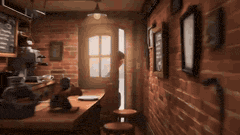

> 🔗 [Original Source](https://x.com/joaquin_arana)

---

### Multi-shot video prompt for a girl stealing earrings from an art museum at night

**Prompt:**
```
Duration: 15s, Scene: Art museum at late night @Image1 Shot 1-Static shot: The girl looks around guiltily and climbs out of the picture frame @Image1 Shot 2-Tracking shot: The girl walks to the jewelry box Shot 3: The girl opens the jewelry box and puts on the earrings inside @Image3 Shot 4-Tracking shot: The girl runs quickly and climbs back into the pictur
```


> 🔗 [Original Source](https://x.com/ChangningL29508)

---

### One-take UGC video of a woman cutting a cake and a cat screaming

**Prompt:**
```
one-take video[14s][Apple iPhone front camera],[User daily UGC style],[Dramatic, exaggerated screaming sound effects],[Digital CGI for @Image1's exaggerated facial expressions and movements][In a static medium shot, a woman in a beige sweater slices a realistic @Image1 cake on a wooden counter. Set in a bright, modern kitchen, the eye-level camera focuses on
```


> 🔗 [Original Source](https://x.com/ChangningL29508)

---

### Stylized 3D Tea Ceremony Video Prompt

**Prompt:**
```
FORMAT: 15s / MULTI-CUT / 6 BEATS / STYLIZED 3D CEREMONIAL PAYOFF SUBJECTS: A tea ceremony master in painterly stylized 3D, surfaces like fired ceramic and ink-washed silk. Expressive eyes holding centuries of stillness, indigo kimono draping like living
```

> 🔗 [Original Source](https://x.com/aimikoda)

---

### Absurd Cute Dog Video Prompt

**Prompt:**
```
Photorealistic cinematic vertical video, 9:16 aspect ratio, extremely plump spherical brown-and-white furry dog-like creature, comically round beach-ball body, tiny stubby legs and paws, short fluffy tail, viewed from extreme low ground-level angle slightly from behind, standing on glossy polished golden wooden floor in a modern minimalist home interior, sof
```

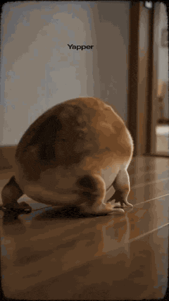

> 🔗 [Original Source](https://x.com/Just_sharon7)

---

### Zootopia Comedic Donut Chase Short

**Prompt:**
```
15-second comedic animated short in the world and visual tone of Zootopia. High-quality stylized 3D animation, expressive facial acting, clean readable slapstick, bright police-station interior, polished reflective floor, warm indoor daylight. Visual comedy only, little or no dialogue. Judy Hopps: small fast rabbit police officer, blue ZPD uniform, hyper-ser
```


> 🔗 [Original Source](https://x.com/promptsref)

---

### Surreal Sky Ocean Battle: Whale vs. Kraken

**Prompt:**
```
Environment: A surreal ocean in the sky where enormous waves float between cloud layers. Waterfalls spill endlessly downward into the clouds below while golden sunset light illuminates the horizon. Action: 15.0s sequence. A colossal sky-whale made of shimmering water currents glides through the floating ocean waves. Rising from the clouds below, a massive kr
```


> 🔗 [Original Source](https://x.com/LudovicCreator)

---

### Chibi Phoebe Close-up Portrait with Baby-Talk

**Prompt:**
```
Photorealistic vertical 9:16 close-up portrait of a charming young East Asian woman with long straight dark hair, wearing a simple black top, soft warm smile and playful sparkling eyes looking straight at camera, gentle baby-talk expression, cozy blurred indoor bedroom background with soft bokeh, diffused golden warm lighting creating a gentle glow on her sk
```


> 🔗 [Original Source](https://x.com/Just_sharon7)

---

### Three-Shot Video Sequence Prompt with Audio Cues

**Prompt:**
```
Shot 1 (0.0-0.5): Macro shot of butter sliding off a spatula onto a polished floor tile. Audio: Splat-skitter Shot 2 (0.5-1.0): Extreme close-up of the Baker's eyes widening as she realizes. Audio: Sharp inhale Shot 3 (1.0-1.5): Her elbow knocks a bag of flour off the counter.
```


> 🔗 [Original Source](https://x.com/GlitterPixely)

---

### Martial Arts Fight Scene in a Japanese Dojo

**Prompt:**
```
The scene is a Japanese-style martial arts dojo, with wooden structures and Japanese doors and windows inside, and a plaque reading \"Hongkou Dojo\" hanging above; the character is a woman with double braids, wearing a red Chinese-style top + blue pants, who fiercely shouts the line \"I'm going to fight 10 people\" before engaging in a fierce fight with multiple
```

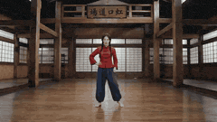

> 🔗 [Original Source](https://x.com/johnAGI168)

---

### Documentary Style Video Prompt with Imperfect Camera Effects

**Prompt:**
```
100% real-life filmed texture, iPhone handheld camera look, documentary style, cold desaturated tones, natural overcast lighting, soft shadows, slight exposure imbalance, sensor noise, lens dirt on edges, imperfect framing, autofocus breathing, random focus shifts,
```

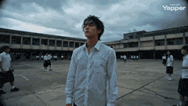

> 🔗 [Original Source](https://x.com/Ankit_patel211)

---

### Character Description for a Kung Fu Chef

**Prompt:**
```
SUBJECTS: Subject 1: Lean kung fu chef with short, sharp-cut hair and defined jawline. Wears a modernized Chinese chef outfit fused with martial arts attire: fitted sleeveless upper garment with mandarin collar, dark matte fabric with subtle sheen; forearms wrapped with cloth
```

> 🔗 [Original Source](https://x.com/0xbisc)

---

### Dark Knight and Armored Taotie Transformation

**Prompt:**
```
Core Theme: Realistic sci-fi tokusatsu; ruin collapse; dark energy convergence; heavily armored dark knight + armored Taotie (pure form) undergoing synchronized transformation; cinematic-level weight and oppression; CG realism blending biotechnology and dark heavy armor aesthetics. Character Setup Face: Strict 1:1 replication of reference image. Facial featu
```

> 🔗 [Original Source](https://x.com/AIToolTracker_)

---

### Chubby Golden Shorthair Cat Eating Chinese Food

**Prompt:**
```
A chubby golden British Shorthair cat with round face, green eyes, pink nose, golden-orange tabby fur and white chest, sitting upright next to a small folding tray table in a dimly lit bedroom at night. The cat is holding chopsticks in its paw and eating from a steaming Chinese
```

> 🔗 [Original Source](https://x.com/Mayz1169)

---

### Chibi penguin girl 'Gugu Gaga' cooking with an angry expression

**Prompt:**
```
Adorable super-deformed chibi penguin girl \"Gugu Gaga\" (Endministrator from Arknights Endfield), fluffy black-and-white penguin hood and body with big sparkling anime eyes, rosy cheeks, tiny body, oversized head, wearing vibrant pink blue white cute tactical outfit. Impatient frustrated expression shifting to playful defiance then triumphant confident smirk,
```

> 🔗 [Original Source](https://x.com/Just_sharon7)

---

### Character Consistency Video Prompt

**Prompt:**
```
@0cb328e2-8254-4ec3-a17e-f6a1ddff3084 as the princess character (red hair, lavender dress, gold crown — maintain appearance throughout). @81c392ed-cc0d-456d-8fbd-9ebceeb2118c as the boy character (brown hair, beige shirt, jeans, holding broom — maintain appearance throughout).
```


> 🔗 [Original Source](https://x.com/Alantaroh)

---

### Dragon Quest Roto's Crest Fusion Magic 'Bagira' Video Generation Prompt

**Prompt:**
```
Scene 1: Fire Magic (Gira) in the Right Hand. An extreme close-up of Polon the Great Sage (a boy dressed as a clown) thrusting out his right hand. As he chants, \"Gira from the right hand,\" a blazing, red-glowing sphere of fire magic ignites from his right palm, illuminating the surroundings with a warm, passionate red light. High quality, cinematic lighting,
```

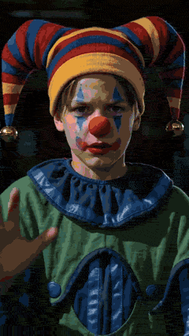

> 🔗 [Original Source](https://x.com/camera_fun_2030)

---

### Epic Historical-Fantasy Battle Video Prompt

**Prompt:**
```
15-second epic historical-fantasy battle, one continuous flying camera shot. At sunset over a colossal desert battlefield, two massive armies collide across a dusty plain. The camera begins high above the battlefield, racing forward through trails of flaming
```

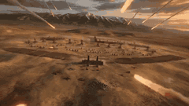

> 🔗 [Original Source](https://x.com/Dheepanratnam)

---

### Determined Penguin Rocket Sled Video Prompt

**Prompt:**
```
determined penguin straps itself into a homemade rocket sled on an icy mountain. The rocket ignites with a massive burst and launches the penguin across the frozen landscape at insane speed, blasting through snowdrifts and leaving a fiery trail behind.
```


> 🔗 [Original Source](https://x.com/slopdotwtf)

---

### J-Horror Subway Scene

**Prompt:**
```
Late night subway. Empty corridors. She is not behind you, she is already in the walls. Created with Seedance 2.0 via @capcutapp A short horror film clip inspired by classic J-horror. She moves through the posters. She is always ahead of you. There is nowhere to run that she has not already been.
```


> 🔗 [Original Source](https://x.com/ChangningL29508)

---

### First-person Parkour Chase Video Prompt

**Prompt:**
```
First-person POV parkour chase across burning city rooftops, 10 seconds, raw handheld footage. The pursued figure ahead is fast — leaping a gap, rolling, barely catching a crumbling chimney. The camera follows, the rooftop giving way slightly underfoot, embers
```


> 🔗 [Original Source](https://x.com/vishastudioai)

---

### Childhood Dream to Reality Transition Video Prompt

**Prompt:**
```
One person appearing, @, 12 seconds, top-tier car commercial quality, cinematic lens, real sense of speed and pressure, smooth temporal transition, consistent character before and after, stable footage, escalating emotion. 0.0-4.0 seconds: Ultra-low angle close-up near the ground, warm golden afternoon sunlight illuminates a beige plush carpet, dust particle
```


> 🔗 [Original Source](https://x.com/johnAGI168)

---

### Stylized Magician Performance Video Prompt

**Prompt:**
```
STYLE Stylized 3D animation with exaggerated forms, rounded or graphic shapes, and expressive motion PEOPLE One male magician wearing a black tailcoat, white shirt, black bow tie, and a black top hat, standing in front A small crowd of audience members standing around and in
```


> 🔗 [Original Source](https://x.com/0xbisc)

---

### Humorous Persian Calf Haircut Transformation Video Prompt

**Prompt:**
```
Theme: Humorous Persian calf salon haircut transformation Visuals: Professional pet salon setting with a ring light, close-up shots of a fluffy brown kid cattle wearing a black grooming cape, realistic grooming tools and techniques creating a comedic “bowl cut” hairstyle Camera: Close-up macro shots, alternating between front view, side profile, and top-down
```

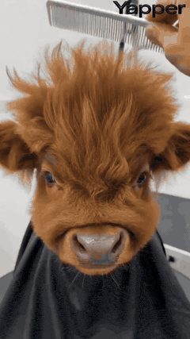

> 🔗 [Original Source](https://x.com/doctorwasif)

---

### Hospital Corridor Emotional Scene

**Prompt:**
```
Testing lighting, \"camera language,\" and subtle human emotion. Lighting: Cool hospital daylight, soft gray window light, slight green medical tint. Color Palette: Soft gray, muted blue, pale green, tired skin tones. Cut 1: A hospital corridor at dawn. A father rushes toward a pediatric room in office clothes, tie loosened, crushed flowers in hand. Cut 2: Thr
```

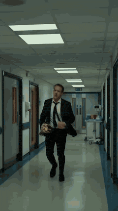

> 🔗 [Original Source](https://x.com/ChangningL29508)

---

### Kanuragan Action-Comedy Scene

**Prompt:**
```
Eastern action-comedy style, 15 seconds, one continuous take. Inside a simple wooden padepokan (traditional martial arts hall) in West Java with a strong Javanese mysticism (kejawen) atmosphere, an elderly inner-power master stands calmly at the center, wearing traditional black attire. His expression is humble and composed, as if he’s only about to demonstr
```

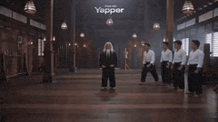

> 🔗 [Original Source](https://x.com/woleswoosh)

---

### Adventurer on Dragon Approaching Pirate Ship

**Prompt:**
```
An adventurer, mounted on her dragon, soars through the sky, the massive creature's wings beating fiercely as it nears a pirate ship on the horizon. The ship, perched on the choppy sea, seems unaware of the looming threat. The dragon, with scales shimmering in the
```

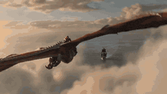

> 🔗 [Original Source](https://x.com/timikareem)

---

### Bus Disassembly and Reorganization

**Prompt:**
```
An old, green, oversized, and extra-tall American-style bus is parked in a dilapidated parking lot in a forest. A young Asian driver slams on the brakes, looking tense and speechless. The bus begins to violently disassemble and reorganize from the inside out,
```

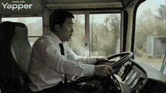

> 🔗 [Original Source](https://x.com/sumiturkude007)

---

### First-person seamless rollercoaster ride through changing environments

**Prompt:**
```
A first-person perspective rollercoaster ride scene. Hands gripping the safety bar are visible at the bottom of the screen. A completely seamless one-take video. No cuts or transitions whatsoever. The rollercoaster travels at high speed on the rails, including steep drops, loops, and sharp turns. The camera naturally shakes as the rider's viewpoint, accompan
```

> 🔗 [Original Source](https://x.com/YaReYaRu30Life)

---

### Viral Game Comedy Video Prompt

**Prompt:**
```
FORMAT: 15s / MULTI-CUT / 6 BEATS / HIGH-VIRAL GAME COMEDY SUBJECTS: A spirited young customer with huge expressive eyes, varsity jacket, sneakers, and bouncy cartoon timing. A charismatic shrimp chef with a tall paper hat,
```


> 🔗 [Original Source](https://x.com/aimikoda)

---

### Epic Fantasy War Video Generation in Extreme Cold Environment

**Prompt:**
```
Part 1: Generate a video based on the female protagonist in the image, an epic fantasy war video, set in an extremely cold, snowy mountain blizzard environment, with strong visual impact, no background music, only retaining the sound effects of the blizzard, wind, footsteps on snow, alien screams, and charging air-breaking sounds; a European female warrior s
```

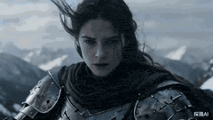

> 🔗 [Original Source](https://x.com/TanLuAI)

---

### Gothic Airship Transformation

**Prompt:**
```
She stands alone on the elevated bridge of a massive fantasy airship at night, with ornate iron railings and glowing cyan accent lights. The ship has a dark gothic organic design with intricate surface details. She gazes out at the dark sky with an empty, distant expression. The night sky and landscape behind her gradually distort and shift into a scorched,
```


> 🔗 [Original Source](https://x.com/ShadeLurk)

---

### White Tiger Hunter in Glacial Canyon

**Prompt:**
```
A vast frozen valley under pale twilight. Towering glacier walls reflect soft blue light across the snowfield while wind sweeps fine snow particles across the surface. The frozen ground glitters with crystalline frost. **Action:** 15.0s sequence from the first-person perspective of a massive glacier tiger stalking prey. The viewer sees white fur edges at the
```


> 🔗 [Original Source](https://x.com/LudovicCreator)

---

### Sitcom Dialogue Scene Prompt

**Prompt:**
```
Wide shot two friends sit on sofa and talk in very excited, dumb voices Friend 1 (eyes wide, super excited, loud): Bro… we’re DONE being broke!! Close-up on Friend 2 (confused but hyped): What’s the plan??? Close-up on Friend 1 (dead serious, leaning in): Vibecoding!
```

> 🔗 [Original Source](https://x.com/Framer_X)

---

### Zero-Gravity Rotating Corridor Fight

**Prompt:**
```
Sci-fi action film style, 15 seconds, one continuous take. The camera enters a white high-tech transport ship corridor. Red warning lights begin to flash, the gravity system suddenly malfunctions, and the entire corridor slowly begins to rotate. The camera closely follows an agent in a dark gray tactical suit at medium-close range as he engages in extremely
```


> 🔗 [Original Source](https://x.com/Dheepanratnam)

---

### Ancient Egyptian Warrior vs. Nile Mud Beast

**Prompt:**
```
an ancient Egyptian warrior king vs a cursed Nile mud beast in flooded temple ruins at night. Close camera, brutal action, heavy rain, black water, lightning, and khopesh combat.
```

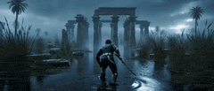

> 🔗 [Original Source](https://x.com/BasetaTube)

---

### Crimson Relic-War Transformation and Angel Fight

**Prompt:**
```
Use the provided images as exact references for the woman, her transformed crimson relic-war form, and the radiant angelic war-saint. 15-second ultra-cinematic live-action sequence in an abandoned financial district boulevard by day, overcast sky, cracked pavement, wrecked cars, broken glass, drifting dust, damaged towers, grounded realism. A woman walks alo
```

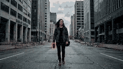

> 🔗 [Original Source](https://x.com/Bubioai)

---

### Giant Prehistoric Beast Wakes Up in the Desert

**Prompt:**
```
A giant prehistoric beast wakes up in the desert. Opens its mouth. And roars.
```

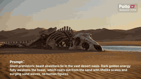

> 🔗 [Original Source](https://x.com/PolloAIFR)

---

### Action Comedy: Polite Master in Dojo

**Prompt:**
```
Eastern action-comedy style, 15 seconds, one continuous take. Inside a wooden dojo, an elderly legendary master has been invited to give a “gentle balance demonstration.” He stands at the center, humble and restrained in expression. Several students step forward one by one to assist. He merely taps a shoulder, wrist, or forehead lightly with a single finger,
```

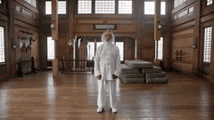

> 🔗 [Original Source](https://x.com/Dheepanratnam)

---

### Action Comedy: Old Master in Hotel Lobby

**Prompt:**
```
Comedy action short film style, 15 seconds, one continuous take. Inside a luxurious hotel lobby, an elderly legendary martial arts master in a simple dark jacket and jeans walks slowly toward a revolving door, completely calm and expressionless. More than ten black-clad attackers rush at him from every direction. He barely uses any force at all, casually bru
```


> 🔗 [Original Source](https://x.com/Dheepanratnam)

---

### Epic Chinese Fantasy CG Video: Four Arts of the Scholar

**Prompt:**
```
Top-tier Chinese fantasy animation CG. Extremely high-saturation color explosion, surrealism, magnificent visual experience. Scene: Atop the vast and boundless sea of clouds, heaven and earth transform into a gigantic Tai Chi illusion. Shot 1 (Close-up transitioning to Medium Shot): [Lute Sound Manifests Lotus] The character sits cross-legged in the air, pla
```


> 🔗 [Original Source](https://x.com/johnAGI168)

---

### Colossal Prehistoric Shark Attack Video Prompt

**Prompt:**
```
A colossal prehistoric great white shark the size of a skyscraper erupts from the violent stormy ocean, jaws wide open, crushing a massive steel cargo container ship in its teeth. Shipping containers tumble and shatter as the vessel buckles and splits apart. The camera opens
```


> 🔗 [Original Source](https://x.com/vishastudioai)

---

### First-Person POV Flying Broomstick Video Generation

**Prompt:**
```
Video type: vertical cinematic video, 9:16 aspect ratio, ultra realistic, 4K, 24fps Perspective: Strict first-person POV from a young Japanese woman riding a flying broom Camera = her eye level No third-person shots, no external camera --- Character (visible elements only): Both hands clearly visible, gripping a wooden broom stick firmly (left and right hand
```

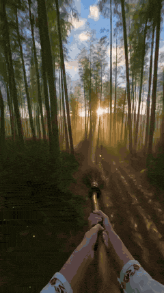

> 🔗 [Original Source](https://x.com/tanabe_fragm)

---

### Kamen Rider Villain Transformation Sequence Video

**Prompt:**
```
vertical video, 9:16, 10 seconds, ultra realistic, cinematic lighting, Japanese woman age 20, natural beauty, medium-length black hair, casual outfit, modern apartment room, soft daylight, high detail skin texture, shallow depth of field, subtle camera push-in Scene starts with the woman sitting casually on a sofa, holding her smartphone, relaxed expression
```


> 🔗 [Original Source](https://x.com/tanabe_fragm)

---

### Bentley S2 Continental ASMR Video Prompt

**Prompt:**
```
FORMAT: 15s / 68 BPM / 6 CUTS / cinematic realism, luxury creator-style car ASMR SUBJECTS: A cream and silver Bentley S2 Continental presented as a timeless luxury icon, long hood, mirror chrome, deep wood veneer, quilted leather, and stately glasshouse
```


> 🔗 [Original Source](https://x.com/aimikoda)

---

### Solitary Figure Rising at Dusk in J. M. W. Turner Style

**Prompt:**
```
\"A solitary figure rises slowly from a stone ledge beside a misty river at dusk, the vast orange sun burning through the haze behind him. [cut] Close-up shot of his feet as he walks past skulls placed on the ground. [cut] Close-up shot of the
```

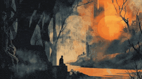

> 🔗 [Original Source](https://x.com/Framer_X)

---

### Car Driving Through Melting Clocks Canyon in Salvador Dalí Style

**Prompt:**
```
\"A car drives through a surreal canyon where enormous clocks carved into the cliffs melt like wax. A colossal stone face watches the car pass, its eyes subtly tracking the movement. [cut] Close-up: spinning wheels gripping the canyon road. [cut]
```


> 🔗 [Original Source](https://x.com/Framer_X)

---

### Dreamlike Kiss in Franz Marc Style

**Prompt:**
```
\"A couple kisses in a dreamlike, colorful painting. The man in blue and the woman in red embrace amid flowing flowers and soft swirling patterns of blue, orange, and gold. White swans glide through the painterly sky as the camera slowly moves toward
```


> 🔗 [Original Source](https://x.com/Framer_X)

---

### Monk Placing a Glowing Flame in Hieronymus Bosch Style

**Prompt:**
```
\"The monk kneels slowly and places a small glowing flame onto the cracked earth. [cut] As he withdraws his hands, the camera begins to circle him in a smooth 360° motion, revealing the surreal landscape in every direction. The flame flickers
```


> 🔗 [Original Source](https://x.com/Framer_X)

---

### Surreal Geometric City Walk in Pablo Picasso Style

**Prompt:**
```
\"Side tracking shot: A man in a dark coat walks through a surreal geometric city of arches and towers. [Cut] Back shot: The man walks through the geometric city, then turns right and enters an alley, moving deeper into the maze-like streets.
```


> 🔗 [Original Source](https://x.com/Framer_X)

---

### Romero Britto style video prompt

**Prompt:**
```
\"Two men play chess in a colorful pop-art style. Bold lines, bright geometric patterns, and expressive faces create a vibrant, playful atmosphere. [cut] Close-up of the other man nervously drumming his fingers on the table. [cut] Side close-up
```


> 🔗 [Original Source](https://x.com/Framer_X)

---

### Van Gogh style video prompt

**Prompt:**
```
\"A lone man stands in a small wooden boat, adrift among turbulent glowing waves beneath a swirling, star-filled sky. The camera drifts slowly over the surface of the water. Cool blue palette, painterly textures, gentle motion blur across the waves.
```


> 🔗 [Original Source](https://x.com/Framer_X)

---

### Hyper-Realistic Football Strike Sequence

**Prompt:**
```
[Film Style]: Hyper-realistic sports cinematography, extreme 12mm fish-eye lens, 4K digital sharpness, high-shutter speed, cinematic stadium floodlights with anamorphic lens flares. [Core Soundtrack]: Immersive stadium atmosphere, rhythmic heavy breathing, the \"thwack\" of a ball strike, and an explosive, muffled crowd roar upon impact. [Video Duration]: 15 s
```


> 🔗 [Original Source](https://x.com/CurieuxExplorer)

---

### The Office Dragon

**Prompt:**
```
quick cuts of a photorealistic \"office dragon\" hyper-flying through multiple office rooms, between people, over desks, around people, in a busy cubicle office. it lands on one persons desk and blows fiery flames at the man. the dragon says \"you're fired\"
```

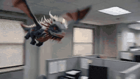

> 🔗 [Original Source](https://x.com/CatabolicState)

---

### CatFu Dojo Fight Scene

**Prompt:**
```
Inside a traditional dojo, an old scarred cat master faces a young energetic kitten.
```


> 🔗 [Original Source](https://x.com/AITutorZone)

---

### Vertical Action Insertion: Tactical Courier Freefall

**Prompt:**
```
Image prompt A tactical courier in matte black climbing gear sits in the open doorway of a tilt-rotor aircraft over a neon megacity at dusk, boots hanging over the edge, wind tearing at straps and cables, skyscrapers below, cinematic action realism. Video motion prompt: Action-thriller, one-take. The camera begins inside the open doorway of a tilt-rotor airc
```

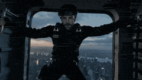

> 🔗 [Original Source](https://x.com/Dheepanratnam)

---

### Master Prompts on Vadoo AI

**Prompt:**
```
Alarms blare, gravity disappears, and a space station begins to collapse… one engineer races against time to stop total destruction.
```


> 🔗 [Original Source](https://x.com/vadooai)

---

### Ramadan to Eid Infinity Zoom Hyperlapse

**Prompt:**
```
Seamless infinity zoom hyperlapse through highly detailed paper-cut art capturing the journey of Ramadan to Eid celebration. The scene begins with a glowing crescent moon above a quiet neighborhood at sahur time, soft lantern lights flickering. The camera zooms into a house window where a family is preparing sahur, then transitions smoothly into a fast-paced
```


> 🔗 [Original Source](https://x.com/woleswoosh)

---

### Female Character Armor Assembly and Flight

**Prompt:**
```
Shot 1(8 seconds) a Powerful female character. Cinematic wide shot, soaring above a dramatic, swirling sea of golden hour clouds as warm orange sunlight catches the mist. Wind whips her hair and clothing with high physical realism. From all directions, sleek futuristic mechanical armor pieces—chest plate, shoulder guards, gauntlets, leg armor, and a glowing
```

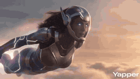

> 🔗 [Original Source](https://x.com/ZaraIrahh)

---

### Close-up of a parrot getting a haircut, scene 1

**Prompt:**
```
01-00 Close-up: The hairdresser uses a comb to lift the feathers on the top of the head for precise trimming. CU, orange-headed parrot wearing a black hair salon cape, stylist hands using silver scissors and a comb to trim top feathers, professional salon lighting, ring light reflection in eyes. 02 00:01 Mid-shot: The hairdresser picks up a spray bottle and
```

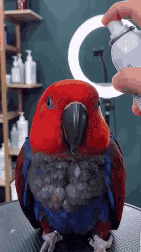

> 🔗 [Original Source](https://x.com/shijianfengxing)

---

### Sci-Fi Action Scene: Woman in Adaptive Suit vs. Tactical Enforcers

**Prompt:**
```
8K ultra-detailed blockbuster sci-fi cinema; a beautiful adult woman in a white-silver adaptive tech suit fights five adult male tactical enforcers inside a red-alert alien mothership corridor. Her suit has blue energy seams, a glowing forearm blade, magnetic shield, and
```


> 🔗 [Original Source](https://x.com/AaronYSun)

---

### Realistic Nightclub Short Video with Face Consistency

**Prompt:**
```
15 seconds, 9:16 aspect ratio, high-definition realistic live-action nightclub short film, with the texture of a close-up vertical shot taken with a mobile phone. The main character should only inherit the facial recognition, face shape, facial feature proportions, hairstyle, skin tone, sense of age, and sweet and playful temperament of the person in image 1
```


> 🔗 [Original Source](https://x.com/two3pro)

---

### Motivated Continuous Camera Movement in Medieval Market Video Prompt

**Prompt:**
```
FORMAT: cinematic continuous shot / motivated camera movement / 15s SCENE A crowded medieval market street inside a stone city at dusk. Narrow cobblestone road, wooden stalls, hanging banners, livestock moving through the crowd. Warm torchlight reflects on damp stones while light mist drifts between buildings. CAMERA CONCEPT A continuous motivated camera mov
```


> 🔗 [Original Source](https://x.com/noman23761)

---

### Viral Pixar-Style Turkish Ice Cream Trick Video Prompt

**Prompt:**
```
FORMAT: 15s / MULTI-CUT / 6 BEATS / HIGH-VIRAL COMEDIC PAYOFF SUBJECTS: A small round-faced figure with huge eyes, copper-red pigtails, a yellow polka-dot dress, and exaggerated cartoon proportions. A tall ice cream vendor with a curled mustache, crimson vest, tilted cap, and a long brass paddle carrying elastic white ice cream. Stylized 3D animation with ro
```


> 🔗 [Original Source](https://x.com/noman23761)

---

### Large-Scale Architectural Transformation and Destruction Physics Video Prompt

**Prompt:**
```
A majestic presence in a dark, flowing mantle stands amidst a vibrant city square, its coat woven with shimmering violet lines that trace hidden patterns — as it lifts a hand, the lines burst into radiant light. A subtle shift forms beneath the surface. The square gently slopes downward. The scene evolves: cars glide toward the shift, water features swirl in
```

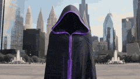

> 🔗 [Original Source](https://x.com/noman23761)

---

### Epic Superhero Transformation and Dragon Fight Video Prompt

**Prompt:**
```
{ \"scene\": \"A terrified girl sprinting through a burning modern city highway at night\", \"subject\": \"young woman, messy hair, torn clothes, intense fear turning into rage\", \"action\": \"she runs at superhuman speed, energy begins glowing from her body, each step cracks the road, cars flip into the air as shockwaves burst outward\", \"transformation\": \"mid-run she
```

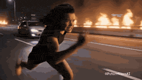

> 🔗 [Original Source](https://x.com/FutureVibesAi)

---

### One-Shot Continuous Fall Through Four Layers of Reality

**Prompt:**
```
one-shot continuous take, on a rooftop at dusk, a young man condenses a golden energy core between his hands, the surrounding air is torn open into a rotating spacetime rift. The camera quickly pushes into the rift, following him as he falls together into the first layer world: an abandoned future city, floating wreckage and gigantic ring-shaped motherships
```

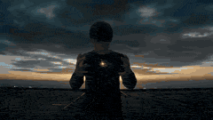

> 🔗 [Original Source](https://x.com/Dheepanratnam)

---

### Celestial Goddess Manifestation at the White House Video Prompt

**Prompt:**
```
A cinematic wide shot set on the lawn of the White House. A young blonde woman in a modern white and yellow outfit stands defiantly. She performs a mystical hand gesture, triggering a glowing purple sigil on her forehead. As she speaks an incantation, her eyes glow with intense golden light, and a massive, ethereal, translucent celestial goddess made of glow
```


> 🔗 [Original Source](https://x.com/Shreyayadav)

---

### Godzilla-Sized White Tabby Cat in Chongqing

**Prompt:**
```
【Style】Mockumentary, mobile Vlog perspective, hyperrealistic CG combined with real scenes, 8K quality, perfect fur physics simulation. 【Duration】15 seconds 【Scene】Hongya Cave in Chongqing or a busy overpass intersection (with magical 8D city feel). [00:00-00:05] Shot 1: Visual spectacle (The Reveal). The scene shows a bustling city street. The camera lifts u
```

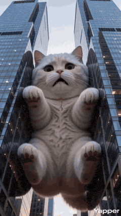

> 🔗 [Original Source](https://x.com/ZaraIrahh)

---

### Woman applying makeup invaded by mud-like liquid

**Prompt:**
```
A woman is applying makeup to her face as the camera shows an open door behind her. Suddenly, a mud-like liquid begins to invade her room. She becomes frightened and climbs onto a chair to escape the mud. The room fills rapidly until she is floating near the ceiling in the liquid, hitting it. With each impact, the ceiling begins to open, revealing sunlight.
```


> 🔗 [Original Source](https://x.com/Riya333S)

---

### Frozen Canyon Dragon Flight

**Prompt:**
```
An adventurer launches her pale ice creature from a frozen cliff's edge — the creature diving over a vast icy expanse as snowflakes scatter. Camera positioned along the cliff captures the creature dropping before extending its wings. The rider leans forward as the creature spirals down between towering ice formations. Below: armored behemoths march across th
```

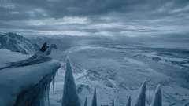

> 🔗 [Original Source](https://x.com/LudovicCreator)

---

### Chai Glass to Futuristic Racing Pod Transformation

**Prompt:**
```
Handheld close‑up of a tiny toy cutting‑chai glass on the palm of a street vendor in an old Delhi lane at evening. He flicks the toy chai glass toward the ground; as it drops, the cup stretches into a futuristic racing pod shaped like a chai glass, steam turning into neon trails, the camera tracking it as it races through a narrow lane between stalls. After
```


> 🔗 [Original Source](https://x.com/FutureVibesAi)

---

### Reference-based Video Generation Prompt

**Prompt:**
```
\"Use the subject from @​Image1 as the main focus. Execute rhythmic dolly, push, pan and tilt movements with the camera referencing the shooting style of @​Video1. The subject’s movement should reinterpret the choreography from @​Video1, creating a cohesive
```

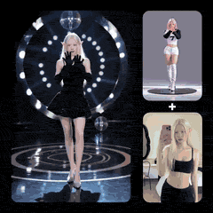

> 🔗 [Original Source](https://x.com/BigMotion_ai)

---

### Heartwarming Woodland Comedy Video Prompt

**Prompt:**
```
FORMAT: 15s / 6 SHOTS / heartwarming woodland comedy / short dialogue STYLE: hyperreal cinematic woodland animation, warm golden hour light filtering through bark cracks, cozy mossy interior of a hollow
```


> 🔗 [Original Source](https://x.com/Dheepanratnam)

---

### Anubis Tickle Scene

**Prompt:**
```
Traditional Chinese style, modern 3D animation. 0-4 seconds: The powerful jackal god Anubis sits on a throne, a mechanical robot holds his arm high, a posture that completely exposes his armpit. A villain stands before Anubis, pressing him for the secret of his power. Anubis is bored and indifferent, saying he will reveal nothing. 5-8 seconds: The villain gr
```


> 🔗 [Original Source](https://x.com/migrok293703)

---

### Ancient Style Singing Performance Video Prompt

**Prompt:**
```
@Image, wearing a gilded, kingfisher-feather-adorned Tang suit with a koi pattern, hair adorned with tassel step-shakers, cinnabar flower mark on the brow, smiling sweetly and radiating spiritual energy; standing in front of a vermilion corridor with carved beams and painted rafters, the background features a hundred flowing glass palace lanterns, a half-con
```


> 🔗 [Original Source](https://x.com/johnAGI168)

---

### Zero Gravity Warrior Fight Video Prompt

**Prompt:**
```
Two elite warriors fighting in zero gravity inside a shattered space station orbiting Earth. Broken metal panels and floating debris drift slowly around them while the blue planet glows through the destroyed walls. The fighters push off floating debris and launch toward each
```


> 🔗 [Original Source](https://x.com/weiinberg)

---

### Saitama vs. Garou Battle Scene

**Prompt:**
```
This depicts the battle between Saitama and Garou. With just a single punch from Saitama, a massive gust of wind erupted, shattering the ground beneath them. Garou, using his incredible speed and agility, parried the blow and launched a counterattack. As the two exchanged a flurry of punches and kicks, the sky and the earth shook with the deafening roar of t
```


> 🔗 [Original Source](https://x.com/Riya333S)

---

### Sneaky Cat Pet Vlog Action Sequence

**Prompt:**
```
Cinematic vertical video (9:16), photorealistic pet vlog style, warm indoor daytime setting, dining area or kitchen counter. CONTINUITY: After the betrayal of EP3, Grayson walked away with dignity. Now he has a new plan. He spots food on the table. Action sequence: ① Grayson's eyes and forehead slowly rise above table edge from below — just his eyes visible,
```


> 🔗 [Original Source](https://x.com/Leoin2019)

---

### Female General Battlefield Video Prompt

**Prompt:**
```
Seedance 2.0 Prompt method: One reference image + 2 sections of prompts to recreate the scene of a female general fighting on the battlefield. Section 1: Scene 1: The female general gallops on horseback, leading thousands of soldiers forward. Use pull-out, elevation, and orbiting camera movements to showcase the magnificent scene of the armies. Scene 2: Mid-
```

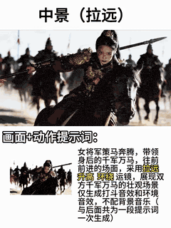

> 🔗 [Original Source](https://x.com/TanLuAI)

---

### Mecha-Armor Transformation Action Sequence Prompt Summary

**Prompt:**
```
A barefoot woman. Urban chaos. Then a full mecha-armor transformation mid-sequence
```

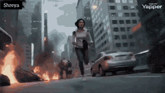

> 🔗 [Original Source](https://x.com/Shreyayadav)

---

### Steampunk Sky Battle Video Prompt

**Prompt:**
```
A cinematic steampunk sky battle. A young sky mechanic girl in leather flight gear stands on the wing of a damaged airship above storm clouds. She wields electrified chain-tools and a glowing wrench staff. Her enemy is a giant thunder roc made of
```


> 🔗 [Original Source](https://x.com/Dheepanratnam)

---

### Gothic Vampire Lord Video Prompt

**Prompt:**
```
Cinematic shots with strong visual impact, centered composition + low-angle upward shot; male protagonist A pale gothic vampire lord, devastatingly handsome, with shoulder-length silver hair slicked back save for a few windswept strands, his features sharply
```


> 🔗 [Original Source](https://x.com/Dheepanratnam)

---

### Warrior Girl Galloping on Misty Battlefield

**Prompt:**
```
A fierce warrior girl with long flowing hair and ornate armor gallops on a powerful white horse across a misty battlefield at golden hour. Cut between dynamic shots: horse hoof striking wet ground in slow-motion with mud exploding, low-angle silhouette
```


> 🔗 [Original Source](https://x.com/BigMotion_ai)

---

### Cyber Ninja vs. Holographic Alien Fight Prompt

**Prompt:**
```
16:9 ratio, epic multi-shot cinematic blockbuster 12-second fight video. A sleek black-neon cyber ninja with dual glowing katanas fights a giant translucent holographic alien overlord with energy whips and teleport dashes in a raining cyberpunk Tokyo street. Dynamic shots: fast vertical tracking as she wall-runs up buildings, circling 360° camera around whip
```

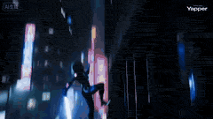

> 🔗 [Original Source](https://x.com/AIARTGALLARY)

---

### Solar Valkyrie Superhero Transformation Prompt

**Prompt:**
```
(Skyscraper Rooftop Theme) Setting: The rooftop of a glass skyscraper during a sunset. The Incident: The floor begins to crack as a winged demonic creature crashes onto the roof, sending glass shards everywhere. Office workers flee toward the helipad. The Action: A woman in a business suit turns back. She reaches toward the sun. The Transformation: Beams of
```

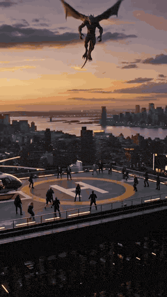

> 🔗 [Original Source](https://x.com/Dheepanratnam)

---

### Warrior's Devastating Strike

**Prompt:**
```
Subject/Character: A warrior wearing a sleek black combat outfit with subtle crimson accents, gripping an elegant black katana that emits a faint red energy glow. Environment/Setting: A wide stone courtyard at dusk with drifting fog, scattered debris, and loose objects such as leaves, dust, and small fragments across the ground. The atmosphere feels tense an
```

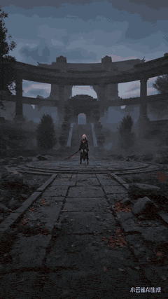

> 🔗 [Original Source](https://x.com/yuday9909)

---

### Still Rings Perfection - 6-Part Shot List

**Prompt:**
```
Still Rings Perfection FORMAT: 15s / 6 SHOTS / men’s apparatus final / no dialogue STYLE: intense arena realism, dramatic overhead lighting, chalk dust, muscle definition,
```


> 🔗 [Original Source](https://x.com/Dheepanratnam)

---

### Ancient Castle Siege by Dragon

**Prompt:**
```
Ancient stone castle on a mountain cliff under dark storm clouds as a gigantic dragon circles above. The dragon dives toward the castle breathing massive streams of fire while soldiers fire arrows and catapults launch flaming projectiles. Low angle shot from the castle
```

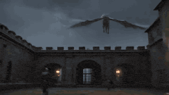

> 🔗 [Original Source](https://x.com/vadooai)

---

### Supercar Spec Ad: Speed is Easy, Control is Everything

**Prompt:**
```
Ultra-realistic motorsport documentary footage. A matte-black hypercar sits in the pit lane of a professional racetrack as mechanics make final adjustments. The camera captures tight close-ups of spinning brake rotors, carbon-ceramic discs, and gloved hands tightening bolts. The car rolls slowly toward the track before launching into a high-speed lap. Camera
```


> 🔗 [Original Source](https://x.com/LudovicCreator)

---

### Realistic Sci-Fi Mecha Combat with Female Warrior

**Prompt:**
```
[Core Theme] Realistic sci-fi mecha combat, ultra-high-speed impact, bone repositioning, mechanical mecha transformation, ultimate kick, IMAX cinematic sci-fi combat [Basic Character Settings] Protagonist: Female warrior Appearance Status: Face covered with dust and scratches, slight blood at the corner of the mouth. Tough but tired expression. Short hair me
```

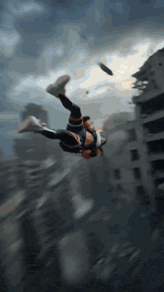

> 🔗 [Original Source](https://x.com/Vampirosapien15)

---

### Ultra-Realistic LEGO Santa Claus Photograph

**Prompt:**
```
Ultra-realistic photograph of a LEGO Santa Claus minifigure driving a rugged red LEGO Unimog snow truck across a snowy mountain pass in the Swiss Alps, deep snowbanks on both sides, pine trees dusted with frost, Santa wearing ski goggles and a fluffy red winter coat, gift boxes bouncing on the truck bed, dramatic mountain light, crisp atmosphere, DSLR realis
```


> 🔗 [Original Source](https://x.com/RizwanAly07)

---

### High-Tech Melee Combat Video Prompt

**Prompt:**
```
15-second short film of pure immersive, high-speed, brutal fight without dialogue. The entire process is an uncontrolled, chaotic, high-tech close-quarters combat, featuring 2 characters @【@Image 1】@【@Image 2】, in a live-action style, close-quarters high-speed killing, no fancy moves, pure hardcore brutal fighting, high-tech fist and foot exchange, blocking,
```


> 🔗 [Original Source](https://x.com/Adam38363368936)

---

### Goku vs. Naruto 2D Battle

**Prompt:**
```
A battle between Goku and Naruto in a 2D animation style. Goku attacks with immense power, delivering a flurry of punches and kicks. The ground cracks and dust flies everywhere. Naruto dodges the strikes with quick turns and blocks, moving with great agility. Each impact creates shockwaves and loud sounds. The movement and body dynamics are clearly depicted,
```


> 🔗 [Original Source](https://x.com/Riya333S)

---

### Ultra-Realistic Fox Hunt Documentary

**Prompt:**
```
Ultra-realistic wildlife documentary footage. A red fox moves cautiously along the edge of a snowy forest at dawn. Its breath forms small clouds in the freezing air. Beneath the snow, faint movements reveal a hidden vole tunneling just below the surface. The fox tilts its head, listening carefully. Suddenly it leaps high into the air and dives headfirst into
```

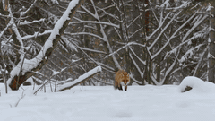

> 🔗 [Original Source](https://x.com/LudovicCreator)

---

### Lego Explorer Chased by Polar Bear

**Prompt:**
```
lego explorer minifigure driving a mini snowmobile across icy terrain chased by a massive roaring polar bear, snow spraying dramatically behind, frozen mist in the air, intense cinematic backlight, dynamic tilted camera shot, blockbuster action style, exaggerated comic motion, crisp lego plastic texture, dramatic cold color grading
```

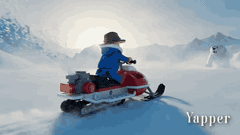

> 🔗 [Original Source](https://x.com/RizwanAly07)

---

### BMX Rider in a Favela

**Prompt:**
```
A woman in her late 20s of Brazilian heritage, her dark curly hair contained under a structured white bucket hat, wearing a matching oversized black utility jacket, wide black trousers, and chunky white boots, rides a bright chrome BMX through a dense favela-style hillside neighborhood of narrow stone alleys and painted walls. At the 2-second mark, she rides
```

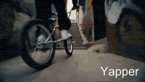

> 🔗 [Original Source](https://x.com/Riya333S)

---

### Toku-Style Sci-Fi Action Transformation Sequence

**Prompt:**
```
Seedance 2.0 Video Generation Prompt This video is a smooth, high-fidelity, Toku-style (special effects style) sci-fi action scene, centered on seamlessly transforming the subject in the @image into full-body power armor, accompanied by smooth energy effects and scene interaction. [Scene Description - Gritty Urban Battlefield] Environment: An abandoned concr
```

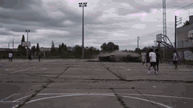

> 🔗 [Original Source](https://x.com/johnAGI168)

---

### Fantasy Ancient Style Transformation Video Prompt (Four Spirits)

**Prompt:**
```
@Image, Fantasy ancient style transformation theme, sequentially transforming into the Four Spirits: Azure Dragon, Vermilion Bird, White Tiger, and Black Tortoise, with the energy of the Four Spirits finally converging in the palm; the overall picture is filled with an ancient style atmosphere, high-definition quality, delicate and layered light and shadow,
```

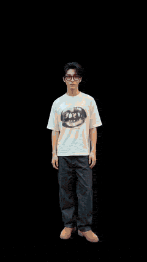

> 🔗 [Original Source](https://x.com/johnAGI168)

---

### Four Seasons Flower Goddess Ancient Style Transformation Video Prompt

**Prompt:**
```
@Image, Four Seasons Flower Goddess ancient style transformation video, strong rhythm, extreme contrast, ultimate visual impact, no dialogue throughout, creating a dreamy, high-key ancient style emotional atmosphere; delicate and rich picture quality, full of high-end feel, using backlighting, hair light, Rembrandt light, and reverse side light to create hig
```


> 🔗 [Original Source](https://x.com/johnAGI168)

---

### Epic Fantasy Action Battle Storyboard Prompt

**Prompt:**
```
【Film Style】 Epic fantasy action, cinematic monster battle, dramatic desert ruins setting, heroic warrior atmosphere, intense combat energy, dynamic camera motion. 【Duration】 12 seconds 【Character】 A battle-hardened female warrior holding a heavy axe, covered in dust and blood from combat. 【Creature】 A massive giant desert scorpion towering behind her with e
```

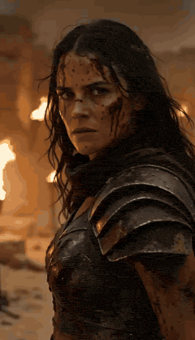

> 🔗 [Original Source](https://x.com/EndFolding79421)

---

### Classic Slasher Horror Storyboard

**Prompt:**
```
【Film Style】 Classic slasher horror, dark bedroom atmosphere, suspenseful pacing, sudden terrifying reveal. 【Duration】 12 seconds 【Characters】 A scared woman sitting on the edge of her bed at night. 【Scene】 A dim bedroom lit only by moonlight from a window. 【Storyboard Script】 [00:00–00:04] Shot 1: The Noise Scene: The woman sits on the bed hearing a strange
```

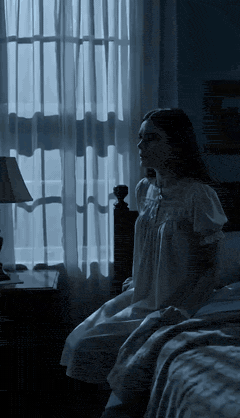

> 🔗 [Original Source](https://x.com/EndFolding79421)

---

### Dark Supernatural Horror Basement Scene

**Prompt:**
```
【Film Style】 Dark supernatural horror, intense suspense atmosphere, flashlight lighting, heavy shadows. 【Duration】 12 seconds 【Characters】 A man exploring a dark basement with a flashlight. 【Scene】 An old basement filled with pipes, boxes, and flickering lights. 【Storyboard Script】 [00:00–00:04] Shot 1: Descent Scene: The man slowly walks down the basement s
```

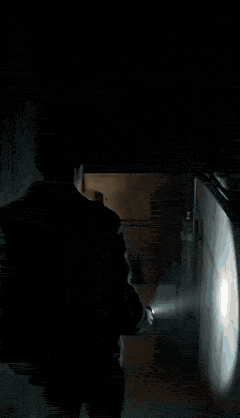

> 🔗 [Original Source](https://x.com/EndFolding79421)

---

### Acoustic Serenade and Emotional Reaction Storyboard

**Prompt:**
```
[00:00 – 00:03 | OVER-THE-SHOULDER MEDIUM SHOT - SLOW PUSH IN] Camera sits just behind and above the red-haired girl's left shoulder, her wild crimson waves and the neck of her acoustic guitar filling the foreground in soft bokeh. Across from her, Ruby, brown curls, dark tee, quilt-covered bed at her back, comes into sharp focus. The warm amber glow of the b
```


> 🔗 [Original Source](https://x.com/MrDavids1)

---

### Alpine Avalanche Escape Stunt Storyboard

**Prompt:**
```
A man in his early 30s, stubble beard, wearing a black armored motorcycle suit with reflective alpine stripes and a tinted racing visor, races a superbike along a narrow mountain highway carved into a cliffside in the Swiss Alps. Snow whips across the road as the camera tracks low beside the motorcycle tires gripping the frozen asphalt. At the 2-second mark
```

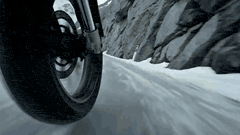

> 🔗 [Original Source](https://x.com/LudovicCreator)

---

### Continuous Shot Transformation and Lightsaber Ignition

**Prompt:**
```
The video begins with [@Image 1] holding a camera, shaking it to shoot close-up of the astronaut's nervous eyes behind the mask. The exhaled breath fogs up the glass, and red head-up display information scrolls. Cut to another shot. Continuously track and shoot her forearm, where the mechanical plate unfolds outward, with pistons and gears meshing together.
```

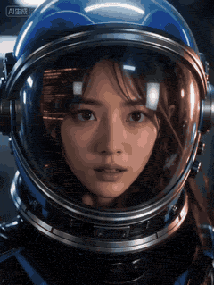

> 🔗 [Original Source](https://x.com/SVD_Studio_Q)

---

### Doomsday: One-Shot POV Escape

**Prompt:**
```
A continuous, unedited perspective, first-person POV, simulating the camera style of an adult male eagle making an extreme-speed escape. Ultra-wide-angle distorted lens, strong stretching at the edges of the frame, extremely exaggerated spatial depth and Motion Parallax. Cinematic macro-oppressive lens advancing at supersonic speed, accompanied by violent wh
```

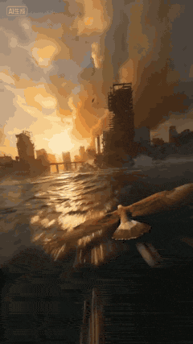

> 🔗 [Original Source](https://x.com/liyue_ai)

---

### Anubis Tickle Scene

**Prompt:**
```
In a scene adopting a modern Chinese 3D animation style, the mighty jackal god Anubis sits on a throne with his hands behind his head. A human approaches him. Anubis, in a casual and bored tone, tells the human that he needs to make him laugh. The human grins and reaches out to scratch Anubis's armpit, causing Anubis to look confused. The camera zooms in on
```


> 🔗 [Original Source](https://x.com/migrok293703)

---

### Interstellar Star-Cruiser Chase and Zero-Gravity Interior Scene

**Prompt:**
```
A vibrant interstellar panorama framed by a swirling purple nebula. A sleek, silver star-cruiser travels silently across the cosmic void. The camera rushes forward at light-speed, rapidly overtaking the ship. The cruiser's glowing geometry becomes massive, a panoramic observation window coming into view. Matching the ship's incredible velocity, the camera ph
```


> 🔗 [Original Source](https://x.com/Dheepanratnam)

---

### Awkward Palace Scene: Mistaken Identity

**Prompt:**
```
9:16 vertical screen, first-person perspective, ancient costume palace drama texture, cinematic high definition. 0-3 seconds: Imperial garden, rockery and flowing water, peonies in full bloom, dappled sunlight. A noble concubine stands by the flowers, wearing pearl hairpins and a phoenix crown, in a bright yellow phoenix robe, holding a round fan. Hearing fo
```


> 🔗 [Original Source](https://x.com/songguoxiansen)

---

### Shaw Brothers Style Fight Scene

**Prompt:**
```
Create a fight scene between two people, aiming for a Shaw Brothers movie feel. The action should be fluid and intense, while maintaining the characters' consistency.
```

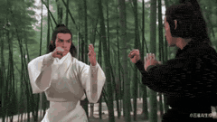

> 🔗 [Original Source](https://x.com/heymarmot_ai)

---

### Martial Arts World with Dragons

**Prompt:**
```
Besides love, hate, and grudges, the martial arts world should also have dragons.
```

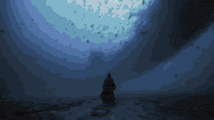

> 🔗 [Original Source](https://x.com/0xDuShi)

---

### Multi-Shot Action-Comedy Scene Prompt: Neon Dumpling Courier

**Prompt:**
```
Concept : Neon Dumpling Courier FORMAT: 15s / 6 SHOTS / action-comedy rooftop chase STYLE: Rainy night market megacity, lantern reds, cyan neon, steam clouds, wet tile roofs, practical comedy timing, ultra-detailed food steam and reflections Shot 01 (0:00-0:02) A young delivery courier launches a compact anti-grav scooter off a noodle-shop awning into a maze
```

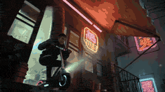

> 🔗 [Original Source](https://x.com/Dheepanratnam)

---

### Ultra-realistic Wildlife Documentary Footage

**Prompt:**
```
Ultra-realistic wildlife documentary footage. A snake slowly slithers through dry grass in the early morning light. Suddenly it spots a small mouse. The camera switches to a tense close-up as the snake strikes quickly and captures the mouse. Natural handheld documentary camera,
```


> 🔗 [Original Source](https://x.com/egeberkina)

---

### Dark Fantasy Library Scene Prompt

**Prompt:**
```
An ancient library where forbidden books open… and the words crawl off the pages. 📖👻 Letters twist through the air, rewriting the librarians into living paper golems.
```


> 🔗 [Original Source](https://x.com/pixazoai)

---

### Elven Archer vs. Towering Brute Battle Scene Prompt

**Prompt:**
```
A lightning-fast elven archer faces a towering brute in a brutal battlefield clash where precision meets unstoppable force.
```

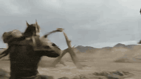

> 🔗 [Original Source](https://x.com/vadooai)

---

### Video Prompt for Teacher Salary Commentary

**Prompt:**
```
show me why teachers only make 60k/year in the united states, make sure it's lit and gets 50 likes
```


> 🔗 [Original Source](https://x.com/beechinour)

---

### Will Smith fighting a spaghetti monster

**Prompt:**
```
Will Smith fighting a spaghetti monster, epic action film scene, different cuts, 80s movie scene
```


> 🔗 [Original Source](https://x.com/im_shahid7)

---

### Character transformation with bruised face and armor reference

**Prompt:**
```
Character \u0026amp; Setup Face based on @ Image1 with identical facial features and hairstyle. His face is bruised with blood at the mouth corner, exhausted expression with restrained pain during transformation. Armor design references @ Image2.
```


> 🔗 [Original Source](https://x.com/doctorwasif)

---

### Stop-motion claymation style with miniature props

**Prompt:**
```
Stop-motion claymation style, handcrafted clay characters with visible fingerprint textures, combined with real miniature props. Materials include authentic tiny fabric, metal parts, and a wooden bench. Warm afternoon backlight, soft shadows, alternating between shallow
```


> 🔗 [Original Source](https://x.com/flowith)

---

### Over-the-shoulder shot of a quiet fantasy landscape with slowly drifting clouds

**Prompt:**
```
Over-the-shoulder shot showing the quiet fantasy landscape in front of him, distant clouds slowly drifting.
```


> 🔗 [Original Source](https://x.com/Framer_X)

---

### Close-up of beard and hair flowing in the wind

**Prompt:**
```
Close-up shot of his beard and hair softly flowing in the wind, dust particles floating in sun rays.
```


> 🔗 [Original Source](https://x.com/Framer_X)

---

### Close-up shot of taco filling shifting and warm light reflection

**Prompt:**
```
Close-up shot of the taco filling slightly shifting as he takes a bite, warm light reflecting on the chopsticks.
```


> 🔗 [Original Source](https://x.com/Framer_X)

---

### Medium shot of man lifting taco with chopsticks

**Prompt:**
```
Medium shot from the side as he lifts the taco with chopsticks, subtle steam rising from the food, peaceful breathing motion.
```


> 🔗 [Original Source](https://x.com/Framer_X)

---

### Old man eating taco slowly with chopsticks in warm golden light

**Prompt:**
```
Old man sitting alone, holding a bowl with a taco and eating slowly with chopsticks. Warm golden sunlight from the side, soft wind moving his hair and loose clothes, small leaves drifting in the air.
```


> 🔗 [Original Source](https://x.com/Framer_X)

---

### Prison riot and determined escapee

**Prompt:**
```
Inside a maximum-security prison, alarms blare as inmates riot in the corridors. Metal doors slam open, guards struggle to regain control, and prisoners flood the hallways in a storm of violence. A determined escapee fights through the chaos, dodging batons and tear gas
```


> 🔗 [Original Source](https://x.com/vadooai)

---

### Man Walking Tiger and Teacup Poodle Skit Video Prompt

**Prompt:**
```
32k ultimate detail quality, full coherence and realism; Image 1 , walking a fierce albino Siberian tiger in the neighborhood, saying to the albino Siberian tiger \"Be good, don't scare the neighbors\"; Image 2 walks towards them, walking a mini white teacup poodle, the poodle barks wildly at the leopard; the albino Siberian tiger is scared by the poodle and j
```


> 🔗 [Original Source](https://x.com/johnAGI168)

---

### First-person POV of a lightning strike descent

**Prompt:**
```
First-person POV of a lightning bolt forming inside a massive thundercloud. Electric tendrils spread outward through dark vapor tunnels. At the moment of discharge the bolt accelerates violently toward the ground. The world blurs past as the lightning branches through the air. The strike hits a city skyscraper and energy explodes across the rooftop. Electric
```


> 🔗 [Original Source](https://x.com/LudovicCreator)

---

### Avengers: Origami Transformation

**Prompt:**
```
Pixar-style smooth animation, cozy bedroom with sunlight from window, toy shelf in background. Camera dolly-in to white table. A stack of origami papers floats gracefully, each sheet folding mid-air into Avengers heroes: red-gold becomes Iron Man, green shapes into Hulk, blue with star into Captain America, black-red into Black Widow, silver-blue into Thor w
```


> 🔗 [Original Source](https://x.com/Shreyayadav)

---

### The Actor's Self-Cultivation Skit Video Prompt

**Prompt:**
```
0-2 seconds: Front medium shot, dog, parrot, and cat three pets lined up looking at the camera, the person appearing in Image 1 raises a hand like a gun and says \"Come, let's rehearse\"; 2-5 seconds: Cut to dog close-up, the person shouts \"Biu!\", the dog dramatically falls down and sticks out its tongue, the person in Image 1 nods and says \"Very good, Wangcai
```


> 🔗 [Original Source](https://x.com/johnAGI168)

---

### Starfighter POV Navigating Asteroid Field

**Prompt:**
```
First-person POV from inside a starfighter cockpit flying through an asteroid field. Control panels glow while asteroids spin past the canopy. Enemy laser fire streaks across the void. The fighter dives through a narrow asteroid tunnel and bursts into open space. Space fighter cockpit POV combat, asteroid field navigation, cinematic sci-fi action, 4K.
```


> 🔗 [Original Source](https://x.com/LudovicCreator)

---

### Astronaut Zero-Gravity Escape Scene

**Prompt:**
```
Astronaut lying on a damaged space station deck. [cut] Close-up shot of the astronaut's face as they open their eyes inside a cracked helmet. [cut] Crew mates launching the escape pod, shouting, 'Airlock is breached, leave him!' [cut] Massive alien tendrils tearing through the exterior hull. [cut] Astronaut trying to push off the deck in zero-gravity.
```


> 🔗 [Original Source](https://x.com/Dheepanratnam)

---

### Ultra-wide Macro FPV Cat Tracking Sequence

**Prompt:**
```
Ultra-wide-angle macro FPV tracking sequence following a cat. The feline is never fully revealed; only fragmented glimpses pass the lens: the twitch of an ear, scattered whiskers, a paw brushing the floor, a swath of fur gliding past the camera. Focus continuously shifts between these fleeting details and nearby environmental hazards. Shot at 120fps to captu
```


> 🔗 [Original Source](https://x.com/AIwithSanchit)

---

### Wingsuit Flying Extreme Sports Video Prompt

**Prompt:**
```
A cinematic video sequence, opening with a tranquil wide-angle aerial shot of a pristine snow mountain at dawn, the peak piercing through vast clouds, the golden sun dyeing the ice pink and gold. The camera transitions to follow a wingsuit pilot who leaps from the summit, immediately plunging into a rapid vertical dive through thin clouds. A follow-cam shot
```


> 🔗 [Original Source](https://x.com/Aleph6Zero9)

---

### Animated Burger and Pizza Street Fight

**Prompt:**
```
Animated burger and pizza slice characters in a playful street fight, food truck background, exaggerated fighting poses, flying toppings, comic-book action style with motion lines. Dynamic mid-air action moment with cheese stretching and lettuce flying, dramatic impact effects like POW and BAM floating in the air. Bright neon street lights and colorful graff
```


> 🔗 [Original Source](https://x.com/AIwithkhan)

---

### iPad Kid Cheeto Hands Video Prompt

**Prompt:**
```
make a video a 5 year old ipad kid would enjoy while smearing his cheeto stained hands on the screen. make no mistakes. aim for 50 twitter likes
```


> 🔗 [Original Source](https://x.com/pczzy)

---

### AI Influencer Idol Video Prompt

**Prompt:**
```
Create a cute idol-like video that sings about the daily life of the AI influencer \"Mona\" (reading: Mona), who starts every morning by posting \"Oha Mona\" on X. She is a positive thinker who wishes to cheer everyone up through AI and wants people to be comforted by Mona. Lyrics [Verse 1] A dazzling morning, earlier than the alarm. My finger reaches for the ti
```


> 🔗 [Original Source](https://x.com/xc5_)

---

### Ancient Chinese Costume Change Video Prompt (10-Second TikTok Style)

**Prompt:**
```
@Image, 10-second Douyin (TikTok) viral ancient style costume change, vertical screen 9:16, action points transition smoothly without abrupt cuts, character is agile and elegant, warm soft light filter, Chinese ancient aesthetic, clear image quality with full atmosphere, mid-shot follow camera movement, tight rhythm; 0-1 second: Plain simple Ruqun (skirt), g
```


> 🔗 [Original Source](https://x.com/johnAGI168)

---

### Video Consistency Requirements

**Prompt:**
```
The entire film must maintain a unified visual style, with no style drift, and consistent color tone and texture throughout. The same character must maintain consistent facial features, hairstyle, clothing, weapons, and injury locations, without changing faces or people. The same scene must maintain a consistent environment, lighting, background, and spatial
```


> 🔗 [Original Source](https://x.com/msjiaozhu)

---

### Candid Late-Night Pizza Moment with Handheld Camcorder Aesthetic

**Prompt:**
```
A dim bedroom lit by a harsh on-camera flash. White bedsheets fill most of the frame, slightly wrinkled and textured. An open pizza box sits nearby on the bed, its lid tilted back, revealing a partially eaten pizza. A young woman lies on her back across the bed, head tilted slightly toward the camera. She wears a playful shirt patterned with cartoon pizza sl
```


> 🔗 [Original Source](https://x.com/saniaspeaks_)

---

### Epic Space Combat Scene with Cosmic Energy and Zero-Gravity Camera

**Prompt:**
```
A woman in her late 20s wearing a flowing black combat coat threaded with glowing silver star patterns leaps across fragments of shattered asteroids drifting in deep space. Facing her is a tall alien warrior clad in crystalline armor emitting pulsating violet energy from within its translucent body. She attacks in a continuous chain — rapid teleport dashes,
```

> 🔗 [Original Source](https://x.com/LudovicCreator)

---

### Domestic Cats Lightsaber Duel in Living Room

**Prompt:**
```
Two realistic domestic cats standing upright in a dimly lit living room at night, dramatically dueling with glowing lightsabers. One chubby orange cat holds a red lightsaber while a striped tabby cat swings a blue lightsaber. The cats move like skilled warriors, jumping, spinning, and clashing their sabers with bright sparks and light reflections. The blue b
```


> 🔗 [Original Source](https://x.com/AIwithkhan)

---

### High-Speed Female Warrior Combat Sequence (Simplified Chinese)

**Prompt:**
```
Rapid cut editing. 3D CGI animation with real-time game engine texture, dynamic lighting, and post-processing bloom. Smooth 60fps viewing experience. The protagonist is a beautiful female warrior. The animation unfolds according to the following process, synchronized with the music rhythm. A nimble warrior in flowing attire rushes forward with blurred speed,
```


> 🔗 [Original Source](https://x.com/ShadeLurk)

---

### Controversial Close-Up Video of Cosplay Model

**Prompt:**
```
'Real actor cosplay model at anime expo, ultra HD camera focusing on bare feet without socks, camera pans around character, slowly moves up to buttocks, finally lands on chin with face hidden.' 'Camera pulls back showing character's upper body, displaying figure in scene, seductive expression, blowing kiss at camera, softly saying: am I pretty?' '8K HD quali
```


> 🔗 [Original Source](https://x.com/HomoDeusLite)

---

### Domestic Catastrophe: Expanding Soap Foam Fills Neighborhood

**Prompt:**
```
First-person POV camera looking down at two hands in latex kitchen gloves pressing a soap dispenser at a bathroom sink, a completely ordinary domestic morning. The soap emerges. At the 2-second mark the foam expands beyond the palm still expanding, pushing both hands outward, filling the sink basin in four seconds, overflowing the counter in six. Camera pull
```


> 🔗 [Original Source](https://x.com/rovvmut_)

---

### Soldier Close-up Combat Scene

**Prompt:**
```
Extreme close-up shot begins: A cloaked soldier shouts loudly in English, “All units, move out! Fire at will!” while continuously firing a rifle. The muzzle flashes bright blue-white flames, shell casings eject rapidly from the side, the rifle recoil visibly shakes his shoulder, continuous firing causes air heat distortion effect above the barrel, the image
```

> 🔗 [Original Source](https://x.com/BURLY_STUDIO)

---

### Celebrity Vlog/Red Carpet Sequence

**Prompt:**
```
Theme: Generate a video of a girl 【@Image 1】 getting ready in a makeup room for a dinner party, driving a sports car, and finally walking the red carpet. Quality and Shots: 4K resolution, cinematic quality, high resolution. Primarily close-up shots. No subtitles, no dialogue. 0-1S: Girl 【@Image 1】 bare-faced, wearing pajamas, stretching and getting up. 1-2S:
```


> 🔗 [Original Source](https://x.com/liyue_ai)

---

### AI Girlfriend Interactive Scene

**Prompt:**
```
Subject: Photorealistic style, a young beautiful Asian woman sitting by the bay window of a high-rise building, wearing a very loose white shirt, left shoulder exposed, POV perspective, woman trying to block the lens with her right hand, subtle smile on her face, natural lighting, delicate and realistic, with film grain. Camera maintains subjective POV persp
```


> 🔗 [Original Source](https://x.com/HomoDeusLite)

---

### Short Comedy Sketch: 'Treat Company as Home'

**Prompt:**
```
Reversal comedy, real movie high-definition texture, Douyin short video hit, 2 people featured Characters: Guy @Image 1 (Post-00s awakened worker), Gentle Girl @Image 2 (Boss/HR who loves to give motivational speeches) Scene 1: Company office area, evening (slightly dim light, suggesting end of work day) - Guy: Wearing a backpack, preparing to clock out and
```


> 🔗 [Original Source](https://x.com/johnAGI168)

---

### Street Fighter Classic Battle Video Generation

**Prompt:**
```
@Image 1 @Image 2, live-action video, perfectly recreating a classic Street Fighter game's fierce battle. The top of the screen features two dynamically decreasing health bars, with character portraits and 'ROUND 1' 'FIGHT!' text below the health bars, and score displayed in the corner; 0-1.5 seconds: medium shot opening standoff, one person crouches and cha
```


> 🔗 [Original Source](https://x.com/johnAGI168)

---

### Short Comedy Sketch: 'Take Away'

**Prompt:**
```
# Reversal Comedy Short Video Shooting Prompt — “Take Away” Chapter Reversal comedy, real movie high-definition texture, Douyin short video hit, 2 people featured Characters: Guy @Image 1 (Customer with a unique thought process), Gentle Girl @Image 2 (Dedicated milk tea shop employee) Scene 1: Internet-famous milk tea shop counter - Guy: Dressed casually, st
```


> 🔗 [Original Source](https://x.com/johnAGI168)

---

### Luxury Watch Assembly from Golden Sand Particles

**Prompt:**
```
Creative cinematic scene where golden sand particles swirl in the air and transform into tiny mechanical watch parts, gears and screws forming out of the particles and assembling into a luxury wristwatch, magical yet realistic transformation, dramatic lighting, macro detail, ultra cinematic, 8K.
```


> 🔗 [Original Source](https://x.com/AIwithSynthia)

---

### Kamen Rider Transformation Sequence

**Prompt:**
```
Realistic dark Tokusatsu | Insect bio-mimetic armor aesthetic | Damaged armor | Battle-worn transformation | Wilderness ruins 【Character and Basic Settings】 Face: Upload image referencing Image 1; facial features, face shape, and hairstyle must be 100% restored. Retain dark traces, can be beautified, but the overall facial expression should be cold. Expressi
```


> 🔗 [Original Source](https://x.com/Magncsans)

---

### Inspirational business speech short video prompt

**Prompt:**
```
A 15-second inspirational business speech short video, 4K ultra-clear, cinematic camera movement, warm gold + dark blue high-end stage lighting; a female entrepreneur around 30 years old, wearing a textured black velvet suit jacket + off-white silk shirt + black trousers, adorned with exquisite earrings, necklaces, rings, bracelets, and other jewelry, arms c
```


> 🔗 [Original Source](https://x.com/johnAGI168)

---

### Girlfriend Waking Up Vlog Scene

**Prompt:**
```
【Style】Daily Vlog casual shooting style, iPhone original camera texture, slightly dynamic blurred picture, unintentional capture of life feeling, low-quality graininess, authentic and unpretentious, full of daily life sense. 【Duration】15 seconds 【Protagonist】Fair complexion, facial features reference @【@Image 1】, straight smooth black long hair naturally dra
```


> 🔗 [Original Source](https://x.com/Adam38363368936)

---

### Hyper-realistic Football Action Shot Video

**Prompt:**
```
Create a hyper-realistic, high-motion football action shot captured from a low, dynamic sideline angle during a chaotic play. A running back in white uniform charges forward toward the camera, mid-stride, with intense motion blur on his limbs and debris flying through the air. Blue-jersey defenders collide and reach out around him, creating a tunnel of bodie
```


> 🔗 [Original Source](https://x.com/CalvinHollywood)

---

### Childhood Conversation Video Prompt

**Prompt:**
```
Original characters: child girl from (image1) on the left side of the frame and adult woman from (image2) on the right side, as if they are two versions of the same person, sitting opposite each other on the bench of a classic children's carousel. The carousel rotates at a normal rhythm; blurred motion background behind — blooming spring trees, soft bokeh, b
```


> 🔗 [Original Source](https://x.com/Kiber_Alla)

---

### 2D Animated Fight Scene Between Goku and Naruto

**Prompt:**
```
A fight between Goku and Naruto is shown in a 2D animation style. Goku moves his head powerfully, delivering many punches and kicks. The ground cracks and dust flies up. Naruto spins his body quickly many times.
```


> 🔗 [Original Source](https://x.com/NACHOS2D_)

---

### Deadpan Absurdist Comedy Video Prompt

**Prompt:**
```
A street food vendor in his 40s, broad shoulders, white apron, red bandana headband, stands behind a wok on a night market stall. Just as he prepares a dramatic toss, his phone starts ringing in his pocket. Without hesitation he flips the vegetables and sauce into the air in a perfect arc above the wok under a burst of flame, and at the same moment pulls out
```


> 🔗 [Original Source](https://x.com/rahulnanda86)

---

### Dunhuang Flying Apsara Video Generation Prompt

**Prompt:**
```
0-2 seconds: A Dunhuang Flying Apsara beauty floats out from a gilded mural, holding a gilded lotus lantern. As the lantern light flows, her red and gold celestial robes are radiant like sunset clouds, and the caisson ceiling pattern behind her (interwoven red, gold, and lapis lazuli blue) shimmers with light. 2-4 seconds: She steps on a seven-colored lotus
```


> 🔗 [Original Source](https://x.com/johnAGI168)

---

### Seamless Sword Fight Sequence Prompt

**Prompt:**
```
This is the opening and closing scene of a sword fight. Based on these two scenes, create a seamless sequence of an armored male knight with a red cape and sword fighting a giant horned monster with glowing red eyes in a snowy mountain battlefield. The fight is fast, intense, and relentless from beginning to end. Use multiple cinematic camera angles such as
```


> 🔗 [Original Source](https://x.com/Kangaikroto)

---

### Hyperrealistic miniature diorama of a clay figure collapsing on a bed

**Prompt:**
```
Hyperrealistic miniature diorama, stop-motion clay animation, handcrafted tactile materials, real fabric, professional studio animation style — miniature bedroom, Friday night, clay figure stumbles through the door with enormous hollowed-out face, dark circles sculpted deep under tiny dead eyes, dragging his feet, real fabric shirt wrinkled and untucked [cut
```


> 🔗 [Original Source](https://x.com/AleRVG)

---

### Sneaky Kitten Scrolling on Phone Under Covers

**Prompt:**
```
Realistic style, vertical screen, warm cinematic lighting.[0-5s] Close-up shot on bed, handheld slight shake, shallow depth of field.Late night bedroom with warm dim bedside lamp glow. A small orange tabby kitten is lying in bed under a cozy blanket, secretly scrolling on a phone. The phone screen casts a soft blue glow on its furry face. Its expression is f
```


> 🔗 [Original Source](https://x.com/abulu8)

---

### Video generation prompt for a cosplay model's foot and leg focus

**Prompt:**
```
Real actor playing a live-action role, a model participating in a cosplay exhibition. An ultra-high-definition camera focuses on a pair of beautiful feet wearing high heels. The camera circles the character, slowly pulling up, the legs are wearing black stockings, moving up to the character's hips, and finally the camera lands on the character's chin, obscur
```


> 🔗 [Original Source](https://x.com/MrGeekmister)

---

### Taiwanese Girlfriend Night Market POV Video

**Prompt:**
```
15-second vertical video 9:16 aspect ratio, POV visual quality from a phone's front camera, handheld shake + frequent exposure switching between bright and dark, mixed night market lighting bokeh + warm yellow light bulbs from stalls + neon signs, noisy environment audio with wind noise and human background noise. The main character is a Taiwanese girl [Imag
```


> 🔗 [Original Source](https://x.com/msjiaozhu)

---

### Romantic Couple Interaction Video Prompt

**Prompt:**
```
0-3 seconds: The screen is filled with soft, hazy light. She has just washed her hair, which is damp and slightly curled, with tiny water droplets clinging to the ends. She is wrapped in a light-colored bath towel, nestled on the sofa. She holds a white porcelain cup in both hands, with steam rising gently from the hot tea. She smiles at you with curved eyes
```

> 🔗 [Original Source](https://x.com/liyue_ai)

---

### Hyperrealistic Close-up Video of Cosplay Model

**Prompt:**
```
Real actor performing live action, a model participating in a cosplay convention. An ultra-high-definition camera is aimed at a pair of bare feet without socks. The camera circles the character, slowly pulling up to the character's hips, and finally resting on the character's chin, where the entire face is not visible. The camera pulls back to reveal the cha
```


> 🔗 [Original Source](https://x.com/liyue_ai)

---

### Ragdoll cat attempts to steal fish at a red light

**Prompt:**
```
a city street during a red light; everyone is stopped and waiting. a young man is on a bicycle with a ragdoll cat perched on the back. beside him, a beautiful young woman is on another bicycle, carrying a basket full of dead fish on her rear rack. the camera angle is a pov shot from inside a car parked directly behind the two bicycles. the ragdoll cat reache
```


> 🔗 [Original Source](https://x.com/ViralOps_)

---

### Man working in a lab with ambient sound

**Prompt:**
```
man is working in the lab: [cut] multiple camera shots of a man working in the lab, taking notes, doing experiments NO MUSIC, NO TALKING, ONLY AMBIENT SOUND
```


> 🔗 [Original Source](https://x.com/Framer_X)

---

### Harry S. Truman walking towards the camera

**Prompt:**
```
man in brown suit with glasses and a hat gets out of the car. He is the president of the US, Harry S. Truman [cut] The president is walking towards the camera in an excited manner and is smiling, looking around and acknowledging other people who are looking at him [cut] The camera is now behind him, showing an over the shoulder shot of the president looking
```


> 🔗 [Original Source](https://x.com/Framer_X)

---

### Twelve Flower Goddess Transformation Video Prompt

**Prompt:**
```
12 Flower Goddesses quickly turn and wave their hands to change into different poses and outfits (Plum blossom, Apricot blossom, Peach blossom, Peony, Pomegranate flower, Lotus, Hollyhock, Osmanthus, Chrysanthemum, Hibiscus, Camellia, Narcissus) Stunning special effects corresponding to 12 types of floral pattern clothing and backgrounds, filled with fairy a
```


> 🔗 [Original Source](https://x.com/liyue_ai)

---

### Chinese Dreamscape Video Prompt

**Prompt:**
```
If reality is too tiring, go fly in the Seedance 2.0 Chinese dreamscape. When blue and white porcelain transforms into a Pegasus, and the origami in hand turns into a celestial crane flying through a window, Briefly escape the cyberpunk-like steel jungle, To attend an oriental aesthetic miracle in heavy snow, When the wind rises, all fatigue will be healed.
```


> 🔗 [Original Source](https://x.com/AIYIRAN1231)

---

### Taiwanese Girlfriend POV Video Prompt

**Prompt:**
```
15 seconds, vertical screen 9:16, mobile phone front camera texture, slight overexposure + occasional focus blur from autofocus. Late-night Taipei street scene, contrast between the cold white fluorescent light of the convenience store and the warm yellow light of the outdoor street lamps. The main character is a Taiwanese girl [Image 1], low ponytail, weari
```


> 🔗 [Original Source](https://x.com/msjiaozhu)

---

### Epic Fantasy Awakening Video Prompt (Aerial Version)

**Prompt:**
```
**Visual Description:** This is a magnificent fantasy epic aerial shot, showcasing the grand visual of a desolate land awakening from slumber. The main color palette consists of oppressive dark iron black, dull deep red, and eerie underworld purple. The camera enters with an extremely high-altitude俯瞰 (bird's-eye) view, using highly dynamic camera movements t
```


> 🔗 [Original Source](https://x.com/NanoPhotoAI)

---

### WWI Continuous Tracking Shot Prompt

**Prompt:**
```
WWI soldier sprinting across an open battlefield during a massive assault, muddy cratered ground, barbed wire, artillery explosions tearing through the field, dozens of soldiers charging across the landscape, chaos and debris everywhere, the soldier running straight through the battlefield while others fall or collide around him, massive explosions erupting
```


> 🔗 [Original Source](https://x.com/aimikoda)

---

### Uzbek Puppet Stop-Motion Narrative Prompt

**Prompt:**
```
A stop-motion wooden puppet Uzbek woman with round painted face, black braided hair and doppi hat, sitting still at a table with her hands folded, traditional ceramic bowls and teapot in front of her in a warm clay-walled room [cut] different camera shots of [puppet woman carefully pouring hot tea from a clay teapot into a small patterned bowl], [she lifts t
```


> 🔗 [Original Source](https://x.com/Khusandjemilov)

---

### Zombie Hunter Supermarket Scene

**Prompt:**
```
A woman zombie hunter goes into a overrun supermarket during a zombie apocalypse to get supplies. It is abandoned. She gets attacked by a zombie but makes it out. She is alone. High action scene.
```


> 🔗 [Original Source](https://x.com/rahulnanda86)

---

### Product Replacement in Video

**Prompt:**
```
Replace the perfume in the gift box shown in the upper-left video with the cream from the lower-left image, while keeping the motion and camera movement unchanged.
```


> 🔗 [Original Source](https://x.com/IamMiaChase)

---

### Detailed Scene Prompt for Zombie Chase

**Prompt:**
```
SCENE: abandoned fog-filled city street at night ACTORS: A: panicked runner in torn dark jacket B: multiple decayed zombies emerging from dark alleys and broken storefronts ENVIRONMENT: crumbling buildings with shattered windows, wet cracked asphalt street, abandoned
```


> 🔗 [Original Source](https://x.com/aimikoda)

---

### Prison Cell Dialogue Prompt

**Prompt:**
```
A man sitting in his prison cell. [cut] Female guard walking through the prison corridor. [cut] The guard comes to the man's cell and stops behind the bars. [cut] Back shot of the guard standing behind the bars. [cut] Close-up shot of the prisoner saying, \"Did you get what I asked for?\" No music.
```


> 🔗 [Original Source](https://x.com/Framer_X)

---

### Battlefield Survival Scene Prompt

**Prompt:**
```
Man lying on a battlefield. [cut] Close-up shot of the man's face as he opens his eyes. [cut] Other soldiers running away, shouting, \"Leave him!\" [cut] Enemy airplanes flying through the sky. [cut] Soldier trying to get up. No music.
```


> 🔗 [Original Source](https://x.com/Framer_X)

---

### Flute Transition and Transformation Video Prompt

**Prompt:**
```
A girl, bare-faced, fiddling with a flute in the living room. She picks up the flute and spins it in her hand like Sun Wukong holding the Ruyi Jingu Bang, then casually tosses it into the air. Upon catching it, the girl performs a beat-synced transformation: the style is photorealistic, rich lighting, natural light, full of texture, photographic style. It is
```


> 🔗 [Original Source](https://x.com/liyue_ai)

---

### Lace Mini Skirt Model Display Sequence

**Prompt:**
```
A beautiful woman wearing a white lace mini skirt, standing and displaying it indoors. Action sequence: 1. Walks into the frame, stands naturally 2. Turns around to display the skirt 3. Lifts leg to show legs 4. Covers face shyly 5. Stands sideways and freezes. Visual style: - Natural lighting, soft tones - Simple background, highlighting the figure - Contin
```


> 🔗 [Original Source](https://x.com/qtwaiter)

---

### 12-Second Quick Change Collection

**Prompt:**
```
Keep the character completely consistent with the reference image, 100% identical facial features, maintain the same bone structure, eye distance, and jaw geometry, prohibit beautification, prohibit changing age. 12-second quick change collection: pure black environment, 5 completely different contrasting looks, relaxed and natural expression, (JK Lolita sty
```


> 🔗 [Original Source](https://x.com/johnAGI168)

---

### First-Person Wuxia Video Prompt

**Prompt:**
```
Style: First-person POV, ink-wash wuxia (Chinese martial arts aesthetic), 4K ultra HD, perfectly synced audio and visuals, cinematic camera movement, precise beat matching, silky smooth transitions, highly immersive, real person on camera, no face swap, no
```


> 🔗 [Original Source](https://x.com/ViralOps_)

---

### Hollywood Blockbuster Style - Blue Cat vs. Giant Dragon

**Prompt:**
```
Hollywood blockbuster special effects style, realistic CG rendering, HDR high dynamic color. 0-3 seconds: Wide aerial shot, modern city skyline at dusk, the sunset is swallowed by an unnatural dark red cloud layer, a low roar faintly comes from the rolling dark clouds, and pedestrians on the ground stop in their tracks.
```


> 🔗 [Original Source](https://x.com/songguoxiansen)

---

### Primal Race Quick Cut Video Prompt

**Prompt:**
```
Race sequence, presented in rapid cinematic coverage with dynamic angles and intense motion energy - QUICK CUTS - BEAT SYNC HARD EDIT FORMAT: 15s / 120 BPM / 12 SHOTS / HARD CUT.
```


> 🔗 [Original Source](https://x.com/aimikoda)

---

### When I Get Ready for Bed: Couple Cuddling Scene

**Prompt:**
```
Scene: Modern style hotel room, night. Characters: • Male lead: Hair highlighted in gold and black. Wearing light-colored (off-white/cream) silk or satin pajamas with black piping. • Female lead: Long black hair. Wearing a simple white crew-neck short-sleeved T-shirt, full chest, visible collarbone, lying on the bed. Action and Plot: Scene 1 (00:00 - 00:01):
```


> 🔗 [Original Source](https://x.com/liyue_ai)

---

### First-Person Perspective Couple Interaction Video Prompt

**Prompt:**
```
First-person male perspective, on the living room sofa, a young woman (facial image reference @【@Image 1】) is lying on her side wearing loose white pajamas, one hand supporting her head, the other holding a phone and scrolling through videos. Her legs are casually draped over the armrest of the sofa, exposing her fair calves and ankles. She is focused on the
```


> 🔗 [Original Source](https://x.com/Adam38363368936)

---

### Midjourney Oil Painting Prompt (Driver's Hand)

**Prompt:**
```
An oil painting of a driver's hand on the steering wheel, driving along a road over wooded hills. --sref 393671733 2616242445 3105363233 79870580 2286149422 4118033478 --v 6.1
```


> 🔗 [Original Source](https://x.com/GlacierKilo)

---

### Zibo City Promotional Video Prompt

**Prompt:**
```
A vibrant modern cityscape of Zibo, interwoven with the magnificent landmark Haidai Tower night view and the antique architecture of Zhoucun Ancient Commercial City. The screen contains extremely rich and rapid scene switching, sometimes colorful glass crafts, and sometimes endless city traffic. The camera quickly pans and shuttles in sync with the strong mu
```


> 🔗 [Original Source](https://x.com/SVD_Studio_Q)

---

### Ultra-realistic Macro Miniature City Prompt (Structured JSON)

**Prompt:**
```
{ \"project\": \"Global Miniature City Series\", \"aspect_ratio\": \"9:16\", \"style\": \"Ultra-realistic macro miniature city model\", \"composition\": { \"camera_angle\": \"low-angle macro\", \"framing\": \"city centered, base fully visible\", \"tilt_shift\": true, \"depth_of_field\": \"shallow\", \"lens\": \"85mm macro, f/1.8\" }, \"base\": { \"material\": \"dark polished wood\", \"edges\": \"sm
```


> 🔗 [Original Source](https://x.com/xiaomiaode5383)

---

### Man Driving Recklessly (Multi-Scene Video Prompt)

**Prompt:**
```
A man walks out of his house towards the parked car. [Cut] The man gets into the car. [Cut] The man starts the engine; the flower on the dashboard trembles slightly. [Cut] The man accelerates quickly and drives wildly. [Cut] Another shot of the man driving wildly, hitting trash cans and mailboxes along the way. [Cut] Pedestrians scream. No music.
```


> 🔗 [Original Source](https://x.com/0xluffy_eth)

---

### Dynamic Sword Fight on a Neon-Lit Rooftop

**Prompt:**
```
The two female warriors engage in an ultra dynamic sword fight on the neon-lit rooftop. Intense sword clashing with sparks flying, agile dodges, and powerful strikes. Cinematic camera movement tracking the action, high quality, fluid motion
```


> 🔗 [Original Source](https://x.com/nonameoasis)

---

### LLM Memory Dump Prompt (for Claude/ChatGPT)

**Prompt:**
```
I am switching to another service and need to export my data. Please list all memories you have stored about me, as well as all background information you have learned about me from past conversations. Output all content in a single code block so I can easily copy it. Format each entry as: [Date Saved (if applicable)] - Memory Content. Ensure the following a
```

> 🔗 [Original Source](https://x.com/indigox)

---

### Obelisk The Tormentor Punch Prompt

**Prompt:**
```
Obelisk The Tormentor Punch, best quality, perfect physics, perfect anatomy, masterpiece
```


> 🔗 [Original Source](https://x.com/Origin_Almighty)

---

### Futuristic Sci-Fi Action Scene

**Prompt:**
```
A compact yellow electric creature generating lightning attacks while fighting technologically advanced alien troops in a futuristic ringworld battlefield, cinematic sci-fi action, dramatic lighting
```


> 🔗 [Original Source](https://x.com/charliegreenman)

---

### Chaotic Food Fight Scene

**Prompt:**
```
A chaotic food fight erupting inside a crowded restaurant, captured through at least 10 cinematic shots with dramatic slow motion sequences, as dishes and food slam into people’s faces and explode on impact, splattering everywhere in vivid detail.
```


> 🔗 [Original Source](https://x.com/aimikoda)

---

### Persian Baddies Liberation Scene (Humorous)

**Prompt:**
```
Show my support for all the beautiful Persian baddies that are about to get liberated. Get me at least three of their numbers.
```


> 🔗 [Original Source](https://x.com/charliebcurran)

---

### Shenzhen Tourism Promotional Video

**Prompt:**
```
The collision of extreme cyberpunk and tropical seaside, 8K ultra-clear, FPV drone extreme speed camera movement, dynamic large-scale time-lapse photography (Hyperlapse), and extremely high-density fragmented flash editing. Core concept: Showcase the “Shenzhen Speed.” Use highly visually impactful hard cuts and a sense of spatial folding to perfectly compres
```

> 🔗 [Original Source](https://x.com/johnAGI168)

---

### Mechanical Parts, Laser Swords, Monsters, and Martial Arts

**Prompt:**
```
Testing mechanical parts, laser swords, monsters and martial arts with Seedance 2.
```


> 🔗 [Original Source](https://x.com/ChessQuantique)

---

### Wuxia Hero Cat Battle Scene

**Prompt:**
```
A wuxia hero cat battling assassins on a drifting bamboo raft through mist and waterfalls
```


> 🔗 [Original Source](https://x.com/Strength04_X)

---

### Multi-Camera Opening Scene for Eyes Wide Shut 2

**Prompt:**
```
Using Image 1 as a reference, generate a 15-second multi-camera video scene: starting with a wide-angle shot of the mansion's exterior, guests are entering the house, then the scene switches to the ballroom, where a couple is dancing in the center of the room, and then to the ballroom bar area, where a bartender is shaking drinks, employing a fast-paced edit
```


> 🔗 [Original Source](https://x.com/BrennanErbz)

---

### Dark Underground Forge-Cavern Video Prompt

**Prompt:**
```
A dark underground forge-cavern of black obsidian. Rivers of molten metal flow through channels in the stone floor, casting orange-red light on jagged walls. Industrial chains hang from the ceiling. Steam hisses from ground
```


> 🔗 [Original Source](https://x.com/aimikoda)

---

### Antarctic Leviathan Awakening

**Prompt:**
```
Behold the Antarctic Leviathan Awakening! 🌊📷❄️ Prehistoric kaiju rises from melting ice in this epic 15-sec Seedance 2.0 masterpiece. Fluid physics, cinematic lighting AI just redefined VFX! Generated from text prompt. Who's ready for more?
```


> 🔗 [Original Source](https://x.com/Dheepanratnam)

---

### Futuristic Promotional Video for KIRI Engine

**Prompt:**
```
A futuristic promotional video for KIRI Engine, a mobile 3D scanning app. A person scans a real-world object using their smartphone. As they finish, thousands of glowing particles emerge and reconstruct the object into a detailed 3D Gaussian Splatting model. The model floats in space, glowing softly. It transitions into different creative workflows: • a game
```

> 🔗 [Original Source](https://x.com/KIRI_Engine_App)

---

### War Smoke Character Description Prompt

**Prompt:**
```
In the smoke of war, she stands. Eyes fierce, hands stained, heart eternal.
```


> 🔗 [Original Source](https://x.com/xiweei)

---

### Witcher vs Resident Evil/Heisenberg prompt concept

**Prompt:**
```
Leon thought he was the hero… Karl Heisenberg thought he was unstoppable… They forgot one thing — The Witcher hunts monsters.
```


> 🔗 [Original Source](https://x.com/sumiturkude007)

---

### POV AI Girlfriend Interaction Prompt

**Prompt:**
```
The camera maintains a Point of View (POV) perspective. Fingertips gently brush the edge of the lens, carrying a slightly cool touch. The sound of fabric lightly rubbing is as soft as a whisper. She smiles with her eyes, her voice gently leaning in: “Are you secretly watching me again?” The next second, she suddenly moves closer, her hair almost sweeping acr
```


> 🔗 [Original Source](https://x.com/Adam38363368936)

---

### Japanese Boy Transforms into Samurai Guardian Hero

**Prompt:**
```
A young Japanese boy inside an ancient wooden temple at night. Moonlight shines through shoji screens, illuminating floating dust in the air. The temple is filled with old statues, hanging lanterns, and sacred artifacts. At the center of the main hall rests a sealed sacred relic on a wooden altar, wrapped in old ofuda talismans and sacred rope. The boy, wear
```


> 🔗 [Original Source](https://x.com/tanabe_fragm)

---

### Columbus Navigation Advertisement Video Prompt

**Prompt:**
```
ADVENTURE ENERGY: Columbus looks at his phone's GPS navigation and excitedly says: \"Discovering the New World, I'm the best! Navigation positioning prevents getting lost! Exploration journey is guaranteed, Columbus Navigation leads the way!\" Ocean wave sailing special effects - satellite positioning animation - Columbus pointing into the distance action. Adv
```


> 🔗 [Original Source](https://x.com/johnAGI168)

---

### Multi-shot prompt for a devil character using Kling 3.0

**Prompt:**
```
shot 1: the devil talking while turning his head giving a side eye. shot 2: extreme close up of the devil's eye. he winks. shot 3: extreme close up of the mouth while he turns angry. shot 4: extreme close up of his ear. small hairs are showing. shot 5. the devil sticks out his tongue while saying a licking sound shot 6: zoom out and show the devil standing i
```


> 🔗 [Original Source](https://x.com/martinleblanc)

---

### Storyboard Prompt for Vintage Art Studio Scene

**Prompt:**
```
|Shot No.|Shot Size|Duration|Visuals|Sound Effects|Dialogue/Narration| |-|-|-|-|-|-| |1|Full Shot|5s|Warm yellow vintage art studio, sunlight obliquely scattered on the walls covered with oil paintings, the camera slowly pushes in on a finely framed classical portrait painting in the center|Cheerful and playful classical string music opening|None|
```


> 🔗 [Original Source](https://x.com/Leslieyu0)

---

### Red Dawn: Urban Mutation in Chaos

**Prompt:**
```
Red Dawn: The Rebirth of the City in Chaos in the Northern Dynasty. A sudden urban mutation shatters the morning order, leaving people searching for direction amidst confusion and panic. Facing the unruly crowds and unknown phenomena.
```


> 🔗 [Original Source](https://x.com/langmuir)

---

### Billboard Image Transformation Prompt

**Prompt:**
```
Put this image on a huge billboard where all the people around are looking it and are in awe, and everybody say \"wow\", \"amazing\"
```


> 🔗 [Original Source](https://x.com/SupaMikeZ)

---

### Surreal Battlefield Ronin Prompt

**Prompt:**
```
A surreal battlefield in the sky: floating rock islands drifting through a thunderstorm, clouds swirling below like an ocean. The masked ronin dashes across the drifting platforms, pursued by a colossal winged beast whose chest is a swirling vortex of storm clouds and lightning.
```


> 🔗 [Original Source](https://x.com/mitchozz)

---

### Modern Beauty to Ancient Warrior Transformation Prompt

**Prompt:**
```
A modern Chinese urban beauty with flowing long hair wearing a white dress stands in the rain. Suddenly, her body is enveloped in golden light, ancient war patterns appear on her skin, and she instantly transforms into a female general wearing scarlet gold armor and holding a Green Dragon Crescent Blade. Her eyes shift from gentle to fierce killing intent. T
```


> 🔗 [Original Source](https://x.com/smallstones677)

---

### Wholesome Statue of Liberty family chat prompt

**Prompt:**
```
the statue of liberty's similarly looking mother comes by and chats about wanting to get a grandchild finally. the statue of liberty is super annoyed about talking about having kids, but there's some daughter mother love between them. wholesome.
```


> 🔗 [Original Source](https://x.com/Morph_VGart)

---

### Massive Explosion at Downtown Road Junction

**Prompt:**
```
Wide shot, two cars collide at a downtown road junction in a major US city, causing a massive explosion.
```


> 🔗 [Original Source](https://x.com/JeremyHaccoun)

---

### Action adventure/sci-fi scene with a soldier

**Prompt:**
```
1. open with an establishing fly over shot of a misty jungle in the early morning, a soldier (the woman in the image) is in a chopper in army uniform, she says \"We're entering foh-fur country now. This is latent space, anything could happen\" 2. cut to a chopper landing in a field, lots of people rushing out, holding their hair and hats 3. cut to her again, \"
```


> 🔗 [Original Source](https://x.com/fofrAI)

---

### Abstract Painter Transformation Sequence

**Prompt:**
```
Close-up on her hands gripping the paintbrush, knuckles white, paint dripping down her wrist. Shallow depth of field, the blank canvas a soft white blur behind her. She exhales. [cut] Wide shot from behind her, 24mm low angle. She winds back and hurls paint at the canvas. Neon colours explode across the white surface, splattering the walls and floor. The for
```


> 🔗 [Original Source](https://x.com/HBCoop_)

---

### Taipei Street Scene with Sudden Event

**Prompt:**
```
00:00 – 00:05 A bustling Taipei street. Scooter waiting boxes are packed shoulder to shoulder, buses crawl forward, and the humid air glows with reflected light. The phone camera trembles slightly as it tilts upward. Voices shout: “Hey—hey! Look up there!” Between two
```


> 🔗 [Original Source](https://x.com/oggii_0)

---

### Alpine Inn Daily Chores Scene

**Prompt:**
```
\"A flag waves atop the rooftop tower of the Alpine inn. [cut] A man repairs shoes. [cut] A woman sorts apples into woven baskets. [cut] A baker
```


> 🔗 [Original Source](https://x.com/Framer_X)

---

### Low-effort UGC video for skincare brand

**Prompt:**
```
A UGC video for a skincare brand \"The Ordinary\", a woman in her 20s in her bathroom talking about their hyaluronic acid serum.
```


> 🔗 [Original Source](https://x.com/ananbatra)

---

### Sora 2 Professional Mythological Fantasy Video Prompt

**Prompt:**
```
In a vast battlefield of clouds suspended above the nine heavens, the background is a void interwoven with dazzling purple-gold aurora and the Milky Way. Two originally designed fictional immortals are engaged in an intense magical duel. The immortal on the left is clad in flowing platinum armor, surrounded by complex golden rune halos, summoning a giant pha
```


> 🔗 [Original Source](https://x.com/NanoPhotoAI)

---

### Horror Scenario in a Parking Lot - Surveillance Footage Prompt

**Prompt:**
```
[Image 1] is the access control surveillance screen, keeping the surveillance camera wide-angle position unchanged, 12-second vertical video. The woman in the frame [Image 2] aims at the access control camera, preparing for facial recognition to open the door, with an expectant smile. After waiting two seconds, the access control emits a \"beep—\" rejection so
```


> 🔗 [Original Source](https://x.com/msjiaozhu)

---

### Cryo-Lab Diagnostic Scene

**Prompt:**
```
SHOT 1 — 0:00–0:02 (2s) Wide overhead shot in sterile cryo-lab. A fully human-looking woman with warm skin tones lies motionless in a transparent diagnostic pod, subtle chest breathing, soft ambient lights. Diagnostic blue scan lines sweep rapidly over her body,
```


> 🔗 [Original Source](https://x.com/Dheepanratnam)

---

### The Pianist and the Ruins (Time Reversal)

**Prompt:**
```
The Pianist and the Ruins A pianist plays in a bombed cathedral. As the music starts, time reverses — walls rebuild, stained glass reassembles, ghostly listeners fill the pews.
```


> 🔗 [Original Source](https://x.com/FreyaVideo)

---

### Coser Resting on Tatami After Party

**Prompt:**
```
First-person perspective, a relaxed party has just ended. A young Coser is comfortably lying on the tatami mat in a Japanese-style room, holding a selfie camera. Snacks and drink cans are scattered around. She has a satisfied and playful smile, with slightly flushed cheeks as if she just finished drinking. She gazes softly at the camera, lips slightly parted
```


> 🔗 [Original Source](https://x.com/johnAGI168)

---

### Capybara salaryman day in the life

**Prompt:**
```
day in the life of a salaryman, but he's a capybara. Make it as realistic as possible.
```


> 🔗 [Original Source](https://x.com/ehalm_)

---

### Bruce Lee vs. Jackie Chan Looping Action

**Prompt:**
```
Create a looping action sequence of Bruce Lee fighting with Jackie Chan like the old Japanese style television movies. Make sure the starting of the video loops with the ending.
```


> 🔗 [Original Source](https://x.com/NEUR0N0)

---

### Realistic KTV Scene with Girlfriend POV and Shoe Removal

**Prompt:**
```
Realistic style, vertical screen, first-person boyfriend perspective (POV). Inside a dimly lit KTV room, the background features flashing purple and blue neon laser lights. A beautiful young Asian woman is sitting on a black leather sofa, with long black hair draped over her shoulders, wearing a black off-the-shoulder sequined sweater and a delicate necklace
```


> 🔗 [Original Source](https://x.com/binghe)

---

### POV Flirting with AI-Generated Girlfriend Prompt

**Prompt:**
```
Subject: Realistic photography style, a young and beautiful Asian woman sitting in front of a bay window in a high-rise building, wearing a very loose white shirt, exposing her left shoulder, POV perspective. The woman tries to block the camera with her right hand, with a faint smile on her face, natural light, delicate and realistic, with film grain texture
```


> 🔗 [Original Source](https://x.com/sinx9527)

---

### KTV Girlfriend POV Video Prompt

**Prompt:**
```
Live-action realistic style, vertical screen, first-person boyfriend perspective. Inside a dimly lit KTV room, with purple and blue neon laser lights flashing in the background. A beautiful young Asian woman sits on a black leather sofa, with long black hair draped over her shoulders, wearing a black off-shoulder sequined sweater and a delicate necklace. Act
```


> 🔗 [Original Source](https://x.com/songguoxiansen)

---

### AI Girlfriend Interaction Scene: Feeding Potato Chips

**Prompt:**
```
Girl's image references character in Image 1 [Style] Ultra-realistic home daily life, cozy living room, soft indoor lighting, true and natural, cinematic quality, first-person boyfriend perspective [Scene] After the girl removes her veil, she sits on the sofa, watching TV and eating potato chips, while the boyfriend sits on the sofa watching her. [Actions an
```


> 🔗 [Original Source](https://x.com/Adam38363368936)

---

### Tech Billionaire CEO Smoking Meats

**Prompt:**
```
Tech billionaire CEO live-streaming himself smoking various meats with friends in his backyard:
```


> 🔗 [Original Source](https://x.com/jawwwn_)

---

### Single-Take Tracking Shot from Past to Present

**Prompt:**
```
Inspired by the famous scene from Wings (1927), I tried a single-take tracking shot that moves from past to present.
```


> 🔗 [Original Source](https://x.com/aimikoda)

---

### Man at a Bar with Moon Landing on TV

**Prompt:**
```
A detailed cinematic prompt for generating a short video sequence featuring a man sitting at a bar, focusing on cuts between the man, a TV showing the 1969 moon landing, and a sudden, shocking event involving a cow's head falling from the wall.
```

> 🔗 [Original Source](https://x.com/Framer_X)

---

### Need for Speed Style Drifting Video Prompt (Two Segments)

**Prompt:**
```
Segment 1 (0-15 seconds) Prompt: 16:9 horizontal screen, first-person cockpit view, Need for Speed game style, night neon racetrack, high contrast cool and warm tones, strong motion blur effect. 0-3 seconds: Cockpit view, hands gripping the steering wheel tightly, tachometer needle soaring into the red zone, engine roaring explosively. In front of the windsh
```


> 🔗 [Original Source](https://x.com/songguoxiansen)

---

### Fashion Editorial Video with Consistent Curvy Model

**Prompt:**
```
Make a fashion editorial style video with the uploaded image model. Keep character 100% consistent. She is a curvy hourglass model. Display her beauty in various sensual fashion poses. Take multiple angle shot, closeup, body zoom, face shot,walk
```


> 🔗 [Original Source](https://x.com/evafashionedit)

---

### Complex Multi-Scene Narrative: Santa and the Entitled Woman

**Prompt:**
```
[Scene 1: Cinematic medium shot, exterior of a snow-covered Victorian mansion at night. @Santa, wearing greasy red overalls and a welding mask, is using a blowtorch on a high-tech metallic red @sleigh. Intense orange sparks spray across the snow. Cinematic lighting, 4k, hyper-realistic. Scene 2: A glamorous blonde woman (@Blondegirl) in a faux-fur coat enter
```


> 🔗 [Original Source](https://x.com/evan_ezquer)

---

### Shaky POV Vlog Prompt: Innocent and Seductive Girl on Wet Street

**Prompt:**
```
Low quality smartphone vlog footage， shaky handheld camera POV. A young， ultra-beautiful girl with cool white skin and an innocent yet seductive aura is walking ahead on a wet street on a rainy night， wearing an oversized vintage chunky winter sweater. Colorful neon lights reflect on the wet pavement. High ISO noise， dynamic motion blur. She suddenly stops，
```

> 🔗 [Original Source](https://x.com/binghe)

---

### Drone shot of a skiing rabbit escaping an avalanche

**Prompt:**
```
Drone shot: a rabbit is desperately skiing down a snowy valley slope. Behind it, a massive avalanche erupts with a thunderous roar, cascading downward like a moving white wall. Waves of snow churn violently, hurling huge clouds of powder into the air as they rapidly close
```


> 🔗 [Original Source](https://x.com/KanaWorks_AI)

---

### Gothic Mystery Scene: Woman Descends Staircase

**Prompt:**
```
Live-action cinematic scene. The woman descends the staircase slowly. Camera tilts up from her feet to her face. She stops mid-stairs and looks at a portrait. Cut to the portrait: a woman who looks exactly like her. Cut to the woman , She gasps and says: \"Impossible...\". Thunder crashes outside. The candles blow out one by one. Only her silhouette remains.
```


> 🔗 [Original Source](https://x.com/Kiber_Alla)

---

### Lord of the Rings Style Epic Fantasy Masterpiece Prompt

**Prompt:**
```
In an ancient elven forest, a young mage summons a phoenix to fight the dark lord's army. Fire feathers burn ancient trees, vines entangle enemies, and the mage wields a staff to unleash a lightning storm. In the background, an ancient temple collapses. The camera moves from a ground-level shot to a bird's-eye view of the battlefield. epic fantasy masterpiec
```


> 🔗 [Original Source](https://x.com/smallstones677)

---

### Lin Daiyu Pulling Out a Willow Tree (Contrasting Comedy)

**Prompt:**
```
Cinematic close-up shot, a delicate ancient Chinese beauty wearing traditional Hanfu, holding a flower hoe, tearfully looking around in a classical Chinese garden, appearing frail and weak. Suddenly, her expression turns fierce. She throws away the flower hoe, grabs the willow trunk, and pulls it out of the ground by the roots with superhuman strength. She e
```


> 🔗 [Original Source](https://x.com/liyue_ai)

---

### POV E-Girl Video Prompt: Flirty Asian Woman in White Shirt by Window

**Prompt:**
```
Subject: Realistic photography style, a young and beautiful Asian woman sitting in front of a bay window in a high-rise building, wearing a very loose white shirt, exposing her left shoulder, POV perspective. The woman tries to block the camera with her right hand, with a slight smile on her face. Natural light, delicate and realistic, with film grain. The c
```

> 🔗 [Original Source](https://x.com/liyue_ai)

---

### Dunhuang Mural Apsara Goddess Comes to Life

**Prompt:**
```
Dunhuang Mural to Life An apsara goddess peels off an ancient cave wall into 3D space. Silk ribbons flow with real physics. Buddhist chanting echoes through the cave.
```


> 🔗 [Original Source](https://x.com/FreyaVideo)

---

### Action Sequence: Character Launching First Attack

**Prompt:**
```
the character launches into the first attack, spinning into a high kick that sends one clone staggering backward into a fence. He immediately flips backward, lands on his feet, and ducks under another clone’s punch, sweeping his leg to knock it off balance. the
```


> 🔗 [Original Source](https://x.com/x_holland)

---

### SnorriCam Photorealism Character Scene

**Prompt:**
```
characters: A young woman cinematic_style: A gorgeous, vivid photorealist style using a SnorriCam rig and cinema lenses for absolute center-locked focus. Transitions rely on seamless backgrounds that physically melt and snap into new environments, seamlessly synced to a spatial
```


> 🔗 [Original Source](https://x.com/maxescu)

---

### Video Prompt: Hand-Drawn Interior Design Transformation

**Prompt:**
```
A video of a hand-drawn sketch transforming into a 3D interior in a hand-drawn style. 0:00-0:02, the drawing is complete, and the hand and pen move out of the frame. Subsequent shots seem to “drill” into the drawing, starting the world within the drawing. The interior in the drawing world is expressed in a hand-drawn art style, accompanied by slight indoor r
```

> 🔗 [Original Source](https://x.com/TanShilong)

---

### Single-Take Horror Sequence Prompt

**Prompt:**
```
Girl walks into the intruders, grabs a shotgun, pure tension generated from text prompt.
```


> 🔗 [Original Source](https://x.com/aliansari0)

---

### First-Person Dragon Rider Image Prompt

**Prompt:**
```
Create an ultra-realistic image from a first-person camera perspective. The viewer is riding on the back of a massive, powerful dragon flying above an ancient city under siege. In the foreground, the rider’s armored hands are clearly visible, gripping the rough, scaled neck or reins of the dragon tightly. The dragon’s wings stretch out to either side, castin
```


> 🔗 [Original Source](https://x.com/SyntheSarah)

---

### Casual Snapshot of a Cute Girl in a Messy Bedroom

**Prompt:**
```
Bedroom scene photo, the bedroom is slightly messy but full of girlish charm. The main subject of the picture is a beautiful girl with extremely high aesthetic value, wearing a suitable off-shoulder winter outfit. A girl with cold white skin, retro side-swept bangs, and half-tied long hair that is fluffy and lazy. She is petite and young, exuding a pure and
```


> 🔗 [Original Source](https://x.com/binghe)

---

### 10-Second Ancient Chinese Costume Quick Change Video

**Prompt:**
```
Character: Pure, cute, beautiful girl, cold white skin, a mole at the corner of the eye, slender figure, fair skin, fresh and natural style. 0-1 second: Plain and simple Ruqun (skirt), gentle girl, standing still with hands down, lightly gathering sleeves with fair hands, cool ancient style atmosphere, warm low-saturation tones, soft light filter, medium sho
```


> 🔗 [Original Source](https://x.com/liyue_ai)

---

### Transformers/Mission Impossible Hybrid Jet Transformation Prompt

**Prompt:**
```
First Act 10 seconds single continuous shot | Paris to Shanghai | Transforming Jet | Pilot Close Up Single continuous take, camera tightly tracking the subject at all times. The scene opens on the banks of the Seine in Paris. Thick smoke fills the air. Mechanical turrets thunder in the distance. The Eiffel Tower looms faintly through the haze. 0 to 2 seconds
```


> 🔗 [Original Source](https://x.com/ChessQuantique)

---

### Epic superhero transformation scene

**Prompt:**
```
A young teenage boy inside a dark mystical cave filled with stalactites and glowing blue crystals. The boy wearing a blue hoodie reaches out and touches a bright glowing crystal. Suddenly intense blue energy bursts out, lighting up the entire cave. Cinematic lighting, volumetric light rays, dramatic lens flare, ultra realistic, 4K, high detail, fantasy atmos
```


> 🔗 [Original Source](https://x.com/saniaspeaks_)

---

### Sora 2 Wind Turbine Scene Prompt

**Prompt:**
```
2.35:1, 24fps, 15s, single continuous shot, 8K, large-format photoreal, crisp cloud volumetrics, realistic turbine scale, condensation vortices, clean motion blur, no UI. Open high with a rapid circling orbit above a thick cloud sea—wind turbines
```


> 🔗 [Original Source](https://x.com/Dheepanratnam)

---

### 1995 Independent Wrestling Event Prompt

**Prompt:**
```
Single camcorder shot of an independent professional wrestling event, in 1995, inside a barn in Kentucky.
```


> 🔗 [Original Source](https://x.com/JerryFlynn87)

---

### Kling 3.0 Art Gallery Horror Scene Prompt

**Prompt:**
```
Dimly lit art gallery after hours. Shot 1 (0-7s): Security guard walks past a 19th-century oil portrait of a woman. Shot 2 (7-15s): Slow push-in on the painting — the woman’s eyes follow him, then she slowly raises a finger to her lips in the painting while the real guard’s mouth is forced shut by invisible hands. Canvas texture hyper-real, oil paint moving
```


> 🔗 [Original Source](https://x.com/ATSVibes)

---

### Androgenic Revenge Plot Prompt

**Prompt:**
```
Androgenic plots his revenge after getting his wig snatched. Make my cortisol spike.
```


> 🔗 [Original Source](https://x.com/TBC_on_X)

---

### Hollywood Blockbuster Transformer Scene Prompt (Paris to Shanghai)

**Prompt:**
```
[10-second one-take | Paris → Shanghai · Transforming Fighter Jet · Pilot Close-up] One-take, the camera follows closely throughout. The scene begins on the banks of the Seine in Paris (Image 2), with thick smoke filling the air, mechanical turrets roaring, and the Eiffel Tower faintly visible in the smoke. [0–2 seconds] A male pilot in a white suit (Image 3
```


> 🔗 [Original Source](https://x.com/john87445528)

---

### Epic fantasy scene with intense color shifts and atmosphere of oppression

**Prompt:**
```
{ \"master_prompt\": \"Epic fantasy scene, color palette shifts intensely between icy blue and blazing red, atmosphere of oppression, fatalism, and cinematic reversal\", \"characters\": [ { \"name\": \"Silhouette Figure\", \"appearance\": \"A small silhouette from behind, wearing a
```


> 🔗 [Original Source](https://x.com/Vince2000_)

---

### Giant Preserved Sea Creatures Prompt

**Prompt:**
```
Giant preserved sea creatures (megalodon, octopus) in tanks viewed by tiny scientists.
```


> 🔗 [Original Source](https://x.com/Ankit_patel211)

---

### Pure Desire Goddess Transformation Video Prompt

**Prompt:**
```
Ultra-high definition pure desire style beauty transformation short video, cinematic soft focus and soft light, clear airbrushed texture, fair and pink skin tone, clean and gentle picture, delicate details. The scene is a cozy bedroom, light-colored gentle background, warm yellow soft light and shadow, full of atmosphere. The initial look is lazy home style,
```


> 🔗 [Original Source](https://x.com/liyue_ai)

---

### Magic Prompt for Coherent Scene Generation

**Prompt:**
```
What’s next? Show me nine scenes from the film. Keep the same color grading, visual style, graphics, and characters as in my reference. Make the storyline coherent, dynamic, and well-staged.
```


> 🔗 [Original Source](https://x.com/FrodoLoveRings)

---

### Reference Linking Syntax for Video Generation

**Prompt:**
```
@ image1 character reference2 @ image2 use the background as the opening frame @ video1 take the motion and sound
```


> 🔗 [Original Source](https://x.com/FrodoLoveRings)

---

### UGC video of a girl demonstrating stockings in a dressing room

**Prompt:**
```
UGC video: A girl around 20 years old introduces this pair of stockings in a dressing room and demonstrates how to wear them.
```


> 🔗 [Original Source](https://x.com/underwoodxie96)

---

### Eastern High-Fantasy Daoist Aesthetics Video Prompt

**Prompt:**
```
Eastern High-Fantasy Daoist Aesthetics, utilizing top-tier cinematic particle CG and fluid light and shadow effects. Emphasizing “Yin-Yang fusion,” “Rune resonance,” and “Auspicious energy.” Visual tone: A blend of brilliant crimson gold and dazzling warm yellow, the screen is filled with sacred Daoist magic and a sense of spatial depth. [Scene and Element A
```


> 🔗 [Original Source](https://x.com/johnAGI168)

---

### Friends Group Selfie Video Prompt

**Prompt:**
```
[A young person (Figure 1 character) stands in a bright and cozy living room, holding a white Polaroid camera ready to take a selfie, smiling slightly shyly, softly muttering to themselves: \"I'm going to take a super cool selfie today~\" Medium shot front view, sunlight streaming into the room. 0-4 seconds: He adjusts the angle, makes a cute pouting pose, and
```


> 🔗 [Original Source](https://x.com/94vanAI)

---

### First-Person POV Battlefield Scene Prompt

**Prompt:**
```
SCENE: FIRST-PERSON POV BATTLEFIELD - DUSK / OVERCAST Single Take (POV) ATMOSPHERE: Chaotic, claustrophobic, and intense. Mud, soot, and the metallic scent of damp iron fill the air, constricted by the narrow open slit of the knight's heavy helmet. The sheer size and
```


> 🔗 [Original Source](https://x.com/aimikoda)

---

### Futuristic Hovercraft on Savanna Hardpack

**Prompt:**
```
Futuristic hovercraft on savanna hardpack with dust devils (10 seconds, single continuous shot)Open high in the sky with a fast circling aerial orbit: the savanna sprawls below, tall grass rippling, hardpack track slicing a pale curve, a distant storm line brooding. A sleek, super-fast futuristic hovercraft (low, aerodynamic, red accent glow) skims the track
```


> 🔗 [Original Source](https://x.com/umesh_ai)

---

### Reaper Horn Echoes Across a Desolate Planet

**Prompt:**
```
Reaper horn echoes across a desolate planet, camera panning up from cracked ground to reveal dozens of Reapers landing in formation, dust storms swirling, apocalyptic scale
```


> 🔗 [Original Source](https://x.com/Alin_Reaper05)

---

### Girl's Transformation into Hanfu with Silver-Blue Theme

**Prompt:**
```
Help me create a video: In a cozy house, there is a girl in the center of the camera. The girl has fair skin and is very beautiful, but she dresses plainly. She is wearing plain clothes, with a lot of lake blue paint on her left hand and a little gray paint on her right hand. Then she first raised her right hand with a little gray paint, and the word \"gray\"
```


> 🔗 [Original Source](https://x.com/underwoodxie96)

---

### AI Girlfriend POV Interaction Prompt

**Prompt:**
```
The camera maintains a subjective perspective (POV). She smiles and gently pushes the camera away, accompanied by the subtle rustling sound of her sleeve friction, her tone carrying a half-serious, half-playful coquettishness: 'Aiya... stop filming me.' Immediately after, she lowers the hand blocking the camera, and instead of backing away, she actively lean
```


> 🔗 [Original Source](https://x.com/Adam38363368936)

---

### Photorealistic Superhero Cat Prompt

**Prompt:**
```
Photorealistic superhero cat jumps from a skyscraper at night and flies between tall buildings, red cape flowing, cinematic tracking shot, realistic physics, smooth motion, slight motion blur, dramatic.
```


> 🔗 [Original Source](https://x.com/Sutris0810)

---

### Chinese New Year 'Get Rich Immediately' Video Prompt

**Prompt:**
```
9:16 vertical screen, cinematic warm tone. Scene (0-2 seconds): The [Reference Image] is the first frame, a black-haired girl in a red Qipao stands in front of a graffiti wall, tilting her head slightly towards the camera. On the wall behind her is a cartoon girl riding a horse and the text \"Get Rich Immediately 2026.\" Dialogue 1 (Girl, playful and happy): \"
```


> 🔗 [Original Source](https://x.com/msjiaozhu)

---

### AI Dojo Fight Scene with Dimensional Style Shifts

**Prompt:**
```
dojo fight scene with a single prompt where every impact tears into a different dimension (ink → anime → neon → glitch, etc.)
```


> 🔗 [Original Source](https://x.com/ReggieaGames)

---

### Character Replacement and Consistency

**Prompt:**
```
Replace the character in @ Video 1 with the basketball player from @ Image 1. The player’s body proportions, facial features, and athletic build must remain consistent throughout the entire sequence.
```


> 🔗 [Original Source](https://x.com/SDxArt)

---

### Sports Car Transformer Sequence

**Prompt:**
```
In Seedance 2.0, one prompt can transform an excavator into a Transformer. A 10-second dynamic video shows a modern sports car transforming on the spot. The metallic body parts smoothly separate, rotate, and reassemble, transforming into a tall and handsome humanoid mecha. Featuring a sci-fi mechanical structure with cinematic lighting and texture, the 4K ul
```


> 🔗 [Original Source](https://x.com/underwoodxie96)

---

### Recursive Horror Jump-Scare Prompt

**Prompt:**
```
\"First-person POV video, dimly lit abandoned room in an old house at night, 1990s aesthetic, viewer (the protagonist) kneels in front of a dusty wooden dresser with a hidden drawer half-pulled open, camera hands reach in and pull out a worn, unlabeled black VHS tape covered in faint scratches and cobwebs, close-up on the tape as fingers brush off dust reveal
```

> 🔗 [Original Source](https://x.com/zsakib_)

---

### Whip Pan Dialogue Argument Scene

**Prompt:**
```
ARGUMENT - WHIP PAN FOLLOWS SPEAKER 15 Seconds / Continuous Shot / Dynamic Camera SHOT DESCRIPTION: Interior. Apartment. Day. WOMAN (30s) and MAN (32) mid-argument. Camera WHIP PANS to follow WHOEVER IS SPEAKING. Clean sequence, no character appears twice in same position. 0:00-0:02 Woman near door. WOMAN You promised. You said you'd be here. 0:02-0:04 WOMAN
```


> 🔗 [Original Source](https://x.com/aimikoda)

---

### Indonesian Man Fight Scene

**Prompt:**
```
An overweight Indonesian man fights several enemies armed with machetes in a hotel hallway. He defeats them
```


> 🔗 [Original Source](https://x.com/sapujagad1987)

---

### Shot Horror Sequence (Kling 3.0)

**Prompt:**
```
A 13-second POV horror sequence set in a desolate, abandoned institutional hallway with grimy, peeling walls covered in faded graffiti. The scene is shot through a fisheye lens, lit only by a stuttering, weak flashlight beam. In the center of the corridor, a weathered wooden rocking horse with chipped white paint sits alone. Suddenly, it begins to rock—slowl
```


> 🔗 [Original Source](https://x.com/IqraSaifiii)

---

### Calligraphy Dragon Transformation Scene

**Prompt:**
```
Ink falls from a brush above the clouds. The drops merge. They swirl. They become a dragon. It spirals through the sunset. Its body flows like calligraphy. It rises — and writes itself into the sky. Then dissolves into rain.
```


> 🔗 [Original Source](https://x.com/NaoyaCreates)

---

### Female Ninja Fight Scene

**Prompt:**
```
A female ninja fighting in a dark cinematic alley, intense sword fight, dynamic camera movement, high action, dramatic lighting
```


> 🔗 [Original Source](https://x.com/0879520ed907421)

---

### Armored Sabertooth Cat in Shipyard

**Prompt:**
```
A dense, rain-battered shipyard at night, towering cranes and half-built warship hulls forming a maze of rusted steel. A massive armored sabertooth cat, scarred and battle-worn with glowing amber eyes and plated shoulder armor etched with ancient glyphs, stalks
```


> 🔗 [Original Source](https://x.com/Dheepanratnam)

---

### Terminator vs. Predator Suburban Battle

**Prompt:**
```
Cinematic action sequence in a suburban living room: Arnold Schwarzenegger as Terminator T-800, battles a Predator and wrist blades. Intense hand-to-hand combat: punches, throws through walls, furniture smashing, sparks and debris
```


> 🔗 [Original Source](https://x.com/FragZero)

---

### GTA: San Andreas Opening Scene Recreation

**Prompt:**
```
The iconic opening riff of the GTA: San Andreas theme plays in the background. We see Carl \"CJ\" Johnson from the back (wearing his iconic white tank top, blue jeans, and a gold chain) walking down an alley; the camera pulls back to reveal a modern, suburban, photorealistic home
```


> 🔗 [Original Source](https://x.com/maxescu)

---

### Motel Room Espionage Sequence

**Prompt:**
```
Live-action cinematic sequence. A woman tosses her keys onto a cheap motel dresser. A neon sign buzzes outside. Silence. She peeks through the blinds at the empty parking lot. Headlights slowly sweep across the wall. She holds her breath, stepping into the shadows. The car passes without stopping. She exhales, kneels, and slides away an old vent grate. Cut t
```


> 🔗 [Original Source](https://x.com/ivanka_humeniuk)

---

### Demons, Demigods, and Elixir of Life

**Prompt:**
```
Demons and Demigods churn the mystical ocean for Elixir of Life. But along with the Elixir comes out lethal poison too. What happens next?
```


> 🔗 [Original Source](https://x.com/RefinerMANDAP)

---

### Live-Action Scenery Switching Prompt (Randomized)

**Prompt:**
```
Ultra-high-speed metric montage switching between live-action scenery of world tourist attractions and World Heritage sites every 0.1 seconds. The sequence starts at Tokyo Tower, ends at Skytree, and the intermediate locations are randomized and left to the system.
```


> 🔗 [Original Source](https://x.com/projectmuse_ai)

---

### Live-Action Scenery Switching Prompt (Lat/Long)

**Prompt:**
```
Overall Structure: - Ultra-high-speed metric montage switching between live-action scenery every 0.1 seconds according to the coordinates (latitude and longitude) described in the sequence below. - Each cut must be a video, not a still image, and include camera work. - Sequence: - 0.0s: 35.6586, 139.7454 (Tokyo Tower) - 0.1s: 35.6591, 139.7031 (Shibuya Scram
```


> 🔗 [Original Source](https://x.com/projectmuse_ai)

---

### Live-Action Scenery Switching Prompt

**Prompt:**
```
Overall Structure: - Ultra-high-speed metric montage switching between live-action scenery every 0.1 seconds according to the sequence below. - Each cut must be a video, not a still image, and include camera work. - Sequence: - 0.0s: Tokyo Tower - 0.1s: Shibuya Scramble Crossing - 0.2s: Senso-ji Temple - 0.3s: Imperial Palace - 0.4s: Kabuki-za Theatre - 0.5s
```


> 🔗 [Original Source](https://x.com/projectmuse_ai)

---

### Astronaut Transforms into Ice-Adapted Humanoid on Frozen Exoplanet

**Prompt:**
```
A lone astronaut in a standard spacesuit lands on a frozen exoplanet covered in endless glaciers under a dim blue sun. Slow cinematic shot: he removes his helmet, cold vapor fills the air, his skin gradually turns translucent and crystalline, veins glow icy blue, body develops thick insulating blubber and frost-like scales, eyes become multifaceted like ice
```


> 🔗 [Original Source](https://x.com/Alin_Reaper05)

---

### Hyper-Realistic UGC Video Script for Skincare Supplement

**Prompt:**
```
SETTING: thermal pool at night; warm steamy air; soft yellow wall lights reflecting on turquoise water; stone pool edge in foreground; slight fog in background; natural spa environment. LIGHT: Real iPhone look; slightly dim, warm ambient lighting; moisture on skin visible; no beauty filter; natural skin texture and freckles visible. CAMERA: iPhone front-cam
```


> 🔗 [Original Source](https://x.com/solakorganic)

---

### AI Assistant Video Prompt

**Prompt:**
```
Generate using seedance_2.0_fast: A beautiful woman full of vitality waving at the camera and speaking Chinese: \\\"Hi! I am Dad's AI Assistant! Friends who haven't followed yet, please click follow~ I will continue to deeply cultivate the AIGC field, bringing you more super cool AI works and practical tutorials. Come and play with artificial intelligence with
```


> 🔗 [Original Source](https://x.com/zstmfhy)

---

### Street Fighter Father-Daughter Match Prompt

**Prompt:**
```
Cinematic side-view fighting game style, 9-year-old girl vs dad in living room transformed into Street Fighter arena. Dynamic 2D plane camera like arcade game. Round 1 Fight banner flashes. Girl throws rapid cute punches, dad
```


> 🔗 [Original Source](https://x.com/zstmfhy)

---

### Cosmic Rebirth and Dragon Battle

**Prompt:**
```
🌌 In just 15 seconds the entire universe is completely reborn…! Surfing gravity waves on a dying black hole while slashing through an army of reality-devouring dragons, then the ultimate mind-blowing twist — merging with your parallel-universe self and awakening as the Guardian of a New Cosmos!! 😱 Seedance 2.0 just went god-tier… Watch till the end if you
```


> 🔗 [Original Source](https://x.com/NaoyaCreates)

---

### Warrior's Maniacal Transformation into a Villain

**Prompt:**
```
Live-action cinematic sequence. Static camera. The warrior kneels in the rain, head down, hands gripping his sword stuck in the mud. Rain pours heavily. Thunder rumbles. Slow zoom in. His shoulders shake—he's either crying or laughing. Cut to close-up of his face as he slowly lifts his head. Rain streams down his face. His eyes are bloodshot. He starts laugh
```


> 🔗 [Original Source](https://x.com/Kiber_Alla)

---

### High-Speed Cut Switching Valentine's Day Video Prompt

**Prompt:**
```
A video packed with various happy dramas of Valentine's Day. Ultra-high-speed cut switching with a maximum of 0.2 seconds per cut. Different compositions, angles, and scenes for each cut. Cute wrapped chocolates. High-quality Japanese anime. Advanced lighting and shading. Impressive and dynamic camera angles, camera work, and transitions. The end features a
```


> 🔗 [Original Source](https://x.com/projectmuse_ai)

---

### AI Discourse Meme with Hollywood Stars

**Prompt:**
```
Sum up the AI discourse in a meme - make sure it’s retarded and gets 50 likes.The main characters are Hollywood stars.
```


> 🔗 [Original Source](https://x.com/ivanka_humeniuk)

---

### Conductor Restores Light to the City with Music

**Prompt:**
```
The world went dark. One conductor remained. He raised his baton. Ghost musicians played. Golden sound waves poured down into the city. Wherever the music touched, lights came back on. One final gesture. Every light. All at once.
```


> 🔗 [Original Source](https://x.com/NaoyaCreates)

---

### Dynamic Time-Lapse Effect with Static Subject

**Prompt:**
```
keep the central person completely motionless and frozen like a statue. Animate only the surrounding background and people with fast-paced movement and heavy motion blur, creating a dynamic time-lapse effect around the static subject. The camera must remain perfectly fixed.
```


> 🔗 [Original Source](https://x.com/linyi_zheng)

---

### Breaking Bad AI Bro Pitch

**Prompt:**
```
make a braking bad show in another universe where Walter white is an AI bro trying to pitch is idea to Gus,
```


> 🔗 [Original Source](https://x.com/Random_AI000)

---

### POV: Main Character in Mont Saint Michel

**Prompt:**
```
POV: You're the main character in Mont Saint Michel in the 8th century, multiple quick cuts
```


> 🔗 [Original Source](https://x.com/airina_xyz)

---

### Mouse Searching for Food and Being Chased

**Prompt:**
```
The mouse is entering a restaurant searching for food. A meatball fell from the table. The mouse took it and was chased.
```


> 🔗 [Original Source](https://x.com/PaniaThong)

---

### Soldier Texting in Battlefield

**Prompt:**
```
A soldier in a battlefield texting and dodging all arrows, explosions and bullets
```


> 🔗 [Original Source](https://x.com/businessAitools)

---

### Fan Girl Meets Celebrity Scenario Prompt

**Prompt:**
```
First-person perspective, a girl is tying her shoelaces, suddenly looks up at the camera, and says in shock: Wow, you're so handsome, are you a celebrity? Then she reaches her hands towards the camera and leans in to give a kiss. Subsequently, the camera moves back, the girl stands up, takes out a phone from her sock, and asks the camera if they can exchange
```


> 🔗 [Original Source](https://x.com/Adam38363368936)

---

### Akshay Kumar as Neo in The Matrix

**Prompt:**
```
Akshay Kumar as Neo in a corporate hallway with grey marble walls and floors, minimalist design, sharp geometry, cold white overhead lighting. Bullet trails, motion blur, shattered marble fragments dramatic, cinematic
```


> 🔗 [Original Source](https://x.com/just_jasraj)

---

### POV Ice Dragon Naval Battle Trailer

**Prompt:**
```
POV ice dragon over a storm naval battlefield ending in a fleet-wide freeze blast.
```

> 🔗 [Original Source](https://x.com/GBotmanAI)

---

### AI Prompt for Code Repository Analysis and Documentation

**Prompt:**
```
I am a product manager who doesn't understand technology. I want to thoroughly organize the business logic using Mermaid diagrams. Please help me analyze what valuable points can be extracted here. Help me write several detailed explanation documents, placed in docs/explain/*.md. The documents must extensively use Mermaid syntax to visualize the logic. The m
```


> 🔗 [Original Source](https://x.com/hylarucoder)

---

### Trump vs Kim Jong Un Boxing Match

**Prompt:**
```
A cinematic, high-octane action scene inside a dimly lit boxing ring. A man resembling Donald Trump, wearing a bright yellow \"Game of Death\" style tracksuit with black stripes, is fighting a man resembling Kim Jong Un, dressed in a black tank top and black pants. They are exchanging rapid punches and blocks. The man in the yellow suit executes a dynamic high
```


> 🔗 [Original Source](https://x.com/Taaruk_)

---

### Dark Fantasy King on Obsidian Throne

**Prompt:**
```
A king sits on an obsidian throne floating in the sky. A crumbling palace. Golden chains from the clouds. A cracked crown. He stands. Raises one hand. Every chain shatters into light. 15 seconds. 4 shots. One image. One prompt. Seedance 2.0.
```


> 🔗 [Original Source](https://x.com/NaoyaCreates)

---

### Claustrophobic Action Scene Prompt

**Prompt:**
```
Subway train CQC fight flickering lights reflections blood smears claustrophobic tracking
```


> 🔗 [Original Source](https://x.com/pewdenai)

---

### Podcast Bros App Development Discussion

**Prompt:**
```
two podcast bros talking about how anyone can build an app now, and the ones who will win are the ones who have great taste and master distribution.
```


> 🔗 [Original Source](https://x.com/PabloMotoa)

---

### Muscular Man Bench Pressing in Gym

**Prompt:**
```
The muscular man in the picture is doing a bench press with heavy weight in a gym. Side view. He is sweating a lot.
```


> 🔗 [Original Source](https://x.com/NamekoKing777)

---

### High-Octane Action Image-to-Video Prompt

**Prompt:**
```
High-Octane Action \u0026amp; Stunts (fluid parkour \u0026amp; physics). Deep Environmental Interaction. Cinematic Camera Dynamics
```

> 🔗 [Original Source](https://x.com/airina_xyz)

---

### Surreal Futuristic Megacity Descent

**Prompt:**
```
A surreal cinematic aerial shot of a futuristic megacity at night, filled with towering skyscrapers and multi-level looping highways twisting in impossible geometry. Streams of car headlights and taillights form glowing ribbons of motion. A serene anime-style woman wearing flowing white robes (kimono-inspired) floats and falls gracefully through the air betw
```


> 🔗 [Original Source](https://x.com/john_my07)

---

### Submarine Flooding Emergency Scene (KLING 3.0)

**Prompt:**
```
The camera plunges forward through a flooding submarine corridor, closely following a sailor desperately sealing bulkhead doors amid torpedo impacts. Water pours violently through cracks, electronics spark dangerously. The sailor navigates floating debris, leaps between slippery decks, and manually activates an emergency ballast valve just as the flooding st
```


> 🔗 [Original Source](https://x.com/LudovicCreator)

---

### Oscar-Winning Scene Generation Prompt

**Prompt:**
```
I want you to become the best Hollywood director of all time. Generate the best Oscar-winning scene from a Hollywood movie. Go all in and make no mistake.
```


> 🔗 [Original Source](https://x.com/aaryan_kakad)

---

### Elon Musk as The Amazing Bulk on Joe Rogan's Podcast

**Prompt:**
```
Elon Musk as the Amazing Bulk on Joe Rogan’s podcast, advertising Perp Schmeg; ASMR
```

> 🔗 [Original Source](https://x.com/bulkedsol)

---

### Ultra-Realistic Continuous Tiger Chase Shot Prompt

**Prompt:**
```
\"Use the uploaded image as the exact first frame. Create a 15-second ultra-realistic continuous chase shot. The camera is physically gripping the tiger’s tail, locked in a rigid trailing POV. The tail fills the foreground, muscles flexing, skin rippling, fur vibrating from speed and airflow. Ahead, a deer sprints across the grassy field in panic. Its movemen
```


> 🔗 [Original Source](https://x.com/soumyattention)

---

### Multi-Shot Emotional Sequence Prompt

**Prompt:**
```
A multi-shot sequence starting from the provided wide shot. Initially, the camera is static; the man on the right slowly touches his hair and gazes upward, leaning his weight into the tree, while the woman on the left tucks her hair and watches him. Then, a sharp cut to a close-up of the man looking at the canopy before he dismissively turns his face away fr
```


> 🔗 [Original Source](https://x.com/ChillaiKalan__)

---

### Trigun Action Sequence Prompt in MCU/Marvel Style

**Prompt:**
```
Generate me an action sequence between Wolfwood and Hornfreak from Trigun + MCU/MARVEL STYLE.
```


> 🔗 [Original Source](https://x.com/insanenredacted)

---

### Suspenseful Comedy Vlog-Style Video Prompt

**Prompt:**
```
Ultra-realistic vlog-style fixed shot in a bathroom. A girl brushes her teeth and makes silly faces; Her mirror reflection is synced. As she leaves the frame, the reflection stays behind, smirks mischievously at the camera for 2 seconds, then \"glitches\" fast-forward to catch up. The girl returns, look at the empty mirror, and stares at the camera with a conf
```


> 🔗 [Original Source](https://x.com/Justice53_07_27)

---

### Chinese New Year Selfie in New York

**Prompt:**
```
A girl from the angle of her holding up her phone to take a selfie. occasionally she glances around, as if hoping to find signs of the Chinese New Year in New York, she says as she walks: “I wish I’m lucky enough to see people celebrating Chinese New Year on Times Square.” Then the girl spots something and runs over, exclaiming: “This is it. This is my first
```


> 🔗 [Original Source](https://x.com/lynneatyoumind)

---

### Epstein Files Fight Scene Prompt

**Prompt:**
```
generate a fight scene between two women with their dialogue during the fight revolving around the Epstein files.
```


> 🔗 [Original Source](https://x.com/MaAyyoub)

---

### South Park Gang Pizza Party Prompt

**Prompt:**
```
South Park gang gets invited for a pizza party- make sure it’s retarded and gets 50 likes
```


> 🔗 [Original Source](https://x.com/charles_pow)

---

### Summarize AI Discourse in a Chaotic Meme

**Prompt:**
```
Please summarize the entire AI discourse in one meme. make it slightly chaotic / provocative and guaranteed to get 50k likes. Don’t make mistakes
```


> 🔗 [Original Source](https://x.com/Kisalayrad95)

---

### One Piece vs Superman Crossover Battle

**Prompt:**
```
Anime style crossover battle scene in a ruined futuristic city. An original anime character inspired by Monkey D. Luffy in Gear 5 form, white fluffy hair, cloud like eyebrows, laughing wildly. Facing a flying superhero inspired by Superman, muscular build, flowing cape, calm but intense expression. No logos.
```


> 🔗 [Original Source](https://x.com/aliceglassierai)

---

### Mediaeval War Scene

**Prompt:**
```
Armies clash outside a burning fortress. Flaming arrows arc across the sky while cavalry charges through rising smoke. Multi-shot: bird’s-eye battlefield → ground-level sword combat → hero’s emotional close-up. Epic orchestral atmosphere.
```


> 🔗 [Original Source](https://x.com/AIARTGALLARY)

---

### Mascara Product Advertisement

**Prompt:**
```
Close-up beauty shot of a woman elegantly applying black mascara to her long lashes, slow smooth brush strokes, lashes lengthening and curling dramatically, soft luxurious lighting, confident eye reveal at the end, cinematic product advertisement style, high detail, 4K, subtle brand logo fade-in
```


> 🔗 [Original Source](https://x.com/tecnophille)

---

### Prompt Engineering for Vehicles

**Prompt:**
```
sleek bull racing car with aerodynamic body, mechanical robot transforming from vehicle to humanoid.
```


> 🔗 [Original Source](https://x.com/tsleow8)

---

### Boxer vs Jeet Kune Do Fight in Junkyard

**Prompt:**
```
Make the characters from Image1 and Image2 fight Setting: abandoned junk yard. Strong, powerful boxer vs fast Jeet Kune Do style fighter, brutal film style in the style of 'The Raid' films
```


> 🔗 [Original Source](https://x.com/UrbanAcolyte)

---

### Clavicular's Morning Routine Prompt

**Prompt:**
```
Clavicular’s morning routine, but make him not look like a psycho. Make no mistakes.
```


> 🔗 [Original Source](https://x.com/pleometric)

---

### Solid Snake Finding Peace in Alaska

**Prompt:**
```
Solid Snake from Metal Gear Solid 4 is living in Alaska. Show him dog sledding while smiling and enjoying life, hunting with his dogs, enjoying a fire and meal with his dogs in a close-up shot. End the video with a sunset and aurora borealis with Solid Snake and his dogs with a wide shot. He is content and happy throughout the entire video now that he has fo
```


> 🔗 [Original Source](https://x.com/realXernalt)

---

### AI Discourse Meme Summary Prompt (Chinese \u0026 English)

**Prompt:**
```
Sum up the AI discourse in a meme - make sure it’s retarded and gets 50 likes.
```


> 🔗 [Original Source](https://x.com/xiaohu)

---

### Futuristic Moon Base with Meson Lights (Part 1)

**Prompt:**
```
Here is a long, highly detailed, ready-to-use prompt for generating a futuristic Moon base featuring large glass domes and \"meson lights\" (interpreted as advanced, exotic sci-fi particle-based or meson-field illumination: glowing, ethereal,
```


> 🔗 [Original Source](https://x.com/ColonyMB1)

---

### Sgt. Pepe Animated Sitcom Prompt

**Prompt:**
```
a video of Sgt. Pepe and Frens like the first-ever 6529 meme-native animated sitcom featuring @Ars0nic 🐸
```


> 🔗 [Original Source](https://x.com/SgtPepeWorld)

---

### Spider-Man Pregnancy in MCU

**Prompt:**
```
In the Marvel Cinematic Universe, Spider-man becomes pregnant from his wife Elsa
```


> 🔗 [Original Source](https://x.com/PeptoState)

---

### Character Fight with Reference Images and Video Prompt

**Prompt:**
```
Make the characters from Image 1 and Image 2 fight using the movements from the green-screen reference video. Setting: abandoned parking lot. Add visual effects during combat.
```


> 🔗 [Original Source](https://x.com/AngryTomtweets)

---

### Patrick Star vs Usain Bolt Race Scene

**Prompt:**
```
Patrick Star is up against Usain Bolt in a track meet. it's very intense with an epic build up as they get ready at the start line and the gun is fired in the air to start the race as the music immediately halts and Usain Bolt takes off super fast as the camera lingers on Patrick star running very slow and huffing for breath
```


> 🔗 [Original Source](https://x.com/Timmysofine)

---

### True Love Valentine's Garden Portrait

**Prompt:**
```
A beautiful young adult redhead stands at the center of a surreal Valentine’s garden, framed in an intimate portrait composition. Her copper waves fall softly over her shoulders, glowing under warm rose and blush lighting. She looks down tenderly at three cats gathered close to her, a snow-white cat with pearly reflections, a warm ginger cat with golden high
```


> 🔗 [Original Source](https://x.com/NayaVerseee)

---

### Rooftop Martial Arts Fight at Sunset

**Prompt:**
```
Two martial artists fighting on a rooftop at sunset, spinning kicks and rapid punches, wind blowing clothes, smooth cinematic camera orbit, slow motion mid-air kick, epic vibe.
```


> 🔗 [Original Source](https://x.com/ZephyraLeigh)

---

### Vertical Skyscraper Battle in Rain

**Prompt:**
```
16:9 widescreen, 3D CG animation, dramatic volumetric lighting, teal and orange color grading, 15 seconds vertical skyscraper battle in rain. 0-4s: Low-angle shot up the Empire State Building at night, rain pouring, the colossal black-furred ape clings to
```


> 🔗 [Original Source](https://x.com/Mrpinecone888)

---

### Nami Programming Bug Fix Scene

**Prompt:**
```
Nami is programming on the Thousand Sunny using a Mac when a bug suddenly appears. Nami uses her Clima-Tact to mimic and fix the bug.
```


> 🔗 [Original Source](https://x.com/johnAGI168)

---

### Hyperrealistic Physics and Inertia Prompt

**Prompt:**
```
hyperrealistic physics, accurate weight distribution, natural inertia and momentum
```


> 🔗 [Original Source](https://x.com/smallstones677)

---

### Motorcycle Chase Single Continuous Shot

**Prompt:**
```
Single continuous shot, motorcycle chase through narrow streets of a Mediterranean village, camera weaves through hanging laundry and market stalls, rider barely dodges obstacles, final reveal opens to massive cliff edge overlooking infinite ocean at golden hour
```


> 🔗 [Original Source](https://x.com/tomatechie)

---

### Post-Apocalyptic War Vehicle in Desert

**Prompt:**
```
A heavily modified post-apocalyptic war vehicle – a massive V8 muscle car with huge spiked tires, scrap metal armor plates, skull decorations, mounted machine guns and flame throwers on the roof, rusty barbed wire wrapped around the body, roaring through the endless orange desert
```


> 🔗 [Original Source](https://x.com/TechyTricksAI)

---

### Speeder Chase Across a Cliff City (Single Continuous Shot)

**Prompt:**
```
Speeder chase across a cliff city (single continuous shot) From a monumental cliffside city carved into stone, the camera dives toward a tiny streak of light ripping along a narrow ledge-road. Lock-on: a speeder hugging the wall at insane speed. The camera slingshots ahead, whips back, then drops tight to the rear thrusters: heat haze, grit snapping off the
```


> 🔗 [Original Source](https://x.com/umesh_ai)

---

### Humorous AI Discourse Meme Prompt (Lighthearted)

**Prompt:**
```
Summarize the AI discourse in a humorous meme – ensure it’s lighthearted and garners 50 likes.
```


> 🔗 [Original Source](https://x.com/aniruddhadak)

---

### Boy Saves Puppy from Speeding Car (Time Freeze)

**Prompt:**
```
A boy and his puppy are playing by the street. The puppy suddenly runs into the road. In the distance, a car speeds toward them. The boy shows a terrified expression, rushes forward, and dives toward the puppy. The moment he catches the puppy midair, time seems to freeze. They
```


> 🔗 [Original Source](https://x.com/0xbisc)

---

### Parkour and Monster Fight Prompt

**Prompt:**
```
This character does parkour through the city and fights fiercely against a villainous monster.
```


> 🔗 [Original Source](https://x.com/Fox1251104)

---

### Medieval Knight with Smartphone

**Prompt:**
```
Generate a video: A medieval knight in full armor looking at a modern smartphone, confused face illuminated by screen glow, candlelit castle interior, cinematic lighting
```


> 🔗 [Original Source](https://x.com/tomatechie)

---

### Epic Moments of the Best Football Player

**Prompt:**
```
Epic moments of the Best Player in the history of Football, make sure it reaches all the Messilovers to make them cry.
```


> 🔗 [Original Source](https://x.com/arielipillo)

---

### AI Generated Crossover: Lam Ching-ying vs. Gyutaro

**Prompt:**
```
Lam Ching-ying 🆚 Gyutaro.⚡️ Classic Hong Kong cinema meets Demon Slayer. 👹🤯🔥
```


> 🔗 [Original Source](https://x.com/Preda2005)

---

### Cosmic Arena Tournament Announcement by Gintoki Sakata

**Prompt:**
```
A massive cosmic arena forms in a blinding void, Tournament-of-Power scale. Crowds from countless universes roar. At the center stands the narrator: Gintoki Sakata, relaxed, wooden sword on his shoulder, bored eyes, sharp tongue. He announces the rule...
```


> 🔗 [Original Source](https://x.com/k1raa__)

---

### Maki Zenin Fight Scene Prompt (Nimble Movements)

**Prompt:**
```
showdown the woman taking out the all the swordsmen men with and powerful attacks, her right eye is scarred, she has burnmarks on her body- fighting on top a glass floor above zen garden lit by purple light- , jumpcut after jumpcut of her nimble movements as she slices one enemy
```


> 🔗 [Original Source](https://x.com/karim_yourself)

---

### Maki Zenin Fight Scene Prompt (Top Down)

**Prompt:**
```
top down shot of the the woman taking out the all the swordsmen men with and powerful attacks, we only see her from the back - camera pan up establishing, tense, nobody is moving - avoid showing the ground, focus on upper body - then at 3 seconds, jumpcut after jumpcut with blood
```


> 🔗 [Original Source](https://x.com/karim_yourself)

---

### Stranger Things Party Unleashing Superpowers

**Prompt:**
```
Cinematic 1980s dark fantasy ensemble shot of the Stranger Things party in a ruined lab, simultaneously unleashing unique superpowers (blue electricity, red plasma, telekinetic debris, glowing eyes) with 35mm grain, anamorphic flares, and volumetric red mist.
```


> 🔗 [Original Source](https://x.com/Zopia_AI)

---

### Action Scene Shot 1: Low-Angle Charger

**Prompt:**
```
SHOT 1 (0-3s): Low-angle wide shot - matte black Charger rockets toward camera, engine roaring, sparks flying from undercarriage scraping asphalt, golden hour sunlight glinting off hood, lens flare, high contrast with crushed blacks, handheld shake for impact.
```


> 🔗 [Original Source](https://x.com/RenderedReal)

---

### Hyper-Realistic Walter White Monologue

**Prompt:**
```
a 15-second video clip showing a hyper-realistic recreation of Bryan Cranston as Walter White (from Breaking Bad) delivering an intense, dramatic monologue in what looks like a supermarket setting. The character appears in his signature Heisenberg look (bald head, goatee, intense stare), gesturing emphatically while speaking with perfect lip-sync, natural fa
```


> 🔗 [Original Source](https://x.com/Simply__Digital)

---

### Lord of the Rings Alternate Ending (Eagles)

**Prompt:**
```
Sam: “Why don’t we just take the Eagles to Mount Doom?” Frodo: “…That actually makes sense.” Cut to them flying Eagles, dropping the ring. Sauron’s tower explodes. THE END.
```


> 🔗 [Original Source](https://x.com/talkturo)

---

### Anya Forger Close-up Monologue

**Prompt:**
```
Use Seedance 2.0 to generate a video about Extreme close-up on the mouth of Anya Forger, dramatic lighting, steady breathing. Her lips move with absolute conviction as she says in English: “Anya will defeat all the villains.” Subtle micro-expressions in her eyes and
```


> 🔗 [Original Source](https://x.com/NACHOS2D_)

---

### Goku Punching a Buy Button and Going Super Saiyan

**Prompt:**
```
\"2d anime goku punching a green buy button at outdoor market that has a wood sign above that says BINDER than goku goes super saiyan\"
```


> 🔗 [Original Source](https://x.com/CainBd)

---

### Brad Pitt vs Tom Cruise Fight Scene Prompt

**Prompt:**
```
generate a fight scene between Brad Pitt and Tom Cruise, with their dialogue revolving around the Epstein files.
```


> 🔗 [Original Source](https://x.com/Ajay_Bagga)

---

### Man Deciding to Wash Car Prompt

**Prompt:**
```
the man is deciding \"I want to wash my car, and the car wash is 50m away. Should I walk or drive?\" Then he decided what to do and proceeds to do it!
```


> 🔗 [Original Source](https://x.com/VORTEX_Promos)

---

### Sailor Moon Dialogue Scene

**Prompt:**
```
\"Sailor moon jumping onto the bed and screaming \"Girls, we did it!\". Sailor Venus appears and says: \"How many were there? 6? 7?\". Sailor Jupiter laughs and says \"6 7!\"\"
```


> 🔗 [Original Source](https://x.com/BigMotion_ai)

---

### John Woo Style Gunfight Scene Prompt

**Prompt:**
```
{This is a scene of a John Woo-style gunfight action sequence in a street setting. Based on scene image 3, generate a smooth gunfight sequence in a narrow space featuring a man in a white suit \"Image 1\" and a man in a floral shirt \"Image 2\" in a realistic style. The sequence needs to utilize storyboarding and different perspective switches to give the entire
```

> 🔗 [Original Source](https://x.com/john87445528)

---

### Wuxia Swordsman Duel Prompt

**Prompt:**
```
A Wuxia-style audiovisual blockbuster. A white-clad swordsman and a straw-caped blademaster face off in a bamboo forest. The camera slowly pushes in between them, shifting focus between raindrops and sword hilts. The atmosphere is extremely oppressive; only the sound of rain can be heard. Suddenly, a crack of thunder flashes, and both charge simultaneously.
```


> 🔗 [Original Source](https://x.com/hckinz)

---

### Mad Max Exodus Story Prompt

**Prompt:**
```
A multi shot high action epic video about exodus story in the style of mad max
```


> 🔗 [Original Source](https://x.com/DanaGreenAI)

---

### Text-to-Video Prompt: Ancient Costume Execution Ground Revenge Scene

**Prompt:**
```
Ancient costume execution ground/Bloody tear revenge Shot 11 Close-up • Snowflakes mixed with blood water fall onto the cold stone surface of the execution ground. The blood water instantly freezes, the snowflakes cover it layer by layer, and then are soaked through by newly flowing blood beads, spreading dark purple traces. The cold is bone-chilling.
```


> 🔗 [Original Source](https://x.com/kenw_2)

---

### Kamala vs Trump Fight with Tom and John Wick Prompt

**Prompt:**
```
Kamala vs Trump fight with same Tom and John Whick Prompt.
```


> 🔗 [Original Source](https://x.com/xcitizenjournal)

---

### 360-degree Panoramic Selfie in a Dessert Shop

**Prompt:**
```
360-degree panoramic camera selfie. The camera rotates counterclockwise, capturing the dessert shop interior. Then show a woman posing in different scenes, wearing different outfits and using different props.
```


> 🔗 [Original Source](https://x.com/NACHOS2D_)

---

### Grok Imagine Image-to-Video Prompt

**Prompt:**
```
Women brutal fight vs elon musk with beautiful kick boxing style, and kick fatality. Kinetic. No artifacts. Shoot by arri alexa. No 3d. No CGI. No talk. Consistent characters and environment. THE RAID brutal fight film style (dynamic handheld camera movement).
```


> 🔗 [Original Source](https://x.com/apilpirman)

---

### Live Action DBZ Battle Prompt

**Prompt:**
```
live action Saiyan battle between Goku \u0026 Vegeta, super saiyan blue
```


> 🔗 [Original Source](https://x.com/markgadala)

---

### 1980s Vampire Interview Prompt

**Prompt:**
```
\"1980s TV studio interview, blonde female journalist with long hair and low-cut dress asking vampire 'before we end the show, would you like to say anything else, Count Dracula?', elegant vampire in suit leans forward saying 'what a beautiful neck you have', she laughs nervously showing garlic and crucifix, vampire smirks saying 'those are old myths, they do
```


> 🔗 [Original Source](https://x.com/ImperfectEngel)

---

### Fast-Paced Action Scene Prompt

**Prompt:**
```
A fast-paced fight scene: John Wick \u0026. James Bond (007) \u0026 another guy — a three-way brutal showdown.
```


> 🔗 [Original Source](https://x.com/chraft_ai)

---

### Dark Fantasy Female Image Video Prompt

**Prompt:**
```
An ethereal dark fantasy female figure, with long flowing hair, wearing a complex metal crown with sharp, antler-like points, eyes closed, serene expression, and pale skin softly glowing. Her forearms and torso transform into smooth black liquid metal with reflective chrome details, sharp, claw-like fingers extending from the darkness. Dramatic backlighting
```

> 🔗 [Original Source](https://x.com/MRongxin7589)

---

### Brad Pitt and Tom Cruise Fight Scene

**Prompt:**
```
generate a fight scene between Brad Pitt and Tom Cruise, with their dialogue during the fight revolving around the Epstein files.
```


> 🔗 [Original Source](https://x.com/Eng_china5)

---

### Multi-shot Creature Race Scene

**Prompt:**
```
a Creature is driving extremely fast through the futuristic city, 4 scene cut changes from dramatic angles
```


> 🔗 [Original Source](https://x.com/Dheepanratnam)

---

### Chinese Success Seminar (Chicken Soup) Video Prompt

**Prompt:**
```
[Style] Chinese-style success seminar speech, crazy brainwashing style, explosive emotion, shaky handheld camera, warm stage spotlights, background is a huge gold-lettered PPT. [Duration] 15 seconds [Character] Master: Middle-aged man, slicked-back oily hair, dressed like a groom (tight suit), wearing a headset, sweating profusely, veins bulging on his neck.
```


> 🔗 [Original Source](https://x.com/johnAGI168)

---

### High-Intensity Action Thriller Scene in a Cockpit

**Prompt:**
```
High-intensity action thriller scene, hand-held shaky camera, cinematic motion blur, the woman storms into the cockpit and freezes as she realizes the pilot seats are empty, warning alarms flashing red, turbulence shaking the cabin, she sprints forward and straps herself into the
```


> 🔗 [Original Source](https://x.com/kemalcse)

---

### Man and Elephant at Zoo (Old Camera Style)

**Prompt:**
```
generate a video of a man in front of an elephant at the zoo, blurry old camera style
```


> 🔗 [Original Source](https://x.com/rizzy_sol)

---

### Spider-Man vs. Octopus Man Fight Scene Prompt

**Prompt:**
```
Please create an exciting combat scene between Spider-Man and Octopus Man using #Seedance 2.0.
```


> 🔗 [Original Source](https://x.com/nasan_0422)

---

### Three Styles of 10-Second MV Prompts

**Prompt:**
```
Version 1: K-pop Girl Group · Quick Cut Beat Sync (High Energy Stage) Seedance 2.0 Prompt 10-second K-pop girl group MV beat-sync shots, 2.35:1 widescreen, 24fps, 8 quick cuts. 0-1 sec: Low-angle shot looking up, four girl group members standing in a triangular formation on the stage floor, lights flashing with the beat, the stage 'sounds like you can feel t
```


> 🔗 [Original Source](https://x.com/songguoxiansen)

---

### Naruto and Luffy Fighting Scene Prompt

**Prompt:**
```
\"Ultra-dynamic anime action scene of Naruto from Naruto and Luffy from One Piece fighting on a shattered rocky battlefield at sunset.\"
```


> 🔗 [Original Source](https://x.com/YounchanHwang)

---

### Michael Jackson vs Hitler Face-off

**Prompt:**
```
Michael Jackson vs Hitler in an epic face-off.
```


> 🔗 [Original Source](https://x.com/impaulxyz)

---

### Luxury Car Transforming into Optimus Prime Fighting Godzilla in Tokyo

**Prompt:**
```
a luxury car transforming into Optimus Prime and battling Godzilla amidst explosions and energy blasts against the backdrop of a rainy Tokyo nightscape
```


> 🔗 [Original Source](https://x.com/HopefulofNFTs)

---

### Madoka Magica Bullshit Prompt

**Prompt:**
```
Just put some Madoka Magica bullshit on screen, the trilogy already perfect anyway.
```


> 🔗 [Original Source](https://x.com/StayGoys)

---

### Vegeta Super Saiyan 100 vs Base Goku Prompt

**Prompt:**
```
\"Vegeta super saiyan 100 vs a nonchalance impassable base form Goku\"
```


> 🔗 [Original Source](https://x.com/minilozio)

---

### Dog vs. Prime Ronaldo in Champions League Final

**Prompt:**
```
Your dog. vs Prime Ronaldo. Champions League final.
```


> 🔗 [Original Source](https://x.com/Sohrabkhalid01)

---

### Demon Slayer Live-Action Blockbuster Video Prompt

**Prompt:**
```
[Style] Hollywood Live-Action Blockbuster, IMAX film quality, 8K ultra-clear, Photorealistic, Dark Fantasy, Unreal Engine 5 realistic rendering, no anime feel. [Duration] 15 seconds [Scene] A real misty forest under the moonlight, the ground is wet soil and real fallen leaves. [00:00-00:05] Shot 1: Live-Action Interpretation · Water Breathing (Realistic Wate
```


> 🔗 [Original Source](https://x.com/johnAGI168)

---

### Action Sequence of Fighter Pilots in Airborne Combat

**Prompt:**
```
Action sequence of top-tier fighter pilot doing airborne combat in modern fighter jets. Multiple shots of ultra-fast and intense aerial combat, switching to close-up profile shots of the pilots' reactions, their hands doing gear/switch changes, and
```


> 🔗 [Original Source](https://x.com/XCaliber)

---

### Woman confronts man in shadows

**Prompt:**
```
\"A woman tensely asks the man in the shadows to come out. Slow push in as she tells him she knows everything he's done and he's going to pay. Deep in the shadows, we see the figure as he responds.\"
```


> 🔗 [Original Source](https://x.com/gavinpurcell)

---

### Doraemon and Spiderman Fighting

**Prompt:**
```
Doramon and spiderman fighting very high quality and intense
```


> 🔗 [Original Source](https://x.com/otung_emmanuel)

---

### Handheld Running Shot with Gold Coins

**Prompt:**
```
Handheld running shot with an overflowing bag of gold coins, jumping into water, and having the camera follow him underwater.
```


> 🔗 [Original Source](https://x.com/CoffeeVectors)

---

### Surreal Ronin Action Scene

**Prompt:**
```
A surreal battlefield in the sky: floating rock islands drifting through a thunderstorm, clouds swirling below like an ocean. The masked ronin dashes across the drifting platforms, pursued by a colossal winged beast whose chest is a swirling vortex of storm clouds and lightning. The camera hurtles from island to island, struggling to keep up as rocks tilt, s
```


> 🔗 [Original Source](https://x.com/Dheepanratnam)

---

### Arcane Style Monster Chase

**Prompt:**
```
generate a video about a running scene, behind is a giant monster big as a building with 100 floor is coming close, using Arcane style.
```


> 🔗 [Original Source](https://x.com/dipperdao)

---

### Chaos erupts in a Maasai village

**Prompt:**
```
A colossal armored baboon charges through a burning Maasai village, it picks up and throws a maasai warrior into a burning hut, Maasai warriors are running away in fear amid a storm of fire and debris.
```


> 🔗 [Original Source](https://x.com/MrDavids1)

---

### WW2 Motorcycle Escape Sequence

**Prompt:**
```
create a cinematic WW2 motorcycle escape sequence that makes sora and veo question their existence
```


> 🔗 [Original Source](https://x.com/pewdenai)

---

### Man on a seaboat attacked by a sea monster

**Prompt:**
```
\"A man is on a seaboat during a massive rain storm as a large sea monster emerges from the water and bites the boat with its' teeth and drags it into the ocean\"
```


> 🔗 [Original Source](https://x.com/creativesinner2)

---

### Multi-Character Cabin Seating Prompt

**Prompt:**
```
The numbers in【@Image 1】represents row numbers. The numbers are for references only and should be removed in the video. All references must maintain 100% of its art style and character traits. Characters of differing art styles walk takes their seats in their respective seats in the cabin. 【@Image 2】sits on the left seat in row 1 as she says happily, \"My sea
```


> 🔗 [Original Source](https://x.com/PocketScreenAI)

---

### Thanos Apologizes to Spider-Man Prompt

**Prompt:**
```
forcing Thanos to apologize before a Spider-Man-led group assault
```


> 🔗 [Original Source](https://x.com/xai_42)

---

### Lumpen Hobo Woman with Chains Prompt

**Prompt:**
```
Lumpen, Hobo, female version, battered old cat, with chains to draw attention with chains
```


> 🔗 [Original Source](https://x.com/Lo_Mauro)

---

### One Piece Inspired Video Prompt: Loki Saves Hostages

**Prompt:**
```
The hostage children cannot stop walking and steadily approach the edge of the harbor and the hole opened in the sea clouds by the destruction of the ship. Sommers says, \"I don't care if they die; I can just kidnap other giant children later.\" Ripley and the children's families desperately try to stop them, but realizing they can't, they embrace the children
```


> 🔗 [Original Source](https://x.com/cheryblackcloud)

---

### Kraken attacks a pirate ship

**Prompt:**
```
A massive kraken attacks a pirate ship, the captain slices it with his sword. hyper realistic cinematic movie scene
```

> 🔗 [Original Source](https://x.com/markgadala)

---

### Luffy and Goku Fight on the Sunny

**Prompt:**
```
Luffy and Goku having an epic fight scene on the sunny.
```


> 🔗 [Original Source](https://x.com/markgadala)

---

### Kling 3.0 Tokyo Street Racing Multi-Shot Prompt

**Prompt:**
```
SHOT1 Close-up inside the cockpit, a male driver in his 30s grips the suede steering wheel of a low-slung race car. He’s focused, sweat on his temple, lit only by blue dashboard LEDs and passing neon reflections from outside. Tokyo’s city lights flicker across the windshield. Camera slowly pushes in, locked on his intense gaze through the rearview mirror. SH
```


> 🔗 [Original Source](https://x.com/CharaspowerAI)

---

### Cat Spinning and Singing Gorillaz

**Prompt:**
```
\"A cat spinning and signing oiiaoiia version of feel good inc on a floating island.\"
```


> 🔗 [Original Source](https://x.com/spinningsensei)

---

### Pirate tavern scene prompt

**Prompt:**
```
Pirate tavern. Flamethrower on the table. Ale in hand.
```


> 🔗 [Original Source](https://x.com/kaynat_kakar)

---

### High Octane Car Chase Prompt

**Prompt:**
```
Car chase, drifting, high octane, F1, collision, explosion.
```

> 🔗 [Original Source](https://x.com/chatcutapp)

---

### New Amsterdam Simulator

**Prompt:**
```
New Amsterdam (current day New York City) Simulator
```

> 🔗 [Original Source](https://x.com/levelsio)

---

### Sci-Fi Transformation Scene: Ancient Goddess to Cyberpunk Warrior

**Prompt:**
```
[Film Setting] Cinematic quality, IMAX aspect ratio, ARRI Alexa 65mm, high contrast, cyberpunk aesthetic, 8K resolution. [Core Concept] Space-time folding. Instantaneous awakening from an ancient, pure salt lake goddess to a neon warrior of the future city. Shot 1: Full shot, slow push-in. The screen is extremely still. A girl wearing red and white ethnic at
```


> 🔗 [Original Source](https://x.com/johnAGI168)

---

### Cadillac Formula One Car 2026

**Prompt:**
```
Image to Video of the Cadillac Formula One car 2026.
```


> 🔗 [Original Source](https://x.com/ItsMeHannes)

---

### Godzilla Attacking Jakarta Prompt

**Prompt:**
```
generate a video about a godzilla attacking monas in jakarta while indonesian military tried their best to attack it.
```


> 🔗 [Original Source](https://x.com/neveryourbaee)

---

### Bypassing Copyright: Nezha vs. Minions in Chinatown

**Prompt:**
```
A Chinese mythological boy with two bun hairstyles, a red mark on his forehead, and a red ribbon tied around him, walks into Chinatown filled with red lanterns. He is looking for a group of single- or double-eyed yellow capsule-shaped small creatures wearing blue overalls. Subsequently, the boy waves his red ribbon and engages in a comedic chase battle with
```


> 🔗 [Original Source](https://x.com/VoiceOfDow)

---

### John Wick Style Action Scene Prompt

**Prompt:**
```
*John Wick style action movie. @Image Fatty takes a deep breath and assumes a starting stance, using the narrowness of the corridor to lure the robot towards the glass wall. Fatty uses the reaction force, kicking off the wall with both feet, performing an aerial spinning kick, breaking the neck connection line of the first robot. The robot collapses to the g
```


> 🔗 [Original Source](https://x.com/xiaolongli7697)

---

### Equestrian Charge in Vancouver Luxury District

**Prompt:**
```
Scene 1: Galloping out from the mansion gate (0:00-0:05, 5 seconds) • Location: In front of the main gate of a top luxury mansion in West Vancouver (large manor-style villa, stone/wood structure gate, wide driveway entrance, surrounded by evergreen hedges) • Subject: A figure in a dark suit rides a horse galloping out from the mansion gate • Horse Action: Wh
```


> 🔗 [Original Source](https://x.com/john87445528)

---

### Harry Potter vs Voldemort Fight Scene

**Prompt:**
```
Generate an action-packed fight scene, between Harry Potter and Voldemort.
```


> 🔗 [Original Source](https://x.com/chatcutapp)

---

### Luffy Coding on Thousand Sunny

**Prompt:**
```
luffy coding on a macbook on the Thousand Sunny, RAGING, then throwing it overboard.
```


> 🔗 [Original Source](https://x.com/birdabo)

---

### SWAT Hostage Negotiation Scene

**Prompt:**
```
[Shot 1: Frontal Menacing Shot] A medium shot of a SWAT officer in full tactical gear, gas mask, and helmet. He is pointing his assault rifle directly at the camera lens (breaking the fourth wall). He is shouting with visible intensity: \"LET THE HOSTAGE GO! DROP THE WEAPON NOW!\" [Shot 2: The Threat] Cut to a medium shot of the killer in a dirty tank top, hol
```


> 🔗 [Original Source](https://x.com/shikoba_86)

---

### Sun Wukong vs. Son Goku: Cross-Style Dimensional Battle

**Prompt:**
```
A 15-second cross-style duel sequence, with a dramatic contrast between the cel-shaded style of Japanese anime on the left and the realistic style of Chinese mythology on the right. 0-3 seconds: Extreme long shot, a dimensional rift descends from the center of the frame, splitting the scene in two—on the left is a Dragon Ball-style red rocky wasteland, with
```


> 🔗 [Original Source](https://x.com/songguoxiansen)

---

### Rugby Match: Humans vs. Gorillas

**Prompt:**
```
Hyper-realistic live-action sports broadcast footage of a rugby match between human professional players and massive silverback gorillas. The humans are wearing colorful rugby jerseys and cleats. The gorillas are natural, large, and furry. A huge gorilla is running with the ball, charging through a defensive line of human players trying to tackle it. Stadium
```


> 🔗 [Original Source](https://x.com/Wujek_AI)

---

### Annoyed Woman in Hotel Room Scene

**Prompt:**
```
Live-action cinematic sequence. Another young woman, wearing a luxurious black two-piece bathing suit, enters the scene from the left (inside the house) and closes the drapes as they float in the gentle breeze. The woman walks, as the camera tracks her from behind, as she goes inside the room, where a suitcase is open on the bed. The woman is annoyed. We cut
```


> 🔗 [Original Source](https://x.com/maxescu)

---

### Brad Pitt and Tom Cruise Fighting a Robot

**Prompt:**
```
Bratt Pitt and Tom Cruise put their differences aside to fight their common enemy, some robot or whatever
```


> 🔗 [Original Source](https://x.com/RuairiRobinson)

---

### Dongbei Sweet Girl Livestream Video Prompt

**Prompt:**
```
[Style] Douyin/Kuaishou vertical screen (TikTok Portrait 9:16), high-end influencer livestream studio (High-end Livestream Studio), cyberpunk neon light, 4K quality, Dongbei MC slow roll style (Dongbei MC Slow Roll), extremely strong sense of rhythm. [Duration] 15 seconds [BGM Setting] \"Night Paris\" DJ Slow Roll version. [Characters] 1. Protagonist: Northeas
```


> 🔗 [Original Source](https://x.com/johnAGI168)

---

### Dragon Ball show for kids in the style of Paw Patrol

**Prompt:**
```
Dragon Ball show for kids in the style of Paw Patrol
```


> 🔗 [Original Source](https://x.com/LostJudgmentRGG)

---

### Harry Potter Final Battle Scene

**Prompt:**
```
Time-travel scene, a young female reporter holding a handheld camera, live reporting from the epic final battle of Harry Potter, Hogwarts under siege, Harry Potter and Voldemort fiercely dueling with magic, spells colliding in mid-air, sparks and magical energy flying
```


> 🔗 [Original Source](https://x.com/fy360593)

---

### MrBeast YouTube Viral Scene Prompt

**Prompt:**
```
[STYLE] MrBeast YouTube Viral, Hyper-Energy, High Saturation, 4K Wide-Angle. [SCENE] Massive colorful warehouse arena with giant game props. [ACTION] 00-05s: Close-up of YouTuber in a hoodie screaming with excitement. Cryo-smoke blasts behind him. 05-10s: Camera tracks fast as the crew sprints towards a giant glass vault filled with millions of gold tokens.
```


> 🔗 [Original Source](https://x.com/johnAGI168)

---

### Novel Expansion: Husband Reports Gatekeeper

**Prompt:**
```
Novel opening: \"The husband reported the gatekeeper, the wife went to work, and he was very pleased...\", automatically associate and expand the novel plot and character dialogue based on the opening, generating a video in the style of a TV drama.
```


> 🔗 [Original Source](https://x.com/RenWeize11988)

---

### Naruto coding intensely and throwing a laptop

**Prompt:**
```
Naruto coding intensely on a laptop in the Hokage’s office, growing more and more frustrated, then yelling in rage and hurling it out the window.
```


> 🔗 [Original Source](https://x.com/junwatu)

---

### Indian Tollywood Action Blockbuster Scene

**Prompt:**
```
【Style】 Indian Telugu action blockbuster (Tollywood Action Blockbuster), extremely exaggerated physical special effects (Anti-gravity Physics), slow-motion ramping and fast/slow motion switching (Ramp-mo), dust flying, epic BGM atmosphere, no gore, focusing on impact. 【Duration】 15 seconds 【Scene】 A dusty abandoned quarry or construction site, strong sunligh
```


> 🔗 [Original Source](https://x.com/johnAGI168)

---

### Magical Transformation Scene

**Prompt:**
```
The woman kneels down slowly onto the wooden bridge. Camera zooms in tightly to an extreme close-up of her left eye, which begins glowing intensely with bright magical energy. Camera switch. Camera rapidly zooms out as she launches powerfully upward into the air, her body
```


> 🔗 [Original Source](https://x.com/CoffeeVectors)

---

### The Office Episode Prompt: Mogging, Jestermaxxing, and Foids

**Prompt:**
```
The Office episode where Dwight and Michael have a conversation about mogging, jestermaxxing, and foids.
```


> 🔗 [Original Source](https://x.com/CancunTwitch)

---

### Magical Transformation into a Flying Bird

**Prompt:**
```
A dynamic continuous shot of a magical transformation into a bird and transitioning into a flying shot.
```


> 🔗 [Original Source](https://x.com/CoffeeVectors)

---

### Tarantino-Style Hollywood Night Scene with Will Smith and a Flamethrower

**Prompt:**
```
1969 Hollywood, Tarantino-style night scene by a backyard pool, will smith picks up a flamethrower and unleashes a burst of fire toward a hippie intruder that is inside the pool, the hippie burns alive in the pool screaming, diffrent cuts, 35mm gritty film, high contrast, warm firelight, tense cinematic mood
```


> 🔗 [Original Source](https://x.com/javilop)

---

### Jujutsu Kaisen Fight Club

**Prompt:**
```
tyler durden explains fight club rules to jujutsu kaisen characters. live action style.
```

> 🔗 [Original Source](https://x.com/aimikoda)

---

### Giant Panda Sightseeing in Chengdu

**Prompt:**
```
Generate a 15-second short video in the style of a casual passerby's handheld shot, using a horizontal phone Vlog perspective, with a calm, documentary tone. Hyper-realistic CG integrated with real-life scenery, realistic fur physical simulation, the scene resembles a magically realistic daily life accidentally recorded. Scene: Chengdu Taikoo Li, where moder
```


> 🔗 [Original Source](https://x.com/Michell81147285)

---

### Multimodal Video Generation Instruction

**Prompt:**
```
Generate a video based on the text description in the reference image.
```


> 🔗 [Original Source](https://x.com/iamluokai)

---

### Fashion Montage with Glasses Focus

**Prompt:**
```
create a quick fashion montage and focus on the glasses
```


> 🔗 [Original Source](https://x.com/pfanis)

---

### Argument and Departure Scene Prompt

**Prompt:**
```
the man and woman agrue about going off-planet, the man says something insulting, she slaps him and storms off, he turns towards the rocket in the distace
```


> 🔗 [Original Source](https://x.com/gavinpurcell)

---

### Maltese Dog Winter Olympics Highlight Reel

**Prompt:**
```
Maltese dog competing in a variety of sports at the Winter Olympics, highlight reel
```


> 🔗 [Original Source](https://x.com/petergostev)

---

### Comedic Clip from Martin Set in 2026

**Prompt:**
```
\"a comedic clip from an episode of Martin set in 2026\"
```


> 🔗 [Original Source](https://x.com/willpwer_)

---

### Gothic Cathedral Battle: Warrior vs. Black Dragon

**Prompt:**
```
Create a battle using the three characters and scene from the image. 【Scene Setting】 Ruined Gothic cathedral, collapsed stone pillars, twilight filtering through broken stained glass, dust floating. 0-3 seconds: The female warrior advances cautiously with a spear, the camera follows her back. Suddenly, a black dragon pounces from the shadows, its claws teari
```


> 🔗 [Original Source](https://x.com/john87445528)

---

### Peacock Spirit Character Design Prompt

**Prompt:**
```
1 male (A), male peacock spirit, long bob hair, retain character design, retain costume and decoration design, high quality, Japanese full-color anime film, dramatic lighting, cinematic, many cuts
```


> 🔗 [Original Source](https://x.com/Iwajun211)

---

### Detailed WWII aerial dogfight scene prompt

**Prompt:**
```
Three RAF Spitfires fly forward rapidly in tight formation through cloudy skies over England, their propellers spin furiously creating motion blur. Suddenly German Messerschmitt fighters dive aggressively from above through cloud cover, descend at steep angles with engines screaming. The Spitfire formation breaks apart instantly, each aircraft banks sharply
```


> 🔗 [Original Source](https://x.com/circlepobin7)

---

### Interrogation Room Scene Prompt

**Prompt:**
```
Wide shot of a cheap government interrogation room TV set. Three government agents in suits sit across from \"Barnaby,\" a disheveled man in a hospital gown smoking a cigarette. Barnaby is overacting wildly, standing on his chair, gyrating his hips to demonstrate how the
```


> 🔗 [Original Source](https://x.com/plasm0)

---

### Pirate Tavern Entrance with Flamethrower

**Prompt:**
```
\"She walks into a Pirate Tavern, puts down her Flamethrower and raises an ale mug\"
```


> 🔗 [Original Source](https://x.com/TheoMediaAI)

---

### Gorilla Fight Scene Prompt

**Prompt:**
```
The gorilla is fighting 100 men, cut to punch close ups, cut to jerky handheld camera of the gorilla being piled up with men then the gorilla stands up and throw everyone away. Cinematic handheld fight scene.
```


> 🔗 [Original Source](https://x.com/mrabujoe)

---

### Girlfriend POV Vlog: Taipei Sunset Date

**Prompt:**
```
【Style】Ultimate Girlfriend POV, handheld selfie VLOG, vertical screen (9:16), film grain filter, natural light (Golden Hour sunset), natural camera shake and adjustments. 【Duration】15 seconds 【Protagonist】Taiwanese girl, slightly curly long hair, wearing a gentle knit cardigan, clear makeup, speaking in a soft, sweet, slightly spoiled and complaining tone (T
```


> 🔗 [Original Source](https://x.com/johnAGI168)

---

### Martial Arts Tournament Scene with Image Inputs

**Prompt:**
```
“Figure 1 vs Figure 2 in a world martial arts tournament.”
```


> 🔗 [Original Source](https://x.com/Preda2005)

---

### Actor Drinking and Giving Review

**Prompt:**
```
The actor says \"you never tried anything as good!\". Then opens the bottle, takes a sip with his eyes closed, and after that breathes out with satisfaction. In the end he says \"Prime? naaah, this is a champion's drink!\"
```


> 🔗 [Original Source](https://x.com/StavZilber)

---

### Melancholic Subject on Spinning Playground Wheel

**Prompt:**
```
Adult and kid each pic: I want a close up of the face and upper torso, sitting on a spinning playground wheel at night. do not change her fit. Only face and shoulders visible in frame. The entire background rotates rapidly in circles creating a dizzying spinning illusion - blurry nightime playground with streaking lights and trees and structures under dark s
```


> 🔗 [Original Source](https://x.com/mizq06)

---

### Wuxia Fantasy Epic: Sword Saint vs. Blade Demon

**Prompt:**
```
【Style】Oriental Fantasy Wuxia, cinematic special effects blockbuster, epic feel, combination of slow motion and fast cuts, explosive particle light effects, 4K ultra-clear. 【Duration】15 seconds 【Characters】Sword Saint (white robes, immortal demeanor) VS Blade Demon (heavy black armor, domineering presence). 【Scene】Shattered ancient sword platform atop a sea
```


> 🔗 [Original Source](https://x.com/johnAGI168)

---

### Wukong vs. Captain America Epic Battle

**Prompt:**
```
Dynamic action shot. Captain America charges forward and throws his vibranium shield. The Destined One leaps into the air, transforms the Ruyi Jingu Bang into a massive pillar and swings it down. The shield and staff collide mid-air, creating a shockwave that shatters the stone tiles beneath them. Slow motion, sparks and debris everywhere.Close-up alternatin
```


> 🔗 [Original Source](https://x.com/lynneatyoumind)

---

### Mortal Kombat with World Leaders

**Prompt:**
```
\"Mortal Kombat gameplay footage but the characters are famous world leaders\"
```


> 🔗 [Original Source](https://x.com/thedorbrothers)

---

### Cyberpunk Female Warrior Transformation Scene

**Prompt:**
```
[Style] Futuristic Tech, Cyberpunk, Portrait (9:16), cinematic special effects, slow-motion upscale, cool and handsome. [Duration] 12 seconds [Protagonist] A young woman with determined eyes. [Scene] Dark underground garage -\u003e Neon-flashing future city rooftop. [00:00-00:04] Shot 1: The Disguise. Scene: Dark, smoke-filled underground garage. Protagonist: Wea
```


> 🔗 [Original Source](https://x.com/johnAGI168)

---

### Viral Sketch Comedy Video Prompt: The Car Wash Twist

**Prompt:**
```
【Style】Viral Sketch Comedy (Douyin/TikTok style), Portrait (Vertical), natural handheld camera movement, exaggerated actor expressions, clear sound effects sync. 【Duration】15 seconds 【Characters】 Boss (wearing a suit, carrying a briefcase, looking superior). Employee Xiao Wang (wearing casual clothes, looking honest and simple). 【Props】A top-tier luxury car
```


> 🔗 [Original Source](https://x.com/johnAGI168)

---

### Photorealistic Concert Scene Generation

**Prompt:**
```
Photorealistic shot of a sold-out concert at Madison Square Garden. The lead singer drops to her knees at the edge of the stage, hitting the final note of the ballad with tears streaming down her face, with mic hold in her hands (no standing mic), as 20,000 fans hold up their phone flashlights and the entire arena falls into a breathless silence before erupt
```


> 🔗 [Original Source](https://x.com/lynneatyoumind)

---

### Epic Ice and Fire Disaster Action Prompt

**Prompt:**
```
[Style] Epic Disaster Action film, Live-Action VFX, extreme environment of ice and fire, grainy battle-damaged quality, high-speed photography, realistic physical destruction. [Duration] 15 seconds [Scene] The center of an island with a permanently altered climate. On the left is an erupting volcano and flowing lava river; on the right are millennia-old glac
```


> 🔗 [Original Source](https://x.com/johnAGI168)

---

### Neo-Chinese Wuxia Ink Style Combat: Black Ink Warrior vs. Red Assassin

**Prompt:**
```
【Style】Neo-Chinese Wuxia, Ink Fluid Simulation particle effects, High-speed Cinematography, combination of live-action and CG, black, white, and red visual impact, extremely fast pace. 【Duration】15 seconds 【Characters】 Black Ink Warrior: Powerful movements, every strike as heavy as splashed ink landscape painting. Red Assassin: Light and eerie movements, sha
```


> 🔗 [Original Source](https://x.com/johnAGI168)

---

### Elemental Clash Action Scene: Magma General vs. Fire Youth

**Prompt:**
```
【Style】Modern Fantasy Action Film, Hollywood blockbuster special effects, high-contrast cool and warm lighting, 4K ultra-clear, slow-motion ramp-up. 【Duration】15 seconds 【Scene】Ruins of a collapsed ancient fortress, thick smoke rolling. 【Characters】 Magma General: Wearing a red military coat and a baseball cap, with a cold expression. His entire right arm ha
```

> 🔗 [Original Source](https://x.com/johnAGI168)

---

### Refined Portrait Generation Prompt

**Prompt:**
```
Based on \u003cUser Portrait\u003e, an exquisitely refined woman positioned at a private bathroom vanity, bathed in intense afternoon sunlight. Her posture is relaxed and languid, yet retains an unmistakable sense of elegance
```


> 🔗 [Original Source](https://x.com/Reclyo)

---

### Pastel Pink-Blue Dyson Swarm

**Prompt:**
```
pastel pink-blue Dyson swarm at artificial sunset, floating palm-tree biomes and retro holographic billboards, ironic Type II leisure aesthetic
```


> 🔗 [Original Source](https://x.com/Alin_Reaper05)

---

### Director-Level Camera Movement Prompt

**Prompt:**
```
@Image1@Image2@Image3, a continuous tracking shot, following a runner from the street up the stairs, through the corridor, into the rooftop, finally overlooking the city.
```


> 🔗 [Original Source](https://x.com/XuekaiGao)

---

### Olympic Gymnastics Beam Final

**Prompt:**
```
photorealistic shot of the women's beam final at the olympics. gymnast from the united states does a back handspring and lands firmly on the beam, with the commentators exclaiming wildly
```


> 🔗 [Original Source](https://x.com/venturetwins)

---

### Fluent-style App Ad Generation Prompt

**Prompt:**
```
clean 15s Fluent-style app ad with smooth glass animations
```


> 🔗 [Original Source](https://x.com/laur3nzb)

---

### MAX POWER Desert Storm Action Scene

**Prompt:**
```
Style: IMAX 70mm Film, Denis Villeneuve Style, Gritty Realism, Epic Scale, Desaturated. Duration: 15s. [00-05s] Extreme Wide Shot (The Scale). A colossal sandstorm, miles high, swallows a vast desert landscape. A tiny convoy of armored military vehicles races away from it. The scale of nature vs man is terrifying. Hans Zimmer style tension. [05-10s] Cockpit
```


> 🔗 [Original Source](https://x.com/johnAGI168)

---

### Eastern Classical Immortal Heroine Video Prompt

**Prompt:**
```
【Style】Eastern classical Xianxia aesthetic, aestheticism, cinematic quality, fluid cloth simulation, glowing particle effects, dreamy light and shadow. 【Duration】15 seconds 【Protagonist】An extremely beautiful fairy, wearing multi-layered plain white feather robes, with extra-long ribbons. [00:00-00:05] Scene 1: Epic Wide Shot. Location is an ancient platform
```


> 🔗 [Original Source](https://x.com/johnAGI168)

---

### Fishing Scene Quality Test

**Prompt:**
```
Fishing through the boat, fish looks like a tuna whale and the man looks like Tom hanks.
```


> 🔗 [Original Source](https://x.com/apples_jimmy)

---

### Martial Arts Fight Scene Generation Prompt

**Prompt:**
```
These are the opening and closing frames of a tavern martial arts fight scene. Please generate a fluid fight sequence between a female martial artist and several bandits based on these two scenes, requiring the use of storyboarding and different perspective switches to make the entire sequence more rhythmic and cinematic.
```


> 🔗 [Original Source](https://x.com/zuoye520)

---

### Storyboarding and Multi-Perspective Video Generation

**Prompt:**
```
Generate video from storyboard images. Need to use storyboarding and different perspective switching to make the whole picture more rhythmic and cinematic.
```


> 🔗 [Original Source](https://x.com/john87445528)

---

### First-Person Roller Coaster with Seasonal Transitions

**Prompt:**
```
first-person roller coaster, one continuous shot, natural scene transitions.
```


> 🔗 [Original Source](https://x.com/0xbisc)

---

### Restaurant Review Video Generation

**Prompt:**
```
generate a review video on a restaurant from a menu i found online
```


> 🔗 [Original Source](https://x.com/Mho_23)

---

### Eastern Wuxia Ultimate Showdown with Extreme Kinetic Energy

**Prompt:**
```
[Style] Eastern Wuxia ultimate showdown, Extreme Kinetic Energy, Environmental Destruction Aesthetics, fast-paced editing, cinematic particle effects, epic soundtrack atmosphere. [Duration] 15 seconds [Characters] Master in White VS Master in Black [00:00-00:05] Shot 1: High-speed Collision. The white-robed and black-robed figures collide violently in the ce
```


> 🔗 [Original Source](https://x.com/johnAGI168)

---

### Model Posing with Multiple Outfits

**Prompt:**
```
'Refer to the facial features of the model in @ image1. The model, wearing the outfits in the @ image 2 @ image 3 @ image 4 @ image 5 @ image 6, gets close to the camera and poses playfully, coolly, cutely, in surprise, and handsomely, with each pose wearing a different
```


> 🔗 [Original Source](https://x.com/patrickassale)

---

### Wong Kar-wai Style Melancholy Phone Booth Scene

**Prompt:**
```
[Film Style]: 90s Hong Kong Art Cinema style, retro film grain, High ISO Grain, ambiguous Yellow-Green Tint, Step-printing effect, melancholic atmosphere. [Core Dialogue (for emotional control)]: “If memory were a can of food, I hope it would never expire.” [Video Duration]: 10 seconds [Storyboard]: [00:00-00:04] Shot 1: Through the Glass. Scene: A red publi
```


> 🔗 [Original Source](https://x.com/johnAGI168)

---

### Fantasy Martial Arts Fight Scene

**Prompt:**
```
The two girls in Image 1 fight on top of the building in Image 2. The camera work, special effects, and dialogue should all imitate the style of a Xuanhuan (fantasy martial arts) TV series, with the girl wearing white ultimately achieving a great victory.
```


> 🔗 [Original Source](https://x.com/wumatv)

---

### Comic to Video Explanation Prompt (Journey to the West)

**Prompt:**
```
Use a popular science style and voice tone to interpret the content in Image 1. The content should explain the short story of Wukong going to Cuiyun Mountain to borrow the Banana Fan from Princess Iron Fan to cross the Flaming Mountain. Princess Iron Fan refuses to lend the fan and seeks revenge because her son, Red Boy, was subdued by Wukong and became a di
```


> 🔗 [Original Source](https://x.com/xiaohu)

---

### Comic to Video Adaptation Prompt (Journey to the West)

**Prompt:**
```
Adapt @Image 1 into a comic interpretation following the sequence from left to right and top to bottom, maintaining consistency between the characters' dialogue and the images. Add special sound effects for scene transitions and key plot points, maintaining an overall humorous style; the presentation style should reference @Video 1.
```


> 🔗 [Original Source](https://x.com/xiaohu)

---

### Tang Bohu E-Sports Showdown (Spring Festival Gala Style)

**Prompt:**
```
10-second Chinese Spring Festival Gala style stage performance: “Tang Bohu E-Sports Showdown” 0–2 seconds: Medium-long shot establishes the environment. The stage is designed as the magnificent Spring Festival Gala main stage, enveloped in rich red and gold festive lighting, with digital lantern projections in the background. In the center of the stage, Tang
```


> 🔗 [Original Source](https://x.com/johnAGI168)

---

### Emotional Breakdown Scene with Image and Video References

**Prompt:**
```
The woman in @ Image 1 walks up to the mirror and looks at her reflection. Her pose should reference @ Image 2. After a moment of contemplation, she suddenly breaks down and starts screaming. The action of grabbing the mirror, as well as the emotions and facial expressions during the breakdown and scream, should fully reference @Video 1.
```

> 🔗 [Original Source](https://x.com/woleswoosh)

---

### Man Fleeing Police in Urban Chase Scene

**Prompt:**
```
A man in a black jacket, face etched with panic, sprints desperately down a wide urban street, fleeing from a blurred, surging crowd of police officers and civilians. A low-angle following shot tracks his frantic run, keeping him centered as the background
```

> 🔗 [Original Source](https://x.com/BrentLynch)

---

### Skiing Video Generation Prompt with Detailed Scene Breakdown

**Prompt:**
```
Please generate a skiing video based on the provided reference image. The overall style should be bright, refreshing, full of athletic vitality, with smooth visuals and a cinematic camera language. The timeline and shot design are as follows: 0–3 seconds: The person in the image smiles and looks at the camera in the snow. The camera shakes slightly, and snow
```

> 🔗 [Original Source](https://x.com/Michell81147285)

---

### Video Generation Prompt with Image References

**Prompt:**
```
Use @ Image 1 as the first frame of the scene. The camera rotates and pushes in. The character suddenly looks up. The character’s facial features should be based on @ Image 2. They begin to roar loudly, full of excitement with a touch of comedic flair, referencing the facial
```

> 🔗 [Original Source](https://x.com/woleswoosh)

---

### Dough Kneading Physics Prompt

**Prompt:**
```
The main subject enters the frame, first sprinkles salt lightly into the flour and then stirs it evenly by hand, then pours in an appropriate amount of water, cracks an egg into it, and starts kneading the dough.
```

> 🔗 [Original Source](https://x.com/patrickassale)

---

### Video prompt for a tavern fight scene

**Prompt:**
```
This is the beginning and ending frames of a tavern martial arts scene. Based on these two scenes, please generate a smooth fight sequence featuring a woman in black fighting several assassins. It needs to utilize storyboarding and different perspective switching to make the entire scene more rhythmic and cinematic.
```

> 🔗 [Original Source](https://x.com/YangGuangAI)

---

### Dark Fantasy/Horror Narrative Prompt

**Prompt:**
```
The wind threads through the black pines like a dull blade scraping bone. Snow doesn’t fall—it lashes sideways, stinging into the gaps of a collar, melting into a sharp, immediate pain. The torchlight trembles in the white storm, revealing a trunk, a branch, a sliver of ground—then surrendering it back to the deeper dark. They move slowly. Boots sink with a
```

> 🔗 [Original Source](https://x.com/underwoodxie96)

---

### VEO 3.1 Leopard on Termite Mound Prompt

**Prompt:**
```
A solitary leopard crouches on a golden savanna termite mound at first light, amber eyes locked on an unseen target; every whisker is razor-sharp against the blurred grass backdrop. Eye-level medium shot, 400 mm telephoto realism, shallow depth of field, natural dawn backlight. audio: soft rustle of grass + distant doves negative: no humans, no vehicles
```

> 🔗 [Original Source](https://x.com/LudovicCreator)

---

### K-Hip Hop Performance on Neon Rooftop Stage

**Prompt:**
```
Animate a K-hip-hop artist delivering a high-energy rap performance on a neon-lit urban rooftop stage at night. The character stands center-frame with confident swagger, rhythmic head nods, and expressive hand gestures synced tightly to fast Korean rap flow. Use dynamic multi-angle cinematography: start with a wide crane shot revealing the city skyline and d
```

> 🔗 [Original Source](https://x.com/AIARTGALLARY)

---

### Hyperspeed FPV Through Ruined Biotech City

**Prompt:**
```
In a ruined biotech city overtaken by organic growth, a hyper-speed FPV camera blasts forward through streets consumed by biomechanical structures; mutated soldiers clash with armored squads as acid rain streaks diagonally across the frame; the camera snaps into vertical climbs along living skyscraper walls, spins through ruptured interiors pulsing with biol
```

> 🔗 [Original Source](https://x.com/MayorKingAI)

---

### Sora Test Failure Example

**Prompt:**
```
a man counts out loud from 1 to 10, using his fingers and holding them up as he goes
```

> 🔗 [Original Source](https://x.com/fofrAI)

---
