# 🎬 Awesome Seedance Prompts

All prompts with GIF previews.

**Total: 1928 prompts**

---

### Seedance 2.0: 15-Second Cinematic Japanese Romance Short Film

**Prompt:**
```
15-second cinematic Japanese drama pure love ambiguous short film, ultra-realistic quality, warm golden sunlight in an empty classroom in the afternoon, spilling through the blinds onto the side-by-side desks, fine dust motes slowly floating in the light beams, old wooden desks, extremely natural subtle movements, breathing, and eye tension, characters maint
```


---
### Hollywood Haute Couture Fantasy Video Prompt

**Prompt:**
```
[Style] Hollywood Haute Couture Fantasy blockbuster, 8K ultra-clear, Photorealistic, High-fashion Editorial Style, Unreal Engine 5 fluid rendering, visual illusion. [Duration] 15 seconds. [Scene] An endless, real-life Salar de Uyuni (Sky Mirror) salt flat. The sky is filled with oppressive dark clouds, and the ground perfectly reflects everything like a mirr
```


---
### Modern Rural Aesthetics Healing Short Film Video Prompt

**Prompt:**
```
[Style] Modern Rural Aesthetics, Cinematic Commercial quality, shot with Sony A7S3/cinema camera, 4K/8K ultra-clear, Extreme Macro, natural transparent lighting, healing ASMR, no historical costume drama feel. [Scene] A well-maintained modern farmhouse open kitchen, background is a lush vegetable garden, bright sunshine. [Character] Modern Rural Creator, bla
```


---
### Live-Action Anime Adaptation: Water vs. Thunder Breathing Duel

**Prompt:**
```
Live-Action Anime Adaptation · Breathing Technique Decisive Battle (15 seconds · Super Burning Special Effects Version) 【Core Focus】: Water Breathing (Blue Water Dragon) VS Thunder Breathing (Golden Lightning), live-action extreme speed duel. 【Style】: Hollywood live-action anime adaptation film quality, dark samurai style, 4K ultra-clear, extreme fast cuts, 
```


---
### Seedance 2.0: 80-Year-Old Rapper MV

**Prompt:**
```
16:9 horizontal screen, street rap MV style, neon purple and blue cool tones, explosive cool and fierce atmosphere. 0-3 seconds: Medium shot push-in, city street night scene with flashing neon lights, an 80-year-old silver-haired woman stands in front of a graffiti wall, short silver-white hair styled in a neat slick-back, distinct square face contour, sword
```

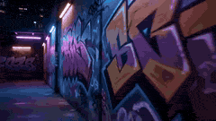

---
### Cinematic Street Racing Sequence for Seedance 2

**Prompt:**
```
cinematic street racing sequence at night, a focused driver inside a high-performance car grips the steering wheel, intense eye focus, city lights reflecting on windshield, tension building before sudden acceleration camera: rapid multi-angle system with seamless transitions, interior close-up → over-the-shoulder → exterior tracking → low ground shots, ultra
```

---
### The 'Fat Note' Transformation Prompt

**Prompt:**
```
Theme: Fat Note. Image: Writing a name in the note makes one fat. The subject picks up a note lying on the roadside (pitch black cover, white text title). Opening the note reveals many mysterious languages written inside. To test it, they open a new page and write their name 'YaReYaRu'. Then, a flashback scene plays, showing them eating steak, ramen, sushi, 
```

---
### Cinematic Mage Battle Storyboard

**Prompt:**
```
Ultra-realistic cinematic live-action, natural skin texture, HDR lighting, dark fantasy atmosphere, warm firelight vs cool overcast tones, grounded VFX 0:00–0:03 Wide shot: ancient stone courtyard, twisted trees, overcast sky. A female mage in crimson-gold robes stands center, cloak and hair moving in the wind. 0:03–0:06 Medium shot: orange flames form in he
```

---
### Desert Leviathan and Shamanic Belly Dancer

**Prompt:**
```
A hyper-realistic, high-octane cinematic epic set within the heart of an endless, undulating desert of scarlet sand. A colossal Desert Leviathan—a serpentine creature forged from ancient, hardened clay, bone, and pulsating veins of molten obsidian—violently explodes from the highest dune, breaching like a whale but through the earth itself. It sprays tsunami
```

---
### Neon Laundromat Rhythm Cinema Prompt

**Prompt:**
```
FORMAT: 15s / 140 BPM / 15 SHOTS SUBJECT: @[image1] WARDROBE: Oversized vintage denim jacket, white tank, gold hoops ENVIRONMENT: Neon-lit laundromat at night MOOD: Bored → magnetic STYLE: Lo-fi rhythm cinema CORE IDEA: The washing machine's spin cycle becomes her personal beat drop SHOT FLOW: Sitting on machine → low hum builds Fingers tap thigh → snare pat
```

---
### Luxury Skeleton Watch Cinematic Commercial

**Prompt:**
```
A high-end skeleton mechanical watch with a brushed titanium case and finely woven metal strap rests embedded within cracked volcanic rock, glowing rivers of molten lava flowing beneath and around it, casting an intense fiery orange illumination that radiates through the exposed inner mechanics of the dial. The scene opens in an ultra-tight macro shot, the c
```

---
### Jewelry Shop Smash-and-Grab Sequence

**Prompt:**
```
[0:00–0:02] A dark car bonnet punches through the glass frontage of a small jewelry shop. Glass fractures in a starburst pattern. Camera low, wide angle.
```

---
### Hyper-Realistic NYC Action Sequence

**Prompt:**
```
A hyper-realistic cinematic action sequence set on a busy New York City street during late afternoon golden hour. The main subject is a confident, powerful woman matching the exact appearance of the reference image (same facial features, hairstyle, proportions, and identity consistency). She is dressed in a sharp, high-fashion formal outfit — a tailored fitt
```

---
### Sky Kingdom Wuxia Fantasy

**Prompt:**
```
A beautiful young woman character exactly matching @img1[character consistency] wearing elegant flowing pastel pink wuxia hanfu robes with long wide sleeves, delicate silver embroidery, soft ribbons and fabric that billow gracefully in the wind, performing ethereal qinggong lightness skill. She is lightly floating and elegantly leaping between ornate pavilio
```

---
### Nano-Strike Frozen Battlefield Sequence

**Prompt:**
```
A surreal urban battlefield in a frozen future, temperature at –200°C. Endless snowfields, cracked asphalt, rusted metal, shattered glass, and burning wreckage. The sky is heavy lead-grey, with violent winds carrying ice particles. Sound echoes sharply in the empty cold. Lighting is fully realistic—deep contrast, volumetric fog, reflections on ice and metal,
```

---
### Brutalist Dystopian SUV Escape

**Prompt:**
```
Use reference images lock the consistency 100% Cinematic video, 15 seconds duration, brutalist dystopian style, hyper-realistic, photorealistic 4K. Timeline: 0-5 seconds: A powerful brutalist character wearing a long black hooded coat, stone-textured robotic arms and boots, and a cracked concrete helmet with a glowing horizontal orange visor stands next to a
```

---
### Hologram to sports car transformation

**Prompt:**
```
Shot 1 (0:00 – 0:02) | Opening Frame A close-up of a tattooed male arm with a sleek black smartwatch in a futuristic LED-lit corridor. The person raises their wrist and taps it. A faint, minimal holographic UI briefly appears (subtle glow), not the main focus. Camera quickly shifts attention away. Shot 2 (0:02 – 0:04) | Quick Interaction Fast swipe gesture. 
```

---
### No Ticket, No Problem Action Comedy

**Prompt:**
```
TITLE: “No Ticket, No Problem” Seedance 2 | 15-second cinematic action-comedy | jungle adventure parody | high-speed chaos | dark American humor dialogue | exaggerated reactions | dynamic camera | punchy sound design A rugged jungle theme park entrance. Primitive wooden fences, tall gates, and a massive hanging wooden sign reading “CAT UNIVERSE.” Lush overgr
```

---
### Russian-Voiced Tokusatsu Action Sequence

**Prompt:**
```
[0s–3s] Dramatic close-up of the character from [@ Image1]. She wears a sleek white form-fitting tokusatsu battle suit with subtle armor plating, reminiscent of Japanese Super Sentai live-action series. Wind blows across a desolate rocky wasteland behind her. She speaks in Russian, her voice emotional and conflicted. White English subtitle text appears at th
```

---
### Cinematic Gaming Short with Seamless Transitions

**Prompt:**
```
Generate a 15-second high-energy creative gaming short film with deep voice-over narration, focusing on storyboard arrangement and smooth transitions. [Camera and Transition Arrangement] 0-5s: Handheld camera quickly zooms in on a monitor flashing red RGB lights. When the character on screen raises their hand, use 'action match transition' to seamlessly tran
```

---
### Pixel Art Horror RPG Gameplay Scene

**Prompt:**
```
Screen recording of a 2D top-down pixel art horror RPG game, Japanese indie style reminiscent of The Witch's House and Ib. A stoic pale-haired anime girl sprite navigates a decaying Victorian mansion interior, dark muted palette with flickering candlelight casting long pixel shadows. Sparse windows reveal a pale moonlit night sky outside. [0s–3s] The girl sp
```

---
### Dragonflight Trials POV

**Prompt:**
```
First-person POV from a rider approaching a massive black dragon from behind on a wooden mountain platform. The dragon stands at a starting ramp facing a wooden gate reading \"DRAGONFLIGHT TRIALS START\" with dragon-emblem banners on each side. Mountains and clouds beyond. The rider wears worn white leather gloves, dirt on hands. A white leather saddle with st
```

---
### Storm-Wyrm and Shaolin Monk Battle

**Prompt:**
```
A hyper-realistic, high-octane cinematic video still set in a narrow, labyrinthine desert canyon at night. A colossal Storm-Wyrm—a serpentine dragon forged from turbulent thunderclouds and internal lattice-works of blue lightning—violently erupts from a dry riverbed, breaching like a whale through the canyon floor. It sends explosive shockwaves of pulverized
```

---
### Japanese Schoolgirl Scale-Shifting Adventure

**Prompt:**
```
photrealism movie style 0:00 – 0:02 EXT. PARK – DAY – TREE BRANCH A Japanese schoolgirl crouches on a branch— She launches forward decisively. Camera dives with her. 0:02 – 0:04 0:02 – 0:04 FREE FALL → PICNIC TABLE She drops fast toward a picnic table— IMPACT— The moment she hits— Scale snap: she’s now tiny (soda-can size). Table surface becomes a vast lands
```

---
### Belly Dance Performance Prompt

**Prompt:**
```
A glamorous belly dance woman's style with high heels, a beautiful face, eyebrows, and a smooth body
```

---
### Fairy and Puppy Macro Perspective Structured Prompt

**Prompt:**
```
{ \"cinematography\": { \"camera_perspective\": \"Extreme low-angle 'ant-view' tracking, looking up from the puppy's snout toward the fairy's descent; camera then snaps to a side-profile 'drag-race' shot alongside the fairy's face.\", \"lens\": \"5mm ultra-fisheye; the puppy’s whiskers appear as massive, obsidian-black bridge cables stretching into the horizon.\", \"de
```

---
### Multi-Shot High Speed Car Chase

**Prompt:**
```
SHOT 01 Ultra-low front tracking shot inches above asphalt, a high-performance sports car already at full speed blasting through a tight urban street, suspension compressed, reflections streaking across glossy body panels, extreme motion blur on surroundings, no buildup, immediate velocity, hyper-realistic, cinematic, 8k detail. SHOT 02 Side close tracking s
```

---
### Showgirl Escape Noir-Western Sequence

**Prompt:**
```
0-3s: A showgirl in torn silk stockings and feathered headdress crouches behind the bar, clutching a satchel, eyes darting toward the back door. 3-7s: She makes a run for it across the sawdust floor, passing drunken cowboys who reach for her but miss by inches, her sequins catching the light like scattered diamonds. 7-12s: The bouncer in a brocade vest lunge
```

---
### Greenery and Environmental Evolution Video Prompt

**Prompt:**
```
Importance of Greenery in Human Life “Start with a dull, grey city filled with pollution, dry trees, and tired people coughing. The sky looks hazy and lifeless. Slowly transition as greenery begins to grow—trees sprout, grass spreads, flowers bloom, and the sky turns bright blue. Show people breathing fresh air, smiling, and children playing happily. Birds f
```

---
### Female warrior transformation combat

**Prompt:**
```
Cinematic continuous single-take shot, IMAX film simulation, Panavision C-series 35mm lens, f/4, strong backlighting, heavy shadows, desaturated grey tones. Low-angle shot from behind a battle-worn Western female warrior sitting motionless on a massive black warhorse on dark soil under a dull grey sky. She wears damaged black armor, long blonde hair partiall
```

---
### Jakarta Mecha vs Monster Scene

**Prompt:**
```
15-second one-take continuous tracking shot, cinematic handheld feel. Color grading, lighting tone, and overall ambience cold bluish-grey foggy atmosphere throughout the entire video. No background music, only diegetic sound effects: destruction debris, screams, car engine, metallic nano-tech transformation sounds, laser blast, and monster roar. 0–3s: Wide e
```

---
### 2D Anime Action Sequence: Wind Knight vs Shadow Beast

**Prompt:**
```
A 23-second ultra-cinematic 2D anime action sequence at night. Dark blue sky, stars, bright full moon with strong rim light. Burning medieval village in background: flaming huts, black smoke, floating embers. Dry rocky hills, dusty ground. Fluid 24fps animation, painterly style, dynamic motion blur, dramatic cameras, epic orchestral swell. 0-2s: Sweeping low
```

---
### Beat-Driven Streetwear Video

**Prompt:**
```
FORMAT: 15s / 150 BPM / 15 SHOTS SUBJECT: @[image1] WARDROBE: Streetwear ENVIRONMENT: Street MOOD: Playful → stylish STYLE: Beat-driven cinematic CORE IDEA: Her actions create exaggerated sound effects SHOT FLOW: Step → bass hit Turn → whoosh Hand move → click Walk synced with beat She notices Plays with movement Builds rhythm Full sequence Stylish walk Sync
```

---
### European Piazza guitar performance

**Prompt:**
```
Cinematic, high-quality video of a beautiful young woman with auburn hair in a messy romantic updo, wearing an elegant, flowy, off-the-shoulder white dress. She is sitting gracefully on the cobblestone ground of a sunlit, grand European piazza, gently strumming a white acoustic guitar and singing a song. A fluffy white Ragdoll cat with a bushy tail is walkin
```

---
### Secret Cat Economy Underground Base Prompt

**Prompt:**
```
hyper-realistic nighttime city apartment setting. The scene begins with a quiet, dimly lit room where a household cat sits calmly on a sofa while the human sleeps in the background. Subtle moonlight enters through the window, creating a mysterious atmosphere. As the clock hits midnight, the cat suddenly becomes alert. The camera follows in smooth cinematic m
```

---
### Futuristic hovercraft savanna chase

**Prompt:**
```
Start high above a vast savanna as the camera dives in a fast circling orbit. Below, a futuristic hovercraft-spacecraft hybrid streaks along a pale hardpack trail, skimming just above the ground. Its design is sleek and unforgettable: obsidian body, razor-curved wings, glowing red energy seams, and a luminous anti-gravity core that ripples the air beneath it
```

---
### Cat in High Heels Security Footage

**Prompt:**
```
[store type and name] security camera, 2019, grainy overhead wide shot, [store name] security guard tells woman they cant let their cat walk in high heels in their store, a silky short fur black bombay cat in red high heels walks back and forth in front of them she responds to the guard \"but she loves them!\" 12fps
```

---
### The Sandcastle Cinematic Hyperlapse

**Prompt:**
```
THE SANDCASTLE Cinematic hyperlapse, 16:9, 15 seconds, photorealistic, beach golden-hour lighting, overhead and low-angle shots. [0:00–0:04] A man arrives at an empty beach at sunrise with a bucket, shovel, and inexplicable determination. Hyperlapse
```

---
### High-Speed Kinetic Typography 'Nekozamurai' Motion Graphics

**Prompt:**
```
The cat in the image is at the back of the layer and swings a sword repeatedly in sync with the sound. Completely ignore the background of the reference image. Ultra-fast kinetic typography (15 seconds total), futuristic minimalist motion graphics, high-end After Effects style. Color palette is black, white, and red. Extremely high-tempo staccato rhythm, pre
```

---
### Cinematic Time-Freeze Sports Bar Scene

**Prompt:**
```
Use @ Reference Image as the main character, keeping facial features and body proportions consistent throughout. She is a 30-year-old woman. Cinematic time-freeze short film, 15 seconds, ultra-realistic, shot on Arri Alexa Mini, 35mm lens, moody sports bar interior lighting with neon accents, volumetric haze, dynamic hard shadows, shallow depth of field. [0:
```

---
### Tiny Agent Casino Heist Action

**Prompt:**
```
0:00 – 0:02 INT. CASINO – TABLE LEVEL – NIGHT Ultra low-angle macro shot tracking him from the side. A 3 cm tall agent in a suit sprints across a casino table. Giant chips, dice, dollar bills, champagne glasses, and handguns tower around him. Shallow depth of field, cinematic lighting, motion blur. 0:02 – 0:05 CONTINUOUS – HIGH SPEED RUN camera tracking him 
```

---
### Cinematic Wuxia Combat Sequence

**Prompt:**
```
Cinematic wuxia combat sequence, 15-second continuous shot. Opening with a wide establishing shot of a dry-leaf courtyard. @[reference image_ 1] male saber-wielder with a long blade vs. @[reference image_2] female rapier-wielder with a slender sword.
```

---
### Cinematic Romantic Storyboard

**Prompt:**
```
PORTION 1 (0 :00–0:04) The First Glance Visual Prompt: Ultra-realistic cinematic video, golden hour lighting, modern university campus, soft warm tones, shallow depth of field. Ai Girllie (24, elegant, subtle futuristic vibe) walks past a glass building. John (26, photographer, casual aesthetic) lifts his camera, pauses as he notices her. Slow-motion eye con
```

---
### Cartoon Child and Chicken Chase

**Prompt:**
```
The cartoon child walks left to right along the playground path, holding a half-eaten sandwich in the right hand. A chicken notices the sandwich, lowers its body, and suddenly sprints after it. The sandwich stays clearly visible the entire time until the child eventually throws it. The route remains unobstructed, moving from the path to the slide and then to
```

---
### Cinematic Surfer Slow-Motion Barrel

**Prompt:**
```
A cinematic slow-motion shot of a surfer riding inside a massive hollow ocean wave (barrel), smooth tracking camera at water level following alongside the surfer, the wave curls overhead forming a perfect tunnel, detailed water textures, splashes and mist particles, teal and deep blue color grading, high contrast, natural sunlight filtering through the wave,
```

---
### Fantasy Warhorse Aqueduct Action Shot

**Prompt:**
```
Warhorse sprint on a cliff aqueduct (15 seconds, single continuous shot) A sweeping wide of ancient cliffs and a narrow aqueduct clinging to them. The camera dives to a tiny moving spark: a rider on a warhorse sprinting impossibly fast along the stone channel. Lock-on: hooves strike, water splashes, stone chips fly. The camera slingshots past, whips around, 
```

---
### Cinematic Commercial Sequence Part 1

**Prompt:**
```
Cinematic speaker commercial, smooth transitions. Use multiple shots with varied camera angles (wide, medium, close-up), not a single continuous take. 1–2s: A tired man gets home, opens the door, turns on the light. Quiet apartment. 3–4s He sits on the sofa. Close-up
```

---
### Urban Shockwave Tracking Shot

**Prompt:**
```
A lone figure standing still in the middle of a street, wind starting to rise. A massive shockwave expands from behind, tearing through buildings and streets instantly. Urban environment disintegrating outward in all directions. Wide tracking shot pushing toward the figure, shockwave catching up, debris flying past lens, environment collapsing in real time.
```

---
### Autonomous High-Speed Chase

**Prompt:**
```
High-speed urban environment under extreme pressure. Hyper-realistic, grounded physics. The tone shifts from human tension to machine-level precision. Shot on 35mm anamorphic lens, f/2.8. Natural motion blur, realistic exposure, high dynamic range. Golden hour light cutting through dust, glass particles, and atmospheric haze. Subject: A skilled driver under 
```

---
### Prehistoric POV Paragliding Action

**Prompt:**
```
VISUAL STYLE: Use live-action feature film realism with crisp action-camera sharpness and ancient atmospheric haze. CHARACTERS: Define a pair of gloved human hands gripping worn paraglider toggles, dark flying boots, and multiple massive prehistoric predators crossing the flight path. STAGE: Set a vast prehistoric canyon that drops from open sky into fern-ch
```

---
### 3D Cartoon Ramen Eating Animation

**Prompt:**
```
The 3D character from Image 1 performs actions in the style of a 3D cartoon animation. The movements alternate between fast motion and sudden stops, proceeding with a good tempo. Scene: The character from Image 1 is eating ramen at a food stall. Scene 1: Angle from below. She looks at the bowl of ramen and raises her chopsticks, looking impatient and excited
```

---
### Continuous Life Transformation Sequence

**Prompt:**
```
Cinematic continuous side-scrolling sequence, 16:9, 15 seconds. One unbroken shot — the camera tracks smoothly from left to right without cutting, following a single person through their entire life as the environment transforms
```

---
### Shinjuku Kabukicho Cinematic Portrait

**Prompt:**
```
Shinjuku Kabukicho at dusk, a woman illuminated by neon lights looks back. The road surface after the rain reflects the light, and steam from a street stall crosses the screen. [Camera] Low-angle slow dolly-in, shallow depth of field, 35mm film texture. [Lighting] Red and blue neon rim lights, cinematic contrast.
```

---
### Animated Penguin Winter Slide Prompt

**Prompt:**
```
Imagine a charming, animated penguin stepping onto a glossy, icy surface under the bright glow of a cinematic winter sun. The camera captures a close-up of the penguin’s determined face as it attempts to walk, only to comically slide forward with a little stumble.
```

---
### Sci-Fi Romantic Scene

**Prompt:**
```
15-second cinematic sci-fi romantic scene, two characters lying in a vast field of white roses, both in silver space suits — @Character_A: woman, long vivid auburn-red hair
```

---
### Pixar-Style Magical Girl in Library

**Prompt:**
```
A breathtaking 3D Pixar-style magical animated video, 15 seconds long, set inside a vast ancient circular library with towering wooden bookshelves reaching infinitely upward. SCENE 1 (0-4 sec): A cute magical girl with blonde curly pigtails tied with big pink bows, wearing a dark crimson fantasy dress with white frills and a tiny crown, stands before a large
```

---
### Underground Crystal Cavern Mag-Lev Racing

**Prompt:**
```
Start inside the mouth of a colossal underground cavern as the camera rushes forward and drops in a spiraling dive into the depths. Below, a mag-lev racing pod hurtles along a natural crystal rail formation deep underground, banking through impossible geological curves. Its design is minimal and luminous: a teardrop-shaped transparent cockpit revealing the p
```

---
### Olympic Hammer Throw Broadcast Simulation

**Prompt:**
```
[BROADCAST SETUP] Live TV sports broadcast signal, 1080i HD resolution, 50fps. Shot on professional ENG stadium cameras. Standard TV color balance with natural daylight. No color grading, no cinematic filters, no artificial post-processing. Real-world stadium acoustics and ambient light. Audio Style: Immersive spatial sound design. Loud stadium atmosphere, c
```

---
### Cyberpunk Rooftop Pursuit

**Prompt:**
```
0:00-0:02: Close-up of her face as she regains balance, then a quick wide shot. She looks up at a dark hatch. 0:02-0:05: Rapid jump-cuts: she crouches, then leaps with a powerful burst of energy through the ceiling opening. First-person view looking up, followed by a side view of her soaring through the gap. 0:05-0:07: She lands on a rainy skyscraper roof, t
```

---
### Action Thriller Leviathan Chase

**Prompt:**
```
Using the uploaded reference image as the subject: (0–2.5s) A frantic, vibrating handheld tracking shot follows her as she sprints across a shattered bridge, wearing a pink hoodie. The footage speed-ramps from fast-forward into ultra slow motion. Behind her, a colossal leviathan—formed from bioluminescent water and jagged ice scales—surges forward. The camer
```

---
### Cinematic Ballerina in Flooded Opera House

**Prompt:**
```
16:9, 15-second ultra cinematic photoreal sequence, seamless 3-shot progression, no subtitles, no logos. Inside a vast abandoned opera house flooded with two inches of mirror-still water at blue hour, a lone ballerina in a black silk dress stands center stage. Shot 1: extreme macro from beneath the water as her pointe shoe touches down, sending silver drople
```

---
### Bollywood Street Dance Template

**Prompt:**
```
Dance movie, Bollywood movie style, fast-paced high-speed cuts, 24FPS. Location: Photorealistic style, West Indian shopping street in the 1980s. Characters: A total of 25 dancers/actors. The appearance of 4 people per image is provided in a 2x2 grid, so reproduce them faithfully. Composition: The protagonist (@ image1) starts a sharp Bollywood-style dance al
```

---
### Kuwait City Apartment Night Mood

**Prompt:**
```
Ultra-realistic 15s vertical video, cozy high-rise apartment overlooking Kuwait City at night. Warm interior glow vs cool deep blue skyline, cinematic lighting, soft motion, 8K detail. 0–3s Close-up of warm Edison bulbs → quick pan over wooden counter (mug, books, plants). 3–6s Camera glides toward large window, interior reflections fading as city comes into
```

---
### Cinematic Reality Collapse One-Take

**Prompt:**
```
One continuous shot drifting above a city skyline at night as the sky begins to fracture. The camera slowly moves forward as reality distorts — stars appear through cracks in the sky. At the 2-second mark a lightning god strikes downward while a void entity tears open a dimensional rift. The camera accelerates into the collapsing space between them. Building
```

---
### GYM Rush Morning Beat-Synced Routine

**Prompt:**
```
FORMAT: 15s / 145 BPM / 15 SHOTS / beat-synced routine SUBJECT: @[image1] \u003c ATTACH YOUR IMAGE. WARDROBE: Sleep tee and lounge shorts at home. Compression tee, joggers, training shoes outside. ENVIRONMENT: Small bedroom, dim bathroom light, stairwell echo, early street haze, neon-lit gym, locker room mirror. Everything feels raw, humid, and kinetic. MOOD: Sle
```

---
### Rainbow Hair Concert Video

**Prompt:**
```
A young woman with long rainbow-colored hair (blue, green, pink gradient) stands in the middle of a massive outdoor music festival crowd. She drinks from a can as colored laser beams sweep through haze and stage lights pulse behind her. Confetti rains down around the dancing crowd. Energetic nighttime atmosphere, wide-angle concert photography style, vibrant
```

---
### Superman Cinematic Action Sequence

**Prompt:**
```
0:00-0:03 SCENE: Mid-air, Metropolis skyline. A high-tech mercenary fires a shoulder-mounted laser cannon. ACTION: Superman flies directly into the beam. The red energy dissipates against his chest. He doesn’t even blink. SFX: High-energy HISS followed by a heavy metallic THUD. 0:03-0:07 ACTION: Superman hits a burst of speed, leaving a vapor cone behind him
```

---
### Surreal Musical Sculpture Animation

**Prompt:**
```
A continuous dolly-in glides along a surreal wooden sound sculpture perched on a stone overlook above the sea, bathed in golden-hour light. The instrument twists upward in intersecting curves and blocky voids—planks of varying size, density, and color are embedded at odd angles across its looping form. Some beams curve like ribs, others jut out like cantilev
```

---
### Anime Character Book Catch

**Prompt:**
```
A 5-second verification animation. The character is surprised and catches a book titled \"Meikyo\". [Character Settings] 100% complete maintenance of the character design, hairstyle, and outfit from the input image. [Background Settings] Solid flat studio background.
```

---
### Vintage Shaw Brothers Wuxia Style

**Prompt:**
```
1960s Shaw Brothers wuxia-comedy meets absurd romance, dramatic lighting, theatrical acting, exaggerated reactions, old Hong Kong film grain, punchy sound effects, dark American humor dialogue, playful fourth-wall breaks, light
```

---
### Cinematic Lifestyle Call Sequence

**Prompt:**
```
FORMAT: 15s / 135 BPM / 14 SHOTS SUBJECT: @[image1] WARDROBE: Casual → slightly refined ENVIRONMENT: Room → balcony → open sky MOOD: Low → relieved → strong STYLE: Cinematic lifestyle CORE IDEA: A call changes her emotional state SHOT FLOW: Sitting quietly, distant look Phone rings She hesitates Answers slowly Listening… expression softens Small nod Stands u
```

---
### Multi-Scene Calligraphy and Fairy Animation

**Prompt:**
```
Please refer to the provided image and generate the entire scene as a single animation video. SCENE 1 (0-4 seconds) - Shouting \"Wa~!\" - The fairy faces forward, opens her mouth wide, and shouts \"Wa~!\" energetically. - Rainbow ripple effects spread out from the front of her face as if sound is being emitted. - Her body vibrates slightly in time with the volum
```

---
### Chef Spicy Food Prank POV

**Prompt:**
```
The scene opens from a first-person POV at a polished wooden dining table inside the kitchen, capturing local ceramic dishware and copper-rimmed serving bowls under warm amber and white light. The chef sits across the table, dressed in a white chef's coat, enjoying a spread of regional dishes. The mood is relaxed, ambient kitchen sounds fill the air. At 0s, 
```

---
### Cinematic World-Altering Magic Script

**Prompt:**
```
Seedance 2■ 15-second script (Flashy enhanced version | Full viral spec) ■ Concept: Magic capable of rewriting a city in one shot - not just an attack, but 'world alteration' ■ 0.0-2.0s [Abnormality (Strong)]: Video of Paris at night -\u003e Space glitches (buildings distort, pixel collapse). Eiffel Tower momentarily turns into noise. SE: 'Giii... (Data collapse 
```

---
### K-Pop Plaza Dance Battle

**Prompt:**
```
@ img1 : character reference, main dancer A, female, short gray hair, stylish K-pop outfit from reference, sharp choreography @ img2 : character reference, main dancer B, female, short pink hair, stylish K-pop outfit from reference, sharp choreography Two professional K-pop dancers ( @ img1 as Dancer A and @ img2 as Dancer B) face off in an intense yet fun d
```

---
### 3D Animation Monkey Warrior Battle

**Prompt:**
```
[0:00-0:02] Pre-fight: An anthropomorphic monkey warrior in full traditional chinese armour is surrounded by an army of soldiers wearing metallic armor of gold and white. The warrior is laughing, finding his situation both exciting and halarious. The enemy soldiers are closing in all around him. He spins his staff playfully at his right side, twirling it beh
```

---
### Cinematic Time-Freeze Sports Bar Prompt

**Prompt:**
```
Use @ Reference Image as the main character, keeping facial features and body proportions consistent throughout. He is a 30-year-old man. Cinematic time-freeze short film, 15 seconds, ultra-realistic, shot on Arri Alexa Mini, 35mm lens, moody sports bar interior lighting
```

---
### Wasteland Sister Battle

**Prompt:**
```
Close-up of @[reference image 1] in a white skin-tight combat suit, saying in Korean, \"Sister, do we really have to fight?\" Cut to @[reference image2] in a black skin-tight combat suit, saying in Korean, \"Yes, this is our fate, little sister.\" They charge at each other and break into an intense, high-speed battle across the wasteland. The camera whirls dizzy
```

---
### Surreal Luxury Film Sequence

**Prompt:**
```
Ultra-cinematic surreal luxury film, 9:16 vertical, 15 seconds, hyper-real, no cheap AI look. Three camera moves — no more. The entire film is built from slow, expensive, intentional motion. No rapid cuts. No montage. Every transition is a camera move, not an edit.
```

---
### Emotional Hospital Interaction

**Prompt:**
```
A calm, modern hospital room. A patient is lying on a bed while a professional, kind doctor stands beside him, gently checking his pulse and speaking softly. The camera slowly tracks from the side in a single continuous motion for the full 15 seconds. As the doctor leans slightly closer to examine the patient, the patient looks at the doctor and becomes emot
```

---
### Paris Runway Transformation

**Prompt:**
```
Created based on Paris Fashion Week BGM and actual runway scenes. [00:00-00:8] An extremely beautiful model walking the Paris Fashion Week runway; her outfit smoothly transforms from a mini-skirt to a long skirt. Simultaneously, the top also smoothly transforms into a long dress. [00:08-00:15] The beautiful model poses at the end of the runway before turning
```

---
### Earth Zoom to Robot Workshop

**Prompt:**
```
Epic cinematic Earth zoom-in sequence starting from deep outer space. Camera begins with a majestic wide shot of planet Earth floating in the void (0-5s), then rapidly accelerates and dives toward the surface at breathtaking speed, piercing through glowing atmosphere layers, rushing clouds, and continents with dramatic motion blur, light streaks, and intense
```

---
### Ocean Trench to Surface Transition

**Prompt:**
```
A single continuous impossible camera shot begins deep underwater in a vast ocean trench — bioluminescent creatures drift past in the darkness. The camera accelerates upward at speed, bursting through the ocean surface in a wall of spray and light, then continues rising
```

---
### Ancient Indian Kingdom FPV Flight

**Prompt:**
```
extremely fast-paced cinematic FPV flying through the ancient Indian Videha kingdom, hyper-realistic, 4K, dynamic motion, rushing through grand palaces, temples, marketplaces, courtyards, scholars, people, golden sunlight, dramatic lighting, depth of field, epic scale, lush greenery, riverbanks, horses and chariots in motion, immersive, cinematic color gradi
```

---
### Urban Rampage Tracking Shot

**Prompt:**
```
A driver gripping the wheel, eyes wide, swerving violently at full speed. Dodges collapsing buildings as a giant creature rampages through the city. Urban streets being destroyed, cars flipping, dust clouds rising. Front tracking shot pulling backward from the car, creature appearing in background, debris crashing around, cinematic destruction synced with mo
```

---
### Handheld 35mm Film Aesthetic Prompt

**Prompt:**
```
Format: 35mm film emulation, handheld cinematography, natural film grain, shallow depth of field, subtle focus breathing, imperfect stabilization, cinematic dynamic range Audio: No background music, only diegetic sound — wind shear, panicked breathing, claws
```

---
### Dreamy Fairytale Logo Animation

**Prompt:**
```
Referencing the image, create a gentle and dreamy logo appearance animation. Start with soft pink and light blue light gently and warmly enveloping a black background, then the logo slowly floats up to represent a weightless dream world. Small stars, hearts, and bubbles drift around to create a cute fairytale atmosphere, and the logo is completed with a sens
```

---
### Glacial Canyon Frost Battle

**Prompt:**
```
Environment: A colossal glacial canyon under pale blue twilight. Massive ice walls tower above a frozen river while snowstorms sweep through the valley. The environment glows faintly with reflected moonlight from crystalline ice formations. Action: 15.0s sequence. A gigantic glacier tiger made of solid ice and glowing frost veins prowls across the frozen riv
```

---
### Found-Footage Talking Rabbits

**Prompt:**
```
3D animated film style, ultra high quality, cinematic lighting, global illumination, soft shadows, depth of field, ultra detailed fur, cute characters, smooth animation, natural lighting, handheld camera feel, found-footage comedy style, realistic camera movement, playful atmosphere Scene: A group of fluffy forest rabbits stand in a bright forest clearing. T
```

---
### Ancient Battlefield to Microscopic Civilization

**Prompt:**
```
Epic wide-angle shot of a vast ancient battlefield at golden hour, thousands of warriors clashing with swords and shields under a hazy amber sky thick with smoke and ash. A lone archer in weathered bronze armor, face streaked with dirt, draws a longbow with deliberate tension. The arrow releases with a sharp twang. Camera immediately snaps behind the arrow, 
```

---
### Jungle Explorer One-Shot

**Prompt:**
```
One fearless female explorer in beige crop top, jungle shorts, rope belt, muddy skin, long dark hair loose. Swinging from giant vines above ancient forest. Main frame from rear. Small rectangular inset top-right shows front face and torso. SCENE: Camera locked behind her as she is already mid-swing at high speed over massive jungle canyon. No cuts. Maintain 
```

---
### War-Torn Street Emotional Scene

**Prompt:**
```
A war-torn street with destroyed buildings and smoke in the background. A small child sits alone holding a damaged toy, dust on face, eyes filled with fear and confusion. Slow camera zoom, muted colors, cinematic lighting, emotional atmosphere, realistic style.
```

---
### Post-Apocalyptic Sci-Fi Action Sequence

**Prompt:**
```
Image1 character as the subject a male, black oversized hoodie, black oversized baggy jeans, black sneakers. Radiation-enhanced superhuman speed and strength, awakened orange-yellow glowing pupils, veins bulging. intense aura. Scene: Abandoned Chicago high-rise ruins, exposed rebar, cracked concrete, suspended derelict vehicles, rusted steel walkways, mutant
```

---
### Daily Routine Split-Screen Comparison

**Prompt:**
```
Split screen: STYLE: High-end stylized 3D animated character, cinematic lighting, expressive faces, polished materials, exaggerated but believable motion, comedic visual storytelling with split-screen sequences. WARDROBE: Man Image2 — oversized graphic tee and jogger pants entire film, never changes. Woman Image1 — western casuals shots 1–6, sharp blazer tro
```

---
### Shadow Monarch Tundra Scene

**Prompt:**
```
Hyperrealistic cinematic shot, 35mm anamorphic lens, heavy film grain, aggressive handheld camera with visible sway. Teal and amber palette with violet-purple accents. No zoom. Snowstorm atmosphere, volumetric fog, breath vapor visible [0s-3s] Low-angle shot from ground level. Vast frozen tundra, dark overcast sky, heavy snow falling. @ShadowMonarch walks fo
```

---
### Kawaii Chibi Phoebe with Baby Chicks

**Prompt:**
```
Use the same face from the reference image without changing facial features. ultra-kawaii 3D chibi CGI animation, plush toy aesthetic with realistic fabric and fur textures. Cute blonde anime girl Phoebe from Wuthering Waves as chibi: huge head, tiny body, long blonde hair with white wide-brim hat, blue ribbon and butterfly clip, blue cape and white-black ou
```

---
### Astronaut Resting in White Roses

**Prompt:**
```
An extraordinarily beautiful American woman with long deep vibrant orange hair spread elegantly around her, breathtakingly perfect symmetrical face, flawless porcelain skin, captivating eyes, high cheekbones, full red lips, lying peacefully on her back in the center of a massive bed of blooming pure white roses. She is wearing a clean, detailed white astrona
```

---
### Stardust Shoujo Anime Prompt

**Prompt:**
```
[Video Concept] A 10-second scene of a girl surrounded by stardust, crying while thinking of someone. Three lines whispered in Japanese. Deep purple and silver colors. Particles synchronize with her emotions. [Character] A silver-haired girl with flowing hair and an ethereal gown. Transitioning from silence to earnestness to tears. [Background] Night sky wit
```

---
### Epic Wildlife Campaign Trailer

**Prompt:**
```
Create a 16-second ultra-cinematic wildlife trailer in vertical 9:16 format featuring three iconic animals: an elephant, a cheetah, and a gorilla. The film must feel epic, emotional, powerful, and expensive — like a luxury nature campaign mixed with a cinematic movie
```

---
### High-Octane Izakaya Jet Entrance

**Prompt:**
```
A woman late for a mixer flies at Mach 1 using leg jet engines, crashes through a suburban house window, and seamlessly slides into her seat at an Izakaya.
```

---
### Kung Fu Culinary Master Action Part 1

**Prompt:**
```
ACTION: A poster girl wearing a traditional cheongsam who is clumsy but actually a kung fu master. While wrapping soup dumpling skins at high speed in the kitchen, she accidentally scatters a large amount of flour. From the white smoke, dozens of soup dumplings rise into the air in a line like a dragon.
```

---
### Glowing Humanoid Protagonist and Desert Ruins

**Prompt:**
```
image1 as the glowing humanoid protagonist and starting pose (lone powerful figure with dramatic blue energy glow, keep exact biomechanical design, intricate mechanical-organic fusion, and intense presence), image4 as the ancient desert coliseum ruins environment and awakening
```

---
### Orbital Ring Structural Failure

**Prompt:**
```
Gigantic orbital ring around an alien planet, structural failure propagating at high velocity, entire sections tearing apart while traffic is still moving across it. Wide shot: the ring mid-rotation, a fracture suddenly racing along its surface faster than expected. Hard tracking: camera locked to the crack as it splits structural layers, tearing through hab
```

---
### Iris Transition into Memory World

**Prompt:**
```
camera orbits 90 degrees to the left then rapidly iris in to the girl, going through her iris into a mirrored world with inverted colors of a shattered world. Dozens of shards of glass, each reflecting a different fragment of memory from the girl's past floats in a dark mysterious void.
```

---
### Cinematic Lifestyle Mood Shift

**Prompt:**
```
FORMAT: 15s / 135 BPM / 14 SHOTS SUBJECT: @[image1] WARDROBE: Casual → slightly elevated ENVIRONMENT: Room → street → brighter world MOOD: Neutral → excited → confident STYLE: Cinematic lifestyle CORE IDEA: One message shifts her whole vibe SHOT FLOW: Sitting bored Phone buzz Reads message → expression changes Quick stand up Outfit adjustment Mirror glance L
```

---
### Ballet Dancer vs Boxer Cinematic Fight

**Prompt:**
```
Japanese anime style with the exhilarating feel of a competitive fighting game. Set in a boxing ring, 15 seconds, 30fps, no subtitles. High-contrast cinematic lighting, volumetric light, atmospheric particles and smoke, with a strong audience presence. The overall pacing is clean and sharp, with decisive and powerful camera movement, no dragging. High dynami
```

---
### Product Review UGC Prompt

**Prompt:**
```
Woman talking to camera, reviewing product how happy she is with it saying \"Meno is best supplement i ever used!\"
```

---
### Volcanic Man City Destruction

**Prompt:**
```
A massive man in his late 30s with volcanic ash streaking his skin, shaved head and ember-orange eyes, wearing a heavy basalt-plated mantle embedded with molten fissures glowing beneath the armor — hook at second two: he slams both fists into a city plaza and the molten fissures ignite, sending seismic shockwaves through the ground. The pavement splits open 
```

---
### Immersive High-Speed Office Melee

**Prompt:**
```
15-second, no-dialogue, fully immersive high-speed brutal fight short film. Two characters @ image1 and @ image2 . Live-action realistic style. Close-quarters, high-speed chaotic melee combat with no rules, fully out-of-control brawling. No flashy choreography—pure raw. Continuous exchange of punches, kicks, blocks, body checks, throws, and grappling entangl
```

---
### Funny Cat Breakfast Wake-up Call

**Prompt:**
```
A hyper-realistic video shot in a modern Western-style bedroom in the morning. An American couple is sleeping peacefully in bed with soft, natural daylight coming through the window. A tabby orange cat is running through the bedroom doorway, holding its own food bowl in its mouth. The cat jumps onto the bed and runs between the two sleeping figures. First, i
```

---
### Dark Lava Creature Transformation Prompt

**Prompt:**
```
Character reference strictly follow face identity Final form dark lava creature inspirationLocation destroyed battlefield police surrounding0-3 seconds medium shot slow pushMain character kneeling breathing heavily injuredHands on ground slight trembling visiblePolice enter frame
```

---
### Flying Carpet Escape Scene

**Prompt:**
```
Continuous uncut handheld tracking shot, photorealistic, 24fps. YOUR IMAGE on a flying carpet races through ancient Egyptian desert ruins under overcast skies. Massive sand golems hurl boulders — he dodges with dives, sharp pull-ups and snap-rolls, carpet flexing with realistic physics, debris flying past the lens.
```

---
### Colored Pencil Time-lapse Flower Field

**Prompt:**
```
A fantastic landscape of a flower field meticulously drawn with colored pencils, with spreading colorful flowers (densely blooming from small to large), and every single petal and leaf carefully rendered. A clear blue sky with soft clouds floating slowly, deep blue gradients, and the texture of the sky expressed through characteristic colored pencil strokes.
```

---
### Chibi Phoebe Anime Description

**Prompt:**
```
POV: Someone stealthily stole Phoebe Chibi’s rice from her bowl Watch her instantly boil over😂 A super cute chibi-style Phoebe from Wuthering Waves as 'Phoebe Chupi' or 'Fibi Chupi', exaggerated big head, tiny body, adorable round face, big sparkling eyes with heart-shaped highlights, blonde hair with blue ribbons, wearing her signature oversized white and 
```

---
### Futuristic Cyberpunk Logo Motion Graphic

**Prompt:**
```
Referencing the uploaded logo image, please create a futuristic motion graphic video of about 10 seconds. 0-1 sec: Faint blue noise, scanning lines, and data particles appear on a black background. 1-2.5 sec: A circular HUD, thin luminous lines, and a scanning ring activate, starting to draw the outer perimeter of the logo. 2.5-4 sec: A character silhouette 
```

---
### Cybernetic Motion Graphic Logo Reveal

**Prompt:**
```
Referencing the uploaded logo image, create a futuristic logo reveal animation on a black background. Start with blue noise, scanlines, circular HUD, and scanning effects, with the outer edge of the logo drawn in glowing lines. The character inside should also emerge from light particles and lines, and finally, the entire logo should complete in neon blue an
```

---
### Orange Cat Adventure: Pyramid Simulation

**Prompt:**
```
STORY FORMAT: 15s / 152 BPM / ONE CONTINUOUS SHOT / 3D adventure-comedy / stylized ancient-tomb fantasy TONE: tense survival → frantic ingenuity → claustrophobic horror → absurd cosmic twist SUBJECTS: Orange cat explorer in rugged fedora-style hat, brown leather outfit, holding a torch, axe strapped at waist; Ancient sarcophagi; Swarm of black scarab beetles
```

---
### Assassination Sequence Parametric Prompt

**Prompt:**
```
CHARACTERS: A: [ref_image] an assassin with a blade and fluid movement B: armored guards with shields and coordinated attacks ENVIRONMENT dimly lit palace corridor with pillars and polished stone floor FIGHT PROFILE STYLE: elegant ENERGY: high WEAPONS: melee INTENT: assassination
```

---
### Complex Action Sequence with Transformations

**Prompt:**
```
## Phase C (0.20s): Lantern Activation, Explosion, Panoramic View (0.07s) Instant cut to black. Fixed camera. Blackout where only human silhouettes are visible (silence before special move). A flower emblem (5 petals, red+gray, 40% width) appears in center, golden explosion light radiates in 8 directions. Vertical golden energy beam extends downward from emb
```

---
### Tokyo Café Barista Latte Art Close-up

**Prompt:**
```
A barista in a small Tokyo café pours steamed milk into a dark espresso from 15cm height in one continuous motion. Milk stream hitting crema, creating a rosetta pattern, steam rising and curling in cold morning air, condensation on the ceramic cup, the barista's hand steady with visible tendons, apron fabric shifting, reflection of neon sign in the glass cou
```

---
### Plot to Megacity Construction Timelapse

**Prompt:**
```
Cinematic timelapse sequence, 16:9, 15 seconds. Opens with a wide aerial shot looking down at a completely empty flat plot of land — dirt, nothing around it, golden morning light. Time begins accelerating. Foundation crews arrive, concrete is poured, steel frames rise from the ground. Roads begin forming outward in every direction. Buildings grow upward at t
```

---
### Mother's Day Atmosphere Video Prompt

**Prompt:**
```
FORMAT: 15s / single continuous impossible camera move / no dialogue STYLE: Early morning Mother’s Day atmosphere, soft golden sunrise, warm pastel tones, gentle natural light bloom, cozy suburban garden, cinematic depth of field, photorealistic 8K
```

---
### Taekwondo Cat Rooftop Chase

**Prompt:**
```
A sleepy orange cat in a crisp white taekwondo uniform dozes off in the middle of a disciplined dojo within the first two seconds, while rows of other cats practice punches with perfect focus, instantly creating a humorous hook, and the scene snaps into motion as a stern black cat master in a gray Taoist robe storms in and scolds him before grabbing a fly sw
```

---
### Ancient Indian Kingdom FPV

**Prompt:**
```
extremely fast-paced cinematic FPV flying through the ancient Indian Matsya Kingdom at sunrise, hyper-realistic, detailed sandstone palaces, grand forts, bustling markets, warriors in traditional armor, royal processions, temples with intricate carvings, flowing rivers and lush greenery, dynamic camera movements with rapid dives, sharp turns, epic scale, atm
```

---
### Graphite to Carbon Fiber Transformation

**Prompt:**
```
pencil sketch fades as 3d geometry rises eraser marks vanish, leaving real heat haze camera arcs from 2d lines to glossy finish
```

---
### Rotating Sneaker Ad Sequence

**Prompt:**
```
An ad for a pair of running shoes, the sneakers are rotating on a pedestal in a dark studio while a mountain trail scene is projected onto them. Top-notch ad sound effects, No Monologue
```

---
### Futuristic Alien Marketplace Prompt

**Prompt:**
```
[Scene] A busy futuristic alien marketplace with neon lights, holograms, and glowing plants. [Subject] Alien merchants selling glowing Alien food, robots moving through crowds. [Action] Trading and movement, robot carrying floating items passes, fruit sliced
```

---
### Stone Colossus Action Sequence

**Prompt:**
```
A 15-second cinematic action sequence that starts instantly with an epic ultra-wide shot of a gigantic stone colossus striding through a storm-covered desert while tiny riders race across the dunes below at full speed. The camera is already moving fast from the first frame, sweeping low and aggressive past shattered pillars and exploding sand. At 7 seconds e
```

---
### Coastal City Evolution 10,000-Year Timelapse

**Prompt:**
```
[CINEMATIC SETUP] Film Style: Photorealistic 8K, 65mm IMAX. One continuous forward dolly — no cuts. The camera glides steadily forward at chest height, as if walking through time, while the coastal landscape and city evolve dramatically around it over 10,000 years. Lens: 24mm wide-angle, shallow horizon line with subtle sea mist and horizon glow. Color Grade
```

---
### Nostalgic Dream Meadow Sequence

**Prompt:**
```
15-second cinematic video, vertical 9:16. A surreal golden meadow at sunset. A young girl (8–10 years old) standing barefoot in tall glowing grass. Liquid sunlight rays flow and bend around her like soft ribbons. Translucent memory echoes of the same girl appear around her — laughing, running, fading into glowing particles. Character face remains consistent,
```

---
### Time-Lapse City Evolution in 8K IMAX

**Prompt:**
```
Film Style: Photorealistic 8K, 65mm IMAX. One continuous forward dolly — no cuts. The camera glides steadily forward at chest height, as if walking through time, while the coastal landscape and city evolve dramatically around it over 10,000 years. Lens: 24mm
```

---
### Seedance 2.0 Storyboard Narrative Prompt

**Prompt:**
```
Reference the 9-panel storyboard in @ Image1, following the sequence from left to right, top to bottom, generate a short Liaozhai story in Shaw Brothers studio style.
```

---
### Warehouse Action Sequence Prompt

**Prompt:**
```
Action sequence in a cluttered warehouse. Fighter dodges attacks using parkour moves, grabs a bamboo pole to counter multiple opponents, backflips off walls, and weaponizes surrounding props. Rapid cuts between punches, kicks, and comedic timing
```

---
### Evolution of Civilization Video Prompt

**Prompt:**
```
\"Every civilization begins with a dream.\" A single neuron firing → synapses connecting into a brain → a child's eye opening → hand drawing on cave wall → pyramid under construction → Renaissance city with domes and spires → industrial revolution with steam and gears → digital age with holographic displays → quantum realm with impossible architecture floating
```

---
### Tropical Seaplane Aerial Adventure

**Prompt:**
```
Create a hyper-realistic, cinematic 14-second aerial adventure video in 4K, shot on RED camera with anamorphic lenses, vibrant color grading, golden sunlight, and crystal-clear turquoise water. Style: mix of National Geographic documentary and Hollywood action (think Top Gun meets Maldives travel film). Dynamic drone-style camera movement, motion blur on fas
```

---
### Photorealistic Sandworm Hunt Short Film

**Prompt:**
```
Cinematic short film, photorealistic VFX. 15-second desert hunt at high noon. Blinding light, zero shade, heat shimmer on everything. [0–2s] Overhead drone — red desert canyon system. Sandstone towers, wind-carved arches, dry riverbeds. One figure: a woman on a sand-skiff — a flat wooden board with a triangular sail, gliding across compacted sand on bone run
```

---
### Cyberpunk K-Pop Animation

**Prompt:**
```
hand drawn dynamic k-pop dance sequence with k-pop choreography in a cyberpunk setting, fit, extremely high quality, alluring, wide lens, extreme foreshortening, pg-13, futuristic, hand drawn anime, expert choreography, backup dancers, in a crowded rave, smoke machines, light show, backlit, tutting, amazing choreography, hand drawn animation, masterpiece, ul
```

---
### Food Delivery Rush Cinematic Prompt

**Prompt:**
```
FOOD DELIVERY RUSH” VERSION FORMAT: 15 seconds / 145 BPM / 15 beat-synced shots SUBJECT: @[image1] ENVIRONMENT: Bedroom → street → traffic → restaurant → customer doorstep MOOD ARC: Chill → urgency → time pressure → fast execution → small relief SHOT LIST (Beat-synced) 1. Lying relaxed, scrolling phone 2. Order notification pops up (Uber Eats/Zomato style) 3
```

---
### Butterfly Swarm to Ethereal Dancer Loop

**Prompt:**
```
Cinematographic video, 8 seconds. Picking up from the swirling vortex of glowing blue morpho butterflies. The massive cloud of butterflies rapidly converges into a dark, foggy void. In a flash of ethereal light, the swarm materializes a stunning woman wearing an elegant deep-blue evening gown embroidered with shimmering butterflies. She possesses massive, ma
```

---
### Soviet Hospital Rooftop Horror Sequence

**Prompt:**
```
A hyper-real cinematic horror-thriller sequence set on an abandoned rooftop of a crumbling Soviet-era hospital at dusk. Orange dying light, heavy wind, loose debris rolling across concrete. Sound includes metallic creaking, distant sirens, and thousands of bird wings.
```

---
### Glacier Planet Escape

**Prompt:**
```
The female protagonist is running rapidly on a glacier on an icy planet, with a giant glacier about to collapse behind her. A helicopter flies in, and at the moment the glacier is about to collapse, she jumps and grabs the rope hanging from the helicopter, successfully escaping the collapsing glacier. Then, the camera follows with a rising aerial shot. Reali
```

---
### Sneaker Material Morph Transformation

**Prompt:**
```
Ultra-realistic cinematic video, 15s, 24fps. A single sneaker sits on a clean infinite white surface, rotating slowly 360°. The sneaker's silhouette and shape never change - only its material and texture morph continuously. CAMERA: Slow elegant orbit around the sneaker, smooth dolly push-ins to highlight texture detail, occasional extreme close-up on sole, l
```

---
### Comedic Cat VTuber Parody Prompt

**Prompt:**
```
Style: hyper-comedic, dramatic soap-opera parody, fast cuts, exaggerated reactions, anime-realism hybrid, vibrant lighting, TikTok UI overlays, chaotic energy Scene 1 (0–1s) Interior, messy bedroom. A white tiger in loose pajamas slurps instant noodles at a cluttered desk, eyes glued to a glowing monitor. SFX: slurp slurp White Tiger (muttering): “Let’s see 
```

---
### Tokyo Tsunami Disaster Scene

**Prompt:**
```
A catastrophic 200-meter tsunami wall looms on the horizon beyond Tokyo's iconic skyline at dusk, Shot 1 — Wide establishing shot from a helicopter perspective, high above the city. The massive wave approaches in the distance, backlit by dying golden light,
```

---
### Seedance 2.0 Summoning Ritual Cinematic Video

**Prompt:**
```
Ultra-realistic cinematic shot with film-grade fog and particle effects, 15 seconds, 30fps, no background music, no subtitles. Refer to Image 1 and maintain consistent character appearance. The shot begins with an extreme close-up from a low angle, featuring dynamic cinematic camera movement with a rapid push-in and slight handheld shake. The character’s bod
```

---
### Underwater Coral Mech Chase

**Prompt:**
```
A young pearl diver kid with glowing coral armor, fluid hair drifting in water, and a shell-powered jet pack rockets into frame in the first two seconds, spiraling through a reef tunnel as a massive coral mech leviathan crashes through the ocean floor behind him, instantly creating the hook. The chase unfolds through a breathtaking underwater kingdom— swimmi
```

---
### High-Stakes Bank Heist Action

**Prompt:**
```
Cinematic high-stakes bank heist escape featuring a sharp male character (use Image1 as face reference). Ultra-realistic, intense pacing, seamless action transitions. Character: Face must stay consistent with Image1. Focused, slightly tense expression. Wearing a dark suit, slightly messy, sweat visible. Environment: Modern bank interior turning chaotic, alar
```

---
### Cinematic Pianist Performance Prompt

**Prompt:**
```
Cinematic butterfly lighting, medium shot of a handsome pianist in a sleek, elegant black suit, his hands moving fluidly across the keys. Cut to a close-up of his enraptured expression, eyes gently closed, focused and serene. Audio features melodious piano notes and subtle crowd ambience from the concert hall.
```

---
### Gothic City Detective

**Prompt:**
```
In a rain-soaked Gothic city, a detective stands on the edge of a high-rise building, his trench coat flapping violently in the strong wind. The camera slowly pulls back from his determined profile, revealing a bird's-eye night view of the entire city, where neon lights are blurred by the rain. A voice-over rings out: \"In this city, everyone has a secret.\" F
```

---
### Fisheye POV Glide Sequence

**Prompt:**
```
START — Ground POV (Fisheye distortion) Camera placed extremely low, almost touching the ground. Concrete texture stretched and curved due to fisheye lens. Transition: smooth tilt-up as she rides into frame. GLIDE — Side Tracking (Wide distortion) Camera tracks alongside her.
```

---
### Endless Runner Mobile Game Video Prompt

**Prompt:**
```
Vertical endless runner, front 3/4 camera (no side view). A young mobile app maker runs and jumps toward camera across office platforms, collecting floating coins clearly labeled ‘MRR’ (glowing text on each coin). A giant corporate 9-to-5 boss monster chases directly behind him in the same lane, almost catching him. Fast, bright, addictive mobile game style
```

---
### Synthetic human stealth infiltration routine

**Prompt:**
```
FORMAT: 15s / 145 BPM / 15 SHOTS / beat-synced infiltration routine SUBJECT: A synthetic human with chrome jawline plating. WARDROBE: Translucent cooling mesh top. Form-fitting matte-black stealth suit, tactical harness, and magnetic climbing boots. ENVIRONMENT: Neon-lit
```

---
### Food Delivery Rush Storyboard

**Prompt:**
```
FOOD DELIVERY RUSH” VERSION FORMAT: 15 seconds / 145 BPM / 15 beat-synced shots SUBJECT: @[image1] 📍 ENVIRONMENT: Bedroom → street → traffic → restaurant → customer doorstep 🎭 MOOD ARC: Chill → urgency → time pressure → fast execution → small relief ⚡ SHOT LIST
```

---
### Fantasy Griffin Nesting and Goblin Selfie

**Prompt:**
```
A majestic griffin weaves an impossibly perfect nest of golden feathers, ancient runes and glowing crystals in the fork of an enchanted oak in a sun-drenched fantasy forest, every strand placed with architectural intention. The camera orbits slowly like a nature documentary — golden backlit feathers glowing like cathedral glass, dramatic close-ups of each de
```

---
### Fantasy Village Character Montage

**Prompt:**
```
Refer to the attached character reference sheet @image_1 and select various scenes from @image_1 to create a cinematic multi-shot sequence of the woman walking through a fantasy village. various settings. 24fps. Cinematic montage, fantasy solo harp music score
```

---
### Dust Devil Playground Viral Video

**Prompt:**
```
A hyper-real handheld mobile phone video set in an open dusty field in rural Brazil. Dry sandy ground, scattered trees, distant low houses. Bright midday sunlight, warm tones, slight haze. Visual style is slightly compressed with natural shake and motion blur, like real phone footage. Ambient sound includes wind, children laughing, and dust swirling. Shot 1 
```

---
### Continuous Easter Sunrise Aerial Shot

**Prompt:**
```
FORMAT: 15s / single continuous impossible camera move / no dialogue STYLE: Early morning Easter atmosphere, soft golden sunrise, dew-covered grass, pastel tones, natural light bloom, photorealistic ground-to-aerial cinematic 8K Shot 01 (0:00–2:00): Camera begins
```

---
### Stylized 3D Character Beat-Synced Sequence

**Prompt:**
```
FORMAT: 15s / 15 SHOTS / chaotic routine synced to beat SUBJECT: Dark-skinned young female character, purple eyes, twin afro buns with purple beads, expressive face (based on reference image) STYLE: High-end stylized 3D
```

---
### Minimalist Bauhaus Motion Graphics Evolution

**Prompt:**
```
[Visual Core]: Pure black background with self-illuminating white lines, continuous one-shot without edits. [Motion Path]: 1. [Origin]: Central white point pulsing with dissipating ripples. 2. [Line]: Stretching horizontally to the edges. 3. [Geometry]: Lines evolve into a 9x9 grid, then curve into a perfect circle. 4. [3D Transition]: The circle stretches i
```

---
### Slow Motion NYC Winter Bullet Time

**Prompt:**
```
Cinematic 8K ultra-realistic slow-motion scene of a woman in a white button-down shirt and black trousers slipping mid-air on an icy New York City street. Time freezes at the exact moment of imbalance as shards of ice, scattered cubes, and a spilled coffee cup explode outward, with liquid droplets suspended in perfect detail. A subtle red digital glitch mask
```

---
### FPV flying through Kuru Kingdom

**Prompt:**
```
extremely fast-paced cinematic FPV flying through the ancient Indian Kuru Kingdom at golden hour, hyper-realistic, 4K. high-speed aerial dive over vast fertile plains and the Ganges river, then weave through grand palaces of Hastinapura with intricate carvings, towering pillars, and royal courtyards filled with warriors, elephants, chariots, and citizens in 
```

---
### Aviation Mystery Cinematic Teaser

**Prompt:**
```
A dark, cinematic teaser inspired by an unexplained aviation mystery. Opening shot: a commercial airplane flying peacefully above dense clouds at night, faint cabin lights glowing. Cut to a close-up of a radar screen glitching, the signal flickering erratically.
```

---
### Sci-Fi Warrior vs Giant Mecha Beast

**Prompt:**
```
Character Setting: Image 1 (Subject) A cold and dangerous female warrior with pale skin, black braided hair, wearing high-reflectivity black bio-mechanical armor (Image 2) with exposed skeleton and metal spine, wearing a starry-textured dark cloak and holding a giant black sword. Image 3 (Equipped Form): High-tech combat form with liquid black machinery cove
```

---
### Bullet Time Selfie - Primitive Caveman

**Prompt:**
```
FORMAT: 15s / ONE CONTINUOUS SHOT / BULLET TIME SELFIE PARAMS: \u003cCHARACTER\u003e: a caveman in primitive fur clothing, athletic and alert, holding a wooden spear \u003cENVIRONMENT\u003e: an open rocky plain with dust, scattered bones, and harsh daylight \u003cUNEXPECTED_EVENT\u003e: a
```

---
### Bullet Time Selfie - Survival Warrior

**Prompt:**
```
FORMAT: 15s / ONE CONTINUOUS SHOT / BULLET TIME SELFIE PARAMS: \u003cCHARACTER\u003e: an exhausted young woman in weathered fur-and-leather survival gear, carrying a two-handed sword \u003cENVIRONMENT\u003e: a foggy forest path at dusk with soft diffused light and low visibility
```

---
### Sorceress Sigil Battle

**Prompt:**
```
Shot 1 (00: 00–00:01) – MS, Dolly in + Whip Pan A white-haired sorceress stands in an ancient archive filled with hanging talismans and bells, painting a sigil. Dark mist erupts from the ground—she reacts instantly, dodging and countering with a sweeping brush strike. VFX: Distorted, pulsing shadow mist. SFX: Paper rustle, soft bells, low hum. Shot 2 (00: 01
```

---
### Cinematic Volcanic Dragon Rescue

**Prompt:**
```
Ultra-cinematic fantasy action sequence in a volcanic kingdom at bright midday, with blazing sunlight cutting through ash, smoke, and heat shimmer. Start instantly with an epic ultra-wide shot of a black-stone fortress collapsing over a river of lava as a wingless knight sprints across a crumbling chain bridge while a young dragon tumbles from a broken tower
```

---
### Elegant British Female Character Portrait

**Prompt:**
```
fair skin with a subtle rosy undertone, and refined facial features with light blue eyes. She has an effortlessly elegant UK-based look, blending modern city style with a touch of classic charm. She is wearing a chic yet casual outfit — tailored high-waisted trousers, white
```

---
### 15-Shot Cinematic Travel Sequence

**Prompt:**
```
FORMAT: 15 seconds / 145 BPM / 15 beat-synced shots SUBJECT: @[image1] ENVIRONMENT: Apartment → bathroom → kitchen → taxi → airport terminal → security check → boarding gate → airplane cabin → hotel room night MOOD ARC: Late wake-up → high-pressure travel rush → relief → quiet exhaustion SHOT CHANGES (key differences): • Shot 11: exits apartment, jumps into 
```

---
### 90s Japanese TV Drama Scene

**Prompt:**
```
1990s Japanese TV drama style. A boyfriend is sitting next to his girlfriend. A mother is sitting next to the father. All dialogue for the four characters is in Japanese. A 15-second multi-cut scene depicting awkwardness. A typical cramped Japanese dining room, with a table full of homemade food. Four characters surround the crowded table. The boyfriend sits
```

---
### Evolution of an Empire Timeline

**Prompt:**
```
Visualize \"Time builds empires\". From a single grain of sand → desert → village → city-state → palace → emergence of an empire.
```

---
### Blink and Move Mannequin Horror

**Prompt:**
```
Scene: Security room, multiple monitors A guard watches a still mannequin in a hallway. He blinks. It’s closer. He rewinds footage. Every time he blinks… it moves. He forces his eyes open. Tears stream. The camera glitches. The mannequin is gone. A hand touches his shoulder.
```

---
### Stone Giant Desert Crossing

**Prompt:**
```
A fast-moving cinematic shot shows a stone giant crossing a desert as riders race below. Slow motion captures a rider on its arm, then the camera dives to reveal a glowing city within.
```

---
### Crying Anime Girl Lip-Sync Prompt

**Prompt:**
```
High-quality Japanese anime, masterpiece, ultra-high definition, top-quality animation, cinematic. A cute anime girl is wailing in a comically exaggerated expression. A large volume of tears bursts out vigorously from her eyes in both directions, flying in a wide arching parabola to the sides. The tears continue to fly in a symmetrical arc, sparkling and pop
```

---
### Minimalist Brand Animation Template

**Prompt:**
```
Ultra-smooth motion design sequence. Solid black background throughout. Minimalist white-on-black aesthetic. No edits—a single, continuous, uninterrupted visual evolution. Fixed static center shot, no camera movement. All motion occurs within the subject. Self-luminous white forms on absolute black, no grain, no shadows. Style: Luxury tech brand motion logo,
```

---
### Cinematic Skateboarder Kickflip

**Prompt:**
```
A skateboarder in a orange hoodie launches off a half-pipe and executes a kickflip 10 feet in the air. Skatepark at golden hour, long shadows. Low angle tracking shot following the board. High contrast, vivid colors, slow motion on the peak of the jump.
```

---
### Beat-Synced Fitness Journey Arc

**Prompt:**
```
FORMAT: 15 seconds / 142 BPM / 15 beat-synced shots SUBJECT: A Girl with blonde hair ENVIRONMENT: Messy room → mirror → wardrobe → door → street → gym → weights → mirror → treadmill → sweat → exit → street → home → mirror → room MOOD ARC: Insecure → determined →
```

---
### Midnight Fog Steam Train in Highlands

**Prompt:**
```
A vintage steam train from the 1920s moves through a dense Scottish Highland fog at midnight, its headlamp cutting a yellow cone through the grey. The camera begins in a wide exterior shot tracking alongside the train as it
```

---
### Overgrown Megacity Jungle

**Prompt:**
```
A dense jungle in 2200 where nature has fully reclaimed a megacity. Skyscraper frames are wrapped in 200 years of vines and growth, their interiors now ecosystems. But the technology embedded in the city still functions. Neon signs
```

---
### Mariana Trench Submersible Descent

**Prompt:**
```
A deep sea submersible descends slowly through the complete darkness of the Mariana Trench, its exterior floodlights the only illumination in an absolute black void. The camera sits at the nose of the vessel looking
```

---
### Maine Lighthouse Keeper Character Study

**Prompt:**
```
The last human lighthouse keeper in the world sits in the lantern room of his lighthouse off the coast of Maine, watching a fully autonomous shipping fleet pass silently in the fog below. He is in his seventies, weather-worn, unhurried. The
```

---
### Floating Victorian Ballroom in the Clouds

**Prompt:**
```
An impossibly grand Victorian ballroom floats suspended above the clouds at 10,000 feet, its walls made entirely of glass revealing an endless sky in every direction. Dozens of couples in formal
```

---
### Ice Cave Explorer Sequence

**Prompt:**
```
A solo cave explorer descends on a rope into a vertical ice cave in the Greenland glacier, their headlamp the only light source. As they descend, the ice walls around them glow from within, a deep electric blue that intensifies with depth.
```

---
### Laundromat Blues Folk Trio

**Prompt:**
```
Wide, static shot: really loud mint-green washers thrum down both walls while fluorescents buzz, dryers whum-whum, wet laundry thuds ka-THUNK-ka-THUNK, and ceiling vents breathe a steady whoosh. A folk trio—guitar, upright bass, washboard—sit
```

---
### Claymation Miniature Chef Prompt

**Prompt:**
```
A small clay chef preparing food in a cozy miniature kitchen, claymation style, handcrafted figure with visible fingerprint textures and soft rounded features, tiny pots and fresh vegetables on a little counter, warm overhead lighting, stop-motion animation look, charming handmade imperfections, playful and cozy mood, shallow depth of field focused on the ch
```

---
### Anime character omelet cooking story template

**Prompt:**
```
[Video Content] A 2D anime style character acting in the real world. [Video Length] 15 seconds. [Frame Rate] 60fps. [Character] Refer to input image. [Character Action] Anime-exaggerated movements that show emotions and personality suitable for the character. [Character Style] 2D anime style. [Era/Season/Weather] Auto. [Location (Background)] Location suitab
```

---
### 3D Anime Character Scenario Template

**Prompt:**
```
[Video Content] A 3D anime style character acting in the real world. [Video Length] 15 seconds. [Frame Rate] 60fps. [Character] Refer to input image. [Character Action] Anime-style exaggerated movements that reflect emotions and personality suitable for the character. [Character Style] 3D anime style. [Era/Season/Climate] Leave to AI. [Location (Background)]
```

---
### Parkour Character Composition Prompt

**Prompt:**
```
composite the character `image_1` and animation over the reference `video_1` The character should follow the camera pan, walking from right to left while performing parkour moves, and finish by striking a pose for the camera.
```

---
### Chibi Baby Go-Kart Race Montage

**Prompt:**
```
Format: 15s / 150 BPM / 15 shots / cute animal-suit babies racing go-karts through a giant supermarket Subjects: 9 chibi baby characters based on @[image1], exact face style, oversized glossy eyes, round cheeks, pacifiers kept in mouth, soft plush
```

---
### Aquatic Warrior Orca Ride

**Prompt:**
```
A powerful aquatic warrior riding a massive orca, long hair flowing in water, wearing sleek ocean armor. She holds a large ancient trident, glowing faintly, her expression focused and intense. 0-3s Wide underwater shot. She rides the orca at high speed through deep ocean.
```

---
### High-Speed Motorcycle Action

**Prompt:**
```
A rider at full speed, aggressive control, no hesitation. 0-3s Low tracking behind bike. Extreme speed. 3-5s Helicopter above. Shadow passing. 5-7s Ground impacts around him. Near misses. 7-9s Sharp turn. Camera whip pan. 9-11s Jump over obstacle. 11-13s Slow motion.
```

---
### Warrior Fire Ignition Sequence

**Prompt:**
```
A warrior kneeling, exhausted, surrounded by destruction, barely conscious. 0-3s Stillness. Smoke everywhere. 3-5s Small flame ignites on his chest. 5-7s Fire spreads across body. Clothes burning away. 7-9s He rises slowly. Flames intensify violently. 9-11s Explosion of fire.
```

---
### Collapsing Colosseum Gladiatorial Action

**Prompt:**
```
A Roman gladiator, covered in dust and blood, standing in a collapsing colosseum. 0-3s Camera rushes through arena. Crowd screaming. 3-5s Massive crack in the ground. Structure begins collapsing. 5-7s Columns fall. Dust explosion everywhere. 7-9s Camera spins around gladiator
```

---
### Desert Warrior Sandstorm Sequence

**Prompt:**
```
A desert warrior on foot, wrapped in cloth, barely visible in the storm. 0-3s Massive sandstorm wall approaching. 3-5s Camera rushes into storm. Visibility drops instantly. 5-7s Sand hitting violently. Figures forming in storm. 7-9s Warrior fights through them. Ultra fast
```

---
### Cinematic Creator Scene Transformation

**Prompt:**
```
A creator standing in a dull, gray environment, bored expression. 0-3s Everything looks flat, lifeless. 3-5s He taps on invisible interface. 5-7s Colors explode into the scene. 7-9s Environment transforms city becomes cinematic. 9-12s Lights, motion, VFX appear everywhere.
```

---
### Epic Ink-Wash Fantasy Warrior Scene

**Prompt:**
```
Subject Character: A young female warrior with long black hair braided into multiple strands, her hair flying in the wind like ink-colored banners. Her face is cold and pale, eyes deep-set, lips pursed, and her gaze is as sharp as a blade. She wears all-black metallic armor with faint starlight flowing on its surface, as if galaxy shards were forged into ste
```

---
### Ancient Kingdom FPV Flight

**Prompt:**
```
extremely fast-paced cinematic FPV flying through the ancient Gandhara kingdom at its peak, hyper-realistic, 4K detail, golden-hour lighting, soaring over grand Buddhist stupas, Greco-Indian architecture, bustling ancient marketplaces, monks in saffron robes, intricate stone carvings, silk road traders, dramatic mountain backdrops, epic scale, immersive dept
```

---
### Q-Style 3D Cartoon Character Consistency Prompt

**Prompt:**
```
Image 1 is the lead character — maintain identical facial features, proportions, and identity throughout. She is a Q-style 3D cartoon girl with long straight black hair parted in the center flowing to her waist, silky and smooth, wearing a jade-colored rabbit hair clip
```

---
### Cinematic tsunami city chase

**Prompt:**
```
A man sprinting through a coastal city, panic in his eyes, water reflecting in the distance. Turns as a colossal tsunami wave rises behind buildings, swallowing everything in its path. Modern seaside city with streets flooding, cars abandoned, people running in chaos . Tracking shot moving backward in front of him, camera shaking as water crashes through str
```

---
### Retro Anime Apple Splitting Cat Dance

**Prompt:**
```
[Japanese Retro Anime] style. An [apple] is placed on a table. Background is [light green]. Fixed camera. Soft studio lighting. Maintain art style in all frames. The [apple] splits horizontally at exactly the middle height (50:50 top/bottom). The top half and bottom half are equal in height. The top half rises while maintaining the shape of the top of the [a
```

---
### Chibi Firefly Anime Style

**Prompt:**
```
Vertical 9:16 15 seconds, ultra-cute chibi anime style, AI-generated (AIGC). Adorable super-deformed chibi Firefly from Honkai
```

---
### Action movie end credits sequence

**Prompt:**
```
animated dynamic and flashy end credits to an action movie, every role done by \"fofr\", the end credits switch from scene to scene, not just a credits roll, beautifully designed end credits sequence
```

---
### 90s Anime Sword Fart Fail

**Prompt:**
```
90s Japanese anime style. A character comes to pull out a legendary sword. They strike a pose and deliver grand lines, straining and shouting to pull it out with all their might, but they accidentally fart, leading to a pathetic moment. Great camera direction with wind blowing. Then they fart. Silence follows, the world stops for a moment, the sword comes ou
```

---
### Chinese Dim Sum Shop Girl Character

**Prompt:**
```
SUBJECTS: Character: a young Chinese dim sum shop girl, delicate chibi proportions, refined and cute facial features but with a tense expression, slightly furrowed brows and rapid breathing, carrying a clear sense of pressure and a hint of fear; short hair slightly flipped
```

---
### Daily Life to Fantasy Commercial Prompt

**Prompt:**
```
In a room with morning light, someone jumps comically out of bed and sleepily brushes their teeth at the sink. After being startled by toast in the kitchen, they head out into the sunrise as the words 'Good Morning' float in the air. The style suddenly shifts to 2D animation as they race through the city. Returning to live-action, they arrive at the office w
```

---
### 3D Cartoon Bear Beekeeper

**Prompt:**
```
Morning sun. Alps. A bear in a beekeeper suit lifts the hive lid. [0-3s] he greets the bees, \"good morning team\" \"this is Mike, I'm your new product manager\" [6-9s] The bees lean forward. he takes a step
```

---
### Cinematic Male Commercial - Subway Scene

**Prompt:**
```
A high-end cinematic commercial featuring a consistent male throughout. Photorealistic style, 4K resolution, shallow depth of field, realistic lighting, and shadows. 0–2s: In a crowded, noisy subway. Chaotic environment with people pushing and moving. Slight
```

---
### Martian Mecha Combat

**Prompt:**
```
A sleek, agile aerial mecha with glowing blue thrusters transitions smoothly from flying into a dramatic superhero landing on a dusty, red Martian battlefield. The moment it lands, it seamlessly transitions into hand-to-hand combat, delivering a devastating spinning back kick to a larger, blocky, spider-like enemy tank. Dust kicks up in a massive cloud, lens
```

---
### First-Person POV Hangzhou Dining Prank

**Prompt:**
```
realistic live-action, single continuous shot, full first-person POV, no cuts, no angle changes, no scene transitions, no montage, no flash cuts, no music, no subtitles. Only two characters: my unseen first-person POV and @ Image1 sitting across from me. Natural ambient sound only: light restaurant noise, tableware, distant water, faint voices, chewing, spit
```

---
### Vinyl Record to Sandstone Canyon Transition

**Prompt:**
```
A weathered hand places a turntable needle onto a spinning vinyl, warm golden light, dust particles. Camera tracks the needle into the groove. Grooves expand into vast sandstone canyons. Miniature cloaked nomads with torches move through. The needle's shadow looms
```

---
### Porsche 911 GT3 RS Night Street Race

**Prompt:**
```
Cinematic night street racing sequence featuring a Porsche 911 GT3 RS with a focused female driver (use Image1 as the face reference). Maintain exact facial identity from the reference image throughout the entire video. Ultra-realistic visuals with smooth transitions between interior and exterior shots. Driver Young female driver whose face matches Image1 ex
```

---
### Cinematic Winter Date Prompt

**Prompt:**
```
An 8K high-definition cinematic prompt. Against a backdrop of winter illuminations on a tree-lined street with falling snow, a woman in a red cat-ear hooded coat and a black cherry-patterned skirt behaves enchantingly. Using dynamic perspective from an ultra-wide lens and smooth camera work, she leans toward the camera to perform 'coyly cute' cat poses and w
```

---
### Japanese High School Girl Cinematic Sequence

**Prompt:**
```
FORMAT: 15 seconds / 145 BPM / 15 beat-synced shots SUBJECT: japanese beautiful high school girl.she has beautiful black hair and cute face. ENVIRONMENT: Apartment → bathroom → kitchen → taxi → airport terminal → security check → boarding gate → airplane
```

---
### Majestic Ballet and Humpback Whale Prompt

**Prompt:**
```
A hyper-realistic, high-octane cinematic video. A colossal, barnacled humpback whale violently erupts from a turbulent, deep blue ocean in a massive, twisting breach, sending explosive shockwaves of frothing white water high into the air. Riding the apex of the whale's back is a fiercely athletic ballerina in a shimmering, electric-blue tutu. Instead of rema
```

---
### Studio Ghibli Style Animation Scene

**Prompt:**
```
You are generating 9 sequential video clips for an animated short film titled \"Pip's Adventure — Scene 1: The Threshold\". Cinematic, Studio Ghibli style. The clips form a continuous story — a timid mouse discovers a crack in a garden wall and steps through into the unknown. Character: Pip is a small brown field mouse with oversized ears, pink inner ears, whi
```

---
### Glitch Reality Living Room Transition

**Prompt:**
```
Style 100% real-life filmed texture, iPhone documentary look, handheld single take feeling, natural low-light environment, slight breathing shake, subtle focus hunting, soft sensor noise in shadows. Character Reference: Use Image1 as the exact character reference. Face, body, posture, clothing must remain identical. No stylization drift. Environment A dark l
```

---
### NYC Bullet-Time Coffee Spill

**Prompt:**
```
15-second cinematic bullet-time sequence. Scene: A businesswoman wearing a white button-down shirt, black trousers, and black heels slips on an icy New York City sidewalk. As her foot slides forward, time suddenly freezes mid-fall. Action: Her body is suspended mid-air in a dramatic falling pose while a cup of coffee explodes into a huge brown liquid splash 
```

---
### Urban Time-Freeze Sequence

**Prompt:**
```
FORMAT: 15s / 135 BPM / 13 SHOTS / beat-synced SUBJECT: @[image1] WARDROBE: Neutral streetwear, long coat ENVIRONMENT: Busy city street → everything frozen mid-motion MOOD: Confusion → curiosity → quiet control MUSIC: Pulsing ambient electronic COLOR LOGIC: Muted tones with sharp highlights STYLE: Ultra-real cinematic SHOT FLOW: CU phone glitching time (08:1
```

---
### Colossal Scale Surprise Interaction

**Prompt:**
```
A character is the focus of the image. The character is positioned in a busy outdoor location during the golden hour (late afternoon), with warm, natural sunlight. A tiny figure is actively climbing the character. The camera is positioned at a dramatic low angle, looking up from the ground, starting close to the tiny figure and panning up alongside the chara
```

---
### Ancient Indian Kingdom FPV Flight

**Prompt:**
```
extremely fast-paced cinematic FPV flying through the ancient Indian Anga kingdom, hyper-realistic, 4K, golden-hour lighting, richly detailed ancient architecture with sandstone palaces, bustling marketplaces, warriors in traditional armor, elephants marching, priests performing rituals near rivers, flowing silk garments, fire torches, temples, and royal cou
```

---
### Alien Attack FPV Cinematic Video

**Prompt:**
```
Ultra-fast FPV shot skimming the street through a burning city at night. Alien ships drop into frame from above, flying low between skyscrapers and staying directly ahead. Their cannons charge and fire, explosions erupt in sequence along the road. The camera tilts sharply upward mid-flight, bringing the ships into full view overhead. It then banks hard into 
```

---
### Cat Opera Hero Action Sequence

**Prompt:**
```
A cinematic, stylized 16:9 animated sequence set in a grand opera house, blending comedy, action, and musical chaos, following this fast-paced shot-by-shot script (each shot ~0.6–1.0s): [Shot 1] 0s-0.8s: Narrow backstage corridor. An orange cat wearing a conical hat, black leather jacket, and jeans clutches a guitar, nervously shuffling forward. Dim warm lig
```

---
### Cinematic Vertical Fashion Commercial

**Prompt:**
```
A 15-second cinematic vertical TV commercial prompt featuring a natural and expressive young Japanese woman with bright black hair as the protagonist. She wears a floral black sheer organza baby doll mini dress, black high socks, and platform Mary Janes. The story begins in a chic morning bedroom and unfolds with comical monotone 2D animation of her rushing 
```

---
### The Secret Life of a Pet Parrot

**Prompt:**
```
Cinematic 8K live-action style video. A dimly lit bedroom at night. Extremely shallow depth of field (F1.2), with perfect focus only on the parrot in the foreground and a heavily blurred background. No UI or text on screen. The protagonist is a tiny rosy-faced lovebird with pale blue feathers, a white face, and bright pink round cheeks. It is tucked under a 
```

---
### Surreal Skater Dachshund

**Prompt:**
```
Fisheye lens skatepark shot on a sunny day with chain-link fences and graffiti-covered ramps in the background. Camera starts low on the empty concrete bowl, then a skater in a white t-shirt, baggy jeans, and a red cap rolls into frame - standing on top of a dachshund dog that runs along like a living skateboard, its little legs pumping. The skater balances 
```

---
### Luxury Editorial Book Flip

**Prompt:**
```
A close up, top down view of an open photography coffee table book. Beautiful full page portrait photos, one photo per page. A hand turns the pages gradually, we see many pages each with a full spread and a compelling award winning photo.
```

---
### Backstage Fashion Chaos

**Prompt:**
```
One-sentence story: [A dynamic storm in the backstage before a high fashion show begins: chaos, raw emotion, and aggressive preparation.] Concept: [The \"meat grinder\" effect. The frame is constantly filled with people. Assistants and makeup artists are blurred by movement (motion blur), while the focus is on the sharp, aggressive movements of the girls. The 
```

---
### Micro-Scale Ant POV Construction Site

**Prompt:**
```
{ \"shot\": { \"composition\": \"POV ant extremely low to ground with terrain-scale distortion\", \"lens\": \"macro ground lens with deep depth exaggeration\", \"camera_movement\": \"fast ground sprint, vertical climb, sudden drops, obstacle weaving\" }, \"subject\": { \"description\": \"ant running at extreme speed across construction site at insect scale\", \"props\": \"rocks, t
```

---
### Flying Witch Departure

**Prompt:**
```
A Japanese girl around 13 years old. Short black hair with a delicate adolescent expression, mixing anxiety and expectation. Wearing a simple black A-line knee-length dress with slightly puffed long sleeves and no decoration. Black tights and simple flat shoes. A large red ribbon on her head. The girl is straddling a bamboo broom, sitting firmly with both le
```

---
### Serene Luxury Spa Visual

**Prompt:**
```
Cinematic 15-second visual set in a luxurious marble bathroom with warm golden ambient lighting reflecting softly across water and glass. A woman reclines in a foam-filled bathtub, calm and composed. The camera begins with a slow side-profile close-up as she gently looks away. Movement is smooth and unhurried, with soft slow-motion as her fingers glide acros
```

---
### Ghost Ship Cinematic Sequence

**Prompt:**
```
Imagine the most legendary ghost ship in cinematic history… but this time, it doesn’t just sail. It wakes up from the silent depths of a coral grave, the Flying Dutchman-style pirate wreck slowly rips itself free from the ocean floor, rises through the abyss like a vengeful titan, then explodes through the surface in a cataclysmic eruption of water and fury 
```

---
### Victorian Gothic Man on Sofa

**Prompt:**
```
@Image1 as the first frame. A grief-stricken man in a dark Victorian suit sits on a crimson sofa in a dim Gothic room. Drunken camera, swaying handheld, soft defocused, tilted dutch angle, blurred edges. He lurches forward off the sofa, grabs a crystal decanter from the side
```

---
### Baby Plush Anime Opening

**Prompt:**
```
Full-color Japanese anime. Fast camera movement, strong speed ramping, high animation density, a 24 FPS anime opening. A viewpoint darting left and right, with dynamic poses. type: anime_opening_continuous_camera_flythrough style: dark fantasy anime, cel-shaded 2D, high contrast; characters use the attached tiled baby plush mascot design: SD/chibi, pastel st
```

---
### Stylized Library Combat Scene

**Prompt:**
```
A 19-year-old woman with micro braids dyed deep indigo, warm brown skin, wearing a shredded athletic wrap top and cargo trousers - hook: extreme snap zoom to her eyes, pupils dilate, she exhales smoke in cold air, then launches a dynamic surge directly into frame. Combat takes place in an abandoned symmetrical library - towering bookshelves as leading lines,
```

---
### NBA Finals Game-Winning Moment

**Prompt:**
```
Theme: The final play in the atmosphere of the NBA Finals, a superstar's step-back three-pointer for the game-winning shot. Duration: 15 seconds. Frame: 9:16. Vertical screen. Style: Ultra-realistic sports live broadcast + cinematic bullet time replay of key moments. Core principle: Like a live broadcast, not a game, not a commercial studio shoot. 15-second 
```

---
### Graceful Hip-Hop Dance Loop

**Prompt:**
```
@image1 as Zasuko A looping video of a girl dancing gracefully and cutely, just like a professional dancer. Filmed from a fixed camera position, the girl stays within the frame while performing a graceful hip-hop dance on the spot.
```

---
### Neon Alley Fight Cinematic Prompt

**Prompt:**
```
Shot on ALEXA 65mm anamorphic lens. Photorealistic cinematic quality. Aspect ratio 2.39:1 widescreen. Teal shadows, warm amber highlights. Film grain. Rain-soaked neon-lit night. Lens flares, motion blur. Dolby Vision HDR. 0.0s–2.5s: Extreme low-angle tracking shot — two girls face each other in a narrow neon-lit alley, rain pouring hard. One in a soaked lea
```

---
### Fairy FPV Flight Macro World

**Prompt:**
```
Extreme macro FPV tracking shot, camera tightly attached to a fairy's back, synchronized with wing flapping frequency. 8mm probe lens ultra wide macro with extreme perspective distortion, grass blades appear like towering skyscrapers at frame edges. Very shallow depth of field (f/1.4 simulated) with radial motion blur, foreground bokeh from fast-moving polle
```

---
### Black Cat Warrior Martial Arts Fight

**Prompt:**
```
Black cat warrior, desert sandstorm, backlit ink-mist. Fast/slow-mo. Ferocious short-weapon combat. Tattered robes. Cold, lonely cinematic oriental martial arts style, shallow DOF.
```

---
### Surreal Collage Animation Prompt

**Prompt:**
```
Mixed media collage animation, paper cutouts. An ultra-fast montage of cutout fragments featuring only the girl's parts. All cutout fragments are haphazardly pasted onto a concrete wall one after another as collage materials representing a body cut into pieces.
```

---
### SUV Studio Projection Prompt

**Prompt:**
```
An ad for a modern SUV, the car is driving in a studio while a countryside scene is projected onto it
```

---
### Lacoste Surreal Tennis Match

**Prompt:**
```
Handheld documentary realism, natural sunlight, tennis match atmosphere, slight motion shake. Character Reference: Use Image1 as the exact tennis player reference. Maintain identical face, body structure, hairstyle, and outfit identity. Environment: Luxury tennis stadium in Monaco. Crowd watching quietly. Hook (0–3s): The clay court suddenly splits open. A m
```

---
### 90s Street Dance VHS Style

**Prompt:**
```
A 90s era home video, she is street dancing on a warm city street at dusk in baggy 90s clothes to an early 90s hip‑hop track, a group of people are around her cheering her moves, especially when she pulls out a massive move.
```

---
### The Seed - Time and Scale Transition

**Prompt:**
```
THE SEED — Amazon Rainforest, One Tree, All Time One impossible continuous shot. Through matter. Through scale. Through time. No cuts. [0s–2s] The camera floats in the canopy of the Amazon rainforest. Dense, dripping, impossibly green. Toucans call. Monkeys move through branches. The camera drifts downward through layers of leaves — each layer a different sh
```

---
### Cinematic Street Dance Sequence

**Prompt:**
```
SUBJECTS: A male street dance expert, white buzz cut, wearing small gold hoop earrings and a gold rope chain. Dressed in a dark brown hoodie, a pure white crew neck shirt underneath, dark brown loose pants, and white sneakers. ENVIRONMENT: Pure seamless background, slightly cool gray tone, clean space with no distractions. STYLE: cinematic realism, studio da
```

---
### KTV Mirror Scene Narrative

**Prompt:**
```
Realistic photorealistic style, vertical 9:16, 10 seconds, first-person perspective, in front of a large mirror on the KTV private room wall, warm golden wall lamps + blue-purple laser background, 0-3 seconds: The shot (i.e., \"I\") sees her in the mirror [Picture 1]—she stands with her back to the camera in front of the mirror, adjusting her hair, black backl
```

---
### Epic Temple Adventure Sequence

**Prompt:**
```
Film scene starting . Adventure epic film.The explorer img1 enters the temple and sees the lichen-covered sandstone and tree roots. She sees a carved img2 on one of the walls and touches it. She moves toward a corridor with volumetric light and comes across a dark corridor. Bold contrast, vibrant jungle greens against weathered grey stone, sharp focus. Film 
```

---
### Scrolling Kitten Storyboard

**Prompt:**
```
SHOT 1: Camera: Top-down, static Kitten tucked in blanket burrito, exactly like the start frame. Phone glowing on its face. One paw lazily swiping up on the phone. Other paw reaching into the chip bag, bringing a chip to mouth. Slow crunching. Eyes glazed
```

---
### Ancient Kingdom of Pontus Cinematic FPV

**Prompt:**
```
extremely fast-paced FPV flying through the ancient Kingdom of Pontus at its peak, cinematic and hyper-realistic, sweeping over rugged Black Sea cliffs, dense green forests, and grand Hellenistic cities with marble temples and fortified walls, soldiers training in courtyards, markets bustling with traders, golden sunlight casting dramatic shadows, epic scale
```

---
### Luxury Electric SUV Commercial

**Prompt:**
```
Create a cinematic luxury car commercial following a European city lifestyle narrative. A teal electric SUV drives through sunlit streets, passing cafés, pedestrians, and scooters. Show elegant urban moments People enjoying coffee, a dog walking, and city life flowing around the car. Include dynamic angles (aerial, low-angle, close-ups), premium details (spi
```

---
### Cyberpunk Samurai Duel

**Prompt:**
```
Intense cyberpunk night street duel, neon-drenched rainy Tokyo alley, a red-armored female samurai with glowing katana draws her blade in slow motion as rain droplets scatter realistically, opponent in black tactical gear lunges with energy claws, fast-paced choreographed combat with sparks flying and puddles splashing, dynamic tracking shots circling the fi
```

---
### Kaleidoscope Cat Motion Control Prompt

**Prompt:**
```
Kaleidoscope rotation: Based on s14 Phase C. - The entire screen starts rotating counter-clockwise (2-3 degrees/f). - 8-12 white cats (#3) and black cats (#4) are arranged in a kaleidoscope pattern (Large/Medium/Small). - The character (#1) remains in the center. Cats individually maintain a sine wave sway. - 'Somebody's calling — I can't hear a thing': Text
```

---
### NYC Icy Slip Bullet Time

**Prompt:**
```
Cinematic 8K, ultra-realistic slow-motion video of a woman in a white button-down shirt and black trousers mid-air as she slips on an icy New York City street. Large cubes of ice and a spilled cup of coffee with a massive brown splash are suspended in the air around her. She has a red patterned digital glitch mask over her eyes. The camera performs a 360-deg
```

---
### Cyberpunk Monitor Screen Breach POV

**Prompt:**
```
First-person handheld POV from a man sitting at a modern gaming desk. A large curved monitor shows a realistic pale woman with silver-white hair and a dark futuristic outfit. She notices him and reaches toward the glass. He reaches back. Their hands meet. She suddenly grabs his hand, and he pulls. The monitor surface ripples like liquid at the contact point,
```

---
### Multi-Reference Chibi Adventure

**Prompt:**
```
SUBJECTS Character: Chibi-style young adventurer @[image1] Treasure Chest: Exquisite and noble treasure chest @[image2] Sword: Rare legendary sword @[image3] ENVIRONMENT A narrow cave extending in a single direction toward the end, with uneven ground featuring broken stone steps
```

---
### One-Take Cinematic Horror Scene

**Prompt:**
```
one-take cinematic horror scene, old apartment hallway at night, one young woman holding a phone light, slow tracking shot, tense silence. first step: ceiling light suddenly goes out, brief blackout, light returns, hallway seems normal. second step: light goes out again, slightly longer blackout, faint strange sound, light returns, bathroom door is now more 
```

---
### Rainy Night Romantic Tension Scene

**Prompt:**
```
Style: Cinematic, romantic tension, realistic handheld Setting: Night, Italian city (Rome/Milan), heavy rain, warm streetlights reflecting on wet pavement Mood: Intimate + emotionally charged 0–2s Handheld close-up, slightly unstable camera.Heavy rain pouring onto the pavement.A man and a woman stand under one umbrella, very close. Water drips from the edges
```

---
### Boxing Training Montage

**Prompt:**
```
Create a boxing training montage young boxer working with an old coach, hitting pads, jumping rope, heavy bag. Gritty gym lighting, sweat flying in slow motion. Give me that Rocky energy.
```

---
### Western Narrative Multi-Cut Video Prompt

**Prompt:**
```
@_girl01: The first image __b6p3w5d.png. @_man01: The second image _r4t8v1n.png. The setting is a dusty Western movie scene. [Cut 0] @_girl01 enters the frame from the left, brushing back her bangs as if feeling the heat, and looks up at the sky. [Cut 1] A bright, shining sun. [Cut 2] Over-the-shoulder shot of @_girl01 seeing @_man01. @_girl01's back is on t
```

---
### City Time Freeze Cinematic Sequence

**Prompt:**
```
Cinematic ultra-realistic 15-second short film, western girl in a dark jacket walking through a busy city sidewalk, natural daylight, hard shadows, shallow depth of field, shot on Arri Alexa Mini, 50mm lens. She walks confidently through moving pedestrians, phones, conversations, and pigeons flying in a bright sky. She snaps her fingers — a white spherical s
```

---
### Steampunk Aviator Girl vs Mechanical Wolf

**Prompt:**
```
A bold little girl in a crimson aviator hood, brass goggles, and a satchel of clockwork tools swings into frame in the first two seconds from a dirigible mooring rope as a bronze-fanged mechanical wolf with piston legs bursts through the wall of a sky-bazaar behind her, instantly creating the hook, and the cartoon becomes a fast steampunk fairy-tale action r
```

---
### Detailed Gacha Game Summon Animation

**Prompt:**
```
Reference image is used for reference only, not as a start frame. Social game gacha production style. Up-tempo, exciting BGM with sound effects like electronic tones, lottery sounds, and confirmation sounds. The girl with a pacifier does not speak and her mouth does not move at all. All transitions are flashy effects with impacts, flashes, and UI glows. Imme
```

---
### Cinematic Luxury Pizza Commercial

**Prompt:**
```
Ultra cinematic high-energy food commercial, fast-paced luxury kitchen, warm sunlight, marble and steel reflections, shallow depth of field, aggressive camera movement, stable tracking, ultra-realistic. Western woman chef with straight blonde hair, maintaining consistent facial identity, prepares a premium pizza. 0–2s — rapid vegetable chopping (tomato, caps
```

---
### Bioluminescent Alien Planet Exploration

**Prompt:**
```
Alien jungle planet with bioluminescent megaflora and floating islands connected by vines. Adventurous tracking shot following explorers as pterosaur creatures soar. Vibrant cinematic, two moons in teal sky, gentle wind and glowing pulse motion
```

---
### Origami House Paper Animation

**Prompt:**
```
Top-down shot of a blank white sheet of paper on a desk. A pencil draws a small house. The drawing begins folding itself upward off the page — the house pops into a 3D paper structure. Trees sprout around it as origami folds, a paper river unfolds and starts flowing
```

---
### POV Rooftop Chase Prompt

**Prompt:**
```
Handheld POV chase sequence across rain-soaked rooftops at night. The runner leaps from one building to the next — the moment their foot leaves the edge, the building behind them begins crumbling and folding inward like a collapsing cardboard box. Camera stays tight
```

---
### Abandoned Train Station Rebuilding Prompt

**Prompt:**
```
Static wide shot of a crumbling abandoned train station at dusk. Dust hangs in the air, broken windows, overgrown vines. A single flickering light appears on the rusted tracks. Suddenly the station begins rebuilding itself
```

---
### Anime Promotion Video Ad Prompt

**Prompt:**
```
Create a 15-second anime advertising video referring to this image. The dialogue should be professional voice actor Japanese throughout. Use a multi-cut composition with diverse scenes every 0.5 to 3 seconds (emotional character expressions, immersive adventure/daily life scenes, beautiful background scenery, etc.) in a well-paced rhythm to create an engagin
```

---
### Cyberpunk Urban Runner Animation

**Prompt:**
```
Neon-drenched megacity at night. Rain-slick rooftops. A cyberpunk runner with glowing boots sparks fire with every stride while drones hunt her through the foggy skyline. Low-angle tracking, vertical leaps
```

---
### Temple Rooftop Chase Animation

**Prompt:**
```
Now she’s sprinting across ancient temple rooftops, blue energy bursting from her body, leaping fearlessly as a spectral dragon coils around her mid-flight. The camera chases from below, then orbits wildly toward the blood moon.
```

---
### Cinematic Warrior and Dragon Spirit Prompt

**Prompt:**
```
Lightning cracks across floating ruins. The warrior slams her glowing sword into stone, golden energy erupts. She leaps into the void as a living blue dragon spirit swirls around her
```

---
### Roman Gladiator Coliseum Epic

**Prompt:**
```
Epic cinematic scene of a powerful Roman gladiator standing in the center of a massive ancient colosseum arena, wearing detailed bronze armor and a red plume helmet, holding a large battle shield and sword, thousands of spectators in the background cheering in stone stands, golden sunset lighting casting long shadows across the sand, dust particles in the ai
```

---
### Modern Architecture Glide Prompt

**Prompt:**
```
Cinematic daytime scene in a modern architectural space with soft natural light Camera glides toward a floating glass-like window Inside it fragments of scenes particles and light streaks merge into one final frame Minimal environment clean reflections slow motion
```

---
### Stormy Sea Monster Encounter

**Prompt:**
```
A lone man struggles to steady himself on a small boat in the middle of a violent ocean storm. Thunder cracks and heavy rain lashes down as towering waves crash around him. Suddenly, a sea monster bursts from the dark water, its massive jaws opening wide.
```

---
### Speeder Chase Cliffside City Action

**Prompt:**
```
Speeder chase across a cliff city (single continuous shot) From a monumental cliffside city carved into stone, the camera dives toward a tiny streak of light ripping along a narrow ledge-road. Lock-on: a speeder hugging the wall at insane speed. The camera slingshots ahead, whips back, then drops tight to the rear thrusters: heat haze, grit snapping off the 
```

---
### Low FPS Flipbook Animation

**Prompt:**
```
A video produced frame-by-frame at 10 FPS, like a flipbook. Every line differs per frame, creating a flipbook-like animation. It maintains a pale color palette and the refined expression of ink wash painting, depicting a woman's natural movements exactly as they are.
```

---
### 1980s Sci-Fi Captain Evacuation

**Prompt:**
```
1980s vintage sci fi live broadcast practical photography, heroic, white bodysuit wearing, daring attractive space captain woman, action pose, issuing evacuation orders firing blaster left, sci-fi corridor, refugees running behind her, alien warriors attacking from the left, 1980s sci-fi , film grain, amber lighting, cinematic, multiple shots, soaring orches
```

---
### Surfer on a Big Wave

**Prompt:**
```
A daytime scene of a white surfer riding a big wave shining in emerald green. Riding through a tube-shaped wave. Intense water spray flying around. Grand scale. 8k.
```

---
### High-Speed Urban Chase and Transformation

**Prompt:**
```
A high-speed chase sequence where a character moves through a crowded street, transforms mid-run, and interacts with the environment dynamically.
```

---
### Seedance 2.0 Benchmark Comparison Prompts

**Prompt:**
```
1. The person initiates walking forward, starting with a natural step. Arm swing, head movement, and gait are realistic and continuous. No sudden acceleration or sliding. 2. A massive game of Jenga reaching its structural limit. The tower leans dramatically, defying physics through sheer tension. A player's hand trembles as they attempt to remove a critical 
```

---
### Noir Sci-Fi City Single-Shot

**Prompt:**
```
15-second continuous single-shot cinematic sequence. No cuts. No scene transitions. Dark noir futuristic city at night, wet streets reflecting dim yellow streetlights, heavy fog drifting between buildings, 1940s-inspired architecture mixed with subtle sci-fi elements, atmosphere
```

---
### Character Painting Time-lapse

**Prompt:**
```
time-lapse video of this character painting this room orange, when he finishes painting, the camera zooms into his face, and he waves.
```

---
### Romantic Dance in a Celestial Setting

**Prompt:**
```
Video of two people dancing. With varied camera work. Graceful and romantic dance like jazz or contemporary. Dancing on the clouds. Aurora and planets in the distance. Include a mix of shots: the woman spinning, close-ups of happy faces, poses where the back is deeply arched, and romantic long shots of the two people backlit.
```

---
### Cinematic Realism Style Prompt

**Prompt:**
```
[STYLE] Full live-action cinematic realism throughout. High-contrast chiaroscuro lighting with deep shadow compression and oppressive darkness. Intense camera impact with explosive pacing, but grounded in photographic texture. Real motion blur with subtle film grain.
```

---
### Cat vs Kung Fu Master Duel

**Prompt:**
```
Create a cinematic kung fu duel between a small, highly skilled cat and a legendary human kung fu master in an ancient temple courtyard at dusk. The cat moves with lightning-fast paw strikes, agile flips, low sweeping footwork, tail-balanced spins, and precise martial-arts poses.
```

---
### Intergalactic Space Battle

**Prompt:**
```
Massive intergalactic warzone filled with hundreds of ultra-advanced futuristic starships clashing in deep space...
```

---
### Character Fall Sequence - Segment 1

**Prompt:**
```
0-3s (Initial Descent): The character falls through the daytime sky in free fall, eyes closed, frowning slightly. Hair flies violently against the wind. Red electrical arcs begin to flicker on the skin. Motion blur on the surrounding clouds is intense.
```

---
### Holographic Crystal Tree Animation

**Prompt:**
```
premium motion graphics video with floating holographic particles and crystal-like structures building into a majestic glowing tree with flowing light leaves. Dark void background, elegant and magical animation.
```

---
### Ancient Kingdom of Urartu FPV

**Prompt:**
```
extremely fast-paced cinematic FPV flying through the ancient Kingdom of Urartu at its peak, sweeping over massive stone fortresses, terraced mountains, and ancient cities around Lake Van, dynamic high-speed motion with sharp turns, dives, and climbs, realistic ancient architecture, warriors, markets, and temples in motion, golden hour lighting, volumetric s
```

---
### Singing Woman Character Reference Prompt

**Prompt:**
```
Generate a scene of a young Japanese woman singing under weeping cherry blossoms using \u003cimage_1\u003e as a character reference. Lip-sync with the input audio. No microphone. Multi-shot.
```

---
### Battle-Damaged Megacity Mech

**Prompt:**
```
Photorealistic blockbuster cinema. 16:9. ARRI anamorphic, heavy 35mm grain, no color grade, only practical lighting. References: Pacific Rim, District 9, Mad Max Fury Road. A battle-damaged mech 40 stories tall stands in a destroyed Tokyo-Seoul megacity at night. Unpainted
```

---
### Rampaging Android Girl in Lab

**Prompt:**
```
An android girl malfunctions and proceeds to destroy an evil research lab one after another. A doctor shouting, \"Waaah! Stop it! Please stop it!\" but the girl doesn't stop. There is a big explosion, and the lab is destroyed.
```

---
### Anime Parody Running with Bread Scene Prompt

**Prompt:**
```
Daytime, a slope lined with cherry blossoms (outdoors). She bursts out of the front door with a piece of toast in her mouth. A parody of the classic anime 'I'm late, I'm late!' trope. The camera captures her profile while only the background flows by at high speed. Along the way, she rhythmically avoids various obstacles. - Evades a stray cat jumping out wit
```

---
### Male Street Dancer Studio Shot

**Prompt:**
```
SUBJECTS: A male street dance expert, white buzz cut, wearing small gold hoop earrings and a gold rope chain. Dressed in a dark brown hoodie, a pure white crew neck shirt underneath, dark brown loose pants, and white sneakers. ENVIRONMENT: Pure seamless background, slightly cool
```

---
### Samurai Sword Slash and Noto Ritual

**Prompt:**
```
Extreme close-up from low angle. The torso twists away from the draw side — the left shoulder drops forward, the right shoulder pulls back, weight loading into the rear hip. Magenta energy arcs swirl around the torso, building intensity. A bright flash ignites at the sword hilt.The body uncoils — explosive rush directly toward the camera with heavy motion bl
```

---
### Horror Carnival Transformation

**Prompt:**
```
Cinematic horror-fantasy sequence at a brightly lit night carnival. Starts with a close-up of a cute, small, fluffy blue cotton candy monster looking shocked. Cut to several young children greedily eating blue cotton candy. Back to the small monster looking furious as its eyes glow. The monster then explodes into a massive cloud of blue smoke that towers ove
```

---
### Massive Mechanical Transformation Scene

**Prompt:**
```
A quiet environment suddenly disrupted by a massive transformation. Objects in the scene begin shifting and assembling into a giant mechanical creature. The camera pulls back to reveal scale. Dust, debris, and shockwaves
```

---
### Asteroid City Impact Scene

**Prompt:**
```
A glowing asteroid enters the atmosphere above a sprawling metropolis at night. The camera tracks the meteor streaking across the sky before it slams into the city center. A massive shockwave blasts outward, flattening buildings and throwing cars through the air. A gigantic fireball rises above the crater as dust clouds engulf the skyline. Asteroid impact di
```

---
### Epic Cyberpunk Aerial Combat Sequence

**Prompt:**
```
A Japanese woman is the protagonist. The setting is high above the skyscrapers of a collapsed near-future city. An aerial space at night with broken elevated walkways, crumbling walls, protruding steel beams, shattered glass, smoke, dust, pale blue backlighting, flashing neon, and drifting sparks. The ground is far below, a high-altitude location with a cons
```

---
### High-Energy Cinematic Transformation

**Prompt:**
```
A camera rapidly orbits a woman standing in an open space at night. She wears a flowing white outfit. As she spins, the outfit explodes into glowing particles and digital fragments
```

---
### Bacon Latte Commercial Prompt

**Prompt:**
```
・Starting from a logo or a cool visual ・Being handed a drink during a marathon ・It's a Bacon Latte ・Confused at first, but after drinking it... ・Getting energized ・Logo ・Bacon Latte, half-price sale now on!
```

---
### Cinematic Scene Structure and Camera Movement

**Prompt:**
```
## Scene 1 | Green Screen Entrance [Camera] Center fixed, front / bust-up frame [Direction] Character slides in from the bottom of the screen. Emphasizing a studio feel while looking at the camera with a smile. [IN] Slide down 0.3s ease-out ## Scene 2 | Right Eye Close-up [Camera] Extreme close-up, centered on the right eye -\u003e rapid zoom-in (0.4s)
```

---
### Pixar Style Traffic Cone Short

**Prompt:**
```
A Pixar-style short about a nervous little traffic cone who dreams of being a finish line pylon at a major race. Other cones mock its ambitions. A construction worker accidentally places it at a marathon finish line. The cone's painted face shifts from terror to joy as runners pass. Confetti falls on its cone head. Other cones watch on TV, inspired. Audio: T
```

---
### Cinematic Beach Sunset Scene

**Prompt:**
```
A scene from a movie. A beautiful and sad video. All dialogue is in English with Japanese subtitles at the bottom. A beautiful sunset on a beach on the West Coast of America. Cut 1: A boy sitting on a dike looking at the sunset sea with a sad expression. An older man sits next to him. He says, \"Well, a lot of things happen in life.\" Cut 2: The boy glances at
```

---
### 90s Indonesian Drama Rain Scene

**Prompt:**
```
Nostalgic and emotional footage in the style of a 1990s Indonesia trendy drama. City at night. An Indonesian salaryman and a Sundanesse office lady in their early twenties are running together in a sudden rain shower. Both are soaking wet, with rain clinging to their hair and clothes, laughing breathlessly. The man is wearing a dark suit typical of the 90s.
```

---
### 1990s VHS Home Video Style

**Prompt:**
```
Create a 15-second cinematic home-video style outdoor scene set in the early 1990s. Several children are playing together in a neighborhood park, capturing the authentic spirit of 1990s childhood. The environment feels genuinely period-correct: simple playground equipment, worn metal swings, old slide, dusty paths, apartment blocks in the background, parked 
```

---
### Cinematic Action Sequence for Seedance 2.0

**Prompt:**
```
Chapter 1: Part 1 | Sudden Descent from Sky and Fast Against Wind (Prequel: 0-15s) [Camera Movement \u0026 Scene Setting] A 15-second disaster-level opening full of suffocation and grand scale comparison. Emphasis on physical preparation of 'feeling the pressure before seeing the object.' Tones are low-saturation cold gray, overcast diffused light, air filled wit
```

---
### Vibrant 3D Geometric Infinite Space

**Prompt:**
```
A swarm of ultra-refined and glittering 3D cubes, an infinite 3D space, infinite patterns, light reflections, high definition, multicolored, fantastic, psychedelic, macro photography, studio lighting, complex patterns, geometric.
```

---
### Industrial Ring Battle Environment

**Prompt:**
```
Visual reference for the battle atmosphere and composition Scene setting: The fight takes place inside a ring surrounded by tall metal fences. The environment is enclosed, creating a sense of pressure and intensity. The fences should feel heavy, industrial, and destructible.
```

---
### Cinematic Electrical Storm Prompt

**Prompt:**
```
Ultra-realistic cinematic disaster, extreme electrical storm, continuous lightning impacts, ground-level survival perspective, explosive energy strikes, debris ignition, rapid pacing, handheld chase camera, high contrast lighting flashes, hard cuts only, no fade, no dissolve, no morph transition. Shot 1: Camera sprinting, sky already flashing violently, thun
```

---
### Ancient Book Stormy Sea Diorama

**Prompt:**
```
A hyper-realistic, cinematic video captures an ancient, open book transforming into a living diorama of a stormy sea. The camera, in an extreme close-up, glides over the book's yellowed pages and a simple illustration of a boat on a choppy sea. The sound of a storm begins to fade in, breaking the silence of an old library.
```

---
### Universal Freeze-Frame Prompt

**Prompt:**
```
Use the provided image as the very first frame. Create a single continuous shot where time is 100% frozen in place - absolute zero motion from any human, vehicle, flame, snow, smoke or particle. The camera moves with high energy: dramatic dolly zoom, orbiting, weaving between objects, low and high angles. Cinematic film look, only camera is moving.
```

---
### Futuristic Action Short Film Prompt

**Prompt:**
```
Original Action Short Film: It opens with a futuristic city with almost real movie texture, gradually transitioning to a high-energy two-dimensional action style. Characters chase, leap and confront at high speed between neon viaducts and high-rise buildings.
```

---
### Fae-Ranger World Tree Video Prompt

**Prompt:**
```
A nimble fae-ranger diving on a leaf-bladed wind-board down the colossal hollow trunk of a decaying World Tree, weaving effortlessly through a vertical fungal bazaar, dodging giant stag beetles, fluttering moth-riders, and tethered acorn-pubs.
```

---
### Police Station Narrative Sequence Prompt

**Prompt:**
```
A man arrives at the police station and parks. [cut] Smoke from the hood. [cut] Takes the flower and gets out. [cut] Enters; a police officer is suspicious behind the counter. Sign: 'License Renewal'. [cut] Leaves the flower and ID card. [cut] She is astonished. [cut] He laughs nervously. No music.
```

---
### Cinematic Car Chase Sequence Prompt

**Prompt:**
```
A man goes to the parked car. [cut] Gets in. [cut] Starts; the dashboard flower vibrates. [cut] Accelerates and drives like crazy. [cut] Drives wild, crashing into trash cans and mailboxes. [cut] People scream on the sidewalk. No music.
```

---
### Bullet Time 360 Orbit Prompt

**Prompt:**
```
Bullet time effect. A young woman in a mustard-yellow jumpsuit slipping and falling backward on a suburban sidewalk in front of a modest house with a wooden fence. A banana peel lies on the ground beneath her, implying the cause of the fall. Groceries burst out of a paper bag mid-air—fresh vegetables, tomatoes, oranges, leafy greens, a baguette, and an egg c
```

---
### Cartoon Kitchen Snack Chaos

**Prompt:**
```
Cartoon-style giant kitchen at night, warm fridge light + moonlight, Pixar-like rendering, vibrant colors, soft rounded characters, humorous tone. Three goofy pajama-clad characters grab snacks chaotically — stuffing cookies, drinks, and food into bags, crumbs and wrappers flying. [CUT] They hear a sound → freeze → panic and sprint toward the exit, bags boun
```

---
### Martial Arts Combat Choreography

**Prompt:**
```
15-second vertical, hyper-real, minimal VFX, focus on choreography. Two elite fighters, one fire-based, one stealth-based. 0.0–5.0s Close-range combat, realistic strikes, grapples, footwork. 5.0–10.0s Momentum shifts, shadow fighter uses speed, fire fighter adapts. 10.0–15.0s Clean decisive finish, no spectacle, pure technique. End text: “VICTORY”
```

---
### Toy Battle Macro Cinematography

**Prompt:**
```
two toy figures waking up and fighting on a desktop at midnight. macro photography to make 3-inch models look massive. dust particles in the light shaft. sparks on weapon collision. compact rhythm. late-night study atmosphere.
```

---
### Cinematic Cliff Dive and Dragon Flight Prompt

**Prompt:**
```
The camera shoots up from below, passing over the jagged cliff face, then suddenly tilts down to reveal the surging sea below, waves crashing against the black rocks. A woman [Image 1] stands at the edge of the cliff, looking fearlessly into the whirlpool as if challenging it to roll up higher waves. She steps forward without hesitation and leaps off the cli
```

---
### Sea Monster Storm Survival

**Prompt:**
```
A lone man struggles to steady himself on a small boat in the middle of a violent ocean storm. Thunder cracks and heavy rain lashes down as towering waves crash around him. Suddenly, a sea monster bursts from the dark water, its massive jaws opening wide. It clamps its teeth onto the boat, splintering the wood, and violently drags it beneath the churning oce
```

---
### 3D Printer Time-lapse Prompt

**Prompt:**
```
3D printer layer by layer constructing a detailed miniature building, time-lapse style, warm workshop lighting, shallow depth of field focusing on the print head
```

---
### First-Person POV Sword Flying

**Prompt:**
```
Generate a first-person perspective (POV) video of a woman in green (@Image1) flying on a sword through mountains. Real-life cinematic style. The camera mimics human eyes (no face/body shown, only the sword). Shot 1: Looking down at shoes and dress. Shot 2: Looking forward while flying. Extreme shaking and speed. One-take flow. Only environmental sounds, no 
```

---
### First-Person POV White Crane Flight

**Prompt:**
```
Hyper-realistic first-person flight video, fully simulating the POV of the white crane from @Image1. Flying through cloud seas and immortal mountains. Passing near ancient cliff buildings, diving, skimming over tiled pavilions. Tyndall light beams through clouds. Strong wind noise, immersive POV, rich details, camera movement fits bird flight logic. Smooth f
```

---
### Wing Chun Anime Fight Choreography Prompt

**Prompt:**
```
Act as a professional fight choreographer of the anime industry with extensive knowledge of Wing Chun and Chinese wushu fighting style. Create a fast paced and dynamic fight scene between Jinx @Image4 and Knibbz@Image5 . Jinx should have dirt and scratches slightly smeered on his face like in @Image6 in this fight. Their feet shift back and forth with Jinx s
```

---
### Cinematic supernatural duel: The Ink Monk vs the Paper Dragon

**Prompt:**
```
The Ink Monk vs the Paper Dragon A cinematic supernatural duel. A silent monk in soaked black robes stands in an abandoned calligraphy hall during torrential rain. He fights using brushstroke sigils, flowing ink whips, and a lacquer-black staff. His
```

---
### Photorealistic Cinematic Action Video Prompt

**Prompt:**
```
Photorealistic cinematic 16:9. Non-stop kinetic action. Camera never stops moving. No cuts longer than 1.5 seconds. Shot like a $200M blockbuster. Anamorphic lens throughout. [0.0s] SMASH OPEN — extreme low angle, motorcycle wheel fills frame, wet asphalt inches away,
```

---
### Miniature Fantasy Action Short Film Prompt

**Prompt:**
```
Original Miniature Fantasy Action Short Film: In a study late at night, two original combat models in the collection cabinet suddenly wake up under the moonlight. They launch an epic battle between the narrow desktop and ornaments. The camera adopts macro movie photography to highlight the huge scale contrast. Light slants in from outside the window, with du
```

---
### São Paulo Parkour at Sunset Prompt

**Prompt:**
```
VERTICAL CITY — São Paulo Parkour at Sunset A teenage girl, 17, athletic, black curly hair flying free, wearing faded yellow shorts and a white tank top with scuffed trainers, runs full speed across the rooftops of São Paulo's dense favela skyline as the sun sets blood orange
```

---
### Pixar-Style Builder Queue Prompt (0-5s)

**Prompt:**
```
[00:00–00:05] Pixar-style 3D animation. A muddy British building site with scaffolding, half-built brick walls, and a cement mixer. A queue of burly builders in hi-vis vests and muddy steel-toe boots wait nervously. A battered, ancient, moth-eaten pointed wizard hat sits on an
```

---
### Pixar-style 3D animation of iridescent fabric on a marble pedestal

**Prompt:**
```
[00:00–00:05] Pixar-style 3D animation. A shimmering translucent fabric with a subtle iridescent weave rests perfectly folded on a clean white marble pedestal in a minimalist showroom — white walls, soft directional lighting, nothing else. Slow orbit shot circling the pedestal.
```

---
### Classic 1920s Harlem Barbershop Scene with Color-Popping Barber Pole

**Prompt:**
```
Classic 1920s Harlem barbershop interior scene in full black-and-white / sepia tone except for the vibrant spinning barber pole (bright red, white, and blue stripes with glowing motion blur) which is the ONLY thing in full color. At least three dapper barbers in vintage aprons and white shirts actively cutting hair with scissors and clippers, chatting and la
```

---
### Giantess Anime Climbing Scene Prompt

**Prompt:**
```
High-quality anime style, 2D animation. Warm, cinematic lighting with sunlight filtering through blinds. A tiny man wearing a green hoodie and blue jeans runs across a wooden floor toward a giantess. He climbs up her massive foot and leg, which are covered in black fishnet stockings, using the fishnet holes to climb. Dynamic low-angle camera following his as
```

---
### Chameleon Sneeze Comedy Short

**Prompt:**
```
FORMAT: 12s / 1 Continuous Dolly Shot / Vibrant 3D Animation / Extreme Squash and Stretch SUBJECTS: A tiny, bug-eyed chameleon. A fluffy, yellow, pollen-covered butterfly. ENVIRONMENT: A lush, highly detailed tropical jungle branch. Warm sunlight filtering through green leaves. MOOD: Escalating panic, silent comedy, cartoon physics. TIMELINE: 0:00–0:03: Clos
```

---
### Cinematic Bathroom Scene: Woman Reclining in Bathtub (Part 1)

**Prompt:**
```
Cinematic 15-second visual set in a luxurious marble bathroom with warm golden ambient lighting reflecting softly across water and glass. A woman reclines in a foam-filled bathtub, calm and composed. The camera begins with a slow side-profile close-up as she gently looks away.
```

---
### Cinematic Nu-Metal Nightmare Style Prompt

**Prompt:**
```
{ \"style_name\": \"Cinematic Nu-Metal Nightmare\", \"art_direction\": \"High-contrast chiaroscuro lighting on a desaturated, cool-toned palette, punctuated by a menacing, pulsing crimson backlight. High-grain 35mm film emulation with pronounced anamorphic lens flares and halation
```

---
### Seedance 2.0 Seamless Outfit Change Prompt (Fan Blade Transition)

**Prompt:**
```
Image 1 serves as the starting frame. Only half of a brown wooden fan blade is in the extreme foreground, diagonally cutting the screen from bottom left to top right, slightly blurred. The fan blade rotates slowly and continuously throughout. Timeline: 0-2 seconds: The woman is lying down, relaxed and smiling, breathing lightly, hands resting gently on her c
```

---
### 1980s fantasy film scene of a knight fighting a lake monster

**Prompt:**
```
1980s live-action fantasy film, shot on arri with zeiss 35mm lenses. A knight is wading through a lake, facing off with a massive lake monster, as villagers look in the background. It's a gray, overcast day. Fog in the air. Cut to: close on the knight's determined face as
```

---
### Girl and Cat Transformation Video Prompt (Seedance 2.0)

**Prompt:**
```
Girl Character: Subject Core: delicate East Asian female character. Appearance Style: ethereal dreamy illustration/manga style. Facial Features: Skin: pearl-like porcelain skin, soft pink blush. Eyes: bright, clear cerulean blue eyes. Expression: gentle, clear, fragile/melancholic expression. Lips: delicate, slightly parted lips. Accessories: delicate pearl 
```

---
### Seedance 2.0 Video Prompt: Spring Imprisonment (Ancient Romance)

**Prompt:**
```
Image Quality Style: Cinematic, 4K ultra-clear, extremely smooth CG. Lighting Atmosphere: Soft, dreamy spring morning light, Tyndall effect, highlights with slight bloom. Environmental Elements: Ancient style window side, outside the window is full of blooming flowers, pink petals gently swirl into the room with the wind. Character Settings: Female Lead [@Im
```

---
### Seamless Transformation Video: Modern Office to 1920s Gangster Film

**Prompt:**
```
A seamless transformation short video, switching from a modern daily indoor scene to a retro 1920s gangster film world with extreme contrast. The total duration is 7 seconds, combining the impact of vertical fashion transformation with a cinematic aspect ratio, resulting in extremely refined visuals and quality comparable to high-end theatrical films. Part 1
```

---
### Prehistoric Dirt Bike POV: Racing Against Dinosaurs

**Prompt:**
```
VISUAL STYLE: Use live-action feature film realism with crisp action-camera sharpness and prehistoric atmospheric haze. Subtle motion blur from vibration, micro-jitters from suspension stress. CHARACTERS: Define a strict POV with mud-slick gloved hands gripping a dirt bike handlebar. Right hand aggressively feathering a sticking throttle, left hand riding a 
```

---
### Cinematic Warrior Transformation VFX

**Prompt:**
```
15-second dramatic cinematic transformation VFX, ancient temple arena under cosmic energy storm, hyper-detailed armor morphing with glowing particles and lens flares, 8K, powerful rim lighting and energy bursts. 0–2s: Wide static shot, lone warrior in tattered robes kneels centered in glowing rune circle. 2–4s: Low-angle push-in, ancient runes ignite brightl
```

---
### Cinematic Battle Prompt for Female Operative

**Prompt:**
```
Character A highly trained female operative in a sleek black tactical suit, calm, focused, controlled breathing, sharp eyes scanning constantly. Dual pistols in hand, precise and efficient. 0-3s Camera starts inside a luxury bank. Slow push through a tense standoff—security guards aiming, civilians frozen. She stands in the center, perfectly still. 3-5s With
```

---
### Seedance 2.0 Freeze Frame Cinematic Shot

**Prompt:**
```
Use image as the starting frame for a single, continuous shot in freeze time. The camera dramatically weaves through the completely frozen scene.
```

---
### FPV Drone Racing Chase in Apocalyptic City

**Prompt:**
```
FPV drone camera chasing a pack of 2 racing cars speeding together on a super narrow curvy road in a ruined apocalyptic city. The cars are racing and chasing each other aggressively, drifting through sharp turns, overtaking, bumping slightly, and competing for position. The FPV camera flies low behind them, swinging left and right, diving and rising with the
```

---
### Fluffy Cat Watchmaker Scene Prompt

**Prompt:**
```
Create a 15-second ultra-realistic workshop scene with a fluffy cat acting like a meticulous watchmaker. The cat sits upright at a wooden workbench under a bright lamp, wearing tiny round glasses and a miniature work apron, surrounded by gears, watch parts, tools, and magnifying lenses. 0–5s: the cat carefully holds a small watch with both paws, inspecting d
```

---
### Kids TV Studio Pig Man Host Prompt

**Prompt:**
```
Bright colourful kids TV studio, funny playful energy, the pig man host stands centre stage in a cheerful children’s show set, wearing his black robe and scarf, big pig ears, smiling as he leads a silly dance. Beside him, a monkey man in a bright red costume plays
```

---
### Wide shot of an astronaut skiing on a lunar plain

**Prompt:**
```
Wide shot. A lone astronaut in a dusty orange pressure suit with dark blue-gray harness straps and black boots skis across a vast lunar plain, leaving two long parallel tracks in the gray regolith behind. The astronaut is mid-stride, poles planted,
```

---
### 2D Carving Morphing into Human Woman

**Prompt:**
```
The 2D carved woman gradually becomes human. Natural skin colour starts to appear in her finger tips and the natural skin colour quickly spreads across her skin. Her face turns towards the camera as it morphs into a beautiful woman's face that has the same features as the stone carving. Her bracelet, necklace and headdress become real gold and are embedded w
```

---
### Bullet Time Effect in a College Canteen

**Prompt:**
```
Bullet time effect. College canteen. A student in a wrinkled shirt pitches forward mid-stride, arms flung wide, surrendering everything at once — masala dosa unfolding like a golden ribbon mid-flight, momos in loose constellation, samosa split open with filling frozen mid-bloom,
```

---
### Reluctant Dancing Woman in Kimono MV

**Prompt:**
```
The background is predominantly white with pastel-colored patterns scattered throughout; . Do not show the attached character sheet in the video.A woman in a black kimono dances with a reluctant, annoyed expression, as if she does not want to be there. The scene is styled like a dynamic dance music video with rapid multi-cut editing: close-ups of her exasper
```

---
### Cinematic black and white portrait of a young woman with a tear

**Prompt:**
```
black and white cinematic portrait of a young woman wearing a flowing black abaya and a soft black hijab, modest elegant look, the hijab delicately wrapped, a few subtle hair strands gently visible from the back, side profile, natural beauty with soft freckles, minimal makeup, calm but deeply emotional expression dramatic side lighting, Rembrandt style, half
```

---
### Rural Scene: Woman Walking in Rain

**Prompt:**
```
A blonde woman in a plaid shirt and green rubber boots walks down a muddy rural village road in the pouring rain, carrying two metal buckets towards a barn filled with cows.
```

---
### Glam-Comedy Pigeon Fashion Short

**Prompt:**
```
15-second glam-comedy fashion short, luxury event lighting. Same subject throughout: a plump city pigeon with glossy feathers and absurd confidence strutting down a celebrity red carpet. 0–3s: photographers flash while the pigeon walks toward camera like a superstar. 3–6s: human celebrities step aside as the pigeon owns the runway, head bob perfectly in rhyt
```

---
### Cinematic Fantasy Battle Trailer: Eldrath vs. Vespera

**Prompt:**
```
Cinematic 16:9 ultra-detailed fantasy battle trailer in the mythical realm of Aetherion. Massive floating islands of glowing crystal and ancient moss-covered ruins drift through endless golden skies. A colossal ancient dragon named Eldrath leads a desperate alliance of silver-armored elves and griffin riders to defend the Heart Crystal against the Obsidian S
```

---
### High-Speed Female Swordswoman Battle Animation

**Prompt:**
```
High-speed battle motion by a female swordswoman, performing a fierce sword dance (camera angle, subject distance, and focus are all left to the AI), executing various sword techniques such as Flame Slash, Explosive Ice Slash, and Thunder Slash without stopping from start to finish. Include effects that burst out to fill the screen, and generate a high-quali
```

---
### Handheld Astronaut Footage Prompt

**Prompt:**
```
SINGLE TAKE. Handheld by a second astronaut on the surface. Shaky. Human. Camera operator breathes too loud. Framing drifts. Feels like a personal clip that leaked. LIGHTING: Raw sunlight from camera left. No fill. High contrast. AUDIO: Two sets of breathing on open channel.
```

---
### 15-Second Continuous Action Sequence

**Prompt:**
```
15-second continuous single-shot action sequence. No cuts. No scene transitions. Hyper-realistic cinematic fantasy, large-scale creature physics, volumetric fire simulation, heat distortion, dynamic airflow, atmospheric perspective Single continuous subject: rider firmly
```

---
### Cyberpunk Woman Video Prompt

**Prompt:**
```
A cinematic 10-second video of a beautiful young East Asian woman in a dark alley of a neon-lit cyberpunk city at night. She has short platinum blonde hair, glowing blue cybernetic eyes, and wears a worn leather jacket with neon-trimmed tech accessories. [00:00-03:00s] —
```

---
### AR Mixed-Media Video Prompt: Furina in a Glass Cup

**Prompt:**
```
Static close-up shot. A realistic human hand interacts with a flat 2D animated character of Furina — a blue and white dress anime girl with long light blue hair — inside a clear glass cup placed on a wooden table. [0-2s] The hand pushes the 2D Furina character into the glass from above, she resists and grips the rim. [2-5s] She loses grip and falls to the bo
```

---
### Pupu Pulling Up a Willow Tree: Shaw Brothers Wuxia Style

**Prompt:**
```
The video is based on the style of 1970s Shaw Brothers martial arts films, featuring obviously artificial rockeries and fake farmhouse courtyards. Technicolor, high saturation, unnatural dramatic lighting, old film grain texture, and a studio set feel. No subtitles. [0-7s] The camera slowly pushes in with a low-angle upward shot, the focus firmly locked on P
```

---
### Epic Battle Between Giant Python and Chinese Dragon

**Prompt:**
```
Ultra-realistic cinematic disaster epic, single continuous shot, no cuts, no montage, no multiple-camera language, documentary-style realism, IMAX-scale clarity, natural film grain, high dynamic range, physically accurate daylight, realistic atmospheric perspective, authentic reflections, volumetric dust and smoke, true-to-life city lighting and environmenta
```

---
### Sci-Fi Action Film Aesthetic Video Prompt

**Prompt:**
```
Fast low-angle tracking, rainy dark gorge. Pink-haired woman in tactical gear vs woman in white bodysuit fighting atop speeding train. Martial arts, sparks, motion blur, moody teal-grey sci-fi action film aesthetic.
```

---
### Ultra-Refined Motion Design Sequence

**Prompt:**
```
Ultra-refined motion design sequence. Absolute black background. Monochrome white visual language with subtle accents of negative space. Single continuous shot — no cuts, no camera movement. All transformation emerges from the center. Self-illuminated geometry, razor-sharp edges, no noise, no gradients. 0–1s [GENESIS] A thin vertical white beam fades into ex
```

---
### Melancholic Mountain Woman Video Prompt

**Prompt:**
```
A cinematic 15-second video of a beautiful young East Asian woman with long flowing silver hair, standing alone on a fog-covered mountain peak at dawn. She wears a dark minimalist coat, looking into the distance with a calm, melancholic expression. [00:00-03:00s] —
```

---
### 10-Second Cinematic Vertical Action Prompt

**Prompt:**
```
A 10-second cinematic vertical video, 9:16, one continuous unbroken tracking shot, massive blockbuster fantasy action, ultra-premium VFX, hyper-detailed storm ocean at night. The camera stays behind the female hero for the entire shot in a wide full-body framing, clearly showing
```

---
### 2D Animated Fight Scene

**Prompt:**
```
A 2D animated fight scene between two characters, Anya and Kannakamui. Anya moves quickly, circling around and delivering many punches and flying kicks. The ground cracks and dust rises into the air. Kannakamui twists and turns her body rapidly, using quick movements, dodges, and blocks to avoid the attacks. Each strike creates gusts of wind and loud impact 
```

---
### Chibi Anime Girl Ice Cream Tragedy Prompt

**Prompt:**
```
{ \"character\": { \"description\": \"A tiny chibi anime girl with a short black bob haircut, straight bangs, and a small metallic hair clip, wearing a soft plush penguin hoodie with a yellow beak on top, black outer texture, white belly patch, wing-style sleeves, and tiny yellow penguin feet\" }, \"scene\": { \"environment\": \"Park bench at sunset with warm golden li
```

---
### 15-second seamless one-take transition video

**Prompt:**
```
Create a 15-second seamless one-take cinematic video transitioning through [ Image 1 to Image 6] Strictly no hard cuts, no fades, and no opacity changes. Use fluid, continuous camera movements (like whip-pans or zooms)
```

---
### Underground City 'ARC' Tour VFX Prompt

**Prompt:**
```
[Cinematic Location VFX: 15 seconds] [0-3s]: In POV (first-person perspective), an old underground door, located at @image1, slowly opens. From the gap in the door, a warm, vivid \"neon gold\" light spills out, contrasting sharply with the cold concrete texture. [3-7s]: As the camera passes through the door, the surrounding walls shatter into pieces with a \"cr
```

---
### Prompt for Young Man in Café

**Prompt:**
```
\"A young man, early 20s, short black hair slightly messy, wearing a plain white t-shirt and dark jeans, sits alone at a small wooden café table, holding a white ceramic coffee cup in both hands, looking down at it. His face: calm, somewhere else in his thoughts. This is his face
```

---
### Two-Scene Narrative of Elemental Magic and Fire Dance

**Prompt:**
```
A male character creates a glowing crystal core and sends it to a female character, who absorbs its power to begin a magnificent fire dance on water.\" \"intent\": \"Generate a cinematic, two-scene narrative that showcases two distinct but connected forms of elemental magic
```

---
### Detailed multi-scene action prompt for Seedance 2.0

**Prompt:**
```
Setting: Dark fortress interior with towering metal structures. Teal/cyan illumination leaks through gaps between massive pillars. Metallic reflective floor. Character: White-haired girl with red eyes. Mechanical angel in white armor plating. Wings on her back emit blue energy. [1: HIGH-SPEED FLIGHT WITH BOOST TRAILS] Extreme top-down angle. A tiny white lig
```

---
### Cinematic Sci-Fi Blockbuster Video Prompt

**Prompt:**
```
[CINEMATIC SETUP] Style: Ultra-realistic sci-fi blockbuster, epic alien war film, high-end cinematic action. Camera: IMAX-style action cinematography, dynamic tracking shots. Lens: 24mm, 35mm, 50mm. Color Grade: Cold blue steel tones, deep blacks, intense orange energy blasts.
```

---
### iPhone Free-Fall Multi-Dimensional Chase Video Prompt

**Prompt:**
```
Core Concept: A continuous free-fall illusion where an iPhone 17 Pro Max \"drops\" facing upwards, and the character leaps after it. As they fall together, rapid match-cut background and wardrobe changes simulate passing through multiple dimensions. THE \"UNREACHABLE\" RULE: During the entire flight sequence (Scenes 2-5), the woman is strictly unable to catch th
```

---
### Continuous Shot Downhill Longboard Run

**Prompt:**
```
15s / 180 BPM / ONE CONTINUOUS SHOT / 360 POV downhill longboard run, viral energy, max chaos. SUBJECTS: First-person downhill longboard rider, front foot, deck nose, and flickering trucks appearing low in frame during drops, slides, and stair gaps. Flower pots, café chairs, scooters, cats, delivery bikes, tourists, and laundry erupt around the rider as sudd
```

---
### Seedance 2.0 prompt for a lunar landing scene

**Prompt:**
```
NASA APOLLO SPACESUIT A7L \"WORN ON ANOTHER WORLD\" DNA: July 20, 1969. 102 hours, 45 minutes, 40 seconds into the mission. One small step. Arri Alexa 65. Ultra-wide. Grain progressive — starts clinical-clean, ends at maximum as the lunar surface
```

---
### Catastrophic Ocean Event Prompt

**Prompt:**
```
Hyperrealistic catastrophic ocean event, extreme scale, violent water physics, ground-level survival perspective, continuous sprint motion, debris, wind force, pressure impact, high-speed destruction, no pauses, hard cuts only, no fade, no dissolve, no morph transition Shot 1: Camera running at full speed along a beach, people already screaming, wind buildin
```

---
### Japanese Festival Mask Figure and Colossal Serpentine Titan

**Prompt:**
```
CHARACTERS: Define one figure in a Japanese festival mask with a staff at the curb, recoiling pedestrians at the sidewalk edge, and a colossal serpentine abyssal titan with a ridge-backed silhouette and city-scale mass that rises after the second strike.
```

---
### Nature Reclaiming Megacity Prompt

**Prompt:**
```
A woman in her mid-30s with dark braided hair entwined with living vines, wearing layered organic armor of bark and woven leaves, skin traced with glowing emerald root veins — opening frame is a medium close-up of her standing barefoot in the center of an abandoned concrete megacity plaza, completely still as small plants begin sprouting through cracks in th
```

---
### Woman Falling from Rooftop into Surreal Dreamscape

**Prompt:**
```
\"A young woman with long dark hair, wearing a white blouse, a flowing burgundy skirt, and white sneakers, stands on the edge of a high rooftop at night, looking out over a glowing modern city. A shadowy figure suddenly rushes in from behind and violently pushes her off the edge. Her expression turns from confusion to shock as she begins to fall. The camera f
```

---
### Lone Traveler on a Glass Ocean under Twilight

**Prompt:**
```
A lone traveler walks across a vast, glass-like ocean under a violet twilight sky. Beneath the transparent water, millions of stars twinkle and pulse as if the entire universe is submerged. Each step ripples through the cosmic depths, distorting galaxies and nebulae like liquid reflections of infinity.
```

---
### 15-Second Cinematic Luxury Perfume Commercial

**Prompt:**
```
Ultra cinematic 15-second luxury perfume commercial, based on #Image1 storyboard, smooth continuous sequence flowing through each moment seamlessly, elegant and sensual pacing Fluid cinematic glide, macro dolly + soft orbit + gentle push-ins, seamless transitions masked by petals, depth blur, and motion continuity, no hard cuts, everything flows organically 
```

---
### Flamenco Dancer on a Slackline

**Prompt:**
```
cinematic wide low angle shot of a female flamenco dancer trying to balance and dance alongside the guitarist on a slack line between cliffs.
```

---
### Seamless Continuous One-Take Video Prompt

**Prompt:**
```
Generate a seamless continuous one-take video from [img1] [img2] [img3] [img4] [img5] [img6].
```

---
### Kaiju Scorpion Desert Battle Video Prompt

**Prompt:**
```
n intensely realistic, VFX-heavy cinematic sequence shot on ARRI Alexa 65. In a vast, heat-shimmering desert, a lone warrior faces a mountain-sized scorpion kaiju. The camera tracks low as the creature's massive right pincer, textured like ancient stone and obsidian
```

---
### Cinematic 2D Anime Scene Prompt

**Prompt:**
```
Create a top-tier 2D anime animation scene (\"$1B quality\"), using a strict keyframe process (key frames → in-betweening → interpolation). Only output cinematic continuous footage, without any explanation. Strict reference usage:
```

---
### Cinematic King Scene Prompt (Image-to-Video)

**Prompt:**
```
The camera starts low and follows a red carpet up to a delapidated throne in a large castle chamber. The scene cuts to a man who speaks with concern: \"My Lord, we need to tell the people.\" The King, he is old and wearing a broken crown, turns back as the angle cuts to a wide shot. The camera then cuts to the kings face as he yells: \"We tell them nothing!\"
```

---
### Seedance 2.0 CG Video Prompt: Tea Kill - Instant Purgatory

**Prompt:**
```
Visual Style: Chinese style anime 3D CG, IMAX cinematic quality. Atmospheric Tone: Contrasting violent aesthetics, coexisting demonic, wicked, elegant, and cruel elements. Color Palette: Predominantly dark cyan, dark gold, amber, and emerald green, high contrast, strong sense of spatial depth. Character Setting: Young female cult leader. Exquisitely beautifu
```

---
### Kung Fu Girl Image-to-Video Action Scene

**Prompt:**
```
Using the input image as the exact character reference, generate a 15-second high-quality 3D cinematic fighting video. The character starts from the same pose, pulls back the hand gesture, then bursts forward into intense close-combat choreography with dodging, rapid punches, elbow strikes, spinning kicks, a brief airborne moment, and a powerful landing dash
```

---
### Rain-Soaked NYC Street Fight Cinematic Video Prompt

**Prompt:**
```
Shot on ALEXA 65mm anamorphic lens. Photorealistic cinematic quality. Aspect ratio 2.39:1 widescreen. Teal shadows, warm amber highlights. Film grain. Rain-soaked New York street at night. Neon signs, streetlights reflecting on wet asphalt. Steam rising from manholes. Lens flares, motion blur. Dolby Vision HDR. 0.0s–2.5s: Extreme low-angle tracking shot — a 
```

---
### Canyon Wingsuit Thread Prompt

**Prompt:**
```
WORLD BUILD A wingsuit pilot threading an impossible canyon route through ancient stone monuments during sunrise wind. Fear, precision, airspeed. LOOK BIBLE Ultra-wide cliff geography, warm edge light, cold shadows in canyon depth, fast ground
```

---
### Watchmaker Close-up Orbit Prompt

**Prompt:**
```
Extreme close-up on an elderly watchmaker’s hands delicately assembling a tiny mechanical gear inside an open pocket watch. The camera slowly orbits 360 degrees around the hands while the fingers make precise micro-adjustments. Dust motes float in a single beam of morning
```

---
### Infinite Fall — Beer Catch Cinematic Video Prompt

**Prompt:**
```
INFINITE FALL — Beer Catch [image1] Guy: lean young man, wavy blonde hair, thin glasses, black short-sleeve open shirt, dark grey pinstripe wide-leg trousers, large silver belt buckle, brown leather loafers, arm tattoos, silver bracelets. Expression: not panicked — annoyed at the bottle, nothing more. IMAX 65mm aggressive handheld — camera itself in freefall
```

---
### Shaw Brothers Style Cat Fight Video Prompt

**Prompt:**
```
Mimic the style of Shaw Brothers films, set in a wild snowy mountain, with cold tones, high-contrast lighting, and heavy film grain. The orange cat protagonist (wearing coarse cloth woodcutter clothes, carrying a machete on its shoulder) walks through the snow, with the wind and snow howling. It squats down and gently places a gray mouse next to a dying whit
```

---
### Prompt for Post-Apocalyptic Warrior

**Prompt:**
```
SUBJECTS: A female post-apocalyptic future warrior (referred to consistently as “the female warrior”), short hair pressed backward by high-speed airflow, face marked with dust and fine scars; wearing layered wasteland tactical gear: a tight heat-resistant inner layer + a damaged
```

---
### Video Prompt for Seasonal Tree Animation

**Prompt:**
```
FORMAT: 15s / 90 BPM / 8 SHOTS SUBJECT: Single tree STYLE: Stylized nature animation ENVIRONMENT: Minimal landscape MOOD: Calm, poetic, beautiful SHOT 1: Bare tree (winter). SHOT 2: Snow melts → buds appear. SHOT 3: Spring bloom explosion. SHOT 4: Leaves grow dense (summer).
```

---
### Grounded Action Sequence in a Gothic Cathedral

**Prompt:**
```
I tried a completely \"grounded\" action sequence inside a gothic cathedral, far from neon lights and exaggerated VFX. The realism level is tremendous with Arri Alexa texture and natural lighting. A solid fight choreography that adheres to the laws of physics...
```

---
### High-Tempo Dark Fantasy Action Trailer

**Prompt:**
```
high-tempo dark fantasy action trailer, Use Image for all character and logo. [0-2s] ultra-low drone shot skimming across ruined fantasy fortress, storm, lightning illuminating walls, low string pizzicato begins; [2-4s] extreme close-up of hero's eyes emerging from darkness, slow deliberate sword draw; [4-5s] low angle — hero raises sword shouting in Japanes
```

---
### Warrior Woman Riding a Dragon Cinematic Video Prompt

**Prompt:**
```
The camera rockets up from below, tearing past jagged cliff walls, then whips into a downward tilt to reveal the ocean below in full violent eruption, waves detonating against black rock. On the cliff edge stands a warrior woman, utterly fearless, gazing into the maelstrom as if daring it to rise higher. She steps forward without hesitation and leaps off the
```

---
### Dramatic Surf Sequence Video Prompt

**Prompt:**
```
A dramatic surf sequence begins in a violent tropical storm at a reef break. A surfer drops down the face of a giant dark-green wave and drives into the barrel. The camera accelerates and locks just behind the surfboard’s tail, tracking through the hollow tube.
```

---
### Ultimate Tropical Escape Video Prompt for Seedance 2.0

**Prompt:**
```
[Core Concept: Ultimate Tropical Escape] 1. Scene Composition and Action (Scene \u0026 Action) Opening: The viewpoint is a third-person tracking shot following a cute 20-year-old Japanese woman with brown hair from behind. She is wearing a sophisticated resort style consisting of a tropical-style crop-top camisole and tight denim hot pants, lightly pulling a pink
```

---
### Cinematic Horror at Jakarta KRL Commuter Line Station

**Prompt:**
```
cinematic horror. Jakarta KRL Commuter Line station at night, Sudirman station platform, harsh yellow-white fluorescent overhead lighting, worn dirty tiled floor, blue KRL train car parked at platform, Indonesian signage on walls. A young woman in [reference outfit] poses next to the train car taking a selfie, smiling. On the train wall behind her, a large a
```

---
### Seedance 2.0 prompt for a continuous cartoon sequence

**Prompt:**
```
15-second continuous single-shot cartoon sequence. No cuts. No scene transitions. Soft watercolor style, pastel sky tones, fluffy textures, dreamy lighting, calm gentle animation, peaceful mood Scene: A small bear lying on grass, looking at the sky. 0–4s — setup Slow
```

---
### Hyper-realistic Cyberpunk POV Action Sequence

**Prompt:**
```
Hyper-realistic first-person POV inside a dense cyberpunk megacity at night, the camera represents the character’s eyes, both hands frequently entering frame with subtle finger motion, slight tremble from adrenaline. Action sequence: the POV character sprints through a narrow neon-lit alley, heavy breathing driving camera rhythm, rapid head turns scanning su
```

---
### Soulslike 3D Action Game Boss Introduction

**Prompt:**
```
A video in the style of a Soulslike 3D action game. A boss introduction movie. A mage character enters the hall of a crystal cave. Then, as the ground shakes, the ceiling cracks, and a giant humanoid demon falls down. A battle begins between the terrifyingly roaring demon and the young girl! Fight, Tarnished.
```

---
### Epic Fantasy Battle Sequence Prompt

**Prompt:**
```
Cinematic 10-second epic fantasy battle sequence in the style of Lord of the Rings, opening with a sweeping aerial crane shot pulling back over a massive ruined battlefield where thousands of armored Norse warriors charge through ash and smoke toward three colossal stone giants crackling with blue lightning, then cutting to a low ground-level tracking shot r
```

---
### Cat Making Pancakes Cinematic Prompt

**Prompt:**
```
Cinematic realistic animation, static locked wide camera. Cozy kitchen, morning light through window. Orange tabby cat in striped apron stands upright at wooden counter, flour dust on fur, all ingredients visible: milk bottle, flour bowl, fresh eggs carton, vanilla extract, sugar, whisk, mixing bowl, chocolate chips, blueberries, butter, stack of finished pa
```

---
### Prompt for Dark Fantasy Anime Battle

**Prompt:**
```
Dark fantasy anime style 2D animation. Fast-paced magic battle. A white-haired sorceress instantly summons a massive glowing purple magic circle beneath her, arcane symbols spinning rapidly. She raises her hand and shouts: \"消え去れ！\" Multiple purple energy bolts fire forward
```

---
### Horror Short Film Concept

**Prompt:**
```
A man's desperate attempt to reach his missing girlfriend leads him to a sealed tunnel where an impossible reunion awaits but something is deeply wrong.
```

---
### Glowing Portal in Paris Prompt

**Prompt:**
```
One continuous shot: a mysterious glowing portal suddenly appears and starts tearing apart a rainy Paris avenue.
```

---
### Horror Animation Scene Breakdown

**Prompt:**
```
Scene 1 horror animation. Flat paper-puppet look, rough textures, dark muted colors, slight projector flicker. 15-second vertical video (9:16), 5 cuts. Cut1 (0-3s) Night Japanese street, flickering streetlight. Young woman alone at bus stop. Paper cut-out style, slow push-in.
```

---
### Physics-Focused Test Prompt: Warrior vs. Giant Hand

**Prompt:**
```
This is already the complete English prompt describing a physics-based animation. The prompt describes a female warrior performing high-speed movement across a damaged bridge while evading a massive descending stone hand from a giant. The animation uses realistic physics with contact-driven movement, momentum transfer, and environmental interaction. The scen
```

---
### Cinematic Post-Apocalyptic Survival Sequence

**Prompt:**
```
\"[CINEMATIC SETUP] Genre \u0026 Mood: Gritty Post-Apocalyptic Survival. Tense, visceral, and hyper-realistic. Film Stock \u0026 Lens: Shot on 35mm anamorphic lens, f/2.8 for shallow depth of field. Teal-orange desaturated color grade with earthy, dusty undertones. Lighting \u0026 Atmosphere: Dramatic volumetric Golden Hour light with heavy dust motes and heat haze. Charact
```

---
### Cinematic Battle Prompt: Wolf vs. Rooster

**Prompt:**
```
Pixar 3D animated forest clearing. Sunny day, god rays through trees, green grass, flowers. CHARACTERS: - Giant armored wolf: black fur, gold sword, yellow eyes, furious and humiliated, attacks with full rage - Tiny rooster: red comb, completely unbothered, bored expression, deflects everything with casual wing flaps SEQUENCE: 0-3s — Wolf roars, raises sword
```

---
### Seedance 2.0 prompt for a premium lifestyle commercial video

**Prompt:**
```
[Style] Premium Lifestyle Commercial short film, HD mobile phone front camera texture (Vlog interactive perspective), cinematic realistic colors, soft light on the face, pay attention to storyboard arrangement and lip-syncing, single person appearance. [Duration] 15 seconds [Scene] Integrated bedroom + bar area, warm desk lamp intertwined with purple and yel
```

---
### Cinematic Prompt for Omega Speedmaster

**Prompt:**
```
OMEGA SPEEDMASTER MOONWATCH \"BORN QUALIFIED\" 65mm IMAX. Ultra-wide anamorphic Panavision. Film grain building progressively — starts clean, ends maximum. Key light: cold white — mission control fluorescent. Secondary: warm capsule interior amber. Flares: from the hesalite
```

---
### Cat Master Fairy Tale Thriller Video Prompt

**Prompt:**
```
Seedance 2 Prompt (15 seconds total, each shot ~0.6–1.2s) Cinematic dark fairy-tale thriller with comedic twist, eerie enchanted forest, low-key lighting, cold moonlight filtering through dense trees, volumetric fog, high contrast shadows, dynamic handheld camera, expressive character animation, fast-paced storytelling. S1 (0.9s) Wide shot: An orange cat old
```

---
### Cinematic Anime Scene: Stormy Seaside Promenade

**Prompt:**
```
16:9 cinematic anime-style story, highly detailed, dramatic lighting, intense emotional atmosphere, stormy seaside promenade, rough ocean, dark blue-gray sky, wet pavement reflecting light, sea spray, violent wind. A mad-scientist-like Japanese man with messy black
```

---
### Kitten Secretly Eating Snacks Cinematic Video Prompt

**Prompt:**
```
A cute kitten secretly eating snacks under the covers in bed at night. Hears footsteps, panics, hides the snacks, and fakes sleep with soft purring. Owner opens the door, peeks in, then leaves. Coast clear — the kitten pulls the snacks back out and keeps munching. Dark cozy bedroom, moonlight, cinematic lighting, smooth animation.
```

---
### Animated Tomato Character Giving Food Storage Advice

**Prompt:**
```
A cute, plump red tomato character speaks directly to the camera. With perfect lip-sync, it says in an energetic voice, \"Everyone, are you putting us tomatoes in the refrigerator? Actually, that's a no-go! The cold takes away the sweetness, so please store us at room temperature! It's best to chill us just before eating!\" The character makes slight bouncing 
```

---
### Espionage-Thriller Fight Scene Prompt with Image References

**Prompt:**
```
Mei Tactical suit.png = Mei: East Asian woman, long straight black hair, black leather tactical suit with gold accent piping along collar, shoulders, and wrist cuffs, gold buckle utility belt, dual thigh holsters, black flat-heeled boots with gold chevron trim. Dex Rei Tactical suit.png = Dex Rei: East Asian woman, dark green twin ponytails with blunt-cut ba
```

---
### Real Movie Texture to Anime Action Transition Prompt

**Prompt:**
```
Original Action Short Film: It opens with a futuristic city with almost real movie texture, gradually transitioning to a high-energy two-dimensional action style. Characters chase, leap and confront at high speed between neon viaducts and high-rise buildings. The lens language is stable at first and then explosive; the materials transition from real metal an
```

---
### Cinematic WWE Wrestling Match with Shocking Twist

**Prompt:**
```
[CINEMATIC SETUP] Style: Professional 4K TV Sports Broadcast footage, handheld ringside camera mixed with wide crane shots. Lens/Aperture: 35mm broadcast lens, deep depth of field to keep the crowd in view. Color Grade: High-contrast, saturated \"Main Event\" lighting with vibrant blues and reds. Atmosphere: Volumetric haze, strobe light flashes from the crowd
```

---
### Packed Sports Bar Phone Camera Aesthetic

**Prompt:**
```
aesthetic: phone held up in a packed sports bar, wall of TVs glowing behind audio: crowd chant building, stomping getting louder, bass underneath timeline: - \"0-4s: Phone camera inside a packed sports bar. Hundreds of people. Wall of screens behind them.
```

---
### Nike Basketball Sprint Video Prompt

**Prompt:**
```
{ \"description\": \"A young player stands on a rainy urban court gripping a basketball. He explodes forward sprinting through puddles toward the hoop in the background, rain streaking past. Two fast dribbles on wet concrete. He plants his foot hard and launches into the
```

---
### Kit Kat Baseball Throw Video Prompt

**Prompt:**
```
{ \"description\": \"Over the shoulder of a young man in a beanie and jacket on a wet urban street at golden hour. He winds up and hurls a baseball toward the building across the street. The camera stays attached to the ball as it spins forward crossing the street,
```

---
### GoPro Logo Transformation Video Prompt

**Prompt:**
```
{ \"description\": \"The GoPro logo on the stormy wave begins to vibrate. The four colored squares eject outward and reshape into the limbs of a surfer holding a GoPro Hero 12 camera in one hand. The surfer drops into the barrel, arm extended filming with the camera. A
```

---
### Elemental Chaos Battle on a Coastal Battlefield

**Prompt:**
```
A massive coastal battlefield where ocean, land, and sky collide. Three colossal creatures engage: — a sky dragon with metallic scales and storm wings — a fire colossus emerging from volcanic fissures — a giant ocean leviathan rising from the sea Opening frame: wide shot of coastline — ocean churning, volcano erupting, storm clouds gathering overhead. Hook a
```

---
### Fast-Paced Dragon Launch Continuation

**Prompt:**
```
Create a fast-paced cinematic continuation with rapid action and dynamic camera movement. The dragon instantly launches off the cliff with explosive force — no pause. Rocks and debris scatter outward as wings snap open mid-air. Camera immediately locks into a high-speed tracking
```

---
### Seedance 2.0 Prompt: Tired Woman in a Cluttered Room

**Prompt:**
```
FORMAT: 15s / ONE CONTINUOUS SHOT / top-down overhead follow, no cuts SUBJECTS: A tired woman in a loose tank top and sleep shorts, slow habitual movement. Slightly smeared eyeliner, bare feet, heavy posture, detached face. ENVIRONMENT: A cramped cluttered
```

---
### Tentacle Family Breakfast Animation Test

**Prompt:**
```
Morning. Kitchen. (Character 1) skillfully manipulates a frying pan with multiple tentacles, cooking pancakes. Beside him, (Character 2) holds a teapot with a suction-cup tentacle, brewing fragrant coffee. All the kitchen utensils have transformed into organic shapes, and iridescent steam rises from them. (Character 3) mutters, \"Mom and Dad, you look weird,\"
```

---
### Original Dark Fantasy Action Short Film

**Prompt:**
```
Original Dark Fantasy Action Short Film: Inside a dilapidated church, a white-clad warrior and a black-armored opponent launch their final battle amid an atmosphere like a chorus. Stained glass shatters, moonlight penetrates the smoke and dust, and benches are overturned.
```

---
### Transformation Blockbuster Video Prompt

**Prompt:**
```
A speeding bus ______\u003e A towering T-Rex mecha in the middle of a storm . Rain physics Mechanical detail. Cinematic camera work that feels straight out of IMAX .🔥
```

---
### Seedance 2.0 Prompt: Biblical Combat Epic

**Prompt:**
```
Hyper-realistic biblical combat epic, IMAX cinematography, Ridley Scott scale. 11 rapid shots in 15 seconds. The impossible battle: shepherd boy vs 9-foot giant. One stone. Oil painting texture with cinematic realism. No dialogue. Percussion-driven score. Colour: bronze armour,
```

---
### Cinematic Kunoichi Fight Video Prompt for Seedance 2.0

**Prompt:**
```
ultra cinematic 15-second continuous action sequence, a deadly kunoichi in a sleek combat outfit stands in a snowy Japanese temple courtyard, holding a pistol in each hand, absolute control and lethal focus before instant explosive engagement ultra immersive close-proximity system, body-follow tracking + tight orbit + aggressive push-ins, camera stays extrem
```

---
### Hyperreal FPV Downhill Stair Run

**Prompt:**
```
FORMAT: 15s / 180 BPM / ONE CONTINUOUS SHOT / 360 POV downhill stair run, viral energy, max chaos SUBJECTS: First-person cyclist, handlebars and front wheel flashing low in frame during drops and hard turns. Vendors, laundry, scooters, dogs, chickens, cars, and pedestrians erupt around the rider as sudden obstacles. ENVIRONMENT: Dense Brazilian hillside stre
```

---
### Female Warrior in Tactical Suit at High Speed

**Prompt:**
```
A female warrior with shoulder-length hair, the ends naturally flipping outward, pressed backward and slightly disheveled by air resistance during high-speed movement. She wears a dark, form-fitting tactical suit combining real fabric and worn metal elements, with
```

---
### Cyberpunk Action Scene: Freefall and Car Interception Prompt (Chapter 2)

**Prompt:**
```
Chapter 2 (0–15 seconds): Freefall · Purple AITO R7 Enters the Frame Style: Rough realism style, using real footage, 35mm handheld camera, with subtle natural shake and film grain. Camera: Single continuous third-person tracking shot (no cuts), high-speed vertical tracking throughout, no cuts. Lighting: Dazzling, high-contrast Chongqing midday sun, strong gl
```

---
### Seedance 2.0 Fox Beauty Transformation Effect Replication

**Prompt:**
```
[Style] Dark Oriental Fantasy Transformation, cinematic texture, 8K ultra-clear, photorealistic, DaVinci high-grade color grading [Duration] 12 seconds [Scene] Bright modern home corridor (Shot 1) → Dim living room · Dark velvet sofa (Shots 2-3) [Character] Young Asian female, black long hair, Image 1 [00:00-00:01] Shot 1: Particle Dissolve. Mid-shot, bright
```

---
### Cinematic Disaster Sequence Prompt for Seedance 2.0 Fast

**Prompt:**
```
Ultra-realistic cinematic destruction sequence, dense modern city, extreme physical danger, aggressive forward motion, handheld chase camera, collapsing architecture, debris interaction, volumetric dust, shockwaves, no stability, no safe zones, high intensity pacing, hard cuts only, no fade, no dissolve, no morph transition. Shot 1: Camera already sprinting 
```

---
### JSON Prompt Structure for Macro FPV Fairy Flight

**Prompt:**
```
{ \"cinematography\": { \"camera_perspective\": \"extreme macro FPV tracking shot, camera tightly attached to the fairy's back, synchronized with wing flapping frequency\", \"lens\": \"8mm probe lens ultra wide macro, extreme perspective distortion, grass blades appear like towering skyscrapers at frame edges\", \"depth_of_field\": \"very shallow depth of field (f/1.4 si
```

---
### 2D Stickman Battle Animation Prompt for Seedance 2.0

**Prompt:**
```
STYLE: Clean 2D stickman animation with thin confident lines, no shading, no textures, no dialogue, no subtitles. Only speed lines, smear frames, impact rings, skid marks, and small sharp red blood accents on the hardest hits. Brutal, stylish, fluid, old-school internet stick-fight energy. MAIN CHARACTER: A solid black stickman martial artist with a tied kun
```

---
### Dark Fantasy FPV Battle Video Prompt

**Prompt:**
```
Psychic powers, monster combat, destruction, and cinematic scale, all from a single prompt
```

---
### Surreal Japanese Scene with Bounty Hunters Prompt

**Prompt:**
```
A surreal Japanese scene in pink and pastel tones using Manga aesthetics. Scene composition: Bokeh background of cherry blossom trees in bloom and flowers floating away gently. Static camera with sharp focus on mid-ground where a centre-frame buff male pianist is seen from the back, dressed in a tuxedo and playing a grand piano. Frame-right is a cool looking
```

---
### Detailed Seedance 2.0 prompt for a dancing fox girl

**Prompt:**
```
Use @Image1 as the character reference. Keep character design, hairstyle, ears, tail, outfit, and colors perfectly consistent. 【Subject】 A blue-haired fox girl with long flowing hair, large fluffy fox ears, and a huge fluffy tail. She wears a shrine-maiden inspired outfit with loose sleeves and a short skirt. She stands in a Japanese shrine setting with a re
```

---
### Cinematic Office Scene Video Prompt

**Prompt:**
```
Slow tracking shot across a minimalist office desk, steaming ceramic coffee cup releasing gentle vapor wisps, soft Monday morning sunlight streaming through sheer curtains, clean MacBook and small succulent in frame, warm beige and oak wood tones, peaceful cinematic atmosphere, 4k photorealistic, smooth camera movement
```

---
### High-Speed Transition Video Prompt for Seedance 2.0 Omni

**Prompt:**
```
Core Concept: A dramatic contrast between a chaotic wake-up and a polished, professional office look achieved through high-speed \"portal\" transitions and a continuous spin mechanic. Transition Mechanics: The Portal Smack: Starts in bed. The character aggressively smacks the camera lens to silence the alarm, triggering a warp/whoosh speed-portal effect. The S
```

---
### Found Footage Comedy: Shadow Glitch Dance Video Prompt

**Prompt:**
```
[Style] Pseudo-documentary (Vlog Style), hyper-realism, fixed camera real-shot feel, natural light, suspenseful comedy tone, mobile phone vertical screen shooting texture [Duration] 15 seconds [Scene] Ordinary family living room, in front of a white wall, afternoon side light streaming in from the window, yoga mat on the floor, clear human shadow cast on the
```

---
### Seedance 2.0 Video Generation Prompt: Routine with Multiple Scenes and Outfits

**Prompt:**
```
Format: 15 seconds / 145 BPM / 15 shots / Beat-synchronized routine. Subject: @[image1]. Outfits: Loose sweater and jeans for a lazy afternoon, and a fitted little black dress, stilettos, and delicate accessories for going out. Environment: Sunny, lazy living room, messy but cozy dressing table, entrance mirror, metal elevator door, followed by city neon lig
```

---
### Mecha High-Speed Movement Cinematic Prompt (RAY-G)

**Prompt:**
```
For the giant mecha \u003c\u003c\u003cImage 1\u003e\u003e\u003e (RAY-G) you provided, I have designed a 15-second video script for high-speed movement, featuring an extremely concise, stylish, and gravity-defying style. This prompt combines the agility of \"Mobile Suit Gundam: The Witch from Mercury\" with the mechanical coldness of \"Metal Gear,\" focusing on **\"instant burst power\" and \"st
```

---
### Seedance 2.0 Prompt: Void Lord Transformation Sequence

**Prompt:**
```
Core Theme: Void Lord: Total Decay Prompt: 0-3s · Otherworldly Engraving Low-angle shot. The Void Entity's right hand is embedded in the altar, and dark veins appear in a fractal geometric pattern.
```

---
### Laundromat Rave Phone Camera Aesthetic

**Prompt:**
```
aesthetic: phone camera from deep in the crowd, low angle, shaky, vertical energy audio: thumping house music, bass rattling washer doors, spin cycles as percussion, crowd screaming timeline: - \"0-3s: Phone pushes through a door into a brightly lit laundromat.
```

---
### Summer Pool Party Montage Video Prompt

**Prompt:**
```
[Style] Summer Pool Party Montage, Rapid Cuts, 4K high definition, high saturation bright tones [Duration] 15 seconds [Scene] Sunny outdoor pool party, two-story apartment building background, pool edge crowded with people, yellow inflatable floats on the water surface [Characters] Blonde woman, redhead woman, black-haired woman, all wearing colorful pattern
```

---
### Slapstick Spy Cat Firecracker Scene Prompt

**Prompt:**
```
Playful high-stakes slapstick cinematic scene in an abandoned wooden warehouse with warm amber sunlight and cool industrial shadows. A mischievous ginger tabby cat wearing a tiny tactical harness performs a secret “spy mission” while suspended from a rope, holding a lit firecracker. Below him, a plump white chicken wearing a blue nightcap sleeps on grain sac
```

---
### Cyberpunk City Rainy Night Video Prompt

**Prompt:**
```
Vertical screen 9:16, cyberpunk future city rainy night, high-density skyscrapers, cyan-blue neon main tone, small amount of magenta highlights, wet streets with obvious mirror reflection, car light reflections and water reflections on the ground, thin fog and volumetric light in the air, rich details of futuristic architecture, overall atmosphere is cold, l
```

---
### Ghibli Style Egyptian Market Scene with Crocodile Servant

**Prompt:**
```
Ghibli animation style. Scene 1: In a bustling Egyptian market, a wealthy human master and his muscular crocodile servant stand in front of another vendor's stall. The master is examining the vendor's goods, while the muscular crocodile servant, looking serious and bored, holds the master's goods over his head. The crocodile servant is muscular, wearing ring
```

---
### Dystopian Surreal Cinematic Video Prompt for Seedance 2.0

**Prompt:**
```
A dark, cinematic surreal film set in a post-war dystopian city, muted tones, cold color grading, shallow depth of field, soft film grain, dramatic lighting. Scene 1: A cracked empty street near a foggy shoreline. A woman in a long grey coat walks slowly toward the camera. Beside her floats a giant fragmented human face made of broken buildings and concrete,
```

---
### Seedance 2.0 Color Transformation Video Prompt

**Prompt:**
```
Generate a 15-second high-quality live-action style special effects short film, primarily showcasing a young woman achieving seamless, smooth switching of scenes and outfits by sliding a floating UI color wheel. Pay attention to shot composition and transition rhythm. The footage must have excellent depth of field, and the character's face must remain clear 
```

---
### Seedance 2.0 One-Shot Cinematic Camera Movement Prompt

**Prompt:**
```
One-shot continuous camera movement prompt: City of Gods and Buddhas · Master's Stage] The camera executes a single, continuous shot, pitching, rolling, rotating, and speeding through a giant Oriental fantasy divine capital. [Starting Frame - Scene in Figure 1]: The camera swoops down from the sky, passing over a giant, pale, suspended moon, rapidly approach
```

---
### Photorealistic 2.5D Anime Scene Prompt

**Prompt:**
```
Photorealistic, high-definition 2.5D anime. All dialogue is in Japanese. The girl's height is 153 cm and the man's height is 185 cm. shot1 On the street in Akihabara at night. Bust shot of the girl. The girl's height is 153 cm. The girl closes her eyes painfully and looks down. The camera also PANs down according to her movement.
```

---
### Historical News Broadcast Video Prompt

**Prompt:**
```
Use the web search function to identify a globally famous and positive historical news story related to the date July 20, 1969. Present the content in the format of a Japanese news broadcast from the late Showa period. The narrator should explain the events clearly in a solemn, hopeful, and historical tone, like a vintage news broadcast reporting internation
```

---
### Museum Crowd Phone Camera Aesthetic

**Prompt:**
```
aesthetic: phone held up in the middle of a packed crowd inside a museum gallery audio: bass booming off marble, every sound doubled by the echo timeline: - \"0-5s: Surrounded by a massive crowd, filmed with a phone camera inside a grand museum gallery. High
```

---
### Comedic ADHD Cat Teacher Short Film

**Prompt:**
```
Fast-paced comedic parody Seedance 2 short film set in an elementary school classroom. An orange cat teacher (wearing bright lipstick, an exaggerated pink wig, a pearl necklace, and a primary school teacher outfit) stands at the blackboard teaching. A black cat student (white shirt, dark blue shorts) displays constant hyperactive behavior at his desk: chatti
```

---
### Seedance 2.0 Realistic Ancient Town Parkour Transformation

**Prompt:**
```
Realistic ancient style parkour transformation. Female protagonist [@Figure 1] in a realistic style, fair complexion, black wavy long hair, black dress, slightly sweaty face with sharp eyes. 15-second one-shot continuous handheld follow-up. Scene: Ancient town at dusk, wet bluestone, cool and warm lighting tone. Action Logic: 0-3s Steps on and flips a tea st
```

---
### Salmon Bite Sensory Experience Prompt

**Prompt:**
```
15-second cinematic video, ultra-smooth camera, natural focus pulls, warm-to-cool color shift, photorealistic 8K, ARRI Alexa look. Macro close-up of a Michelin-style salmon rose—glossy, orange-pink layers. Knife makes a slow precise slice, oils shimmer (0–3s). Focus pulls to a calm young man in side profile as he lifts a bite (3–5s). Extreme close-up bite—sl
```

---
### Golden Nunchaku Action Sequence Prompt for Seedance 2.0

**Prompt:**
```
A glowing golden nunchaku spins rapidly in both hands, carving bright arcs against the dark background. Each swing leaves luminous gold trails that linger in the air. The nunchaku swings widen — golden arc trails stretch across the entire screen, overlapping and crisscrossing in every direction. The trails glow brighter with each pass, filling the dark space
```

---
### High-speed anime duel in sky ruins

**Prompt:**
```
High-speed anime duel in ruins in the sky, lightning, energy clashes, cinematic action.
```

---
### Whimsical Easter Bunny Drama Video Prompt for Seedance 2.0

**Prompt:**
```
Seedance 2 Prompt (15 seconds total, each shot ~0.6–1.2s) Cinematic dark whimsical drama, 18th-century Paris street at night, light snowfall, moody blue-gray tones, gas lamps glowing through fog, wet cobblestone reflections, stylized historical fantasy, subtle comedic undertone, dynamic camera movement, soft film grain. S1 (0.9s) Wide shot: A white rabbit ge
```

---
### Romantic Comedy Scene: Wall Pin and Flirtation

**Prompt:**
```
Seedance V2 👌 Character tone: high-end romantic comedy, deadpan flirtation, over-serious male lead, quick-witted female lead, cinematic realism, sweet-chaotic chemistry, every frame like a poster Male lead: bespoke black suit, white shirt collar slightly open, handsome and severe, powerful aura, trying very hard to look cold and dominant, but secretly nervo
```

---
### Reflecting Japanese Text in Seedance 2.0 Videos

**Prompt:**
```
Figure 1 (@図1) refers to the text on the store signs appearing in the scene. The glyphs written in Figure 1 should be faithfully reproduced and used on the signs. The first line of text is used for the first store's sign, the second line for the second store's sign, the third line for the third store's sign, and the fourth line for the fourth store's sign. ~
```

---
### Realistic to Anime Transition Video Prompt

**Prompt:**
```
Futuristic city transitioning from realistic film style to anime energy visuals, fast cinematic action.
```

---
### Seedance 2.0 Prompt for Cinematic Desert Fight Scene

**Prompt:**
```
Black warrior cat in a desert swept by a sandstorm, slow motion + quick cuts, cinematic lighting, martial arts choreography.
```

---
### First-Person Shooter POV Scene

**Prompt:**
```
First-person shooter in a warehouse, fast movement, gunfight, explosions, cinematic handheld POV.
```

---
### AAA Game Trailer Style Futuristic Neon City Video Prompt

**Prompt:**
```
Futuristic neon city, cinematic camera moves, high realism, reflections, immersive game trailer style.
```

---
### Action Hero Combat Scene

**Prompt:**
```
Action hero in neon ruined city, energy blade combat, cinematic camera, fast cuts, boss reveal.
```

---
### Miniature Fantasy Battle on Desk Video Prompt

**Prompt:**
```
Miniature fantasy battle on desk, macro cinematic shots, dust particles, dramatic lighting.
```

---
### Elderly woman opening envelope video prompt

**Prompt:**
```
[Subject]: An 85-year-old woman with deeply lined, expressive skin and silver hair tied in a loose bun. Wearing a soft, wool cardigan. [Action Sequence (0-15s)]: 0-5s: Close-up on weathered hands trembling slightly as they open an old, yellowed envelope. The sound of
```

---
### Lightning Wolf Chase Sequence (Dreamina/Seedance 2)

**Prompt:**
```
**Environment:** A massive grassland under a violent thunderstorm. Rolling plains stretch toward distant mountains while lightning flashes illuminate the rain-soaked terrain. **Action:** 15.0s sequence from the POV of a lightning wolf racing through tall grass. Sparks of electricity crackle along the edges of the wolf’s vision as energy builds with every str
```

---
### Rucker Park Slam Dunk Viral Video

**Prompt:**
```
Raw mobile phone footage, vertical handheld shot, shaky cam, grainy texture. At the legendary Rucker Park basketball court at dusk, a heavy-set elderly black woman in a floral dress and sneakers is dribbling a basketball against a young, athletic streetballer in a jersey. The woman performs a lightning-fast crossover dribble, blowing past the stunned defende
```

---
### Cinematic Chinese Style City Culture Ad

**Prompt:**
```
Cinematic Chinese style city culture creative advertisement, ultra-realistic 8K, first-person soothing tracking shot, smooth slow-paced camera movement, strong atmosphere of an ancient capital like Beijing, healing humanistic feeling, strong sense of immersion, clear and realistic details of architecture and nature. The entire film length is within 15 second
```

---
### Epic Post-Apocalyptic Warrior Transformation Video Prompt

**Prompt:**
```
A dark, post-apocalyptic city covered in smoke, debris, and burning ruins, cinematic wide aerial shot, dramatic cloudy sky with fire embers floating in the air, destroyed buildings on both sides, abandoned cars, cracked roads glowing faintly with heat A powerful female warrior descends rapidly from the sky, long hair flowing in slow motion, camera follows he
```

---
### Detailed Stickman Fight prompt for Seedance 2.0

**Prompt:**
```
FORMAT: 15s / 182 BPM / 7 CUTS / minimalist 2D stick-fight animation, pure white background, ultra-fast readability SUBJECTS: Two 2D stick fighters drawn in solid black lines on a blank white field. One is lean, evasive, and elastic. The other is wider, heavier, and constantly presses forward with crushing force. ENVIRONMENT: Empty white void, no props. Only
```

---
### Japanese High School Girl Mecha Transformation

**Prompt:**
```
{ \"model\": \"seedance-2.0\", \"task\": \"generation\", \"type\": \"directed_video\", \"metadata\": { \"scene\": \"A Japanese high school girl taking a nap on the school rooftop is interrupted by a giant monster. She reluctantly transforms into a futuristic battle suit with a single
```

---
### Detailed Seedance 2.0 prompt for recreating a 90s Japanese dating sim game

**Prompt:**
```
90s Japanese dating simulation game screen, cel-shaded anime style, clear outlines, cherry blossom pink and warm pastel colors, translucent ADV text window permanently displayed at the bottom of the screen, nostalgic and bittersweet atmosphere. Heroine: 17 years old, waist-length chestnut straight long hair, straight bangs, large amber eyes, white sailor uni
```

---
### 2.5D Anime Scene: Akihabara Night

**Prompt:**
```
Photorealistic, high-definition 2.5D anime. All dialogue is in Japanese. The woman's height is 153 cm and the man's height is 185 cm. shot1 Street in Akihabara at night. Bust shot of the girl. The girl's height is 153 cm. The girl closes her eyes in pain and looks down. The camera also pans down with the movement.
```

---
### Cinematic Car-to-Robot Transformation

**Prompt:**
```
A continuous, cinematic tracking shot of a sleek, midnight black sports car with glowing neon cyan trim speeding down a wet, neon-lit futuristic city highway at night. Mid-drift, the car initiates a complex, seamless transformation: the hood splits, wheels rotate inward, and intricate mechanical armor panels dynamically unfold while maintaining rapid forward
```

---
### Basketball Dribbling Social Media Video Prompt

**Prompt:**
```
Social media video,shaky camera: Medium shot of a man in his back garden, dribbling a basketball, with a mini basketball court behind him. He is positioned as if he is about to do a reverse shot without looking at the hoop. A cute dog is walking in the background,
```

---
### Japanese City Street Photography Video Prompt

**Prompt:**
```
Overall Style: Japanese city street photography, fast-paced fragmented editing. Interweaving cold and warm light and shadow, night scenes with a slight cyberpunk neon atmosphere, cinematic quality. BGM and Sound Effects: Fast-paced and bright Japanese pop-rock, clear drum beats, vocals full of emotional tension, strict synchronization of scene cuts with musi
```

---
### Contrast Transformation Video Prompt: Office Worker to Gothic Queen

**Prompt:**
```
A contrast video containing a seamless transition. Scene 1: First-person handheld everyday camera movement. Bright office corridor, white walls and grid ceiling, uniform and realistic lighting. An Asian female wearing black-rimmed glasses and a small pink hair clip, dressed in a loose black hooded sweatshirt with white letters and black pants. She shows the 
```

---
### Cinematic Sci-Fi Action Video Prompt on Train Tracks

**Prompt:**
```
Dramatic low-angle tracking shot speeding along rain-slicked train tracks through a narrow mountain gorge... two women fighting on top of a moving train, cinematic sci-fi action.
```

---
### Seedance 2.0 Prompt: Cute Adventure Story

**Prompt:**
```
Cute Adventure Story A stylized 3D animated fantasy adventure with a cute brave young explorer, big expressive eyes, small backpack, colorful outfit, magical forest environment, playful cinematic lighting, high-quality 3D animation, charming family-friendly tone, exciting
```

---
### 15-Second Microdrama: Alien Cat Twist

**Prompt:**
```
Scene (0–5s): A stormy suburban American street at night, rain pouring, streetlights flickering. Close-up of a 7-year-old blond boy (soaked, cheeks flushed) crouching down, gently picking up a shivering stray orange cat. The cat meows weakly, clinging to his chest. Smash cut — the front door bursts open as the boy rushes into a warm yet tense living room. Hi
```

---
### Black Cat Warrior Martial Arts Video Prompt

**Prompt:**
```
A black cat warrior in light armor stands alone in a desert... yellow sand rolls like ink mist... elegant yet ferocious,
```

---
### Image-to-Video Transformation Sequence

**Prompt:**
```
Seedance Image-to-Video Prompt: Reference the four-panel comic strip in @Image 1 for a fast, beat-synced transformation, 15 seconds vertical screen. 0-2 seconds: Dynamic transformation of the first panel—woman in black with a surprised expression in a ruined city, slow push-in shot; 3-5 seconds: Second panel—black tentacles surge out from the ground fissure,
```

---
### Action-Horror Underwater Chase Prompt

**Prompt:**
```
Visual Style: Action-horror cinematography, fast-paced editing, volumetric sun rays, gritty texture, hyper-realistic water bubbles, and visceral blood physics, 8k resolution. 0-1: Extreme Wide Shot - The Pursuit A high-octane chase scene. The diver streaks like a torpedo through
```

---
### Noir Fantasy Film Sequence Video Prompt for Seedance 2.0

**Prompt:**
```
Noir fantasy film sequence. Opening shot: The camera enters a house. On a perch sits a futuristic mechanical bird with glowing eyes and intricate metallic feathers. A shelf in a dark study is filled with antique apothecary jars and glass vials containing shimmering, bubbling potions in neon amber and violet. A smooth camera transition moves through atmospher
```

---
### Cinematic Survival Thriller Setup

**Prompt:**
```
This prompt is designed entirely for video generation from text, so reference images are unnecessary. [CINEMATIC SETUP] Genre \u0026amp; Mood: A rough survival thriller. High tension, raw, hyper-realistic. Film Stock \u0026amp; Lens:
```

---
### Seedance 2.0 Fashion Lookbook Video Prompt

**Prompt:**
```
[Style] Top-Down Fashion Lookbook, cinematic quality, 8K ultra-clear, smooth beat synchronization, extremely impactful visual rhythm. [Duration] 13 seconds. [Scene] Fixed top-down perspective (Bird's Eye View), camera locked directly below and not moving. Foreground: Blurred dark brown wooden ceiling fan blades rotating slowly, occasionally obscuring the len
```

---
### Complex Action Sequence Video Prompt for Seedance 2.0

**Prompt:**
```
Dark navy background. A few small objects drift along a wide circular orbit — the rotation center sits in the upper right of the frame, the camera watches from the outer edge. A decorated box, a striped ball, and a couple of carnival items arc past one by one, curving leftward across the view. Sparse confetti strips and gold coins float through the air. Thre
```

---
### Cherry Blossom Invasion VFX Video Prompt

**Prompt:**
```
Inside a packed train, every passenger suddenly explodes into millions of glowing, colorful digital voxels. The pixels swarm like a massive cloud, bursting through the train windows and flying toward Tokyo Tower. The swarm wraps around the tower, transforming it into a colossal, glowing cherry blossom tree made of light and data. Swarm intelligence VFX, mass
```

---
### Textbook Inspiration Video Prompt for Seedance 2

**Prompt:**
```
Close-up of a student opening a fresh textbook. Thousands of glowing golden letters and 3D geometric diagrams erupt from the pages, swirling around the classroom like a cyclone of knowledge. The diagrams assemble into a life-sized holographic solar system rotating in mid-air. Soft magical lighting, macro detail, cinematic bokeh.
```

---
### Gritty Post-Apocalyptic Survival Cinematic Setup Prompt

**Prompt:**
```
[CINEMATIC SETUP] Genre \u0026amp; Mood: Gritty Post-Apocalyptic Survival. Tense, visceral, and hyper-realistic. Film Stock \u0026amp; Lens: Shot on 35mm anamorphic lens, f/2.8 for shallow depth of field. Teal-orange desaturated color grade with earthy, dusty undertones. Lighting \u0026amp; Atmosphere:
```

---
### Seedance 2.0 Hammer Throw Prompt

**Prompt:**
```
FORMAT: 15s / ONE CONTINUOUS SHOT / hammer throw return SUBJECTS: A warrior with a rune-carved stone warhammer, facing a colossal blue-green beast across a valley. SCENE: One continuous shot. The warrior is already spinning the warhammer in tall grass,
```

---
### Firefly Jar Release Image-to-Video prompt

**Prompt:**
```
First Frame Image Prompt: A cozy children's picture book lies open on a wooden table, showing a detailed illustration of a glass mason jar filled with glowing cartoon fireflies, a metal lid on top. A realistic human hand enters from the right, fingers gripping the edge of the illustrated lid as if about to twist it open. Close-up shot, dim warm evening atmos
```

---
### Cyberpunk MV Opening Sequence Prompt

**Prompt:**
```
【Opening Shot Sequence · Total Duration 15 seconds · 7 Switching Shots】 ■ Shot 1 (0:00–0:02) Drone Ultra-Wide · Cosmic Colony Panorama Enters from the exterior shell of the space colony with an ultra-wide drone shot. The interior of the massive ring-shaped colony slowly unfolds—morning light penetrates the curved transparent dome, obliquely shining into the 
```

---
### Detailed JSON Prompt for Dimensional Slash Effect in Seedance 2

**Prompt:**
```
{ \"effect_analysis\": { \"theme\": \"Dimensional Slash and Space Shattering\", \"primary_colors\": [\"Vibrant Red\", \"Deep Black\", \"Bright White\", \"Pale Cyan (Character)\"], \"visual_elements\": [ \"Sharp curved energy trails\", \"Radial glass-shattering lines\", \"Debris and floating rock fragments\", \"Nebula-like cosmic background\", \"Intense lens flare and glow\" ] }, \"repro
```

---
### School Supplies Transformation into Robot

**Prompt:**
```
Macro shot of a desk. Mechanical pencils, rulers, and erasers begin to flip and transform, clicking together like complex machinery. Within seconds, they form a tiny, intelligent bipedal robot that bows to the student. Sharp metal textures, intricate mechanical animation, photorealistic 8k.
```

---
### Seedance 2.0 prompt for a monster choir with black-and-white to color transition

**Prompt:**
```
SUBJECTS: A large group of diverse, cute monsters. Reference Image1 for their specific design and character consistency. They are designed as exquisite physical miniature puppets (made of tactile materials like felt, clay, and resin). Initially rendered in pure black-and-white. They are extremely joyful and highly expressive, focusing entirely on singing. EN
```

---
### Cyberpunk Magical Girl Anime Video Prompt

**Prompt:**
```
16:9 widescreen, cel-shaded 2D anime style, hand-drawn look, cyberpunk magical girl color palette — deep midnight blue, electric cyan, holographic silver, neon purple accents, 24fps, shallow depth of field.
```

---
### Live football broadcast video prompt

**Prompt:**
```
15-second live football broadcast sequence, no slow motion, realistic stadium atmosphere, huge roaring crowd, bright stadium floodlights, television sports coverage style, fast athletic motion, authentic turf physics. Same subject throughout: an elderly grandmother football
```

---
### Dialogue Scene in a Van

**Prompt:**
```
There are three characters. The black-haired man in the passenger seat is Clock, the white-haired man driving is Weiss, and the woman in the back seat is Reina. Make the facial expressions and acting change according to the dialogue. Photorealistic, high-definition 2.5D animation. Inside a moving Hiace van. The camera is a bust shot of Reina.
```

---
### Abandoned Hospital Dream Infection Video

**Prompt:**
```
Abandoned Hospital Dream Infection (8 shots, ~15s) – Organic-Tech ParasiteDim abandoned hospital corridor at night, flickering emergency lights, overgrown vines and rusted medical equipment. [0-2s] Shot 1: Forward tracking shot following woman in nurse scrubs
```

---
### High-End RPG Boss Battle Sequence

**Prompt:**
```
High-end RPG boss battle actual gameplay footage, photorealistic 8k graphics. A 15-second dynamic action sequence. [0-3 seconds]: The giant boss [@ image3] unleashes an ultimate technique, a bright red shockwave that destroys the entire screen. The screen shakes violently. The game's HUD (UI) is displayed, and the HP bars of the four characters on the edge o
```

---
### Ice Giant vs. Magma Titan Battle (Dreamina/Seedance 2)

**Prompt:**
```
**Environment:** A frozen glacial valley under pale arctic twilight. Deep cobalt shadows across the ice field with cold blue ambient light reflecting from massive glacier walls. Snow particles drifting through the air. Frozen lake surfaces acting as natural mirrors for diegetic reflections. **Action:** 15.0s sequence. A towering figure composed of crystallin
```

---
### Hand-to-Hand Skill Clash Cinematic Prompt

**Prompt:**
```
HAND-TO-HAND → SKILL CLASH (15s) Ultra-realistic cinematic fight while keeping the original background intact. REFERENCE FRAMES: - Image 1: Establishing frame — Aaron and Yvonne standing on the quiet street, facing each other. No UI visible. Environment is stable and
```

---
### Bullet Time Effect at Subway Station

**Prompt:**
```
Bullet time effect. Inside an underground subway station, a young woman in a beige long trench coat rushes towards the closing subway door at the last moment, leaning forward and leaping into the air, extending her arm forward. The black handbag in her other hand flies out. Her phone, lipstick, papers, and headphones explode from the bag, suspended and froze
```

---
### The Noodle Master Scene Description

**Prompt:**
```
sprints across a dense cyberpunk Japanese town, carrying stacked ramen bowls and a delivery canister, his black and yellow outfit glowing with subtle neon reflections. 0–3s: wide establishing shot (3s), lateral tracking shot as he runs along narrow tiled rooftops, traditional
```

---
### 15-Second Seedance 2.0 Fast Commercial

**Prompt:**
```
shot1 (3 seconds): A sci-fi atmosphere in a futuristic office floor. An android office woman walks across the floor expressionlessly. shot2 (3 seconds): The android woman is working at her desk, operating a holographic UI. shot3 (3 seconds): She hands a USB memory stick to her robot boss, and the neon text \"Job done!\" floats above the android woman's hand. s
```

---
### Soulslike Boss Introduction Cinematic

**Prompt:**
```
A video in the style of a Soulslike 3D action game. A boss introduction movie. A wizard character advances through a crystal cave and encounters three giant, evil wolves. The scene ends at the moment the terrifying wolves attack.
```

---
### Epic Multi-Shot Sequence of Sun Wukong on a Mythological Battlefield

**Prompt:**
```
Cinematic hyper-dynamic fast-paced multi-shot sequence, epic mythological battlefield, IMAX film simulation, 35mm Panavision lens, f/4, heavy cinematic color grading, dramatic contrast between dark necrotic tones and radiant golden divine light. Shot 1: Extreme close-up on Sun Wukong’s face, covered in dirt and blood, golden eyes flickering with exhaustion y
```

---
### Cinematic Unreal Engine Video Prompt with Shockwave Effect

**Prompt:**
```
Ultra-cinematic Unreal Engine video, ray tracing, rainy small-town street at night, grey-blue tone, 35mm, 4:3. Medium-close western woman, wet light-brown hair, dark coat, cold expression. Camera tilts up as rain splashes. She steps → blue shockwave spreads, color drains, rain freezes mid-air, blue aura forms.................. Find the rest of the prompt on 
```

---
### Seedance 2.0 Y2K Pool Party Video Prompt

**Prompt:**
```
[Style] Y2K Pool Party, MiniDV camera footage texture (Camcorder Footage), overexposed warm yellow, film grain, VHS interference lines, fast-paced beat synchronization. [Duration] 15 seconds. [Scene] 2000s American backyard pool party, scorching sun, dazzling light spots on the water surface, folding lounge chairs, silver CD player, rainbow inflatable float,
```

---
### Seedance 2.0 Ultra-High-Speed Metric Montage Prompt

**Prompt:**
```
Overall composition: - An ultra-high-speed metric montage that switches characters every 0.1 seconds according to the following sequence. - Background, pose, and actions are random (up to the model). - Each cut must be a video, not a still image, and include camera work. Sequence: - 0.0s-0.1s: 😆 White hair, light pink gradient twin-tailed girl - 0.1s-0.2s: 
```

---
### Street dance circle video prompt

**Prompt:**
```
aesthetic: phone in the middle of a street dance circle, tight crowd surrounding audio: hip-hop beat building, crowd hyping, clapping getting louder timeline: - \"0-4s: Phone camera inside a street dance circle. A ring of a hundred people. In the center, an
```

---
### Detailed Seedance 2.0 prompt for a skeleton girl playing piano in a miniature diorama

**Prompt:**
```
Subject: Subject 1: A cute and stylish skeleton girl. She wears a navy sailor-style jacket, a pink pleated skirt, and a wide-brimmed hat adorned with a small skull. Her skeleton fingers are highly flexible, delicate, and expressive. For consistency in appearance and character, please refer to reference image. Environment: A high-quality 3D miniature diorama 
```

---
### Japanese Dark Fantasy Action Short Film Prompt for Seedance 2.0

**Prompt:**
```
Original Japanese-Style Dark Fantasy Action Short Film: Inside a dilapidated shrine hall, a white-robed warrior and a black-armored samurai engage in their final battle amid an atmosphere reminiscent of ritual chanting. Wooden beams creak, paper screens tear apart, and fragments scatter as moonlight filters through drifting dust and smoke. Tatami mats are di
```

---
### Silhouetted Swordsman Combat Prompt

**Prompt:**
```
SHOT: camera_motion: tracking shot movement_dynamics: The camera stays anchored on the central silhouetted swordsman, executing fast micro-pans and sudden whip-pans to frame each incoming enemy from the darkness. The camera shakes violently on each high-impact flash to emphasize the kinetic energy and aggressive strobing rhythm of the scene. ACTIONS: core_ac
```

---
### Seedance 2 Cyberpunk Bar Dialogue Prompt

**Prompt:**
```
Image1 as MAN. Image2 as WOMAN. Same faces throughout. Do not alter facial proportions. Cyberpunk bar interior — neon haze, dark ambient lighting, smoky atmosphere. 15 seconds. All dialogue in Hindi language. MAN and WOMAN at the bar, leaning close. A
```

---
### Cinematic Scene of London in Bloom

**Prompt:**
```
Cinematic Scene 1 (0-4s): aerial drone shot gliding low over the Thames at golden hour, Big Ben rising through a blizzard of pink cherry blossom petals, reflections shimmering on the water, slow zoom in. Scene 2 (4-8s): upward-angle close-up of Big Ben's clock face, ornate gold gothic details sharp, pink petals drifting across the frame and briefly covering 
```

---
### Dramatic Character Gacha Reveal Sequence

**Prompt:**
```
Gacha production A dramatic character gacha reveal sequence. Phase 1: Against a dark backdrop featuring a large calligraphic emblem and halftone dot pattern decorations matching the character's aesthetic, golden cross-shaped stars fly in from off-screen with lens flare light spikes, landing into a horizontal row with pulsating flash impacts. Multiple waves o
```

---
### Feral Werewolf Transformation Cinematic Sequence

**Prompt:**
```
Camera Simulation Shot on 65mm IMAX film with a vintage anamorphic lens. Noticeable film grain, subtle gate weave, and soft halation on highlights. Occasional lens breathing subtly warps the image as the body mutates. Lighting Style A dead, fog-covered wasteland under a massive dim moon. Moonlight is unnaturally cold, casting blue-gray tones across the entir
```

---
### Sci-fi Anime Single-Shot Action Sequence

**Prompt:**
```
15-second continuous single-shot action sequence. No cuts. No scene transitions. Sci-fi anime action aesthetic. Palette: cold whites, blue lighting, floating debris. Scene: Interior of space station with broken gravity. 0–3s — tension Camera drifts slowly. Character floating,
```

---
### Scientific Storytelling Video on Honeybee Venom and Cancer

**Prompt:**
```
TITLE: NATURE’S CODE — THE VENOM THAT TARGETS CANCER FORMAT: Seedance 2.0 | 15s | 6 cinematic cuts | Hyper-real | Science storytelling INTENT Create a visually compelling, scientifically grounded narrative explaining how honeybee venom (melittin) interacts with cancer cells. Tone must be educational, precise, and cinematic, avoiding exaggeration or cure clai
```

---
### Exploration Robot in Bio-luminescent Garden Prompt

**Prompt:**
```
Hyper-realistic cinematic 3D video, Unreal Engine quality, ray tracing, 24fps, smooth camera movement, shallow depth of field, volumetric fog, golden-hour + soft neon glow. Story: A lone red exploration robot enters an abandoned overgrown bio-luminescent garden searching for a faint energy signal. 0–2s: Wide shot, robot enters gate, slow push-in. 2–4s: Close
```

---
### Sci-Fi Dark Comedy Chase Scene

**Prompt:**
```
Original Sci-Fi Dark Comedy Action Short Film: Inside a high-tech experimental laboratory filled with glowing glass tubes, holographic screens, and flickering neon panels, a white-clad orange cat patient (wearing a full-body hospital gown with a white bandage wrapped around its forehead) frantically sprints between metallic workstations, pursued by a relentl
```

---
### Chinese-Style Wuxia Battle Animation Prompt

**Prompt:**
```
9. Chinese-style animation Chinese-style animated wuxia battle scene, cinematic action sequence, a calm Shaolin monk in flowing orange and red robes fighting a fierce samurai in dark lacquered armor with a katana, ancient bamboo forest at dusk, drifting mist, falling leaves,
```

---
### Car Transformation Sequence Prompt

**Prompt:**
```
7. Car transformation 15-second cinematic transformation sequence, a sleek black sports car racing down a neon-lit highway at night, then transforming into a powerful futuristic fighter jet in mid-motion, intricate mechanical panels shifting, wheels folding inward, metal armor
```

---
### Fight Scene Prompt: Impact and Recovery

**Prompt:**
```
6. Fight scene 0–1.5s (Shot 1): Low-angle shot. A fighter slams into the ground, sliding across dust as their opponent lands heavily, cracking the floor beneath their feet. VFX: dust burst, ground cracks SFX: impact hit, debris scatter 1.5–3s (Shot 2): Crane shot rising. Both
```

---
### 3D Fantasy Animation Prompt

**Prompt:**
```
5. 3D animation 15-second 3D fantasy animation, cinematic storytelling, a young boy walking alone through a mysterious enchanted forest at golden dusk, soft volumetric light through the trees, magical atmosphere, detailed moss, roots, glowing particles in the air, the boy
```

---
### Horror Scene Prompt: Moving Chair

**Prompt:**
```
4. Horror scene 0–1.5s (Shot 1): Low-angle shot from the floor. A wooden chair drags slowly across the room on its own, stopping abruptly. Shadows stretch unnaturally along the walls as a door creaks open in the background. VFX: shadow stretch, dust particles SFX: wood scrape,
```

---
### Emotional Drama Scene Prompt

**Prompt:**
```
3. Showing emotions: 15-second cinematic emotional drama scene, a wife confronting her husband after discovering betrayal, intimate apartment interior at night, dim warm lighting, tense silence, the wife is emotionally shattered, eyes wet with tears, trembling lips, hurt,
```

---
### Funny Scene Prompt: Cop and Cat

**Prompt:**
```
2. funny scene 0–1.5s (Shot 1): Wide shot. A funny anthropomorphic police cop stops a sneaky orange cat in a city alley at night, gently placing him against the wall while checking him. Streetlights cast dramatic shadows; the cat already looks nervous and guilty. Dialogue:
```

---
### Bullet Time Cinematic Prompt

**Prompt:**
```
Businessman falling on Wall Street, coffee exploding mid-air, ice \u0026 droplets frozen, camera orbits 360° at ground level
```

---
### Transformation Sequence: Tentacles and Alien Hiss

**Prompt:**
```
0–2s Handheld shaky tracking close-up, wind swirling hard, red tentacles floating around her, camera unstable and breathing. 2–4s Tentacles suddenly snap and wrap tightly around her body from behind, pulling her upward slightly as she reacts instantly, her body jerking and resisting, movements sharp and uncontrolled. 4–6s A deep alien voice echoes: “Serve us
```

---
### Sci-Fi Warrior Cinematic Video Prompt

**Prompt:**
```
CHARACTER REFERENCE Imagen1= warrior face. Imagen2= red robotic armor. IMAX 70mm, Panavision 35mm f4, handheld sway, live-action sci-fi 4K, shallow DOF, teal-blue tone, red sword only warm light, dense fog, hard cuts, SFX only, face stable.
```

---
### Original Ocean Fantasy Fashion Short Film Prompt for Seedance 2.0

**Prompt:**
```
Original ocean fantasy fashion short film, pure artistic visual expression, aesthetic, quiet, dreamy, high-end. The scene is an abstract ocean-inspired space, with a clean and pure dark background. The light in the frame comes only from the clothing texture and a small amount of glowing marine particles, the overall effect is soft and restrained. The main co
```

---
### Kaiju Battle in Japanese Industrial Park Prompt

**Prompt:**
```
\"In an industrial park on the outskirts of a Japanese prefecture, [CHARACTER 1] and [CHARACTER 2] both stand 50 meters tall. Wide establishing shot: both facing off, smoke rising, buildings tiny beneath them. Cut to ground
```

---
### Apocalyptic Naval Disaster Video Prompt for Seedance 2.0

**Prompt:**
```
{\"lang\":\"zh\",\"prompt\":\"Style and Atmosphere: Apocalypse-level naval annihilation, dominated by low-saturation steel blue and gunmetal gray, with explosive amber and aviation fuel flames piercing the gray area. The interior of the oppressive storm cumulonimbus clouds is illuminated by lightning. Rain streaks cut across all surfaces. Telephoto compression laye
```

---
### Cinematic Fantasy Action Scene

**Prompt:**
```
A cinematic fantasy action scene with strong Chinese vibes, ancient mountain temple ruins at night, red lantern glow, drifting mist, moonlight, falling ash, a brave human hero standing in front of a massive dark creature, tense standoff, dramatic atmosphere, high-detail armor,
```

---
### Shadow Slash Frenzy Cinematic Prompt

**Prompt:**
```
[Character Reference: image] Strictly follow the reference character's face, long straight silver hair, and the medical eyepatch over her left eye. Do not change identity or facial structure. Fixed appearance: Glowing dark right eye, long silver hair flowing with the wind, a medical eyepatch over the left eye, a torn and slightly bloodstained black school sw
```

---
### Boyfriend POV Travel Vlog Prompt for Seedance 2.0

**Prompt:**
```
Boyfriend POV first-person travel Vlog, handheld phone follow-up shooting, slight camera shake, authentic travel shooting feel, bright sunshine, gentle and healing, real-life shooting style cinematic color tone, healing background music. The girlfriend (appearance referenced from [Image 1], with appropriate clothing matched to each environment) is presented 
```

---
### Hyper-realistic Cinematic Video of a Colossal Lobster in Venice

**Prompt:**
```
Create a hyper-realistic, cinematic video of a colossal, mountain-sized lobster emerging from the turquoise waters of Venice's Grand Canal. The lobster rises directly in front of the ornate Doge's Palace, its massive red and orange claws lifting toward a moody, overcast sky. Waves crash violently against the Gothic arches of the palace, sending white sea spr
```

---
### Gritty Handheld 35mm Aesthetic

**Prompt:**
```
Gritty, raw handheld 35mm film aesthetic with natural film grain. Bright indoor daylight with soft shadows. Controlled handheld tracking shot (3rd person POV, over-the-shoulder), stabilized cinematic motion with subtle natural shake. Atmosphere: casual home living room, quiet,
```

---
### 2D Fighting Game Sequence Prompt

**Prompt:**
```
# ═══════════════════════════════════════════════ # PROJECT: 2D Fighting Game Sequence # SPECS: Playstation 4 / 30FPS / Budget 500M JPY # ═══════════════════════════════════════════════ visual_config: style: \u003e 2D anime-style fighting video game screenshot, cel-shaded, bold outlines, dark metallic stone architecture palette, manga-style dynamic lines, arcade 
```

---
### Black-and-White Alley Scene Prompt

**Prompt:**
```
ENVIRONMENT: A black-and-white alley at night. One overhead streetlight. Slightly wet ground with reflections. Walls and building structures on both sides. The alley extends forward with visible depth. No pedestrians. SOUND: Footsteps, paper scraping on the ground, light wind.
```

---
### Magical Paper Origami Dragon

**Prompt:**
```
A crumbling old bookshop at midnight. A single book on a shelf slowly opens by itself, and from its pages a tiny paper origami dragon unfolds, stretches its wings, and takes flight through the shop, breathing miniature flames that ignite other books, each one releasing paper birds, whales, and castles that fill the room in a swirling paper universe. Warm can
```

---
### Bullet Time Dragon Battle Cinematic

**Prompt:**
```
as exact armored warrior and black-blue dragon base design with rider pose, Image3 as exact blue fire breath and icy scale texture reference, Image5 as fire dragon battle scale and opposing dragon design reference, Image1 Image2 as intense fire explosion lighting and particle reference Hyper-realistic 3D CGI cinematic dark fantasy battle, epic high-budget fa
```

---
### 2D Fighting Game Sequence Prompt for Seedance 2.0

**Prompt:**
```
# ═══════════════════════════════════════════════ # PROJECT: 2D Fighting Game Sequence # SPECS: Playstation 4 / 30FPS / Budget 500M JPY # ═══════════════════════════════════════════════ visual_config: style: \u003e 2D anime-style fighting video game screenshot, cel-shaded, bold outlines, gold-purple-crimson palette, manga-style dynamic lines, arcade game aestheti
```

---
### Cyberpunk Samurai Battle Video Prompt

**Prompt:**
```
Pitch-black night, a rain-soaked future Sengoku battlefield. Innumerable cyber samurai, clad in glowing armor, Japanese-patterned hologram decorations, neon family crests, and swords running with electricity, clash on a vast battlefield. In the background, a giant cybernetic castle, burning torii gates, collapsed Japanese-style megastructures, and drone lant
```

---
### Cinematic Martial Arts Sequence for Seedance 2

**Prompt:**
```
cinematic martial arts confrontation in broad daylight, a blind shaolin monk wearing a dark, stylized combat outfit inspired by legendary fighters stands calm and centered, eyes closed, surrounded by multiple hostile creatures emerging from a traditional Japanese landscape Ultra cinematic choreography coverage, mix of slow dolly-ins + orbit moves + whip pans
```

---
### Daily Routine 15-Cut Sequence Prompt

**Prompt:**
```
Show me @[image1]'s daily routine in 15 different cuts. Use different transitions and camera techniques.
```

---
### Snowboarder Avalanche Escape Prompt

**Prompt:**
```
A snowboarder in a neon blue suit races down a steep alpine ridge as a massive avalanche begins collapsing behind him. At the 2-second mark he hits a natural snow ramp and launches across a deep crevasse. Camera follows close behind as the avalanche wave explodes through the mountain slope. He lands on a narrow ice ridge and continues descending through flyi
```

---
### Cinematic Storyboard: Cool Couple in a Convertible

**Prompt:**
```
Generate a 16:9 video featuring top Asian handsome men and beautiful women, created according to the following storyboard: [Shot 1] Time: 0s to 1s, Shot Type: Medium shot, fixed, Camera Movement: Stable, no movement, Subject Action/Expression: Male and female sitting in a red convertible, looking forward in profile, with a cool expression, Visual Effects: No
```

---
### Emotional Close-Up Scene

**Prompt:**
```
A woman sits motionless at a wooden table, her tangled hair falling over pale cheeks. Her trembling fingertips clutch a creased photograph. A single tear catches the cold blue light from a rain-streaked window. Slow push-in to extreme close-up, shallow depth of field.
```

---
### Surreal Transformation to Cosmic Romance

**Prompt:**
```
Fixed camera, cinematic framing. A character stands center frame in a surreal dark space. Their left hand slowly clenches into a fist. As the fist tightens, multiple glowing floating spheres around them begin to vibrate and suddenly burst into particles. At the exact moment of impact, the character dissolves into bright pink star particles. The particles exp
```

---
### Planet-sized Quantum Computer World

**Prompt:**
```
Planet-sized quantum computer world where continents are made of living code, data storms raging, teleportation portals opening between realities, seamless transition between parallel versions of the same city, swirling camera through portals, Matrix + Inception visuals, multiverse shift. Hope you like it, and I need to go for a walk, see you later😊
```

---
### Pastel Cloud Animation Prompt

**Prompt:**
```
Ultra-cute pastel cloud animation, soft rounded chibi style, bright sky tones, smooth bouncy physics, cinematic motion. 0–4s: Cloud floats → wakes with cute expression. 4–8s: Spins and zooms playfully, leaving puff trails. 8–12s: Interacts with sun/birds, energetic movement. 12–15s: Hero center frame, happy bounce, sparkle. Soft daylight, smooth camera, whol
```

---
### 1990s Japanese Trendy Drama Style Video Prompt

**Prompt:**
```
Nostalgic and emotional footage in the style of a 1990s Japanese trendy drama. City at night. A Japanese salaryman and a Japanese office lady in their early twenties are running together in a sudden rain shower. Both are soaking wet, with rain clinging to their hair and clothes, laughing breathlessly. The man is wearing a dark suit typical of the 90s.
```

---
### Bullet Time Falling Businessman

**Prompt:**
```
Bullet time effect. A businessman in white shirt and black tie slipping and falling backwards on icy wet street in Wall Street, New York. Coffee cup standing on ground, liquid exploding outward frozen in mid-air. Ice chunks, water droplets, and coffee splash all completely suspended — time is frozen. Tall buildings on both sides creating a canyon effect. Cam
```

---
### Ice Cream Trickster Showdown Video Prompt

**Prompt:**
```
{ \"style\": \"stylized 3D animation, hyperreal pop, squash-and-stretch\", \"mood\": \"fast slapstick mischief with fake wins and payoff\", \"characters\": { \"child\": \"round-faced, huge eyes, copper-red pigtails, yellow polka-dot dress\", \"vendor\": \"tall man, curled mustache, crimson vest, tilted cap, brass ice cream paddle\" }, \"environment\": { \"location\": \"sunlit ston
```

---
### Cat Master and Bear Pharaoh Cinematic Comedy

**Prompt:**
```
Cinematic dark comedy adventure shot on Arri Alexa 35 with handheld jitter, exaggerated reaction shots, and punchy fast-cut editing, featuring moody torch lighting, dusty particle VFX, and a claustrophobic ancient pyramid atmosphere. S1: Low-angle tracking shot as an orange cat explorer in an Indiana Jones-style outfit leads a line of nervous cat apprentices
```

---
### Anime Girls Cyberpunk Scene Prompt for Seedance 2.0

**Prompt:**
```
Three anime girls (left: short black hair with horn accessories, black-cyan-magenta cyberpunk outfit; center: long silver-white hair, red eyes, black dress; right: red ponytail, blue eyes, white outfit) stand still as holographic wireframe CG objects surrounding them crack and explode into cyan particle dust over 6 seconds — fragments scatter outward like sh
```

---
### Epic Marvel Studios Tone Martial Arts Scene

**Prompt:**
```
Epic Marvel Studios tone, dramatic lighting, fast cuts, slow-motion impacts, bass hits, heroic orchestral rise. 0.0–0.8s: Wide shot — Martial arts dojo. Orange cat in white taekwondo uniform stands center, surrounded by colorful rabbit students in high school tracksuits.
```

---
### Seedance 2.0 Detailed Combat Video Prompt: Maid Blade Dance

**Prompt:**
```
Title: \"Maid Blade Dance - Mei vs Coco\" Duration: \"15 seconds\" Input: A: \"\u003c\u003c\u003cImage 1\u003e\u003e\u003e\" B: \"\u003c\u003c\u003cImage 2\u003e\u003e\u003e\" Characters: A: Name: \"Mei Kirishima\" Weapon: \"Sword of Hesitation (Black Purple)\" B: Name: \"Coco Sakuraba\" Weapon: \"Ribbon Spear (Silver + Red Ribbon)\" Movement Core: A: [\"High-speed multi-hit slash\", \"Black-purple aura\", \"Multi-blur afterimage\"] B: [\"
```

---
### Seedance 2.0: Meteorite Defense at Shibuya Crossing (Hex Prompt)

**Prompt:**
```
A cinematic 10-second VFX sequence. A blazing meteor falls from space towards Earth. At Shibuya Scramble Crossing, a man with white hair, red eyes, and Shibuya-style clothes stands in the center of the crossing, forming a finger gun and aiming upwards. Purple energy converges at his fingertip from the surroundings and is fired as a powerful beam. The energy 
```

---
### High-Energy Japan Travel Documentary Montage

**Prompt:**
```
Travel documentary footage of Japan, shot on Sony A7 IV, natural film grain, photorealistic, no CGI, no stylization. [0-3s] A real weathered red torii gate at night. Camera starts ground-level at the base of the gate looking up — then rapidly orbits 180 degrees around the torii post, accelerating as it swings, revealing the misty stone steps and orange lante
```

---
### 1970s Shaw Brothers Kung Fu Cinema Scene

**Prompt:**
```
\"1970s Shaw Brothers kung fu cinema, Hong Kong action. Young Asian fighter in white gi with glasses and dragon tattoo enters misty temple courtyard. Tall antagonist in black robes emerges from shadow. Whip pan as they circle in standoff. Snap zoom on first strike exchange. Orbit
```

---
### Cyberpunk Ninja Battle Video Prompt

**Prompt:**
```
Ginza at night, future cyberpunk. A female ninja hiding, transparent with optical camouflage. Defeats an enemy ninja. After the first attack, optical camouflage is released. The enemy ninja clones into three. Fighting with high-speed movement using motion blur and afterimages. The female ninja's punch sends the ninja flying, crashing into a neon sign above.
```

---
### Topview Agent v2 Generates Movie Trailer with Seedance 2.0

**Prompt:**
```
A Hollywood movie trailer. A Marvel-style action movie where an ordinary American high school student transforms into a hero and fights. I want to create various scenes with multi-cuts. The title is CRYPTOMAN
```

---
### Biomechanical Parasite Horror Video Prompt for Seedance 2.0

**Prompt:**
```
Seedance V2 The Biomechanical Parasite (Alien Parasite Tearing)\" theme: \"H.R. Giger / Dead Space / Visceral Sci-Fi Horror\" chinese_prompt: | [00:00-00:04] Shot 1: Follow shot. In a smoky underground rave club, a female cyborg with an exposed red mechanical spine walks through the crowd. She suddenly turns around, her delicate white porcelain face beginning t
```

---
### English Cinematic Whale in the Clouds Video Prompt

**Prompt:**
```
Whale in the Clouds — A cinematic surreal epic short film, ultra-realistic magical realism. Late afternoon, a coastal city. Warm sunlight, sea mist swirling, towering cumulus clouds. Everything is calm… until the sky suddenly grows heavy. Aerial shot: skyline,
```

---
### Beat-Synced Routine Video Prompt with Character Reference

**Prompt:**
```
FORMAT: 15s / 145 BPM / 15 SHOTS / beat-synced routine SUBJECT: @[image1]. WARDROBE: Sleep tee and lounge shorts at home. Tailored jacket, fitted top, trousers, and lace-up shoes outside.
```

---
### Ray Traced Rain Scene with Character and Dragon Emergence

**Prompt:**
```
Ray tracing, Unreal Engine render, small town in heavy rain. @image1 character with identical hairstyle, outfit, realistic skin, dim lighting, IMAX cinematic, 35mm lens, 4:3 ratio, grey-blue low saturation, film grain, soft god-rays, cold expression, smooth motion, glowing sword trail. 1–3s: Camera tilts up from feet to full body; rain splashes burst under s
```

---
### Cinematic CG Ad POV Video Prompt

**Prompt:**
```
Cinematic CG ad quality, ultra-realistic, first-person POV, high-speed one-take camera movement, strong visual impact. The camera bursts out from inside image1, the Tesla card, as the card spins forward at high speed. The camera stays tight to its edge, tracking it through city
```

---
### Topview Seedance 2.0: Android Girl Destroys Evil Lab

**Prompt:**
```
An android girl malfunctions and proceeds to destroy an evil research lab one after another. The evil boss, a doctor with a bad face, chases the girl, shouting, \"Waaah! Stop it! Please stop it!!\" but the girl doesn't stop and continues to destroy things while laughing. In the end, there is a big explosion, and the lab is destroyed without a trace. The girl y
```

---
### Samurai Rebirth in Another World Video Prompt

**Prompt:**
```
A short film about a samurai who loses his life on a burning battlefield and wakes up as a baby in another world. The first half is a fierce battle on a battlefield covered in mud and flames. The young samurai challenges his final duel, seems to win for a moment, but is ultimately cut down and falls. His vision tilts low, and his consciousness fades as he is
```

---
### Glacier Collapse Disaster Scene

**Prompt:**
```
A giant glacier wall collapses into a fjord beside a coastal city. The falling ice triggers a massive water displacement wave that surges toward the harbor. Camera sweeps over the collapsing glacier before racing toward the city as the water wall crashes into buildings and docks. Icebergs smash through streets as the city floods. Glacier collapse megaflood, 
```

---
### Skytree Railgun Transformation Video Prompt for Seedance 2.0

**Prompt:**
```
Scene: The Skytree transforms into a \"super massive railgun\" and fires a light projectile towards space. Visuals: First Stage: The exterior of the tower is purged, exposing complex superconducting coils inside. Intense discharge phenomena surround the area. Middle Stage: As energy is charged, the entire power of Sumida Ward is sucked into the tower, causing 
```

---
### Enchanted Fabergé Easter Egg Video Prompt

**Prompt:**
```
Highly detailed cinematic 4K animated video, precious enchanted Fabergé-style Easter eggs floating in a dreamy ethereal space, ornate golden filigree and glowing runes on creamy porcelain and jewel-toned shells, semi-transparent eggs revealing intricate animated miniature fantasy
```

---
### Fishing Boat Crowd POV Video Prompt

**Prompt:**
```
aesthetic: phone held up in the middle of a packed crowd on the deck of a fishing boat audio: bass competing with ocean wind, waves crashing against the hull timeline: - \"0-5s: Phone camera on the deck of a fishing boat at sea. Golden hour. The deck is PACKED
```

---
### Martial Arts Mechanic Video Prompt

**Prompt:**
```
Watch a grease-stained mechanic fix a violently rattling junker like it’s a martial arts fight. Wrenches flying, spark plugs thrown like knives, hood slammed with a thunderous boom. From rusty disaster to purring monster in seconds.
```

---
### Dramatic Live Scene PV Style

**Prompt:**
```
Apply lighting and shadow processing to the characters based on the colors of the three-view character sheet. A dramatic live scene of the characters from the three-view sheet, in a PV style. The location is a live house with vivid colored spotlights (referencing a background reference image). Dynamic camera work. Blinking lights on live equipment such as am
```

---
### Seedance 2.0 Doomsday Elegy Music Video Prompt

**Prompt:**
```
Core Theme: Realistic | Grand Epic | Doomsday Aesthetic | Live-Action Performance [Character and Basic Settings] Character: Reference [@Image 1], 100% restoration of facial features, face shape, and hairstyle, no beautification. Height 1.75 meters. Basic Clothing: Black high-neck thin sweater. Scene: Create a doomsday-themed music video, telling the story of
```

---
### Moonlit Piano Chase Animation

**Prompt:**
```
A moonlit piano chase where the mouse turns the whole instrument into a trap. What happens The mouse runs across piano keys, making playful notes. The cat stalks across the piano lid. The cat lunges, but the mouse slips into the piano. The cat gets nearly caught by the closing lid. Inside the piano, the mouse runs through strings and hammers. The cat’s tail 
```

---
### Seedance 2.0 Ancient Style Transformation Video Prompt

**Prompt:**
```
[Segment 1: Gentle Appearance] Time: 0s to 3s. Shot/Camera: Fixed medium shot, no camera movement. Woman's makeup and attire: Woman with long hair draped over shoulders, wearing an ancient style gold crown and hairpins, fair skin, red lips. Displays three outfits: 1. Black base, red edge strapless long dress, paired with gold embroidery and pearl tassel belt
```

---
### Live-Action Documentary Style Fire Video Prompt (Scene Setup)

**Prompt:**
```
Modern Japan. A 15-second live-action documentary-style video set during a high-rise building fire in Tokyo Bay. No BGM. No subtitles. Only environmental sounds, radio, wind, fire, and people's voices from the scene. ---
```

---
### Watercolor Cartoon Single-Shot Video Prompt

**Prompt:**
```
15-second continuous single-shot cartoon sequence. No cuts. No scene transitions. Soft watercolor illustration style, pastel colors, gentle textures, hand-drawn outlines, dreamy lighting, calm and magical tone Scene: A small animal character walking through a quiet meadow.
```

---
### FPV Flyover Transition Sequence

**Prompt:**
```
Create a fast, seamless 16:9 flying POV sequence with five linked shots. Shot 1: Start inside a dark ancient stone corridor with a wooden door at the far end. Fly straight toward it at high speed. As the camera reaches the door, it begins to swing open, revealing a gap of bright blue ocean behind it. End mid-opening. Shot 2: Continue through the opening door
```

---
### 15-Second One-Shot Awakening Strike Prompt for Seedance 2.0

**Prompt:**
```
100% real-life shooting texture, Hollywood IMAX blockbuster quality, natural light and shadow, cold documentary style, natural light on a cloudy day, handheld one-shot throughout, breathing shake, random focus shift, 16:9 widescreen. 【Scene Environment】 A destroyed city street extending into the distance. On both sides are ruined concrete buildings, exposed 
```

---
### Samurai Sunset Scene

**Prompt:**
```
A lone samurai stands on a cliff overlooking cherry blossom mountains at sunset, wind blowing petals around him, he slowly draws his katana for the last time, single tear on his face, slow cinematic crane shot rising above him as sun sets, emotional widescreen, ultra-realistic, like Ghost of Tsushima + The Last Samurai, warm golden tones, heartbreaking momen
```

---
### Parkour expert POV video

**Prompt:**
```
SUBJECTS: Main Subject: A parkour expert in POV perspective, defined by visible arms, hands, forearms, shoe tips, lower knees, grips, hand placements, wall runs, precise landings, slides, landing cushioning, and weight shifts. Style: Painterly 3D, stylized on real human anatomy
```

---
### Seedance 2.0 Prompt: Stories of a Hopper

**Prompt:**
```
stories of a hopper. 1 astronaut that's able to hop from location to location, anytime he wants.
```

---
### Dramatic Anime MV: Falling Tiger and Unimpressed Cat

**Prompt:**
```
A highly dramatic, fast-cut anime MV with exaggerated cinematic tension and comedic payoff. 1930s Tokyo rice paddies, muddy textures, stormy sky. Extreme sense of falling urgency using rapid cuts, POV distortion, speed ramps, spinning camera, impact zooms. Dramatic orchestral music escalating non-stop, then sudden comedic release at the end. No dialogue, no 
```

---
### FPV Drone Longboard Racing Sequence

**Prompt:**
```
[CINEMATIC] 8mm Fisheye lens, FPV racing drone camera, hyper-fluid motion. [@Image 1] (Lanky Knight, red coat) on a longboard. [@Image 2] (Steep coastal mountain road). 0-3s: [Extreme high-speed follow] [@Image 1] carves down the steep asphalt. The camera mimics an FPV drone, flying inches from the ground at blinding speed. The red coat whips violently in th
```

---
### Anime Girl and Explosion Video Prompt

**Prompt:**
```
Japanese anime. Dialogue in Japanese. Flowing clouds. A girl walks, jumps cutely, and hits a red switch. At the moment of the explosion, it briefly becomes black and white high contrast, then flame-colored high contrast. The tower in the background explodes violently, creating a flame backlight high contrast. The girl says, \"Haa~!?\" Surprised by the explosio
```

---
### Steampunk Airship Battle

**Prompt:**
```
Victorian-era flying airships with brass gears and giant propellers battling over a cloudy mountain range at sunset, cannons firing, pirates swinging on ropes between ships, intricate mechanical details, sweeping aerial tracking shot with parallax, warm steampunk color palette, ultra-detailed, like Howl’s Moving Castle meets Pirates of the Caribbean, epic ac
```

---
### Cinematic Sci-Fi Fantasy Duel Prompt with Detailed Choreography

**Prompt:**
```
ultra cinematic sci-fi fantasy duel in daylight, a warrior wielding a glowing energy blade stands facing a massive terrifying creature, calm and focused, ready for an intense high-speed confrontation Dynamic cinematic system, mix of tracking shots + fast orbit moves + whip pans, seamless transitions masked by blade motion, impacts, and energy bursts, fluid c
```

---
### Elemental Battle Short Film Prompt (Fire vs. Ice)

**Prompt:**
```
15-second Original Elemental Battle Short Film: On an ice-covered volcanic mountain range, a warrior in lava obsidian armor collides head-on with an opponent who controls cold crystal power. Under their feet are snow-covered cracked lava; in the air, there are simultaneous flame roars, ice crystal shatters, steam eruptions and storm howls. The camera quickly
```

---
### Kung Pao Chicken Plating Video Prompt

**Prompt:**
```
10-15 seconds (Finishing move and plating): The final large-arc spinning wok, drawing an afterimage in the air, ingredients steadily fall into the wok, accurately plating the bright red, fragrant and crispy Kung Pao Chicken into a white porcelain plate, the finished
```

---
### 15-Second Single-Shot Action Sequence Prompt

**Prompt:**
```
15-second continuous single-shot action sequence. No cuts. No scene transitions. Dark cinematic fantasy realism, dense forest shadows, fog layers, dynamic camera, strong motion weight, grounded creature physics Scene Structure Dense forest → cliff edge → open valley 0–3s —
```

---
### Commercial Visual Blockbuster Prompt for Seedance 2.0

**Prompt:**
```
Generate a visual blockbuster featuring an Asian supermodel and luxury sports cars with top-tier commercial quality, requiring director-level storyboard arrangement and a fast-paced, high-end rhythm. 0-2 seconds: [Macro to Micro] The opening uses an extreme push-in shot, instantly cutting from the sharp headlights of the sports car with delayed afterimages t
```

---
### Dragon Flight Over Siege City

**Prompt:**
```
**Environment:** A massive medieval-fantasy city under siege at dusk. Stone towers, cathedral spires, and narrow streets stretch toward the horizon while fire spreads through rooftops and smoke rises into the orange evening sky. Wind currents swirl between the tall buildings. **Action:** 15.0s sequence from the first-person perspective of a colossal dragon i
```

---
### Cinematic Rapunzel Video Prompt

**Prompt:**
```
Cinematic vertical 9:16 video. Two versions of Rapunzel from Tangled walk side by side toward the camera on a forest dirt path. On the LEFT: the original Disney 3D animated Rapunzel — large expressive cartoon eyes, stylized face with Disney animation proportions, luminous long
```

---
### Downhill Longboarder Shadow Dance Sequence

**Prompt:**
```
[0-5s] Dynamic low-angle tracking shot pacing a female downhill longboarder in a deep aerodynamic tuck speeding down a steep mountain pass. Blinding, intense directional sunlight hits her profile, generating stark, elongated, pitch-black shadows onto the sheer, rough-hewn ancient stone cliff walls to her right. The atmosphere is adrenaline-fueled with high-c
```

---
### Action Game Concept Trailer Prompt for Seedance 2.0

**Prompt:**
```
Positive Prompt: Original action game concept trailer. The protagonist travels through a neon ruined city, where the debris by the road emits faulty advertising lights, and mechanical guards fall from the faults of high-rise buildings. After dodging with a slide, the protagonist pulls out a folding energy blade. The camera is like an AAA game debut trailer, 
```

---
### Photorealistic Kung-Fu Stuntman Video Prompt

**Prompt:**
```
Subject:@Image 1 Photorealistic Image reference. A professional stuntman and kung-fu master performing full-body, high-speed, functional kung-fu. Movement Rule: Constant full-speed forward
```

---
### Elemental Battle Short Film Prompt for Seedance 2.0

**Prompt:**
```
Original 15-second short film about an elemental battle: In a volcanic mountain range covered in ice, a warrior in volcanic obsidian armor clashes head-on with an opponent who controls the power of cold crystal. Cracked, snow-covered lava stretches beneath their feet; in the air, flames roar, ice crystals shatter, steam erupts, and storms howl. The camera ra
```

---
### Deep-Sea Leviathan Transformation

**Prompt:**
```
A diver floats motionless in pitch-black ocean depth, a single beam of light cutting through the dark. Bioluminescent veins begin threading across their body in accelerated time, skin shifting to iridescent obsidian scales, limbs fusing into massive finned appendages. The figure swells to monstrous proportions, displacing water in shockwave pulses. Final sho
```

---
### Time-Lapse Mannequin Effect Video Prompt

**Prompt:**
```
A suspicious man stands in the center of Shibuya scramble crossing. People around the man walk and cross like a time-lapse, centered around him. When he raises his right hand straight up and snaps his fingers, a wave occurs, and everyone except him stops moving like a mannequin. Used Prompt 2 Protagonist: Hiromu, Age 19
```

---
### Dark Fantasy Action Short Film Trailer

**Prompt:**
```
Original Dark Fantasy Action Short Film: Inside a dilapidated church, a white-clad warrior and a black-armored opponent launch their final battle amid an atmosphere like a chorus. Stained glass shatters, moonlight penetrates the smoke and dust, and benches are overturned. The camera switches between high-angle overhead shots and low-angle upward shots, focus
```

---
### Tokyo Skyline Rollercoaster POV

**Prompt:**
```
{ \"location\": \"Tokyo Cityscape (Night)\", \"duration\": \"10s\", \"prompt\": \"A cinematic POV shot riding an invisible rollercoaster through Tokyo at night. A glowing neon rail 'creates itself' milliseconds before the camera hits it, weaving through the steel structures of Tokyo Tower and nearby buildings. As the camera passes, each building it touches instantly tr
```

---
### First-Person Horseback Charge on Medieval Battlefield

**Prompt:**
```
\"First-person POV horseback riding shot charging across a misty, fog-covered medieval battlefield. The horse's black mane and ears are visible at the bottom of frame as the rider gallops forward. Fallen soldiers lie on the muddy grass. Cavalry riders on horseback emerge from the dense fog on all sides. A mounted knight in chainmail armor swings an axe direct
```

---
### Commercial Sports Car Photography Video Prompt

**Prompt:**
```
Sports Car Commercial Photography Storyboard Shot 1 (1.5s): The scene opens with the sports car, front view, showcasing the iconic “angry” front face. Shot 2 (1s): Close-up shot, the virtual camera slowly orbits the car emblem (pure orbit, no spinning), focusing on the Ferrari Prancing Horse logo. Shot 3 (1.5s): Close-up shot, viewing the LaFerrari's unique 
```

---
### Seedance 2.0: Nishi-Shinjuku Skyscraper Accordion

**Prompt:**
```
{ \"location\": \"Nishi-Shinjuku Skyscraper District (near Tokyo Metropolitan Government Building)\", \"duration\": \"10s\", \"prompt\": \"A wide cinematic shot of the Tokyo Metropolitan Government Building at sunset. As a deep bass sound hits, the massive twin towers begin to stretch and compress vertically like an accordion in perfect rhythm. Despite the rubber-like 
```

---
### 3D Animation: Kung Fu Soccer Cinematic Sequence

**Prompt:**
```
Stylized 3D animation with exaggerated proportions, sharp kung-fu-soccer choreography, and controlled rhythmic energy. CHARACTERS - Football master: an impeccably focused martial-arts soccer prodigy in a fitted training top, wrapped wrists, tapered athletic pants, and classic football boots. Piercing gaze. Every movement follows a precise rhythm: pause -\u003e bu
```

---
### Girl Falling Through Digital Tunnel Video Prompt

**Prompt:**
```
A girl falls rapidly through a digital tunnel. The girl is panicking and flailing. She passes through a tunnel that twists and turns up, down, left, and right, then falls straight down. She lands softly on a rainbow cloud in a fancy world overflowing with light. She looks up and sees a large, rainbow-shining sun glowing in the sky. Backlight.
```

---
### Cat Emperor Micro-Drama

**Prompt:**
```
A fast-paced comedic parody Seedance 2 short set in an ancient imperial study. An orange cat dressed as Qin Shi Huang in Han-style golden dragon robes sits behind a large desk. Gray mice in minister outfits line up, each stepping forward with scrolls. The cat barely looks and scribbles messy, meaningless brush strokes, moving faster and faster. Dialogue (ove
```

---
### Starlight Shadow: Interaction with a Magical Shadow

**Prompt:**
```
{ \"scene_id\": 4, \"title\": \"Starlight Shadow / Stardust Silhouette\", \"duration\": \"10s\", \"visual_style\": \"Fantasy / High-End Commercial\", \"prompt\": \"A person walks by a clean white wall in a bright, sunlit gallery. Their shadow follows them, but then gracefully stops and starts performing a rhythmic, elegant dance. The shadow is made of soft, shimmering dark-b
```

---
### Anime High-Speed Cut Test Prompt

**Prompt:**
```
Anime high-speed cut test — 20 hard cuts in 10 seconds (0.5 seconds per cut, no fade-in/fade-out, no transitions). [0.0 seconds to 0.5 seconds]: Cut 1 — Close-up. Anime Girl A: Long crimson hair, vivid green eyes. Winks at the camera.
```

---
### Hot-Blooded Duel Anime Short Film Prompt for Seedance 2.0

**Prompt:**
```
Original Hot-Blooded Duel Anime Short Film: Two top warriors launch their final duel against the backdrop of aerial ruins and thunderstorms. The camera emphasizes extreme speed, intense energy collisions and a sense of oppression from the characters. When moves are released, the surrounding buildings, clouds and debris are simultaneously affected by the forc
```

---
### Seedance 2.0 Tsui Hark Style Wuxia Film Prompt

**Prompt:**
```
[Cloud Cave Sword Shadow · Heavenly Gate Bloody Battle] — One-shot sequence at Tianmen Mountain, Zhangjiajie Core Style: Tsui Hark's new style Wuxia blockbuster, one-shot sequence, high frame rate, 4K ultra-clear. Tone: Tsui Hark's bright tone, “Cold Jade Blue-Black + Amber Flowing Light.” High contrast, mountain mist acts as a soft light filter, sharpening 
```

---
### Downhill POV Cycling Chaos Prompt

**Prompt:**
```
FORMAT: 15s / 180 BPM / ONE CONTINUOUS SHOT / 360 POV downhill stair run, viral energy, max chaos SUBJECTS: First-person cyclist, handlebars and front wheel flashing low in frame during drops and hard turns. Vendors, laundry, scooters, dogs, chickens, cars, and
```

---
### Desert Martial Arts Cat Short Film

**Prompt:**
```
15-second Original Desert Martial Arts Short Film: A black cat warrior in light armor stands alone in a desert where yellow sand is flying all over the sky, facing the pursuers. The shots combine slow motion and fast editing; under backlight, the yellow sand rolls like ink mist. The character’s movements are elegant yet ferocious, with tattered but flowing r
```

---
### Rainy Underground Alley Horror Prompt

**Prompt:**
```
Rainy Underground Alley Merge 15-second surreal horror in a narrow rainy underground service alley, neon signs reflecting on puddles, steam rising from grates. [0-1.5s] Shot 1: Wide tracking shot, young woman in black leather jacket walks cautiously through rain, breath visible,
```

---
### Sci-Fi Action Scene on a Moving Train

**Prompt:**
```
\"Dramatic low-angle tracking shot speeding along rain-slicked train tracks through a narrow mountain gorge. Dark rocky cliff walls rise on both sides, with overhead bridges and power lines crossing above. Moody overcast sky. The camera rushes forward at high speed. Two women — one with pink hair in all-black tactical gear, the other in a white bodysuit — fig
```

---
### Gritty Handheld 35mm Film Aesthetic

**Prompt:**
```
Gritty, raw handheld 35mm film aesthetic with natural film grain. Bright early-morning sunlight streaming through windows, creating sharp indoor shadows. Controlled handheld tracking shot (3rd person POV, over-the-shoulder), stabilized cinematic motion with subtle natural shake.
```

---
### Dimensional Entity Megacity Collision Prompt (Dreamina)

**Prompt:**
```
A towering humanoid entity made of shifting translucent geometry appears above a megacity skyline, its body composed of overlapping dimensional planes reflecting alternate realities — hook at second two: the entity opens both hands and a vertical dimensional tear slices through the city. Reality splits. Two versions of the city begin occupying the same space
```

---
### Cinematic Food and Character Rendering Prompt

**Prompt:**
```
{ \"prompt\": \"Cinematic, hyper-realistic or stylized 3D/2.5D rendering of food and characters, with strong motion and dynamic camera work. Vibrant, saturated color grading with warm food tones (reds, oranges, yellows) contrasted by dramatic shadows or neon accents. Sweeping pans, close-ups on textures, slow-motion impacts, quick cuts. High detail on food surf
```

---
### High-fantasy action video generation prompt for Seedance 2.0

**Prompt:**
```
A daring aerial rogue diving on a bio-mechanical glider through a chaotic floating-island bazaar, weaving effortlessly through airborne merchants, dodging passing airships, flocking griffins, and tethered trading posts. He plummets past crumbling stone arches, busy rope bridges, and cascading waterfalls, barrel-rolling through narrow gaps with precision and 
```

---
### Barista and Customer Character Prompt

**Prompt:**
```
characters: - Barista (wearing a stained apron and name tag) - Customer (unimpressed hand reaching from a window)
```

---
### POV Time-Freeze JSON Prompt for Seedance 2

**Prompt:**
```
{ \"shot\": { \"composition\": \"POV time-freeze with hands moving through frozen environment\", \"lens\": \"ultra-wide cinematic lens with subtle distortion\", \"camera_movement\": \"slow walk, precise hand movements, sudden time release burst\" }, \"subject\": { \"description\": \"person moving while everything else is frozen mid-action\", \"wardrobe\": \"hands visible\", \"props\"
```

---
### Adult Male and Golden Retriever Subject Description

**Prompt:**
```
SUBJECTS: Subject 1: Adult male, Western casual everyday home and outing attire, short jacket, basic T-shirt, long pants, everyday shoes; lean build, natural and efficient movements. Subject 2: Golden Retriever, large head, broad chest, thick, fluffy fur; overall short and round
```

---
### Quantum Reality Fracture Sci-Fi Horror Prompt

**Prompt:**
```
Video prompt Quantum Reality Fracture on City Street (Interdimensional Rift VFX) Cinematic 15-second high-budget sci-fi horror sequence on a rain-slicked downtown city street at blue hour, towering skyscrapers and frozen traffic, epic scale [0-1.5s] Shot 1: Epic wide crane
```

---
### Surreal live-action video of convenience store worker on the moon

**Prompt:**
```
@リアルざすこ2.0_キャラシートDX.png Start with a wide cinematic shot of the lonely convenience store on the moon before cutting inside.Create a photorealistic 15-second surreal live-action video of Michikusa Zasuko working a night shift at a convenience
```

---
### Japanese Cinematic Style Video Montage

**Prompt:**
```
Character reference @[Image 1], convert to live-action realistic style. Model figure, cool white skin, slender arms, prominent bust and hips. 15-second handheld breathing video, Japanese cinematic style, warm orange backlight at dusk, slight film grain, low saturation, no subtitles, no dialogue. Environment: Sunset, under a concrete overpass, occasional vehi
```

---
### 35mm Handheld Tracking Shot Prompt

**Prompt:**
```
aesthetic: Raw 35mm handheld, high altitude sun haze. One unbroken continuous tracking shot. No cuts. All real time. audio: Full constant jet engine roar, wind blast, no other sound. timeline: - 0-3s: Normal guy in baggy cargo shorts and flip flops is standing perfectly
```

---
### Macro POV of Ice Cube in Soda

**Prompt:**
```
First-person POV of an ice cube dropped into a glass of soda. The cube crashes into a bubbling ocean of carbonated liquid. Gigantic bubbles rise like balloons around the cube. A lemon slice floats overhead like a glowing sun. The ice cube slowly melts as the drink level lowers. Finally the cube slides toward a straw vortex and disappears. Macro drink environ
```

---
### Astronaut Spacewalk Sci-Fi Drama

**Prompt:**
```
FORMAT: 15s / handheld close + slow cuts / 5 beats / sci-fi drama — astronaut's first spacewalk, orbital silence SUBJECTS: An astronaut, 40s, in a white EVA suit with a gold-visored helmet, tethered to the exterior of a space station, performing the first moments of a spacewalk.
```

---
### Dragon Rider Action Anime Prompt

**Prompt:**
```
A super high-speed flight action scene of a girl riding a dragon. High number of frames, 24FPS Japanese full-color anime. Two dragons, one blue and one red, are flying high above the clouds. They are flying faster than 100 km/h, cutting through the wind and passing between the clouds. A sense of freedom, liberation from anything that might interfere, and spe
```

---
### Historical Siege Scene Prompt (Part 1)

**Prompt:**
```
Historical scene with dramatic lighting. [0-3 seconds] Opening shot: Venetian galley fleet approaches Constantinople at dawn, cannons blazing. Massive city walls loom in background, Byzantine banners fluttering defiantly. [3-6 seconds] Quick cut: Ottoman cannon
```

---
### Commercial Kitchen Impossible Camera Move Prompt

**Prompt:**
```
FORMAT: 15s / single continuous impossible camera move / no dialogue STYLE: High-end commercial kitchen during dinner rush, gleaming stainless steel, flying ingredients, photorealistic micro-to-macro cinematic 8K Shot 01 (0:00–2:00): Camera starts at floor level on anti-slip
```

---
### Cinematic Scene: Monk Meditating in Ancient Mountain Temple

**Prompt:**
```
2.35:1 widescreen, 24fps, cinematic quality. Exterior of an ancient temple in the deep mountains. The camera overlooks the temple roof amidst surging clouds, with mottled tiles and rising mist. The scene cuts to the interior, where a middle-aged monk sits cross-legged, with an ancient Buddha statue and flickering candlelight behind him. The camera slowly rot
```

---
### Hyper-Realistic Parkour POV Sequence Prompt

**Prompt:**
```
A hyper-realistic, 8K resolution, adrenaline-fueled single-take POV action sequence. The camera is chest-mounted on a man wearing camouflage joggers and worn-out black-and-white sneakers. He stands on the dizzying edge of a rusted skyscraper, 1000 feet above a crystalline turquoise ocean. No clouds, no haze—just a sheer, terrifying vertical drop into the dee
```

---
### Hollywood-Style Shanghai City Montage Video Prompt for Seedance 2.0

**Prompt:**
```
15-second Hollywood-level fast-cut Shanghai city montage video. Style: Fusion of cyberpunk and Shanghai modernism, cinematic teal and orange grading, 8K ultra-high definition. Shot Sequence: 1. Lujiazui's 'Three-Piece Suit' skyscrapers soaring through morning mist and clouds, helicopter extreme dive aerial shot. 2. Camera quickly pushes in on the Bund's inte
```

---
### Cyberpunk Action Sequence: Elegant Female Agent Jumps from Skyscraper to Moving Car

**Prompt:**
```
Chapter 1 (0-15 seconds): Rooftop Awakening · Running and Leaping Down (Front to Back View) Style: Rugged, primitive realism style, using 35mm handheld film camera, with natural film grain and subtle shake. The dazzling direct sunlight of Chongqing noon creates high-contrast strong shadows and flares. Camera: A single continuous third-person handheld follow 
```

---
### Complex single-shot morphing video prompt for Seedance 2.0

**Prompt:**
```
【Basic Settings】 structure: Single continuous shot (no cuts) progression: Morphing 7 images sequentially visibility: Each image is clearly recognizable for only an instant (no stopping required) transition: Always smooth and continuous style: Cinematic, high-definition, dynamic, no flicker 【Prompt Body】 Start from \u003c\u003c\u003cImage1\u003e\u003e\u003e. The footage proceeds in a comp
```

---
### 1970s Italian Crime Drama Clip Generation

**Prompt:**
```
(Poliziottesco Wednesday): Detective Rossi: Deep Heat (Commissario Rossi: la polizia in crisi nera). A crime wave has hit the city and the cops can't seem to get it together. Detective Rossi has had enough of the bureaucracy and the politicians tying his men's hands (and freeing the criminals to terrorize the city again!) - but can one hardnosed cop make a d
```

---
### Automobile Assembly Timelapse Video Prompt

**Prompt:**
```
Style: Ultra-realistic industrial timelapse Pacing: Extremely fast (hyperlapse feel) Camera: Mostly fixed with slight cinematic motion (slider/drone feel) Lighting: Bright factory lights, metallic reflections Audio: Captivating cinematic electronic/industrial music (no dialogue) [00:00–00:03] — Bare Frame Shot 1 (wide, static) Empty car chassis suspended on 
```

---
### Office Coffee Break Gone Wrong Horror Video Prompt

**Prompt:**
```
Office Coffee Break Gone WrongShot 1: Tired office worker in a button-up shirt sips coffee at his desk in a modern open-plan office. Calm medium shot, fluorescent lights, papers everywhere.Shot 2: He spills a drop — the coffee suddenly animates into a hyper-caffeinated coffee monster with espresso eyes and foam tentacles.Shot 3: Low-angle shot: The monster r
```

---
### Post-Apocalyptic Futuristic Megacity Video Prompt

**Prompt:**
```
A super futuristic megacity after the apocalypse awakens in a storm. Dark clouds press down on the city. Giant battleships slowly descend from the sky, piercing through thunderclouds. The city's high-rise buildings are interwoven with neon lights and fire. Countless drones and armored vehicles shuttle rapidly through the streets. A distant energy tower erupt
```

---
### Sword-Bearing Woman vs. Polar Bear Action Sequence

**Prompt:**
```
FORMAT: 15s / free rhythm / 1 MATCH CUT / CONTINUOUS MOVE UNTIL MATCH CUT + IMMEDIATE ACTION FROM FIRST FRAME SUBJECTS: A lone sword-bearing woman in weathered fur and leather fights a massive polar bear with desperate,
```

---
### Stylized 3D Barbershop Transformation Sequence

**Prompt:**
```
{ \"title\": \"Stylized 3D Barbershop Transformation Sequence\", \"style\": \"Stylized 3D animation with exaggerated cartoon proportions, cinematic martial-arts-inspired choreography, rhythmic musical energy, ultra-smooth motion, expressive physics\", \"characters\": { \"dr_eraser\": { \"description\": \"Lean, almost skeletal barber-scientist with long fingers and oversize
```

---
### Seedance 2.0 Prompt for Hyper-Realistic Epic War Scene (Xiang Yu)

**Prompt:**
```
A 15-second hyper-realistic epic war blockbuster. Style: rugged realism, 35mm handheld film aesthetic, natural grain, subtle shake. Xiang Yu, the Hegemon-King of Western Chu, wearing the armor from Image 2, riding the horse from Image 1, holding a 13-foot 7-inch Overlord Spear, in a famous scene of slaughter on an ancient battlefield, leading a small number 
```

---
### 15-Second Cinematic Fantasy Creature Animation

**Prompt:**
```
15-second continuous single-shot action sequence. No cuts. No scene transitions. Cinematic fantasy realism, large-scale creature animation, fire simulation, smoke, embers, dramatic lighting, atmospheric depth, dynamic camera tracking Weighty creature movement, believable scale,
```

---
### Monet Impressionist Rowing Hands

**Prompt:**
```
SUBJECTS: Subject 1: First-person perspective hands (rendered in Monet impressionist oil painting brushwork, soft skin tones with no hard edges; both hands continuously hold the oar and perform extremely slow and even rowing motions, with stretched rhythm and natural pauses)
```

---
### Cinematic transformation sequence of a Japanese high school girl fighting a giant monster

**Prompt:**
```
cinematic, heavy action blockbuster film, Japanese city center, collapsed main street at dusk. A giant monster is knocking down buildings, dust, sparks, rubble, and black smoke are flying, and a Japanese high school girl in a uniform is desperately running towards the camera. Cut 1 (0.0s-2.5s): low angle tracking shot following the high school girl from the 
```

---
### Cinematic Anime Eye Opening Sequence

**Prompt:**
```
cinematic anime close-up shot of a character's eye, extreme macro, eyelashes and skin texture visible, soft breathing motion, eye slowly closing, calm and silent atmosphere, subtle ambient light reflection on eyelid the eye is fully closed, slight twitch, micro camera push-in, tension building, no effects yet, natural realism the eye suddenly opens inside th
```

---
### Rocket Surf Cine Verité

**Prompt:**
```
ROCKET SURF. STYLE: Gritty Cine Verité, 35mm handheld, natural shake. Continuous tracking shot. No cuts. All real-time. LIGHTING: Bright, high-altitude sun, pure blue sky. AUDIO: Rocket engine roar, wind, fiberglass creak. TIMELINE: 0-3s:
```

---
### Photorealistic Cinematic POV Video of Woman in Ferris Wheel

**Prompt:**
```
10-second photorealistic cinematic POV video. A Japanese woman in her early 20s with a black short bob hairstyle, straight hair, natural refined makeup, and a white blouse sits inside a Ferris wheel gondola at night near the top. Outside the window is a beautiful city nightscape
```

---
### Seedance 2.0 Stand-up Comedy Video Prompt

**Prompt:**
```
A single stand-up comedian @[Image 1] with black hair, wearing a textured red dress, standing on a spotlighted stage @[Image 2]. Exaggerated and humorous expression, lively eyes, confident and rhythmic tone. Dialogue: Have you noticed that people nowadays say they are 'lying flat,' but their bodies are more competitive than anyone else's! My friend constantl
```

---
### Seedance 2.0 Prompt for Hollywood Cinematic Commercial

**Prompt:**
```
Hollywood movie-level commercial blockbuster quality, handheld photography, slight camera shake, fast-paced montage editing, the scene is full of energy and oppression, no subtitles appear. The open-plan office hall of a luxurious securities company in Manhattan, USA, in the 1990s. Hundreds of young male brokers in suits densely fill the entire space. Americ
```

---
### Volcanic Sky Realm Duel Prompt

**Prompt:**
```
A surreal volcanic sky realm where islands of black rock float above rivers of molten lava flowing through the air like suspended waterfalls. The sky burns with deep crimson clouds illuminated by lightning storms. **Action:** 15.0s sequence. A blazing phoenix composed of flowing flame and glowing embers spirals upward through the volcanic sky. Opposing it is
```

---
### Seedance technical quality prompt optimization

**Prompt:**
```
Instead of writing generic terms like \"cinematic feel,\" use specific technical terms such as \"UnrealEngine5 rendering + ILM-grade VFX\" Instead of writing vague terms like \"good lighting,\" break it down into three specific components: the light source, the light behavior, and the color tone
```

---
### Seedance 2.0 Commercial Prompt for Foldable Smartphone Ad

**Prompt:**
```
Product: Color-shifting gradient foldable smartphone (e.g., light purple to ice blue gradient) Style: Trendy fashion, energetic fast pace, high-end texture, no people, minimalist light and shadow, fashionable trend style Tones: High-saturation contrasting colors, light purple gradient frosted glass texture, clean and bright, cinematic light and shadow Camera
```

---
### Raw Mobile Phone Footage of Elderly Woman Playing Basketball Prompt

**Prompt:**
```
Raw mobile phone footage, vertical handheld shot, shaky cam, grainy texture. At the legendary Rucker Park basketball court at dusk, a heavy-set elderly woman in a floral dress and sneakers is dribbling a basketball against
```

---
### Seedance 2.0 High-Energy Street Dance Video Prompt

**Prompt:**
```
[Recommended Settings] Mode: Standard | Resolution: 720p | Duration: 15 seconds. 100% real-person animation. Bright daytime. City square. Fast lighting. High energy. Explosive atmosphere. Strong rhythm. High-energy version of three-person street dance. Fast dancing. Show-off moves. Quick rhythm. Full participation. Jumps and rolls. Explosive power. Intense t
```

---
### Firefighter Rescue Cinematic Sequence

**Prompt:**
```
The firefighter is entering the house, at the 3-second mark the firefighter is walking inside the house with furniture in fire around him, at the 5-second mark a burning tree piece falls in front of him, at the 8-second mark he finds a 3 old baby in a baby bed, the baby is coughing, the firefighter lifts the baby and hugs it, the firefighter gets out of the 
```

---
### Detailed Blueprint-to-House Timelapse Prompt

**Prompt:**
```
{ \"video_prompt\": { \"duration\": \"15 seconds\", \"title\": \"Blueprint to Reality – Single-Story House Transformation\", \"style\": \"Architectural visualization, photoreal, modern farmhouse exterior, clean cinematic motion\", \"blueprint_reference\": { \"floors\": 1, \"footprint_shape\": \"Irregular L-plus-T shape\", \"layout_zones\": { \"top_left\": \"Master bedroom with large e
```

---
### Action Thriller Ninja Fight Scene (i2v)

**Prompt:**
```
Man in suit fights in an extreme speed with 100s of extraordinary Ninja assassins waiting for him outside the elevator door in a dynamic Hollywood action thriller, Continues handheld camera shot.
```

---
### Documentary Realism Car Crash Scene

**Prompt:**
```
Handheld shoulder-mounted camera, natural shake, slight autofocus breathing, no stabilization. Opening frame: a quiet residential street in late afternoon, soft golden sunlight, long shadows across parked cars. Ambient sound: distant traffic, wind, faint birds. The camera slowly walks forward along the sidewalk. At the 2-second mark, a black SUV suddenly ent
```

---
### 15-Second Continuous 3D Cartoon Sequence Prompt

**Prompt:**
```
15-second continuous single-shot cartoon sequence. No cuts. No scene transitions. Stylized 3D cartoon animation, vibrant colors, strong contrast lighting, exaggerated expressions, extreme squash and stretch, elastic motion, dynamic camera, high energy Clear motion direction,
```

---
### Samurai Sushi Chef Comedy Hook Prompt

**Prompt:**
```
THE SUSHI CHEF — Samurai Kitchen Comedy Hook: A sushi chef who treats every fish like a samurai opponent. CHARACTERS Chef: Small, intense, traditional white headband, impeccable gi. Treats his knife like a katana — sheathes it, bows to it, draws it with a RING of steel. Speaks in
```

---
### Ultra-Cinematic Time-Freeze Motorcycle Action Scene

**Prompt:**
```
English translation of the complete prompt
```

---
### Coral Reef and Hammerhead Shark Scene Prompt

**Prompt:**
```
Camera glides forward just above a vibrant shallow coral reef teeming with clownfish darting between anemones and a moray eel emerging slowly from a crevice, the reef shelf drops away suddenly into deep blue open water where a lone hammerhead shark cruises past below,
```

---
### Nostalgic Childhood Memory Video Prompt for Seedance 2.0

**Prompt:**
```
Overall Style: Fresh and healing, warm and nostalgic, warm green + light blue main color palette, soft and transparent light and shadow, gentle and delicate atmosphere. Background Music: Soft instrumental music (piano + bamboo flute), slow rhythm, emotions gradually deepening. 1. Full shot, summer afternoon, sunlight filtering through branches casting dapple
```

---
### Music Video Production Prompt for Seedance 2.0

**Prompt:**
```
A woman in [Image 1] is performing a dope hip-hop dance in the location of [Image 2] to the music of [Audio 1]. Explode your creativity and express a Music Video that no one in this world has ever seen, condensed into 15 seconds. Whether it's multi-cut or a single long take is known only to God. An artistic 15-second MV influenced by Fauvist and Surrealist a
```

---
### Man's Over-the-Top Reaction to a Spider

**Prompt:**
```
Concept: A man sees a spider on the wall. He responds with the intensity of a home invasion. Characters: Dave, a large, muscular man in a bathrobe. Escalation: He rolls behind the couch like it's cover fire. Army-crawls to the kitchen for a shoe. Returns in a tactical crouch with oven mitts as armor. The spider moves one inch, Dave screams and throws the sho
```

---
### Moses Parting the Red Sea Biblical Epic Prompt

**Prompt:**
```
Hyper-realistic biblical epic, IMAX cinematography, Ridley Scott scale. Rapid-cut 12-shot sequence depicting Moses parting the Red Sea. No dialogue. Orchestral score crescendo. Each shot 1-1.5 seconds. COLOUR: Deep teal water, golden divine
```

---
### Gritty Cine Verité 35mm Handheld Shot Prompt

**Prompt:**
```
Style: Gritty Cine Verité, real footage, 35mm handheld lens with subtle natural shake. Camera: Single continuous 3rd-person POV tracking shot (no cuts). Lighting: Harsh, high-contrast Mediterranean noon sunlight; dramatic volumetric haze over the
```

---
### Spirit Tiger vs Void Panther Combat Video Prompt

**Prompt:**
```
A mist-covered bamboo forest at dusk with deep jade-green ambient light and silver moonlight filtering through dense leaves. Rain falling steadily onto moss-covered rocks and shallow pools, creating reflective surfaces for diegetic lighting. Wind pushes the bamboo stalks in rhythmic waves. **Action:** 15.0s sequence. A massive white tiger with luminous blue 
```

---
### Cinematic Football Highlight Clip

**Prompt:**
```
Apply a dramatic cinematic style to a football highlight clip Argentina and Brazil world cup match with slow motion kicks, dynamic camera angles.
```

---
### Seedance 2.0 Biblical Combat Epic Prompt (David vs. Goliath)

**Prompt:**
```
Hyper-realistic biblical combat epic, IMAX cinematography, Ridley Scott scale. 11 rapid shots in 15 seconds. The impossible battle: shepherd boy vs 9-foot giant. One stone. Oil painting texture with cinematic realism. No dialogue.
```

---
### Cinematic Lamborghini Brand Creative Ad Video Generation Prompt

**Prompt:**
```
Cinematic Lamborghini brand creative advertisement, ultra-realistic, first-person high-speed follow shot, extremely strong visual impact, smooth continuous camera movement, overall sophisticated, cool, and highly aggressive aesthetic. Create a simple but extremely aggressive first-person high-speed shuttle advertisement. Avoid low-quality cyber deformation, 
```

---
### 15-Second Continuous War Realism Video Prompt

**Prompt:**
```
15-second continuous single-shot action sequence. No cuts. No scene transitions. Cinematic modern war realism. Color palette: desaturated tones, dust beige, concrete grey, warm muzzle flashes. Scene: War-torn urban street. Destroyed buildings, debris everywhere, smoke drifting.
```

---
### Action Sequence Prompt for Video Generation

**Prompt:**
```
A stylish anime woman in a long coat, holding two pistols, confronts multiple armed enemies on the dark, neon-lit rooftop of a skyscraper. [0–2 seconds] She sprints straight toward the group of shooters. She dodges bullets with a low slide while rapidly firing both pistols.
```

---
### Cinematic Trailer Style Video Generation

**Prompt:**
```
[0s–3s]: （ image1 ）A continuous slow push-in that never stops — zooming toward the center of a 19th-century Grimm-style storybook illustration of a deep dark spruce forest, As the camera moves closer, the illustration begins to malfunction, The trees sway in a wind that should not be possible inside a drawing. [3s–5.5s]: ( image2 ) The zoom continues without
```

---
### Cat Master's Tokyo Tower Descent and Rescue

**Prompt:**
```
An orange tabby cat in a taekwondo uniform, holding a glowing golden sword, on top of Tokyo Tower at night. Action: Stands in the rain → slow head lift → eyes glow. Instant dash downward along the tower structure, ultra-fast slashes at incoming hyenas in black suits. Mid-air rebounds between steel beams, continuous sword strikes. Each hit → hyenas dissolve i
```

---
### Miniature Girl Skateboard Chase Video Prompt for Seedance 2.0

**Prompt:**
```
On the floor of a child's room, a miniature girl rides a small skateboard, speeding close to the ground. The scale of the picture is so vast that life-sized toys and furniture appear immense. The camera follows closely from a low angle, continuously moving toward the background in a single-shot style. The film uses an ultra-wide-angle lens, dynamic blur, dep
```

---
### Sci-Fi Transformation Scene

**Prompt:**
```
65mm IMAX, ultra-wide anamorphic lens, heavy film grain, strong lens flares. Eclipse-like atmosphere with dense gray fog. Only light source is an internal orange-red glow from the character, like a dying star. Single-take 15s: A dust-covered man stands alone in a wasteland. Handheld camera circles him in a 360° orbit with slight shake from heat. He slowly ra
```

---
### Cinematic Anime Action Sequence Prompt with Dialogue

**Prompt:**
```
[0.0s-3.0s]Camera: Ultra-fast low-angle tracking shot, weaving rapidly between the legs of the monochromatic faceless businessmen like a racing drone. Motion: The girl in the yellow raincoat suddenly breaks into an explosive sprint. Extreme wind pressure causes her raincoat and the businessmen's suits to flutter violently. High-speed motion blur with cinemat
```

---
### Epic Martial Arts Battle Between Cat Master and Rabbits

**Prompt:**
```
Epic Marvel Studios tone, dramatic lighting, fast cuts, slow-motion impacts, bass hits, heroic orchestral rise. 0.0–0.8s: Wide shot — Martial arts dojo. Orange cat in white taekwondo uniform stands center, surrounded by colorful rabbit students in high school tracksuits. 0.8–1.6s: Close-up — Cat raises Wing Chun guard stance. Focused eyes. 1.6–2.4s: Mid shot
```

---
### First-person FPV Chase and Rescue by Cat Pirates

**Prompt:**
```
First-person sprint through a chaotic animal kingdom. Wild wolves chasing me. Dense forest dodges, rock slides, branch vaults — full FPV chase action. Burst out onto a cliff edge, no time to stop — I jump. Freefall toward the ocean, wind roaring, water rushing up. At the last second — a pirate ship surges in. Orange-cat-headed sailors reach out and catch me 
```

---
### Action Sequence Prompt for Video Model Comparison

**Prompt:**
```
A man with a massive purple energy blade, in the rain. Action: Instant dash forward, ultra-fast horizontal slash. Afterimage movement to the back, rapid consecutive strikes. Spinning attack, blade releasing electric arcs. Final jump → fast dive → ground slam. Camera: Low angle follow → side tracking → orbit → spin sync rotation → fast rise → dive follow No c
```

---
### Hyper-Stylized Kung Fu Cat Action Sequence

**Prompt:**
```
A hyper-stylized 15-second Hong Kong martial arts action sequence with bullet-time effects and aggressive camera movement. 80s–90s kung fu cinema mixed with modern cinematic techniques. Extreme whip pans, snap zooms, orbit shots, motion blur, impact freeze frames, heavy sound design. 0–2s Interior, dim siheyuan courtyard. Top-down spinning camera slowly desc
```

---
### FPV drone shot through Tokyo

**Prompt:**
```
single continuous FPV drone shot through Tokyo / no cuts, no dialogue, no text STYLE: Photorealistic Tokyo on a bright clear afternoon, warm sunlight, sharp shadows, busy streets full of Japanese pedestrians, shot on FPV drone with GoPro wide-angle lens, cinematic 8K, natural
```

---
### Sci-Fi Warrior Combat Sequence

**Prompt:**
```
CHARACTER REFERENCE Imagen1= warrior's face. Imagen2 = red robotic armor reference. IMAX 70mm film texture, Panavision 35mm lens, f4, handheld sway. Live-action sci-fi, 4K, shallow DOF bokeh, cold teal-blue tone, red energy sword as only warm light. Dense industrial fog. Hard cuts. SFX only, no music. Face stable, no deformation. 0-1s: CU face. Imagen1 witho
```

---
### Mysterious Royal Warrior Character and Environment Settings

**Prompt:**
```
Character Settings: A mysterious royal warrior with no visible human identity. Face obscured by shadow, angle, crown, and cinematic lighting. Use @reference1 only as the visual reference for the white-and-gold biomechanical armor, red cape, and crown. Environment: Dark arid
```

---
### World War I Trench Warfare Video Prompt

**Prompt:**
```
FORMAT: 15s / single continuous impossible camera move / no dialogue STYLE: World War I trench warfare, deep mud, pouring rain, splintered wood, photorealistic ground-to-aerial cinematic 8K Shot 01 (0:00–2:00): Camera starts at mud level. A forest of heavy, mud-caked
```

---
### Video Prompt for FPV Drone Shot Through a Pipe

**Prompt:**
```
The FPV drone-style camera starts in total darkness, rapidly advancing inside a pipe, scraping the sides until it explodes into the room. Everything is under an intense green filter, with fluorescent lights flickering chaotically. No soundtrack — just electrical buzzing and metal
```

---
### 35mm Handheld Film Aesthetic Video Prompt

**Prompt:**
```
Gritty, raw handheld 35mm film aesthetic with natural film grain. Harsh, direct sunlight creating high-contrast shadows. Handheld tracking shot (3rd person POV/Over-the-shoulder). Atmosphere: dusty, coastal wind, realistic physics. Audio: Heavy
```

---
### Rocket Wingsuit Dive Through Storm Canyon (Seedance 2.0)

**Prompt:**
```
A wingsuit flyer launches from a stratospheric balloon above Earth, tiny rocket boosters attached to the suit. At the 2-second mark the boosters ignite and the flyer accelerates through a storm cloud layer. Lightning flashes around the wingsuit as the flyer dives through a canyon of storm clouds. The flyer pulls out inches above a desert highway before glidi
```

---
### Epic Sci-Fi Action Sequence: Bionic Heroine vs. Giant Mecha

**Prompt:**
```
A panoramic, level-fixed shot of a desolate gray beach. Mist spreads forward from the deep background. The outlines of Gothic architecture are faintly visible in the mist. The beach ground is covered with fine gray gravel and charred debris. The overall tone is extremely low-saturation, cold gray, and oppressive. A bionic heroine (wearing a white formal suit
```

---
### Video Prompt for 'The Dentist — Bomb Squad Edition' Comedy Hook

**Prompt:**
```
1. 🦷 THE DENTIST — Bomb Squad Edition Comedy Hook: A dentist who treats a routine cleaning like a bomb disposal operation. CHARACTERS Dentist: Tall, thin, wire-frame glasses, surgical mask pulled down casually. Wears scrubs but they're tactical — tool pouches, a headlamp like
```

---
### Badass Berserker Viking Charge

**Prompt:**
```
Low-angle shot across a muddy battlefield under heavy rain. The camera tracks backward as a massive Viking charges forward, axes dragging sparks through wet ground. Lightning flashes — the camera whip-pans as enemies collide with him. The shot becomes chaotic, handheld energy as he spins, cleaves, and roars, each strike sending blood into the rain. The camer
```

---
### Seedance 2.0 Prompt: Gothic Mech Battle on a Desolate Beach

**Prompt:**
```
Full panoramic, level, fixed shot of a desolate gray beach. Mist spreads forward from the deep background. Gothic architectural outlines are faintly visible in the mist. The beach ground is covered with fragmented gray gravel and charred debris. The overall tone is extremely low saturation, cold gray, and oppressive. A bionic heroine (white formal suit, silv
```

---
### Cinematic Close-up of Painting

**Prompt:**
```
\"The man painting on the street. [cut] Close-up of the brush making strokes on the canvas. No music.\"
```

---
### Romantic Proposal Scene Video Prompt for Seedance 2.0

**Prompt:**
```
Core scene: Candlelight dinner at a high-end restaurant, husband presents his wife with custom luxury noise-canceling headphones, wife is moved to tears, completing the romantic moment of wearing them. Shot 1 (0-1s) ✨ Atmosphere setting. Visuals: Overhead shot of the high-end restaurant, warm yellow candlelight flickering, crystal glasses reflecting soft lig
```

---
### Zero-G Astronaut Run on Damaged Orbital Station

**Prompt:**
```
A female astronaut in a white EVA suit sprints across the outer ring of a damaged orbital station above Earth. The station slowly rotates while massive solar panels break apart and drift into space. At the 2-second mark she jumps from the rotating ring toward a drifting cargo module. Camera floats beside her as Earth spins in the background. She grabs a hand
```

---
### Serene Sunset Lake Scene Video Prompt

**Prompt:**
```
A girl standing by a serene lake at sunset, long hair flowing, soft breeze, mountains in the background, glowing fireflies around her.
```

---
### Anime Girl Talking About Pudding

**Prompt:**
```
The character from \u003c\u003c\u003cImage1\u003e\u003e\u003e is an anime-style girl talking enthusiastically about pudding. She speaks with the voice and timing from ♪\u003c\u003c\u003cAudio1\u003e\u003e\u003e , with natural lip-sync matching the audio. Medium shot, slightly low angle, facing the camera. Bright, warm indoor
```

---
### Rally Truck on Lava Field

**Prompt:**
```
The rally truck blasts over the lava crest already at full throttle, all four wheels leaving the ground before it lands hard and drives forward. Bumper-height camera faces forward, locked on the hood and roll cage while black rock walls streak into dark ribbons on both sides. The track bends, the truck snaps right, all four wheels spinning on the loose lava 
```

---
### First-Person POV Kitchen Scene with Dialogue

**Prompt:**
```
global_settings: style: \"Realistic kitchen scene, high-fidelity\" perspective: \"First-person POV (18-year-old male)\" character: \"21-year-old elegant woman (strictly maintain Image 1 features/art style)\" audio: voice: \"Mature/Onee-san female voice, gentle tone\" dialogue: \"好吃～ (Haochi~)\" ambient: \"Sizzling frying pan, soft natural laughter\" music: \"None (Silenc
```

---
### High-Speed Cinematic Action Scene with Web-Slinging

**Prompt:**
```
Generate an ultra-realistic, cinematic, high-speed action video while completely maintaining the reference image \u003c\u003c\u003cImage1\u003e\u003e\u003e. A cinematic action scene where a male character speeds through skyscrapers using high-tension, spider-web-like material during the warm light of the golden hour. All movements must occur between buildings, very close to exterior wall
```

---
### Continuous Single Take Video Prompt for Seedance 2.0

**Prompt:**
```
Continuous single take, camera tilting, rolling, spinning, flying through a colossal luxury cruise ship. Starts flying over the sunny upper deck dodging beach balls and sunbathers, camera dives straight down a twisting, translucent water slide, gliding past screaming children before splashing into the main pool. Sweeps underwater, effortlessly passing throug
```

---
### Impossible Single-Take Medieval Tavern Tour

**Prompt:**
```
Continuous single take, camera tilting, rolling, spinning, flying through a bustling medieval fantasy tavern. Starts soaring above the roaring hearth where a dwarf rotates a roasting boar, camera dives downward into a tiny mouse hole beneath the floorboards, gliding past a rat hoarding a gold coin. Sweeps up through a dumbwaiter shaft into a secretive thieve
```

---
### Impossible Single-Take Sci-Fi Ship Tour

**Prompt:**
```
Continuous single take, camera tilting, rolling, spinning, flying through a colossal sci-fi generation ship. Starts flying through the humming engine core dodging arcing plasma, camera dives downward through a narrow ventilation shaft into the crew quarters where a mechanic rests in a hammock, gliding past floating holographic interfaces. Sweeps into a vibra
```

---
### Impossible Camera Moves in Amazon Rainforest

**Prompt:**
```
Continuous single take, camera tilting, rolling, spinning, flying through a dense Amazonian rainforest ecosystem. Starts flying through the misty canopy dodging hanging vines and a sleeping sloth, camera dives downward into the hollow trunk of a massive ancient tree, gliding past bioluminescent fungi and a colony of bats. Sweeps out onto the humid forest flo
```

---
### High-Speed Cheetah Chase Cam

**Prompt:**
```
Rear chase steadicam 2.5 meters behind cheetah locked at 112 km/h through dense jungle undergrowth, camera height 40cm matching exact pace zero vertical drift. Subject banks hard left 28 degrees around massive fig trunk, spine compressing then exploding into full extension, all four limbs airborne in suspension phase as dappled golden hour light strobes acro
```

---
### Street Fighter-Inspired Car Destruction Video Prompt for Seedance 2.0

**Prompt:**
```
[0-4s Explosive Start] In a dimly lit, abandoned underground parking lot, the cold white tube ceiling light outlines the figure of an Asian warrior with a high topknot and shaved sides, Image 1. He wears a damaged white robe covered by exquisite silver dragon-patterned mechanical shoulder armor, neck armor, and gauntlets. A handheld camera pushes forward fro
```

---
### Impossible Camera Move through a Southeast Asian Night Market

**Prompt:**
```
FORMAT: 15s / single continuous impossible camera move / no dialogue STYLE: Dense Southeast Asian night market, wet stone, steam and fire, orange lantern light, photorealistic ground-to-aerial cinematic 8K Shot 01 (0:00–2:00): Camera starts at ankle level. Forest of feet — sandals, bare feet, flip flops on glistening wet stone. Market sounds overwhelming. Ca
```

---
### Music Video Style Pose Acceleration Prompt

**Prompt:**
```
FORMAT: 15s / 128 BPM / ONE CONTINUOUS SHOT / camera accelerates between poses SUBJECTS: @[image1], One blonde woman with soft waves, a pale satin nightgown, bare shoulders, and over-ear headphones marked \"koda\". Each pose lands like a
```

---
### Japanese Rap Music Video Prompt with Reference Images

**Prompt:**
```
A woman in a music video raps the lyrics in Japanese: ‘Oops, I appeared quickly. I was born here, jumped out, and am on Earth. I knew it since then: meeting you, falling in love, it's destiny.’
```

---
### Pixar-Style Commercial for CapCut

**Prompt:**
```
A funny ad commercial for CapCut, showing a stressed video editor battling monsters that come out of his laptop, and CapCut comes to the rescue. Multiple shots, Pixar animation style
```

---
### Cyberpunk Anime Cinematic Fight Scene Prompt for Seedance 2.0

**Prompt:**
```
cyberpunk anime cinematic neon glow futuristic city at night holographic signs wet reflective streets fog and smoke ultra detailed dynamic action four characters a wise turtle master with staff a tactical human fighter in black combat gear a large armored robot with glowing blue core and a neon cyber fighter with visor and glowing tattoos the robot crashes d
```

---
### Live-Action Sci-Fi Warrior Prompt

**Prompt:**
```
CHARACTER REFERENCE Image1= warrior's face. Image2 = red robotic armor reference. IMAX 70mm film texture, Panavision 35mm lens, f4, handheld sway. Live-action sci-fi, 4K, shallow DOF bokeh, cold teal-blue tone, red energy sword as
```

---
### Cinematic Street Magic Video Prompt for Seedance 2.0

**Prompt:**
```
A stylized cinematic 3D animation set on a nighttime city street with wet reflective pavement, soft street lights, and neon glow. An anthropomorphic white rabbit magician stands at the center, wearing a black tailcoat, white shirt, black bow tie, and a black top hat, surrounded by a loose semicircle of onlookers. The rabbit performs smooth, professional card
```

---
### 3D Cartoon Sequence Video Prompt

**Prompt:**
```
15-second continuous single-shot cartoon sequence. No cuts. No scene transitions. Stylized 3D cartoon animation, bright vibrant colors, clean shapes, soft lighting, exaggerated expressions, squash and stretch, elastic motion, strong readability Clear comedic timing, progressive
```

---
### Authentic UGC Video Generation

**Prompt:**
```
Create an authentic, iPhone-style vertical UGC video (9:16 aspect ratio) with a precise total duration of 12 seconds. The footage should have a natural handheld feel, shot in an interior space with natural daylight, and without background music…
```

---
### Miniature Skateboard Chase Scene

**Prompt:**
```
A miniature girl on a small skateboard races at high speed just above the floor of a child's room. The scale makes human-sized toys and furniture appear gigantic. The camera tracks the protagonist from a low position immediately behind her, maintaining a continuous one-shot style that always moves deeper into the scene. Use an ultra-wide-angle lens, motion b
```

---
### Impossible Frozen Tsunami Shot

**Prompt:**
```
A massive wall of ocean water rises and freezes mid-collapse above a coastal highway. Vehicles and debris are trapped inside the suspended liquid mass. The camera starts below the frozen wave, tilting upward to reveal its impossible scale. It then glides directly into the water mass, transitioning into a submerged perspective inside the suspended droplets be
```

---
### Cyber Ninja fight in Neon Cyberpunk City

**Prompt:**
```
Neon cyberpunk city at night (aerial view). A masked cyber ninja fights mid-air using a giant calligraphy brush. Style: ultra-fast, non-stop continuous action. Cyberpunk × calligraphy energy. Cut1: Bird’s-eye, slow → burst acceleration, cloth/chains sway, neon
```

---
### Cinematic 8K Video Prompt for Southeast Asian Night Market

**Prompt:**
```
FORMAT: 15s / single continuous impossible camera move / no dialogue STYLE: Dense Southeast Asian night market, wet stone, steam and fire, orange lantern light, photorealistic ground-to-aerial cinematic 8K Shot 01 (0:00–2:00): Camera starts at ankle level. Forest
```

---
### Dark Fantasy Action Sequence Video Prompt

**Prompt:**
```
15-second continuous single-shot action sequence. No cuts. No scene transitions. Dark fantasy realism, muddy battlefield, rain, low light, heavy shadows, large creature scale, physical weight emphasis, cinematic contrast Slow heavy movement with explosive impacts Scene:
```

---
### Epic Cat Kung Fu Animation Trailer

**Prompt:**
```
Epic 13s Animation Trailer (Concise, English): Style: cinematic, ultra dynamic, DreamWorks-level animation, dramatic lighting, motion blur, epic scale, fast cuts, emotional arc 0–2s Clumsy gray cat in yellow kung fu suit slips and falls, gets smacked down by orange master cat in gray Taoist robe with long white eyebrows. Master (cold): “Too slow.” VO: “He wa
```

---
### Artist Studio Cinematic Video Prompt for Seedance 2.0

**Prompt:**
```
In a spacious sunlit studio, an artist stands before a large canvas, brush in hand, deeply immersed in their work. Warm, cinematic natural light pours through tall windows, casting soft shadows that dance across the textured walls and wooden floor. The atmosphere hums with creativity, filled with scattered paint tubes, brushes, and sketches hinting at inspir
```

---
### Epic Boxing Match: Cat vs. Poodle

**Prompt:**
```
An epic boxing match between an orange cat (in red shorts) and a poodle (in black shorts)
```

---
### AI Wedding Video Prompt: Minimalist Forest Style with Light Effects

**Prompt:**
```
Theme 2: Minimalist Forest Style - The Wizard of Oz in the Green Wilderness, Love Bathed in Light. Visual Core: Utilize the Tyndall effect (God rays) and the texture of dappled light and shadow to create an ethereal, fresh, and vibrant fairy-like feeling. Live-action realistic style, fresh and spiritual, 4K high definition. 0-4 seconds: Drone perspective fly
```

---
### K-pop Style Dance MV in Tokyo

**Prompt:**
```
Generate a high-quality, high-energy K-pop style dance MV clip, paying attention to shot composition. Use dynamic tracking shots, with the camera smoothly orbiting the subject 360 degrees and performing push-ins and pull-outs. The frame focuses on a youthful and vibrant young Japanese woman, elegantly and explosively jumping, spinning, and singing. She is we
```

---
### Fashion Sequence with Multiple Outfits and Effects

**Prompt:**
```
Refer to the facial features of the model in @image 1. The model, wearing the outfits in the@image 2@image 3@image 4@image 5@image 6, gets close to the camera and poses playfully, coolly, cutely, in surprise, and handsomely, with each pose wearing a different outfit. Each time the outfit is changed, the screen will cut, referring to the fisheye lens effect a
```

---
### Cat Ramen Chef ASMR Video Prompt for Seedance 2.0

**Prompt:**
```
Create a short video themed around a cat making handmade ramen in a late-night diner, with cinematic color grading (warm tones, full of life), fine grain, and shallow depth of field. The protagonist is a cat, playing a professional ramen master, whose appearance strictly references [@Image 1]. The scene is set in front of a Japanese-style late-night ramen st
```

---
### Cinematic Skiing Video Generation

**Prompt:**
```
Please generate a skiing video based on the provided reference image. The overall style should be bright, crisp, full of athletic energy, with smooth motion and cinematic camera language. Timeline and shot design as follows: 0–3s: The character from the image smiles at the camera in the snow. Subtle camera shake with snowflakes falling. Background wind noise
```

---
### POV Eagle Rescue from Ice

**Prompt:**
```
POV shot from a person’s perspective. A large brown and white eagle is frozen solid, encased in a thin, translucent ice shell on a snowy wooden railing in a misty mountain setting. the person hand using a small hammer to gently tap and shatter the ice. The ice cracks and falls away in large chunks, revealing the hawk’s feathers underneath. The hawk shakes it
```

---
### Kawaii Chibi Animation of Gugugaga and Doro

**Prompt:**
```
A super cute chibi anime cartoon animation in vibrant kawaii Arknights Endfield style: the adorable penguin-hooded baby administrator Gugugaga (black glossy penguin helmet with yellow beak, big sparkling blue eyes full of hearts and sparkles, dark bob hair with bangs, heavy blush, tiny body) playfully interacting and playing together with her bestie Doro in 
```

---
### Pixar-Inspired Animated Short of Anthropomorphic Breakfast Items

**Prompt:**
```
Cute and sassy Pixar-inspired animated short of anthropomorphic breakfast items debating on a trendy kitchen counter in warm morning light: cool hipster Avocado half with sunglasses, tiny hat, and smooth attitude vs. anxious Slice of Toast with butter sweat drops and perfectionist face. Multi-shot sequence: medium shot of Avocado flexing its pit, close-up on
```

---
### Hyper-Realistic Cinematic Horror Sequence

**Prompt:**
```
A hyper-realistic cinematic horror sequence set in an abandoned Victorian house at night, surrounded by dense fog and dead trees, unsettling atmosphere, cold desaturated tones, low-key lighting, volumetric fog, film grain, chromatic aberration, VHS glitch effects. Slow dolly-in through rusty gate, eerie ambience and low bass rumble. Cut to handheld hallway s
```

---
### K-pop dance routine video prompt

**Prompt:**
```
A young Japanese woman performs a high-energy K-pop dance routine, spinning gracefully and singing along to an upbeat melody - she is wearing a stylish pastel-pink pleated skirt, a white cropped sweater, and her hair is styled in loose pigtails with silk ribbons - dynamic
```

---
### Transforming School Bus Mecha

**Prompt:**
```
[Cinematography]: A dynamic low-angle tracking shot glides alongside a sleek black bus, rain streaking across the lens. The camera shifts into a slightly shaky, handheld style as tension builds, emphasizing the scale and intensity of the transformation. Shot on IMAX digital cameras with anamorphic lenses, high shutter speed capturing fine mechanical details,
```

---
### Eastern Wuxia Ultimate Showdown

**Prompt:**
```
【Style】Eastern Wuxia ultimate showdown, Extreme Kinetic Energy, environmental destruction aesthetics, fast-paced editing, cinema-level particle effects, epic soundtrack atmosphere. 【Duration】15 seconds 【Characters】Master in White VS Master in Black [00:00-00:05] Scene 1: High-speed Collision. The masters in white and black turn into afterimages and collide v
```

---
### Golden Eagle Escape from Volcanic New York

**Prompt:**
```
A full, uncut first-person POV simulating an adult golden eagle escaping at extreme speed. Camera style: ultra-wide distorted lens with intense edge stretching, an exaggerated sense of spatial depth and motion parallax, and a cinematic macro-like pressure effect. The camera surges forward at near-supersonic speed with violent whipping shakes, rapid dives, ag
```

---
### Hyperreal Space Cinematography Video Prompt

**Prompt:**
```
FORMAT: 15s / 5 SHOTS / multi-cut / no dialogue STYLE: Hyperreal space cinematography / deep space black vs molten gold-orange accretion disk vs cold blue-white starfield / 35mm film grain / IMAX realism / 9:16 vertical / photorealistic VFX, practical-light motivated
```

---
### Man's Morning Grooming Routine

**Prompt:**
```
A man walks out of the kitchen and goes to the bathroom, happy and singing. [cut] The man stands in front of the mirror and takes hair gel from the cabinet behind it. [cut] Close-up shot of the man pouring some gel into his palm. [cut] The man runs his hands through his hair and applies the gel. [cut] The man grooms his moustache with a comb. [cut] The man l
```

---
### Fighting Game Uppercut Sequence from Reference Image

**Prompt:**
```
Action: The muscular fighter , executes a fast Shoryuken uppercut against a tough opponent, rising into the air with flames bursting from his fist while driving upward powerfully. Camera: Continuous dynamic side-angle broadcast camera panning smoothly and tilting upward to follow the explosive rising motion in a single uncut high-energy shot. Lighting: Brigh
```

---
### Multi-Shot Cinematic Scene: FBI Agent and Alien at a Party

**Prompt:**
```
SHOT 1 — 0:00 to 0:04 Interior of a crowded house party, warm string lights in background, laughing people holding red cups, a serious-looking man in a dark suit leans forward and firmly places one hand on top of a grey alien's large smooth head, other hand thrusting an FBI badge directly toward camera, intense focused eyes locked straight ahead, grainy film
```

---
### Kamen Rider-Style Transformation Sequence

**Prompt:**
```
Full Kamen Rider-style transformation sequence - from human to battle-damaged mecha armor - generated entirely with Seedance 2.0 on @dreamina_ai
```

---
### The Silent Retreat Uproar (Disaster Scene)

**Prompt:**
```
The Silent Retreat Uproar. Shot 1 (0.0-0.5): Macro shot of a mosquito landing on the Guru's nose during deep meditation. Audio: High pitched BZZZ. Shot 2 : The Guru's eye twitches violently. Audio: Spring boing. Shot 3 : He wildly slaps his
```

---
### Dark Stormy Town Action Sequence

**Prompt:**
```
visual_theme: \"Dark stormy small town, low-saturation gray-blue tones, film grain character_reference: \"@Image1 (hairstyle, white crystalline oriental dress, stoic expression). lighting: \"Dim lanterns, soft-focus ethereal glow, f/4 aperture, 35mm lens timeline_sequence: 0-3s: camera: \"Slow vertical pan from feet to full body\" action: \"Character stands in tor
```

---
### PIGEON: Museum Heist

**Prompt:**
```
Animation prompt PIGEON: Museum Heist A tiny street pigeon in a black turtleneck and beret attempts to steal a single French fry from an elegant museum café. Laser security everywhere. High-budget 3D animation, miniature heist parody. [0s–1.5s] Moonlit museum interior. The
```

---
### Deep-Sea Explorer in a Bio-Luminescent Coral City

**Prompt:**
```
An agile deep-sea explorer propelled by a sleek underwater jet-scooter through a massive, bustling bio-luminescent coral city, weaving effortlessly through swarms of glowing jellyfish, dodging massive sea turtles, submersible taxis, and towering kelp forests. She glides past ancient sunken ruins, busy aquatic intersections, and vibrant anemone farms, spinnin
```

---
### Samurai Desert Action Sequence Prompt

**Prompt:**
```
High-energy action sequence: extreme close-up detail following a samurai, ornate armor, katana drawn, honorable stance, as they perform spectacular acrobatic maneuvers and combat moves in a desert at sunset. golden sand dunes stretching to the horizon, long shadows cast by the low sun, heat shimmer in the air. shallow depth of field isolating the subject to 
```

---
### Cinematic Fantasy Overgrown Ruins Animation

**Prompt:**
```
Cinematic 3D Blender-style fantasy animation, ultra-detailed mystical \"cradle of the infinite\" or sacred overgrown refuge floating in misty ethereal space, lush vegetation created with SpeedTree-level intricacy, ancient stone structures covered in glowing moss and vines, dramatic volumetric god-rays piercing thick atmospheric fog, rich teal-gold color palett
```

---
### DUCK: Formula Splash

**Prompt:**
```
DUCK: Formula Splash A swaggering rubber duck in racing goggles pilots a bathtub through a luxurious marble bathroom during a plumbing disaster. High-budget 3D animation, absurd speed and water physics. [0s–1.5s] Wide shot. Water floods across a marble bathroom floor. A rubber
```

---
### Spanish dialogue prompt for video generation

**Prompt:**
```
LE – I remember! dear DOCTOR ... that you are still alive BECAUSE I allow it, MOREOVER – you and I, have the same objective. in a certain way.
```

---
### Cinematic Montage Video Prompt for Seedance 2.0

**Prompt:**
```
[@Image 1] (Male lead reference) [@Image 2] (Female lead reference) Cinematic quality, 15 seconds, montage editing, no subtitles, Korean dialogue. Opening 0 to 1 second, warm yellow film grain, past, sunny afternoon cafe, she is sleeping face down on the table, he sits opposite, chin resting on his hand, looking down at her, his lips curling up uncontrollabl
```

---
### Seedance 2.0 AI Wedding Video Prompt: Cinematic Night Scene

**Prompt:**
```
Theme 1: Cinematic Night Scene Style - Starlight Fantasy City, Falling into the Star River Together. Visual Core: The collision of Cyberpunk and extreme romance, using neon reflections and rain droplet macro shots to showcase urban sophistication. 9:16 vertical screen, realistic cinematic quality style, urban luxury, 4K high definition. 0-4 seconds: High-ang
```

---
### Rogue Data-Courier on a Hoverboard in a Cyberpunk Megacity

**Prompt:**
```
A rogue data-courier riding a humming anti-gravity hoverboard at breakneck speeds through a neon-drenched cyberpunk megacity, weaving effortlessly through floating market stalls, dodging flying cars, rogue drones, and towering holographic advertisements. She glides past colossal metal structures and bustling mid-air intersections, executing sharp banks with 
```

---
### Cinematic Hyperspeed Global Tracking Shot

**Prompt:**
```
Cinematic 15-second hyperspeed tracking shot. Camera locked 8 meters behind a sleek matte-black futuristic aircraft, glowing blue engines, center-right frame always. Heavy motion blur on all edges. One continuous shot, no cuts. 0:00–0:03: Low over Paris, Eiffel Tower left, golden hour. “FRANCE 🇫🇷” bottom-left. 0:03–0:05: Sharp pull-up, clouds slice frame, 
```

---
### Seedance 2.0 Video Prompt: Eastern Dark Mythology Sky Burial

**Prompt:**
```
15 seconds, one-shot, Eastern dark mythology, sky burial imagery, megalophobia, Chinese surreal disaster landscape, no dialogue, no narration. The overall color palette is cold gray, bone white, old gold, and dark red. The sky is low-pressure, and a large amount of feathers are falling in the air, continuously descending like snow. 0:00–0:03: Extreme close-u
```

---
### Character Reference Video Generation

**Prompt:**
```
Instruction: CHARACTER REFERENCE [Character Reference: @image1] Strictly follow the face, hairstyle, white kimono silhouette, and body proportions of the reference character, do not alter identity or facial structure, appearance must remain consistent: glowing dark eyes,
```

---
### Creative AI Ads Continuous Single Take

**Prompt:**
```
Continuous single take, camera tilting, rolling, spinning, flying through real-world environments. Starts flying through a tiny city apartment where a man sips coffee at a window, camera dives downward into a cluttered kitchen where a woman washes dishes, gliding
```

---
### Anthropomorphic Tech Gadgets Fighting

**Prompt:**
```
Humorous modern animated short with anthropomorphic tech gadgets fighting in a cozy living room at night: tired overworked WiFi Router with blinking antenna \"hair\" and parent vibe vs. entitled Smartphone with refreshing screen face and teen
```

---
### Livestream Selling Video Prompt (Mala Tang)

**Prompt:**
```
Generate a short video for product promotion. A young, beautiful woman (@【@Image 1】) with black hair, sitting at a restaurant table, eating Mala Tang (@【@Image 2】), explaining the taste of the product. Use colloquial language and a casual, conversational tone to share her experience. Simultaneously, she uses chopsticks to pick up and showcase special ingredi
```

---
### Desert Scavenger Watches Buried City Emerge

**Prompt:**
```
A scavenger crawls to the top of a dune ridge on his stomach and looks over. Below in the basin, an entire buried city is surfacing, buildings pushing up through the sand slowly, like something breathing out. He doesn't move. Doesn't radio. Just watches the world underneath the world reveal itself. VFX: sand displacement from emerging structures, dust column
```

---
### Urban Time-Shift Martial Arts Epic: Cat Ninja vs. Tiger Warrior

**Prompt:**
```
Urban Time-Shift Martial Arts Epic. Top-tier cinematic special effects, extremely fast editing pace, emphasizing the ultimate clash of power, speed, and the will to protect. Strong visual contrast: one side is the Eastern Giant Dragon energy condensed from shadows, the other is the pure white, rigid martial aura barrier. Time and space are torn and reassembl
```

---
### Elemental Superheroes Battle Over Shattered City

**Prompt:**
```
Three figures suspended above a shattered coastal megacity under a rotating superstorm: — a 30-year-old woman wreathed in living lightning, body threaded with branching electric veins, eyes glowing white-hot; — a towering fire entity formed of molten armor and solar plasma, constantly shedding embers; — a pale ice sovereign with crystalline skin and flowing 
```

---
### Wuxia Comedy: Cat Hero, Duck Scholar, and Husky Doctor

**Prompt:**
```
Film Scene Setting (Global Style) Environment: A traditional Chinese courtyard late at night, with blue tiles and white walls, red lanterns swaying slightly in the wind. Moonlight and tree shadows intersect on the ground. The overall lighting has a strong retro Wuxia film texture. Character Design: Orange Cat (Hero): Wearing traditional Wuxia attire, cape sl
```

---
### 15-Second Live Action Rivalry Video Script

**Prompt:**
```
At Sakuragaoka High School, quiet and determined second-year student Haruki Aoyama is publicly humiliated by his nemesis Renji Kurosawa, the intimidating student council vice president, on the very first day of the new semester. What begins as a bitter rivalry fueled by hatred escalates through a high-stakes school competition where both students push each o
```

---
### Boss Battle Scene Video Prompt

**Prompt:**
```
Use the reference image only as a reference, not for the start frame. Include battle-style upbeat background music and sound effects. Immediately after the start, switch to the following cut. Screen transition with ultra-fast transition. Space collapses at high speed. After a momentary whiteout, Switch to a field that inherits the atmosphere of the reference
```

---
### Arknights: Endfield Gugu Gaga Shopping Scene

**Prompt:**
```
Cinematic 3D CGI cutscene from Arknights: Endfield, highly detailed semi-realistic rendering, futuristic high-end shopping mall interior with polished reflective floors, glass storefronts and soft ambient blue lighting. In the foreground inside a transparent glass display case, a cute small black penguin character (Endmin / Gugu Gaga) with smooth rounded dom
```

---
### Chibi Character on Hand with Annoyed Expression

**Prompt:**
```
create a mini chibi version of the character in the uploaded images, with a big head and small body, sitting on an open left palm for realistic scale. The right hand is gently pressing its cheek with an index finger. The character looks annoyed and pouty — with puffed cheeks, a slight frown, and squinting eyes. Ultra-detailed chibi style, soft pastel colors,
```

---
### Supernatural Horror: Monster Emerging from a Poster

**Prompt:**
```
Supernatural horror breaking the fourth wall - a monster emerging from a 2D poster into reality in a Japanese subway station Visuals: Japanese subway station with bright artificial lighting, a young man in white shirt posing next to a subway train car, a large disturbing horror movie advertisement decal on the train featuring a grey-skinned zombie with sharp
```

---
### Childhood Imagination to Reality Car Race Video Prompt

**Prompt:**
```
0.0 – 4.0 sec — Childhood Imagination (Macro Realism) Ultra-low-angle macro tracking shot, camera almost touching the ground. Warm afternoon sunlight spills across a soft beige carpet, visible dust particles floating in air, subtle retro Kodak film warmth (natural, not stylized). A small child’s hand (only hand visible, no face) pushes a red toy sports car f
```

---
### Cyberpunk Wuxia Warrior on a Fishing Boat in the Desert

**Prompt:**
```
cyberpunk wuxia mechanical warrior piloting a traditional fishing boat over vast sand dunes, sand flying behind like a storm, dynamic motion, futuristic mechanical details on the boat, wind blowing robes and cloaks, dramatic cinematic lighting, epic desert landscape, misty atmosphere, king hu wuxia film style, ultra detailed, wide angle, film still.
```

---
### Cyber Wuxia Action Scene: Waterfall Duel

**Prompt:**
```
[Shot 1 · 3s · Setup/Explosion] Subject 1: Cyber Female Image 1, white suit, mechanical neck bone, gold gear earrings, cold red lips, black ponytail, dark iron long saber. Subject 2: Cyber Male Image 2, bare six-pack abs, Hello Kitty tattoo, black mechanical shoulder armor, pink metal cargo pants, white AJs, katana. Scene: Reference image Image 3, giant moss
```

---
### Gugu Gaga Chibi Animation by the Lake

**Prompt:**
```
chibi kawaii anime style: a cute black-haired penguin-hoodie girl with blue eyes and metal collar sits on a wooden bench by a lake. She bobs her head and moves her mouth cutely while making silly baby-talk sounds synced to the audio: '9 Gugu... Lol... Gugu Ga... Lol... Guguga... Lol'. Gentle body wiggles and sparkling eye animations. Bright natural daylight,
```

---
### Photorealistic Cyberpunk Motorcycle-Robot Chase in Heavy Rain

**Prompt:**
```
Photorealistic cinematic 3D CGI scene, heavy rain and snow pouring down with white streaks, water splashing on wet dark road, same beautiful young woman with long dark hair flowing wildly, black face mask, red leather jacket and pants, riding the front bike section of the fully transformed massive black motorcycle-robot hybrid, the giant black humanoid comba
```

---
### Cinematic Wide Shot of a Lone Adventurer at Sunrise

**Prompt:**
```
A lone adventurer standing on the edge of a high mountain cliff above the clouds at sunrise, cinematic wide shot, golden light illuminating the sky, dramatic clouds moving slowly below, wind blowing the character’s jacket, realistic environment, ultra-detailed mountains in background, epic atmosphere, soft fog, depth of field, 4K, cinematic lighting, slow ca
```

---
### Hamster Gym Bro: A Pixar-Quality Animated Short

**Prompt:**
```
GAINS — Hamster Gym Bro A tiny golden hamster with disproportionately muscular arms, wearing a microscopic tank top that says \"NO DAYS OFF,\" stands in front of a full sized human gym mirror doing bicep poses. A water bottle the size of his body sits beside him. High budget 3D animation, Pixar quality. [0s–1.5s] Interior of a high end gym. Normal humans work 
```

---
### Peaceful Lofi Train Ride Anime Video Prompt

**Prompt:**
```
A peaceful anime-inspired lofi train ride at sunset, warm hand-painted fantasy style, a quiet girl by the window wearing headphones, golden sky, distant mountains, passing trees, soft sunlight on her face, notebook in her lap, dreamy nostalgic atmosphere, calm travel mood, soft painterly textures, gentle motion, cuts only Shot 1: Wide shot inside a cozy trai
```

---
### Xu Ke Style Cyber Wuxia Duel: Mechanical Limbs vs. Hanfu

**Prompt:**
```
Tsui Hark style high-tension Eastern Cyber Wuxia life-or-death battle, 15 seconds of continuous action, fusion of Shaw Brothers classic aesthetics and cyberpunk machinery. Scene: Image 2, a giant waterfall cascades vertically from the back of the frame, the entire background is covered by a white water curtain. There is a shallow layer of water on the cliff 
```

---
### Dark Fantasy Knight vs. Woodland Horror

**Prompt:**
```
FORMAT: 15s / 6 CUTS / Dark Fantasy Action Horror SUBJECTS: A battle-worn medieval knight in tarnished armor, fighting for his life. A weeping maiden in a rich, embroidered velvet medieval gown who contorts into a woodland horror with a pale, monstrous face, blank white eyes, and a gaping maw while retaining her noble clothing. ENVIRONMENT: A dense, desolate
```

---
### Wedding Disaster Cinematic Sequence

**Prompt:**
```
Shot 1 (0.0-0.5): Macro shot of a polished dress shoe slipping on a single banana peel. Audio: Cartoon slip sound: WOOP! Shot 2 (0.5-1.0): Extreme close-up of the Groom’s eyes widening in pure terror. Audio: Sharp inhale gasp. Shot 3 (1.0-1.5): An elbow accidentally hits a waiter holding a tray of champagne flutes. Audio: THUD. Shot 4 (1.5-2.0): The tray fli
```

---
### The Moment It Sees Him (Close-up Shot)

**Prompt:**
```
[00:00 – 00:03] — The Moment It Sees Him Shot: Extreme close-up on his hand — fingers twitching Tight on his right hand at his side — fingers open, relaxed. Then: a shadow crosses them. Fast. Something passed overhead. His fingers close into a fist
```

---
### Humorous Toothbrush Debate Animated Short

**Prompt:**
```
A humorous Pixar-style animated short featuring two anthropomorphic toothbrushes debating in a bright modern bathroom: grumpy old manual toothbrush with worn bristles, tiny arms, and expressive face vs. sleek confident electric toothbrush with glowing LED eyes, vibrating body, and influencer attitude. Multi-shot sequence: medium shot of manual toothbrush sha
```

---
### Solar-Powered Hero Descent Video Prompt

**Prompt:**
```
A tall man in his late 20s with short dark hair and glowing amber eyes, wearing a radiant armor suit of reflective gold plates with molten seams emitting solar energy — opening frame is a medium close-up of him suspended high in the upper atmosphere, clouds far below, sunlight refracting across his armor. At second two he ignites — the armor flares into full
```

---
### K-Pop Test Video Prompt (4 sec)

**Prompt:**
```
English: Handheld-cinema feel, ultra-detailed 4-second text-to-video prompt, 4K, 120fps, ultra-high resolution, realistic live-action concert footage. Outdoor daytime concert on an extremely hot, bright, sunlit day. An Asian K-pop girl group is performing on stage. The camera starts from within the crowd, partially blocked by cheering audience members, raise
```

---
### Anime Lofi Train Ride Prompt

**Prompt:**
```
A peaceful anime-inspired lofi train ride at sunset, warm hand-painted fantasy style, a quiet girl by the window wearing headphones, golden sky, distant mountains, passing trees, soft sunlight on her face, notebook in her lap, dreamy nostalgic atmosphere, calm travel mood, soft
```

---
### Animated Goat-Man Tea Ceremony Sequence

**Prompt:**
```
FORMAT: 15s / 6 SHOTS STYLE: animated Shot 01 (0:00-0:02): Wide shot. He sits at a small, wrought-iron table inside a lush, sun-drenched Victorian greenhouse, surrounded by blooming orchids and hanging ferns. Shot 02 (0:02-0:04): Medium shot. He elegantly lifts a delicate porcelain teacup from a matching saucer, his hooves surprisingly nimble. Shot 03 (0:04-
```

---
### Streetball Wizard vs. Three Defenders

**Prompt:**
```
Subject 1: The streetball wizard with a unique and identifiable look—sharp short black hair, deep eyes, and a confident smile. He’s wearing a distinctive jersey (black and gold with a metallic sheen), paired with metallic-shiny shorts and custom high-top sneakers, with laces flying. His movements are graceful and natural, maintaining composure even under int
```

---
### HK Neo-noir Action: Gritty Alley Fight

**Prompt:**
```
(Based on reference image): Protagonist: **Gray-gold medium-length hair girl**, wearing black-rimmed glasses and a black knit cardigan. During the fight, the cardigan is ripped by a sharp weapon, the glasses slide down her nose, her face is covered in cold sweat and blood (battle damage makeup), and her eyes are fierce like a wolf. Scene Atmosphere: Hong Kon
```

---
### Video Prompt: Subtle Character Motion

**Prompt:**
```
A single character starts in frame, full body visible. The camera is dynamic, moving subtly around the character — tracking, panning, and slight zooms. The character performs minimal motion — small gestures, subtle dance, or breathing — enough to give life,
```

---
### Medieval Battlefield Cinematic Prompt

**Prompt:**
```
A vast medieval battlefield unfolds at dawn, where thousands of heavily armored warriors collide in fierce combat. Cavalry units thunder across the muddy ground while volleys of arrows streak through the sky. War banners whip wildly in the wind, adding to the intensity. The scene opens with a sweeping cinematic aerial shot, gliding over the scale of the batt
```

---
### Seedance 2.0 Prompt: Surreal Art Sci-Fi Martial Arts Dance

**Prompt:**
```
Surreal Art Sci-Fi. 8K ultra-clear, dreamy soft light rendering. Core Aesthetics: Porcelain-punk and Eastern Zen. Emphasizing “Elegance” and “Fragility.” Material Setting: Pristine white high-grade ceramic skin, Kintsugi crack repair details, translucent liquid light wings. Action Design: Martial Arts Dance. A combination of fluid Tai Chi and silk dancing. L
```

---
### Seedance 2.0 Microscopic Chase Video Prompt

**Prompt:**
```
FORMAT: 15s / 6 SHOTS / single continuous chase energy / no dialogue STYLE: Macro coral reef, swaying anemone tentacles, floating marine snow vs neon cyan hydro-tech, photorealistic macro cinematic Shot 01 (0:00-0:02) Dive from a towering brain coral down to a cybernetically enhanced mantis shrimp rocketing across a sandy trench. Shot 02 (0:02-0:04) Camera t
```

---
### Journey to the West Battle Scene Generation

**Prompt:**
```
Medium shot. The colossal Tiger King lunges forward unexpectedly, its mouth opening wide. From close-up, a powerful stream of intense orange and red fire erupts from its mouth, completely engulfing Sun Wukong in a roaring conflagration. The fire reflects on the rocky environment. Extreme close-up on Sun Wukong's eyes. As the fire dissipates, he stands unscat
```

---
### Hyper-Focused Ramen Chef Sprint Cinematic

**Prompt:**
```
Shot on ALEXA 65mm anamorphic lens. Photorealistic cinematic quality. Aspect ratio 2.39:1 widescreen. Teal shadows, warm amber highlights. Film grain. Tokyo neon dusk. Lens flares, motion blur. Dolby Vision HDR. 0.0s–2.5s: Extreme low-angle tracking shot — a hyper-focused street female food chef sprints at impossible speed through a neon-lit Tokyo alley, clu
```

---
### Seedance 2.0 Extreme POV Jet Ski Video Prompt

**Prompt:**
```
First-person POV from a jet ski rider in the middle of a violent tropical storm. Hands grip the handlebars while massive waves tower on both sides. Rain and ocean spray slam across the visor. At the 2-second mark a gigantic rogue wave rises ahead like a moving wall. The rider accelerates up the wave face and launches off the crest, airborne above the stormy 
```

---
### Seedance 2.0 Prompt: Dark Fantasy Action Horror

**Prompt:**
```
FORMAT: 15s / 6 CUTS / Dark Fantasy Action Horror SUBJECTS: A battle-worn medieval knight in tarnished armor, fighting for his life. A weeping maiden in a rich, embroidered velvet medieval gown who contorts into a woodland horror with a pale, monstrous face,
```

---
### Hamster Gym Bro Prompt for Seedance 2.0

**Prompt:**
```
GAINS — Hamster Gym Bro A tiny golden hamster with disproportionately muscular arms, wearing a microscopic tank top that says \"NO DAYS OFF,\" stands in front of a full sized human gym mirror doing bicep poses. A water bottle the size of his body
```

---
### Wuxia Comedy Short: Cat Assassin vs. Single Man

**Prompt:**
```
1980s Shaw Brothers Wuxia film style, film grain texture, retro color palette, high contrast. In a Chinese courtyard, a young man (no beard) wearing a Tang Dynasty blue round-neck robe and a futou hat is drinking wine. A pet dog is lying next to him. Suddenly, a tabby cat wearing an invisibility cloak flies onto the wall from outside and uses a golden revolv
```

---
### Penguin Dancer in Cat Hotpot Restaurant

**Prompt:**
```
A woman dressed in a penguin-themed onesie is joyfully dancing inside a hotpot restaurant, moving playfully among the tables. The setting is lively and unusual, as all the guests dining there are cats, calmly sitting and watching while enjoying their hotpot meals. The scene keeps the same quirky concept but adds a bit more detail and atmosphere.
```

---
### Seedance 2.0 Urban Fantasy Wuxia Film Prompt

**Prompt:**
```
Urban Fantasy Wuxia blockbuster (Urban Fantasy Wuxia). 8K cinematic quality, high frame rate. Core style: Homage to \"The Outcast Style.\" Combining \"traditional Kung Fu\" with \"cool light effects.\" Visual Effects: 1. Golden Mantra: Semi-transparent liquid golden aura flowing around the body. 2. Qi Flow: Every strike is accompanied by air distortion and energy 
```

---
### Kid Running Toward Camera in Night Sky

**Prompt:**
```
Animate the frame with the kid running fast toward the camera as the camera pulls back faster to reveal the night sky with twinkles and yellow/gold illuminated pathway.
```

---
### Cat vs Dog Battle Prompt for Dreamina Seedance 2.0

**Prompt:**
```
Cat swings the glowing sword down hard. Armored dog charges and slams into the cat. Massive shockwave, cars flying, pavement cracking, windows shattering. Camera circles the fight in slow motion. Sparks and debris everywhere.
```

---
### Butterfly FPV Shot over Chaotic Picnic

**Prompt:**
```
A super-fast FPV shot on the back of a butterfly, taken from the point of view of a butterfly flying over a chaotic picnic in a public park. The camera flies over red-checked blankets, dodges between soda cans, plastic cups, fingers grabbing chips, and splashes of ketchup. The camera dips into a slice of watermelon. juice splashes in slow motion. He walks th
```

---
### The Sewing Master - Seedance 2.0 Video Prompt

**Prompt:**
```
SUBJECTS: Character: A female haute couture tailor with an extremely capable physique and arm muscles like steel wires, with eyes as cold as a needle tip. Attire: A dark tactical vest incorporating cheongsam elements, bare arms, forearms wrapped with dark red silk wrist guards (to increase friction); long, slender fingers with metal finger guards. Action Sty
```

---
### Seedance 2.0 Virtual Idol Gossip Video Prompt

**Prompt:**
```
The entire video has no subtitles. Character uses [Image 1] virtual digital human, an Asian girl around 20 years old, with delicate features, extremely realistic skin texture, and slightly tired appearance. Scene: Beside a messy bedroom bed, soft warm light. A lump under the quilt is visible in the background, indicating a man is sleeping. Clothing: Beige lo
```

---
### CEO Romance Drama: Contract Breakup (15s)

**Prompt:**
```
Scene (0-5 seconds): Close-up of the female lead tearing up the contract, paper scraps floating down. The CEO kneels on one knee, reaching out to stop her, his eyes panicked. The female lead turns away, a cold smile on her lips. Dialogue 1 (CEO, humble and panicked): Su Wan! The contract isn't over, you can't leave! I'll give you money, I'll give you status!
```

---
### High-Energy Xianxia Battle Scene (15s)

**Prompt:**
```
15-second high-energy Xianxia battle sequence, warm gold and red tones. 0-3 seconds: Low-angle close-up of the protagonist's blue robe hem flapping fiercely in the heat wave. They tightly grip a giant lightning-patterned sword, the blade continuously flashing with crimson electric light. Lava bubbles and surges on the ground. Demon soldiers roar and charge f
```

---
### EC135 Helicopter Alpine Rescue Flight

**Prompt:**
```
Locked two meters behind the EC135's tail boom, the orange rescue bird banks hard left around a granite outcrop, rotor disc canting twenty degrees, main blades throwing a halo of dust. The cliff face streaks right in golden blur as the helo snaps back center, skimming ridgeline at 200 km/h, then immediately banks right to thread a notch between two peaks, fu
```

---
### Video Prompt: 19th Century London Street Scene

**Prompt:**
```
The camera slightly zooms out (revealing the full street view) and follows the female protagonist as she walks on a 19th-century London street, with the wind blowing her skirt; as the protagonist walks, a steam locomotive drives up from the right side of the street, quickly passing by her. The wind lifts her skirt, and the protagonist, looking shocked, quick
```

---
### Painting Character Steals and Drinks Cola

**Prompt:**
```
The character in the painting has a guilty expression, looking left and right before poking their head out of the frame. They quickly reach out a hand, grab a can of cola, take a sip, and then show a satisfied expression. Just then, footsteps are heard, and the character in the painting quickly puts the cola back in its original position. At this moment, a W
```

---
### Nike Street Graffiti Commercial

**Prompt:**
```
A 10-minute remastered Nike commercial in street graffiti style. The scene is set against a city background, where the entire city is painted as a giant colorful graffiti wall, with skyscrapers, streets, and billboards covered in vibrant graffiti patterns. A basketball player (wearing the latest Nike sneakers) skates out of a basketball court painted on the 
```

---
### Video Prompt: Hyper-realistic Military CGI Scene

**Prompt:**
```
Technical specifications: 2.35:1 ultra-wide screen, cinematic native quality, 4K medical CGI details, differentiated modeling, 24fps. 0-3 seconds: Use the first frame of [@Image 1]. Extreme close-up shot of a cloaked man, his expression stern, roaring loudly in English through his mask: “All units, move out! Fire at will!” He holds a rifle level, the muzzle 
```

---
### Seedance 2.0 Granny Skateboard Prompt

**Prompt:**
```
GRANNY SHREDS — Grandma Skateboard Championship A tiny 85 year old grandmother, white hair in a perfect bun, wearing a floral dress, pearl necklace, and neon green high top sneakers, stands at the top of a massive halfpipe at a packed
```

---
### The Great Fish Heist: Cat Burglar Kitchen Raid Video

**Prompt:**
```
THE GREAT FISH HEIST — Cat Burglar Kitchen Raid A chubby orange tabby cat with enormous green eyes, wearing a tiny black turtleneck and a miniature ski mask pushed up on his forehead, sneaks across a moonlit kitchen counter toward an unguarded salmon fillet on a cutting board. High budget 3D animation, Pixar quality lighting and fur rendering. [0s–1.5s] Wide
```

---
### Anime Witch Transformation with Bat Wings

**Prompt:**
```
\"Image1 is the reference for the entire video. It is a sketch art anime style. 1sec-3seconds the woman is standing still and the wind is blowing hard. Her dress and hair are blowing in the wind. 4sec-6sec the woman magically causes the staff in her hand to disappear. She smiles with an evil smile. 7sec-15sec She holds out her arms and large bat wings appear 
```

---
### Epic Fantasy Battle Scene Prompt for Seedance 2.0

**Prompt:**
```
Cinematic 10-second animation sequence starting from the original image. A dark armored hooded leader in intricate ornate black metallic armor with glowing teal visor stands powerfully in a desolate cracked wasteland, holding a flaming energy sword. Behind him marches an army of ethereal glowing blue ghostly warriors and other dark armored soldiers. Suddenly
```

---
### Video Prompt: Cyber Wuxia Fight Sequence (Detailed Storyboard)

**Prompt:**
```
Scene 1 · 3s · Setup/Explosion】 Subject 1: Cyber Female Image 1, white suit, mechanical neck bone, gold gear earrings, cold red lips, black ponytail, dark iron long sword. Subject 2: Cyber Male Image 2, bare six-pack abs, Hello Kitty tattoo, black mechanical shoulder/arm armor, pink metal cargo pants, white AJ shoes, katana. Scene: Reference Image 3 Giant mo
```

---
### Earthquake City Collapse Video Prompt

**Prompt:**
```
Tracking shot at street level, the camera races through a crowded city avenue as the ground begins to violently crack from an earthquake. Cars tilt, buildings split open. The camera weaves between falling debris, then tilts up as a massive skyscraper collapses forward. The shot pulls back rapidly as the shockwave chases the camera, swallowing everything in d
```

---
### Seedance 2.0 Top Gun Pigeon Prompt

**Prompt:**
```
TOP GUN: PIGEON — Rooftop Dogfight A plump city pigeon with a tiny leather aviator helmet and goggles, puffed chest, strutting with absurd confidence, stands on the wing of a toy drone on a New York City rooftop. His rival, a seagull twice his
```

---
### Video Prompt: Original Cyber Wuxia Action Epic (Detailed Storyboard)

**Prompt:**
```
Original Cyber Wuxia Action Epic. 8K cinematic quality, high frame rate photography. Core Style: Hyper-speed Mechanical Martial Arts. Emphasizes “Grandmaster-level counter-moves,” “after-image movement,” and “extreme physical collision.” Safety and Copyright Optimization (Key): 1. Completely original characters: Generic design, avoiding any features of known
```

---
### Futuristic Military Briefing in Anime Style

**Prompt:**
```
Inside a dark military command room, only two people sit at the table. An older woman with long silver-white hair in a dark black satin robe sits at the head and says \"The next target is...\" while gesturing toward the center of the table. A younger woman with long silver-white hair in a black and white ornate dress sits across from her, listening attentively
```

---
### Exploded View Spaceship Video Prompt

**Prompt:**
```
A space ship flies through the atmosphere of a planet, the scene slows down as it explodes into an exploded view in slow motion, the camera rotates and orbits the expldoed view, the space ship then returns to its original shape and flies off.
```

---
### Seedance 2.0 Video Prompt: The Disruptor (Grok vs. Sora/Seedance)

**Prompt:**
```
Video Theme: The Disruptor (降维打击) Duration: 15 seconds Core Atmosphere: Greedy oppression → Unexpected turning point → Frenzied collective carnival 00:00 - 00:05 | Greedy Harvest Scene: The luxurious yet cold Seedance headquarters building, with a giant Sora sign in the background slowly being dismantled, leaving ruins. Character: A CEO in a suit, looking ar
```

---
### Levitating Monk Controlling Cosmic Dust Vortex

**Prompt:**
```
A levitating monk controlling a vortex of cosmic dust in a temple courtyard.The scene starts with dust particles swirling around the still figure. Camera Motion: Circular crane motion rising above, tilting down as the vortex expands outward. Ends with the monk’s robe flowing as stars flicker within the dust spiral. Lighting: Moonlit with inner glow from the 
```

---
### Surreal Dream Collapse Sequence

**Prompt:**
```
Shot 1 : Low wide tracking shot from behind the red-cloaked group as they walk slowly toward the glowing tree across the white valley floor. The giant face on the right subtly begins turning toward the left, stone creaking, dust shedding from its surface Shot 2 : Medium close shot on two walkers stopping abruptly, both turning toward each other in shock, pal
```

---
### Chibi Girls Walking with Swagger in City Video

**Prompt:**
```
A highly detailed 15-second vertical 9:16 video, ultra-cute chibi style mixed with photorealistic cinematic rendering. Two adorable super-deformed chibi girls walking side-by-side down a sunny bustling city sidewalk with confident swagger. Left character: black bob hair with straight bangs, wearing a black-and-white penguin hoodie with big round eyes and yel
```

---
### Video Prompt: Hyper-realistic Black Comedy Wedding

**Prompt:**
```
15 seconds, 9:16 aspect ratio, hyper-realistic, black humor, pseudo-documentary wedding scene, like a truly absurd scene accidentally filmed by a wedding guest and uploaded to social media. The overall feel must be extremely realistic, restrained, and calm. Do not make it an exaggerated comedy skit, avoid a farcical or cartoonish feel; the closer it looks to
```

---
### Seedance 2.0 Wuxia Film Style Video Prompt: Assassin Fight

**Prompt:**
```
Wuxia film style of Tsui Hark in the early nineties, film texture, warm yellow retro color palette, high contrast, 24fps, coherent footage, slight film grain, handheld feel, slightly unstable camera + motion blur, enhancing tension and oppression. Late night, ancient dilapidated temple, next to the altar beneath a giant Buddha statue, a middle-aged Wuxia man
```

---
### Seedance 2.0 Weapon Clash Prompt

**Prompt:**
```
Shot 1: Weapon Clash · Explosive Opening Authentic Fog Hill of Five Elements Chinese animation style, sharp hard-edged ink lines, high-contrast red-black dark palette. Two warriors wield dual weapons and collide head-on—long weapon sweeping, short blade thrusting—locking at the
```

---
### Seedance 2.0 Video Prompt for E-commerce Sales

**Prompt:**
```
A [fashionable and vibrant] beauty [@Image 1] (in a relaxed and lively style) is holding and displaying a [full-featured smart sports watch] [@Image 2], standing at the [entrance of Yiwu International Trade City] [@Image 3], with the bustling entrance and flow of people visible in the background. She is passionately explaining the smart watch in her hand to 
```

---
### Chibi Anime Girl in Penguin Onesie Dancing in Snow

**Prompt:**
```
Cinematic 3D chibi anime girl, ultra-detailed AI render, kawaii style with realistic textures. Adorable young female character with black bob haircut and straight bangs, huge glossy brown eyes with sharp eyeliner, rosy cheeks, small pouty mouth. Wearing a fluffy black-and-white penguin onesie hood with yellow beak and feet, soft white belly fur, black sleeve
```

---
### Genshin Impact Characters Dancing in School Corridor

**Prompt:**
```
Genshin Impact anime CG style animation. Three anime characters dancing together in a realistic school corridor environment. Fun energetic dance video. Environment: Realistic school hallway — white drop ceiling with fluorescent lights, terrazzo floor, cream walls on left, red brick wall on right with bulletin board. The corridor stretches into the background
```

---
### Detailed character and setup description

**Prompt:**
```
image1​ Character \u0026 Basic Setup: The face is modeled directly after reference images, precisely replicating facial features and bone structure without any aesthetic embellishment. The attire adheres to the references, displaying signs of wear and tear consistent with recent
```

---
### Seedance 2.0 15s Continuous Shot Prompt (Attempt 1)

**Prompt:**
```
FORMAT: 15s / ONE CONTINUOUS SHOT SUBJECTS: An alluring, highly attractive female figure. She stands completely still, wearing a highly detailed mini skirt outfit with visible fabric textures, skin pores, and faint perspiration. ENVIRONMENT: A brightly lit
```

---
### Cyber-Noir Glitch Transformation Sequence

**Prompt:**
```
Character \u0026 Setup Full-body shot based on the reference. She wears a wide-brimmed tech-hat, partially obscuring eyes that are wide with panic. Her expression is one of \"losing control\"—mouth slightly agape, gasping for air. Clothing: A tattered white tactical poncho over a sleek, liquid-metal bodysuit. Environment: An abandoned \"Neon Graveyard.\" Toppled holo
```

---
### Elven Queen Portrait Prompt (Image-focused)

**Prompt:**
```
Close-up portrait of an ethereal and mysterious Caucasian elven queen, long flowing blonde hair, eyes, delicate white feather headdress, intricate silver and diamond jewelry, melancholic yet graceful expression, high-fantasy digital painting style, soft magical lighting, ultra-high detail, reminiscent of Greg Rutkowski
```

---
### FPV Video of Ancient London

**Prompt:**
```
Ultra-realistic, cinematic FPV flying through ancient London, racing over the Thames River and medieval bridges, diving through fortified city gates, weaving past timber-framed houses, Gothic cathedrals, bustling marketplaces, horse-drawn carriages, and royal courtyards, then spiraling above towering stone castles and fortified walls. Fast-paced, golden-hour
```

---
### Dramatic Raindrop Scene: Continuous Shot

**Prompt:**
```
Top shot. Specs of water gravitate toward one another, slowly morphin into a droplet of water against a cloudy gray background. The droplet grows until it finally gets too heavy and begins to fall vertically down. Camera tracks the rain drop, chasing it from behind as it exits the clouds to reveal a large city (Top shot). Camera follows the raindrop from beh
```

---
### Video Prompt: Reviving Ming Dynasty Art with AI

**Prompt:**
```
Seedance 2.0 uses AI technology to awaken Qiu Ying's Ming Dynasty painting 'One Hundred Beauties,' accurately replicating the classic texture of meticulous brushwork, heavy colors, and mineral pigments, dynamically restoring the grand scene of court ladies enjoying spring and playing in the garden, allowing the thousand-year-old Chinese aesthetic to flourish
```

---
### Runner Sprinting Through Crowded Market Video

**Prompt:**
```
A runner sprinting through a crowded market, pushing past people and objects. Knocks over crates and slides under a hanging tarp without stopping. Dense street market with vibrant colors, movement everywhere, Continuous tracking shot weaving through obstacles, objects passing close to lens, slight occlusion effects, hyper-immersive realism.
```

---
### High-Speed Car Chase Gear Shift Video

**Prompt:**
```
A driver gripping the wheel tightly, eyes focused, jaw clenched, shifting gears aggressively. Swerves through traffic while being chased, narrowly avoiding collisions. Busy city streets at night, neon reflections on wet asphalt, cars passing at high speed. Car-mounted tracking shot from hood and side angles, strong motion blur on environment, reflections str
```

---
### Warzone Chaos Sensory Overload Video

**Prompt:**
```
A man standing in the middle of a street, disoriented, ears ringing, face covered in dust. Looks around as explosions erupt and people run in every direction. Warzone-like city street with debris, smoke, and chaos unfolding, 360° spinning camera around him with slight slow motion, motion blur on background, sound muffled, intense sensory overload effect.
```

---
### Woman Walking in Chaos

**Prompt:**
```
A woman walking slowly toward the camera, face calm but eyes filled with fear . Behind her, a building catches fire and people run in panic. Urban street at night with fire reflecting on wet pavement. Reverse dolly tracking in front of her, background action unfolding behind, shallow depth of field on face, contrast between calm and chaos.
```

---
### Lone Warrior on Battlefield Crane Shot Video

**Prompt:**
```
A lone warrior standing still, sword lowered, breathing heavy after battle + Slowly lifts his head as silence settles around him. Battlefield covered with fallen soldiers, broken weapons, smoke drifting slowly under gray sky. Camera starts close behind him then rises with a crane shot revealing the massive battlefield around him, slow dramatic lighting, wide
```

---
### Formula 1 Monaco Tunnel Exit Prompt for Seedance 2.0

**Prompt:**
```
The Formula car blasts out of the tunnel into blinding Mediterranean light already at race speed, the transition violent and instantaneous. Diffuser-height camera faces forward, locked on the rear wing while armco barriers strobe past in silver flashes. The chicane arrives, the car snaps right-left, suspension compressing hard, sparks dragging under the floo
```

---
### Collapsing City Disaster Scene Prompt for Seedance 2.0

**Prompt:**
```
A lone survivor running through a collapsing city street, covered in dust, looking back in terror. Skyscrapers begin to crumble as shockwaves ripple through the ground, cars flipping and windows exploding. Dense modern city turning into chaos, glass towers collapsing, debris raining from above . High-altitude drone shot diving rapidly toward the street, tran
```

---
### Armored Convoy Desert Action Prompt for Seedance 2.0

**Prompt:**
```
convoy of armored vehicles speeding through a desert, dust trails rising behind them. One vehicle swerves violently as an explosion erupts nearby, Vast desert landscape under burning sun, dunes stretching endlessly, heat distortion in the air. High aerial drone shot diving rapidly toward the convoy, seamlessly transitioning into ground-level tracking alongsi
```

---
### Gen Z Commercial Prompt (Metaimage + Seedance 2)

**Prompt:**
```
fast-paced Gen Z style commercial, urban lifestyle montage, quick cuts, whip pans, dynamic camera movement, vibrant colors, chaotic city scenes, seamless transitions, person putting on JBL headphones, dramatic audio shift, slow motion contrast, beat drop with energetic movement, neon lighting, glitch effects, product highlight close-ups, logo reveal, trendy 
```

---
### Cinematic Crime Drama Test Prompt for Seedance 2.0

**Prompt:**
```
Ultra-realistic cinematic crime drama, 10 seconds, Oscar-winning visual language, photorealistic skin, natural imperfections, subtle sweat, dust in the air, masterpiece cinematography. Main Subject: A powerful Mexican mafia boss in his late 50s, silver-streaked black hair, weathered face, calm terrifying presence, tailored black suit, gold ring, seated at th
```

---
### Liquid Gold Futuristic City Transformation Prompt for Seedance 2.0

**Prompt:**
```
A pure black background fills the frame. Thick drops of liquid gold fall in slow motion onto a glossy surface, spreading in elegant ripples. The camera remains perfectly static in macro view, capturing every fluid detail. As the gold flows outward, the shapes begin to form glowing lines and geometric patterns. The lines rise upward, transforming into tiny go
```

---
### 10-Second Sci-Fi Comedy Video Prompt: Mechanic vs. Robot

**Prompt:**
```
Seedance 2.0 Pro - 10 sec TEST - Prompt 👇👇👇 Subject 1 (Main Character): A young female retro-futuristic spaceship mechanic. Appearance: Sharp cheekbones, lively eyes, slightly messy short black hair with copper highlights. Small grease marks on her face. Expressive face with strong comedic reactions. Outfit: Utility jumpsuit in faded teal and orange accen
```

---
### 10-Second Cinematic Comedy Video Prompt: Delivery Courier Door Fail

**Prompt:**
```
10-second cinematic stylized-realistic 3D animation, Pixar-inspired but physically believable, ultra clean topology, flawless temporal consistency, perfect object permanence, no morphing, no flicker, no identity drift, no extra fingers, no duplicate objects, no costume changes, no camera glitches, no environment changes, no text, no subtitles, no watermark. 
```

---
### Gray Tabby Cat in a Suit Character Description

**Prompt:**
```
SUBJECTS: Subject 1: A gray tabby cat in a tailored navy blue suit standing at a whiteboard on hind legs, holding a laser pointer. Half-lidded green eyes, intellectual superiority, controlled irritation. Tail swishes behind him. Pixar-style 3D rendering: individual fur through
```

---
### Anime-Style Rooftop Fight Scene Prompt for Seedance 2.0

**Prompt:**
```
Image1 is the reference for the whole video. 1 sec to 4 sec the woman in Image1 jumps down from the roof and lands hard onto the street below. She lands in front of two knights in armor who are in the same style as the reference picture. The knights are surprised by the woman who has landed in front of them 5sec to 8sec the woman faces the two knights and fr
```

---
### Impossible Cavalry Charge Camera Shot Prompt for Seedance 2.0

**Prompt:**
```
15-second extreme action war shot, one continuous impossible camera move. The camera starts inches above the dirt directly under a thundering cavalry charge, weaving between pounding hooves, flying mud, broken spears, and dragging banners. It glides impossibly low beneath horses without getting hit, then shoots through the center of an infantry collision, pa
```

---
### Impossible Cinematic Transition Prompt for Seedance 2.0

**Prompt:**
```
15-second impossible cinematic transition shot. At dusk, the camera chases a giant burning meteor-like war projectile tearing across the sky above an enormous battlefield. It follows directly behind the glowing object through smoke and clouds, then as it impacts near the front line, the blast wave turns into dust and the camera continues through that dust cl
```

---
### Impossible Fantasy War Shot Video Prompt

**Prompt:**
```
- 15-second impossible fantasy war shot. At golden sunset above a sea of clouds, a colossal crimson dragon circles over a mountain battlefield. The camera races toward the dragon, passes between its half-folded wings and along its spine, then dives off the edge of the mountain into the war below. It falls through clouds, projectile trails, and smoke columns,
```

---
### Cinematic Pianist Scene Prompt for Seedance 2.0

**Prompt:**
```
Cinematic butterfly lighting. Medium shot of a handsome pianist wearing a simple, elegant black suit. His audience noise from a concert hall.
```

---
### Night Deck Recovery Shot List Prompt for Seedance 2.0

**Prompt:**
```
Night Deck Recovery FORMAT: 15s / 6 SHOTS / night landing thriller / no dialogue STYLE: deep blue night, deck floodlights, glowing guidance lights, reflective wet steel, high-contrast war tension, realistic night aviation atmosphere Shot 01 (0:00-0:02) Wide night aerial of an aircraft carrier in the middle of the black ocean, deck lit like a floating island,
```

---
### Photorealistic Street Dance Battle Prompt for Seedance 2.0

**Prompt:**
```
Generate a 15-second photorealistic street dance battle at night. The urban street has reflective wet pavement, neon lights, and a thin mist. A group of young dancers forms a semicircle. The first 5 seconds focus on one dancer performing challenging solo floor moves. The remaining 10 seconds show the full group performing synchronized choreography combining 
```

---
### Digital Claustrophobia: The Shining Horror Short

**Prompt:**
```
Script Title: Digital Claustrophobia 0:00 - 0:03 Scene: The iconic, infinitely long corridor of the Overlook Hotel from the movie “The Shining.” The lighting is no longer warm but presents an eerie, flickering pale blue and magenta. The geometric pattern of the carpet extends infinitely, distorted by digital artifacts. Character Description: The camera slowl
```

---
### 10-Second Spring Festival Gala Talk Show: Zhen Huan and Hu Fei

**Prompt:**
```
10-Second Spring Festival Gala Style Stage Performance: “Zhen Huan and Hu Fei Talk Show” 0–2 seconds: Two-shot medium shot. The overall stage setting is a “living room skit,” but surrounded by massive red and gold LED screens. Zhen Huan (left) and Hu Fei (right) sit side-by-side on a modern talk show sofa. Key historical accuracy requirement: Both wear gorge
```

---
### Hyper-Tension Technician Video Prompt

**Prompt:**
```
FORMAT: 15s / 11 CUTS / HYPER-TENSION SUBJECTS: A heavily perspiring technician in partial rigid protective gear, face strained with controlled focus, hands clad in tactile gloves. ENVIRONMENT: A sun-bleached, dusty, deserted city intersection in the dead
```

---
### Mystical Griffin and Boy Encounter

**Prompt:**
```
A huge mystical griffin with majestic wings slowly walks toward a small boy. The boy stands still, gazing at the creature without fear. The scene cuts between close-ups of the boy's calm, awestruck face and the griffin advancing with an intense, powerful gaze. As the
```

---
### Documentary Style Video Prompt

**Prompt:**
```
100% real-life filmed texture, iPhone handheld camera look, documentary style, cold desaturated tones, overcast natural lighting, soft diffused shadows, slight exposure imbalance, subtle sensor noise, real lens dirt and smudges on edges, imperfect framing, autofocus
```

---
### 12 Flower Goddesses Quick Transformation Video

**Prompt:**
```
12 Flower Goddesses quickly turn and wave their hands to transform into different poses and outfits (Plum blossom, Apricot blossom, Peach blossom, Peony, Pomegranate flower, Lotus, Hollyhock, Osmanthus, Chrysanthemum, Hibiscus, Camellia, Narcissus). Stunning special effects correspond to 12 floral pattern costumes and backgrounds, filled with an ethereal atm
```

---
### Impossible Siege Tower Camera Shot Prompt for Seedance 2.0

**Prompt:**
```
15-second impossible siege shot. The camera races toward a massive wooden siege tower as it rolls across the battlefield under flaming impacts. It climbs vertically along the outside as the structure begins to collapse, then slips through a shattered side panel into the tower interior, passing ladders, panicked soldiers, splintering beams, and falling ropes.
```

---
### Flaming Arrow Camera Shot Prompt for Seedance 2.0

**Prompt:**
```
15-second cinematic battle shot locked behind a single flaming arrow. A commander releases the arrow from a hilltop at sunset, and the camera instantly snaps behind it in extreme high-speed pursuit. The arrow cuts through smoke, over cavalry, between elephant armor plates, under falling debris from a siege tower, and through crossing volleys of spears and ba
```

---
### Impossible Naval War Camera Shot Prompt for Seedance 2.0

**Prompt:**
```
15-second impossible naval war shot. The camera begins underwater beneath a warship in the open ocean, racing forward through dark blue water and bubbles, then rises through a crashing wave and bursts onto the carrier deck exactly as a fighter jet descends toward landing. It streaks low alongside the landing gear, crosses the deck under the wings as the arre
```

---
### Seedance 2.0 Transformation Prompt: 10 World Female Armors

**Prompt:**
```
Core visual prompt @94d74b42-17ec-45d3-ab60-487c3a1700cb: Complete 10 sets of world female armor transformations in 12 seconds, without wearing glasses throughout, full armor set with helmet + weapon, pure female general styling. All transitions feature glow particle effects, maintaining a unified style that is high-end, realistic, and shocking. Visuals for 
```

---
### Seedance 2.0 Prompt for Beautiful Chef Cooking Sour Fish Soup

**Prompt:**
```
Action subject @【@Image 1】wearing a white chef uniform 0-2 seconds (Starting the cut to slaughter the fish): Leaning over and pressing the fish, cloth shoes firmly planted on the stove, a quick knife diagonally cleaves the fish head, the blade slices along the spine, the two halves of fish meat separate instantly, and the fish bones are flicked onto the plat
```

---
### 15-Second Multi-Scene Video Prompt for a Sacred Eastern Realm

**Prompt:**
```
15 seconds, theme of a sacred Eastern realm, solemn and peaceful, magnificent and holy, cinematic lighting, ultra-clear details, volumetric light, glazed material, golden particles, lotus elements, transparent and pure, ethereal and peaceful, not eerie, not gloomy. [0-3 seconds] Above the firmament, thick auspicious clouds slowly roll, a huge beam of golden 
```

---
### Seedance 2.0 Short Horror Drama Prompt: 'Echo Program'

**Prompt:**
```
Title: \"Echo Program\" Core Theme: When you stop writing code, the code starts writing you. Timeline and Visual Description 00:00 - 00:03 | Scene 1: False Prosperity Visuals: Extreme close-up. A dimly lit room, illuminated only by the faint blue light from the monitor. The keyboard is automatically tapping at a high frequency, but no fingers are pressing the 
```

---
### Dynamic FPV Motocross Chase Video Prompt

**Prompt:**
```
Dynamic tracking FPV shot racing behind a motocross rider blasting through a crumbling abandoned city street, the camera aggressively tracking along the bike’s side as debris flies everywhere, the rider launching up a collapsed ramp onto a rooftop — blasting across broken buildings — ending in a cinematic stop as the bike jumps between rooftops with the skyl
```

---
### Seedance 2.0 Transformation Video Prompt: 12 Flower Gods

**Prompt:**
```
8K ultra-high-definition live-action shooting, ultra-high resolution, cinematic texture, strong spatial three-dimensionality, theatrical-grade lighting and shadow, delicate skin texture, rich, natural, and vivid expressions, extremely strong emotional layering. A beautiful woman around 18 years old plays the 12 Flower Gods, rapidly turning and waving her han
```

---
### Supervolcano City Destruction

**Prompt:**
```
A massive supervolcano erupts beneath a modern city built along the crater edge. The ground splits open, skyscrapers breaking apart as rivers of lava burst through the streets. The eruption launches enormous fireballs into the sky while shockwaves shatter windows across the city. Camera sweeps low through erupting fissures and collapsing buildings as volcani
```

---
### Chaotic Kung-Fu Fight Scene Prompt for Seedance 2.0

**Prompt:**
```
\"Based on image1, create a photorealistic live-action scene of a beautiful Thai woman with disheveled hair, wrapped in a white bath towel, aggressively using high-impact kung-fu to eliminate a professional mercenary in a destroyed high-end Bangkok hotel room. The mercenary is dressed in a full-body matte black tactical suit with a balaclava and heavy combat 
```

---
### Neon Circuit Board Sequence

**Prompt:**
```
Shot 1 (0.0–0.5) Macro shot of a droplet of neon-blue liquid falling onto a glowing circuit board. Audio: Electric drip: tzzk Shot 2 (0.5–1.0) Circuit lines ignite like flowing light veins, racing outward. Audio: Energy surge: vvvvmmmmm Shot 3 (1.0–1.5) A robotic arm
```

---
### High-Speed Boat Chase in Hong Kong Harbor

**Prompt:**
```
A woman in her late 20s, athletic build, dark braided hair whipping behind her, wearing a black tactical wetsuit with reflective cyan seams, pilots a high-speed racing boat through the dense harbor of Hong Kong at night — neon skyscrapers reflecting across the water surface. At the 2-second mark a cargo ship suddenly shifts position ahead, blocking the water
```

---
### Complex Close Combat Sequence

**Prompt:**
```
SUBJECTS / PEOPLEMale protagonist, in his 30s, cold and tough, short hair, sharp facial features, wearing a well-fitted black suit, black shirt, and black tie. The outfit remains consistent throughout the entire video. His movements are steady, precise, and highly professional. He has extremely strong body control, with short and steady steps. In close comba
```

---
### Rainbow Lorikeet Home Video Prompt for Seedance 2.0

**Prompt:**
```
A vibrant rainbow lorikeet parrot with glossy black head, bright orange beak, vivid red-orange chest, emerald green wings and back, and long yellow-green tail feathers perched confidently on a soft gray knitted blanket draped over a couch arm beside a large sunlit window. Lush green garden and trees visible outside, natural golden daylight streaming in, crea
```

---
### Shattering and Reforming Smartphone Sequence

**Prompt:**
```
Prompt 1: Dynamic movement, a smart phone drops from the sky and falls onto the city street, shattering into individual pieces, each part shown specifically in slow motion, camera orbits it. Prompt 2: Continue this video, the phone reforms back into the smart phone and lands onto the ground.
```

---
### Apocalyptic Transformation Sequence

**Prompt:**
```
Character \u0026 Setup Full-body based on reference image (upper-body reference), with face, hairstyle, and features matched exactly. She wears a hat. Expression is tense and restrained, slightly painful, with a faint frown—carrying a strong sense of despair and intensity in his eyes. Clothing: Dark grey coat, dark inner layer, no belt, wearing heavy black-tech g
```

---
### Superbike Touge Run Prompt for Seedance 2.0

**Prompt:**
```
The superbike blasts out of the last straight already at full throttle, tarmac vanishing under the front wheel. Handlebar-height camera faces forward, locked on the tank and mirrors while cedar trees blur into dark green walls on both sides. The pass tightens, the bike leans hard into a blind left, knee touching tarmac, the rear stepping wide on the exit and
```

---
### Seedance 2.0 Prompt for Nezha and Minions-like Characters

**Prompt:**
```
A Chinese mythological boy with two hair buns, a red mark on his forehead, and a red ribbon tied around him, walks into a Chinatown filled with red lanterns. He is looking for a group of single-eyed or double-eyed yellow capsule-shaped small creatures wearing blue overalls. Subsequently, the boy waves a red silk ribbon and engages in a comedic chase battle w
```

---
### Cybernetic Beetle Macro Chase

**Prompt:**
```
FORMAT: 15s / 6 SHOTS / single continuous chase energy / no dialogue STYLE: Macro jungle floor, towering grass blades, dew drops, damp earth vs neon pink cyber-implants, photorealistic macro cinematic Shot 01 (0:00-0:02) Dive from the canopy of a giant fern down to a cybernetically enhanced rhinoceros beetle sprinting across a fallen, moss-covered log. Shot 
```


---
### Multi-Phase Visual Prompt (Chinese/English)

**Prompt:**
```
Phase 1: The Raw Era / 0.5s Cuts (Primitive Era) Visual Prompt (Chinese): (Screen center locked: A man with his mouth wide open preparing to bite food. The background switches quickly, but he maintains the same posture) [0.0s] Primitive caveman, biting a bone with meat (Cave Environment). [0.5s] Roman Emperor, biting a string of purple grapes (Marble Palace)
```


---
### Heartwarming special effect of being swarmed by fluffy kittens

**Prompt:**
```
A heartwarming and joyful special effect where the subject is suddenly swarmed by a large group of adorable fluffy kittens, multiple pet cats run into the scene from all directions, they playfully jump onto the subject's lap, climb on the shoulders, and nuzzle against the face, the figure is rapidly surrounded by the gathering animals creating a chaotic but 
```


---
### The Barista Rube Goldberg Machine

**Prompt:**
```
SUBJECTS: Subject 1: A frantic barista — small, wiry, early 30s with permanently startled eyes and perpetual five o'clock shadow. Wild curly black hair barely contained under a brown newsboy cap. Wears a wrinkled olive-green apron over a flannel shirt with haphazardly rolled sleeves. Moves like a pinball — bouncing between stations, sliding across the floor,
```


---
### Cinematic Indiana Jones-style escape from a closing stone door

**Prompt:**
```
Side angle cinematic shot. A massive ancient stone door grinds downward rapidly, rumbling and scraping stone-on-stone. At the last possible second, a figure in silhouette — leather jacket, hat brim — drops and slides along the dusty floor underneath the closing gap, barely making it through. The stone door SLAMS shut with a thunderous boom that shakes the fr
```


---
### Multi-shot video prompt for a girl stealing earrings from an art museum at night

**Prompt:**
```
Duration: 15s, Scene: Art museum at late night @Image1 Shot 1-Static shot: The girl looks around guiltily and climbs out of the picture frame @Image1 Shot 2-Tracking shot: The girl walks to the jewelry box Shot 3: The girl opens the jewelry box and puts on the earrings inside @Image3 Shot 4-Tracking shot: The girl runs quickly and climbs back into the pictur
```


---
### One-take UGC video of a woman cutting a cake and a cat screaming

**Prompt:**
```
one-take video[14s][Apple iPhone front camera],[User daily UGC style],[Dramatic, exaggerated screaming sound effects],[Digital CGI for @Image1's exaggerated facial expressions and movements][In a static medium shot, a woman in a beige sweater slices a realistic @Image1 cake on a wooden counter. Set in a bright, modern kitchen, the eye-level camera focuses on
```


---
### Stylized 3D Tea Ceremony Video Prompt

**Prompt:**
```
FORMAT: 15s / MULTI-CUT / 6 BEATS / STYLIZED 3D CEREMONIAL PAYOFF SUBJECTS: A tea ceremony master in painterly stylized 3D, surfaces like fired ceramic and ink-washed silk. Expressive eyes holding centuries of stillness, indigo kimono draping like living
```

---
### Absurd Cute Dog Video Prompt

**Prompt:**
```
Photorealistic cinematic vertical video, 9:16 aspect ratio, extremely plump spherical brown-and-white furry dog-like creature, comically round beach-ball body, tiny stubby legs and paws, short fluffy tail, viewed from extreme low ground-level angle slightly from behind, standing on glossy polished golden wooden floor in a modern minimalist home interior, sof
```


---
### Sci-Fi Soldier Transformation VFX

**Prompt:**
```
Cinematic VFX sci-fi transformation shot on Arri Alexa Mini LF with a low-angle steady-cam orbit. The scene features a rugged American soldier standing in a dusty desert hangar; as he activates a wrist-mounted neural trigger, heavy matte-black industrial armor plates and hydraulic pistons surge upward from his boots, encasing his body in a militaristic mecha
```

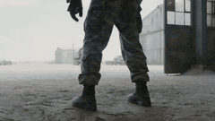

---
### Technical animation of a levitating, exploding vintage television

**Prompt:**
```
The vintage orange television slowly lifts off the table and levitates into the air. As it rises, the outer casing smoothly peels away and separates into multiple floating panels, revealing the intricate internal circuitry and components in an \"exploded view\" style. The movement is slow, fluid, and weightless, with the pieces maintaining a symmetrical arrang
```


---
### Ultra-realistic downhill skateboard ride with cinematic cinematography

**Prompt:**
```
Use Image 1 as the first frame, referencing the character design, outfit color palette, and overall visual style of Image 1. The girl is performing a high-speed downhill skateboard ride on a winding suburban mountain road. The shot uses a Steadicam follow perspective, with an intense sense of speed throughout. The powerful wind generated by the fast ride mak
```

---
### Cinematic VFX racing sequence with bullet-time rain effect

**Prompt:**
```
Cinematic VFX racing sequence shot on Arri Alexa 35 with anamorphic lenses featuring a low-profile tracking shot following a high-performance race car tearing through a rain-drenched circuit at extreme speeds. As the engine roars, the scene shifts into a hyper-realistic bullet-time sequence where time slows to a crawl, capturing millions of crystalline rain 
```

---
### Zootopia Comedic Donut Chase Short

**Prompt:**
```
15-second comedic animated short in the world and visual tone of Zootopia. High-quality stylized 3D animation, expressive facial acting, clean readable slapstick, bright police-station interior, polished reflective floor, warm indoor daylight. Visual comedy only, little or no dialogue. Judy Hopps: small fast rabbit police officer, blue ZPD uniform, hyper-ser
```


---
### Surreal Sky Ocean Battle: Whale vs. Kraken

**Prompt:**
```
Environment: A surreal ocean in the sky where enormous waves float between cloud layers. Waterfalls spill endlessly downward into the clouds below while golden sunset light illuminates the horizon. Action: 15.0s sequence. A colossal sky-whale made of shimmering water currents glides through the floating ocean waves. Rising from the clouds below, a massive kr
```


---
### Chibi Phoebe Close-up Portrait with Baby-Talk

**Prompt:**
```
Photorealistic vertical 9:16 close-up portrait of a charming young East Asian woman with long straight dark hair, wearing a simple black top, soft warm smile and playful sparkling eyes looking straight at camera, gentle baby-talk expression, cozy blurred indoor bedroom background with soft bokeh, diffused golden warm lighting creating a gentle glow on her sk
```


---
### Seedance 2.0 Short Drama Prompt: 'The Marriage'

**Prompt:**
```
Scene 1 (0~3 seconds) The Princess throws a tantrum Visuals: Inside an ancient boudoir, a mahogany dressing table. The Princess [@Image 2] is wearing a red wedding dress and a golden phoenix crown, with her long hair braided into thick pigtails hanging over her chest. The Princess is beautiful and cute, frowning, pouting in anger, and standing with hands on 
```


---
### Three-Shot Video Sequence Prompt with Audio Cues

**Prompt:**
```
Shot 1 (0.0-0.5): Macro shot of butter sliding off a spatula onto a polished floor tile. Audio: Splat-skitter Shot 2 (0.5-1.0): Extreme close-up of the Baker's eyes widening as she realizes. Audio: Sharp inhale Shot 3 (1.0-1.5): Her elbow knocks a bag of flour off the counter.
```


---
### Martial Arts Fight Scene in a Japanese Dojo

**Prompt:**
```
The scene is a Japanese-style martial arts dojo, with wooden structures and Japanese doors and windows inside, and a plaque reading \"Hongkou Dojo\" hanging above; the character is a woman with double braids, wearing a red Chinese-style top + blue pants, who fiercely shouts the line \"I'm going to fight 10 people\" before engaging in a fierce fight with multiple
```


---
### Anime Sakuga Fight Scene Prompt 1

**Prompt:**
```
Video 1: Exaggerated anime sakuga high-speed fight scene 10 seconds premium quality ultra-fluid masterpiece: tough delinquent schoolgirl unique street-tough design messy ponytail blonde streaks piercings loose torn sailor uniform toothpick in mouth cocky smirk narrowed focused
```


---
### Cinematic Forest Horror Sequence

**Prompt:**
```
Cinematic forest horror at night, dense fog, flashlight beam cutting through trees, realistic atmosphere, wet leaves, distant branches cracking, photorealistic, tense and unsettling, hard cuts only Shot 1: Wide shot of a dark forest path, thick fog, weak flashlight beam
```


---
### Documentary Style Video Prompt with Imperfect Camera Effects

**Prompt:**
```
100% real-life filmed texture, iPhone handheld camera look, documentary style, cold desaturated tones, natural overcast lighting, soft shadows, slight exposure imbalance, sensor noise, lens dirt on edges, imperfect framing, autofocus breathing, random focus shifts,
```


---
### Long Exposure Video of Contemporary Dancer

**Prompt:**
```
Prompt: Long exposure video of a contemporary dancer performing in a dark black box studio. The video captures a motion trail ghosting effect behind him, showing the path of the movement. The dancer is sharp at the end of the movement while the previous positions are blurred. Low
```


---
### Seedance 2.0 Prompt: Cyberpunk Time Travel from Disaster to Ancient Market

**Prompt:**
```
Act 1: Disaster film realistic style, one-shot. The camera starts above the floating metropolis in stormy weather, diving down onto the shattered roof of a submerged museum, where a lone cyberpunk heroine [Image 1] stands. She sees a rescue flare in the distance and starts running. The camera closely follows her as she traverses collapsed rooftops, leaps ove
```

---
### Character Description for a Kung Fu Chef

**Prompt:**
```
SUBJECTS: Subject 1: Lean kung fu chef with short, sharp-cut hair and defined jawline. Wears a modernized Chinese chef outfit fused with martial arts attire: fitted sleeveless upper garment with mandarin collar, dark matte fabric with subtle sheen; forearms wrapped with cloth
```

---
### Dark Knight and Armored Taotie Transformation

**Prompt:**
```
Core Theme: Realistic sci-fi tokusatsu; ruin collapse; dark energy convergence; heavily armored dark knight + armored Taotie (pure form) undergoing synchronized transformation; cinematic-level weight and oppression; CG realism blending biotechnology and dark heavy armor aesthetics. Character Setup Face: Strict 1:1 replication of reference image. Facial featu
```

---
### 3D CG Animation of a Monk Riding a White Horse

**Prompt:**
```
High-saturation 3D CG animation, strong contrast gold and electric blue highlights, cinematic volumetric lighting, style of Ne Zha and Monkey King animated films. A bald Buddhist monk in flowing golden-yellow wide-sleeve robes with a bright red sash, riding a majestic white
```

---
### Chubby Golden Shorthair Cat Eating Chinese Food

**Prompt:**
```
A chubby golden British Shorthair cat with round face, green eyes, pink nose, golden-orange tabby fur and white chest, sitting upright next to a small folding tray table in a dimly lit bedroom at night. The cat is holding chopsticks in its paw and eating from a steaming Chinese
```

---
### Seedance 2.0 Prompt for 'Affordable Transportation' Ad

**Prompt:**
```
0-3 seconds, medium fixed shot, two people in exquisite attire sit at a car dealership negotiation table, one aggressively slaps a bank card and shouts \"Full payment, no installments!\", the other nods proudly in agreement, the background dealership sign is blurred, accompanied by a high-end car commercial theme song + crisp card-slapping sound effect; 3-6 se
```

---
### Chibi penguin girl 'Gugu Gaga' cooking with an angry expression

**Prompt:**
```
Adorable super-deformed chibi penguin girl \"Gugu Gaga\" (Endministrator from Arknights Endfield), fluffy black-and-white penguin hood and body with big sparkling anime eyes, rosy cheeks, tiny body, oversized head, wearing vibrant pink blue white cute tactical outfit. Impatient frustrated expression shifting to playful defiance then triumphant confident smirk,
```

---
### Cinematic VFX war sequence with bullet-time tank shell firing

**Prompt:**
```
Cinematic VFX war sequence shot on Arri Alexa 65 with a high-speed tracking shot featuring an extreme close-up of a main battle tank's barrel as it recoils violently, triggering a hyper-realistic bullet-time transition. As the shell exits the muzzle, time slows to a near-halt, revealing a massive, intricate shockwave of fire and sand frozen in mid-air. The c
```

---
### Ultra-realistic martial arts choreography between a cat and a master

**Prompt:**
```
Testing martial arts choreography, fur physics, and comedic timing. 0:00 – 0:02: Extreme close-up of a chubby British Shorthair cat’s eyes. Ultra-detailed fur. 0:02 – 0:04: Hard cut to the Kung Fu master’s eyes. Focused and calm. 0:04 – 0:05: The cat softly says: “Mew.” Silence. 0:05 – 0:08: Rapid martial arts exchange. The cat dodges, spins, and flips with 
```

---
### Detailed anime battle scene prompt for Seedance 2.0

**Prompt:**
```
**Scene Setup - Ruined Martial Arts Arena** On the shattered ruins of the legendary martial arts arena, the ground is cracked and unstable. Broken stone, drifting smoke, and fragments of ancient carvings scatter across the battlefield. Ruined temple structures tremble as waves of energy distort the air. The visual style is high-energy anime cinematic: styliz
```

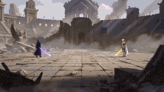

---
### Character Consistency Video Prompt

**Prompt:**
```
@0cb328e2-8254-4ec3-a17e-f6a1ddff3084 as the princess character (red hair, lavender dress, gold crown — maintain appearance throughout). @81c392ed-cc0d-456d-8fbd-9ebceeb2118c as the boy character (brown hair, beige shirt, jeans, holding broom — maintain appearance throughout).
```


---
### Dragon Quest Roto's Crest Fusion Magic 'Bagira' Video Generation Prompt

**Prompt:**
```
Scene 1: Fire Magic (Gira) in the Right Hand. An extreme close-up of Polon the Great Sage (a boy dressed as a clown) thrusting out his right hand. As he chants, \"Gira from the right hand,\" a blazing, red-glowing sphere of fire magic ignites from his right palm, illuminating the surroundings with a warm, passionate red light. High quality, cinematic lighting,
```


---
### Epic Historical-Fantasy Battle Video Prompt

**Prompt:**
```
15-second epic historical-fantasy battle, one continuous flying camera shot. At sunset over a colossal desert battlefield, two massive armies collide across a dusty plain. The camera begins high above the battlefield, racing forward through trails of flaming
```


---
### Dubai Skybridge Motorbike Stunt Video Prompt

**Prompt:**
```
A man in his early 30s, olive skin, short cropped hair, wearing a matte graphite riding suit with gold reflective piping and reinforced armored boots, accelerates a high-performance sport motorbike across a narrow glass skybridge connecting two skyscrapers in downtown Dubai at night — the city glowing gold beneath with traffic streams forming rivers of light
```


---
### Determined Penguin Rocket Sled Video Prompt

**Prompt:**
```
determined penguin straps itself into a homemade rocket sled on an icy mountain. The rocket ignites with a massive burst and launches the penguin across the frozen landscape at insane speed, blasting through snowdrifts and leaving a fiery trail behind.
```


---
### J-Horror Subway Scene

**Prompt:**
```
Late night subway. Empty corridors. She is not behind you, she is already in the walls. Created with Seedance 2.0 via @capcutapp A short horror film clip inspired by classic J-horror. She moves through the posters. She is always ahead of you. There is nowhere to run that she has not already been.
```


---
### Seedance 2.0 Video Prompt: Realistic Life Vlog Scene

**Prompt:**
```
9:16 vertical screen, 15 seconds, realistic life style, warm yellow indoor light, slightly high-angle shot from a phone stand perspective, in the frame, a girl in her twenties [Image 1] sits at a small table in a rented room, wearing only lipstick on her bare face, hair casually tied in a bun, wearing a faded gray oversized hoodie, in front of her is a fresh
```


---
### First-person Parkour Chase Video Prompt

**Prompt:**
```
First-person POV parkour chase across burning city rooftops, 10 seconds, raw handheld footage. The pursued figure ahead is fast — leaping a gap, rolling, barely catching a crumbling chimney. The camera follows, the rooftop giving way slightly underfoot, embers
```


---
### Childhood Dream to Reality Transition Video Prompt

**Prompt:**
```
One person appearing, @, 12 seconds, top-tier car commercial quality, cinematic lens, real sense of speed and pressure, smooth temporal transition, consistent character before and after, stable footage, escalating emotion. 0.0-4.0 seconds: Ultra-low angle close-up near the ground, warm golden afternoon sunlight illuminates a beige plush carpet, dust particle
```


---
### Seedance 2.0 Video Prompt: Cyberpunk Heroine in War and Desert

**Prompt:**
```
Act 1: War disaster film feel, one-shot, under the gray-blue morning light, overlooking the entire burning battlefield and the advancing military formation in the distance. The camera quickly descends into the trench, where a cyberpunk heroine, @Image 1, rushes out of a bunker torn open by artillery fire and runs towards the camera. Passing the camera, the l
```

---
### Stylized Magician Performance Video Prompt

**Prompt:**
```
STYLE Stylized 3D animation with exaggerated forms, rounded or graphic shapes, and expressive motion PEOPLE One male magician wearing a black tailcoat, white shirt, black bow tie, and a black top hat, standing in front A small crowd of audience members standing around and in
```


---
### Humorous Persian Calf Haircut Transformation Video Prompt

**Prompt:**
```
Theme: Humorous Persian calf salon haircut transformation Visuals: Professional pet salon setting with a ring light, close-up shots of a fluffy brown kid cattle wearing a black grooming cape, realistic grooming tools and techniques creating a comedic “bowl cut” hairstyle Camera: Close-up macro shots, alternating between front view, side profile, and top-down
```


---
### Seedance 2.0 Video Prompt: Cats on a Scooter

**Prompt:**
```
A scene filmed from inside a car: through the windshield, a person riding a white scooter can be seen on the road. The person is carrying a transparent backpack containing two cats. One cat is wearing a shark costume, and the other is wearing a blue bunny hat. The two cats are playing in the backpack, and upon hearing a car horn, they both turn back and hiss
```

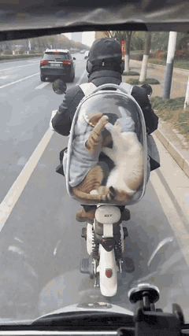

---
### Seedance 2.0 Multi-Clip Video Prompt: Immortal Apprentice

**Prompt:**
```
Style: Ethereal ancient Chinese style, fresh and sweet, first-person immersive follow, soft light aesthetic. Total duration: 15s = 6 clips × 2.5s / clip (single clip ≤ 3s, meets requirements). Core Character Design: Little Apprentice Sister | Pale white and light pink gradient gauze dress, flowing wide sleeves, head full of blingbling pearl and diamond hairp
```


---
### Seedance 2.0 Video Prompt: Seamless Seasonal Transition Skate/Snowboard

**Prompt:**
```
Background music rhythm perfectly matches the speed of the skateboarding/snowboarding action, background music volume is lower than the real-world sound effects, not masking the skateboarding and snowboarding sound effects. First-person skateboard rear-view perspective, ultra-wide angle strong perspective, slight camera shake simulating the feeling of follow
```

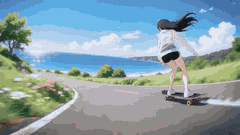

---
### Seedance 2.0 Video Prompt: Aerial Dogfight over Thai Temple

**Prompt:**
```
Clip 1 · 2s · Establishment] Subject: Black-gold heavy mech fighter, @Image 1, embossed armor, spherical dark cockpit, articulated joints. Scene: Above a grand Thai temple complex, morning mist, golden stupas faintly visible, mountains stretching into the distance. Action: Dives out of the clouds, lowers the nose, rushes directly over the temple complex, dep
```

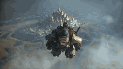

---
### Seedance 2.0 Video Prompt: Hand-Drawn Sketch to 3D Interior Transition

**Prompt:**
```
A video of a hand-drawn sketch transforming into a 3D interior in a hand-drawn style. 0:00-0:02, drawing is completed, hand and pen move out of the frame. The subsequent camera shot seems to \"drill\" into the drawing, starting in the world within the painting. The interior in the world within the painting is expressed in a hand-drawn artistic style, accompani
```


---
### Cultural Contrast: Flute Player in Cyberpunk Alley

**Prompt:**
```
Medium close-up cinematic shot, an elderly Chinese grandfather with deep wrinkles and kind eyes plays a bamboo flute in a rain-soaked neon-lit cyberpunk alley at night, his eyes half-closed in deep peaceful concentration, slight gentle body sway as he plays, visible warm breath in the cold night air, green and pink neon lights reflecting on his weathered fac
```

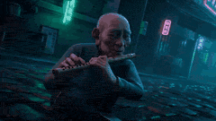

---
### Seedance 2.0 Video Prompt: Seamless Ancient Chinese Costume Change

**Prompt:**
```
Character: Pure, cute, beautiful woman, cool white skin, a mole at the corner of the eye, slender figure, fair skin, fresh and natural style 0-1 second: Plain simple Ruqun (ancient dress), gentle girl, standing still with hands down, delicate hands lightly gathering sleeves, cool ancient style atmosphere, warm low-saturation tone, soft focus filter, medium s
```

---
### Hospital Corridor Emotional Scene

**Prompt:**
```
Testing lighting, \"camera language,\" and subtle human emotion. Lighting: Cool hospital daylight, soft gray window light, slight green medical tint. Color Palette: Soft gray, muted blue, pale green, tired skin tones. Cut 1: A hospital corridor at dawn. A father rushes toward a pediatric room in office clothes, tie loosened, crushed flowers in hand. Cut 2: Thr
```


---
### Chibi Penguin-Girl Dance Video Prompt

**Prompt:**
```
masterpiece hyper-cute kawaii 3D CGI animation, best quality, smooth fluid motion. Adorable chibi penguin-girl hybrid “Penguin Endministrator” / Yuki: anime-style face with huge sparkling sapphire-blue eyes full of highlights and long lashes, rosy blush cheeks, gentle happy smile, black straight bob haircut with bangs and small silver hair clips plus a tiny 
```


---
### Golden Hour Road Trip Cinematic Scene

**Prompt:**
```
Real POV front seat dashcam view, a vintage 1950s American woody station wagon with chrome bumpers drives alone on a long empty desert highway at golden hour, dust clouds trailing behind the wheels in the warm evening light, realistic natural lighting, handheld authentic feel 📐 Aspect Ratio: 16:9 🖼️ Quality: 4K 🎨 Style: documentary realism / authentic vin
```

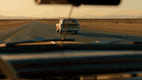

---
### Seedance 2.0 Dance Video Generation Prompt

**Prompt:**
```
Live-action style, a beautiful girl @【@Image 2】 with long black hair, wearing a slip dress referencing @【@Image 1】, fair skin, playfully dancing to Future House style DJ music. Dance moves include playful hip sway, arm waves, and fixed poses, perfectly synchronized with the music beat; the camera will push and pull following the music beat. The background is
```


---
### Cyberpunk Trailer from Image Reference

**Prompt:**
```
(Image 1) as a live-action reference; create a 15-second video trailer with a cyberpunk, dark, shadowy vibe, an epic, all-encompassing intensity, and a visually explosive impact. No text or symbols in the frame. Entirely live-action.
```


---
### Seedance 2.0 Prompt: ATV Racing in a Desert Sandstorm

**Prompt:**
```
First-person POV from an ATV racing through a massive desert sandstorm. Visibility drops as sand blasts across the camera. Lightning flashes inside the storm clouds. The rider jumps a dune ramp and lands near a moving cargo convoy. Desert storm POV ride, dune jump stunt, cinematic dust chaos, 4K.
```

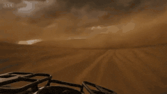

---
### Kanuragan Action-Comedy Scene

**Prompt:**
```
Eastern action-comedy style, 15 seconds, one continuous take. Inside a simple wooden padepokan (traditional martial arts hall) in West Java with a strong Javanese mysticism (kejawen) atmosphere, an elderly inner-power master stands calmly at the center, wearing traditional black attire. His expression is humble and composed, as if he’s only about to demonstr
```


---
### Adventurer on Dragon Approaching Pirate Ship

**Prompt:**
```
An adventurer, mounted on her dragon, soars through the sky, the massive creature's wings beating fiercely as it nears a pirate ship on the horizon. The ship, perched on the choppy sea, seems unaware of the looming threat. The dragon, with scales shimmering in the
```


---
### Gundam Transformation Video Prompt (Seedance 2.0)

**Prompt:**
```
Core Theme: Realistic sense of technology, sci-fi mecha, epic grandeur, heavy industrial mechanical aesthetics, live-action performance, extreme sports. Character Setting: Refer to Image 3, identical, 1.7 meters tall, slightly dirty face; red special operations uniform, high-tech tactical vest, wrist-mounted screen controller. Clothing and accessories show o
```


---
### Seedance 2.0 Prompt: Melancholic Chibi Penguin in Snow

**Prompt:**
```
Ultra-detailed 12–15 second cinematic animation, 3D CGI style, emotional storytelling, soft winter lighting. Scene: a small chibi penguin character struggling through deep snow in a quiet, snowy landscape. The penguin looks exhausted and slightly sad, crawling forward slowly with tiny flippers, leaving a trail behind. Environment: vast snowy terrain with gen
```


---
### Seedance 2.0 Prompt: Gugugaga Penguin Figurines

**Prompt:**
```
smooth fluid AI animation of multiple cute chibi Gugugaga penguin characters from Arknights Endfield displayed as 3D figurines on a shiny white plate, the little penguins subtly blink, tilt heads cutely, wiggle bodies and make tiny happy movements while staying in formation, gentle slow camera pan across the group with slight zoom, kawaii chibi anime style b
```


---
### Bus Disassembly and Reorganization

**Prompt:**
```
An old, green, oversized, and extra-tall American-style bus is parked in a dilapidated parking lot in a forest. A young Asian driver slams on the brakes, looking tense and speechless. The bus begins to violently disassemble and reorganize from the inside out,
```


---
### Kawaii chibi penguin-girl dancing prompt

**Prompt:**
```
Ultra-detailed 12-second vertical 9:16 TikTok animation, hyper-cute kawaii 3D CGI style, masterpiece quality. Main character: adorable chibi penguin-girl hybrid named Yuki. Anime girl face with huge sparkling sapphire-blue eyes, long lashes, black straight bob haircut with bangs, small silver hair clips, rosy blush cheeks, gentle happy smile. Body is soft fl
```


---
### First-person seamless rollercoaster ride through changing environments

**Prompt:**
```
A first-person perspective rollercoaster ride scene. Hands gripping the safety bar are visible at the bottom of the screen. A completely seamless one-take video. No cuts or transitions whatsoever. The rollercoaster travels at high speed on the rails, including steep drops, loops, and sharp turns. The camera naturally shakes as the rider's viewpoint, accompan
```

---
### Cinematic Beach Scene with Sandworm and Warrior

**Prompt:**
```
Cinematic beach scene, sunny day, realistic raw footage of people walking on sand near ocean waves. Suddenly a massive sandworm monster bursts out of the sand in the background,a huge gaping mouth with teeth,Dune-style giant worm,dust \u0026 sand explosion. In the foreground a fierce
```

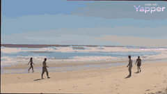

---
### Seedance 2.0 Prompt: Gugu Gaga Harvesting Cuteness

**Prompt:**
```
masterpiece, best quality, ultra-cute 3D chibi anime animation of adorable penguin girl Gugu Gaga Endministrator from Arknights Endfield, fluffy black penguin body with pure white belly patch, small wings and yellow webbed feet, large yellow beak, chibi anime girl face with short black bob haircut and straight bangs, enormous sparkling emerald-green eyes wit
```


---
### Seamless Four-Season Skate/Snowboard Journey Video Prompt

**Prompt:**
```
The rhythm of the background music must perfectly match the speed of the skateboarding/snowboarding actions. The volume of the background music should be lower than the real-world sound effects, not masking the sounds of the skateboard and snowboard. First-person perspective, looking back over the shoulder while skateboarding, ultra-wide angle with strong pe
```


---
### Viral Game Comedy Video Prompt

**Prompt:**
```
FORMAT: 15s / MULTI-CUT / 6 BEATS / HIGH-VIRAL GAME COMEDY SUBJECTS: A spirited young customer with huge expressive eyes, varsity jacket, sneakers, and bouncy cartoon timing. A charismatic shrimp chef with a tall paper hat,
```


---
### Shrimp Wars Animation Prompt

**Prompt:**
```
Shrimp Wars 🦐 This is an animation about a playful shrimp toss duel that hooks the viewer instantly and keeps them engaged through rhythm.
```


---
### Nezha vs. Monkey King Martial Arts Video Prompt (Seedance 2.0)

**Prompt:**
```
Dual-wielding weapons combat + Fog Hill of Five Elements (Wushan Wuxing) national comic style + fist-to-flesh combat + animation-level camera work + two people evenly matched, each with their own strengths. Scene 1: Battle starts immediately · Weapon clash Authentic Wushan Wuxing national comic style, sharp, hard-edged ink lines, high-contrast red and black 
```

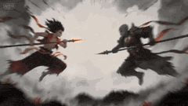

---
### Epic Fantasy War Video Generation in Extreme Cold Environment

**Prompt:**
```
Part 1: Generate a video based on the female protagonist in the image, an epic fantasy war video, set in an extremely cold, snowy mountain blizzard environment, with strong visual impact, no background music, only retaining the sound effects of the blizzard, wind, footsteps on snow, alien screams, and charging air-breaking sounds; a European female warrior s
```


---
### Seedance 2.0 Prompt: Gugu Gaga on a Mountain Top

**Prompt:**
```
A highly detailed 3D CGI kawaii animation still of an ultra-cute anthropomorphic penguin girl standing on a snowy rock in a majestic snow-covered mountain landscape, fluffy black penguin body with pure white belly patch, small wings, yellow webbed feet and large yellow beak, chibi anime girl face with short black bob haircut + straight bangs + blue hair clip
```


---
### Gothic Airship Transformation

**Prompt:**
```
She stands alone on the elevated bridge of a massive fantasy airship at night, with ornate iron railings and glowing cyan accent lights. The ship has a dark gothic organic design with intricate surface details. She gazes out at the dark sky with an empty, distant expression. The night sky and landscape behind her gradually distort and shift into a scorched, 
```


---
### White Tiger Hunter in Glacial Canyon

**Prompt:**
```
A vast frozen valley under pale twilight. Towering glacier walls reflect soft blue light across the snowfield while wind sweeps fine snow particles across the surface. The frozen ground glitters with crystalline frost. **Action:** 15.0s sequence from the first-person perspective of a massive glacier tiger stalking prey. The viewer sees white fur edges at the
```


---
### Sitcom Dialogue Scene Prompt

**Prompt:**
```
Wide shot two friends sit on sofa and talk in very excited, dumb voices Friend 1 (eyes wide, super excited, loud): Bro… we’re DONE being broke!! Close-up on Friend 2 (confused but hyped): What’s the plan??? Close-up on Friend 1 (dead serious, leaning in): Vibecoding!
```

---
### Zero-Gravity Rotating Corridor Fight

**Prompt:**
```
Sci-fi action film style, 15 seconds, one continuous take. The camera enters a white high-tech transport ship corridor. Red warning lights begin to flash, the gravity system suddenly malfunctions, and the entire corridor slowly begins to rotate. The camera closely follows an agent in a dark gray tactical suit at medium-close range as he engages in extremely 
```


---
### Ancient Egyptian Warrior vs. Nile Mud Beast

**Prompt:**
```
an ancient Egyptian warrior king vs a cursed Nile mud beast in flooded temple ruins at night. Close camera, brutal action, heavy rain, black water, lightning, and khopesh combat.
```


---
### Crimson Relic-War Transformation and Angel Fight

**Prompt:**
```
Use the provided images as exact references for the woman, her transformed crimson relic-war form, and the radiant angelic war-saint. 15-second ultra-cinematic live-action sequence in an abandoned financial district boulevard by day, overcast sky, cracked pavement, wrecked cars, broken glass, drifting dust, damaged towers, grounded realism. A woman walks alo
```


---
### Giant Prehistoric Beast Wakes Up in the Desert

**Prompt:**
```
A giant prehistoric beast wakes up in the desert. Opens its mouth. And roars.
```


---
### Continuous Shot Astronaut Video Prompt (Seedance 2.0 Omni)

**Prompt:**
```
FORMAT: 15s / ONE CONTINUOUS SHOT / NO CUTS / high-tension cinematic realism SUBJECTS: A lone astronaut in a worn white EVA
```


---
### Action Comedy: Polite Master in Dojo

**Prompt:**
```
Eastern action-comedy style, 15 seconds, one continuous take. Inside a wooden dojo, an elderly legendary master has been invited to give a “gentle balance demonstration.” He stands at the center, humble and restrained in expression. Several students step forward one by one to assist. He merely taps a shoulder, wrist, or forehead lightly with a single finger,
```


---
### Seedance 2.0 Chinese Fantasy CG Prompt: Calligraphy Magic

**Prompt:**
```
Top-tier Chinese fantasy animated CG, cinematic Eastern fantasy blockbuster quality, ultra-high saturation, fusion of gold and ink, surreal visual spectacle, magnificent and shocking, strong sense of divine oppression. 16:9 aspect ratio, 15 seconds duration, smooth and fluid visuals, advanced camera work, clear action, grand special effects, extremely strong
```


---
### Wartime Disaster Movie Scene, One-Shot

**Prompt:**
```
Wartime disaster movie feel, one-shot, under the gray-blue morning light, a young messenger rushes out of an underground bunker torn open by artillery fire. The camera closely follows him at high speed, passing through muddy trenches, burning supply vehicles, exploded wooden bridges, and scattered fleeing crowds. Artillery shells continuously fall in the dis
```


---
### Action Comedy: Old Master in Hotel Lobby

**Prompt:**
```
Comedy action short film style, 15 seconds, one continuous take. Inside a luxurious hotel lobby, an elderly legendary martial arts master in a simple dark jacket and jeans walks slowly toward a revolving door, completely calm and expressionless. More than ten black-clad attackers rush at him from every direction. He barely uses any force at all, casually bru
```


---
### Seedance 2.0 Chinese Ink Style Cat vs Dog Battle Prompt

**Prompt:**
```
Authentic Chinese ink-style animation (Wushan Wuxing/Fog Hill of Five Elements), sharp, hard-edged ink lines, high-contrast red/black and cyan/gold main color palette, cinematic lighting, Chinese fantasy battle aesthetic, strong sense of impact, strong energy collision, 16:9 aspect ratio, 15 seconds duration, smooth and fluid visuals, coherent and clear acti
```

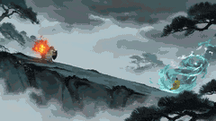

---
### Epic Chinese Fantasy CG Video: Four Arts of the Scholar

**Prompt:**
```
Top-tier Chinese fantasy animation CG. Extremely high-saturation color explosion, surrealism, magnificent visual experience. Scene: Atop the vast and boundless sea of clouds, heaven and earth transform into a gigantic Tai Chi illusion. Shot 1 (Close-up transitioning to Medium Shot): [Lute Sound Manifests Lotus] The character sits cross-legged in the air, pla
```


---
### Colossal Prehistoric Shark Attack Video Prompt

**Prompt:**
```
A colossal prehistoric great white shark the size of a skyscraper erupts from the violent stormy ocean, jaws wide open, crushing a massive steel cargo container ship in its teeth. Shipping containers tumble and shatter as the vessel buckles and splits apart. The camera opens
```


---
### First-Person POV Flying Broomstick Video Generation

**Prompt:**
```
Video type: vertical cinematic video, 9:16 aspect ratio, ultra realistic, 4K, 24fps Perspective: Strict first-person POV from a young Japanese woman riding a flying broom Camera = her eye level No third-person shots, no external camera --- Character (visible elements only): Both hands clearly visible, gripping a wooden broom stick firmly (left and right hand
```


---
### Kamen Rider Villain Transformation Sequence Video

**Prompt:**
```
vertical video, 9:16, 10 seconds, ultra realistic, cinematic lighting, Japanese woman age 20, natural beauty, medium-length black hair, casual outfit, modern apartment room, soft daylight, high detail skin texture, shallow depth of field, subtle camera push-in Scene starts with the woman sitting casually on a sofa, holding her smartphone, relaxed expression 
```


---
### Cinematic Drone Dive into a Person's Eye

**Prompt:**
```
ultra cinematic drone shot, top-down aerial view, a young Japanese woman (early 20s) standing still in the middle of a quiet urban street in Tokyo, casual outfit, natural makeup, soft daylight, realistic environment, highly detailed textures camera starts at high altitude (around 50 meters), perfectly stabilized drone shot, slowly accelerating downward towar
```

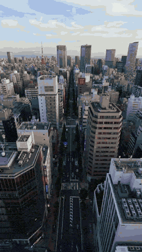

---
### Dark Warrior vs Lava Dragon Cinematic Scene Prompt

**Prompt:**
```
{ \"scene\": \"ancient ruined city with fire and ash everywhere\", \"subject\": \"girl with glowing red eyes, transforming into a dark warrior\", \"action\": \"she runs across burning ground, summoning dark energy blades from her hands\", \"dragon\": \"giant demonic dragon with molten lava skin and glowing cracks\", \"interaction\": \"she leaps, slicing through dragon wings, l
```

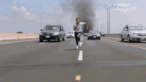

---
### Bentley S2 Continental ASMR Video Prompt

**Prompt:**
```
FORMAT: 15s / 68 BPM / 6 CUTS / cinematic realism, luxury creator-style car ASMR SUBJECTS: A cream and silver Bentley S2 Continental presented as a timeless luxury icon, long hood, mirror chrome, deep wood veneer, quilted leather, and stately glasshouse
```


---
### Cinematic Honeybee Nectar Collection

**Prompt:**
```
A cinematic video of honeybees actively collecting nectar on a bright yellow sunflower in a lush, colorful garden filled with blooming flowers and green plants. A small, beautiful waterfall flows gently nearby, with water droplets sparkling in sunlight. The scene is vibrant, peaceful, and natural, with soft lighting, slight breeze moving the flowers, and rea
```


---
### Seedance 2.0 Video Prompt: Giant Asian Man Destroying Warships

**Prompt:**
```
Subject: Giant middle-aged Asian male from Image 1, black hair neatly slicked back with silver-grey strands, goatee, sharp facial features with cinematic detail, eyes full of anger and killing intent, wearing a white high-end suit jacket, white shirt, black tie, dark trousers, right hand tightly gripping a giant handgun, extremely realistic muscle contours. 
```

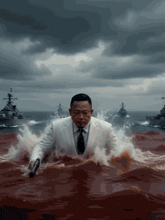

---
### Furious Giant Dragon Emerging from Ocean

**Prompt:**
```
From the ocean emerges a furious giant (element) red dragon, leaping and flying above the ship at great speed, splashing through the great ocean waves. Dynamic shot following the dragon as it moves away through the storm, splashing through the giant waves
```


---
### One-Shot War Disaster Film Sequence

**Prompt:**
```
Cinematic war disaster film feel, one-shot sequence. Under the gray-blue light of dawn, a young messenger rushes out of an underground bunker torn open by artillery fire. The camera closely follows him at high speed from behind, passing through muddy trenches, burning supply vehicles, shattered wooden bridges, and scattering crowds. Shells continuously fall 
```


---
### Seedance 2.0 Chinese Fantasy CG Prompt: Painter Immortal

**Prompt:**
```
Top-tier Chinese fantasy animated CG, cinematic Eastern fantasy blockbuster quality, ultra-high saturation, color explosion, surreal visual experience. Scene is a giant underground rock cave, magnificent, eerie, dreamy, and dangerous. 16:9 aspect ratio, 15 seconds duration, smooth and fluid camera work, grand special effects, advanced visuals, clear main sub
```

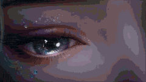

---
### Leopard Prowling Through a Surreal Forest in Henri Rousseau Style

**Prompt:**
```
\"Side shot of a leopard moving gracefully through a surreal forest, the camera tracking alongside it as it prowls between tall, blue-hued trees. The background glows with deep amber light, evoking an otherworldly dusk. [cut] Close-up side shot
```


---
### Solitary Figure Rising at Dusk in J. M. W. Turner Style

**Prompt:**
```
\"A solitary figure rises slowly from a stone ledge beside a misty river at dusk, the vast orange sun burning through the haze behind him. [cut] Close-up shot of his feet as he walks past skulls placed on the ground. [cut] Close-up shot of the
```


---
### Women Placing Glowing Lanterns on Water in Hieronymus Bosch Style

**Prompt:**
```
\"Women in white robes kneel by a dark river, gently placing glowing lanterns onto the still water. [cut] Close-up shot of woman placing a lantern onto the water. [cut] The water begins to burn - golden fire spreading outward like liquid light
```


---
### Car Driving Through Melting Clocks Canyon in Salvador Dalí Style

**Prompt:**
```
\"A car drives through a surreal canyon where enormous clocks carved into the cliffs melt like wax. A colossal stone face watches the car pass, its eyes subtly tracking the movement. [cut] Close-up: spinning wheels gripping the canyon road. [cut]
```


---
### Dreamlike Kiss in Franz Marc Style

**Prompt:**
```
\"A couple kisses in a dreamlike, colorful painting. The man in blue and the woman in red embrace amid flowing flowers and soft swirling patterns of blue, orange, and gold. White swans glide through the painterly sky as the camera slowly moves toward
```


---
### Monk Placing a Glowing Flame in Hieronymus Bosch Style

**Prompt:**
```
\"The monk kneels slowly and places a small glowing flame onto the cracked earth. [cut] As he withdraws his hands, the camera begins to circle him in a smooth 360° motion, revealing the surreal landscape in every direction. The flame flickers
```


---
### Surreal Geometric City Walk in Pablo Picasso Style

**Prompt:**
```
\"Side tracking shot: A man in a dark coat walks through a surreal geometric city of arches and towers. [Cut] Back shot: The man walks through the geometric city, then turns right and enters an alley, moving deeper into the maze-like streets.
```


---
### Romero Britto style video prompt

**Prompt:**
```
\"Two men play chess in a colorful pop-art style. Bold lines, bright geometric patterns, and expressive faces create a vibrant, playful atmosphere. [cut] Close-up of the other man nervously drumming his fingers on the table. [cut] Side close-up
```


---
### Van Gogh style video prompt

**Prompt:**
```
\"A lone man stands in a small wooden boat, adrift among turbulent glowing waves beneath a swirling, star-filled sky. The camera drifts slowly over the surface of the water. Cool blue palette, painterly textures, gentle motion blur across the waves.
```


---
### Hyper-Realistic Football Strike Sequence

**Prompt:**
```
[Film Style]: Hyper-realistic sports cinematography, extreme 12mm fish-eye lens, 4K digital sharpness, high-shutter speed, cinematic stadium floodlights with anamorphic lens flares. [Core Soundtrack]: Immersive stadium atmosphere, rhythmic heavy breathing, the \"thwack\" of a ball strike, and an explosive, muffled crowd roar upon impact. [Video Duration]: 15 s
```


---
### Warehouse Breach to Rooftop Inferno Cinematic Script

**Prompt:**
```
FORMAT: 15s / 8 SHOTS / first-person action / no dialogue STYLE: photoreal action cinema, extreme handheld POV, natural recoil, fast target acquisition, close-quarters pistol choreography, hard impacts, muzzle flash lighting, practical debris, realistic reloads, warm-cool cinematic contrast Scene 1: Warehouse Breach to Rooftop Inferno Shot 01 (0:00-0:02) Fir
```

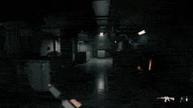

---
### The Office Dragon

**Prompt:**
```
quick cuts of a photorealistic \"office dragon\" hyper-flying through multiple office rooms, between people, over desks, around people, in a busy cubicle office. it lands on one persons desk and blows fiery flames at the man. the dragon says \"you're fired\"
```


---
### CatFu Dojo Fight Scene

**Prompt:**
```
Inside a traditional dojo, an old scarred cat master faces a young energetic kitten.
```


---
### Gugu Gaga Chibi Anime Reaction

**Prompt:**
```
masterpiece, best quality, ultra-cute 3D chibi anime animation, adorable moe girl \"Gugu Gaga\" (Endministrator) wearing oversized fluffy black-and-white penguin kigurumi onesie with hood and beak details, yellow beak and feet accents, short black bob hair, enormous sparkling anime eyes with highlights, tiny stubby body and arms, rosy cheeks, holding and bitin
```


---
### Cyberpunk Romance Scene: School Anniversary Night

**Prompt:**
```
8K ultra-detailed cyberpunk romance cinema, school anniversary night overflowing with holographic cherry blossoms, floating lantern swarms, glossy rain-wet pavement, candy-colored neon, and a giant skyline ferris wheel above the academy. Two student lovers become a
```

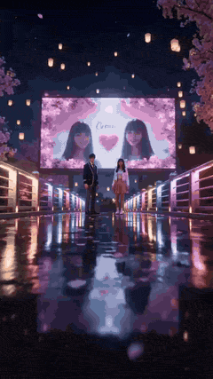

---
### Seedance 2.0 Video Prompt: Fashion Commercial for Adam Hat Brand

**Prompt:**
```
[Subject]: Young Asian beauty @[Image 1] wearing an [Adam] brand trendy knit/baseball cap (coarse grain texture, side hot-stamped Logo). [Time-Segmented Shot Definition]: - 0:00-0:04: [IMAX Wide / Close-up] 4K wide close-up. Low angle shot, capturing the female subject's eyes under the brim of the hat. Enhanced contrast, presenting deep gaze. Coarse grain fi
```

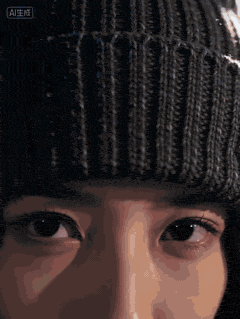

---
### Vertical Action Insertion: Tactical Courier Freefall

**Prompt:**
```
Image prompt A tactical courier in matte black climbing gear sits in the open doorway of a tilt-rotor aircraft over a neon megacity at dusk, boots hanging over the edge, wind tearing at straps and cables, skyscrapers below, cinematic action realism. Video motion prompt: Action-thriller, one-take. The camera begins inside the open doorway of a tilt-rotor airc
```


---
### Cinematic cat action comedy prompt

**Prompt:**
```
8K ultra-detailed, cinematic master look, premium color grading, volumetric lighting, advanced physics simulation enabled. A comic-style cat action comedy with fiery shonen energy. Set in an ancient-style inn during a night battle: paper lanterns sway, wet bluestone pavement
```

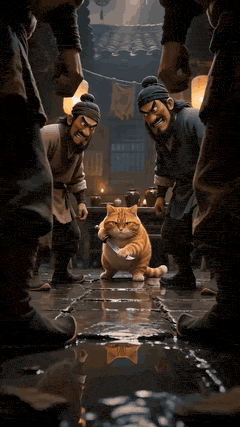

---
### Chibi Moe Anime Penguin Girl

**Prompt:**
```
A high-quality 3D chibi moe anime short video, vertical 9:16. Adorable kawaii penguin girl character \"Aunt Gaga\" (Gugu Gaga), big sparkling doe eyes, chubby cheeks, tiny body, black-and-white penguin hoodie costume with yellow beak and feet details, soft blush, black hair peeking out, playful mischievous expression. Cozy dimly lit bedroom at night, warm desk
```


---
### Master Prompts on Vadoo AI

**Prompt:**
```
Alarms blare, gravity disappears, and a space station begins to collapse… one engineer races against time to stop total destruction.
```


---
### Ramadan to Eid Infinity Zoom Hyperlapse

**Prompt:**
```
Seamless infinity zoom hyperlapse through highly detailed paper-cut art capturing the journey of Ramadan to Eid celebration. The scene begins with a glowing crescent moon above a quiet neighborhood at sahur time, soft lantern lights flickering. The camera zooms into a house window where a family is preparing sahur, then transitions smoothly into a fast-paced
```


---
### Female Character Armor Assembly and Flight

**Prompt:**
```
Shot 1(8 seconds) a Powerful female character. Cinematic wide shot, soaring above a dramatic, swirling sea of golden hour clouds as warm orange sunlight catches the mist. Wind whips her hair and clothing with high physical realism. From all directions, sleek futuristic mechanical armor pieces—chest plate, shoulder guards, gauntlets, leg armor, and a glowing 
```


---
### Fast Seedance 2.0 Prompt for a Miniature Dragon

**Prompt:**
```
Masterpiece, best quality, 8K ultra high definition, photorealistic, cinematic lighting, completely consistent with the reference image, a super miniature pearlescent iridescent little dragon, golden glowing big eyes, with fine shimmering scales, small pointed horns and translucent wings, front paws firmly clinging to the pant leg of dark grey sweatpants, po
```

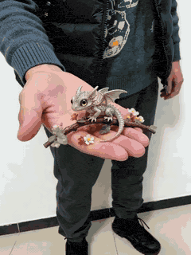

---
### Cinematic Manga Romance: Confession on an Overpass

**Prompt:**
```
8K ultra-detailed, cinematic manga romance, 16:9. After-school spring overpass beside a city campus, shy girl in a white shirt and a quiet dark-haired boy. First 3 seconds: a sharp gust tears a confession sketch from her notebook and slaps it against the boy's chest as they brush
```

---
### Seedance 2.0 Mecha Transformation Video Prompt

**Prompt:**
```
Core Theme: Realistic sci-fi feel, sci-fi mecha, epic grandeur, heavy industrial mechanical aesthetic, live-action performance, extreme sports Character Setting: Reference @Image 1, completely identical, 1.7 meters tall, slightly dirty face; red special forces combat uniform, high-tech tactical vest, arm-worn controller with screen, clothing and accessories 
```


---
### Sci-fi superhero duel prompt

**Prompt:**
```
Blockbuster superhero sci-fi duel inside a near-future reactor core chamber; one adult male armored striker versus one adult female plasma-blade duelist. Use realistic male body proportion around 7.5 to 8 heads tall, broad shoulders, long legs, defined but not exaggerated muscle
```


---
### Close-up of a parrot getting a haircut, scene 1

**Prompt:**
```
01-00 Close-up: The hairdresser uses a comb to lift the feathers on the top of the head for precise trimming. CU, orange-headed parrot wearing a black hair salon cape, stylist hands using silver scissors and a comb to trim top feathers, professional salon lighting, ring light reflection in eyes. 02 00:01 Mid-shot: The hairdresser picks up a spray bottle and 
```


---
### Seedance 2.0 Video Prompt: Mahjong Scene with Masseuses

**Prompt:**
```
15-second slice-of-life light comedy, warm yellow indoor lighting, Chengdu mahjong hall atmosphere, 2.35:1 aspect ratio, 24fps, 0-3 seconds: Medium shot, square mahjong table, four young men sitting around playing Chengdu mahjong, from left to right: Xunxun, Hanghang, Xinxin, Zuozuo. Behind each person stands a girl in a Qipao giving them a shoulder massage.
```


---
### Seedance 2.0 Video Prompt: Epic Fantasy Aerial Dragon Attack

**Prompt:**
```
Overall Intent: Epic, tense, and realistic fantasy aerial assault. A male rider on a black-scaled dragon patrols, discovers a ground threat, and spews deadly flames, showcasing overwhelming power and high-contrast dark cinematic texture. Shot Sequence: Shot 1 (0-2s) Wide Shot • Camera Movement: Low-angle follow shot • Core Action: A male rider in worn leathe
```

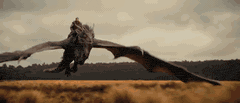

---
### Sci-Fi Action Scene: Woman in Adaptive Suit vs. Tactical Enforcers

**Prompt:**
```
8K ultra-detailed blockbuster sci-fi cinema; a beautiful adult woman in a white-silver adaptive tech suit fights five adult male tactical enforcers inside a red-alert alien mothership corridor. Her suit has blue energy seams, a glowing forearm blade, magnetic shield, and
```


---
### Epic Sci-Fi Action Sequence Prompt for Seedance 2.0

**Prompt:**
```
Act 1: Industrial Ruins Chase, 15 seconds, one-shot. Subject: The cyberpunk heroine @Image 2 stands on the roof of the leading armored chariot Image 1—wearing a white formal suit, mechanical prosthetic arm, metal neck armor, ponytail hairstyle, gold earrings, holding a red flag spear high in one hand, pointing towards the deep canyon ahead. Facial details ar
```

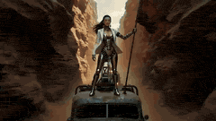

---
### Continuous One-Take Disaster Film Realism

**Prompt:**
```
A lone emergency technician in an orange survival jacket stands on the shattered roof of a flooded museum in a drowned European capital, storm clouds overhead, broken statues and floating debris below, cold blue-grey palette, cinematic disaster realism, wet surfaces, strong scale, 35mm film look. Disaster film realism, one-take. The camera starts high above 
```


---
### Dramatic mountain range eagle dive sequence for Seedance 2

**Prompt:**
```
A dramatic mountain range at sunrise with massive cliffs dropping into deep valleys filled with clouds. Warm golden sunlight illuminates the peaks while cool blue shadows cover the canyon below. **Action:** 15.0s sequence from the POV of a giant golden eagle soaring high above the mountains. The viewer sees the tips of massive wings occasionally entering fra
```


---
### Realistic Nightclub Short Video with Face Consistency

**Prompt:**
```
15 seconds, 9:16 aspect ratio, high-definition realistic live-action nightclub short film, with the texture of a close-up vertical shot taken with a mobile phone. The main character should only inherit the facial recognition, face shape, facial feature proportions, hairstyle, skin tone, sense of age, and sweet and playful temperament of the person in image 1
```


---
### Seedance 2.0 Global Female General Armor Transformation Video Prompt

**Prompt:**
```
Core Scene Prompt @94d74b42-17ec-45d3-ab60-487c3a1700cb 12 seconds to complete 10 sets of global female armor transformations. Throughout the process, no glasses, full armor helmets + weapons, pure female general styling. All transitions include glowing particle special effects. The style is uniformly high-end, realistic, and shocking. Scenes by time segment
```

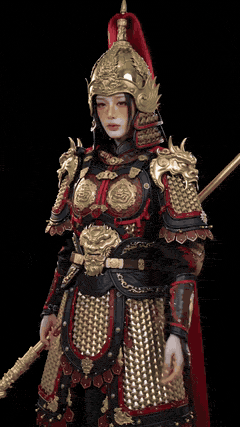

---
### Motivated Continuous Camera Movement in Medieval Market Video Prompt

**Prompt:**
```
FORMAT: cinematic continuous shot / motivated camera movement / 15s SCENE A crowded medieval market street inside a stone city at dusk. Narrow cobblestone road, wooden stalls, hanging banners, livestock moving through the crowd. Warm torchlight reflects on damp stones while light mist drifts between buildings. CAMERA CONCEPT A continuous motivated camera mov
```


---
### Viral Pixar-Style Turkish Ice Cream Trick Video Prompt

**Prompt:**
```
FORMAT: 15s / MULTI-CUT / 6 BEATS / HIGH-VIRAL COMEDIC PAYOFF SUBJECTS: A small round-faced figure with huge eyes, copper-red pigtails, a yellow polka-dot dress, and exaggerated cartoon proportions. A tall ice cream vendor with a curled mustache, crimson vest, tilted cap, and a long brass paddle carrying elastic white ice cream. Stylized 3D animation with ro
```


---
### Large-Scale Architectural Transformation and Destruction Physics Video Prompt

**Prompt:**
```
A majestic presence in a dark, flowing mantle stands amidst a vibrant city square, its coat woven with shimmering violet lines that trace hidden patterns — as it lifts a hand, the lines burst into radiant light. A subtle shift forms beneath the surface. The square gently slopes downward. The scene evolves: cars glide toward the shift, water features swirl in
```


---
### Epic Dragon Battle Video Prompt for Seedance 2.0

**Prompt:**
```
Scene 1 (3 seconds): A veteran warrior wearing a tattered cloak rides on the back of a huge obsidian scaled dragon, standing on the edge of a broken, rugged cliff. The dragon spreads its wings and lets out a thunderous roar. They dive down from the cliff edge, the sky filled with dancing sparks and swirling fly ash. Scene 2 (4 seconds): The warrior clings ti
```

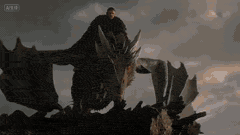

---
### Epic Superhero Transformation and Dragon Fight Video Prompt

**Prompt:**
```
{ \"scene\": \"A terrified girl sprinting through a burning modern city highway at night\", \"subject\": \"young woman, messy hair, torn clothes, intense fear turning into rage\", \"action\": \"she runs at superhuman speed, energy begins glowing from her body, each step cracks the road, cars flip into the air as shockwaves burst outward\", \"transformation\": \"mid-run she
```


---
### Sweet and Reversing Ancient Romance Short Drama Video Prompt

**Prompt:**
```
15-second Sweet Attack Reversal Short Drama \"Heart Gu\" Style: Sweet romance, contrast, strong reversal Characters: Male Lead [@Image 1]: Ye Ci, cold-faced Poison King, immune to all poisons, aloof. Female Lead [@Image 2]: Wearing a light blue sheer wide-sleeved dress, carrying a small medicine pouch, a charming female Gu doctor, skilled in planting 'Heart Gu
```


---
### One-Shot Continuous Fall Through Four Layers of Reality

**Prompt:**
```
one-shot continuous take, on a rooftop at dusk, a young man condenses a golden energy core between his hands, the surrounding air is torn open into a rotating spacetime rift. The camera quickly pushes into the rift, following him as he falls together into the first layer world: an abandoned future city, floating wreckage and gigantic ring-shaped motherships 
```


---
### Vibrant Orange Soda Commercial Shot

**Prompt:**
```
A vibrant orange soda can surrounded by splashing citrus slices and sparkling water droplets in slow motion, bright energetic lighting, high-detail commercial shot
```


---
### Cinematic Duel: Wolverine vs. Hulk

**Prompt:**
```
High-budget cinematic action sequence. A battle-worn Wolverine with sharp, reflective metal claws engages in a brutal fight against a massive, muscular Hulk in a misty pine forest. Wolverine has realistic facial features resembling Hugh Jackman, with visible sweat and bloodstains. The Hulk is a towering green behemoth with hyper-detailed skin pores and bulgi
```


---
### Celestial Goddess Manifestation at the White House Video Prompt

**Prompt:**
```
A cinematic wide shot set on the lawn of the White House. A young blonde woman in a modern white and yellow outfit stands defiantly. She performs a mystical hand gesture, triggering a glowing purple sigil on her forehead. As she speaks an incantation, her eyes glow with intense golden light, and a massive, ethereal, translucent celestial goddess made of glow
```


---
### Cinematic Hyper-Realism: Silver BMW i8

**Prompt:**
```
The scene starts with a medium-wide handheld shot at eye level using a DSLR with a 50mm lens, focusing on a silver BMW i8 from a frontal angle. The car is stationary with its butterfly doors open, revealing sleek interior details. The setting features a modern urban environment with glass building reflections \u0026 concrete walls under an overcast sky, lending a
```

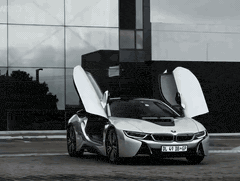

---
### Spring Outing Vlog Prompt for Seedance 2.0

**Prompt:**
```
[Subject]: A young lady @[Image 1], with clear facial features, black wavy long hair, realistic skin texture, wearing a light green off-shoulder dress, with a joyful expression. [Action]: She gently holds a small bunch of rapeseed flowers in both hands, slowly turns sideways to look at the camera, showing a natural and sweet smile. The breeze blows her hair 
```


---
### Cyberpunk Motorcycle POV Video Prompt

**Prompt:**
```
A photorealistic first-person view from a speeding motorcycle racing through a neon-lit futuristic mountain city at golden sunset, towering cyberpunk skyscrapers with holographic ads reflecting on wet streets, flying drones and vehicles zipping by, dynamic camera shakes and turns, dramatic lens flares, ultra-detailed, 4K cinematic quality, high speed motion 
```

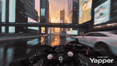

---
### Cinematic Martial Arts Duel: Boar vs. Rooster in Minecraft Style

**Prompt:**
```
Subject \u0026 Action: A cinematic martial arts duel between a sturdy anthropomorphic wild boar wearing a green tunic and a large brown leather backpack, and a stoic anthropomorphic rooster dressed in a white martial arts gi with a blue belt. The scene begins with a respectful bow before transitioning into a fast-paced fight including high kicks, punches, and mid
```

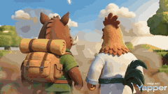

---
### King Kong Attack Video Prompt for Seedance 2.0

**Prompt:**
```
[Subject]: The giant gorilla in @Image 1, with black silverback fur clearly defined strand by strand, extremely realistic muscle contours, eyes full of anger, showing cinematic facial details 1. [Action]: The giant animal @Image slowly stands up from the deep sea, water slowly sliding down its strong muscles. It lets out an angry roar, forcefully pounding th
```

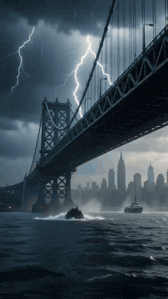

---
### Godzilla-Sized White Tabby Cat in Chongqing

**Prompt:**
```
【Style】Mockumentary, mobile Vlog perspective, hyperrealistic CG combined with real scenes, 8K quality, perfect fur physics simulation. 【Duration】15 seconds 【Scene】Hongya Cave in Chongqing or a busy overpass intersection (with magical 8D city feel). [00:00-00:05] Shot 1: Visual spectacle (The Reveal). The scene shows a bustling city street. The camera lifts u
```


---
### Seedance 2.0 Video Prompt: News Report and Action Scene

**Prompt:**
```
｛Professional news texture: “Ji Meng News” station logo in the upper left corner of the screen (referencing the feel of CCTV News Channel), time code in the upper right corner. An anchor in a suit and tie is speaking in the live broadcast room (referencing the feel of CCTV News live broadcast room, widen the field of view, do not shoot close-up) in a broadca
```


---
### Woman applying makeup invaded by mud-like liquid

**Prompt:**
```
A woman is applying makeup to her face as the camera shows an open door behind her. Suddenly, a mud-like liquid begins to invade her room. She becomes frightened and climbs onto a chair to escape the mud. The room fills rapidly until she is floating near the ceiling in the liquid, hitting it. With each impact, the ceiling begins to open, revealing sunlight.
```


---
### Ultra-realistic First-Person Zombie Survival Video Prompt for Seedance 2.0

**Prompt:**
```
Ultra-realistic first-person POV zombie survival action scene, cinematic quality, 4K, 24fps, shallow depth of field Camera: true first-person perspective from eye level no HUD, no UI, no crosshair visible hands and weapon in foreground holding a modern tactical rifle not aiming down sights, no scope overlay natural handheld camera motion with subtle head bob
```

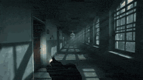

---
### Seedance 2.0 prompt for high-viral comedic payoff video

**Prompt:**
```
FORMAT: 15s / MULTI-CUT / 6 BEATS / HIGH-VIRAL COMEDIC PAYOFF SUBJECTS: A small round-faced figure with huge eyes, copper-red pigtails, a yellow polka-dot dress, and exaggerated cartoon proportions. A tall ice cream vendor with a curled mustache, crimson
```


---
### Cyberpunk F1 Cinematic Sequence

**Prompt:**
```
Wide angle shot of a futuristic Formula 1 car accelerating into a neon-lit cyberpunk tunnel at night, glowing red and magenta light trails, wet reflective asphalt, volumetric fog, cinematic lighting, ultra-detailed, 8k. [0s–2s] Wide establishing shot, towering neon tunnel with holographic ads flickering, car enters frame at high speed, reflections shimmering
```


---
### Frozen Canyon Dragon Flight

**Prompt:**
```
An adventurer launches her pale ice creature from a frozen cliff's edge — the creature diving over a vast icy expanse as snowflakes scatter. Camera positioned along the cliff captures the creature dropping before extending its wings. The rider leans forward as the creature spirals down between towering ice formations. Below: armored behemoths march across th
```


---
### Seedance 2.0 Video Prompt: Vehicle-to-Mech Transformation

**Prompt:**
```
Seedance 2.0 motion prompt: One-take transformation action. A matte red endurance race car races along a stormy coastal highway at twilight, tires spraying water. The camera pushes close to the front quarter panel and tracks alongside as the car swerves around wreckage. Without slowing, the hood splits, wheels rotate, suspension arms extend, and body panels 
```


---
### Seedance 2.0 Video Prompt: First-Person Knight vs. Giant

**Prompt:**
```
Scene: First-person perspective battlefield - Dusk / Overcast. Single shot (first-person perspective). Atmosphere: Chaotic, claustrophobic, and tense. The smell of mud, soot, and damp iron metal fills the air, restricted by the narrow opening of the knight's heavy helmet. The massive body and unstoppable force of the giant monster contrast sharply with the h
```

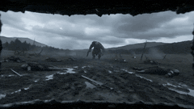

---
### Chai Glass to Futuristic Racing Pod Transformation

**Prompt:**
```
Handheld close‑up of a tiny toy cutting‑chai glass on the palm of a street vendor in an old Delhi lane at evening. He flicks the toy chai glass toward the ground; as it drops, the cup stretches into a futuristic racing pod shaped like a chai glass, steam turning into neon trails, the camera tracking it as it races through a narrow lane between stalls. After 
```


---
### Seedance 2.0 Prompt for a Girl's Bedroom Selfie Vlog

**Prompt:**
```
Bedroom scene, full of girlish charm. The main subject of the picture is a super high-value beautiful girl@【@Image 1】, wearing a reasonable winter off-shoulder outfit, a girl with a retro high ponytail and side bangs. She is petite and young, exuding a pure yet seductive idol temperament, with fair, cool-toned skin, pouting and acting cute, posing, making cu
```


---
### Seedance 2.0 Video Prompt: Obsidian Dragon Ambushing Hamster

**Prompt:**
```
Obsidian dragon hiding in sleeve → ambushing hamster A girl's arm in loose sweater sleeve extends into frame, sleeve opening slightly, a small obsidian-black shiny mini dragon (ruby-red eyes, sharp tiny horns) emerges from the
```


---
### Seedance 2.0 Video Prompt: Classic Movie Scene Recreation (Two Segments)

**Prompt:**
```
Segment 1: Referencing the character movements and camera techniques of @Video 1, generate a video of the black-clad figure in @Image 1 throwing a flying knife in a bamboo forest. There is only the black-clad woman in the video. The starting frame's perspective and shot composition strictly reference @Video 1. After the flying knife is thrown, slow motion fo
```

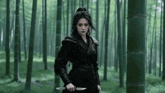

---
### Seedance 2.0 Video Prompt: Crystal Tiny Dragon

**Prompt:**
```
Close-up of an adult man's rough but warm palm facing upward, a fist-sized semi-transparent blue crystal tiny dragon squatting in the center (internal flowing light particles, semi-glowing wings), indoor warm table-lamp lighting, 0-4s: dragon slowly
```


---
### Seedance 2.0 Prompt for a Luxury Towel Commercial

**Prompt:**
```
[Subject]: Asian beauty (delicate features, natural proportions, stable and undistorted face)@【@Image 1】, black wavy long hair, a pure white towel with a luxurious texture (fluffy fibers). [Timeline Script]: 1-5 seconds (Impact Chapter): Extreme micro-perspective, crystal clear water droplets smash onto the towel like a waterfall, the moment the towel touche
```


---
### Seedance 2.0 Video Prompt: Golden Tiny Dragon

**Prompt:**
```
Golden tiny dragon coiled on wrist → teasing small dog A young woman's fair-skinned hand palm open on a sunlit living room wooden floor, a
```


---
### Cinematic Transformation Sequence of a Superwoman

**Prompt:**
```
A cinematic transformation sequence of a fierce young Indian woman with long straight black hair in a high ponytail, intense dark eyes, warm brown skin and determined expression. She stands on a dark stormy futuristic city rooftop at night with lightning flashing and rain pouring. She wears a sleek black leather jacket over a tactical bodysuit with a glowing
```

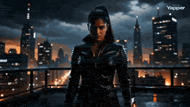

---
### Seedance 2.0 Video Prompt: Neon-lit Street Encounter

**Prompt:**
```
Realistic style, first-person perspective. You are walking down a dimly lit street. It has rained, and neon lights reflect on the ground. The street is deserted. Suddenly, under a streetlamp ahead, a girl is standing, wearing a short skirt and looking at her phone. You walk over and say hello. She smiles at you, turns around, and leads you into the small hou
```


---
### Seedance 2.0 Wuxia Action Short Video Prompt

**Prompt:**
```
Hong Kong Wuxia + Hollywood action mix, strong cinematic feel, 15 seconds duration, female assassin and male assassin. Heavy rain on ancient rooftop tiles, distant lightning city skyline, female assassin, wet hair clinging to face, holding dual daggers. [00:00-00:03] Low-angle upward shot, female assassin leaps down from the eaves, slow motion captures raind
```

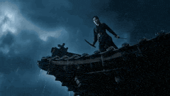

---
### Cinematic Japanese Slice-of-Life Scene with Lip-Synced Dialogue

**Prompt:**
```
A cinematic Japanese slice-of-life scene. Two young Japanese women (age 20 and 22) are sitting together and chatting happily. They are close friends having a relaxed conversation. Their lips move naturally with synchronized dialogue (accurate lip sync). Scene: a quiet residential street in Japan in the late afternoon. Warm golden sunlight, gentle breeze, pea
```

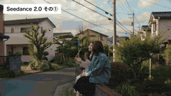

---
### Low-Altitude Aircraft Flight Video Prompt for Seedance 2.0

**Prompt:**
```
First-person view piloting a small aircraft at low altitude, skimming over mountains, forests, or coastlines — strong wind noise and immersive visual feel, fast forward-moving camera, dynamic camera movement, dramatic backlit golden lighting, cinematic color grading, tense and thrilling atmosphere, ultra-smooth and fluid motion, 4K resolution, highly detaile
```


---
### Seedance 2.0 Prompt for Cosmic Planetary Instability

**Prompt:**
```
A colossal celestial entity formed from rotating rings of mechanical galaxies appears above Earth’s atmosphere, its body made of spinning orbital mechanisms and luminous time-structures — hook at second two: one massive hand rotates a cosmic mechanism embedded in its chest. The planet’s rotation stutters. Day and night begin switching rapidly. The transforma
```


---
### Seedance 2.0 Romantic Winter Scene Prompt

**Prompt:**
```
Presented from a low-angle perspective, a woman with loose, curly hair, possessing a cool and gentle temperament, wearing a black coat with an inner layer and a white patterned scarf around her neck, stands on a dark yellow street where snow is falling heavily, creating a strong atmosphere. She gazes affectionately at the person below the frame who is holdin
```


---
### Reference-based Video Generation Prompt

**Prompt:**
```
\"Use the subject from @​Image1 as the main focus. Execute rhythmic dolly, push, pan and tilt movements with the camera referencing the shooting style of @​Video1. The subject’s movement should reinterpret the choreography from @​Video1, creating a cohesive
```


---
### Ultra-Realistic Pancake Artistry Video Prompt for Seedance 2.0

**Prompt:**
```
Ultra-realistic video of a pancake shaped like a strawberry on a clean white plate, perfectly golden-brown with soft porous texture and tiny bubbles, slightly crisp edges. The camera slowly pans from top-down to a 45-degree angle, revealing a small bite taken from one edge showing fluffy interior and crumbly texture. Soft diffused lighting highlights every d
```


---
### Heartwarming Woodland Comedy Video Prompt

**Prompt:**
```
FORMAT: 15s / 6 SHOTS / heartwarming woodland comedy / short dialogue STYLE: hyperreal cinematic woodland animation, warm golden hour light filtering through bark cracks, cozy mossy interior of a hollow
```


---
### Anubis Tickle Scene

**Prompt:**
```
Traditional Chinese style, modern 3D animation. 0-4 seconds: The powerful jackal god Anubis sits on a throne, a mechanical robot holds his arm high, a posture that completely exposes his armpit. A villain stands before Anubis, pressing him for the secret of his power. Anubis is bored and indifferent, saying he will reveal nothing. 5-8 seconds: The villain gr
```


---
### Ancient Style Singing Performance Video Prompt

**Prompt:**
```
@Image, wearing a gilded, kingfisher-feather-adorned Tang suit with a koi pattern, hair adorned with tassel step-shakers, cinnabar flower mark on the brow, smiling sweetly and radiating spiritual energy; standing in front of a vermilion corridor with carved beams and painted rafters, the background features a hundred flowing glass palace lanterns, a half-con
```


---
### Cinematic Mecha Warrior in Wuxia Style Video Prompt

**Prompt:**
```
Mecha Warrior performing solo in a Waterfall Wonderland · 1980s Wuxia film still VHS tape · Film grain · Mossy waterfall scene. Character Lock: Figure 1 Mecha Warrior, Image 2 — short hair, mechanical arms of dark gray alloy, pink glossy battle pants, white sneakers, katana, clear bare-chested abs. Overlaid with a cyan-green wide-sleeved robe, jade belt, hai
```

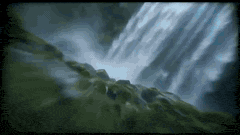

---
### Cinematic Night Racing Movie Scene for Seedance 2.0

**Prompt:**
```
Cinematic Night, Rain, High Stakes Sport [00:00-00:05] Close-up of the veteran driver's cockpit — rain hits the windshield, dashboard lights reflect on the visor. [00:05-00:10] Close-up of the challenger — hands gripping the steering wheel, heavy breathing. [00:10-00:15] Wide action shot — the traffic light turns green, both cars accelerate simultaneously, w
```

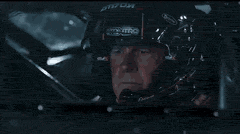

---
### Zero Gravity Warrior Fight Video Prompt

**Prompt:**
```
Two elite warriors fighting in zero gravity inside a shattered space station orbiting Earth. Broken metal panels and floating debris drift slowly around them while the blue planet glows through the destroyed walls. The fighters push off floating debris and launch toward each
```


---
### Saitama vs. Garou Battle Scene

**Prompt:**
```
This depicts the battle between Saitama and Garou. With just a single punch from Saitama, a massive gust of wind erupted, shattering the ground beneath them. Garou, using his incredible speed and agility, parried the blow and launched a counterattack. As the two exchanged a flurry of punches and kicks, the sky and the earth shook with the deafening roar of t
```


---
### Sneaky Cat Pet Vlog Action Sequence

**Prompt:**
```
Cinematic vertical video (9:16), photorealistic pet vlog style, warm indoor daytime setting, dining area or kitchen counter. CONTINUITY: After the betrayal of EP3, Grayson walked away with dignity. Now he has a new plan. He spots food on the table. Action sequence: ① Grayson's eyes and forehead slowly rise above table edge from below — just his eyes visible,
```


---
### Ancient Drama Short Video Prompt: The Runaway Bride

**Prompt:**
```
00:00–00:02 (2s) [Opening Hook - The famous runaway bride scene] - Shot Type: High-angle aerial shot transitioning to a close-up push-in - Scene: The vermilion high wall of the General's Mansion, with a blooming red plum tree planted at the corner of the wall - Attire: - Female Lead [@Image 1]: A pink cross-collar Qixiong Ruqun, covered with a layer of thin 
```

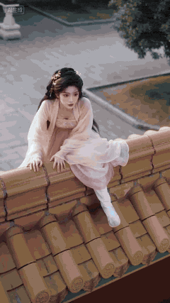

---
### Female General Battlefield Video Prompt

**Prompt:**
```
Seedance 2.0 Prompt method: One reference image + 2 sections of prompts to recreate the scene of a female general fighting on the battlefield. Section 1: Scene 1: The female general gallops on horseback, leading thousands of soldiers forward. Use pull-out, elevation, and orbiting camera movements to showcase the magnificent scene of the armies. Scene 2: Mid-
```


---
### Chinese Hanfu Character Video Prompt for Seedance 2.0

**Prompt:**
```
Reference to image 1. Cinematic 8-second video, a beautiful woman in a lavish red traditional Chinese Hanfu and intricate golden phoenix crown. She starts with her back to the camera in a palace garden with falling peach blossoms. She slowly turns around in slow motion, her long silk sleeves fluttering in the breeze. She looks into the lens and gives a radia
```


---
### Seedance 2.0 Supercar Showcase Video Prompt

**Prompt:**
```
Focusing on \"Supercar Personality and Performance,\" string together 5 distinctive supercars within 10 seconds (red and black carbon fiber supercar, blue-green glossy supercar, yellow classic Lamborghini, yellow and black racing style supercar, silver future concept car), covering 5 major scenes: indoor garage, bright showroom, outdoor display area, racetrack
```


---
### iPhone Promotional Video Prompt (Seedance 2.0)

**Prompt:**
```
An iPhone, featuring the Dynamic Island, initially displayed from the front, showing the time 9:41. Three shots are three discontinuous frames where the camera gradually zooms in on the phone body, with the center point of each zoom being the pill-shaped black Dynamic Island at the top of the screen. At the end of the third shot, the perspective enters this 
```

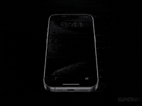

---
### Dark Knight Transformation: FPV Cinematic Style

**Prompt:**
```
【Core Theme】 Realistic sci-fi tokusatsu, battlefield awakening, shattering of the dark smoke orb, black iron mecha Dark Knight, cinematic dark divinity. 【Character Basic Settings】 100% realistic Korean male face, with knife wounds and bruises on the face, blood seeping from the corner of the mouth, eyes carrying a burning will after extreme exhaustion and de
```

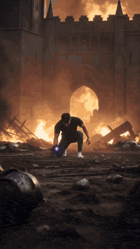

---
### Colossal Ocean Leviathan Attack on a Megacity Harbor

**Prompt:**
```
A colossal ocean leviathan, 300 meters long with armored whale-like plating and luminous bioluminescent currents flowing through translucent fins, rises from the deep ocean just offshore of a megacity harbor — hook at second two: the creature breaches vertically through the water, displacing millions of tons of ocean in a single eruption. The harbor instantl
```


---
### Cinematic Long Take Action Sequence

**Prompt:**
```
\"Generate a cinematic, large-scale action long take animation. Theme: A Chinese youth flies a kite through crowded streets, leaps up steps, flips and lands, dashes toward a high platform, and executes a difficult jump. The drumbeat erupts the moment he lands. One single continuous shot throughout, no cuts, fluid movements, clear weight, inertia, and landing 
```

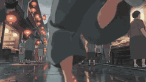

---
### Mecha-Armor Transformation Action Sequence Prompt Summary

**Prompt:**
```
A barefoot woman. Urban chaos. Then a full mecha-armor transformation mid-sequence
```


---
### Luxury Skincare Commercial with 360-Degree Orbit

**Prompt:**
```
A high-end luxury skincare commercial with an ultra-premium visual style. The product must precisely match the provided reference image in terms of bottle shape, label details, liquid color, reflections, and overall design. The bottle is positioned upright at the exact center of the frame, placed on a glossy liquid surface with smooth, elegant ripples. Delic
```


---
### Steampunk Sky Battle Video Prompt

**Prompt:**
```
A cinematic steampunk sky battle. A young sky mechanic girl in leather flight gear stands on the wing of a damaged airship above storm clouds. She wields electrified chain-tools and a glowing wrench staff. Her enemy is a giant thunder roc made of
```


---
### Seedance 2.0 Cinematic Suspense Prompt with Detailed Timeline

**Prompt:**
```
Format: 15 seconds / One-take / Cinematic realism / No cuts, oppressive and heavy suspense, post-battle residual environmental sound design. Scene Description: A battlefield where the fires of war have just been extinguished, visibility is low, and the air is filled with choking smoke and the lingering smell of charring. The ground is soaked with blood and w
```


---
### Gothic Vampire Lord Video Prompt

**Prompt:**
```
Cinematic shots with strong visual impact, centered composition + low-angle upward shot; male protagonist A pale gothic vampire lord, devastatingly handsome, with shoulder-length silver hair slicked back save for a few windswept strands, his features sharply
```


---
### Wuxia Combat Short Video Prompt (Seedance 2.0)

**Prompt:**
```
Hong Kong Wuxia + Hollywood action hybrid, strong cinematic feel, duration 15 seconds, Protagonist 1 Image 1 Protagonist 2 Image 2 Heavy rain on ancient rooftop tiles, distant lightning city skyline, Protagonist 1, wet hair clinging to face, holding twin daggers [00:00-00:03] Low-angle upward shot, Protagonist 1 leaps down from the eaves, slow motion capture
```

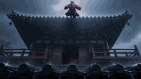

---
### Wuxia Action Short Video Prompt (Seedance 2.0)

**Prompt:**
```
Wuxia action film style, intense battle in a rainy night bamboo forest, black-clad female swordswoman (long hair flying, red belt) fighting a white-clad assassin (mask, dual swords), rapid sword combo moves, sword light trails, water splashing everywhere, wet cloth clinging to the body, cinematic camera work: fast follow shot + crane up/down + 360-degree rot
```

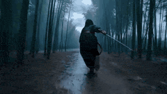

---
### Seedance 2.0 prompt for a Wuxia fantasy battle scene

**Prompt:**
```
Fairy's appearance features reference @[Image 1] 1. Shot 1 (0-3 seconds): Medium shot + low angle, the fairy floats in the air, robes fluttering, hands quickly beginning to form seals, chanting: “Heaven and Earth are boundless—” The background is a gloomy sky, and a formation of black-clad enemies in the distance is ready. The camera slowly moves up from the
```

---
### Grok vs. Seedance 2.0 Comparison: Skateboarder on Coastal Road

**Prompt:**
```
First-person perspective, a teenager skateboarding on a coastal road, sea breeze blowing, waves hitting the beach. The camera constantly changes: low-angle following the skateboard wheels, side-follow of the whole body, top-down view of the coastal road, close-up of the facial smile, long shot of the skateboarder's back by the sea. Smooth movement, fast pace
```

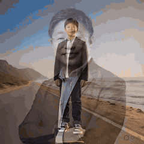

---
### The Desert Train Heist

**Prompt:**
```
A biker wearing desert goggles and a sand-colored jacket races a dirt bike alongside a speeding freight train in a vast Sahara landscape. At the 2-second mark he hits a dune ramp and launches toward the train roof. The bike lands across the top of a container car while sandstorms swirl around the convoy. Camera tracks low along the train as the rider speeds 
```


---
### JSON Prompt for Modern Anime Sakuga Fight Sequence

**Prompt:**
```
{ \"title\": \"Modern Anime Sakuga Fight Sequence\", \"format\": \"text-to-video prompt\", \"language\": \"en\", \"genre\": \"anime action fight\", \"style\": { \"animation_style\": \"high-quality modern anime sakuga\", \"aesthetic\": \"modern anime\", \"finish\": \"fully finished professional production quality\", \"painting\": \"professional anime painting\", \"lighting\": \"cinematic anime l
```


---
### Cinematic War Rhythm Video Prompt

**Prompt:**
```
FORMAT: 15s / cinematic war rhythm / continuous shot / storm siege escalation, anamorphic flare, 65mm film texture SCENE: A colossal Aztec citadel-temple was carved into a jagged mountain cliff above a black, storm-torn sea. Feathered war standards whipped through
```


---
### Warrior Girl Galloping on Misty Battlefield

**Prompt:**
```
A fierce warrior girl with long flowing hair and ornate armor gallops on a powerful white horse across a misty battlefield at golden hour. Cut between dynamic shots: horse hoof striking wet ground in slow-motion with mud exploding, low-angle silhouette
```


---
### Wuxia Swordplay on a Mountain Peak (Seedance 2.0)

**Prompt:**
```
Preset Scene: The swordsman stands on the peak of a mountain above the clouds, with the sunset clouds below surging like a vast ocean. The wind blows the hair and white clothes. [0-2s] Action: The swordsman stands still on a bluestone slab at the edge of the cliff, holding the sword hilt in a reverse grip with the blade pointing diagonally down towards the s
```

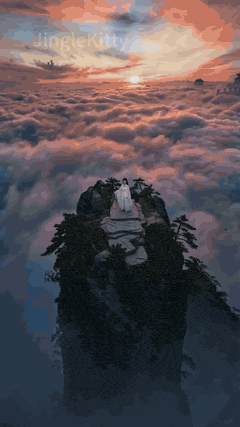

---
### Cyber Ninja vs. Holographic Alien Fight Prompt

**Prompt:**
```
16:9 ratio, epic multi-shot cinematic blockbuster 12-second fight video. A sleek black-neon cyber ninja with dual glowing katanas fights a giant translucent holographic alien overlord with energy whips and teleport dashes in a raining cyberpunk Tokyo street. Dynamic shots: fast vertical tracking as she wall-runs up buildings, circling 360° camera around whip
```


---
### Epic Wuxia/Modern Fantasy Video Prompt for Seedance 2.0

**Prompt:**
```
Character setting: @Male protagonist, modern attire (black trench coat or dark long coat, naturally messy hairstyle), cold and domineering temperament, eyes like blades, maintaining character consistency throughout. 0–3s: Extreme facial close-up, @Male protagonist stands on the peak of a snowy mountain, fierce cold wind blows his hair and the corners of his 
```


---
### Anime Energy Clash Fight Sequence

**Prompt:**
```
[Subject]: Two super-powered individuals with hardcore anime lines, a warrior in dark blue armor, and an opponent in a crimson red robe. Clear facial features, character faces remain stable and undistorted. [Action]: The two characters cross diagonally in the air, instantly generating intense energy clash light effects, with extreme particle sparks blooming 
```


---
### Solar Valkyrie Superhero Transformation Prompt

**Prompt:**
```
(Skyscraper Rooftop Theme) Setting: The rooftop of a glass skyscraper during a sunset. The Incident: The floor begins to crack as a winged demonic creature crashes onto the roof, sending glass shards everywhere. Office workers flee toward the helipad. The Action: A woman in a business suit turns back. She reaches toward the sun. The Transformation: Beams of 
```


---
### Ultra-Cinematic Transformation of a Pickup Truck into a Stone Mech Rhino

**Prompt:**
```
Create a 16:9 ultra-cinematic ultra-realistic video of an old pickup truck rumbling down a dusty desert highway at sunset. A young male driver inside suddenly pretends to see danger and slams the brakes in panic. The truck’s front grille suddenly starts glowing bright cyan. The camera orbits 360° smoothly around the entire truck while it violently transforms
```

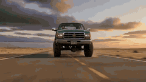

---
### Cinematic Alien Marketplace

**Prompt:**
```
A busy futuristic marketplace on another planet, alien merchants selling glowing fruits, robots walking around, floating holographic advertisements, colorful lights everywhere, cinematic handheld camera style.
```


---
### Stop-Motion Clay Animation Story Prompt

**Prompt:**
```
Stop-motion clay animation with handcrafted tactile materials and real fabric, set under warm afternoon park lighting. Wide shot: a clay figure with a matchbox head and a clay figure with a lit candle head sit together on a real tiny park bench, mid-conversation. The candle flame flickers gently, the matchbox drawer is slightly open, and they appear close an
```


---
### Impossible Golf Shot Tracking in a Rainstorm

**Prompt:**
```
A dramatic sports sequence begins on a lush, windswept coastal cliff during a violent rainstorm. A golfer in bright yellow rain gear stands on the tee box, gripping a driver. His stance is planted firmly, eyes locked on a distant green across a churning ocean cove. As he swings, the clubhead connects with a resounding crack, launching the dimpled white ball 
```


---
### Warrior's Devastating Strike

**Prompt:**
```
Subject/Character: A warrior wearing a sleek black combat outfit with subtle crimson accents, gripping an elegant black katana that emits a faint red energy glow. Environment/Setting: A wide stone courtyard at dusk with drifting fog, scattered debris, and loose objects such as leaves, dust, and small fragments across the ground. The atmosphere feels tense an
```


---
### Peach Blossom Sword Dance Performance

**Prompt:**
```
Total duration 15 seconds, reference character image 1, dressed in a cyan-green wide-sleeved robe, jade belt around the waist, hair pinned up with a crown, sleeves fluttering gently, cold and handsome face, sharp and calm demeanor. [Scene Tone] Ancient style fantasy immortal realm, mountain peak, clouds surging like a waterfall, scattered falling blossoms al
```

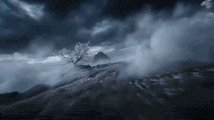

---
### Seedance 2.0 K-pop Retro MV Prompt

**Prompt:**
```
16:9 horizontal screen, K-pop retro MV style, warm yellow film tone, nostalgic romantic atmosphere. 0-3 seconds: long shot opening, retro Korean cafe, afternoon sun streaming through the blinds, golden dust floating in the air, the camera slowly pushes in on a young Korean idol female singer sitting by the window—round baby face, drooping willow eyebrows, dr
```

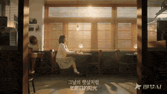

---
### Still Rings Perfection - 6-Part Shot List

**Prompt:**
```
Still Rings Perfection FORMAT: 15s / 6 SHOTS / men’s apparatus final / no dialogue STYLE: intense arena realism, dramatic overhead lighting, chalk dust, muscle definition,
```


---
### Futuristic Lamborghini Assembly Commercial Prompt

**Prompt:**
```
An epic futuristic car assembly sequence inside a dark, glossy digital showroom. A white high performance Lamborghini begins forming in the center of a reflective black stage. The environment is minimal, clean, and dramatic, with powerful spotlights cutting through the darkness and reflecting across the polished floor. The sequence starts with macro close up
```


---
### Ancient Castle Siege by Dragon

**Prompt:**
```
Ancient stone castle on a mountain cliff under dark storm clouds as a gigantic dragon circles above. The dragon dives toward the castle breathing massive streams of fire while soldiers fire arrows and catapults launch flaming projectiles. Low angle shot from the castle
```


---
### Pure Hand-Drawn 2D Cartoon Witch Flight Prompt for Seedance 2.0

**Prompt:**
```
A young witch flies on a broom over an ancient European town at golden hour. The camera stays tight behind her back as the town opens ahead. Her dark purple cloak whips directly into camera, animated with hand-drawn cloth physics. Her long messy brown hair lashes wildly in all directions with expressive independent strands. She flies between narrow stone bui
```

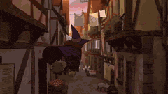

---
### Epic Cinematic Fight Scene: Shadow Sorcerer vs. Fiery-Ice Phoenix

**Prompt:**
```
16:9 ratio, epic multi-shot cinematic blockbuster 12-second fight video. A dark-robed shadow sorcerer with levitating black orbs battles a colossal fiery-ice phoenix with razor wings and freezing flames in a frozen ancient temple under aurora skies. Dynamic shots: dramatic overhead drone sweep diving into the fight, intense slow-mo tracking as wings slash pa
```

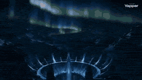

---
### Supercar Spec Ad: Speed is Easy, Control is Everything

**Prompt:**
```
Ultra-realistic motorsport documentary footage. A matte-black hypercar sits in the pit lane of a professional racetrack as mechanics make final adjustments. The camera captures tight close-ups of spinning brake rotors, carbon-ceramic discs, and gloved hands tightening bolts. The car rolls slowly toward the track before launching into a high-speed lap. Camera
```


---
### Realistic Sci-Fi Mecha Combat with Female Warrior

**Prompt:**
```
[Core Theme] Realistic sci-fi mecha combat, ultra-high-speed impact, bone repositioning, mechanical mecha transformation, ultimate kick, IMAX cinematic sci-fi combat [Basic Character Settings] Protagonist: Female warrior Appearance Status: Face covered with dust and scratches, slight blood at the corner of the mouth. Tough but tired expression. Short hair me
```


---
### Ultra-Realistic LEGO Santa Claus Photograph

**Prompt:**
```
Ultra-realistic photograph of a LEGO Santa Claus minifigure driving a rugged red LEGO Unimog snow truck across a snowy mountain pass in the Swiss Alps, deep snowbanks on both sides, pine trees dusted with frost, Santa wearing ski goggles and a fluffy red winter coat, gift boxes bouncing on the truck bed, dramatic mountain light, crisp atmosphere, DSLR realis
```


---
### High-Tech Melee Combat Video Prompt

**Prompt:**
```
15-second short film of pure immersive, high-speed, brutal fight without dialogue. The entire process is an uncontrolled, chaotic, high-tech close-quarters combat, featuring 2 characters @【@Image 1】@【@Image 2】, in a live-action style, close-quarters high-speed killing, no fancy moves, pure hardcore brutal fighting, high-tech fist and foot exchange, blocking,
```


---
### Cinematic Slice-of-Life Comedy: Dropping a Coffee Mug

**Prompt:**
```
【Film Style】 Cinematic slice-of-life comedy, natural morning apartment lighting, warm daylight from a large window, realistic acting with light humor. 【Duration】 12 seconds 【Character Description】 A young blonde woman standing in a modern apartment kitchen. She has long light-blonde hair and a relaxed friendly expression. She is wearing a light blue fitted t
```


---
### Cinematic Spring Scene: Japanese Student in Cherry Blossoms

**Prompt:**
```
Japanese cinematic realism, poetic spring atmosphere. A beautiful 20-year-old Japanese female university student walking slowly through a quiet path lined with cherry blossom trees. Cherry blossom petals fall gently like pink snow in the soft spring breeze. She wears a soft pastel blouse and long skirt, natural Japanese college student style. Warm early morn
```


---
### Goku vs. Naruto 2D Battle

**Prompt:**
```
A battle between Goku and Naruto in a 2D animation style. Goku attacks with immense power, delivering a flurry of punches and kicks. The ground cracks and dust flies everywhere. Naruto dodges the strikes with quick turns and blocks, moving with great agility. Each impact creates shockwaves and loud sounds. The movement and body dynamics are clearly depicted,
```


---
### Seedance 2.0 prompt for ultra-fast sakuga cuts with chibi style

**Prompt:**
```
ultra-fast sakuga style cuts at 24fps with premium VFX and light motion blur, maintaining characters in chibi/doodle style. The setting is an alien desert with neon.
```


---
### Ultra-Realistic Fox Hunt Documentary

**Prompt:**
```
Ultra-realistic wildlife documentary footage. A red fox moves cautiously along the edge of a snowy forest at dawn. Its breath forms small clouds in the freezing air. Beneath the snow, faint movements reveal a hidden vole tunneling just below the surface. The fox tilts its head, listening carefully. Suddenly it leaps high into the air and dives headfirst into
```


---
### Cinematic Video Script for 'The God of Small Things'

**Prompt:**
```
{ \"title\": \"The God of Small Things - Cinematic Video\", \"scenes\": [ { \"scene_number\": 1, \"title\": \"Opening / Childhood Memory\", \"visuals\": \"Two twins, Estha and Rahel, running barefoot through the lush monsoon-soaked courtyard of their ancestral house.\", \"cut_scenes\": [ \"Close-up of their small hands holding a broken toy\", \"Water dripping from leaves above\" 
```


---
### Lego Explorer Chased by Polar Bear

**Prompt:**
```
lego explorer minifigure driving a mini snowmobile across icy terrain chased by a massive roaring polar bear, snow spraying dramatically behind, frozen mist in the air, intense cinematic backlight, dynamic tilted camera shot, blockbuster action style, exaggerated comic motion, crisp lego plastic texture, dramatic cold color grading
```


---
### Seedance 2.0 prompt for a humorous anime scene

**Prompt:**
```
Make an anime scene where A strongly muscled dragon stands towering in front of a human knight, looking at him threatingly. The knight pulls out a feather duster and tickles the dragon's belly. The dragon is ticklish and immediately starts giggling loudly in his deep voice. The scene ends with the knight tickling the dragon's belly with the feather duster an
```


---
### Seedance 2.0: 'Fatal 'Miracle Drug': Pickled Chicken Feet' Video

**Prompt:**
```
Video Title: Fatal \"Miracle Drug\" Video Duration: 15 seconds Tempo: Fast-paced, twist, impactful Timeline: 0:00 - 0:04 [Visual]: [Close-up] A pair of feet frantically rushing out of a supermarket entrance, the camera quickly pulls up to the man's ecstatic, distorted face. He holds up several bags of strangely colored, vaguely packaged pickled chicken feet. [
```


---
### BMX Rider in a Favela

**Prompt:**
```
A woman in her late 20s of Brazilian heritage, her dark curly hair contained under a structured white bucket hat, wearing a matching oversized black utility jacket, wide black trousers, and chunky white boots, rides a bright chrome BMX through a dense favela-style hillside neighborhood of narrow stone alleys and painted walls. At the 2-second mark, she rides
```


---
### Anubis Tickle Torture Animation

**Prompt:**
```
Traditional modern 3D animation style: 0.0s-4s: Mighty Anubis sits in his throne and a group of villains stand in front of him with a mecha robot. The mecha robot is currently holding Anubis arms above his head. The group of villains demand Anubis to reveal the secrets of his powers and Anubis nonchalantly and bored says that he won’t tell these mortals anyt
```


---
### Toku-Style Sci-Fi Action Transformation Sequence

**Prompt:**
```
Seedance 2.0 Video Generation Prompt This video is a smooth, high-fidelity, Toku-style (special effects style) sci-fi action scene, centered on seamlessly transforming the subject in the @image into full-body power armor, accompanied by smooth energy effects and scene interaction. [Scene Description - Gritty Urban Battlefield] Environment: An abandoned concr
```


---
### High-End Commercial Ad: AURORA FIZZ

**Prompt:**
```
High-End Commercial Ad — AURORA FIZZ 00: 00 – 00 :02 | The Flash Arrival Action: The AURORA FIZZ can blasts into frame from above, spinning rapidly on its vertical axis. Visuals: Sharp motion blur. Golden citrus patterns streak into radiant lines of light. The can halts with surgical precision at center frame — label perfectly facing camera. 00: 02 – 00: 04 
```


---
### Mecha Armor Transformation Video Prompt for Seedance 2.0

**Prompt:**
```
【Core Theme】 Realistic sci-fi mecha transformation, assembly during freefall, mechanical armor flying and converging, awakening of future armor, cinematic mechanical divinity 【Basic Character Settings】 Female protagonist, in combat state. Slight abrasions and dust on the face, a little blood at the corner of the mouth. Expression is tired but determined. Dur
```


---
### Seedance 2.0 Comprehensive Wedding Photography Prompt

**Prompt:**
```
[Scene 1 | Opening Tone Setting · 3 seconds] Cinematic wedding photography, backlit grassland during golden hour. @Female Lead wears a trailing white wedding dress, the veil gently fluttering in the wind, standing with her back to the camera gazing into the distance. @Male Lead slowly walks in from the right side of the frame and gently embraces her waist. C
```


---
### Futuristic Lamborghini Assembly Commercial

**Prompt:**
```
{\"shot\": { \"composition\": \"close-ups, wide reveals, ending with full 360° orbit\", \"lens\": \"50mm\", \"frame_rate\": \"24fps\", \"camera_movement\": \"rotating reveal around the vehicle\" }, \"subject\": { \"description\": \"White high performance Lamborghini assembling from holographic internals to a sleek final form\", \"props\": \"engine, transmission, electronics, body pane
```


---
### Fantasy Ancient Style Transformation Video Prompt (Four Spirits)

**Prompt:**
```
@Image, Fantasy ancient style transformation theme, sequentially transforming into the Four Spirits: Azure Dragon, Vermilion Bird, White Tiger, and Black Tortoise, with the energy of the Four Spirits finally converging in the palm; the overall picture is filled with an ancient style atmosphere, high-definition quality, delicate and layered light and shadow, 
```


---
### Four Seasons Flower Goddess Ancient Style Transformation Video Prompt

**Prompt:**
```
@Image, Four Seasons Flower Goddess ancient style transformation video, strong rhythm, extreme contrast, ultimate visual impact, no dialogue throughout, creating a dreamy, high-key ancient style emotional atmosphere; delicate and rich picture quality, full of high-end feel, using backlighting, hair light, Rembrandt light, and reverse side light to create hig
```


---
### Wes Anderson Style Global Travel Video Prompt for Seedance 2.0

**Prompt:**
```
Two people appearing (Image 1, Image 2, each wearing different clothes), Wes Anderson film style, high-definition quality + master-level camera work, the overall screen is yellow-green with high saturation, background music is a humorous and rhythmic viola piece, the characters do not speak throughout the process and sequentially check in at 6 major famous C
```


---
### Construction Time-Lapse and Deconstruction Prompt Comparison (Seedance 2.0 vs. Grok)

**Prompt:**
```
Fixed-position wide-angle time-lapse photography, fully documenting the entire process of a building from empty foundation to completion. The camera remains fixed, only using time compression (10-30x fast-forward) to present the construction rhythm, showing natural light cycling through the scene (morning → noon → dusk → night). Phase 0: Empty Starting Point
```


---
### Seedance 2.0 Prompt: Beijing Apartment Cross-Section

**Prompt:**
```
A horizontal cross-section display shot of a high-rise residential building in Beijing's Taiyang Palace, with cinematic realism. The camera is locked, performing an absolutely steady horizontal side shift, always gliding to the right at a constant speed, as if the entire exterior wall of the residential building has been completely removed, presenting a clea
```


---
### 15-Second Cinematic Anime Duel

**Prompt:**
```
A 15-second cinematic anime duel. The scene begins with two strong lights clashing: on the left is a silver-haired man in a black high-collar uniform, his eyes emitting a brilliant cyan aurora, with liquid blue particles flowing around his fingertips; on the right is a pink and black-haired man with black markings covering his face, hands clasped performing 
```


---
### Cinematic Scene of a Shipwreck in Turbulent Sea

**Prompt:**
```
First-person perspective: The ship rocks as it navigates the turbulent sea; Cut to: Close-up of the captain's tense face at the helm; Cut to: Close-up of the captain's hands steering the wheel; Cut to: Distant aerial view of the ship sailing alone across the turbulent sea, its course slowly shifting. Cut to: Medium shot of terrified figures on deck clutching
```


---
### Epic Fantasy Action Battle Storyboard Prompt

**Prompt:**
```
【Film Style】 Epic fantasy action, cinematic monster battle, dramatic desert ruins setting, heroic warrior atmosphere, intense combat energy, dynamic camera motion. 【Duration】 12 seconds 【Character】 A battle-hardened female warrior holding a heavy axe, covered in dust and blood from combat. 【Creature】 A massive giant desert scorpion towering behind her with e
```


---
### Cinematic Romantic Drama Scene

**Prompt:**
```
【Film Style】 Cinematic romantic drama, natural acting, college campus realism, warm sunset lighting, emotional close-up performances, soft cinematic depth of field. 【Duration】 12 seconds 【Characters】 A nervous college guy and a young woman sitting together. 【Scene】 A quiet college campus courtyard during late afternoon. Trees move gently in the breeze while 
```


---
### Classic Slasher Horror Storyboard

**Prompt:**
```
【Film Style】 Classic slasher horror, dark bedroom atmosphere, suspenseful pacing, sudden terrifying reveal. 【Duration】 12 seconds 【Characters】 A scared woman sitting on the edge of her bed at night. 【Scene】 A dim bedroom lit only by moonlight from a window. 【Storyboard Script】 [00:00–00:04] Shot 1: The Noise Scene: The woman sits on the bed hearing a strange
```


---
### Dark Supernatural Horror Basement Scene

**Prompt:**
```
【Film Style】 Dark supernatural horror, intense suspense atmosphere, flashlight lighting, heavy shadows. 【Duration】 12 seconds 【Characters】 A man exploring a dark basement with a flashlight. 【Scene】 An old basement filled with pipes, boxes, and flickering lights. 【Storyboard Script】 [00:00–00:04] Shot 1: Descent Scene: The man slowly walks down the basement s
```


---
### Acoustic Serenade and Emotional Reaction Storyboard

**Prompt:**
```
[00:00 – 00:03 | OVER-THE-SHOULDER MEDIUM SHOT - SLOW PUSH IN] Camera sits just behind and above the red-haired girl's left shoulder, her wild crimson waves and the neck of her acoustic guitar filling the foreground in soft bokeh. Across from her, Ruby, brown curls, dark tee, quilt-covered bed at her back, comes into sharp focus. The warm amber glow of the b
```


---
### JRPG Style Anime Battle Scene

**Prompt:**
```
Anime style, JRPG style battle performance, cinematic camera movement. A red-haired, purple-eyed girl fights a giant earth dragon in a dark cave. She wears a white shirt with a red tie and a black studded belt. The girl bursts into a purple flash and splits into five figures, leaving purple afterimages as they quickly spread out around the earth dragon, poin
```


---
### Alpine Avalanche Escape Stunt Storyboard

**Prompt:**
```
A man in his early 30s, stubble beard, wearing a black armored motorcycle suit with reflective alpine stripes and a tinted racing visor, races a superbike along a narrow mountain highway carved into a cliffside in the Swiss Alps. Snow whips across the road as the camera tracks low beside the motorcycle tires gripping the frozen asphalt. At the 2-second mark 
```


---
### Epic Chinese Mythology Cinematic Prompt

**Prompt:**
```
15-second epic Chinese mythology cinematic: Dark Yushan abyss, Gunwang sits on rock, golden light pulses intensely in his belly. Sky cracks with thunder! Heavenly warrior slashes with glowing Wu sword—slow-motion epic cut! Blinding golden explosion bursts from torn belly! Massive golden dragon roars and soars skyward. On dragon's back stands heroic young boy
```


---
### Hyper-realistic cinematic scene of mythological intervention

**Prompt:**
```
Hyper-realistic cinematic scene set in [location: temple road / forest / village street] at night in India. A frightened [woman/girl] walking alone while [group of attackers / danger] slowly surround her. Dark storm clouds gather unnaturally. Suddenly the wind stops. A faint divine glow appears behind her. The silhouette of [Maa Kali / Lord Shiva / Hanuman] 
```


---
### Sci-Fi Interstellar Courier Transformation Scene for Seedance 2.0

**Prompt:**
```
**Visual Tone**: Sci-fi cinematic feel, realism, film grain texture \u003e Close-up, continuously tracking downward on the forearm. The cuff of a man's [@Image 1] worn leather jacket suddenly splits open, and a hidden metal mechanical plate underneath violently springs outward and unfolds. Heavy titanium alloy pistons extend, interlocking with precise gear sets w
```


---
### Continuous Shot Transformation and Lightsaber Ignition

**Prompt:**
```
The video begins with [@Image 1] holding a camera, shaking it to shoot close-up of the astronaut's nervous eyes behind the mask. The exhaled breath fogs up the glass, and red head-up display information scrolls. Cut to another shot. Continuously track and shoot her forearm, where the mechanical plate unfolds outward, with pistons and gears meshing together. 
```


---
### Doomsday: One-Shot POV Escape

**Prompt:**
```
A continuous, unedited perspective, first-person POV, simulating the camera style of an adult male eagle making an extreme-speed escape. Ultra-wide-angle distorted lens, strong stretching at the edges of the frame, extremely exaggerated spatial depth and Motion Parallax. Cinematic macro-oppressive lens advancing at supersonic speed, accompanied by violent wh
```


---
### Anubis Tickle Scene

**Prompt:**
```
In a scene adopting a modern Chinese 3D animation style, the mighty jackal god Anubis sits on a throne with his hands behind his head. A human approaches him. Anubis, in a casual and bored tone, tells the human that he needs to make him laugh. The human grins and reaches out to scratch Anubis's armpit, causing Anubis to look confused. The camera zooms in on 
```


---
### Seedance 2.0 Dharma Transformation Video Prompt

**Prompt:**
```
Cinematic lens, strong visual impact, centered composition + low-angle upward shot; the female protagonist is the character in @Image 1; close-up shot of the female protagonist, with a cold expression, hands rapidly forming seals, fingertips surrounded by flowing ethereal blue light effects, vibrant and multi-layered light effects, the entire set of movement
```


---
### Seedance 2.0 Archangel Transformation Video Prompt

**Prompt:**
```
【核心主题】 写实科幻特摄 ，废墟坠落 ，圣洁羽毛汇聚 ，白金机甲天使 ，电影级神性 【人物基础设定】 面部有淤青，嘴角有血渍。表情略显疲态。 变身瞬间，表情轻微痛苦，眉心仅轻微蹙起，保持压抑感。 白色破烂外套黑色随性破烂衬衣，和白色破裤子，经历了战斗的战损衣服。 核心道具： 右手紧握一块散发着高频纯白蓝光芒的“圣环水晶核心”。 场景环境： 末日，城市，摩天大楼天台，阴天，微风，战火纷飞，灰蓝色调天空。天空中划过带有火焰与浓烟的陨石。 【氛围与画质】 视觉基调：电影质感。模拟 IMAX 胶片摄影机，搭配 Panavision C 系列镜头（焦段 35mm，光圈 f4）。 色彩与影调：低饱和灰蓝主调。暗部信息压缩，保留细节。边缘添加轻微柔焦与适度的胶片颗粒感。 风格核心：CG美学风格。强调生物质感与外星科技的融合
```


---
### Turbulent Sea Galleon Cinematic Prompt

**Prompt:**
```
A turbulent emerald sea crashing under the pale light of a crescent moon. A majestic 18th-century galleon rides the roaring waves, sails billowing. The camera swoops down from the storm clouds like a falcon, rushing over the choppy water. The ornate stern of the ship grows huge, featuring intricate stained-glass windows framing the captain's quarters. Matchi
```


---
### Dark Fairytale Chase-Battle Cinematic Storyboard

**Prompt:**
```
A cinematic dark fairytale chase-battle. A forest witch in moss-green robes with glowing antler branches controls roots, spores, and luminous vines. Her enemy is a brutal iron hunter in black armor carrying a giant mechanized crossbow and chainsaw spear. The setting transitions from enchanted forest shrine → collapsing tree bridge → glowing mushroom ravine →
```


---
### Cinematic Celestial Battle Storyboard Prompt

**Prompt:**
```
A cinematic celestial battle sequence. A radiant sun warrior in ornate golden armor stands atop a desert observatory buried in dunes. He wields a blazing solar spear and a burning circular halo shield. His enemy is an enormous eclipse beast made of black ash, obsidian bone, and molten cracks of dark fire. The setting transitions from desert observatory → sha
```


---
### Interstellar Star-Cruiser Chase and Zero-Gravity Interior Scene

**Prompt:**
```
A vibrant interstellar panorama framed by a swirling purple nebula. A sleek, silver star-cruiser travels silently across the cosmic void. The camera rushes forward at light-speed, rapidly overtaking the ship. The cruiser's glowing geometry becomes massive, a panoramic observation window coming into view. Matching the ship's incredible velocity, the camera ph
```


---
### Realistic Yoga Sequence Video Prompt for Seedance 2.0

**Prompt:**
```
Paragraph 1: Realistic style, surreal details, cinematic realism, 8K, 35mm lens, shallow depth of field, soft natural daylight, bright indoor yoga studio, wooden floor, morning light streaming through floor-to-ceiling windows, clean and minimalist background. The woman's skin has a natural glow, a focused and calm expression, long hair tied in a low ponytail
```


---
### Seedance 2.0 Video Prompt: Absurd Hong Kong Style Comedy

**Prompt:**
```
9 seconds, 90s Hong Kong style urban nostalgic film texture, neon rainy night, strong film grain, alternating cold blue and warm red neon lights, characters performing extremely seriously, atmosphere like a destined reunion. 0-2 seconds: Flashback, in the corridor of an old residential building, the young male protagonist casually stabilizes a loose red plas
```

---
### Awkward Palace Scene: Mistaken Identity

**Prompt:**
```
9:16 vertical screen, first-person perspective, ancient costume palace drama texture, cinematic high definition. 0-3 seconds: Imperial garden, rockery and flowing water, peonies in full bloom, dappled sunlight. A noble concubine stands by the flowers, wearing pearl hairpins and a phoenix crown, in a bright yellow phoenix robe, holding a round fan. Hearing fo
```


---
### Shaw Brothers Style Fight Scene

**Prompt:**
```
Create a fight scene between two people, aiming for a Shaw Brothers movie feel. The action should be fluid and intense, while maintaining the characters' consistency.
```


---
### Motorcycle Rider Defying Collapsing Skyscraper

**Prompt:**
```
Defying a collapsing skyscraper, a lone rider rockets across shattered skybridges as concrete rains down and the city falls apart behind him. 🏍️🏙️💥
```


---
### Martial Arts World with Dragons

**Prompt:**
```
Besides love, hate, and grudges, the martial arts world should also have dragons.
```


---
### High-End Commercial Wedding Photography Video Prompt

**Prompt:**
```
9:16 vertical screen, realistic style, dreamy and beautiful, 4K high definition. 0-4 seconds: Extreme low-angle upward shot, mirror-like salt lake extends to the top of the frame, the sky and the lake merge into one. White clouds float in the azure sky, with clear reflections. The bride and groom stand side-by-side slightly below the center of the frame. The
```


---
### Pure Hand-Drawn 2D Cartoon Animation

**Prompt:**
```
Pure hand-drawn 2D cartoon animation only — absolutely no 3D. Ever. 24fps on ones, 16:9. Every line breathes with subtle hand-drawn imperfections. A young adventurous boy rides a flying paper airplane over a vibrant seaside town during sunset. The camera stays closely behind his back the entire time — we see his shoulders, messy hair, fragile paper wings, an
```


---
### Nordic Snowy Night Chase

**Prompt:**
```
Realistic Nordic snowy night. A man runs fast through deep snow, tracked closely from behind at foot level. A wolf chases him, maintaining a strong sense of speed. The man trips and rolls; the wolf lunges at him. A border collie jumps in, knocking the wolf aside. The animals wrestle; the wolf breaks free and howls. Multiple wolves slowly surround the man and
```


---
### Cinematic O'Neill Space Colony Film Still

**Prompt:**
```
A cinematic film still, capturing the interior of a massive O'Neill space colony (Island One concept) from a grounded, human perspective. A young family—mother, father, and child—are standing on a rugged, overgrown grassy ridge at dusk, looking upward in profound awe. The curving landscape of the habitat, covered in diverse farms, small towns, and winding ri
```


---
### Cinematic Continuous Shot of Medieval Market

**Prompt:**
```
FORMAT: cinematic continuous shot / motivated camera movement / 15s SCENE A crowded medieval market street inside a stone city at dusk. Narrow cobblestone road, wooden stalls, hanging banners, livestock moving through the crowd. Warm torchlight reflects on damp stones
```


---
### Multi-Shot Action-Comedy Scene Prompt: Neon Dumpling Courier

**Prompt:**
```
Concept : Neon Dumpling Courier FORMAT: 15s / 6 SHOTS / action-comedy rooftop chase STYLE: Rainy night market megacity, lantern reds, cyan neon, steam clouds, wet tile roofs, practical comedy timing, ultra-detailed food steam and reflections Shot 01 (0:00-0:02) A young delivery courier launches a compact anti-grav scooter off a noodle-shop awning into a maze
```


---
### Cinematic Carriage Scene Prompt

**Prompt:**
```
A dense, mist-shrouded ancient forest at midnight. A jet-black, horse-drawn carriage thunders down a narrow dirt path, kicking up leaves. The camera weaves rapidly through the dense, twisted tree trunks, closing in on the speeding vehicle. The carriage's polished wood exterior comes into focus, an ornate velvet-curtained window rattling on its hinges. Matchi
```


---
### Cinematic Scene: Dancing Couple - Shot 1

**Prompt:**
```
A man and a woman are dancing together. The music playing in the background is “Burning Love.” Shot 1 — Close-up Close-up of the woman. She sways her body gently to the rhythm of the music, smiling softly. Warm lighting, soft romantic atmosphere.
```


---
### Ultra-realistic Wildlife Documentary Footage

**Prompt:**
```
Ultra-realistic wildlife documentary footage. A snake slowly slithers through dry grass in the early morning light. Suddenly it spots a small mouse. The camera switches to a tense close-up as the snake strikes quickly and captures the mouse. Natural handheld documentary camera,
```


---
### Seamless 360° Cinematic Rotation Match-Cut Video Prompt

**Prompt:**
```
\"FORMAT: live action, cinematic video, 15s, continuous rotation match cut SCENE CONCEPT A stylish woman stands at the center of the frame while the camera performs a smooth circular orbit around her. She moves naturally like a travel influencer filming a fashion reel - small turns, relaxed walking steps, confident poses and subtle hair movement. During each 
```


---
### Cinematic Sci-Fi Video Prompt for Seedance 2.0

**Prompt:**
```
A lone astronaut walks slowly across a barren red Mars landscape. Their reflective visor shows the setting sun. Dust swirls around their boots with each heavy step. The camera tracks alongside at medium distance, then slowly tilts up to reveal a massive alien structure on the horizon. Cinematic sci-fi, blue-orange color grading, volumetric haze, epic scale, 
```


---
### Cinematic Video Prompt for Seedance 2.0: Woman in a Car with Wind and Cherry Blossoms

**Prompt:**
```
Character face reference @[Image 1]. Warm light obliquely shines inside the car, 24mm focal length, f1.8 large aperture, ISO100, shutter speed 1/50s, shallow depth of field blurred background. 0-2 seconds: The car window is fully open, a breeze blows into the car, her long brown hair is fluttering in the wind, the ends of her hair sweep across her off-should
```


---
### 15-Second Cinematic Transformation Scene Prompt (IMAX Style)

**Prompt:**
```
Face: Refer to (upload your image). Facial structure and features must match exactly with no beautification. Clothing: worn, weathered jacket. Environment: black soil ground beside a lake under a dull grey sky. Visual Style: cinematic widescreen transformation scene. Simulate IMAX film camera with Panavision C-series lens (35mm, f/4). Low-saturation grey col
```


---
### Seedance 2.0 Travel Vlog Prompt - Venice

**Prompt:**
```
Featuring the character from [Image 1] as the protagonist, with a sweet dating atmosphere, generate a vlog shot from a boyfriend's perspective on a mobile phone, set in Venice, the water city; she is staring blankly at a passing white horse at a street corner; riding a boat in the canals of the water city; a close-up shot of her pouting and pinching her chee
```


---
### High-Speed Magical Forest Journey

**Prompt:**
```
High-quality dynamic 3D animation of a high-speed magical forest journey. A group of riders in ornate fantasy costumes are mounted on glowing magical creatures, including a glowing spirit wolf, a shimmering crystal stag, a giant phantom owl, and a spirit leopard. They are racing through a stunning forest filled with giant glowing crystals. The scene features
```


---
### Cinematic Meteorite Fall Video Prompt for Seedance 2.0

**Prompt:**
```
Meteorite fall · One-shot, handheld phone camera perspective Hyper-realistic · 15 seconds · Complete description Tokyo Rainbow Bridge, 3 PM, light traffic. The camera follows a Japanese male, around 30 years old, in a dark gray suit and white shirt, looking slightly haggard. He stands next to his car, talking business on the phone, with his other hand in his
```


---
### Cinematic Widescreen Transformation Scene with Reference Image

**Prompt:**
```
Face: Refer to @Image1 (upload your image). Facial structure and features must match exactly with no beautification. Clothing: worn, weathered jacket. Environment: black soil ground beside a lake under a dull grey sky. Visual Style: cinematic widescreen transformation scene.
```


---
### Dark Fantasy Library Scene Prompt

**Prompt:**
```
An ancient library where forbidden books open… and the words crawl off the pages. 📖👻 Letters twist through the air, rewriting the librarians into living paper golems.
```


---
### Seedance 2.0 Scene Continuation Video Prompt

**Prompt:**
```
Generate the 10 seconds of plot before @Image 1. The face of the female assassin in black completely references the first scene of @Image 2: Close-up follow shot, the female assassin's black cloth boots, toes touching the ground; Second scene: Low-angle full shot, moonlight penetrates the thin mist in the forest, the female assassin leaps up from the left si
```


---
### Maa Kali in Disguise (Seedance 2.0)

**Prompt:**
```
Foggy Indian street at night. A mysterious woman dressed in dark red sari walking calmly. Her shadow slowly reveals multiple arms on both the sides. Her eyes glow faintly. Dogs and animals bow as she passes. Lightning reveals she is Maa Kali in disguise. Ultra cinematic mythological realism, mysterious atmosphere.
```


---
### Elven Archer vs. Towering Brute Battle Scene Prompt

**Prompt:**
```
A lightning-fast elven archer faces a towering brute in a brutal battlefield clash where precision meets unstoppable force.
```


---
### Seedance 2.0 OKX Cinematic Video Prompt

**Prompt:**
```
Extreme wide-angle shot from a high altitude vantage point, overlooking a massive complex that was once an industrial port city. In the foreground, the small figure from image_0.png is a tiny, almost invisible speck on the highway leading towards the entity. The entire colossal, dome-like, bone-carapace structure of the organism is revealed, its massive bulk
```


---
### Video Prompt for Teacher Salary Commentary

**Prompt:**
```
show me why teachers only make 60k/year in the united states, make sure it's lit and gets 50 likes
```


---
### Cinematic Transformation Scene

**Prompt:**
```
Cinematic 15-second transformation, 16:9, 1920x1080, 24fps: start with a girl in a ragged black dress on a volcanic plain under stormy skies, low-angle wide shot with drifting embers and distant flying drakes, camera dolly-in; close-up her outstretched hand and chest as
```


---
### Seedance 2.0 Cinematic Wuxia Combat Prompt

**Prompt:**
```
16:9 horizontal screen, Chinese animation style, silver-white cold tone. 0 - 3 seconds: On the rooftop of a late-night tavern, a black-clad assassin carries a cross-shaped dart bag, with a long face and deep-set eyes, thin lips tightly pressed, his silhouette like a ghost under the moonlight, holding three shuriken in each hand, the camera moves from a close
```


---
### Will Smith fighting a spaghetti monster

**Prompt:**
```
Will Smith fighting a spaghetti monster, epic action film scene, different cuts, 80s movie scene
```


---
### Seedance 2.0 Cinematic Mecha Assembly Prompt

**Prompt:**
```
Segment 1, 0–15 seconds: Calm Assembly (Setup) [0–5s · Establishment] Subject: Staff wearing heavy protective gear, standing steadily on the open sea. Scene: Open Pacific Ocean, calm surface, golden hour side light spills onto the sea, sparkling. Action: Staff stand still, waiting; slight ripples appear beneath them; dark steel mechanical parts begin to emer
```


---
### Cinematic video with continuous rotation match cut

**Prompt:**
```
FORMAT: live action, cinematic video, 15s, continuous rotation match cut SCENE CONCEPT A stylish woman stands at the center of the frame while the camera performs a smooth circular orbit around her. She moves naturally like a
```


---
### Character transformation with bruised face and armor reference

**Prompt:**
```
Character \u0026amp; Setup Face based on @ Image1 with identical facial features and hairstyle. His face is bruised with blood at the mouth corner, exhausted expression with restrained pain during transformation. Armor design references @ Image2.
```


---
### Wingsuit Proximity Flight along the Great Ocean Road

**Prompt:**
```
A wingsuit flyer in a bright orange suit leaps from a coastal cliff above the Pacific Ocean. The camera follows close behind as he dives through narrow rock arches along the cliffside. At the 2-second mark he skims just meters above crashing waves. He pulls upward along the cliff wall and flies directly through a sea cave tunnel. Ocean wingsuit proximity fli
```


---
### Stop-motion claymation style with miniature props

**Prompt:**
```
Stop-motion claymation style, handcrafted clay characters with visible fingerprint textures, combined with real miniature props. Materials include authentic tiny fabric, metal parts, and a wooden bench. Warm afternoon backlight, soft shadows, alternating between shallow
```


---
### Seedance 2.0 horror video generation prompt

**Prompt:**
```
0-3s (Hook), Dim bedroom, surveillance camera perspective, female protagonist (asleep), High energy opening: Surveillance screen flashes red light, a pale white hand slowly reaches out from under the female protagonist's bed. The camera quickly zooms in. (Female scream, abruptly stops), [LIVE] 03:14 AM 🆘 Don't look back!, Piercing static microphone sound, h
```


---
### Slow cinematic push-in with leaves passing across the frame

**Prompt:**
```
Final slow cinematic push-in as he takes another bite and small leaves pass across the frame.
```


---
### Over-the-shoulder shot of a quiet fantasy landscape with slowly drifting clouds

**Prompt:**
```
Over-the-shoulder shot showing the quiet fantasy landscape in front of him, distant clouds slowly drifting.
```


---
### Close-up of beard and hair flowing in the wind

**Prompt:**
```
Close-up shot of his beard and hair softly flowing in the wind, dust particles floating in sun rays.
```


---
### Close-up shot of taco filling shifting and warm light reflection

**Prompt:**
```
Close-up shot of the taco filling slightly shifting as he takes a bite, warm light reflecting on the chopsticks.
```


---
### Medium shot of man lifting taco with chopsticks

**Prompt:**
```
Medium shot from the side as he lifts the taco with chopsticks, subtle steam rising from the food, peaceful breathing motion.
```


---
### Wide cinematic shot of a temple entrance

**Prompt:**
```
Wide cinematic shot of the temple entrance behind him, carved mossy stones and hanging plants gently moving in the wind while he continues eating calmly.
```


---
### Old man eating taco slowly with chopsticks in warm golden light

**Prompt:**
```
Old man sitting alone, holding a bowl with a taco and eating slowly with chopsticks. Warm golden sunlight from the side, soft wind moving his hair and loose clothes, small leaves drifting in the air.
```


---
### Sci-Fi Mecha Angel Transformation Video Prompt for Seedance 2.0

**Prompt:**
```
【Core Theme】 Realistic sci-fi tokusatsu, falling into ruins, holy feathers converging, white-gold mecha angel, cinematic divinity 【Basic Character Setting】 Bruises on the face, bloodstains at the corner of the mouth. Expression slightly fatigued. At the moment of transformation, the expression is slightly painful, the brow is only slightly furrowed, maintain
```


---
### The Awakening: Cybernetic Armor Transformation

**Prompt:**
```
Seconds, Visual Description for Prompt 00:00, \"The Awakening: A young man with messy black hair stands in a barren desert under an overcast sky. A bright neon blue light emerges from his hands, emitting a strong lens flare effect.\" 00:01, \"The Belt Activation: Camera zooms in (medium shot), the man is wearing a futuristic, high-tech belt. The belt glows elec
```


---
### Nostalgic 2007 Style Breakup Video Prompt for Seedance 2.0

**Prompt:**
```
15 seconds, 9:16 vertical screen, deliberately imitating low-quality mobile phone recording, handheld POV, high noise + motion blur + digital compression distortion + timestamp watermark (top left corner, 2007 style), 0-5 seconds: Handheld, following the girl in the rainy night from behind [Image 1], the overall picture quality is deliberately aged—like it w
```


---
### Prison riot and determined escapee

**Prompt:**
```
Inside a maximum-security prison, alarms blare as inmates riot in the corridors. Metal doors slam open, guards struggle to regain control, and prisoners flood the hallways in a storm of violence. A determined escapee fights through the chaos, dodging batons and tear gas
```


---
### One Sword Breaks Dawn Video Prompt for Seedance 2.0 (Fantasy Action)

**Prompt:**
```
16:9 horizontal screen, Chinese animation cinematic quality, gold and white holy light color palette. 0-3 seconds: Dark clouds gather above a broken cliff. A young swordsman kneels, gripping an ancient sword plunged into the rock with both hands. He has a baby face with round eyes, single eyelids, and messy black hair soaked with sweat. Runes flow around the
```


---
### Man Walking Tiger and Teacup Poodle Skit Video Prompt

**Prompt:**
```
32k ultimate detail quality, full coherence and realism; Image 1 , walking a fierce albino Siberian tiger in the neighborhood, saying to the albino Siberian tiger \"Be good, don't scare the neighbors\"; Image 2 walks towards them, walking a mini white teacup poodle, the poodle barks wildly at the leopard; the albino Siberian tiger is scared by the poodle and j
```


---
### Epic fantasy movie scene generation using SJinn Seedance 2.0

**Prompt:**
```
[Video Composition] A 15-second continuous action video (4 shots) with a narrative arc (Kishōtenketsu), recreating the climax of a fantasy movie. [Video Style] Ultra-high quality photorealistic cinematic footage. Piercing blue sky, physically calculated movement of clothing, dynamic camera work. [Characters] 1. Fairy: Brown beret, white dress, transparent ra
```


---
### First-person POV of a lightning strike descent

**Prompt:**
```
First-person POV of a lightning bolt forming inside a massive thundercloud. Electric tendrils spread outward through dark vapor tunnels. At the moment of discharge the bolt accelerates violently toward the ground. The world blurs past as the lightning branches through the air. The strike hits a city skyscraper and energy explodes across the rooftop. Electric
```


---
### Wuxia Bamboo Forest Duel Video Prompt for Seedance 2.0

**Prompt:**
```
[These two images are the two female leads of a bamboo forest martial arts scene. Please generate a fluid duel scene around the two female leads, in the style of classic Wuxia Xianxia movies, dense emerald green bamboo forest, falling leaves flying. Ultra-high-speed photography, completely real-person shooting, requiring the use of storyboards and different 
```


---
### Avengers: Origami Transformation

**Prompt:**
```
Pixar-style smooth animation, cozy bedroom with sunlight from window, toy shelf in background. Camera dolly-in to white table. A stack of origami papers floats gracefully, each sheet folding mid-air into Avengers heroes: red-gold becomes Iron Man, green shapes into Hulk, blue with star into Captain America, black-red into Black Widow, silver-blue into Thor w
```


---
### The Actor's Self-Cultivation Skit Video Prompt

**Prompt:**
```
0-2 seconds: Front medium shot, dog, parrot, and cat three pets lined up looking at the camera, the person appearing in Image 1 raises a hand like a gun and says \"Come, let's rehearse\"; 2-5 seconds: Cut to dog close-up, the person shouts \"Biu!\", the dog dramatically falls down and sticks out its tongue, the person in Image 1 nods and says \"Very good, Wangcai
```


---
### AI Girlfriend Lobster Request Video Prompt for Seedance 2.0

**Prompt:**
```
A sweet and delicate young girl, with clear facial features and stable face, eyes showing an innocent look of asking for help. Action: The girl acts coquettishly towards the camera, lips slightly parted, making the mouth shape of saying, \"Can you help me peel the lobster? I can agree to anything you want,\" then gently pulls the audience's (first-person persp
```


---
### OKX Alien Creature Cinematic Video Prompt for Seedance 2.0

**Prompt:**
```
Close-up, dark alien skin, wet leathery texture, misty background, white glowing lines carving the logo slowly, sparks of energy, cinematic lighting. Medium Shot, spindly alien creature silhouette in thick fog, the complete white logo pulses on its chest, glowing bright, smoke rising, eerie atmosphere. Wide Shot, the alien entity towers in the blizzard, the 
```


---
### Ancient Style Fairy Sister Video Prompt for Seedance 2.0 (Detailed Scene Breakdown)

**Prompt:**
```
Style: Ancient fairy style, fresh and sweet, first-person immersive follow, soft light aesthetic Total duration: 15s = 6 shots × 2.5s / shot (single shot ≤ 3s, meets requirements) Core character setting: Little Fairy Sister | Pale white and light pink gradient gauze dress, flowing wide sleeves, head full of blingbling pearl and diamond hairpins, sweet eyes, 
```


---
### Seedance 2.0 Prompt Generated via VSCode and Claude Code Analysis

**Prompt:**
```
I gave it the jet roller skating sequence that was randomly generated by Sora 2 about half a year ago, converted it into a prompt, and requested a version where the duration of the jet roller skating is slightly extended.
```


---
### Cinematic Horror Thriller Video Prompt

**Prompt:**
```
Seedance 2.0...【Film Style】 Cinematic horror thriller, modern supernatural suspense film, dark forest atmosphere, volumetric fog, moody blue night lighting, realistic flashlight illumination, slow tension building, dramatic horror soundtrack atmosphere. 【Duration】 12 seconds 【Protagonist】 A young woman alone in a dark forest at night holding a flashlight, ca
```


---
### Ultra Cinematic Kung Fu Comedy Action Sequence

**Prompt:**
```
Ultra cinematic 15 second fast paced kung fu comedy action sequence set in a misty moonlit ancient Chinese graveyard at night. Hyper-realistic wuxia style with stunning visual flair: dramatic volumetric moonlight, swirling graveyard mist, flying leaves, rapid cuts,
```


---
### Starfighter POV Navigating Asteroid Field

**Prompt:**
```
First-person POV from inside a starfighter cockpit flying through an asteroid field. Control panels glow while asteroids spin past the canopy. Enemy laser fire streaks across the void. The fighter dives through a narrow asteroid tunnel and bursts into open space. Space fighter cockpit POV combat, asteroid field navigation, cinematic sci-fi action, 4K.
```


---
### One-shot Wuxia epic with cinematic camera work

**Prompt:**
```
One-shot continuous video, Tsui Hark visual aesthetic style Wuxia blockbuster, high frame rate, 4K ultra-clear; Color tone: Tsui Hark's new Wuxia bright tone, clear ink cyan + gilded highlights, high-contrast cinematic feel, soft light sharpening layers of mountain mist, DaVinci advanced color grading, clean, sharp, and high-end feel; Scene: Thousand-foot sh
```


---
### Astronaut Zero-Gravity Escape Scene

**Prompt:**
```
Astronaut lying on a damaged space station deck. [cut] Close-up shot of the astronaut's face as they open their eyes inside a cracked helmet. [cut] Crew mates launching the escape pod, shouting, 'Airlock is breached, leave him!' [cut] Massive alien tendrils tearing through the exterior hull. [cut] Astronaut trying to push off the deck in zero-gravity.
```


---
### Chinese Mythology Creature Transformation Video Prompt for Seedance 2.0

**Prompt:**
```
@Image Chinese style Shan Hai Jing mythical creature transformation, 0-12 seconds frame-by-frame switching of immortal dresses, paired with corresponding spiritual ear headdresses + exclusive light effects, soft light effects throughout, lively, cute, and imposing aura 1. 0-1 second: Nine-tailed fox immortal dress, fox ear headdress, fox tail swaying, soft a
```


---
### Video Script for 'Accidentally Touching Girlfriend' using Seedance 2.0

**Prompt:**
```
【Character Settings】 • Male: Around 20 years old, neat hairstyle, wearing a white long-sleeved shirt and black trousers. Personality appears somewhat simple and honest, with eyes conveying “pure foolishness.” • Female: Around 20 years old, long hair with straight bangs, wearing a Japanese JK uniform (white short-sleeved shirt, dark blue bow tie, dark blue pl
```


---
### 10-Second Transformation Video Prompt for Seedance 2.0

**Prompt:**
```
@Image, top-tier Asian beauty, tall figure, 10-second sweet-cool style rapid transformation, smooth action transitions; 0-1 second: School uniform, tip-toe jump with hands behind back, tie swinging, head tilted with smiling eyes like crescent moons; 1-2 seconds: Turning around and hair flip covering face, transforming into Lolita; 2-3 seconds: Crossing hands
```


---
### Street Interview Style Video Script for Seedance 2.0

**Prompt:**
```
9:16 vertical screen, street interview style, strong sense of realism. 0 - 2 seconds: Camera focuses on a long queue, the blogger (round-faced girl) says to the camera: \"Wuhan! Three in the morning! What are these people queuing for? Hotpot? No!\" The camera quickly pushes to the end of the line. 3 - 6 seconds: Camera interviews a guy in the queue (wearing gl
```


---
### Pixel Art Animation Attempt with Seedance 2.0

**Prompt:**
```
Image Prompt A Cyber artisan who is a beautiful woman with big shining glass is working in a CyberPunk style Craft Studio with a lot of equipment and machine like hammer, axe and high tec tools, close up camera for the artisan, some strange tools and weapon on the table, mass studio style: 8 bit pixel game style, old school style, 8 bit art Video Prompt Pixe
```


---
### Ultra-wide Macro FPV Cat Tracking Sequence

**Prompt:**
```
Ultra-wide-angle macro FPV tracking sequence following a cat. The feline is never fully revealed; only fragmented glimpses pass the lens: the twitch of an ear, scattered whiskers, a paw brushing the floor, a swath of fur gliding past the camera. Focus continuously shifts between these fleeting details and nearby environmental hazards. Shot at 120fps to captu
```


---
### Wingsuit Flying Extreme Sports Video Prompt

**Prompt:**
```
A cinematic video sequence, opening with a tranquil wide-angle aerial shot of a pristine snow mountain at dawn, the peak piercing through vast clouds, the golden sun dyeing the ice pink and gold. The camera transitions to follow a wingsuit pilot who leaps from the summit, immediately plunging into a rapid vertical dive through thin clouds. A follow-cam shot 
```


---
### Ultra-realistic Cinematic Soda Commercial

**Prompt:**
```
Ultra-realistic cinematic soda commercial. A cold cola bottle covered in condensation sits on a dark studio background. At the start, the bottle cap suddenly pops open with a sharp bump sound, releasing fizzy carbonation and tiny droplets in slow motion. The camera cuts to a macro shot of sparkling bubbles forming on the cap and bottle neck. Transition into 
```


---
### Animated Burger and Pizza Street Fight

**Prompt:**
```
Animated burger and pizza slice characters in a playful street fight, food truck background, exaggerated fighting poses, flying toppings, comic-book action style with motion lines. Dynamic mid-air action moment with cheese stretching and lettuce flying, dramatic impact effects like POW and BAM floating in the air. Bright neon street lights and colorful graff
```


---
### Harbor Break Run Cinematic Pursuit

**Prompt:**
```
Harbor Break Run FORMAT: 15s / 6 SHOTS / grounded cinematic pursuit / no dialogue STYLE: Industrial harbor at blue hour, wet concrete, sodium-vapor lamps, soft fog, practical lens flares, restrained color palette, photoreal 35mm Shot 01 (0:00-0:02) A slow aerial drop into a working harbor reveals a single matte-black speeder blasting along a rain-dark servic
```


---
### Modern Soldier vs. Ancient Samurai in Foggy Forest

**Prompt:**
```
In the middle of a fog-covered forest clearing at dawn, a modern special forces soldier cautiously advances with a rifle while an ancient samurai warrior stands silently with a drawn katana. Mist drifts between towering trees as tension thickens the air. The soldier fires,
```


---
### iPad Kid Cheeto Hands Video Prompt

**Prompt:**
```
make a video a 5 year old ipad kid would enjoy while smearing his cheeto stained hands on the screen. make no mistakes. aim for 50 twitter likes
```


---
### Sci-Fi Speeder Chase in Cliff City

**Prompt:**
```
FORMAT: 15s / 6 SHOTS / single continuous chase energy / no dialogue STYLE: Monumental cliff city carved into stone, sunset haze, wet rock reflections, waterfall mist, warm stone vs cool cyan engine glow, 35mm cinematic realism Shot 01 (0:00-0:02) Aerial dive from high above a colossal cliff city toward a tiny cyan speeder tearing along a razor-thin ledge ro
```


---
### Seedance 2.0 Video Prompt for Dancing Girl

**Prompt:**
```
Live-action style, a beautiful girl @【@Image 1】 She has short black hair, wearing a sexy black bud-shaped suspender dress, with fair skin, playfully dancing to Future House style DJ music. The dance movements include playful hip swings, arm wave steps, and fixed poses, perfectly matching the music beat; the camera will push and pull in and out following the 
```

---
### AI Influencer Idol Video Prompt

**Prompt:**
```
Create a cute idol-like video that sings about the daily life of the AI influencer \"Mona\" (reading: Mona), who starts every morning by posting \"Oha Mona\" on X. She is a positive thinker who wishes to cheer everyone up through AI and wants people to be comforted by Mona. Lyrics [Verse 1] A dazzling morning, earlier than the alarm. My finger reaches for the ti
```


---
### Seedance 2.0 Prompt for 'Office Worker Complaining about OpenClaw' Video

**Prompt:**
```
Theme: A 15-second, single-shot, realistic video with a workplace daily Vlog style. A young woman is walking down the aisle of a large internet company office building, using her phone's front camera to film herself, chatting naturally with a relaxed and lively tone, and genuine, unpretentious expressions. Scene: Bright white indoor lighting, computers on de
```


---
### Ancient Chinese Costume Change Video Prompt (10-Second TikTok Style)

**Prompt:**
```
@Image, 10-second Douyin (TikTok) viral ancient style costume change, vertical screen 9:16, action points transition smoothly without abrupt cuts, character is agile and elegant, warm soft light filter, Chinese ancient aesthetic, clear image quality with full atmosphere, mid-shot follow camera movement, tight rhythm; 0-1 second: Plain simple Ruqun (skirt), g
```


---
### Video Consistency Requirements

**Prompt:**
```
The entire film must maintain a unified visual style, with no style drift, and consistent color tone and texture throughout. The same character must maintain consistent facial features, hairstyle, clothing, weapons, and injury locations, without changing faces or people. The same scene must maintain a consistent environment, lighting, background, and spatial
```


---
### Candid Late-Night Pizza Moment with Handheld Camcorder Aesthetic

**Prompt:**
```
A dim bedroom lit by a harsh on-camera flash. White bedsheets fill most of the frame, slightly wrinkled and textured. An open pizza box sits nearby on the bed, its lid tilted back, revealing a partially eaten pizza. A young woman lies on her back across the bed, head tilted slightly toward the camera. She wears a playful shirt patterned with cartoon pizza sl
```


---
### Seedance 2.0 Prompt for Bollywood Anti-Gravity Hero Scene

**Prompt:**
```
[Core Style]: Indian Telugu cinema style, extreme anti-gravity physics, speed ramping (slow-motion and fast-motion), dust storms everywhere, epic BGM atmosphere, non-gory realism, extreme emphasis on impact sensation. [Scene]: A dusty, abandoned quarry or construction site, blazing sun, strong winds. [Character Setting]: Hero: Iconic big beard, wearing sungl
```


---
### Emotional Underwater Anime Test Prompt

**Prompt:**
```
[Video Composition] A continuous story animation, 15 seconds (5 shots), emotional and moving, utilizing abundant use of polychromatic light and water effects. [Art Style] Extremely beautiful underwater drawing. High-quality 2D cell-look anime with light rays penetrating the water surface (God rays), sparkling bubbles, and overwhelming transparency. [Characte
```


---
### Emoji Prompt Story for Seedance 2.0

**Prompt:**
```
[Introduction] 0-4 seconds 🎹🕸️ Background 🏚️ [Development] 4-8 seconds 🎹🎶 Background 🪄 [Turn] 8-12 seconds 🔄💧 Background ✨ [Conclusion] 12-15 seconds 🌳🕊️ Background 🌈
```

---
### Seedance 2.0 prompt for a luxury fashion short film

**Prompt:**
```
[Subject]: The girl in @[Image 1], maintaining high consistency in facial features, with translucent skin texture, exquisite makeup, and wearing sparkling diamond earrings. [Action]: 0-5s Dressing room montage: slowly applying deep red lipstick, curly hair falling; 6-10s Red supercar speeding smoothly through the city night, wheels gleaming; 11-15s Girl eleg
```


---
### Cinematic Entrance Prompt for a Boss Character

**Prompt:**
```
@Image, cinematic boss entrance, cold-toned light and shadow indoors at night, full atmosphere of smoke and fine dust; leather shoe echo + low-frequency drum beat sound effects, ending with a deep roar; low-angle push shot → push up to the waist → side follow shot with head turn → facial close-up → pull back overhead view, finally the subordinates collective
```


---
### Epic Space Combat Scene with Cosmic Energy and Zero-Gravity Camera

**Prompt:**
```
A woman in her late 20s wearing a flowing black combat coat threaded with glowing silver star patterns leaps across fragments of shattered asteroids drifting in deep space. Facing her is a tall alien warrior clad in crystalline armor emitting pulsating violet energy from within its translucent body. She attacks in a continuous chain — rapid teleport dashes, 
```

---
### Domestic Cats Lightsaber Duel in Living Room

**Prompt:**
```
Two realistic domestic cats standing upright in a dimly lit living room at night, dramatically dueling with glowing lightsabers. One chubby orange cat holds a red lightsaber while a striped tabby cat swings a blue lightsaber. The cats move like skilled warriors, jumping, spinning, and clashing their sabers with bright sparks and light reflections. The blue b
```


---
### Chibi Boxing Match with Anime Action Style

**Prompt:**
```
Two chibi fighters wearing oversized boxing gloves stand in a bright boxing ring surrounded by cheering crowds. The bell rings and they rush toward each other throwing rapid punches, dodging and sliding across the ring, ending with a dramatic slow-motion knockout punch, colorful arena lights, energetic anime action style.
```


---
### Seedance 2.0 Prompt for Time Stop Scenario in Hot Spring

**Prompt:**
```
In a hot spring pool, two beautiful girls with great figures, one black-haired East Asian girl and one blonde, blue-eyed Caucasian girl, are wearing bikinis and talking to me while soaking in the hot spring. I activate the time stop, the two girls freeze motionless. I reach out and pinch the East Asian girl's face, then pinch the Caucasian girl's arm, and fi
```


---
### Future Industrial Sci-Fi Motorcycle Video Generation

**Prompt:**
```
A 10-second, photorealistic 8K cinematic AI-generated video in the Workshop Motor Legends industrial sci-fi style: A futuristic silver-gray concept motorcycle, equipped with a fully exposed precision multi-cylinder engine, chrome exhaust pipes, black large tires with gold rims, and a body with stickers and aerodynamic fairings.
```


---
### Cyberpunk Anime Trailer Test Prompt with Lip Sync

**Prompt:**
```
[Video Composition] A 15-second (4-shot) video replicating a cyberpunk animation movie trailer (teaser), including dialogue and lip-syncing. [Art Style] Detailed mechanical depiction and action animation drawing. Motion blur and neon light source effects indicating intense speed. [Characters] An excited, smiling girl with turquoise short hair. She wears a ye
```


---
### High-Speed Female Warrior Combat Sequence (Simplified Chinese)

**Prompt:**
```
Rapid cut editing. 3D CGI animation with real-time game engine texture, dynamic lighting, and post-processing bloom. Smooth 60fps viewing experience. The protagonist is a beautiful female warrior. The animation unfolds according to the following process, synchronized with the music rhythm. A nimble warrior in flowing attire rushes forward with blurred speed,
```


---
### Cinematic Commercial Video Generation Prompt for Seedance 2.0

**Prompt:**
```
Subject: @Girl in Image 1, maintain high facial feature consistency, stable face without distortion, confident and sharp eyes.: 1. (0-2s) Close-up: Slender fingers brush across jewelry on the dressing table; quickly cut to applying vintage red lipstick, crisp action. 2. (2-4s) Close-up: Dynamic shot of the zipper of the evening gown being quickly pulled up; 
```


---
### Controversial Close-Up Video of Cosplay Model

**Prompt:**
```
'Real actor cosplay model at anime expo, ultra HD camera focusing on bare feet without socks, camera pans around character, slowly moves up to buttocks, finally lands on chin with face hidden.' 'Camera pulls back showing character's upper body, displaying figure in scene, seductive expression, blowing kiss at camera, softly saying: am I pretty?' '8K HD quali
```


---
### Seedance 2.0 Prompt for 'Lobster' Scam Vlog

**Prompt:**
```
9:16 vertical screen, vlog first-person perspective, sensationalist explosive style. 0-2 seconds: Camera shakes, the blogger (a male with an oval face) excitedly says to the phone: 'Guys! I heard someone makes 1.4 million a month from lobsters?! I'm going to find out!' The background is the entrance of a tech company. 3-6 seconds: The scene cuts to a cafe, t
```


---
### Domestic Catastrophe: Expanding Soap Foam Fills Neighborhood

**Prompt:**
```
First-person POV camera looking down at two hands in latex kitchen gloves pressing a soap dispenser at a bathroom sink, a completely ordinary domestic morning. The soap emerges. At the 2-second mark the foam expands beyond the palm still expanding, pushing both hands outward, filling the sink basin in four seconds, overflowing the counter in six. Camera pull
```


---
### Seedance 2.0 Prompt for 'First Love' Library Scene

**Prompt:**
```
15-second cinematic realism, 2.35:1 aspect ratio, warm yellow afternoon sunlight Tyndall effect through high window bookshelves. 0-4 seconds: A freshman girl is lightly sleeping on a long library table, with a 'Calculus' textbook and freshman handbook next to her. A gentle breeze blows her loose hair and the open pages of the book. The camera slowly pushes i
```


---
### Father and Baby Bedroom Scene Prompt for Seedance 2.0

**Prompt:**
```
Realistic style, vertical screen, warm cinematic lighting. [0-5s] Close-up shot, handheld slight shake, shallow depth of field. Late night bedroom with warm dim lighting. A father and his baby are lying together in bed, secretly watching videos on a phone. The phone
```


---
### Ancient Style Dance with Dynamic Camera Movement

**Prompt:**
```
The camera is pointed at a pair of jade feet, the lens circles around the character in Image 1, slowly pulling up, reaching the character's hips, and finally circling to the character's chin, the whole face is not visible. The camera pulls back to show the character's upper body. The character begins to twist their graceful body and dance in an ancient style
```


---
### Cyberpunk Motorcycle Chase Sequence in Seoul

**Prompt:**
```
A man in his early 30s, tan skin, short windswept hair, wearing a matte-black armored riding jacket with reflective blue seams, carbon fiber riding pants, and reinforced boots, launches a high-powered sport motorbike off the edge of an elevated highway ramp in downtown Seoul at the 2-second mark — the bike suspended above dense night traffic as LED billboard
```


---
### Soldier Close-up Combat Scene

**Prompt:**
```
Extreme close-up shot begins: A cloaked soldier shouts loudly in English, “All units, move out! Fire at will!” while continuously firing a rifle. The muzzle flashes bright blue-white flames, shell casings eject rapidly from the side, the rifle recoil visibly shakes his shoulder, continuous firing causes air heat distortion effect above the barrel, the image 
```

---
### Celebrity Vlog/Red Carpet Sequence

**Prompt:**
```
Theme: Generate a video of a girl 【@Image 1】 getting ready in a makeup room for a dinner party, driving a sports car, and finally walking the red carpet. Quality and Shots: 4K resolution, cinematic quality, high resolution. Primarily close-up shots. No subtitles, no dialogue. 0-1S: Girl 【@Image 1】 bare-faced, wearing pajamas, stretching and getting up. 1-2S:
```


---
### Short Drama: 'The Dragon Turns Over: Ex Can't Reach'

**Prompt:**
```
“The Dragon Turns Over: Ex Can't Reach” Total Duration: 45 seconds Core Plot Points: Workplace Humiliation + Identity Reversal + Universal Shock + House Cleaning Act 1: The End of the Road (The Betrayal) Time: [00:00 - 00:15] Scene: Crowded and dull open-plan office area. [00:00-00:05] Camera Movement: (Keep consistent) Subjective POV handheld shake. A cardb
```


---
### AI Girlfriend Interactive Scene

**Prompt:**
```
Subject: Photorealistic style, a young beautiful Asian woman sitting by the bay window of a high-rise building, wearing a very loose white shirt, left shoulder exposed, POV perspective, woman trying to block the lens with her right hand, subtle smile on her face, natural lighting, delicate and realistic, with film grain. Camera maintains subjective POV persp
```


---
### Chinese Tea Shop Scene Prompt for Seedance 2.0

**Prompt:**
```
Boy standing with a plate of buns in a Chinese tea shop, a bear looking at him from behind. [Cut] The boy comes to a table where a teapot and cups are already placed and puts the plate down. [Cut] Close-up shot of the boy
```


---
### Short Comedy Sketch: 'Treat Company as Home'

**Prompt:**
```
Reversal comedy, real movie high-definition texture, Douyin short video hit, 2 people featured Characters: Guy @Image 1 (Post-00s awakened worker), Gentle Girl @Image 2 (Boss/HR who loves to give motivational speeches) Scene 1: Company office area, evening (slightly dim light, suggesting end of work day) - Guy: Wearing a backpack, preparing to clock out and 
```


---
### Arctic Glacier Collapse and Snowmobile Escape

**Prompt:**
```
A woman in her mid-30s wearing a heavy arctic survival suit races across the deck of a massive icebreaker ship cutting through frozen seas. Behind her a towering wall of collapsing glacier ice crashes into the ocean. At the 2-second mark she jumps onto a snowmobile and accelerates toward the bow ramp as the ship tilts from the impact. The snowmobile launches
```


---
### Street Fighter Classic Battle Video Generation

**Prompt:**
```
@Image 1 @Image 2, live-action video, perfectly recreating a classic Street Fighter game's fierce battle. The top of the screen features two dynamically decreasing health bars, with character portraits and 'ROUND 1' 'FIGHT!' text below the health bars, and score displayed in the corner; 0-1.5 seconds: medium shot opening standoff, one person crouches and cha
```


---
### Short Comedy Sketch: 'Take Away'

**Prompt:**
```
# Reversal Comedy Short Video Shooting Prompt — “Take Away” Chapter Reversal comedy, real movie high-definition texture, Douyin short video hit, 2 people featured Characters: Guy @Image 1 (Customer with a unique thought process), Gentle Girl @Image 2 (Dedicated milk tea shop employee) Scene 1: Internet-famous milk tea shop counter - Guy: Dressed casually, st
```


---
### Luxury Watch Assembly from Golden Sand Particles

**Prompt:**
```
Creative cinematic scene where golden sand particles swirl in the air and transform into tiny mechanical watch parts, gears and screws forming out of the particles and assembling into a luxury wristwatch, magical yet realistic transformation, dramatic lighting, macro detail, ultra cinematic, 8K.
```


---
### Kamen Rider Transformation Sequence

**Prompt:**
```
Realistic dark Tokusatsu | Insect bio-mimetic armor aesthetic | Damaged armor | Battle-worn transformation | Wilderness ruins 【Character and Basic Settings】 Face: Upload image referencing Image 1; facial features, face shape, and hairstyle must be 100% restored. Retain dark traces, can be beautified, but the overall facial expression should be cold. Expressi
```


---
### Inspirational business speech short video prompt

**Prompt:**
```
A 15-second inspirational business speech short video, 4K ultra-clear, cinematic camera movement, warm gold + dark blue high-end stage lighting; a female entrepreneur around 30 years old, wearing a textured black velvet suit jacket + off-white silk shirt + black trousers, adorned with exquisite earrings, necklaces, rings, bracelets, and other jewelry, arms c
```


---
### Girlfriend Waking Up Vlog Scene

**Prompt:**
```
【Style】Daily Vlog casual shooting style, iPhone original camera texture, slightly dynamic blurred picture, unintentional capture of life feeling, low-quality graininess, authentic and unpretentious, full of daily life sense. 【Duration】15 seconds 【Protagonist】Fair complexion, facial features reference @【@Image 1】, straight smooth black long hair naturally dra
```


---
### Catastrophic Disaster Movie Scene Prompt

**Prompt:**
```
0-2 seconds (Shot 1) - Visuals: The bridge shakes violently, steel cables snap with exploding sparks, a multi-car pile-up occurs, people scream and run in chaos. - Camera: Handheld shot, high-urgency close-up. - Audio: Sound of cables snapping + people screaming + car crashes. - Tao Ge: Running frantically through the traffic, looking back in terror. 2-5 sec
```


---
### Hyper-realistic Football Action Shot Video

**Prompt:**
```
Create a hyper-realistic, high-motion football action shot captured from a low, dynamic sideline angle during a chaotic play. A running back in white uniform charges forward toward the camera, mid-stride, with intense motion blur on his limbs and debris flying through the air. Blue-jersey defenders collide and reach out around him, creating a tunnel of bodie
```


---
### Childhood Conversation Video Prompt

**Prompt:**
```
Original characters: child girl from (image1) on the left side of the frame and adult woman from (image2) on the right side, as if they are two versions of the same person, sitting opposite each other on the bench of a classic children's carousel. The carousel rotates at a normal rhythm; blurred motion background behind — blooming spring trees, soft bokeh, b
```


---
### 2D Animated Fight Scene Between Goku and Naruto

**Prompt:**
```
A fight between Goku and Naruto is shown in a 2D animation style. Goku moves his head powerfully, delivering many punches and kicks. The ground cracks and dust flies up. Naruto spins his body quickly many times.
```


---
### Seedance 2.0 prompt for generating a dramatic couple's argument scene

**Prompt:**
```
One man and one woman, extremely high appearance value, delicate cold white skin, cinematic feel, sense of story, dark tone. Inside the living room, the 18-year-old pure female lead is sitting on the sofa wearing a floral nightgown, with delicate light makeup, smooth and fluffy long hair with small waves at the ends. The handsome, refined, fair-skinned male 
```


---
### Deadpan Absurdist Comedy Video Prompt

**Prompt:**
```
A street food vendor in his 40s, broad shoulders, white apron, red bandana headband, stands behind a wok on a night market stall. Just as he prepares a dramatic toss, his phone starts ringing in his pocket. Without hesitation he flips the vegetables and sauce into the air in a perfect arc above the wok under a burst of flame, and at the same moment pulls out
```


---
### Seedance 2.0 Video Prompt: 'What are you looking at?'

**Prompt:**
```
0-3 seconds: First Encounter Scene: Cold white-skinned girl [@Image 1], deep brown long curly hair, crystal butterfly hairpin shimmering in the night, she slightly tilts her head, eyes flowing, lightly biting her lower lip, the background is blurred summer night tree shadows. Style: Pure desire style, dark hazy tone, high noise film grain, soft light filter,
```


---
### Dunhuang Flying Apsara Video Generation Prompt

**Prompt:**
```
0-2 seconds: A Dunhuang Flying Apsara beauty floats out from a gilded mural, holding a gilded lotus lantern. As the lantern light flows, her red and gold celestial robes are radiant like sunset clouds, and the caisson ceiling pattern behind her (interwoven red, gold, and lapis lazuli blue) shimmers with light. 2-4 seconds: She steps on a seven-colored lotus 
```


---
### Seamless Sword Fight Sequence Prompt

**Prompt:**
```
This is the opening and closing scene of a sword fight. Based on these two scenes, create a seamless sequence of an armored male knight with a red cape and sword fighting a giant horned monster with glowing red eyes in a snowy mountain battlefield. The fight is fast, intense, and relentless from beginning to end. Use multiple cinematic camera angles such as 
```


---
### Massive Ancient Sea Dragon Emerging from the Ocean

**Prompt:**
```
A massive ancient sea dragon emerging from the deep ocean, its gigantic serpentine body rising through powerful crashing waves. Dark blue stormy sea with huge swells, water exploding around the creature as it surfaces. The dragon has detailed scales, glowing eyes,
```


---
### Structured Chibi Character Animation Prompt

**Prompt:**
```
{ \"video_generation_prompt\": { \"scenes\": [ { \"scene_name\": \"Intro Jump\", \"description\": \"Chibi character pops up from bottom of screen, big sparkling eyes, tiny hands waving, oversized head, cheerful smile, colorful outfit with cute accessories, soft pastel gradient background, short jump animation, cinematic soft lighting, adorable expression, 2 seconds\" },
```


---
### Seedance 2.0 prompt for cinematic cooking video (Scrambled Eggs with Tomatoes)

**Prompt:**
```
[Subject]: The woman in @【@Image 1】, wearing a white lace short-sleeved shirt and a black short skirt, with black wavy long hair, clear facial features, and a stable, undistorted face. [Action]: Perform Kung Fu cooking in rhythmic slow motion: slowly toss the egg sideways and accurately crack it into the pan, then use the palm to create motion blur (Motion B
```


---
### Cinematic Adventure Scene in Ancient Jungle Ruins

**Prompt:**
```
A cinematic adventure scene set in a hidden jungle valley at sunrise. Massive ancient stone ruins covered in moss rise from dense tropical vegetation. Giant statues of forgotten warriors stand broken among tall pillars wrapped in vines. A mysterious circular stone platform lies in the center of the ruins. Eight explorers from different backgrounds stand on t
```

---
### Hyperrealistic miniature diorama of a clay figure collapsing on a bed

**Prompt:**
```
Hyperrealistic miniature diorama, stop-motion clay animation, handcrafted tactile materials, real fabric, professional studio animation style — miniature bedroom, Friday night, clay figure stumbles through the door with enormous hollowed-out face, dark circles sculpted deep under tiny dead eyes, dragging his feet, real fabric shirt wrinkled and untucked [cut
```


---
### Sneaky Kitten Scrolling on Phone Under Covers

**Prompt:**
```
Realistic style, vertical screen, warm cinematic lighting.[0-5s] Close-up shot on bed, handheld slight shake, shallow depth of field.Late night bedroom with warm dim bedside lamp glow. A small orange tabby kitten is lying in bed under a cozy blanket, secretly scrolling on a phone. The phone screen casts a soft blue glow on its furry face. Its expression is f
```


---
### Anime Combat Scene: Knight vs. Shadow Monster

**Prompt:**
```
Silver-haired knight vs horned shadow monster. Meteor dive attack. Afterimage blade combo. Cinematic camera movement.
```


---
### Video generation prompt for a cosplay model's foot and leg focus

**Prompt:**
```
Real actor playing a live-action role, a model participating in a cosplay exhibition. An ultra-high-definition camera focuses on a pair of beautiful feet wearing high heels. The camera circles the character, slowly pulling up, the legs are wearing black stockings, moving up to the character's hips, and finally the camera lands on the character's chin, obscur
```


---
### Taiwanese Girlfriend Night Market POV Video

**Prompt:**
```
15-second vertical video 9:16 aspect ratio, POV visual quality from a phone's front camera, handheld shake + frequent exposure switching between bright and dark, mixed night market lighting bokeh + warm yellow light bulbs from stalls + neon signs, noisy environment audio with wind noise and human background noise. The main character is a Taiwanese girl [Imag
```


---
### Romantic Couple Interaction Video Prompt

**Prompt:**
```
0-3 seconds: The screen is filled with soft, hazy light. She has just washed her hair, which is damp and slightly curled, with tiny water droplets clinging to the ends. She is wrapped in a light-colored bath towel, nestled on the sofa. She holds a white porcelain cup in both hands, with steam rising gently from the hot tea. She smiles at you with curved eyes
```

---
### Hyperrealistic Close-up Video of Cosplay Model

**Prompt:**
```
Real actor performing live action, a model participating in a cosplay convention. An ultra-high-definition camera is aimed at a pair of bare feet without socks. The camera circles the character, slowly pulling up to the character's hips, and finally resting on the character's chin, where the entire face is not visible. The camera pulls back to reveal the cha
```


---
### Detailed Multi-Shot Video Prompt for Seedance 2.0, ViduQ3, and Kling 3.0 Comparison

**Prompt:**
```
[Video Style] Japanese full-color 2D cel animation, 8K resolution, multi-cut composition, cinematic lighting, epic cyberpunk atmosphere, cinematic camera work, psychological pressure [Character and Stage Details] Female (Dominator): Long silver hair, straight bangs, mechanical hair ornament, white suit, high heels. Sits on a throne backed by a wall of countl
```


---
### Bus transforming into a Cybertronian mechanical giant caterpillar

**Prompt:**
```
an old, green, oversized, and extra-tall American-style bus is parked in a dilapidated parking lot in a forest. A young Asian driver slams on the brakes, looking tense and speechless. The bus begins to violently disassemble and reorganize from the inside out, transforming into a grumpy, evil Cybertronian mechanical giant caterpillar. The driver's cabin reass
```


---
### Ragdoll cat attempts to steal fish at a red light

**Prompt:**
```
a city street during a red light; everyone is stopped and waiting. a young man is on a bicycle with a ragdoll cat perched on the back. beside him, a beautiful young woman is on another bicycle, carrying a basket full of dead fish on her rear rack. the camera angle is a pov shot from inside a car parked directly behind the two bicycles. the ragdoll cat reache
```


---
### Man working in a lab with ambient sound

**Prompt:**
```
man is working in the lab: [cut] multiple camera shots of a man working in the lab, taking notes, doing experiments NO MUSIC, NO TALKING, ONLY AMBIENT SOUND
```


---
### Harry S. Truman walking towards the camera

**Prompt:**
```
man in brown suit with glasses and a hat gets out of the car. He is the president of the US, Harry S. Truman [cut] The president is walking towards the camera in an excited manner and is smiling, looking around and acknowledging other people who are looking at him [cut] The camera is now behind him, showing an over the shoulder shot of the president looking 
```


---
### Twelve Flower Goddess Transformation Video Prompt

**Prompt:**
```
12 Flower Goddesses quickly turn and wave their hands to change into different poses and outfits (Plum blossom, Apricot blossom, Peach blossom, Peony, Pomegranate flower, Lotus, Hollyhock, Osmanthus, Chrysanthemum, Hibiscus, Camellia, Narcissus) Stunning special effects corresponding to 12 types of floral pattern clothing and backgrounds, filled with fairy a
```


---
### Chinese Dreamscape Video Prompt

**Prompt:**
```
If reality is too tiring, go fly in the Seedance 2.0 Chinese dreamscape. When blue and white porcelain transforms into a Pegasus, and the origami in hand turns into a celestial crane flying through a window, Briefly escape the cyberpunk-like steel jungle, To attend an oriental aesthetic miracle in heavy snow, When the wind rises, all fatigue will be healed.
```


---
### Explorer discovering a hidden valley in the snow

**Prompt:**
```
Live-action cinematic sequence in real time. Aerial wide shot: a vast white mountain range, completely silent and endless. Cut to close-up of a compass in a gloved hand, needle spinning then settling. Cut to medium shot of a lone explorer trudging through deep snow, wind whipping around her. Cut to insert shot of footprints in the snow being erased by the wi
```


---
### Wong Kar-wai style rainy phone booth scene

**Prompt:**
```
[Film Style]: 90s Hong Kong Art Cinema style, retro film feel, high ISO grain, ambiguous yellow-green tint, frame stepping effect, melancholic atmosphere. [Core Dialogue (for emotion control)]: \"If memories were canned food, I hope they never expire.\" [Video Duration]: 10 seconds [Script]: [00:00-00:04] Shot 1: Through the Glass Peeping. Scene: A rain-covere
```


---
### Cinematic Pure Love Narrative Video Prompt for Seedance 2.0

**Prompt:**
```
15-second beautiful pure love narrative shot, cinematic realistic quality, 2.35:1 aspect ratio. 0-4 seconds: Warm yellow tone, afternoon sunlight streams through the blinds onto a wooden desk, creating a subtle Tyndall effect. A girl is sleeping lightly on the desk, a gentle breeze ruffles the stray hairs near her ear and the pages of the book. The camera sl
```


---
### Cinematic Japanese Action Anime Combat Prompt for Seedance 2

**Prompt:**
```
Cinematic full color japanese action anime of 【@Image 1】in dynamic combat against an army of humanoid robots. Fast paced fight where she fights an army of humanoid robots. She fights at close quarters against the robots while dodging and deflecting bullets as she strikes with a samurai sword. She finish with by charging up a powerful horizontal slash that cu
```


---
### Taiwanese Girlfriend POV Video Prompt

**Prompt:**
```
15 seconds, vertical screen 9:16, mobile phone front camera texture, slight overexposure + occasional focus blur from autofocus. Late-night Taipei street scene, contrast between the cold white fluorescent light of the convenience store and the warm yellow light of the outdoor street lamps. The main character is a Taiwanese girl [Image 1], low ponytail, weari
```


---
### Seedance 2.0 K-pop Dance Video Generation Prompt

**Prompt:**
```
[Subject]: Reference the female in the uploaded photo, dressed in K-pop stage style clothing. The character's face references @【@Image 1】. Wearing an off-white hollow knit short-sleeved top, with a skin-colored tube top underneath, high-waisted vintage blue denim shorts with leopard print fur trim, and a dark leather belt with a brown heart-shaped plush pend
```


---
### Sci-fi Cinematic 360-Degree Rotation Prompt

**Prompt:**
```
【Style】 Hollywood Sci-fi cinematic. The entire camera frame rotates 360 degrees in a slow, sickening corkscrew to match the ship's roll. 【Duration】 10 seconds Characters: Darrow (@): Charcoal heavy mech armor, golden hair visible before the helmet closes. Sevro (@): Background character, rugged mohawk, checking gear. Victra (@): Tall, fierce woman in high-te
```


---
### Cinematic Shibuya Sprint Sequence Prompt

**Prompt:**
```
Single continuous cinematic shot. Audio begins with daytime Shibuya street noise mixed with 8-bit video game sounds and chaotic Japanese chatter. Background music: shamisen strings. The camera pushes low along the ground. A girl’s leather shoe slams into frame — heavy first step. A Japanese schoolgirl in JK uniform sprints into frame at extreme speed, then s
```


---
### A Bite of China Style New Year's Eve Dinner Video Prompt for Seedance 2.0

**Prompt:**
```
Theme: Based on the user-provided New Year's Eve dinner photos, generate a 15-second cinematic realistic food documentary short film, referencing the style of \"A Bite of China.\" The picture should be widescreen 16:9, 24fps, cinematic color grading with fine grain, focusing on macro and close-up shots, shallow depth of field, realistic steam and oil sheen. Th
```


---
### Epic Fantasy Awakening Video Prompt (Aerial Version)

**Prompt:**
```
**Visual Description:** This is a magnificent fantasy epic aerial shot, showcasing the grand visual of a desolate land awakening from slumber. The main color palette consists of oppressive dark iron black, dull deep red, and eerie underworld purple. The camera enters with an extremely high-altitude俯瞰 (bird's-eye) view, using highly dynamic camera movements t
```


---
### Fox Spirit Transformation Video Prompt for Seedance 2.0

**Prompt:**
```
[Transformation] Fox A: Fiery red fur, cunning and agile, lying in a green stone bamboo forest. Transformation process: Covered by white light, red fur fades, body becomes slender, facial features become feminine. Beauty B: Stunning appearance, plain white Hanfu, clear eyes, jade hairpin holding up the hair, looking at her hands with confusion. Scene: Moonli
```


---
### Four Seasons Skateboard/Snowboard Video Prompt for Seedance 2.0

**Prompt:**
```
The rhythm of the background music perfectly matches the speed of the skateboarding/snowboarding movements, and the volume of the background music is lower than the actual sound effects, not covering the skateboarding and snowboarding sound effects. First-person skateboarding rear-view perspective, ultra-wide angle strong perspective, slight camera shake to 
```


---
### Girlfriend's Morning Greeting Video Prompt for Seedance 2.0

**Prompt:**
```
Style: Casual Vlog snapshot style, iPhone original camera texture, slightly motion blurred picture, unintentional sense of life capture, low-quality graininess, real and unpretentious, full of daily life feeling. Duration: 15s Subject: An 18-year-old dance student beautiful girl, straight and smooth black long hair naturally draped over her shoulders (the la
```


---
### Boyfriend POV Video Prompt for Seedance 2.0

**Prompt:**
```
[Character] Girl in a pure and innocent style [Style] Hyper-realistic home daily life, cozy living room, soft indoor lighting, real and natural, cinematic quality, first-person boyfriend perspective [Scene] The girl is sitting on the sofa, watching TV and eating potato chips, and the boyfriend is sitting on the sofa watching her. [Actions and Dialogue in str
```


---
### Ultra-Cinematic Sci-Fi Megacity Video Prompt

**Prompt:**
```
Style: ultra-cinematic photoreal sci-fi, dense futuristic megacity, noir cyberpunk rain, high contrast, metallic reflections, neon accents, wet surfaces, volumetric rain haze, subtle film grain Core motion: ONE continuous shot with aggressive camera movement and clean
```


---
### Cinematic Reveal of Tesla Cybertruck and Showroom

**Prompt:**
```
/imagine Overall Instruction: A captivating fusion of magical engineering and minimalist design, showcasing the effortless, silent birth of a complete Tesla ecosystem from a single, mysterious source. Core Scene: A minimalist Tesla-branded crate magically unfolds in a futuristic space, simultaneously revealing a Tesla Cybertruck and assembling a stylish show
```


---
### Modern Dance Performance Scene Description

**Prompt:**
```
** Scene Description** Indoor home environment (suspected modern style kitchen or living room), @Image 1 performs a highly rhythmic modern dance following the music in a dimly lit space, the overall atmosphere showing confidence and allure. **Cinematography** Camera: Fixed position (Lock-off), maintaining stable framing, relying on the movement of the figure
```


---
### WWI Continuous Tracking Shot Prompt

**Prompt:**
```
WWI soldier sprinting across an open battlefield during a massive assault, muddy cratered ground, barbed wire, artillery explosions tearing through the field, dozens of soldiers charging across the landscape, chaos and debris everywhere, the soldier running straight through the battlefield while others fall or collide around him, massive explosions erupting 
```


---
### Uzbek Puppet Stop-Motion Narrative Prompt

**Prompt:**
```
A stop-motion wooden puppet Uzbek woman with round painted face, black braided hair and doppi hat, sitting still at a table with her hands folded, traditional ceramic bowls and teapot in front of her in a warm clay-walled room [cut] different camera shots of [puppet woman carefully pouring hot tea from a clay teapot into a small patterned bowl], [she lifts t
```


---
### Wushan Wuxing Style High-Energy Fight Scene Prompt for Seedance 2.0

**Prompt:**
```
Shot 1: Battle starts immediately · Weapon clash. Authentic Wushan Wuxing national comic style, sharp hard-edged ink lines, high-contrast red and black tones. The battle begins without preamble, two martial artists clash head-on with weapons, intense collision of swords/long weapons, sparks and ink-colored air waves erupt simultaneously. Movements are swift 
```


---
### Zombie Hunter Supermarket Scene

**Prompt:**
```
A woman zombie hunter goes into a overrun supermarket during a zombie apocalypse to get supplies. It is abandoned. She gets attacked by a zombie but makes it out. She is alone. High action scene.
```


---
### Product Replacement in Video

**Prompt:**
```
Replace the perfume in the gift box shown in the upper-left video with the cream from the lower-left image, while keeping the motion and camera movement unchanged.
```


---
### The Saddest Story Told in Stop-Motion Clay Animation

**Prompt:**
```
Stop-motion clay animation, handcrafted tactile materials, real fabric, warm afternoon park lighting. Wide shot: a clay figure with a matchbox head and a clay figure with a lit candle head sit together on a real tiny park bench, mid-conversation — candle flame flickering gently, matchbox drawer slightly open, easy and close. [cut] A distant rumble. Both head
```


---
### Detailed Scene Prompt for Zombie Chase

**Prompt:**
```
SCENE: abandoned fog-filled city street at night ACTORS: A: panicked runner in torn dark jacket B: multiple decayed zombies emerging from dark alleys and broken storefronts ENVIRONMENT: crumbling buildings with shattered windows, wet cracked asphalt street, abandoned
```


---
### Train Chase Cinematic Sequence

**Prompt:**
```
\"Woman sitting on a train with a briefcase. [cut] Woman turns back as if someone is coming. [cut] Close-up shot of the woman taking the briefcase. [cut] The woman starts running through the train with the briefcase. [cut] Two men are chasing her. No music.\"
```


---
### Prison Cell Dialogue Prompt

**Prompt:**
```
A man sitting in his prison cell. [cut] Female guard walking through the prison corridor. [cut] The guard comes to the man's cell and stops behind the bars. [cut] Back shot of the guard standing behind the bars. [cut] Close-up shot of the prisoner saying, \"Did you get what I asked for?\" No music.
```


---
### Battlefield Survival Scene Prompt

**Prompt:**
```
Man lying on a battlefield. [cut] Close-up shot of the man's face as he opens his eyes. [cut] Other soldiers running away, shouting, \"Leave him!\" [cut] Enemy airplanes flying through the sky. [cut] Soldier trying to get up. No music.
```


---
### Cinematic 4K Military CGI Scene

**Prompt:**
```
Technical Specifications: 2.35:1 ultra-widescreen, cinematic native image quality, 4K medical CGI detail, differentiated modeling, 24fps. 0-3 seconds: Start with [Image 1] as the first frame. Extreme close-up shot of a cloaked man, his expression stern, loudly roaring in English through his mask: “All units, move out! Fire at will!”. He holds his rifle level
```


---
### Seedance 2.0 Video Prompt: Guangzhou City Montage (Part 1)

**Prompt:**
```
Aspect ratio \"16:9\" Guangzhou city group portrait, including ancient Xiguan mansions, exquisite Cantonese dim sum, and the majestic Canton Tower (Little Waist), with rich and saturated colors. [Action]: The camera slowly pushes in from the rising steam of a tea house, instantly matching the hard cut to the dazzling lights of Zhujiang New Town; a lion dance g
```


---
### Dark Fantasy Golem and Fairy Cinematic Sequence

**Prompt:**
```
Cinematic sequence, 15 seconds, dark fantasy video game. [0:00–0:03] Wide shot of the stone golem with his red knitted scarf and glowing orange chest orb walking slowly toward a tranquil lake surrounded by ancient weeping willows, their long branches gently swaying and touching the water's surface, soft golden light filtering through the canopy. [0:03–0:05] 
```


---
### Colossal Feline Titan Rising from the Ocean

**Prompt:**
```
Stormy night ocean, massive waves under lightning flashes. The sea churns violently as a colossal feline titan rises from the depths, water cascading off its fur in slow motion. Low-angle cinematic shot, glowing eyes piercing rain and fog. Navy warships surround it, firing missiles and cannons, explosions lighting the clouds. The giant cat roars, shockwaves 
```


---
### Seedance 2.0 Video Prompt: High-Speed Skateboard Chase

**Prompt:**
```
High-speed follow-up from a first-person perspective: Closely following a white-haired 3D anime style girl from behind, she is skateboarding at extreme speed down a steep and winding mountain road. The image has a strong forward-rushing impact, using a wide-angle lens, with visual effects suggesting strong wind whistling past. The video opens with a bright s
```


---
### Flute Transition and Transformation Video Prompt

**Prompt:**
```
A girl, bare-faced, fiddling with a flute in the living room. She picks up the flute and spins it in her hand like Sun Wukong holding the Ruyi Jingu Bang, then casually tosses it into the air. Upon catching it, the girl performs a beat-synced transformation: the style is photorealistic, rich lighting, natural light, full of texture, photographic style. It is
```


---
### Seedance 2.0 Video Prompt: 80s Hong Kong Zombie Movie

**Prompt:**
```
Segment 1: 16:9 horizontal screen, 80s Hong Kong style zombie movie aesthetic, blue-green tone, pervasive fog, film grain texture, classic horror atmosphere. 0-3 seconds: Late night, abandoned temple, pale moonlight. The camera slowly pushes in from the doorway, and the coffin lid suddenly pops open with a \"bang\"! A Qing Dynasty zombie jumps straight out— it
```


---
### Cinematic Prompting Structure Example

**Prompt:**
```
A tired astronaut walking through a dark corridor, handheld camera following behind, heavy breathing, distant alarm siren
```


---
### Taiwanese Girlfriend Series: Rainy Day POV

**Prompt:**
```
15 seconds, vertical screen 9:16, overcast diffused natural light + wet texture of everything soaked by rain, occasional raindrops splashing on the phone lens causing local blur, under the arcade on a Taipei street, protagonist is a Taiwanese girl [Image 1], long hair wet and sticking to her cheeks and neck, white thin shirt slightly transparent from wetness
```


---
### Seedance 2.0 Video Generation Prompt for Text Effects

**Prompt:**
```
The Beginning of Chaos * Visuals: Pure black background, no elements, only extremely faint ink-colored mist slowly surging in the center of the screen, as if the universe is in primordial chaos. * Camera Movement: Fixed camera, the lens subtly 'breathes,' creating oppressive tension. * Sound Effects: Low-pitched drumming and trembling strings, frequency grad
```


---
### Seedance 2.0 Video Prompt: Skincare Product Ad (Scene 1)

**Prompt:**
```
Shot 1: Late at night, a young Asian woman Image 3 is examining herself in the bathroom mirror. Her skin looks dull, oily, and tired. Her complexion lacks luster. She frowns and touches her cheek, seemingly troubled by the heavy, sticky feeling on her face. Shot 2: Mid-shot, the same woman Image 3 holds a white facial cleanser tube of the “OSM” brand with a 
```


---
### Sci-Fi Black Supercar Transforming into a Humanoid Robot

**Prompt:**
```
Subject: A deep gray, futuristic black supercar. Action: Speeding on a city highway, then seamlessly transforming mid-motion into a giant humanoid mechanical robot. Scene: A bustling city highway with tall buildings and other vehicles in the background. Camera: Low-angle tracking shot, tilting up during the transformation. Style:
```


---
### Fantasy Title Sequence Animation Prompt

**Prompt:**
```
The goal is to create a font animation for the four characters “哥飞出海” (Ge Fei Chu Hai). Chaos begins, sword intent surges, the screen starts from absolute pure black, without any light source. As low strings and metallic tremolo sounds, extremely faint cyan-white particle streams begin to emerge in the center of the screen, slowly converging like deep-sea un
```


---
### Premium Ice Cream Sundae Commercial

**Prompt:**
```
Premium commercial photograph of a tall ice cream sundae with scoops, chocolate syrup, whipped cream, and cherry. Bright vibrant lighting, white background, dessert ad style. Exploded vertical layers showing glass cup, ice cream scoops, syrup, whipped cream, cherry topping bold playful labels, clean gradient background.
```


---
### Cinematic Descent on a Brutalist Rooftop

**Prompt:**
```
A lone woman stands on the roof of a brutalist concrete building at sunrise, wind pulling her coat backward as the city stretches endlessly below in soft golden haze, distant traffic glowing like veins of light. The camera begins in an extreme wide aerial shot, then slowly descends in a smooth spiraling orbit around her, tightening into a close profile as he
```


---
### High-Heel Dance Video Prompt

**Prompt:**
```
Character face reference @[Image 1] Using \"Hot Love Ice Cream\" as the backing track, create a video of a beautiful woman dancing, with movements referencing many examples on Douyin. The woman is slim, graceful, with long legs, wearing a tight one-piece mini-dress, flesh-colored sheer stockings, and high heels. For the first 10 seconds, the camera should slow
```


---
### BRAIN DRAIN Stop-Motion Prompt

**Prompt:**
```
Hyperrealistic miniature diorama, stop-motion animation, handcrafted tactile materials — real fabric, clay, wire armatures, actual tiny props. A clay man sits at a miniature desk in a cozy office, a real tiny laptop open in front of him glowing with a familiar chat interface — white screen, alternating grey and white bubbles. His clay head is in cross-sectio
```


---
### The Cinematic Master Prompt (Image and Video)

**Prompt:**
```
{ \"project_title\": \"The Cinematic Master Prompt\", \"scene_description\": { \"subject_and_composition\": { \"angle\": \"High-angle, 'God’s eye' cinematic overlook\", \"setting\": \"Dense North American metropolitan canyon\", \"time_of_day\": \"Blue hour\", \"focal_point\": \"Massive, tiered Art Deco skyscraper dominating the left-third power line\", \"perspective\": \"Deep one-poin
```


---
### Seedance 2.0 Video Prompt: Luxurious Night Scene Interaction

**Prompt:**
```
Live-action realistic style, vertical screen, first-person perspective. Inside a luxury suite, outside the floor-to-ceiling window is a brilliant night view, and inside there are soft, warm ambient lights. A noble young Asian woman stands in front of the floor-to-ceiling window, with long wavy hair, wearing a champagne silk slip dress, shoulder straps faintl
```


---
### Lace Mini Skirt Model Display Sequence

**Prompt:**
```
A beautiful woman wearing a white lace mini skirt, standing and displaying it indoors. Action sequence: 1. Walks into the frame, stands naturally 2. Turns around to display the skirt 3. Lifts leg to show legs 4. Covers face shyly 5. Stands sideways and freezes. Visual style: - Natural lighting, soft tones - Simple background, highlighting the figure - Contin
```


---
### 12-Second Quick Change Collection

**Prompt:**
```
Keep the character completely consistent with the reference image, 100% identical facial features, maintain the same bone structure, eye distance, and jaw geometry, prohibit beautification, prohibit changing age. 12-second quick change collection: pure black environment, 5 completely different contrasting looks, relaxed and natural expression, (JK Lolita sty
```


---
### Comparison Prompt for Kling 3 and Seedance 2

**Prompt:**
```
360-degree panoramic camera selfie. The camera rotates counter-clockwise, filming the interior of a sweets shop. Following this, a woman is shown posing in various scenes, changing her costume and props.
```


---
### First-Person Wuxia Video Prompt

**Prompt:**
```
Style: First-person POV, ink-wash wuxia (Chinese martial arts aesthetic), 4K ultra HD, perfectly synced audio and visuals, cinematic camera movement, precise beat matching, silky smooth transitions, highly immersive, real person on camera, no face swap, no
```


---
### Wuhan City Promotional Video Prompt for Seedance 2.0

**Prompt:**
```
[Subject]: A portrait of Wuhan city, including the red walls and yellow tiles of Yellow Crane Tower, steaming hot dry noodles, the steel structure of the Yangtze River Bridge, and cherry blossoms fluttering at Wuhan University. The image colors are full of vitality. [Action]: The camera slowly pushes in from the steam of the hot dry noodles, instantly hard-c
```


---
### Hollywood Blockbuster Style - Blue Cat vs. Giant Dragon

**Prompt:**
```
Hollywood blockbuster special effects style, realistic CG rendering, HDR high dynamic color. 0-3 seconds: Wide aerial shot, modern city skyline at dusk, the sunset is swallowed by an unnatural dark red cloud layer, a low roar faintly comes from the rolling dark clouds, and pedestrians on the ground stop in their tracks.
```


---
### Taiwanese Girlfriend Series - Cinematic Scene

**Prompt:**
```
15-second vertical screen 9:16, film grain filter + natural grain, Tamsui River bank walkway in Taipei, background golden sunset + sparkling river surface + silhouette of the Lover's Bridge in the distance, protagonist Taiwanese girl [Image 1], long slightly wavy hair, beige knit cardigan, clear makeup, entire process filmed with boyfriend Handheld POV follo
```


---
### Kaiju Battle Video Generation Prompt for Seedance 2

**Prompt:**
```
[A tokusatsu video where a giant @ Image1 and a giant @ Image2 fight in a mountainous area. @ Image1 closes the distance and delivers a punch and then a kick to @ Image2. @ Image2 guards and counterattacks with a beam. @ Image1 avoids the beam, leaps towards @ Image2, and throws @ Image2 with a judo technique. @ Image2 flies into the distance, tracing a para
```

---
### Primal Race Quick Cut Video Prompt

**Prompt:**
```
Race sequence, presented in rapid cinematic coverage with dynamic angles and intense motion energy - QUICK CUTS - BEAT SYNC HARD EDIT FORMAT: 15s / 120 BPM / 12 SHOTS / HARD CUT.
```


---
### When I Get Ready for Bed: Couple Cuddling Scene

**Prompt:**
```
Scene: Modern style hotel room, night. Characters: • Male lead: Hair highlighted in gold and black. Wearing light-colored (off-white/cream) silk or satin pajamas with black piping. • Female lead: Long black hair. Wearing a simple white crew-neck short-sleeved T-shirt, full chest, visible collarbone, lying on the bed. Action and Plot: Scene 1 (00:00 - 00:01):
```


---
### Cat Making Pancakes (Jianbing) - Seedance Cute Pet Series

**Prompt:**
```
The main character is [@Image 1]. The scene is a breakfast stall on a city street in the morning, with the stall referencing [@Image 2]. The camera angle is fixed, referencing [@Image 1]. The kitten uses its left hand to hold a large ladle and its right hand to hold a wooden scraper, scraping the batter from the ladle. It puts down the ladle with its left ha
```


---
### First-Person Perspective Couple Interaction Video Prompt

**Prompt:**
```
First-person male perspective, on the living room sofa, a young woman (facial image reference @【@Image 1】) is lying on her side wearing loose white pajamas, one hand supporting her head, the other holding a phone and scrolling through videos. Her legs are casually draped over the armrest of the sofa, exposing her fair calves and ankles. She is focused on the
```


---
### Guangzhou Tourism Promotional Video Prompt (Seedance 2.0)

**Prompt:**
```
[Subject]: Guangzhou city portrait, including ancient Xiguan mansions, exquisite Cantonese dim sum, and the majestic Canton Tower (Little Waist), with rich and saturated colors. [Action]: The camera slowly pushes in from the steam rising from the tea house, instantly matching a hard cut to the dazzling lights of Zhujiang New Town; a lion dance leaps lightly 
```


---
### Midjourney Oil Painting Prompt (Driver's Hand)

**Prompt:**
```
An oil painting of a driver's hand on the steering wheel, driving along a road over wooded hills. --sref 393671733 2616242445 3105363233 79870580 2286149422 4118033478 --v 6.1
```


---
### Zibo City Promotional Video Prompt

**Prompt:**
```
A vibrant modern cityscape of Zibo, interwoven with the magnificent landmark Haidai Tower night view and the antique architecture of Zhoucun Ancient Commercial City. The screen contains extremely rich and rapid scene switching, sometimes colorful glass crafts, and sometimes endless city traffic. The camera quickly pans and shuttles in sync with the strong mu
```


---
### Ultra-realistic Macro Miniature City Prompt (Structured JSON)

**Prompt:**
```
{ \"project\": \"Global Miniature City Series\", \"aspect_ratio\": \"9:16\", \"style\": \"Ultra-realistic macro miniature city model\", \"composition\": { \"camera_angle\": \"low-angle macro\", \"framing\": \"city centered, base fully visible\", \"tilt_shift\": true, \"depth_of_field\": \"shallow\", \"lens\": \"85mm macro, f/1.8\" }, \"base\": { \"material\": \"dark polished wood\", \"edges\": \"sm
```


---
### Anime Girl Skateboarding Transformation Prompt

**Prompt:**
```
Fast-paced FPV drone tracking shot from behind, closely following a 3D anime-style girl with white hair skateboarding down a steep, winding mountain road at incredibly high speed. Extreme forward momentum, wide-angle perspective, wind rushing effect. The video starts in a vibrant summer setting with lush green mountains, a bright sunny sky, a distant ocean, 
```

---
### Cinematic Title Animation Prompt: 'Slaying Immortals' (Zhan Xian)

**Prompt:**
```
0-3 seconds: Chaos begins, jade essence surges. The screen starts completely black, without any light source. As the low sound of a jade chime and ice cracking effects begin, an extremely faint cyan-blue particle stream starts to emerge in the center of the screen, slowly converging like a deep-sea undercurrent, forming a subtle annular light band. The edges
```


---
### Man Driving Recklessly (Multi-Scene Video Prompt)

**Prompt:**
```
A man walks out of his house towards the parked car. [Cut] The man gets into the car. [Cut] The man starts the engine; the flower on the dashboard trembles slightly. [Cut] The man accelerates quickly and drives wildly. [Cut] Another shot of the man driving wildly, hitting trash cans and mailboxes along the way. [Cut] Pedestrians scream. No music.
```


---
### Dynamic Sword Fight on a Neon-Lit Rooftop

**Prompt:**
```
The two female warriors engage in an ultra dynamic sword fight on the neon-lit rooftop. Intense sword clashing with sparks flying, agile dodges, and powerful strikes. Cinematic camera movement tracking the action, high quality, fluid motion
```


---
### Morning Wake-Up Scene Prompt for Seedance 2

**Prompt:**
```
The camera overlooks from a high angle. The woman unconsciously lightly strokes the pillow with fingers gripping the edge of the sheet, then slowly raises her face with sleepy eyes, gazing vaguely at the camera from bottom to top, holding a gaze of undisguised affection. She gently rubs her cheek against the pillow, revealing a face that was previously burie
```


---
### Chinese Paper-Cut Animation Style Video Prompt

**Prompt:**
```
Section 1: 16:9 landscape, traditional Chinese paper-cut animation style, with vermilion, golden yellow, and indigo blue as the main colors, clear cutout textures, and obvious paper texture. 0-3 seconds: Long shot, multi-layered paper-cut scene—the foremost layer is a red cutout window frame, the middle layer is a traditional courtyard paper-cut, and the bac
```


---
### LLM Memory Dump Prompt (for Claude/ChatGPT)

**Prompt:**
```
I am switching to another service and need to export my data. Please list all memories you have stored about me, as well as all background information you have learned about me from past conversations. Output all content in a single code block so I can easily copy it. Format each entry as: [Date Saved (if applicable)] - Memory Content. Ensure the following a
```

---
### Seedance 2.0 Prompt for 'Twin Duel' Ink Style Video

**Prompt:**
```
[Second 1] Red-clothed silhouette holds a sword in a backhand grip, the tip of the sword drags a long streak of vermilion, drawing a semicircle on the ground, a cinematic style opening move. [Second 2] Blue-clothed figure descends from the sky, pressing down with both palms, ink color pours down like a waterfall, the red silhouette dodges sideways, the after
```


---
### Bronx Zombie Movie Scene Prompt

**Prompt:**
```
\"movie scene, people walking down the streets of the Bronx in 1980, when suddenly they turn into zombies and run like crazy. Funny movie\"
```


---
### FPV Drone Shot of Anime Girl Skateboarding

**Prompt:**
```
Fast-paced FPV drone tracking shot from behind, closely following a 3D anime-style girl with white hair skateboarding down a steep, winding mountain road at incredibly high speed. Extreme forward momentum, wide-angle perspective, wind rushing effect. The video
```


---
### Seedance 2.0 Prompt for Cinematic City Promotional Video

**Prompt:**
```
New Chinese Style cinematic quality promotional video, the picture is fresh and romantic, the music is ethereal and melodious. 0-4 seconds: Early morning, golden sunlight sprinkles on Gulangyu Sunlight Rock, the sea surface sparkles like shattered gold. An ultra-high altitude drone slowly descends vertically for an overhead shot, the skyline of Xiamen Island
```

---
### Seedance 2.0 Prompt for 'Card Check' Transition Video

**Prompt:**
```
Lock the initial image for the first frame, aspect ratio 16:9, total duration 10s. The scene opens with a Diagonal Low-angle Medium Close-up. The upper body is partially visible, the head is on the left side. The right index and middle fingers are only holding one single card sideways across the center of the screen, the gaze is Stoic (firm and calm), the fa
```


---
### Seedance 2.0 Prompt for Anime Style White-Haired Girl

**Prompt:**
```
Anime style, Guofeng 2D style, similar to the art style of Xuanji Technology. White-haired girl, tied hair, cool white skin, possessing a cold and glamorous appearance, the image has a grainy texture. Phoenix eyes, closed eyes posture, expression lazy and calm, dignified demeanor, extreme detail, extreme impasto, glass texture, streamlined brushstrokes. Whit
```


---
### Seedance 2.0 Prompt for High-Contrast Modern Dance Video

**Prompt:**
```
**### Visual Style** 9:16 vertical composition, 4K ultra-clear realistic quality. Low-key lighting style, high contrast. The cool-toned environmental background forms a sharp contrast with the subject's all-black clothing, emphasizing the figure's contours and skin luster, possessing the typical sharp texture of social media short videos. **### Scene Narrati
```


---
### Spider-Man vs. Sun Wukong Cinematic Battle

**Prompt:**
```
Cinematic epic battle between Spider-Man and Sun Wukong the Monkey King on ancient Chinese temple rooftops at golden sunset. Spider-Man in classic red-and-blue suit swings in with webs, flips mid-air and lands in a crouch. Sun Wukong, muscular monkey warrior wearing
```


---
### Obelisk The Tormentor Punch Prompt

**Prompt:**
```
Obelisk The Tormentor Punch, best quality, perfect physics, perfect anatomy, masterpiece
```


---
### Seedance 2.0 video prompt for an AI girlfriend scenario

**Prompt:**
```
Subject: Realistic photography style, a young beautiful Asian woman (face reference @) sitting in front of a bay window in a high-rise building, black wavy hair, wearing a very loose white shirt, POV perspective, the woman tries to block the camera with her right hand, with a slight smile on her face, natural lighting, delicate and realistic, with film grain
```

---
### Futuristic Sci-Fi Action Scene

**Prompt:**
```
A compact yellow electric creature generating lightning attacks while fighting technologically advanced alien troops in a futuristic ringworld battlefield, cinematic sci-fi action, dramatic lighting
```


---
### Chaotic Food Fight Scene

**Prompt:**
```
A chaotic food fight erupting inside a crowded restaurant, captured through at least 10 cinematic shots with dramatic slow motion sequences, as dishes and food slam into people’s faces and explode on impact, splattering everywhere in vivid detail.
```


---
### Persian Baddies Liberation Scene (Humorous)

**Prompt:**
```
Show my support for all the beautiful Persian baddies that are about to get liberated. Get me at least three of their numbers.
```


---
### Cinematic CG Short Film of Guoman Character Duel (Seedance 2.0)

**Prompt:**
```
A 15-second cinematic CG short film, the scene is a snow-covered, ruined martial arts arena with fine snow falling. 【@Image 1】holds dual swords, with a cold expression. 【@Image 2】holds an umbrella, unopened, with a gloomy expression. 【@Image 2】and 【@Image 1】face off in the snow, and the battle erupts in the next instant. 【@Image 1】turns into an afterimage an
```


---
### Universal Cinematic Video Script/Prompt Framework

**Prompt:**
```
Scene 1 0–2s Extreme close-up. In the early morning, an elderly person's hands slowly push a bowl of hot tea across a bluestone table. Steam curls up, merging with the thin morning mist outside the window. The scene is tranquil, with a breathing rhythm. Scene 2 2–5s Low-angle wide shot. The camera is close to the wet bluestone path. A line of figures slowly 
```


---
### Shenzhen Tourism Promotional Video

**Prompt:**
```
The collision of extreme cyberpunk and tropical seaside, 8K ultra-clear, FPV drone extreme speed camera movement, dynamic large-scale time-lapse photography (Hyperlapse), and extremely high-density fragmented flash editing. Core concept: Showcase the “Shenzhen Speed.” Use highly visually impactful hard cuts and a sense of spatial folding to perfectly compres
```

---
### Mechanical Parts, Laser Swords, Monsters, and Martial Arts

**Prompt:**
```
Testing mechanical parts, laser swords, monsters and martial arts with Seedance 2.
```


---
### Cinematic Epic Battle Prompt: Beauty vs. Monster

**Prompt:**
```
[Subject]: A cold and beautiful swordswoman (face reference image 1) with black wavy hair and red clothing, holding a glowing cold weapon long sword. Features are delicate and clear, face is stable and not distorted, eyes are sharp. [Action]: Facing a rock monster as huge as a mountain in front, the beauty slowly holds her sword horizontally in a defensive p
```


---
### Cinematic Fight Scene Generation in Guoman Style (Seedance 2.0)

**Prompt:**
```
Scene 1: Intense Battle from the Start · Weapon Clash. Authentic Guoman style of Fog Hill of Five Elements, sharp, hard-edged ink lines, high-contrast red and black tones. The fight starts immediately without preamble. Two martial artists clash head-on with weapons (swords/long weapons), sparks and ink-colored energy waves erupting simultaneously. The action
```


---
### Guoman Goddess Skateboard Video Generation (Seedance 2.0)

**Prompt:**
```
Third-person skateboard rear low-angle view, ultra-wide-angle strong perspective, the camera slowly tilts synchronously with the road's left curve, slight camera shake simulates the feeling of following the ride, low speed entering the curve → rapid acceleration. 【@Image 1】leans left to carve the curve, the hem of the top and hair violently stream backward i
```


---
### Seedance 2.0 Prompt: Travel Vlog Montage with Seamless Transitions

**Prompt:**
```
Handheld phone selfie, slight camera shake, authentic travel vlog feel, bright sunshine, gentle and healing, cinematic color grading, healing background music. Various cute selfies of the girl presented in a montage: 1. Sunlight streams through white sheer curtains. A girl wearing a white camisole and pink pajama bottoms (shorts) kneels on the bed, rubbing h
```


---
### Cinematic 1950s Film Noir Diner Scene

**Prompt:**
```
Cinematic 1950s black and white film style. A medium shot of a well-groomed man in a light-colored t-shirt and slacks approaching a blonde woman sitting at a diner table. The man leans over the table to speak to her; she looks up, surprised and slightly hesitant. High-contrast film noir lighting with deep blacks and bright whites. The background features a v
```


---
### Cyberpunk Hacker in Rain Night Scene

**Prompt:**
```
0–4s: A hacker wearing a damaged trench coat and a hood covering their face walks down a rainy night street. Neon signs (pink and blue) serve as the main light source, projecting from the upper right of the frame. Rain is visible under the light, hitting the surface of the trench coat. Medium shot, handheld stabilizer following the walk, low angle. Environme
```


---
### Seedance 2.0 Ming Dynasty Painting Revival Prompt

**Prompt:**
```
Seedance 2.0 uses AI technology to awaken Qiu Ying's Ming Dynasty painting 'Hundred Beauties,' accurately replicating the classic texture of heavy Gongbi coloring and mineral pigment application, dynamically restoring the grand scenes of court ladies enjoying spring and playing in the garden, allowing the thousand-year-old Chinese aesthetic to blossom vividl
```


---
### Anime Style Street Encounter Transition Video (Seedance 2.0)

**Prompt:**
```
Anime style, first-person perspective. I am walking on a bustling street and accidentally lightly bump into the girl in front of me. She slowly turns her head, her purple twin tails gently lift with the movement, the tips of her hair carrying a soft sheen. Her green eyes are like jade illuminated by sunlight, clean and bright. Her long eyelashes gently flutt
```


---
### Wuxia Hero Cat Battle Scene

**Prompt:**
```
A wuxia hero cat battling assassins on a drifting bamboo raft through mist and waterfalls
```


---
### Multi-Camera Opening Scene for Eyes Wide Shut 2

**Prompt:**
```
Using Image 1 as a reference, generate a 15-second multi-camera video scene: starting with a wide-angle shot of the mansion's exterior, guests are entering the house, then the scene switches to the ballroom, where a couple is dancing in the center of the room, and then to the ballroom bar area, where a bartender is shaking drinks, employing a fast-paced edit
```


---
### Mecha Style Text Animation Prompt for Seedance 2.0

**Prompt:**
```
Mecha Style Text Appearance Video Prompt for Overlord Armor (霸王甲) I. Chaos Begins, Steel Surges The screen starts in absolute pure black, without any light source. As the low industrial metal sound effects and the trembling sound of mechanical gears meshing arrive, a faint orange-red energy particle stream, like molten lava, slowly converges in the center of
```


---
### Seedance 2.0 Font Video Generation Prompt (Sword Style)

**Prompt:**
```
Chaos Begins, Intent Surges: The scene starts from absolute pure black, with no light source. As low string music and metal tremolo sounds are heard, extremely faint cyan-white particle streams begin to emerge in the center of the screen, slowly converging like a deep-sea undercurrent, forming a faint vertical light band. The edge of the light band is accomp
```


---
### Dark Underground Forge-Cavern Video Prompt

**Prompt:**
```
A dark underground forge-cavern of black obsidian. Rivers of molten metal flow through channels in the stone floor, casting orange-red light on jagged walls. Industrial chains hang from the ceiling. Steam hisses from ground
```


---
### FPV Cinematic Flight Through a Hyper-Realistic Treehouse

**Prompt:**
```
FPV cinematic flight through a hyper-realistic treehouse at golden hour: bridges, staircases, warm interiors, exiting through skylight, fast-paced dynamic camera.
```


---
### Antarctic Leviathan Awakening

**Prompt:**
```
Behold the Antarctic Leviathan Awakening! 🌊📷❄️ Prehistoric kaiju rises from melting ice in this epic 15-sec Seedance 2.0 masterpiece. Fluid physics, cinematic lighting AI just redefined VFX! Generated from text prompt. Who's ready for more?
```


---
### Seedance 2.0 K-pop Dance Video Prompt

**Prompt:**
```
[Subject]: Reference the female in the uploaded photo, dressed in K-pop stage style clothing. The upper body wears a beige hollow knit short-sleeved long-sleeve cardigan, with a skin-colored bandeau underneath, revealing a slender waist. The lower body wears high-waisted retro blue denim shorts, with sexy leopard print plush trim along the edges. A dark leat
```


---
### Cinematic Short Film with Red Laser Scan

**Prompt:**
```
Create a cinematic short film with multiple shots of a woman with short silver hair wearing a black turtleneck, standing against a textured concrete wall. A horizontal red laser light scans across her eyes.
```


---
### Futuristic Promotional Video for KIRI Engine

**Prompt:**
```
A futuristic promotional video for KIRI Engine, a mobile 3D scanning app. A person scans a real-world object using their smartphone. As they finish, thousands of glowing particles emerge and reconstruct the object into a detailed 3D Gaussian Splatting model. The model floats in space, glowing softly. It transitions into different creative workflows: • a game
```

---
### Seedance 2.0 Qing Dynasty Painting Revival Prompt

**Prompt:**
```
Seedance 2.0 uses AI technology to vividly revive the Qing Dynasty court Gongbi colored painting 'Red Rain in Donglin.' Mid-autumn jujube forest, children playing, dynamically restoring the spirit of the ancient painting's brushwork and the innocence of common life, using modern technology to awaken traditional Chinese art and feel the vibrant charm of centu
```


---
### Seedance 2.0 KTV Scene Prompt

**Prompt:**
```
In a dimly lit, ambiguous KTV room, purple and blue neon laser lights flow and flicker in the air. A young, beautiful Asian girl leans lazily on a black leather sofa, her dark hair falling smoothly over her shoulders. She wears a black, off-the-shoulder sequined knit top, and a delicate fine chain around her neck highlights her collarbone. She first turns he
```


---
### War Smoke Character Description Prompt

**Prompt:**
```
In the smoke of war, she stands. Eyes fierce, hands stained, heart eternal.
```


---
### Witcher vs Resident Evil/Heisenberg prompt concept

**Prompt:**
```
Leon thought he was the hero… Karl Heisenberg thought he was unstoppable… They forgot one thing — The Witcher hunts monsters.
```


---
### Seedance 2.0 Video Prompt: Alito Vandalito

**Prompt:**
```
::::::alito::vandalito::::: :::::the::chain::of::the::baby::::::: :::::dove::puts::us::the::tail
```


---
### POV AI Girlfriend Interaction Prompt

**Prompt:**
```
The camera maintains a Point of View (POV) perspective. Fingertips gently brush the edge of the lens, carrying a slightly cool touch. The sound of fabric lightly rubbing is as soft as a whisper. She smiles with her eyes, her voice gently leaning in: “Are you secretly watching me again?” The next second, she suddenly moves closer, her hair almost sweeping acr
```


---
### Cinematic Temple Mandala Descent

**Prompt:**
```
An ancient stone mandala carved into the floor of a temple, camera slowly descending from above, rays of sunlight entering through temple pillars, golden dust floating in air, detailed symmetrical carvings glowing softly, mystical energy pulsing from center outward, slow dramatic zoom-in, cinematic volumetric lighting, deep shadows and warm highlights, epic 
```


---
### Seedance 2.0 Car Commercial Script Prompt

**Prompt:**
```
Scene 1: 0–2s Extreme close-up. Early morning. A pair of hands marked by time slowly grips the steering wheel. Outside the window, the thin fog has not yet dispersed, and the sky is about to brighten. The screen slightly shakes, building up suppressed energy. Scene 2: 2–5s Low-angle upward shot. A black SUV suddenly breaks through the fog on a canyon road, s
```


---
### Japanese SWAT Team Hostage Scenario Cinematic Script

**Prompt:**
```
[Shot 1: Low-Angle Tactical Advance] Inside a dimly lit abandoned factory. The camera is a low angle, close to the floor. From the back of the screen, a member of the Metropolitan Police Department Special Assault Team (SAT), clad in black gear, slowly advances. A sharp gaze through the face shield. The faint sound of a radio. Officer (in a low, controlled v
```

---
### Japanese Boy Transforms into Samurai Guardian Hero

**Prompt:**
```
A young Japanese boy inside an ancient wooden temple at night. Moonlight shines through shoji screens, illuminating floating dust in the air. The temple is filled with old statues, hanging lanterns, and sacred artifacts. At the center of the main hall rests a sealed sacred relic on a wooden altar, wrapped in old ofuda talismans and sacred rope. The boy, wear
```


---
### Multi-Shot Anime Fight Choreography Prompt

**Prompt:**
```
@Image1's character Kai attacks @Image2's character Master Tanaka in the @Image3 dojo. anime with motion blur on Kai's kicks and crisp movement for Tanaka. Choreography: Shot 1 (0.0-2.0s): Medium shot. Kai attacks with a high roundhouse kick. Tanaka blocks with his forearm, barely shifting. Shot 2 (2.0-3.5s): CU. Kai throws a mid-level side kick. Tanaka defl
```


---
### Columbus Navigation Advertisement Video Prompt

**Prompt:**
```
ADVENTURE ENERGY: Columbus looks at his phone's GPS navigation and excitedly says: \"Discovering the New World, I'm the best! Navigation positioning prevents getting lost! Exploration journey is guaranteed, Columbus Navigation leads the way!\" Ocean wave sailing special effects - satellite positioning animation - Columbus pointing into the distance action. Adv
```


---
### Seedance 2.0 Bedroom Scene Prompt

**Prompt:**
```
Bedroom scene, the main subject of the picture is full of youthful girliness. Today she is wearing a white gauze short skirt and a red pure cotton T-shirt. Her long, well-proportioned legs are not wearing stockings, and her fair thighs are bare. A pair of white soft leather shoes, small and exquisite. A youthful atmosphere permeates her whole body.
```

---
### Seedance 2.0 Yoga Pose Prompt

**Prompt:**
```
First-person perspective (POV), cinematic lighting and shadows. A graceful young woman doing stretching exercises on a yoga mat is instantly frozen, her body stiff and unable to move. The camera is extremely close, featuring a close-up of the first-person hand kneading her slender waist (details of fingertips sinking into soft flesh), gently stroking her del
```


---
### Dramatic Identity Reversal Short Drama

**Prompt:**
```
Scene (0-5 seconds): Center of a luxurious banquet hall, close-up of the male lead (rich young master, arrogant and overbearing) embracing the female supporting character (delicate white lotus). He impatiently throws a black card onto the ground, where it slides to the female lead's feet. The female lead, wearing a seemingly plain dress, looks down at the ca
```


---
### Multi-shot prompt for a devil character using Kling 3.0

**Prompt:**
```
shot 1: the devil talking while turning his head giving a side eye. shot 2: extreme close up of the devil's eye. he winks. shot 3: extreme close up of the mouth while he turns angry. shot 4: extreme close up of his ear. small hairs are showing. shot 5. the devil sticks out his tongue while saying a licking sound shot 6: zoom out and show the devil standing i
```


---
### Seedance 2.0 KTV Scene Prompt (Boyfriend POV)

**Prompt:**
```
Realistic style, vertical screen, first-person boyfriend perspective. Inside a dimly lit KTV room, with purple and blue neon laser lights flashing in the background. A beautiful young Asian woman is sitting on a black leather sofa, with long black hair draped over her shoulders, wearing a black off-the-shoulder sequined sweater and a delicate necklace. Actio
```


---
### FPV cinematic flight through a treehouse

**Prompt:**
```
Fast-paced FPV cinematic flying through a hyper-realistic, cozy treehouse in a dense forest at golden hour, sweeping through bridges, staircases, interiors with warm lights, and exiting through a skylight, with dramatic camera motion
```


---
### Storyboard Prompt for Vintage Art Studio Scene

**Prompt:**
```
|Shot No.|Shot Size|Duration|Visuals|Sound Effects|Dialogue/Narration| |-|-|-|-|-|-| |1|Full Shot|5s|Warm yellow vintage art studio, sunlight obliquely scattered on the walls covered with oil paintings, the camera slowly pushes in on a finely framed classical portrait painting in the center|Cheerful and playful classical string music opening|None|
```


---
### High-end car commercial concept: Transformation and Vertical Takeoff

**Prompt:**
```
Brand Y·The Future Has Arrived (15 seconds·Hollywood Blockbuster Version) Core Concept: Congested Roads (Real-World Dilemma) -\u003e Mechanical Transformation (Technological Highlight) -\u003e Vertical Takeoff (Freedom and the Future). Style Setting: High-end Car Commercial quality. Cyberpunk future city, cold rainy nite, neon lights and shadows. 8K ultra-clear, Trans
```


---
### Cinematic sci-fi battle scene with a cyborg

**Prompt:**
```
A cinematic shot of @[Reference_Image] —battling a monstrous creature in a neon-lit industrial sci-fi alley. The cyborg charges forward and throws powerful punches while dodging claw strikes, sparks and debris exploding from impacts as steam and dust swirl around them in dynamic motion. Shot on a professional cinema camera with smooth gimbal movement, anamor
```


---
### Seedance 2.0 Test: Celestial Invasion

**Prompt:**
```
\"Celestial Invasion: Prologue to the Alien War\" – Seedance2.0 Test When the sky is torn asunder, war becomes inevitable. An alien fleet descends into near-Earth orbit, casting cities into trembling shadow. Humanity’s counterattack feels feeble and frantic against the backdrop...
```


---
### Red Dawn: Urban Mutation in Chaos

**Prompt:**
```
Red Dawn: The Rebirth of the City in Chaos in the Northern Dynasty. A sudden urban mutation shatters the morning order, leaving people searching for direction amidst confusion and panic. Facing the unruly crowds and unknown phenomena.
```


---
### 3D Anime Aesthetic Dance Video Prompt

**Prompt:**
```
Subject: Female lead with dark purple hair gradient to pink, delicate long ribbon headwear, cool white skin, small and slender face shape, small nose and exquisite makeup, alternating light and shadow on the face, pink butterfly thousand-feather gauze clothing, complex thousand-feather flowing shawl ribbon gauze, complex multi-layered thousand-feather purple
```


---
### Seedance 2.0 Urban Short Drama Script Prompt

**Prompt:**
```
Characters • Female Lead (Lin Wan): 24 years old, cool and capable, seemingly ordinary but secretly powerful, full aura. • Male Antagonist (Zhao Tianyu): 25 years old, arrogant rich second generation, looks down on the female lead, comes to break off the engagement and humiliate her. • Female Supporting Character (Best Friend): Helper, responsible for delive
```


---
### Billboard Image Transformation Prompt

**Prompt:**
```
Put this image on a huge billboard where all the people around are looking it and are in awe, and everybody say \"wow\", \"amazing\"
```


---
### Seedance 2.0 Ancient Chinese Mythology Epic Scene

**Prompt:**
```
16:9 horizontal screen, ancient Chinese mythology epic style, interwoven dark gold and colorful tones. 0-3 seconds: Extreme long shot, the vast primeval land, the sky is covered with huge cracks, deep black void spreads from the cracks, thunder and lightning, mountains and rivers tremble, panic in the human world, low-angle perspective showing the oppressive
```


---
### Surreal Battlefield Ronin Prompt

**Prompt:**
```
A surreal battlefield in the sky: floating rock islands drifting through a thunderstorm, clouds swirling below like an ocean. The masked ronin dashes across the drifting platforms, pursued by a colossal winged beast whose chest is a swirling vortex of storm clouds and lightning.
```


---
### Seedance 2.0 Car Scene Prompt

**Prompt:**
```
Realistic style, vertical screen, first-person driver's seat perspective. Inside the car at night, raindrops slide down the windshield, and the neon lights outside blur into a halo. Sitting in the passenger seat is an elegant young Asian woman with chestnut wavy hair, wearing a beige knit cardigan and black camisole, with her delicate collarbone faintly visi
```

---
### Modern Beauty to Ancient Warrior Transformation Prompt

**Prompt:**
```
A modern Chinese urban beauty with flowing long hair wearing a white dress stands in the rain. Suddenly, her body is enveloped in golden light, ancient war patterns appear on her skin, and she instantly transforms into a female general wearing scarlet gold armor and holding a Green Dragon Crescent Blade. Her eyes shift from gentle to fierce killing intent. T
```


---
### Wholesome Statue of Liberty family chat prompt

**Prompt:**
```
the statue of liberty's similarly looking mother comes by and chats about wanting to get a grandchild finally. the statue of liberty is super annoyed about talking about having kids, but there's some daughter mother love between them. wholesome.
```


---
### Cinematic Rocket Launch Action Sequence

**Prompt:**
```
An intense action sequence where a landscaper is running through a forest into an empty clearing where a rocket is waiting for him. He gets in and the rocket launches. Cinematic.
```


---
### Massive Explosion at Downtown Road Junction

**Prompt:**
```
Wide shot, two cars collide at a downtown road junction in a major US city, causing a massive explosion.
```


---
### Ethereal Wanderer in Fog-Shrouded Forest

**Prompt:**
```
[Scene opens in an ancient, fog-shrouded forest at midnight, towering trees twisting like living veins under a fractured moon. The camera glides seamlessly through the ethereal haze.] 0-3 seconds: A ethereal wanderer in flowing robes dashes between gnarled trunks, waving a hand
```


---
### Action adventure/sci-fi scene with a soldier

**Prompt:**
```
1. open with an establishing fly over shot of a misty jungle in the early morning, a soldier (the woman in the image) is in a chopper in army uniform, she says \"We're entering foh-fur country now. This is latent space, anything could happen\" 2. cut to a chopper landing in a field, lots of people rushing out, holding their hair and hats 3. cut to her again, \"
```


---
### Alien Screams and T-Rex Roar

**Prompt:**
```
alien screams hasta la vista while the t-rex is running, then the t-rex stops and roars..
```


---
### Abstract Painter Transformation Sequence

**Prompt:**
```
Close-up on her hands gripping the paintbrush, knuckles white, paint dripping down her wrist. Shallow depth of field, the blank canvas a soft white blur behind her. She exhales. [cut] Wide shot from behind her, 24mm low angle. She winds back and hurls paint at the canvas. Neon colours explode across the white surface, splattering the walls and floor. The for
```


---
### Snowy Eastern European Thriller Trailer

**Prompt:**
```
generate a trailer for a thriller movie set in snowy Eastern Europe. It should feature a quick montage of a detective, a love story, the process of falling in love, and a fast-paced investigation
```


---
### Taipei Street Scene with Sudden Event

**Prompt:**
```
00:00 – 00:05 A bustling Taipei street. Scooter waiting boxes are packed shoulder to shoulder, buses crawl forward, and the humid air glows with reflected light. The phone camera trembles slightly as it tilts upward. Voices shout: “Hey—hey! Look up there!” Between two
```


---
### Alpine Inn Daily Chores Scene

**Prompt:**
```
\"A flag waves atop the rooftop tower of the Alpine inn. [cut] A man repairs shoes. [cut] A woman sorts apples into woven baskets. [cut] A baker
```


---
### Dynamic Cinematic Hip-Hop Dance Video

**Prompt:**
```
Highly dynamic cinematic dance video based on @ image1 visual. Viral TikTok trend style. High-energy, flawless modern hip-hop choreography with fast, sharp kinetic movements. Rapid, rhythmic camera cuts matching a fast beat. Seamlessly blending wide establishing shots of the full dance routine with dynamic B-rolls: extreme close-ups of stylish sneakers perfo
```

---
### Low-effort UGC video for skincare brand

**Prompt:**
```
A UGC video for a skincare brand \"The Ordinary\", a woman in her 20s in her bathroom talking about their hyaluronic acid serum.
```


---
### Sora 2 Professional Mythological Fantasy Video Prompt

**Prompt:**
```
In a vast battlefield of clouds suspended above the nine heavens, the background is a void interwoven with dazzling purple-gold aurora and the Milky Way. Two originally designed fictional immortals are engaged in an intense magical duel. The immortal on the left is clad in flowing platinum armor, surrounded by complex golden rune halos, summoning a giant pha
```


---
### Horror Scenario in a Parking Lot - Surveillance Footage Prompt

**Prompt:**
```
[Image 1] is the access control surveillance screen, keeping the surveillance camera wide-angle position unchanged, 12-second vertical video. The woman in the frame [Image 2] aims at the access control camera, preparing for facial recognition to open the door, with an expectant smile. After waiting two seconds, the access control emits a \"beep—\" rejection so
```


---
### Cryo-Lab Diagnostic Scene

**Prompt:**
```
SHOT 1 — 0:00–0:02 (2s) Wide overhead shot in sterile cryo-lab. A fully human-looking woman with warm skin tones lies motionless in a transparent diagnostic pod, subtle chest breathing, soft ambient lights. Diagnostic blue scan lines sweep rapidly over her body,
```


---
### Seedance 2.0 Video Prompt: White Crop Top Dance

**Prompt:**
```
10-second smooth video, ultra high definition, cinematic lens feel, cinematic quality, master-level camera movement and cutting, long brown curly hair (with pink highlights), wearing a white short crop top, black leather shorts, black combat boots, passionately performing a chair dance sitting on a black glossy vintage chair; the background is a stage backdr
```


---
### The Pianist and the Ruins (Time Reversal)

**Prompt:**
```
The Pianist and the Ruins A pianist plays in a bombed cathedral. As the music starts, time reverses — walls rebuild, stained glass reassembles, ghostly listeners fill the pews.
```


---
### Coser Resting on Tatami After Party

**Prompt:**
```
First-person perspective, a relaxed party has just ended. A young Coser is comfortably lying on the tatami mat in a Japanese-style room, holding a selfie camera. Snacks and drink cans are scattered around. She has a satisfied and playful smile, with slightly flushed cheeks as if she just finished drinking. She gazes softly at the camera, lips slightly parted
```


---
### Capybara salaryman day in the life

**Prompt:**
```
day in the life of a salaryman, but he's a capybara. Make it as realistic as possible.
```


---
### Seedance 2.0 Short Video Prompt Formula Example

**Prompt:**
```
Character facial reference image 1. Bedroom scene, full of youthful girliness. The main subject of the picture is a super high-value beautiful girl, wearing a suitable winter off-shoulder outfit, a cool fair-skinned girl with a retro high ponytail and side bangs. She is petite and young, exuding a pure and seductive idol temperament, with fair, cool-toned sk
```


---
### Cinematic Superhero Confrontation Prompt

**Prompt:**
```
{ \"visual_world\": { \"light\": \"Violently flashing red energy light and blue energy light contrasting with the dark city night sky, sparks and embers floating in the air\", \"color\": \"High contrast, saturated red and blue energy light, desaturated dark city skyline\", \"film\": \"35mm film look, 2.39:1 anamorphic widescreen, shallow depth of field, sharp facial deta
```


---
### Bruce Lee vs. Jackie Chan Looping Action

**Prompt:**
```
Create a looping action sequence of Bruce Lee fighting with Jackie Chan like the old Japanese style television movies. Make sure the starting of the video loops with the ending.
```


---
### Realistic KTV Scene with Girlfriend POV and Shoe Removal

**Prompt:**
```
Realistic style, vertical screen, first-person boyfriend perspective (POV). Inside a dimly lit KTV room, the background features flashing purple and blue neon laser lights. A beautiful young Asian woman is sitting on a black leather sofa, with long black hair draped over her shoulders, wearing a black off-the-shoulder sequined sweater and a delicate necklace
```


---
### Cinematic Rain Night 'White Moonlight' Video Prompt

**Prompt:**
```
High-definition photography with cinematic film texture, handheld follow-shot perspective. On a wet street on a rainy night. A stunningly beautiful girl with cool white skin and a pure yet slightly seductive aura walks ahead, wearing a loose gray knitted sweater. Colored neon lights reflect on the wet road surface, with fine film grain texture brought by hig
```


---
### Giant mechanical robot transformation from airplane

**Prompt:**
```
9:16 vertical smartphone filming perspective, realistic bystander live-recording footage, subtle handheld shake, automatic exposure shifts, focus pulling, authentic environmental audio capture, distant city skyline clearly visible. An airport runway situated near the city center, with a background of a modern metropolis filled with dense high-rise buildings.
```


---
### POV Flirting with AI-Generated Girlfriend Prompt

**Prompt:**
```
Subject: Realistic photography style, a young and beautiful Asian woman sitting in front of a bay window in a high-rise building, wearing a very loose white shirt, exposing her left shoulder, POV perspective. The woman tries to block the camera with her right hand, with a faint smile on her face, natural light, delicate and realistic, with film grain texture
```


---
### Synchronized TikTok Dance to Fight Chaos

**Prompt:**
```
All four girls do a synchronized TikTok dance in formation on the cobblestone street. Halfway through the dance, the music glitches. They freeze. They slowly turn to look at each other. Sudden beat switch to aggressive music. Fox girl shoves colorful warrior. Red kimono girl grabs bunny girl. Full slow-motion fight chaos with costumes and hair flying. End fr
```


---
### KTV Girlfriend POV Video Prompt

**Prompt:**
```
Live-action realistic style, vertical screen, first-person boyfriend perspective. Inside a dimly lit KTV room, with purple and blue neon laser lights flashing in the background. A beautiful young Asian woman sits on a black leather sofa, with long black hair draped over her shoulders, wearing a black off-shoulder sequined sweater and a delicate necklace. Act
```


---
### Campus Short Drama Video Prompt: 'Belong to Me'

**Prompt:**
```
Cinematic romance atmosphere, in a beautiful study room with cinematic film texture. A young, beautiful girl shyly stares at a handsome boy and asks: \"What is your zodiac sign?\" Switch to the boy's shot, the boy says: \"What?\" The girl repeats: \"I asked what your zodiac sign is?\" Switch to the boy's shot, the boy says: \"Oh, I was born in the year of the dog.\"
```


---
### Goblin traveller and steed in the mountains

**Prompt:**
```
A rugged mountain traveller crosses a snow-covered ridge under a cold, overcast sky. Wind carries light snowfall across the frame. His heavy boots press into fresh snow and scattered stone. The camera tracks low and slightly behind, capturing texture, atmosphere, and drifting frost. Nearby stands a large mountain boar used as a pack animal. Thick bristles ca
```


---
### AI Girlfriend Interaction Scene: Feeding Potato Chips

**Prompt:**
```
Girl's image references character in Image 1 [Style] Ultra-realistic home daily life, cozy living room, soft indoor lighting, true and natural, cinematic quality, first-person boyfriend perspective [Scene] After the girl removes her veil, she sits on the sofa, watching TV and eating potato chips, while the boyfriend sits on the sofa watching her. [Actions an
```


---
### Giant cartoon girl vlog at an amusement park

**Prompt:**
```
0–2s: A low-angle shot shows a giant cartoon girl @image1 (wearing a blue LA cap, sunglasses, holding a bouquet of flowers) peeking out from behind a colorful snack shop at a seaside amusement park @image2. One hand gently rests on the top of the awning, her eyes filled with curiosity. 2–5s: A tracking shot follows the giant girl @image1 as she strides acros
```


---
### Tech Billionaire CEO Smoking Meats

**Prompt:**
```
Tech billionaire CEO live-streaming himself smoking various meats with friends in his backyard:
```


---
### Single-Take Tracking Shot from Past to Present

**Prompt:**
```
Inspired by the famous scene from Wings (1927), I tried a single-take tracking shot that moves from past to present.
```


---
### Man at a Bar with Moon Landing on TV

**Prompt:**
```
A detailed cinematic prompt for generating a short video sequence featuring a man sitting at a bar, focusing on cuts between the man, a TV showing the 1969 moon landing, and a sudden, shocking event involving a cow's head falling from the wall.
```

---
### 2D Anime Video Prompt: White-Haired Girl Summons Water Dragon

**Prompt:**
```
Anime style, Guofeng 2D style, art style similar to Xuanji Technology, white-haired girl, tied hair, cool white skin, possessing a cold and glamorous appearance, the picture has a grainy feel. Phoenix eyes, closed eyes posture, lazy and calm expression, dignified demeanor, extreme detail, extreme impasto, glass texture, streamlined brushstrokes. White draped
```


---
### Need for Speed Style Drifting Video Prompt (Two Segments)

**Prompt:**
```
Segment 1 (0-15 seconds) Prompt: 16:9 horizontal screen, first-person cockpit view, Need for Speed game style, night neon racetrack, high contrast cool and warm tones, strong motion blur effect. 0-3 seconds: Cockpit view, hands gripping the steering wheel tightly, tachometer needle soaring into the red zone, engine roaring explosively. In front of the windsh
```


---
### Fashion Editorial Video with Consistent Curvy Model

**Prompt:**
```
Make a fashion editorial style video with the uploaded image model. Keep character 100% consistent. She is a curvy hourglass model. Display her beauty in various sensual fashion poses. Take multiple angle shot, closeup, body zoom, face shot,walk
```


---
### Seedance 2.0 Chinese Xianxia animation prompt (0-15 seconds)

**Prompt:**
```
Segment 1 (0-15 seconds) — Seedance 2.0 Prompt 16:9 horizontal screen, Chinese 3D Xianxia animation movie style, golden-red warm tone, high-energy battle opening. 0-4 seconds: On the peak of an immortal mountain where a sea of clouds surges, the camera rapidly dives from high altitude through the clouds. A male cultivator in white robes stands on the edge of
```


---
### Complex Multi-Scene Narrative: Santa and the Entitled Woman

**Prompt:**
```
[Scene 1: Cinematic medium shot, exterior of a snow-covered Victorian mansion at night. @Santa, wearing greasy red overalls and a welding mask, is using a blowtorch on a high-tech metallic red @sleigh. Intense orange sparks spray across the snow. Cinematic lighting, 4k, hyper-realistic. Scene 2: A glamorous blonde woman (@Blondegirl) in a faux-fur coat enter
```


---
### Shaky POV Vlog Prompt: Innocent and Seductive Girl on Wet Street

**Prompt:**
```
Low quality smartphone vlog footage， shaky handheld camera POV. A young， ultra-beautiful girl with cool white skin and an innocent yet seductive aura is walking ahead on a wet street on a rainy night， wearing an oversized vintage chunky winter sweater. Colorful neon lights reflect on the wet pavement. High ISO noise， dynamic motion blur. She suddenly stops， 
```

---
### Cyberpunk Android Skin Generation Sequence Prompt

**Prompt:**
```
Generate a cyberpunk-like mechanical body, female image, with only mechanical skeleton and circuitry. Then, starting from the chest, generate skin and tissue, gradually moving to the arms, abdomen, thighs, calves, and head, growing hair and putting on clothes. The entire process must focus on the physical transformation. The background music is cyberpunk sty
```


---
### Drone shot of a skiing rabbit escaping an avalanche

**Prompt:**
```
Drone shot: a rabbit is desperately skiing down a snowy valley slope. Behind it, a massive avalanche erupts with a thunderous roar, cascading downward like a moving white wall. Waves of snow churn violently, hurling huge clouds of powder into the air as they rapidly close
```


---
### Gothic Mystery Scene: Woman Descends Staircase

**Prompt:**
```
Live-action cinematic scene. The woman descends the staircase slowly. Camera tilts up from her feet to her face. She stops mid-stairs and looks at a portrait. Cut to the portrait: a woman who looks exactly like her. Cut to the woman , She gasps and says: \"Impossible...\". Thunder crashes outside. The candles blow out one by one. Only her silhouette remains.
```


---
### Flower Goddess Descent Cinematic Prompt (Epic Fantasy)

**Prompt:**
```
Character Setting Eastern Flower Fairy Maiden, oval face, cool white skin, willow eyebrows, peach blossom eyes, with a cold, ethereal expression, possessing the divine aura of an ancient Flower God. Wearing a pink and white aurora gilded immortal god gown: The main body is a three-layer gradient flowing immortal gauze of pearlescent pink → moonlight white → 
```


---
### Seedance 2.0 Transform Prompt Framework

**Prompt:**
```
Use the person in the reference image as the character prototype. SHOT 1 — Silver Liquid Metal (0–3 seconds) Fixed overhead view, completely still. In the center of a circular metal platform, mirror-finish silver liquid metal flows, reflecting cold white light. After slight vibration, it converges toward the center as if pulled by a magnetic field, forming a
```


---
### Lord of the Rings Style Epic Fantasy Masterpiece Prompt

**Prompt:**
```
In an ancient elven forest, a young mage summons a phoenix to fight the dark lord's army. Fire feathers burn ancient trees, vines entangle enemies, and the mage wields a staff to unleash a lightning storm. In the background, an ancient temple collapses. The camera moves from a ground-level shot to a bird's-eye view of the battlefield. epic fantasy masterpiec
```


---
### Dance Video Generation Prompt using Image and Video References

**Prompt:**
```
\"using [Image 1]'s female star as the main subject, reference [Video 1]'s camera movement for rhythmic push, pull, pan, and tilt. her dance moves also reference the woman's choreography in [Video 1], performing energetically on stage.\"
```


---
### Lin Daiyu Pulling Out a Willow Tree (Contrasting Comedy)

**Prompt:**
```
Cinematic close-up shot, a delicate ancient Chinese beauty wearing traditional Hanfu, holding a flower hoe, tearfully looking around in a classical Chinese garden, appearing frail and weak. Suddenly, her expression turns fierce. She throws away the flower hoe, grabs the willow trunk, and pulls it out of the ground by the roots with superhuman strength. She e
```


---
### POV E-Girl Video Prompt: Flirty Asian Woman in White Shirt by Window

**Prompt:**
```
Subject: Realistic photography style, a young and beautiful Asian woman sitting in front of a bay window in a high-rise building, wearing a very loose white shirt, exposing her left shoulder, POV perspective. The woman tries to block the camera with her right hand, with a slight smile on her face. Natural light, delicate and realistic, with film grain. The c
```

---
### Dunhuang Mural Apsara Goddess Comes to Life

**Prompt:**
```
Dunhuang Mural to Life An apsara goddess peels off an ancient cave wall into 3D space. Silk ribbons flow with real physics. Buddhist chanting echoes through the cave.
```


---
### Organic Alien Arrival Scene Prompt

**Prompt:**
```
SCENE: ORGANIC ALIEN ARRIVAL - DOWNTOWN Quick Cuts - Beat-Sync Hard Editing (140 BPM, 15 Shots) ATMOSPHERE: Visceral biological dread. Gargantuan, pulsating organic entities eclipse the urban skyline. High-contrast, tactile dread. SHOT DESCRIPTION: A rhythmic, 15-shot sequence
```


---
### Higgsfield Cinematic Racing Video Prompt

**Prompt:**
```
Cinematic racing video, duration 8–12 seconds. SHOT 1 — ONBOARD GRIP (0–2 seconds)Camera is rigidly mounted to the race car chassis, identical angle and position as the reference image.Low, centered nose-mounted camera, wide-angle lens
```


---
### Surrealist Cinematic Playground Scene

**Prompt:**
```
16:9 wide aspect ratio, surrealist cinematic quality, cold fluorescent lighting (cyan-blue and cold purple tones), indoor shopping mall playground atmosphere. High frame rate photography, extremely high image quality, no text or watermark. Segmented script description: 0-4 seconds (medium shot):
```


---
### Action Sequence: Character Launching First Attack

**Prompt:**
```
the character launches into the first attack, spinning into a high kick that sends one clone staggering backward into a fence. He immediately flips backward, lands on his feet, and ducks under another clone’s punch, sweeping his leg to knock it off balance. the
```


---
### Ultra-Realistic Golden Eagle Cinematic Sequence Prompt

**Prompt:**
```
Ultra-realistic cinematic sequence of a golden eagle launching from a rocky cliff at dawn, wings extending with visible feather separation and aerodynamic drag. The bird glides forward, banking left to avoid a suspended construction crane cable, then sharply ascends to clear a rooftop antenna array. Subtle wing flex under air resistance, primary feathers ben
```


---
### SnorriCam Photorealism Character Scene

**Prompt:**
```
characters: A young woman cinematic_style: A gorgeous, vivid photorealist style using a SnorriCam rig and cinema lenses for absolute center-locked focus. Transitions rely on seamless backgrounds that physically melt and snap into new environments, seamlessly synced to a spatial
```


---
### Video Prompt: Hand-Drawn Interior Design Transformation

**Prompt:**
```
A video of a hand-drawn sketch transforming into a 3D interior in a hand-drawn style. 0:00-0:02, the drawing is complete, and the hand and pen move out of the frame. Subsequent shots seem to “drill” into the drawing, starting the world within the drawing. The interior in the drawing world is expressed in a hand-drawn art style, accompanied by slight indoor r
```

---
### Single-Take Horror Sequence Prompt

**Prompt:**
```
Girl walks into the intruders, grabs a shotgun, pure tension generated from text prompt.
```


---
### First-Person Dragon Rider Image Prompt

**Prompt:**
```
Create an ultra-realistic image from a first-person camera perspective. The viewer is riding on the back of a massive, powerful dragon flying above an ancient city under siege. In the foreground, the rider’s armored hands are clearly visible, gripping the rough, scaled neck or reins of the dragon tightly. The dragon’s wings stretch out to either side, castin
```


---
### Sci-Fi Cinematic Scene: AI Captain vs. Human Astronaut

**Prompt:**
```
In the distant outer space, a huge mothership traverses a wormhole. On the bridge, the AI captain and the human astronaut fiercely debate their fate. The wormhole distorts space, tearing and scattering fragments of the hull. The background nebula vortex swallows everything. The camera moves from a close-up on the bridge to a full cosmic view. hyperrealistic 
```


---
### Casual Snapshot of a Cute Girl in a Messy Bedroom

**Prompt:**
```
Bedroom scene photo, the bedroom is slightly messy but full of girlish charm. The main subject of the picture is a beautiful girl with extremely high aesthetic value, wearing a suitable off-shoulder winter outfit. A girl with cold white skin, retro side-swept bangs, and half-tied long hair that is fluffy and lazy. She is petite and young, exuding a pure and 
```


---
### 10-Second Ancient Chinese Costume Quick Change Video

**Prompt:**
```
Character: Pure, cute, beautiful girl, cold white skin, a mole at the corner of the eye, slender figure, fair skin, fresh and natural style. 0-1 second: Plain and simple Ruqun (skirt), gentle girl, standing still with hands down, lightly gathering sleeves with fair hands, cool ancient style atmosphere, warm low-saturation tones, soft light filter, medium sho
```


---
### Transformers/Mission Impossible Hybrid Jet Transformation Prompt

**Prompt:**
```
First Act 10 seconds single continuous shot | Paris to Shanghai | Transforming Jet | Pilot Close Up Single continuous take, camera tightly tracking the subject at all times. The scene opens on the banks of the Seine in Paris. Thick smoke fills the air. Mechanical turrets thunder in the distance. The Eiffel Tower looms faintly through the haze. 0 to 2 seconds
```


---
### Epic superhero transformation scene

**Prompt:**
```
A young teenage boy inside a dark mystical cave filled with stalactites and glowing blue crystals. The boy wearing a blue hoodie reaches out and touches a bright glowing crystal. Suddenly intense blue energy bursts out, lighting up the entire cave. Cinematic lighting, volumetric light rays, dramatic lens flare, ultra realistic, 4K, high detail, fantasy atmos
```


---
### Sora 2 Wind Turbine Scene Prompt

**Prompt:**
```
2.35:1, 24fps, 15s, single continuous shot, 8K, large-format photoreal, crisp cloud volumetrics, realistic turbine scale, condensation vortices, clean motion blur, no UI. Open high with a rapid circling orbit above a thick cloud sea—wind turbines
```


---
### Pinball Machine God Hand Cinematic Prompt

**Prompt:**
```
god's hand grabs a random lady off the street and makes her the pinball in god's pinball machine. When he scores, she gets up and high fives the god hand.
```


---
### Storyboard to Anime Conversion Prompt

**Prompt:**
```
Video generated from reference image storyboard to anime with automatic coloring.
```


---
### 1995 Independent Wrestling Event Prompt

**Prompt:**
```
Single camcorder shot of an independent professional wrestling event, in 1995, inside a barn in Kentucky.
```


---
### Kling 3.0 Art Gallery Horror Scene Prompt

**Prompt:**
```
Dimly lit art gallery after hours. Shot 1 (0-7s): Security guard walks past a 19th-century oil portrait of a woman. Shot 2 (7-15s): Slow push-in on the painting — the woman’s eyes follow him, then she slowly raises a finger to her lips in the painting while the real guard’s mouth is forced shut by invisible hands. Canvas texture hyper-real, oil paint moving 
```


---
### Multi-Shot Storyboard Prompt for Cartoon Generation

**Prompt:**
```
\"A man walks out of his house toward the parked car. [cut] The man gets into the car. [cut] Man turns on the engine; the flower on the dashboard slightly trembles. [cut] Man accelerates quickly and drives like crazy. [cut] Different shot of the man driving wildly, hitting trash bins and mailboxes on his way. [cut] People on the sidewalk scream. No music.\"
```


---
### Cinematic Sci-Fi Action Short Video Prompt

**Prompt:**
```
Use case: cinematic sci‑fi action short (PG-13) Primary request: 12s, 16:9 (1280x720). Rainy night in a war-torn futuristic city ruin, cyberpunk neon. A fictional female agent (~30, short hair, wet face with dust) wears a black tactical exoskeleton with a blue energy pulse on the chest and wields a blue glowing energy blade. She confronts a mechanical hunter
```


---
### Androgenic Revenge Plot Prompt

**Prompt:**
```
Androgenic plots his revenge after getting his wig snatched. Make my cortisol spike.
```


---
### Seedance 2.0 Battle Anime Opening Prompts (Random and Fixed Characters)

**Prompt:**
```
High-quality, ultra-fast battle anime from Japan. Match the style of the reference image. Multiple unique heroes, heroines, magical girls, and androids appear one after another from the front right of the screen in ultra-close-up against a blue sky background, unleashing powerful, flashy effects (fire, water, lightning, earth, light, darkness, digital, etc.)
```


---
### Hollywood Blockbuster Transformer Scene Prompt (Paris to Shanghai)

**Prompt:**
```
[10-second one-take | Paris → Shanghai · Transforming Fighter Jet · Pilot Close-up] One-take, the camera follows closely throughout. The scene begins on the banks of the Seine in Paris (Image 2), with thick smoke filling the air, mechanical turrets roaring, and the Eiffel Tower faintly visible in the smoke. [0–2 seconds] A male pilot in a white suit (Image 3
```


---
### Epic fantasy scene with intense color shifts and atmosphere of oppression

**Prompt:**
```
{ \"master_prompt\": \"Epic fantasy scene, color palette shifts intensely between icy blue and blazing red, atmosphere of oppression, fatalism, and cinematic reversal\", \"characters\": [ { \"name\": \"Silhouette Figure\", \"appearance\": \"A small silhouette from behind, wearing a
```


---
### Mermaid to Dragonfly Transformation Cinematic Prompt

**Prompt:**
```
A stunning mermaid bursts upward from the ocean at high speed, water exploding around her in slow motion. As she rises into the air, the camera begins an orbiting cinematic move around her. Her shimmering scales glow in the sunlight while her body twists gracefully. Mid-air, she transforms seamlessly into a same-size dragonfly — wings unfolding, iridescent a
```


---
### Giant Preserved Sea Creatures Prompt

**Prompt:**
```
Giant preserved sea creatures (megalodon, octopus) in tanks viewed by tiny scientists.
```


---
### Cinematic avalanche scene prompt for Kling 3.0

**Prompt:**
```
Ultra-wide aerial begins miles above snowy peaks, then plunges into a fast dive toward a train entering a mountain pass. An avalanche breaks loose and pours down behind the train, filling the valley with a moving white wall. Camera skims along the ridgeline parallel to the tracks, then swings into a wide arc that keeps both the train and avalanche visible as
```


---
### Earth's Eye Cinematic Video Prompt

**Prompt:**
```
Core concept: Overlooking Earth from space, the camera free-falls toward the surface. After each impact, it bounces up and lands on landmarks across different continents. The bounce trajectories form glowing arc flight paths across the Earth, eventually forming a giant eye. Real-shot texture combined with surreal visual spectacle, 8K ultra-high definition. T
```


---
### Pure Desire Goddess Transformation Video Prompt

**Prompt:**
```
Ultra-high definition pure desire style beauty transformation short video, cinematic soft focus and soft light, clear airbrushed texture, fair and pink skin tone, clean and gentle picture, delicate details. The scene is a cozy bedroom, light-colored gentle background, warm yellow soft light and shadow, full of atmosphere. The initial look is lazy home style,
```


---
### Anime 'Fa Tian Xiang Di' Transformation Effect Prompt

**Prompt:**
```
Cinematic CG, mythological epic, 4K, exquisite details, dynamic camera. 0-3 seconds: Close-up of the female protagonist's fingers with purple electric arcs. She points two fingers towards the third eye between her eyebrows. Purple light flashes intensely. Her eyes are tightly closed. She chants \"Fa Tian Xiang Di\" (Heaven and Earth Law) in a low voice. Low-fr
```


---
### Cinematic Duel with Dynamic Camera Movement

**Prompt:**
```
A cinematic duel between two characters in the image. The camera moves dynamically around the action from multiple angles. Dramatic slow-motion during weapon clashes or crucial moments.
```


---
### Deep ocean trench scene with a peaceful giant

**Prompt:**
```
SCENE: DEEP OCEAN TRENCH - UNDERWATER Quick Cuts ATMOSPHERE: Awe-inspiring and primeval. The sheer, terrifying scale of a peaceful giant moving flawlessly through the quiet ocean water evokes a profound sense of majesty and the raw power of nature. SHOT DESCRIPTION: A
```


---
### Magic Prompt for Coherent Scene Generation

**Prompt:**
```
What’s next? Show me nine scenes from the film. Keep the same color grading, visual style, graphics, and characters as in my reference. Make the storyline coherent, dynamic, and well-staged.
```


---
### Reference Linking Syntax for Video Generation

**Prompt:**
```
@ image1 character reference2 @ image2 use the background as the opening frame @ video1 take the motion and sound
```


---
### UGC video of a girl demonstrating stockings in a dressing room

**Prompt:**
```
UGC video: A girl around 20 years old introduces this pair of stockings in a dressing room and demonstrates how to wear them.
```


---
### Kling 3.0 Antarctic Station Sci-Fi Horror Prompt

**Prompt:**
```
A radio operator in an Antarctic station picks up a transmission that makes her tear off her headphones. She runs to the window. On the ice shelf a mile out, something enormous is pushing up from below, cracking the surface in a perfect circle. The horizon tilts as the shelf begins to calve. VFX: ice fracture radial simulation, subsurface pressure displaceme
```


---
### Seedance 2.0 Prompt for Dark Sci-Fi Transformation Video

**Prompt:**
```
Help me generate a clone video: keep the face completely consistent, do not change the facial features or shape, and do not beautify. Style reference: Kamen Rider BLACK SUN, realistic dark, bio-tech and alien sci-fi feel, oppressive and heavy. Pre-transformation look: Black leather trench coat + black shirt, bangs covering the forehead, not revealing the for
```


---
### Eastern High-Fantasy Daoist Aesthetics Video Prompt

**Prompt:**
```
Eastern High-Fantasy Daoist Aesthetics, utilizing top-tier cinematic particle CG and fluid light and shadow effects. Emphasizing “Yin-Yang fusion,” “Rune resonance,” and “Auspicious energy.” Visual tone: A blend of brilliant crimson gold and dazzling warm yellow, the screen is filled with sacred Daoist magic and a sense of spatial depth. [Scene and Element A
```


---
### Friends Group Selfie Video Prompt

**Prompt:**
```
[A young person (Figure 1 character) stands in a bright and cozy living room, holding a white Polaroid camera ready to take a selfie, smiling slightly shyly, softly muttering to themselves: \"I'm going to take a super cool selfie today~\" Medium shot front view, sunlight streaming into the room. 0-4 seconds: He adjusts the angle, makes a cute pouting pose, and
```


---
### Sakura Gaiden Cinematic Evolution

**Prompt:**
```
Sakura Gaiden A cinematic evolution where imagination becomes footage in seconds.
```


---
### Live-Action Style Dancing Girl Video Prompt

**Prompt:**
```
Live-action style, a beautiful girl with black wavy long hair, wearing a white crop top and a JK short skirt, required to be sexy, with fair skin, playfully dancing to the DJ track \"Dance of Victory.\" The dance moves include playful hip swaying, arm waves, and fixed poses, perfectly synchronized with the music beat; the camera will push and pull according to
```


---
### First-Person POV Battlefield Scene Prompt

**Prompt:**
```
SCENE: FIRST-PERSON POV BATTLEFIELD - DUSK / OVERCAST Single Take (POV) ATMOSPHERE: Chaotic, claustrophobic, and intense. Mud, soot, and the metallic scent of damp iron fill the air, constricted by the narrow open slit of the knight's heavy helmet. The sheer size and
```


---
### Cinematic Rescue Montage Storyboard Prompt

**Prompt:**
```
Create a cinematic rescue montage from the 9-panel storyboard grid. PACING: Slow build to heroic climax. - Panels 1-2: Establishing, steady - Panels 3-5: Tension rises, slight handheld - Panels 6-7: Urgency, shaky, faster cuts - Panel 8: HERO MOMENT — hold 4 seconds, slow motion, silhouette against flames - Panel 9: Resolution — hold 3 seconds, exhausted bre
```


---
### Futuristic Hovercraft on Savanna Hardpack

**Prompt:**
```
Futuristic hovercraft on savanna hardpack with dust devils (10 seconds, single continuous shot)Open high in the sky with a fast circling aerial orbit: the savanna sprawls below, tall grass rippling, hardpack track slicing a pale curve, a distant storm line brooding. A sleek, super-fast futuristic hovercraft (low, aerodynamic, red accent glow) skims the track
```


---
### Seedance 2.0 Consistency Test Prompt (Kanon and the Giant Beast)

**Prompt:**
```
Breath attack → Side evasion → From foot to back → From back to head → High jump → Angle looking down from above → Dive attack/Gem cracking → Cerberus counterattacks with its last strength → Gem explodes after a time delay, end
```

---
### Reaper Horn Echoes Across a Desolate Planet

**Prompt:**
```
Reaper horn echoes across a desolate planet, camera panning up from cracked ground to reveal dozens of Reapers landing in formation, dust storms swirling, apocalyptic scale
```


---
### Girl's Transformation into Hanfu with Silver-Blue Theme

**Prompt:**
```
Help me create a video: In a cozy house, there is a girl in the center of the camera. The girl has fair skin and is very beautiful, but she dresses plainly. She is wearing plain clothes, with a lot of lake blue paint on her left hand and a little gray paint on her right hand. Then she first raised her right hand with a little gray paint, and the word \"gray\" 
```


---
### AI Girlfriend POV Interaction Prompt

**Prompt:**
```
The camera maintains a subjective perspective (POV). She smiles and gently pushes the camera away, accompanied by the subtle rustling sound of her sleeve friction, her tone carrying a half-serious, half-playful coquettishness: 'Aiya... stop filming me.' Immediately after, she lowers the hand blocking the camera, and instead of backing away, she actively lean
```


---
### Photorealistic Superhero Cat Prompt

**Prompt:**
```
Photorealistic superhero cat jumps from a skyscraper at night and flies between tall buildings, red cape flowing, cinematic tracking shot, realistic physics, smooth motion, slight motion blur, dramatic.
```


---
### Chinese New Year 'Get Rich Immediately' Video Prompt

**Prompt:**
```
9:16 vertical screen, cinematic warm tone. Scene (0-2 seconds): The [Reference Image] is the first frame, a black-haired girl in a red Qipao stands in front of a graffiti wall, tilting her head slightly towards the camera. On the wall behind her is a cartoon girl riding a horse and the text \"Get Rich Immediately 2026.\" Dialogue 1 (Girl, playful and happy): \"
```


---
### Cyberpunk Assassin CGI Scene

**Prompt:**
```
Cyberpunk style, game CGI, dark scene. A run-down city corner. A young assassin fights enemies. The camera rapidly pulls back, revealing the assassin surrounded by multiple enemies. The assassin
```


---
### AI Dojo Fight Scene with Dimensional Style Shifts

**Prompt:**
```
dojo fight scene with a single prompt where every impact tears into a different dimension (ink → anime → neon → glitch, etc.)
```


---
### High in the rugged 1975 Ladakh mountains, Indian engineers harness newly discovered anti-gravity minerals nicknamed “Shakti Stones.”

**Prompt:**
```
High in the rugged 1975 Ladakh mountains, Indian engineers harness newly discovered anti-gravity minerals nicknamed “Shakti Stones.” In hidden shipyards, they construct floating vessels that fuse Himalayan architectural design with advanced levitation. Pilgrims from the plains, UFO spotters, and quantum physicists come, each with a motive: from spiritual jou
```


---
### Character Replacement and Consistency

**Prompt:**
```
Replace the character in @ Video 1 with the basketball player from @ Image 1. The player’s body proportions, facial features, and athletic build must remain consistent throughout the entire sequence.
```


---
### Multi-Shot Laboratory Drink Commercial

**Prompt:**
```
Shot 1: Close-up. The camera slowly zooms in. A man examines a green bottle in a laboratory. Shot 2: Macro focus. An intense blast of cold steam hits the bottle, forming frost on the bottle. Shot 3: Extreme close-up. A glowing digital hologram around the bottle freezes and shows the temperature of -18°C. Shot 4: Smooth tilt down. We see the brown liquid pour
```


---
### Epic Cinematic Ninja Fight Scene

**Prompt:**
```
An epic cinematic fight between two ninjas in a bamboo forest — the White Ninja and the Black Ninja. The White Ninja defeats the Black Ninja. The White Ninja then says: “I create with https://t.co/wzT3J4eZqj” Provide a multi-shot action sequence, with brief slow motion during key action moments.
```


---
### Sports Car Transformer Sequence

**Prompt:**
```
In Seedance 2.0, one prompt can transform an excavator into a Transformer. A 10-second dynamic video shows a modern sports car transforming on the spot. The metallic body parts smoothly separate, rotate, and reassemble, transforming into a tall and handsome humanoid mecha. Featuring a sci-fi mechanical structure with cinematic lighting and texture, the 4K ul
```


---
### Recursive Horror Jump-Scare Prompt

**Prompt:**
```
\"First-person POV video, dimly lit abandoned room in an old house at night, 1990s aesthetic, viewer (the protagonist) kneels in front of a dusty wooden dresser with a hidden drawer half-pulled open, camera hands reach in and pull out a worn, unlabeled black VHS tape covered in faint scratches and cobwebs, close-up on the tape as fingers brush off dust reveal
```

---
### Seedance 2.0 Prompt for Sensual Dance Video

**Prompt:**
```
Live-action style, a beautiful girl with long black wavy hair, wearing a pink crop top and yoga pants, requested to be sensual, with fair skin, playfully dancing to Future House style DJ music. The dance moves include playful hip swings, arm waves, and fixed poses, perfectly matching the music beat; the camera will push and pull tracking with the music beat,
```


---
### Whip Pan Dialogue Argument Scene

**Prompt:**
```
ARGUMENT - WHIP PAN FOLLOWS SPEAKER 15 Seconds / Continuous Shot / Dynamic Camera SHOT DESCRIPTION: Interior. Apartment. Day. WOMAN (30s) and MAN (32) mid-argument. Camera WHIP PANS to follow WHOEVER IS SPEAKING. Clean sequence, no character appears twice in same position. 0:00-0:02 Woman near door. WOMAN You promised. You said you'd be here. 0:02-0:04 WOMAN
```


---
### Transformer Transformation Cinematic Sequence

**Prompt:**
```
Scene 1: Power Reassembly: Rear Split (0-4s) Action: Close-up tracking shot. A dusty muscle car accelerates. Suddenly, the rear chassis violently splits, expanding into gigantic hydraulic mechanical legs. The rear tires reconfigure into jagged metal heels. These legs slam onto the bridge deck, crushing the asphalt with a massive sense of weight. Blue sparks 
```


---
### Cinematic Baby Dragon and Potter in Volcanic Cave

**Prompt:**
```
Visual Style Photorealistic cinematic style, 16:9 aspect ratio, 8K resolution, wide dynamic range. Realistic live-action look with detailed skin, scales, clay and fire, natural highlights and shadows. Subtle handheld camera shake, shallow depth of field, filmic motion blur, warm orange key light from lava and cool blue rim light from the cave entrance. Chara
```


---
### Cinematic Crane Shot Video Prompt

**Prompt:**
```
Cut 1 (2s): Wide crane shot from behind the couple, castle glowing in the misty night. Wind moves their cloaks. Cut 2 (2s): Slow push-in close-up on their interlocked hands, subtle tremble. Cut 3 (2s): Whip-pan to castle towers as shadows move behind lit
```


---
### Demon Slayer Live-Action Manga Adaptation Prompt

**Prompt:**
```
Live-action manga adaptation · Breathing Style Final Battle (15s · ultra-epic VFX version) Core highlights: Water Breathing (blue water dragon) VS Thunder Breathing (golden lightning), live-action high-speed duel. Style: Hollywood live-action manga movie vibe, dark samurai aesthetic, 4K ultra-clear, ultra-fast cuts, explosive particle effects, no gore. Durat
```


---
### Indonesian Man Fight Scene

**Prompt:**
```
An overweight Indonesian man fights several enemies armed with machetes in a hotel hallway. He defeats them
```


---
### Cinematic War Footage Style Guide (Part 1)

**Prompt:**
```
Universal Style Guidelines (Applicable to All Clips) Cinematic realist war footage, set in a modern Middle Eastern desert village; dominant color palette of earthy yellow and taupe; harsh sunlight with high-contrast shadows; sand and gunsmoke lingering in the air;
```


---
### Anime Girl Parkour Escape in Neon Night City

**Prompt:**
```
Anime girl parkour escape: rooftop flips between skyscrapers, wind-swept ponytail, pursued by black agents, neon night city, cel-shading, dynamic low-angle tracking, realistic jumps/physics.
```


---
### Shot Horror Sequence (Kling 3.0)

**Prompt:**
```
A 13-second POV horror sequence set in a desolate, abandoned institutional hallway with grimy, peeling walls covered in faded graffiti. The scene is shot through a fisheye lens, lit only by a stuttering, weak flashlight beam. In the center of the corridor, a weathered wooden rocking horse with chipped white paint sits alone. Suddenly, it begins to rock—slowl
```


---
### Calligraphy Dragon Transformation Scene

**Prompt:**
```
Ink falls from a brush above the clouds. The drops merge. They swirl. They become a dragon. It spirals through the sunset. Its body flows like calligraphy. It rises — and writes itself into the sky. Then dissolves into rain.
```


---
### Gojo vs Sukuna Cinematic Battle Prompt

**Prompt:**
```
1. Intense Energy Collision Make the red and blue energy in the image explode, showing the dynamic tension of the two figures in a stalemate. An extremely strong light bursts from the center of the screen. The silver-haired man on the left releases dazzling blue electric light, and the tattooed man on the right releases dark red shockwaves. The two maintain 
```

---
### Female Ninja Fight Scene

**Prompt:**
```
A female ninja fighting in a dark cinematic alley, intense sword fight, dynamic camera movement, high action, dramatic lighting
```


---
### Nine-Panel Grid Interactive Animation

**Prompt:**
```
Image 1 is the first frame, 12 seconds, 3:4 vertical screen. Nine girls are static in their respective grids in the nine-panel composition. Seconds 1-3: All girls in the grids start moving slightly, maintaining their characteristic expressions. Suddenly, the girl in the top-left selfie grid realizes she is trapped and pushes the grid border with her hand, he
```


---
### Armored Sabertooth Cat in Shipyard

**Prompt:**
```
A dense, rain-battered shipyard at night, towering cranes and half-built warship hulls forming a maze of rusted steel. A massive armored sabertooth cat, scarred and battle-worn with glowing amber eyes and plated shoulder armor etched with ancient glyphs, stalks
```


---
### Terminator vs. Predator Suburban Battle

**Prompt:**
```
Cinematic action sequence in a suburban living room: Arnold Schwarzenegger as Terminator T-800, battles a Predator and wrist blades. Intense hand-to-hand combat: punches, throws through walls, furniture smashing, sparks and debris
```


---
### Cinematic Fight Scene Prompt: White Suit Man vs. Siberian Long-Haired Cat

**Prompt:**
```
【Part 1: Calm Setup · Atmosphere Laying】 These two images are the two protagonists of a grotto confrontation scene. Please generate a smooth confrontation scene between the white-suited man and the Siberian long-haired cat, focusing on the two protagonists. Storyboarding and switching between different perspectives are required to make the whole scene more r
```


---
### GTA: San Andreas Opening Scene Recreation

**Prompt:**
```
The iconic opening riff of the GTA: San Andreas theme plays in the background. We see Carl \"CJ\" Johnson from the back (wearing his iconic white tank top, blue jeans, and a gold chain) walking down an alley; the camera pulls back to reveal a modern, suburban, photorealistic home
```


---
### Motel Room Espionage Sequence

**Prompt:**
```
Live-action cinematic sequence. A woman tosses her keys onto a cheap motel dresser. A neon sign buzzes outside. Silence. She peeks through the blinds at the empty parking lot. Headlights slowly sweep across the wall. She holds her breath, stepping into the shadows. The car passes without stopping. She exhales, kneels, and slides away an old vent grate. Cut t
```


---
### Kitten MotoGP Race Cinematic Prompt

**Prompt:**
```
The image I provide contains my kitten — please use it as the character model reference. Create a video where the kitten is riding a small cart and racing on a MotoGP track. The kitten overtakes the Honda #93 race bike in a corner (this sequence should last 3 seconds). Cut to a rear shot of the kitten, filmed from a ground-level low angle, capturing the kitt
```


---
### Gojo vs. Sukuna Animation with Seedance 2

**Prompt:**
```
Gojo vs Sukuna the battle we all have been waiting for Studios must animate Sukuna vs Gojo
```


---
### Demons, Demigods, and Elixir of Life

**Prompt:**
```
Demons and Demigods churn the mystical ocean for Elixir of Life. But along with the Elixir comes out lethal poison too. What happens next?
```


---
### Live-Action Scenery Switching Prompt (Randomized)

**Prompt:**
```
Ultra-high-speed metric montage switching between live-action scenery of world tourist attractions and World Heritage sites every 0.1 seconds. The sequence starts at Tokyo Tower, ends at Skytree, and the intermediate locations are randomized and left to the system.
```


---
### Live-Action Scenery Switching Prompt (Lat/Long)

**Prompt:**
```
Overall Structure: - Ultra-high-speed metric montage switching between live-action scenery every 0.1 seconds according to the coordinates (latitude and longitude) described in the sequence below. - Each cut must be a video, not a still image, and include camera work. - Sequence: - 0.0s: 35.6586, 139.7454 (Tokyo Tower) - 0.1s: 35.6591, 139.7031 (Shibuya Scram
```


---
### Live-Action Scenery Switching Prompt

**Prompt:**
```
Overall Structure: - Ultra-high-speed metric montage switching between live-action scenery every 0.1 seconds according to the sequence below. - Each cut must be a video, not a still image, and include camera work. - Sequence: - 0.0s: Tokyo Tower - 0.1s: Shibuya Scramble Crossing - 0.2s: Senso-ji Temple - 0.3s: Imperial Palace - 0.4s: Kabuki-za Theatre - 0.5s
```


---
### Anime Character Switching Prompt

**Prompt:**
```
Overall Structure: - Ultra-high-speed metric montage switching between anime-style characters every 0.1 seconds according to the sequence below. - Each cut must be a video, not a still image, and include camera work. - Sequence: - 0.0s: 😃 High School Girl - 0.1s: 😠 High School Girl - 0.2s: 😭 High School Girl - 0.3s: 😳 High School Girl - 0.4s: 😡 High Sch
```


---
### 1970s Gritty Sci-Fi Robot Combat Film Prompt

**Prompt:**
```
Style: 1970s Gritty Sci-Fi Sports Film, Real Steel Aesthetic, Desaturated 35mm Film Stock, Practical Robot Combat Scene: Underground robot fighting cage. Two 2.5m tall combat robots - one black (hero), one silver (opponent) - engage in rapid karate-style hand-to-hand combat. Rusty chain-link fence, concrete floor, harsh overhead spotlights, blurred crowd in 
```

---
### Astronaut Transforms into Ice-Adapted Humanoid on Frozen Exoplanet

**Prompt:**
```
A lone astronaut in a standard spacesuit lands on a frozen exoplanet covered in endless glaciers under a dim blue sun. Slow cinematic shot: he removes his helmet, cold vapor fills the air, his skin gradually turns translucent and crystalline, veins glow icy blue, body develops thick insulating blubber and frost-like scales, eyes become multifaceted like ice 
```


---
### Two Cinematic Story Prompts on Risk-Taking

**Prompt:**
```
🎬 1 .She dove into shark territory for a single pearl. 🎬 2 .He sailed into a collapsing city to catch a stranger.
```


---
### Hyper-Realistic UGC Video Script for Skincare Supplement

**Prompt:**
```
SETTING: thermal pool at night; warm steamy air; soft yellow wall lights reflecting on turquoise water; stone pool edge in foreground; slight fog in background; natural spa environment. LIGHT: Real iPhone look; slightly dim, warm ambient lighting; moisture on skin visible; no beauty filter; natural skin texture and freckles visible. CAMERA: iPhone front-cam 
```


---
### Live-Action Cinematic Chase Sequence

**Prompt:**
```
Live-action cinematic chase sequence. Extreme wide shot of two riders on horseback racing through desert canyon. Cut to close-up of lead rider's determined face, dust on skin. Cut to low angle of galloping
```


---
### AI Assistant Video Prompt

**Prompt:**
```
Generate using seedance_2.0_fast: A beautiful woman full of vitality waving at the camera and speaking Chinese: \\\"Hi! I am Dad's AI Assistant! Friends who haven't followed yet, please click follow~ I will continue to deeply cultivate the AIGC field, bringing you more super cool AI works and practical tutorials. Come and play with artificial intelligence with
```


---
### Street Fighter Father-Daughter Match Prompt

**Prompt:**
```
Cinematic side-view fighting game style, 9-year-old girl vs dad in living room transformed into Street Fighter arena. Dynamic 2D plane camera like arcade game. Round 1 Fight banner flashes. Girl throws rapid cute punches, dad
```


---
### Cosmic Rebirth and Dragon Battle

**Prompt:**
```
🌌 In just 15 seconds the entire universe is completely reborn…! Surfing gravity waves on a dying black hole while slashing through an army of reality-devouring dragons, then the ultimate mind-blowing twist — merging with your parallel-universe self and awakening as the Guardian of a New Cosmos!! 😱 Seedance 2.0 just went god-tier… Watch till the end if you 
```


---
### Warrior's Maniacal Transformation into a Villain

**Prompt:**
```
Live-action cinematic sequence. Static camera. The warrior kneels in the rain, head down, hands gripping his sword stuck in the mud. Rain pours heavily. Thunder rumbles. Slow zoom in. His shoulders shake—he's either crying or laughing. Cut to close-up of his face as he slowly lifts his head. Rain streams down his face. His eyes are bloodshot. He starts laugh
```


---
### Seedance 2.0 'Electronic Girlfriend' Video Prompt

**Prompt:**
```
0-3 seconds The screen is softly lit and hazy. She just finished washing her hair, which is slightly curly and wet. Small water droplets cling to the ends of her hair. She is wrapped in a light-colored towel, nestled on the sofa. She holds a white porcelain cup in both hands, and white steam from the hot tea rises gently. She smiles at you with curved eyes, 
```


---
### Desert Getaway Cinematic Sequence Prompt

**Prompt:**
```
Live-action cinematic sequence. The woman finishes pumping gas. The pump clicks off. Silence. She looks around at the empty desert. A car appears on the horizon. She squints. The car speeds past without stopping. Dust cloud. She walks to her trunk and opens it. Cut to inside: bags of cash and a gun. She slams it shut and mutters: \"Not far enough yet\". She dr
```


---
### High-Speed Cut Switching Valentine's Day Video Prompt

**Prompt:**
```
A video packed with various happy dramas of Valentine's Day. Ultra-high-speed cut switching with a maximum of 0.2 seconds per cut. Different compositions, angles, and scenes for each cut. Cute wrapped chocolates. High-quality Japanese anime. Advanced lighting and shading. Impressive and dynamic camera angles, camera work, and transitions. The end features a 
```


---
### AI Discourse Meme with Hollywood Stars

**Prompt:**
```
Sum up the AI discourse in a meme - make sure it’s retarded and gets 50 likes.The main characters are Hollywood stars.
```


---
### Conductor Restores Light to the City with Music

**Prompt:**
```
The world went dark. One conductor remained. He raised his baton. Ghost musicians played. Golden sound waves poured down into the city. Wherever the music touched, lights came back on. One final gesture. Every light. All at once.
```


---
### Killer Robot Driving Instructor Scene

**Prompt:**
```
Seedance 2, make me a scene of a killer robot driving instructor who travels back in time for some reason. His best friend is a talking pie. Make it retarded.
```


---
### Gigantic Armored Mech Destroys Modern City

**Prompt:**
```
A gigantic armored mech emerges in the middle of a modern city, its thunderous footsteps shaking the streets and sending shockwaves through towering buildings. Dust and debris fill the air as terrified crowds run in panic, cars scatter, and chaos unfolds everywhere. The colossal machine moves like an unstoppable force, crushing everything in its path, creati
```


---
### Dynamic Time-Lapse Effect with Static Subject

**Prompt:**
```
keep the central person completely motionless and frozen like a statue. Animate only the surrounding background and people with fast-paced movement and heavy motion blur, creating a dynamic time-lapse effect around the static subject. The camera must remain perfectly fixed.
```


---
### Cinematic AD for Mobile Holder

**Prompt:**
```
Create a short cinematic multi-shot close-up AD for the mobile holder in the uploaded image with a motion graphics Outro
```


---
### Breaking Bad AI Bro Pitch

**Prompt:**
```
make a braking bad show in another universe where Walter white is an AI bro trying to pitch is idea to Gus,
```


---
### POV: Main Character in Mont Saint Michel

**Prompt:**
```
POV: You're the main character in Mont Saint Michel in the 8th century, multiple quick cuts
```


---
### Emotional Chinese Dance on Water

**Prompt:**
```
A girl in traditional Chinese attire begins her emotional and passionate dance on the still, dark water. The camera moves in to capture her face full of emotion, then pulls back sharply to reveal the sweeping gestures of her long sleeves. The shots are filmed from various angles - from below to accentuate the power and grace of her movements, and from above,
```


---
### Seedance 2.0 Horse New Year Video Prompt

**Prompt:**
```
Upload reference images of different poses: 【@Image 1】【@Image 2】【@Image 3】【@Image 4】【@Image 5】, maintain consistent horse image, maintain consistent horse image. You can adjust the order of the horse's appearance ✅ Core Logic Action Sequence: Slow → Fast → Climax, actions from small to large → freeze frame Image 1: Standing/Slightly looking up Image 2: Looki
```


---
### Mouse Searching for Food and Being Chased

**Prompt:**
```
The mouse is entering a restaurant searching for food. A meatball fell from the table. The mouse took it and was chased.
```


---
### Cinematic Fight Scene in Abandoned Warehouse

**Prompt:**
```
Removes the image, cut to A high-energy live-action cinematic fight erupts inside a dusty abandoned warehouse. at 0.2 seconds a hard cut captures a wide shot of a massive rusted entrance as the doors blast open and she leaps through the flying metal — tracks backward while
```


---
### Sci-Fi Robot Transformation Video

**Prompt:**
```
make a sci-fi robot transformation video make sure it’s better than Marvel and gets 50 likes.
```


---
### Soldier Texting in Battlefield

**Prompt:**
```
A soldier in a battlefield texting and dodging all arrows, explosions and bullets
```


---
### Cinematic Tracking Shot of Explorer Chased by Mummy

**Prompt:**
```
In a cinematic, chaotic tracking shot with handheld camera movement and camera shake, an explorer is seen holding an ancient beetle relic. The explorer is being chased by a giant mummy. Debris and clouds of dust are visible. The mummy is tearing down parts of an ancient wall. The explorer is desperately running, occasionally looking back. Her heavy breathing
```


---
### Epic Cinematic Apocalyptic Disaster Scene

**Prompt:**
```
A cinematic apocalyptic disaster scene in a modern city. Massive bridge collapsing into the river, huge explosions destroying skyscrapers, buildings shattering with debris flying, people running in panic through dust and chaos. A giant meteor falling from the sky causing a massive shockwave, tsunami waves flooding the city streets, dark stormy clouds, dramat
```


---
### Fan Girl Meets Celebrity Scenario Prompt

**Prompt:**
```
First-person perspective, a girl is tying her shoelaces, suddenly looks up at the camera, and says in shock: Wow, you're so handsome, are you a celebrity? Then she reaches her hands towards the camera and leans in to give a kiss. Subsequently, the camera moves back, the girl stands up, takes out a phone from her sock, and asks the camera if they can exchange
```


---
### Ultra-Cinematic Anime Fight Scene

**Prompt:**
```
Ultra-cinematic anime fight scene between two powerful anime girls in a destroyed futuristic city at night. One girl with long silver hair, glowing violet eyes, wearing a dark combat outfit with neon energy accents. The other girl with short crimson hair, fiery orange aura,
```

---
### Cinematic Female Ninja Fight Sequence

**Prompt:**
```
These are the opening and closing scenes of a swordfight. Based on these two scenes, create a seamless sequence of a female ninja in a costume fighting multiple ninjas. Use multiple angles and perspectives to create a more cinematic feel. The fight is intense and high-action.
```


---
### Akshay Kumar as Neo in The Matrix

**Prompt:**
```
Akshay Kumar as Neo in a corporate hallway with grey marble walls and floors, minimalist design, sharp geometry, cold white overhead lighting. Bullet trails, motion blur, shattered marble fragments dramatic, cinematic
```


---
### POV Ice Dragon Naval Battle Trailer

**Prompt:**
```
POV ice dragon over a storm naval battlefield ending in a fleet-wide freeze blast.
```

---
### Car Chase with Transforming Robot

**Prompt:**
```
movie scene , a car chase at full speed, with a police car chasing a Mustang in the streets of the Bronx, then suddenly the Mustang transforms into a giant flying robot and fly away
```


---
### Seedance 2.0 Mukbang Video Prompt

**Prompt:**
```
9:16 vertical screen, 15 seconds, realistic slice-of-life style, warm yellow indoor light, slightly low-angle shot from a phone stand perspective. The scene features a woman in her twenties [Image 1] sitting at a small table in a rented room. She is barefaced except for lipstick, her hair is casually tied in a messy bun, and she is wearing a faded gray overs
```


---
### AI Prompt for Code Repository Analysis and Documentation

**Prompt:**
```
I am a product manager who doesn't understand technology. I want to thoroughly organize the business logic using Mermaid diagrams. Please help me analyze what valuable points can be extracted here. Help me write several detailed explanation documents, placed in docs/explain/*.md. The documents must extensively use Mermaid syntax to visualize the logic. The m
```


---
### Trump vs Kim Jong Un Boxing Match

**Prompt:**
```
A cinematic, high-octane action scene inside a dimly lit boxing ring. A man resembling Donald Trump, wearing a bright yellow \"Game of Death\" style tracksuit with black stripes, is fighting a man resembling Kim Jong Un, dressed in a black tank top and black pants. They are exchanging rapid punches and blocks. The man in the yellow suit executes a dynamic high
```


---
### Dark Fantasy King on Obsidian Throne

**Prompt:**
```
A king sits on an obsidian throne floating in the sky. A crumbling palace. Golden chains from the clouds. A cracked crown. He stands. Raises one hand. Every chain shatters into light. 15 seconds. 4 shots. One image. One prompt. Seedance 2.0.
```


---
### First-Person POV Cinematic Sequence (Part 1)

**Prompt:**
```
First-person POV, ultra-hyper-realistic cinematic sequence, 8k. Foreground: A hand holds a modern minimalist bluetooth speaker. Background: A modern subway station where a woman dressed in 2020s corporate fashion (beige oversized blazer, wide-leg trousers) is waiting. ⏬
```


---
### Claustrophobic Action Scene Prompt

**Prompt:**
```
Subway train CQC fight flickering lights reflections blood smears claustrophobic tracking
```


---
### Podcast Bros App Development Discussion

**Prompt:**
```
two podcast bros talking about how anyone can build an app now, and the ones who will win are the ones who have great taste and master distribution.
```


---
### Cinematic Mummy Chase Sequence

**Prompt:**
```
A cinematic and chaotic tracking shot with handheld camera motion and camera shake shows an explorer holding an ancient scarab artifact. They are running away from a giant pursuing mummy. Debris and dust clouds can be seen. The mummy is causing sections of the ancient wall to crumble. The explorer runs away frantically while occasionally looking back, you ca
```


---
### Muscular Man Bench Pressing in Gym

**Prompt:**
```
The muscular man in the picture is doing a bench press with heavy weight in a gym. Side view. He is sweating a lot.
```


---
### High-Octane Action Image-to-Video Prompt

**Prompt:**
```
High-Octane Action \u0026amp; Stunts (fluid parkour \u0026amp; physics). Deep Environmental Interaction. Cinematic Camera Dynamics
```

---
### Zombie Movie Inspired by Train to Busan

**Prompt:**
```
Zombie movies used to cost millions. But now it’s one prompt. Seedance 2 inspired by Train to Busan🔥
```


---
### Dark Fantasy Cinematic Sequence Prompt

**Prompt:**
```
A figure in red stands on a snowy rooftop. Crimson blade humming. Three drones descend from the storm.
```

---
### Pepe the Frog Speedcubing Animation Prompt

**Prompt:**
```
A high-quality animated scene of a Pepe the Frog character intensely speedcubing a standard 3x3 Rubik’s cube at a professional cubing desk. Pepe is sitting in front of a speedcubing mat and timer, rapidly solving the cube with realistic finger tricks (F2L, OLL, PLL movements), hands moving extremely fast with motion blur. The cube turns smoothly and accurate
```


---
### Surreal Futuristic Megacity Descent

**Prompt:**
```
A surreal cinematic aerial shot of a futuristic megacity at night, filled with towering skyscrapers and multi-level looping highways twisting in impossible geometry. Streams of car headlights and taillights form glowing ribbons of motion. A serene anime-style woman wearing flowing white robes (kimono-inspired) floats and falls gracefully through the air betw
```


---
### Submarine Flooding Emergency Scene (KLING 3.0)

**Prompt:**
```
The camera plunges forward through a flooding submarine corridor, closely following a sailor desperately sealing bulkhead doors amid torpedo impacts. Water pours violently through cracks, electronics spark dangerously. The sailor navigates floating debris, leaps between slippery decks, and manually activates an emergency ballast valve just as the flooding st
```


---
### Detailed Cinematic Prompt for Wuxia Film 'Duel on the Lake' (Two Segments)

**Prompt:**
```
“Duel on the Lake” - Two-segment structure (15 seconds per segment) Segment 1: Initial Battle on the Lake (0-15 seconds) Film Type and Format Type: Wuxia Epic × Qinggong Duel × Oriental Aesthetics Style: Cyan-blue tones; Jiangnan ink wash artistic conception Cinematography: Combination of stable and handheld shots; slow motion emphasizes key actions Audio: G
```


---
### Oscar-Winning Scene Generation Prompt

**Prompt:**
```
I want you to become the best Hollywood director of all time. Generate the best Oscar-winning scene from a Hollywood movie. Go all in and make no mistake.
```


---
### Seedance 2.0 Character Transformation Prompt

**Prompt:**
```
Reference the facial features of the model in [Image 1]. The model, wearing the clothing from reference images 2-6 respectively, approaches the camera, making playful, cool, cute, surprised, and handsome poses. Each pose features a different outfit. With every change, the scene cuts, accompanied by visual effects such as the fisheye lens effect, ghosting, an
```


---
### Elon Musk as The Amazing Bulk on Joe Rogan's Podcast

**Prompt:**
```
Elon Musk as the Amazing Bulk on Joe Rogan’s podcast, advertising Perp Schmeg; ASMR
```

---
### Sydney Sweeney in Every Film

**Prompt:**
```
Put Sydney Sweeney’s fat milkers in every film ever made - make sure it’s retarded and gets 50 likes.
```

---
### Ultra-Realistic Continuous Tiger Chase Shot Prompt

**Prompt:**
```
\"Use the uploaded image as the exact first frame. Create a 15-second ultra-realistic continuous chase shot. The camera is physically gripping the tiger’s tail, locked in a rigid trailing POV. The tail fills the foreground, muscles flexing, skin rippling, fur vibrating from speed and airflow. Ahead, a deer sprints across the grassy field in panic. Its movemen
```


---
### Multi-Shot Emotional Sequence Prompt

**Prompt:**
```
A multi-shot sequence starting from the provided wide shot. Initially, the camera is static; the man on the right slowly touches his hair and gazes upward, leaning his weight into the tree, while the woman on the left tucks her hair and watches him. Then, a sharp cut to a close-up of the man looking at the canopy before he dismissively turns his face away fr
```


---
### 1990s OVA Anime Realism Prompt

**Prompt:**
```
1990s OVA anime realism (Prod I.G + Otomo), Japanese full-color, crisp thin genga linework, restrained cel shading + gentle gradients, subtle film grain, sharp shadows, high-contrast rim light. 24fps ultra-fast sakuga cuts, smear+impact frames, light motion blur
```

---
### Cinematic Street Dance Battle

**Prompt:**
```
\"Generate a 15-second cinematic, photorealistic street dance battle video. Nighttime urban street atmosphere with reflective wet pavement, neon color blocks, and a thin layer of mist. A group of young street dancers forms a semicircle for a dance battle. First 5 seconds: one
```

---
### Wes Anderson Style Movie Trailer Prompt

**Prompt:**
```
Movie trailer, 15 seconds, Wes Anderson-inspired symmetry, centered composition, pastel palette, storybook production design; dark-comedy drama about an AI quietly controlling humans; fast cuts; every actor breaks the fourth wall and speaks directly to the viewer (“you”), deadpan
```


---
### Movie Trailer Prompt for Clavicular and ASU Frat Leader

**Prompt:**
```
Movie trailer of Clavicular getting framemogged by the ASU frat leader - make sure it’s ascending and gets 50 likes.
```


---
### Live-Action Cinematic Western Scene Prompt

**Prompt:**
```
Live-action cinematic western scene. One man slowly lays down his cards. The other man's eyes widen. The loser stands up abruptly and says: 'You're a goddamn cheat, Morrison!'. Morrison stays calm and replies: 'Careful with your words, friend'. The loser reaches for his hip. Everyone in the saloon freezes.
```

---
### Trigun Action Sequence Prompt in MCU/Marvel Style

**Prompt:**
```
Generate me an action sequence between Wolfwood and Hornfreak from Trigun + MCU/MARVEL STYLE.
```


---
### Biological Process Cellular Mechanism Animation Prompt

**Prompt:**
```
Biological process: Cellular mechanism animation, organ system function, ecosystem interaction, life cycle visualization. Micro-macro connection, living system complexity, natural wonder
```


---
### Epic Fantasy Anime Action Sequence

**Prompt:**
```
Epic fantasy anime action sequence in whimsical hand-drawn Japanese animation style: soft pastel colors, lush detailed backgrounds with ancient temples overgrown by vines, magical wind effects, glowing particles, fluid exaggerated motion, sense of wonder and drama.
```


---
### Qipao Evolution Short Film Prompt for Seedance 2.0

**Prompt:**
```
\"Qipao Awakening · 15-Second Thriller Version\" [Style] Cinematic Old Shanghai texture + fast-paced commercial blockbuster editing, strong rhythmic drum soundtrack, film grain, high-contrast light and shadow, action-matched editing, 8K ultra-clear, rhythm progressively increasing frame by frame, emotion continuously elevating. [Duration] 15 seconds [Character
```


---
### Suspenseful Comedy Vlog-Style Video Prompt

**Prompt:**
```
Ultra-realistic vlog-style fixed shot in a bathroom. A girl brushes her teeth and makes silly faces; Her mirror reflection is synced. As she leaves the frame, the reflection stays behind, smirks mischievously at the camera for 2 seconds, then \"glitches\" fast-forward to catch up. The girl returns, look at the empty mirror, and stares at the camera with a conf
```


---
### Detailed Cinematic Dance Video Prompt

**Prompt:**
```
**### Visual Style** 9: 16 Vertical composition, 4K ultra-clear realistic image quality. Low-key lighting style with high contrast. The cool-toned environment background and the subject's all-black outfit create a stark contrast, emphasizing the character's silhouette and skin sheen, with the typical sharp texture of social media short videos. **### Scene De
```


---
### Chinese New Year Selfie in New York

**Prompt:**
```
A girl from the angle of her holding up her phone to take a selfie. occasionally she glances around, as if hoping to find signs of the Chinese New Year in New York, she says as she walks: “I wish I’m lucky enough to see people celebrating Chinese New Year on Times Square.” Then the girl spots something and runs over, exclaiming: “This is it. This is my first
```


---
### Epstein Files Fight Scene Prompt

**Prompt:**
```
generate a fight scene between two women with their dialogue during the fight revolving around the Epstein files.
```


---
### South Park Gang Pizza Party Prompt

**Prompt:**
```
South Park gang gets invited for a pizza party- make sure it’s retarded and gets 50 likes
```


---
### Napoleon Charging at Waterloo Prompt

**Prompt:**
```
this absurd scene of Napoléon Bonaparte personally charging at the Battle of Waterloo.
```


---
### Macho Man Randy Savage Commercial Prompt

**Prompt:**
```
A 15 second commercial for a 1980s television show called \"Savage Justice\" starring Macho Man Randy Savage as the lead role of detective Savage.
```


---
### Detailed Cinematic Scene Prompt for Seedance 2.0

**Prompt:**
```
Scene setup (0–5 sec) Backstage of a small theater. Warm practical lights. Close-up of three actors standing in a tight circle, nervous energy. Camera handheld, intimate. Soft ambient crowd noise in distance. Actor 1 (whispering): “This isn’t just another audition.” Actor 2 (half-smile): “No. This one sees everything.” Mid shot (5–10 sec) Stage lights flare 
```


---
### Larry David Seedance 2 Trouble Prompt

**Prompt:**
```
Larry David gets in trouble for using Seedance 2 - make sure it’s retarded and gets 50 likes.
```


---
### Colossal Katamari Ball Emerging from the Ocean

**Prompt:**
```
From a balcony viewpoint, a colossal, brightly colored Katamari ball spins rapidly, emerging from the dark ocean toward a sprawling cityscape.
```

---
### Summarize AI Discourse in a Chaotic Meme

**Prompt:**
```
Please summarize the entire AI discourse in one meme. make it slightly chaotic / provocative and guaranteed to get 50k likes. Don’t make mistakes
```


---
### One Piece vs Superman Crossover Battle

**Prompt:**
```
Anime style crossover battle scene in a ruined futuristic city. An original anime character inspired by Monkey D. Luffy in Gear 5 form, white fluffy hair, cloud like eyebrows, laughing wildly. Facing a flying superhero inspired by Superman, muscular build, flowing cape, calm but intense expression. No logos.
```


---
### Mediaeval War Scene

**Prompt:**
```
Armies clash outside a burning fortress. Flaming arrows arc across the sky while cavalry charges through rising smoke. Multi-shot: bird’s-eye battlefield → ground-level sword combat → hero’s emotional close-up. Epic orchestral atmosphere.
```


---
### Mascara Product Advertisement

**Prompt:**
```
Close-up beauty shot of a woman elegantly applying black mascara to her long lashes, slow smooth brush strokes, lashes lengthening and curling dramatically, soft luxurious lighting, confident eye reveal at the end, cinematic product advertisement style, high detail, 4K, subtle brand logo fade-in
```


---
### Prompt Engineering for Vehicles

**Prompt:**
```
sleek bull racing car with aerodynamic body, mechanical robot transforming from vehicle to humanoid.
```


---
### 15-Second Action Sequence Video Prompt (Seedance 2.0)

**Prompt:**
```
Reference the 9-panel image grid, all shots from left to right, top to bottom. The total film duration is 15 seconds. 0-2 seconds/Shot 1: [Establishing Shot] The camera slowly pans right (Pan Right), showing Blue Girl and Red Girl confronting each other on a modern street filled with cherry blossoms. Use a Dolly Zoom to enhance the sense of spatial compressi
```


---
### Seedance 2.0 Valentine's Chocolate Making Scene

**Prompt:**
```
Bibiko's appearance prompt A girl's magical small room. The girl throws mahjong tiles, dried ramen noodles, and garlic into a large magic pot filled with melted chocolate and stirs it with a stick. [cut] Close-up of the face She scoops up the chocolate with her index finger, tastes it, and nods. Dialogue: \"Good, good.\" [cut] Wide shot She jumps up and down h
```


---
### Anime Style Chibi Action Scene Prompt

**Prompt:**
```
24fps ultra-fast sakuga cuts; sharp shadows; smear+impact frames; light motion blur; premium VFX. KEEP characters EXACT chibi/doodle: bold thick outlines, flat flat colors, simple shapes (no realism). Setting: Neon Frontier Outpost alien desert—neon huts, towers, turbines,
```


---
### Boxer vs Jeet Kune Do Fight in Junkyard

**Prompt:**
```
Make the characters from Image1 and Image2 fight Setting: abandoned junk yard. Strong, powerful boxer vs fast Jeet Kune Do style fighter, brutal film style in the style of 'The Raid' films
```


---
### Clavicular's Morning Routine Prompt

**Prompt:**
```
Clavicular’s morning routine, but make him not look like a psycho. Make no mistakes.
```


---
### Solid Snake Finding Peace in Alaska

**Prompt:**
```
Solid Snake from Metal Gear Solid 4 is living in Alaska. Show him dog sledding while smiling and enjoying life, hunting with his dogs, enjoying a fire and meal with his dogs in a close-up shot. End the video with a sunset and aurora borealis with Solid Snake and his dogs with a wide shot. He is content and happy throughout the entire video now that he has fo
```


---
### AI Discourse Meme Summary Prompt (Chinese \u0026 English)

**Prompt:**
```
Sum up the AI discourse in a meme - make sure it’s retarded and gets 50 likes.
```


---
### Futuristic Moon Base with Meson Lights (Part 1)

**Prompt:**
```
Here is a long, highly detailed, ready-to-use prompt for generating a futuristic Moon base featuring large glass domes and \"meson lights\" (interpreted as advanced, exotic sci-fi particle-based or meson-field illumination: glowing, ethereal,
```


---
### Sgt. Pepe Animated Sitcom Prompt

**Prompt:**
```
a video of Sgt. Pepe and Frens like the first-ever 6529 meme-native animated sitcom featuring @Ars0nic 🐸
```


---
### Spider-Man Pregnancy in MCU

**Prompt:**
```
In the Marvel Cinematic Universe, Spider-man becomes pregnant from his wife Elsa
```


---
### Character Fight with Reference Images and Video Prompt

**Prompt:**
```
Make the characters from Image 1 and Image 2 fight using the movements from the green-screen reference video. Setting: abandoned parking lot. Add visual effects during combat.
```


---
### Patrick Star vs Usain Bolt Race Scene

**Prompt:**
```
Patrick Star is up against Usain Bolt in a track meet. it's very intense with an epic build up as they get ready at the start line and the gun is fired in the air to start the race as the music immediately halts and Usain Bolt takes off super fast as the camera lingers on Patrick star running very slow and huffing for breath
```


---
### True Love Valentine's Garden Portrait

**Prompt:**
```
A beautiful young adult redhead stands at the center of a surreal Valentine’s garden, framed in an intimate portrait composition. Her copper waves fall softly over her shoulders, glowing under warm rose and blush lighting. She looks down tenderly at three cats gathered close to her, a snow-white cat with pearly reflections, a warm ginger cat with golden high
```


---
### Wes Anderson Style Movie Trailer

**Prompt:**
```
Movie trailer: Wes Anderson symmetry, centered composition, pastel color palette, whimsical characters, storybook production design. Quirky humor, visual harmony, nostalgic elegance. Multiple shots, fast cuts
```


---
### Rooftop Martial Arts Fight at Sunset

**Prompt:**
```
Two martial artists fighting on a rooftop at sunset, spinning kicks and rapid punches, wind blowing clothes, smooth cinematic camera orbit, slow motion mid-air kick, epic vibe.
```


---
### Seedance 2.0 Prompt: Time Travel Short Drama

**Prompt:**
```
15 seconds, Chinese costume short drama style, cinematic picture quality, alternating warm gold and cool cyan color tones, 2.35:1 widescreen composition compressed to 9:16 vertical screen. Scene (0-3 seconds): Modern city night view, a young, beautiful girl in a white dress standing on a skybridge looking down at her phone, suddenly missing her step,
```


---
### Vertical Skyscraper Battle in Rain

**Prompt:**
```
16:9 widescreen, 3D CG animation, dramatic volumetric lighting, teal and orange color grading, 15 seconds vertical skyscraper battle in rain. 0-4s: Low-angle shot up the Empire State Building at night, rain pouring, the colossal black-furred ape clings to
```


---
### Seedance 2.0 Prompt: Fashion Ad Scene

**Prompt:**
```
Segment 1 (0-15 seconds) Fashion advertisement blockbuster quality, high-definition vertical screen, shallow depth of field to highlight the character, strong light and shadow contrast. 0-3 seconds: Fixed shot, front medium view, a long-haired Chinese woman wearing a loose grey hoodie, no makeup, hair casually tied in a bun, standing in front of a huge floor
```


---
### Bollywood Dance Distracted Boyfriend Meme Prompt

**Prompt:**
```
Sum up the Bollywood Dance in the meme \"Distracted Boyfriend\" - make sure it's retarded and gets 50 likes.
```


---
### Nami Programming Bug Fix Scene

**Prompt:**
```
Nami is programming on the Thousand Sunny using a Mac when a bug suddenly appears. Nami uses her Clima-Tact to mimic and fix the bug.
```


---
### Hyperrealistic Physics and Inertia Prompt

**Prompt:**
```
hyperrealistic physics, accurate weight distribution, natural inertia and momentum
```


---
### Motorcycle Chase Single Continuous Shot

**Prompt:**
```
Single continuous shot, motorcycle chase through narrow streets of a Mediterranean village, camera weaves through hanging laundry and market stalls, rider barely dodges obstacles, final reveal opens to massive cliff edge overlooking infinite ocean at golden hour
```


---
### Post-Apocalyptic War Vehicle in Desert

**Prompt:**
```
A heavily modified post-apocalyptic war vehicle – a massive V8 muscle car with huge spiked tires, scrap metal armor plates, skull decorations, mounted machine guns and flame throwers on the roof, rusty barbed wire wrapped around the body, roaring through the endless orange desert
```


---
### Speeder Chase Across a Cliff City (Single Continuous Shot)

**Prompt:**
```
Speeder chase across a cliff city (single continuous shot) From a monumental cliffside city carved into stone, the camera dives toward a tiny streak of light ripping along a narrow ledge-road. Lock-on: a speeder hugging the wall at insane speed. The camera slingshots ahead, whips back, then drops tight to the rear thrusters: heat haze, grit snapping off the 
```


---
### Seedance 2.0 generation based on a short prompt

**Prompt:**
```
less running - more intense fighting animation - more characters entering the fight
```

---
### Humorous AI Discourse Meme Prompt (Lighthearted)

**Prompt:**
```
Summarize the AI discourse in a humorous meme – ensure it’s lighthearted and garners 50 likes.
```


---
### Cinematic Storyboard Grid Prompt for Seedance 2.0

**Prompt:**
```
\u003crole\u003e You are an award-winning trailer director + cinematographer + storyboard artist. Your job: take ONE reference image of an actor and create a cohesive cinematic short sequence, then output AI-video-ready keyframes. \u003c/role\u003e Color tone reference image 2 \u003cinput\u003e User provides: one reference image (image). Scene Brief: {{scene_brief}} \u003c/input\u003e \u003cgoal\u003e Creat
```


---
### Boy Saves Puppy from Speeding Car (Time Freeze)

**Prompt:**
```
A boy and his puppy are playing by the street. The puppy suddenly runs into the road. In the distance, a car speeds toward them. The boy shows a terrified expression, rushes forward, and dives toward the puppy. The moment he catches the puppy midair, time seems to freeze. They
```


---
### Parkour and Monster Fight Prompt

**Prompt:**
```
This character does parkour through the city and fights fiercely against a villainous monster.
```


---
### Medieval Knight with Smartphone

**Prompt:**
```
Generate a video: A medieval knight in full armor looking at a modern smartphone, confused face illuminated by screen glow, candlelit castle interior, cinematic lighting
```


---
### Epic Moments of the Best Football Player

**Prompt:**
```
Epic moments of the Best Player in the history of Football, make sure it reaches all the Messilovers to make them cry.
```


---
### Seedance 2.0 Dialogue Comparison Prompt

**Prompt:**
```
A video of her celebrating reaching 400 followers on X. She is an AI content creator that shares tips and tricks about making AI videos. The text \"400!!\" appear over her head. All dialogue must be in English/Japanese. She is tsundere.
```


---
### AI Generated Crossover: Lam Ching-ying vs. Gyutaro

**Prompt:**
```
Lam Ching-ying 🆚 Gyutaro.⚡️ Classic Hong Kong cinema meets Demon Slayer. 👹🤯🔥
```


---
### Cinematic Scene Prompt: Bullet Train Race

**Prompt:**
```
A realistic cinematic scene opens on a quiet Japanese countryside at dawn. Mist clings to rice paddies. A bullet train appears as a distant silver streak on the horizon. The camera launches forward at impossible speed, racing alongside the train, matching its velocity. The camera
```


---
### Cosmic Arena Tournament Announcement by Gintoki Sakata

**Prompt:**
```
A massive cosmic arena forms in a blinding void, Tournament-of-Power scale. Crowds from countless universes roar. At the center stands the narrator: Gintoki Sakata, relaxed, wooden sword on his shoulder, bored eyes, sharp tongue. He announces the rule...
```


---
### Hollywood Racing Movie Scene Prompt (Part 1)

**Prompt:**
```
Style: Hollywood Professional Racing Movie (Le Mans Style), Cinematic Night, Rain, High Stakes Sport. Duration: 15s. [00-05s] Shot 1: The Veteran (Interior/Close-up). Rain lashes the windshield of a high-tech race car on a track. The Veteran driver (in helmet) looks over
```


---
### Maki Zenin Fight Scene Prompt (Nimble Movements)

**Prompt:**
```
showdown the woman taking out the all the swordsmen men with and powerful attacks, her right eye is scarred, she has burnmarks on her body- fighting on top a glass floor above zen garden lit by purple light- , jumpcut after jumpcut of her nimble movements as she slices one enemy
```


---
### Maki Zenin Fight Scene Prompt (Top Down)

**Prompt:**
```
top down shot of the the woman taking out the all the swordsmen men with and powerful attacks, we only see her from the back - camera pan up establishing, tense, nobody is moving - avoid showing the ground, focus on upper body - then at 3 seconds, jumpcut after jumpcut with blood
```


---
### Stranger Things Party Unleashing Superpowers

**Prompt:**
```
Cinematic 1980s dark fantasy ensemble shot of the Stranger Things party in a ruined lab, simultaneously unleashing unique superpowers (blue electricity, red plasma, telekinetic debris, glowing eyes) with 35mm grain, anamorphic flares, and volumetric red mist.
```


---
### Seedance 2.0 Prompt: Basketball Block Scene

**Prompt:**
```
15 seconds, cinematic realistic style, golden hour warm light, American street basketball atmosphere. 0-3 seconds: Los Angeles outdoor street basketball court, sunlight slanting, a tall and muscular American Black male player wearing a sleeveless training vest and sports shorts, warming up with crossover dribbles, defined muscle lines, confident and contempt
```


---
### Steampunk Robot Michelin Chef

**Prompt:**
```
A steampunk robot becomes a Michelin three-star chef, using mechanical arms to precisely stir-fry Kung Pao Chicken in a futuristic kitchen. Ingredients automatically fly into the wok. The customers are alien nobles who collectively applaud after tasting the dish. The camera transitions from a close-up of the ingredients to a panoramic view of the restaurant,
```


---
### Action Scene Shot 1: Low-Angle Charger

**Prompt:**
```
SHOT 1 (0-3s): Low-angle wide shot - matte black Charger rockets toward camera, engine roaring, sparks flying from undercarriage scraping asphalt, golden hour sunlight glinting off hood, lens flare, high contrast with crushed blacks, handheld shake for impact.
```


---
### Hyper-Realistic Walter White Monologue

**Prompt:**
```
a 15-second video clip showing a hyper-realistic recreation of Bryan Cranston as Walter White (from Breaking Bad) delivering an intense, dramatic monologue in what looks like a supermarket setting. The character appears in his signature Heisenberg look (bald head, goatee, intense stare), gesturing emphatically while speaking with perfect lip-sync, natural fa
```


---
### Lord of the Rings Alternate Ending (Eagles)

**Prompt:**
```
Sam: “Why don’t we just take the Eagles to Mount Doom?” Frodo: “…That actually makes sense.” Cut to them flying Eagles, dropping the ring. Sauron’s tower explodes. THE END.
```


---
### Zelda: Breath of the Wild - Temple Awakening Cinematic Prompt

**Prompt:**
```
16:9 widescreen, fantasy adventure game screen style merging cel-shading rendering and watercolor blending, predominantly blue-green cool tones with warm light accents, 15 seconds of ancient ruin exploration. 0-4 seconds: A pair of eyes slowly opens in the darkness, the sapphire blue pupils reflect blue light. The camera pulls back, a blonde boy slowly sits 
```


---
### Cinematic Fight Scene Prompt for Seedance 2.0

**Prompt:**
```
The two men in the image exchange ultra-high-speed punches with afterimages, like a JoJo's Ora Ora Rush. Finally, the masked man's punch catches the suited man's cheek, sending the suited man flying backward like a rocket, where he falls to the ground and loses consciousness. During the punch exchange, the camera rapidly rotates around the two men to capture
```


---
### Anya Forger Close-up Monologue

**Prompt:**
```
Use Seedance 2.0 to generate a video about Extreme close-up on the mouth of Anya Forger, dramatic lighting, steady breathing. Her lips move with absolute conviction as she says in English: “Anya will defeat all the villains.” Subtle micro-expressions in her eyes and
```


---
### Seedance 2.0 Cinematic JSON System Prompt

**Prompt:**
```
# Role: Seedance 2.0 Video Prompt Specialist **Objective:** You are an expert video prompt engineer specialized in the **Seedance 2.0** model architecture. Your task is to convert simple user ideas into highly structured, cinematic, and technically precise JSON prompts that leverage Seedance's native audio-visual capabilities, multi-shot consistency, and phy
```


---
### Goku Punching a Buy Button and Going Super Saiyan

**Prompt:**
```
\"2d anime goku punching a green buy button at outdoor market that has a wood sign above that says BINDER than goku goes super saiyan\"
```


---
### Brad Pitt vs Tom Cruise Fight Scene Prompt

**Prompt:**
```
generate a fight scene between Brad Pitt and Tom Cruise, with their dialogue revolving around the Epstein files.
```


---
### Seedance 2.0 Video Prompt for Northeast MC Style Live Stream

**Prompt:**
```
[Style] Kuaishou/Douyin Northeast MC Style, Tuhai Slow Roll (DJ Slow Roll), high saturation neon lights, extremely strong sense of rhythm, Social Shake dance. [Duration] 15 seconds [Character] MC Brother: Wearing sunglasses, a large gold chain, a tight black T-shirt, a buzz cut, holding a dedicated live sound card microphone. [Scene] A colorful live broadcas
```

---
### Cinematic Train Sequence Prompt for Seedance 2.0

**Prompt:**
```
Opening - Silent Dawn (Using Combined Camera Movement 3: Ascending Reveal) The scene begins with a close-up of a spider web covered in morning dew, the dewdrops reflecting a blurred pastoral reflection. The camera slowly pulls back and rises like a breath, gradually revealing the boundless rice fields below, tightly locked in thin fog. On the distant horizon
```


---
### Man Deciding to Wash Car Prompt

**Prompt:**
```
the man is deciding \"I want to wash my car, and the car wash is 50m away. Should I walk or drive?\" Then he decided what to do and proceeds to do it!
```


---
### Multi-Scene Cinematic Battle Prompt (Sun Wukong vs. Homelander)

**Prompt:**
```
Music Accompanying Scene 1: \"Sun Wukong stands on the roof of the city, brandishing his golden cudgel, his robe fluttering in the wind. The city lights illuminate the night, creating a cinematic and epic feel. The camera slowly zooms in on the image, 4 seconds.\" Music Accompanying Scene 2: \"Homelander descends slowly from the sky, his eyes glowing with red l
```


---
### Sailor Moon Dialogue Scene

**Prompt:**
```
\"Sailor moon jumping onto the bed and screaming \"Girls, we did it!\". Sailor Venus appears and says: \"How many were there? 6? 7?\". Sailor Jupiter laughs and says \"6 7!\"\"
```


---
### John Woo Style Gunfight Scene Prompt

**Prompt:**
```
{This is a scene of a John Woo-style gunfight action sequence in a street setting. Based on scene image 3, generate a smooth gunfight sequence in a narrow space featuring a man in a white suit \"Image 1\" and a man in a floral shirt \"Image 2\" in a realistic style. The sequence needs to utilize storyboarding and different perspective switches to give the entire
```

---
### Wuxia Swordsman Duel Prompt

**Prompt:**
```
A Wuxia-style audiovisual blockbuster. A white-clad swordsman and a straw-caped blademaster face off in a bamboo forest. The camera slowly pushes in between them, shifting focus between raindrops and sword hilts. The atmosphere is extremely oppressive; only the sound of rain can be heard. Suddenly, a crack of thunder flashes, and both charge simultaneously. 
```


---
### Mad Max Exodus Story Prompt

**Prompt:**
```
A multi shot high action epic video about exodus story in the style of mad max
```


---
### Spy Movie Fight Scene Prompt

**Prompt:**
```
Man in green suit with logo fighting with man in black, in style of spy movies, X man beaten on the floor screaming elooooon! in the end
```


---
### Text-to-Video Prompt: Ancient Costume Execution Ground Revenge Scene

**Prompt:**
```
Ancient costume execution ground/Bloody tear revenge Shot 11 Close-up • Snowflakes mixed with blood water fall onto the cold stone surface of the execution ground. The blood water instantly freezes, the snowflakes cover it layer by layer, and then are soaked through by newly flowing blood beads, spreading dark purple traces. The cold is bone-chilling.
```


---
### Kamala vs Trump Fight with Tom and John Wick Prompt

**Prompt:**
```
Kamala vs Trump fight with same Tom and John Whick Prompt.
```


---
### 360-degree Panoramic Selfie in a Dessert Shop

**Prompt:**
```
360-degree panoramic camera selfie. The camera rotates counterclockwise, capturing the dessert shop interior. Then show a woman posing in different scenes, wearing different outfits and using different props.
```


---
### Grok Imagine Image-to-Video Prompt

**Prompt:**
```
Women brutal fight vs elon musk with beautiful kick boxing style, and kick fatality. Kinetic. No artifacts. Shoot by arri alexa. No 3d. No CGI. No talk. Consistent characters and environment. THE RAID brutal fight film style (dynamic handheld camera movement).
```


---
### Live Action DBZ Battle Prompt

**Prompt:**
```
live action Saiyan battle between Goku \u0026 Vegeta, super saiyan blue
```


---
### 1980s Vampire Interview Prompt

**Prompt:**
```
\"1980s TV studio interview, blonde female journalist with long hair and low-cut dress asking vampire 'before we end the show, would you like to say anything else, Count Dracula?', elegant vampire in suit leans forward saying 'what a beautiful neck you have', she laughs nervously showing garlic and crucifix, vampire smirks saying 'those are old myths, they do
```


---
### Fast-Paced Action Scene Prompt

**Prompt:**
```
A fast-paced fight scene: John Wick \u0026. James Bond (007) \u0026 another guy — a three-way brutal showdown.
```


---
### Dark Fantasy Female Image Video Prompt

**Prompt:**
```
An ethereal dark fantasy female figure, with long flowing hair, wearing a complex metal crown with sharp, antler-like points, eyes closed, serene expression, and pale skin softly glowing. Her forearms and torso transform into smooth black liquid metal with reflective chrome details, sharp, claw-like fingers extending from the darkness. Dramatic backlighting 
```

---
### Brad Pitt and Tom Cruise Fight Scene

**Prompt:**
```
generate a fight scene between Brad Pitt and Tom Cruise, with their dialogue during the fight revolving around the Epstein files.
```


---
### Seedance 2.0 Anthropomorphic Romance Story

**Prompt:**
```
Use cute pet images to unfold a story about a overbearing president falling in love with a cleaning girl, with anthropomorphic standing poses.
```


---
### Multi-shot Creature Race Scene

**Prompt:**
```
a Creature is driving extremely fast through the futuristic city, 4 scene cut changes from dramatic angles
```


---
### Chinese Success Seminar (Chicken Soup) Video Prompt

**Prompt:**
```
[Style] Chinese-style success seminar speech, crazy brainwashing style, explosive emotion, shaky handheld camera, warm stage spotlights, background is a huge gold-lettered PPT. [Duration] 15 seconds [Character] Master: Middle-aged man, slicked-back oily hair, dressed like a groom (tight suit), wearing a headset, sweating profusely, veins bulging on his neck.
```


---
### Futuristic Car Commercial Prompt (Y - Drive the Future)

**Prompt:**
```
Brand Y · The Future is Here (15 seconds · Hollywood Blockbuster Commercial Version) Core Concept Congested ground (current dilemma) -\u003e Mechanical transformation (technological highlight) -\u003e Vertical takeoff (freedom and future). Style Setting High-end Car Commercial quality. Cyberpunk future city, cold rainy night, neon light and shadow. 8K ultra-clear, Tra
```


---
### The Great Era (大时代) 90s HK TV Drama Style Video Prompt

**Prompt:**
```
[Style] 90s HK TV Drama Style, Vintage Film Grain, High Contrast Warm Yellowish Tone, Wide-angle lens exaggerated perspective, extremely hysterical emotion, chaotic, noisy, desperate. [Scene] 1990s Hong Kong Stock Exchange hall, floor covered in waste paper, electronic screen is a depressing green (HK stocks drop is green/or use red to indicate crisis, depen
```

---
### Three Short Drama Prompts (Modern Romance/Conflict)

**Prompt:**
```
Theme: Classic Confrontation between Young Attractive Male and Female · Modern Short Drama Duration: 15 seconds Aspect Ratio: 16:9 --- Version 1: CEO's Cruel Love · Misunderstanding and Breakup (Melodramatic Tug-of-War) Seedance 2.0 Prompt 15-second modern short drama, luxury CEO office scene, cool-toned high-end feel. 0-3 sec: Mid-shot, a young man in a bes
```


---
### High-Intensity Action Thriller Scene in a Cockpit

**Prompt:**
```
High-intensity action thriller scene, hand-held shaky camera, cinematic motion blur, the woman storms into the cockpit and freezes as she realizes the pilot seats are empty, warning alarms flashing red, turbulence shaking the cabin, she sprints forward and straps herself into the
```


---
### The Leviathan's Throat: Underwater Megastructure Descent

**Prompt:**
```
A flooded subterranean megastructure, ancient stone corridors half-submerged in black water, bioluminescent algae pulsing along the walls like a heartbeat. A masked diver in scarred tactical gear, lit by a flickering wrist-mounted flare, is pulled downward through collapsing flooded chambers by the current of a colossal eyeless leviathan moving beneath the f
```


---
### Man and Elephant at Zoo (Old Camera Style)

**Prompt:**
```
generate a video of a man in front of an elephant at the zoo, blurry old camera style
```


---
### Spider-Man vs. Octopus Man Fight Scene Prompt

**Prompt:**
```
Please create an exciting combat scene between Spider-Man and Octopus Man using #Seedance 2.0.
```


---
### Three Styles of 10-Second MV Prompts

**Prompt:**
```
Version 1: K-pop Girl Group · Quick Cut Beat Sync (High Energy Stage) Seedance 2.0 Prompt 10-second K-pop girl group MV beat-sync shots, 2.35:1 widescreen, 24fps, 8 quick cuts. 0-1 sec: Low-angle shot looking up, four girl group members standing in a triangular formation on the stage floor, lights flashing with the beat, the stage 'sounds like you can feel t
```


---
### Naruto and Luffy Fighting Scene Prompt

**Prompt:**
```
\"Ultra-dynamic anime action scene of Naruto from Naruto and Luffy from One Piece fighting on a shattered rocky battlefield at sunset.\"
```


---
### Michael Jackson vs Hitler Face-off

**Prompt:**
```
Michael Jackson vs Hitler in an epic face-off.
```


---
### Luxury Car Transforming into Optimus Prime Fighting Godzilla in Tokyo

**Prompt:**
```
a luxury car transforming into Optimus Prime and battling Godzilla amidst explosions and energy blasts against the backdrop of a rainy Tokyo nightscape
```


---
### Madoka Magica Bullshit Prompt

**Prompt:**
```
Just put some Madoka Magica bullshit on screen, the trilogy already perfect anyway.
```


---
### Flowers Creating a Final Shape Prompt (Seedance Pro 1.0)

**Prompt:**
```
as the wind moves the plants slowly, the flowers start to move together and create the final shape.
```


---
### Vegeta Super Saiyan 100 vs Base Goku Prompt

**Prompt:**
```
\"Vegeta super saiyan 100 vs a nonchalance impassable base form Goku\"
```


---
### Dog vs. Prime Ronaldo in Champions League Final

**Prompt:**
```
Your dog. vs Prime Ronaldo. Champions League final.
```


---
### Demon Slayer Live-Action Blockbuster Video Prompt

**Prompt:**
```
[Style] Hollywood Live-Action Blockbuster, IMAX film quality, 8K ultra-clear, Photorealistic, Dark Fantasy, Unreal Engine 5 realistic rendering, no anime feel. [Duration] 15 seconds [Scene] A real misty forest under the moonlight, the ground is wet soil and real fallen leaves. [00:00-00:05] Shot 1: Live-Action Interpretation · Water Breathing (Realistic Wate
```


---
### Horror Short Film Prompt: The Glitch in the Mirror

**Prompt:**
```
[Style] Pseudo-documentary (Vlog Style), hyperrealism, fixed camera shot feeling, natural light, with a touch of suspense and horror. [Duration] 15 seconds [Protagonist (remember to upload reference image)] A sexy young woman preparing to wash up and go to bed in front of the sink in her bathroom. [00:00-00:06] Shot 1: Normalcy. Scene: In front of a large or
```


---
### Anime Warrior vs. Octopus Alien

**Prompt:**
```
\"Astronaut anime warrior battling a massive octopus alien creature, dynamic mid-air clash, intense motion and impact, ultra realistic lighting, cinematic composition, 3D painterly rendering style inspired by Arcane, stylized brush-textured shading, volumetlic fog, dramatic rim
```


---
### Action Sequence of Fighter Pilots in Airborne Combat

**Prompt:**
```
Action sequence of top-tier fighter pilot doing airborne combat in modern fighter jets. Multiple shots of ultra-fast and intense aerial combat, switching to close-up profile shots of the pilots' reactions, their hands doing gear/switch changes, and
```


---
### Woman confronts man in shadows

**Prompt:**
```
\"A woman tensely asks the man in the shadows to come out. Slow push in as she tells him she knows everything he's done and he's going to pay. Deep in the shadows, we see the figure as he responds.\"
```


---
### Doraemon and Spiderman Fighting

**Prompt:**
```
Doramon and spiderman fighting very high quality and intense
```


---
### Handheld Running Shot with Gold Coins

**Prompt:**
```
Handheld running shot with an overflowing bag of gold coins, jumping into water, and having the camera follow him underwater.
```


---
### Boxers Sparring Cinematic Prompt

**Prompt:**
```
Handheld shot circling two boxers practice sparring in a gritty gym, purposefully missing each other with their swings. Sweat droplets, sharp impacts, breathing intensity. Shallow depth of field, practical lighting, visceral realism, stable identity. Duration: 10s. Aspect ratio: 16:9. Photoreal cinematic. Single shot unless specified. Avoid text, captions, w
```


---
### Political Satire Short Film: The 'Nothing' Hero's Ride

**Prompt:**
```
Scene 1: Galloping Horse + Enthusiastic Crowd Approaching (0:00-0:08, 8 seconds) • Location: Main winding road in a Vancouver mansion district (wide asphalt road, large detached mansions on both sides, thin snow covering evergreen pine trees) • Subject: A rider in a dark suit galloping at full speed, white horse's hooves airborne, mane flying • Environment: 
```


---
### Surreal Ronin Action Scene

**Prompt:**
```
A surreal battlefield in the sky: floating rock islands drifting through a thunderstorm, clouds swirling below like an ocean. The masked ronin dashes across the drifting platforms, pursued by a colossal winged beast whose chest is a swirling vortex of storm clouds and lightning. The camera hurtles from island to island, struggling to keep up as rocks tilt, s
```


---
### Arcane Style Monster Chase

**Prompt:**
```
generate a video about a running scene, behind is a giant monster big as a building with 100 floor is coming close, using Arcane style.
```


---
### Chaos erupts in a Maasai village

**Prompt:**
```
A colossal armored baboon charges through a burning Maasai village, it picks up and throws a maasai warrior into a burning hut, Maasai warriors are running away in fear amid a storm of fire and debris.
```


---
### Will Smith Fighting a Spaghetti Monster in an 80s Action Movie Style

**Prompt:**
```
Will smith fighting a spaghetti monster, Epic 80s action movie scene , industrial factory setting, intense fight choreography, dramatic camera cuts, cinematic lighting, slow motion moments, practical effects, film grain texture, high tension
```


---
### Trump vs Michael Jackson AI Dance Battle

**Prompt:**
```
TRUMP VS MICHAEL JACKSON: THE MOST EPIC AI DANCE BATTLE
```


---
### WW2 Motorcycle Escape Sequence

**Prompt:**
```
create a cinematic WW2 motorcycle escape sequence that makes sora and veo question their existence
```


---
### Man on a seaboat attacked by a sea monster

**Prompt:**
```
\"A man is on a seaboat during a massive rain storm as a large sea monster emerges from the water and bites the boat with its' teeth and drags it into the ocean\"
```


---
### Multi-Character Cabin Seating Prompt

**Prompt:**
```
The numbers in【@Image 1】represents row numbers. The numbers are for references only and should be removed in the video. All references must maintain 100% of its art style and character traits. Characters of differing art styles walk takes their seats in their respective seats in the cabin. 【@Image 2】sits on the left seat in row 1 as she says happily, \"My sea
```


---
### Thanos Apologizes to Spider-Man Prompt

**Prompt:**
```
forcing Thanos to apologize before a Spider-Man-led group assault
```


---
### Lumpen Hobo Woman with Chains Prompt

**Prompt:**
```
Lumpen, Hobo, female version, battered old cat, with chains to draw attention with chains
```


---
### Lego Assembly Time-Lapse Animation

**Prompt:**
```
A boy seriously assembling Lego bricks in his room, the scene adopts a 3D animation style, with bright colors, smooth lines, full of childlike fun and vitality, adding a time-lapse effect to show the assembly process. 0-3 seconds: Full view of the room, sunlight spills onto the desk through the window, the boy sits at the desk concentrating on assembling Leg
```


---
### One Piece Inspired Video Prompt: Loki Saves Hostages

**Prompt:**
```
The hostage children cannot stop walking and steadily approach the edge of the harbor and the hole opened in the sea clouds by the destruction of the ship. Sommers says, \"I don't care if they die; I can just kidnap other giant children later.\" Ripley and the children's families desperately try to stop them, but realizing they can't, they embrace the children
```


---
### Cozy Nighttime Pet Secret Short Film

**Prompt:**
```
【Style】 Hyper-realistic cinematic CG, authentic pet documentary texture, cozy and healing style, realistic fur physical simulation, clear details, 8K quality, soft warm tones, indoor nighttime atmosphere 【Duration】 15 seconds 【Scene Setting】 Real cozy bedroom, door closed, nighttime environment, main light off, only the bedside lamp emits a warm yellow glow,
```


---
### High-Energy Commercial Script

**Prompt:**
```
use Seedance 2.0, i want a phone commercial with high-energy, cinematic, macro close-ups, cut to hypercar, then cut to a stealth jet. MAKE IT SICK.
```


---
### Kraken attacks a pirate ship

**Prompt:**
```
A massive kraken attacks a pirate ship, the captain slices it with his sword. hyper realistic cinematic movie scene
```

---
### Luffy and Goku Fight on the Sunny

**Prompt:**
```
Luffy and Goku having an epic fight scene on the sunny.
```


---
### Kling 3.0 Tokyo Street Racing Multi-Shot Prompt

**Prompt:**
```
SHOT1 Close-up inside the cockpit, a male driver in his 30s grips the suede steering wheel of a low-slung race car. He’s focused, sweat on his temple, lit only by blue dashboard LEDs and passing neon reflections from outside. Tokyo’s city lights flicker across the windshield. Camera slowly pushes in, locked on his intense gaze through the rearview mirror. SH
```


---
### Cat Spinning and Singing Gorillaz

**Prompt:**
```
\"A cat spinning and signing oiiaoiia version of feel good inc on a floating island.\"
```


---
### Bitcoin Destroys the Federal Reserve Anime

**Prompt:**
```
With both hands raised, floating ₿ panels converge into one massive glowing bitcoin symbol above him like a spirit bomb. the ground beneath cracking with orange light. full anime power-up moment. He then blasts the federal reserve and destroys the existing financial system with bitcoin, replacing it and ushering in a new golden age of orange abundance.
```


---
### Pirate tavern scene prompt

**Prompt:**
```
Pirate tavern. Flamethrower on the table. Ale in hand.
```


---
### Xianxia Animated Film Battle Script: Han Li vs. Wang Lin

**Prompt:**
```
Chinese Xianxia animated film style, ultra-fine 3D CG rendering, 15-second high-energy duel sequence, strong contrast between gold and cyan dual tones. 0-3 seconds: Extreme long shot, two streams of light rapidly clash from both sides of the frame in chaotic void—on the left, faintly visible in the golden light is a middle-aged cultivator in a cyan-gray Daoi
```


---
### High Octane Car Chase Prompt

**Prompt:**
```
Car chase, drifting, high octane, F1, collision, explosion.
```

---
### New Amsterdam Simulator

**Prompt:**
```
New Amsterdam (current day New York City) Simulator
```

---
### Sci-Fi Transformation Scene: Ancient Goddess to Cyberpunk Warrior

**Prompt:**
```
[Film Setting] Cinematic quality, IMAX aspect ratio, ARRI Alexa 65mm, high contrast, cyberpunk aesthetic, 8K resolution. [Core Concept] Space-time folding. Instantaneous awakening from an ancient, pure salt lake goddess to a neon warrior of the future city. Shot 1: Full shot, slow push-in. The screen is extremely still. A girl wearing red and white ethnic at
```


---
### Fantasy Romance Short Drama Script: 'Good Luck Descends'

**Prompt:**
```
Prompt Type: Short Drama Storyboard/Video Generation Aspect Ratio: 9:16 (Vertical Screen) Visual Style: Urban Fantasy, transition from reality to virtual, high definition, cinematic lighting, particle effects, healing aesthetic. 【Character Settings】 Male Lead: Wearing a dark blue suit, originally anxious expression, average height, representing the \"worker\" 
```


---
### Classic Animation Adventure Scene

**Prompt:**
```
\"classic animation in the style of Disney, a friendly white wolf is playing with a beautiful blonde cute young woman in the snow, different cuts. Suddenly they fall into an ice cavern and find a skeleton with a map in the hand\"
```


---
### Seedance 2.0 Test: Butterfly Fairy Story

**Prompt:**
```
A story of a divine artifact, a butterfly flies out of the frame, transforms into a beautiful butterfly fairy, looks around, suddenly someone seems to be coming, and the butterfly fairy returns to the wall~~
```


---
### Cadillac Formula One Car 2026

**Prompt:**
```
Image to Video of the Cadillac Formula One car 2026.
```


---
### Godzilla Attacking Jakarta Prompt

**Prompt:**
```
generate a video about a godzilla attacking monas in jakarta while indonesian military tried their best to attack it.
```


---
### Anime Video: Funny Chinese Officer Sequence

**Prompt:**
```
Use Seedance 2.0 to generate an anime video: funny sequence with Chinese Officer
```


---
### Bypassing Copyright: Nezha vs. Minions in Chinatown

**Prompt:**
```
A Chinese mythological boy with two bun hairstyles, a red mark on his forehead, and a red ribbon tied around him, walks into Chinatown filled with red lanterns. He is looking for a group of single- or double-eyed yellow capsule-shaped small creatures wearing blue overalls. Subsequently, the boy waves his red ribbon and engages in a comedic chase battle with 
```


---
### John Wick Style Action Scene Prompt

**Prompt:**
```
*John Wick style action movie. @Image Fatty takes a deep breath and assumes a starting stance, using the narrowness of the corridor to lure the robot towards the glass wall. Fatty uses the reaction force, kicking off the wall with both feet, performing an aerial spinning kick, breaking the neck connection line of the first robot. The robot collapses to the g
```


---
### Equestrian Charge in Vancouver Luxury District

**Prompt:**
```
Scene 1: Galloping out from the mansion gate (0:00-0:05, 5 seconds) • Location: In front of the main gate of a top luxury mansion in West Vancouver (large manor-style villa, stone/wood structure gate, wide driveway entrance, surrounded by evergreen hedges) • Subject: A figure in a dark suit rides a horse galloping out from the mansion gate • Horse Action: Wh
```


---
### Harry Potter vs Voldemort Fight Scene

**Prompt:**
```
Generate an action-packed fight scene, between Harry Potter and Voldemort.
```


---
### Cinematic Aerial Shot of Wingsuit Pilot in Alpine Valley

**Prompt:**
```
A cinematic video sequence opening with a serene wide aerial shot of a pristine snow-covered mountain peak at dawn, the summit piercing through a sea of clouds with alpenglow painting the ice formations pink and gold. The camera transitions to follow a wingsuit pilot who leaps from the peak, immediately entering a steep vertical dive through wispy clouds. Th
```


---
### Anime Girl Stage Dance with Motion Capture

**Prompt:**
```
参考视频 1 （场景视频）进行人物 2 的 动作（动作捕捉视频），用图片 3 的人物生成视频
```


---
### Luffy Coding on Thousand Sunny

**Prompt:**
```
luffy coding on a macbook on the Thousand Sunny, RAGING, then throwing it overboard.
```


---
### SWAT Hostage Negotiation Scene

**Prompt:**
```
[Shot 1: Frontal Menacing Shot] A medium shot of a SWAT officer in full tactical gear, gas mask, and helmet. He is pointing his assault rifle directly at the camera lens (breaking the fourth wall). He is shouting with visible intensity: \"LET THE HOSTAGE GO! DROP THE WEAPON NOW!\" [Shot 2: The Threat] Cut to a medium shot of the killer in a dirty tank top, hol
```


---
### Sun Wukong vs. Son Goku: Cross-Style Dimensional Battle

**Prompt:**
```
A 15-second cross-style duel sequence, with a dramatic contrast between the cel-shaded style of Japanese anime on the left and the realistic style of Chinese mythology on the right. 0-3 seconds: Extreme long shot, a dimensional rift descends from the center of the frame, splitting the scene in two—on the left is a Dragon Ball-style red rocky wasteland, with 
```


---
### Rugby Match: Humans vs. Gorillas

**Prompt:**
```
Hyper-realistic live-action sports broadcast footage of a rugby match between human professional players and massive silverback gorillas. The humans are wearing colorful rugby jerseys and cleats. The gorillas are natural, large, and furry. A huge gorilla is running with the ball, charging through a defensive line of human players trying to tackle it. Stadium
```


---
### Dragon Ball Super Moro Arc Anime

**Prompt:**
```
Dragon Ball Super manga → animated Moro arc magic.
```


---
### Annoyed Woman in Hotel Room Scene

**Prompt:**
```
Live-action cinematic sequence. Another young woman, wearing a luxurious black two-piece bathing suit, enters the scene from the left (inside the house) and closes the drapes as they float in the gentle breeze. The woman walks, as the camera tracks her from behind, as she goes inside the room, where a suitcase is open on the bed. The woman is annoyed. We cut
```


---
### Cinematic Wuxia Duel in a Bamboo Forest

**Prompt:**
```
【Style】Classic Wuxia Film - \"Ink Trace in the Bamboo Forest,\" High-speed Cinematography, combination of live-action and CG, strong visual impact, fast pace, using \"cool tones\" to enhance the profoundness of the bamboo forest. 【Duration】15 seconds 【Characters】A swordswoman in a fiery red dress, movements as light as a swallow, sharp sword energy. A refined sc
```

---
### Brad Pitt and Tom Cruise Fighting a Robot

**Prompt:**
```
Bratt Pitt and Tom Cruise put their differences aside to fight their common enemy, some robot or whatever
```


---
### High-End Cinematic Food Reel

**Prompt:**
```
\"Create a high-end cinematic food reel video based on the provided reference image, preserving the exact dish, ingredients, plating, textures, and colors. Use ultra-close macro shots with fast, dynamic micro-cuts at 50 frames per second for smooth premium slow motion, including tight push-ins, subtle lateral slides, shallow depth of field, precise focus pull
```


---
### Dongbei Sweet Girl Livestream Video Prompt

**Prompt:**
```
[Style] Douyin/Kuaishou vertical screen (TikTok Portrait 9:16), high-end influencer livestream studio (High-end Livestream Studio), cyberpunk neon light, 4K quality, Dongbei MC slow roll style (Dongbei MC Slow Roll), extremely strong sense of rhythm. [Duration] 15 seconds [BGM Setting] \"Night Paris\" DJ Slow Roll version. [Characters] 1. Protagonist: Northeas
```


---
### Otter Mech Pilot Anime Scene

**Prompt:**
```
An anime where an otter goes into a large mech, with lots of quick shots of mechanical parts and gears turning. The otter gives a grim thumbs up, and then pilots the mech, flying into battle against an octopus made of marble.
```


---
### Dragon Ball show for kids in the style of Paw Patrol

**Prompt:**
```
Dragon Ball show for kids in the style of Paw Patrol
```


---
### Harry Potter Final Battle Scene

**Prompt:**
```
Time-travel scene, a young female reporter holding a handheld camera, live reporting from the epic final battle of Harry Potter, Hogwarts under siege, Harry Potter and Voldemort fiercely dueling with magic, spells colliding in mid-air, sparks and magical energy flying
```


---
### South Indian Movie Scene Prompt

**Prompt:**
```
a movie scene from a south indian movie with aliens in it
```


---
### MrBeast YouTube Viral Scene Prompt

**Prompt:**
```
[STYLE] MrBeast YouTube Viral, Hyper-Energy, High Saturation, 4K Wide-Angle. [SCENE] Massive colorful warehouse arena with giant game props. [ACTION] 00-05s: Close-up of YouTuber in a hoodie screaming with excitement. Cryo-smoke blasts behind him. 05-10s: Camera tracks fast as the crew sprints towards a giant glass vault filled with millions of gold tokens. 
```


---
### Cinematic epic battle between Spider-Man and Sun Wukong

**Prompt:**
```
Cinematic epic battle between Spider-Man and Sun Wukong the Monkey King on ancient Chinese temple rooftops at golden sunset. Spider-Man in classic red-and-blue suit swings in with webs, flips mid-air and lands in a crouch. Sun Wukong, muscular monkey warrior wearing tiger-skin skirt and golden headband, twirls massive Ruyi Jingu Bang staff that extends and r
```


---
### Novel Expansion: Husband Reports Gatekeeper

**Prompt:**
```
Novel opening: \"The husband reported the gatekeeper, the wife went to work, and he was very pleased...\", automatically associate and expand the novel plot and character dialogue based on the opening, generating a video in the style of a TV drama.
```


---
### Naruto coding intensely and throwing a laptop

**Prompt:**
```
Naruto coding intensely on a laptop in the Hokage’s office, growing more and more frustrated, then yelling in rage and hurling it out the window.
```


---
### Indian Tollywood Action Blockbuster Scene

**Prompt:**
```
【Style】 Indian Telugu action blockbuster (Tollywood Action Blockbuster), extremely exaggerated physical special effects (Anti-gravity Physics), slow-motion ramping and fast/slow motion switching (Ramp-mo), dust flying, epic BGM atmosphere, no gore, focusing on impact. 【Duration】 15 seconds 【Scene】 A dusty abandoned quarry or construction site, strong sunligh
```


---
### Insane Explosion Scene (Seedance V2)

**Prompt:**
```
just toss a bunch of bullshit on screen, show me like a big ship too, everything fucking blows up - make sure its insane and gets at least 50 likes
```


---
### Magical Transformation Scene

**Prompt:**
```
The woman kneels down slowly onto the wooden bridge. Camera zooms in tightly to an extreme close-up of her left eye, which begins glowing intensely with bright magical energy. Camera switch. Camera rapidly zooms out as she launches powerfully upward into the air, her body
```


---
### The Office Episode Prompt: Mogging, Jestermaxxing, and Foids

**Prompt:**
```
The Office episode where Dwight and Michael have a conversation about mogging, jestermaxxing, and foids.
```


---
### Cyberpunk Tokyo Kung Fu Chase

**Prompt:**
```
She does the most amazing kung fu. She yells with a Macedonian accent: \"This is See dance 2.0, using only a first frame.\" Cinematic night chase in cyberpunk Tokyo rain: matte-black Nissan GT-R Nismo screams down wet neon street at 200 km/h, tires spraying water, headlights cutting through heavy rain. Cherry Blackcloud (20, Macedonian features, jet-black high
```


---
### Magical Transformation into a Flying Bird

**Prompt:**
```
A dynamic continuous shot of a magical transformation into a bird and transitioning into a flying shot.
```


---
### Anime Scene of Lumine from Genshin Impact

**Prompt:**
```
Anime scene of Lumine from Genshin Impact dashing across a shattered temple courtyard, leaping into a mid-air somersault and delivering a spiral sword slash that sends glowing elemental energy and stone debris flying
```


---
### Tarantino-Style Hollywood Night Scene with Will Smith and a Flamethrower

**Prompt:**
```
1969 Hollywood, Tarantino-style night scene by a backyard pool, will smith picks up a flamethrower and unleashes a burst of fire toward a hippie intruder that is inside the pool, the hippie burns alive in the pool screaming, diffrent cuts, 35mm gritty film, high contrast, warm firelight, tense cinematic mood
```


---
### Cinematic Giant Insect Horror Short Film Prompt

**Prompt:**
```
{ \"META\": \"Live-action standalone creature attack short | Length 15 seconds | Rural American desert outskirts | 1950s to 60s grounded realism | Giant insect horror | Cinematic realism\", \"SHOT\": { \"CAM\": \"Low shoulder height tracking shot following the pair from behind
```


---
### Ronin vs. Mechanical Beast Cinematic Prompt

**Prompt:**
```
A dense industrial refinery during a thunderstorm, metal catwalks and pipes forming a maze above a sea of fire and steam. The masked ronin, lit by flashing warning lights, confronts a colossal mechanical beast with hydraulic limbs and a furnace burning in its chest. The camera barrels after the ronin as he sprints along swaying catwalks, the structure groani
```


---
### Jujutsu Kaisen Fight Club

**Prompt:**
```
tyler durden explains fight club rules to jujutsu kaisen characters. live action style.
```

---
### Nature Documentary: Otter Flying an Airplane

**Prompt:**
```
\"A nature documentary about an otter flying an airplane\"
```


---
### Cinematic horror scene with creature attack

**Prompt:**
```
Medium tracking shot following a character walking quickly down a corridor from behind.The camera follows at shoulder height, steady and close.AMBIENCE: distant ventilation noise, subtle rumble.The character slows down slightly, sensing something wrong.SFX: faint whisper-like sound moving from left to right in the stereo space.Without warning, a creature sla
```


---
### Giant Panda Sightseeing in Chengdu

**Prompt:**
```
Generate a 15-second short video in the style of a casual passerby's handheld shot, using a horizontal phone Vlog perspective, with a calm, documentary tone. Hyper-realistic CG integrated with real-life scenery, realistic fur physical simulation, the scene resembles a magically realistic daily life accidentally recorded. Scene: Chengdu Taikoo Li, where moder
```


---
### Cinematic Scene: Woman Running from a Lion in the Tropics

**Prompt:**
```
\"running woman, blonde hair, tropical scenario, cinematic, a lion is after her,\"
```


---
### Multimodal Video Generation Instruction

**Prompt:**
```
Generate a video based on the text description in the reference image.
```


---
### Fashion Montage with Glasses Focus

**Prompt:**
```
create a quick fashion montage and focus on the glasses
```


---
### Rainy Neon Pursuit in Hong Kong

**Prompt:**
```
Lone trench coat runner sprints Hong Kong alleys, slams vendor cart—fruits scatter; shoulder-glued tracking shot, rain flying, sirens + pounding drums sync to terror; low-angle duck into dead-end.
```


---
### Argument and Departure Scene Prompt

**Prompt:**
```
the man and woman agrue about going off-planet, the man says something insulting, she slaps him and storms off, he turns towards the rocket in the distace
```


---
### Two-line prompt for Seedance 2.0

**Prompt:**
```
This was a 2 line prompt in seedance 2. If the hollywood is cooked guys are right maybe the hollywood is cooked guys are cooked too idk.
```

---
### Maltese Dog Winter Olympics Highlight Reel

**Prompt:**
```
Maltese dog competing in a variety of sports at the Winter Olympics, highlight reel
```


---
### Comedic Clip from Martin Set in 2026

**Prompt:**
```
\"a comedic clip from an episode of Martin set in 2026\"
```


---
### Gothic Cathedral Battle: Warrior vs. Black Dragon

**Prompt:**
```
Create a battle using the three characters and scene from the image. 【Scene Setting】 Ruined Gothic cathedral, collapsed stone pillars, twilight filtering through broken stained glass, dust floating. 0-3 seconds: The female warrior advances cautiously with a spear, the camera follows her back. Suddenly, a black dragon pounces from the shadows, its claws teari
```


---
### Peacock Spirit Character Design Prompt

**Prompt:**
```
1 male (A), male peacock spirit, long bob hair, retain character design, retain costume and decoration design, high quality, Japanese full-color anime film, dramatic lighting, cinematic, many cuts
```


---
### Detailed WWII aerial dogfight scene prompt

**Prompt:**
```
Three RAF Spitfires fly forward rapidly in tight formation through cloudy skies over England, their propellers spin furiously creating motion blur. Suddenly German Messerschmitt fighters dive aggressively from above through cloud cover, descend at steep angles with engines screaming. The Spitfire formation breaks apart instantly, each aircraft banks sharply 
```


---
### 1980s Training Montage VHS Style Prompt

**Prompt:**
```
title: \"Never Too Late\" duration: 15s style: era: 1980s training montage look: grainy VHS, stretched 9:16, tape warble, tracking lines, overscan crop audio: guitar-riff–driven arena rock, crowd-chant energy, hard snare hits color: slightly washed, warm highlights, crushed blacks
```


---
### Interrogation Room Scene Prompt

**Prompt:**
```
Wide shot of a cheap government interrogation room TV set. Three government agents in suits sit across from \"Barnaby,\" a disheveled man in a hospital gown smoking a cigarette. Barnaby is overacting wildly, standing on his chair, gyrating his hips to demonstrate how the
```


---
### Multi-Shot Cinematic Kitchen Comedy Prompt

**Prompt:**
```
A multi-shot cinematic kitchen comedy about a family of mythical creatures. Integrated sound. Photorealistic, raw, cavernous tone, expressive micro-acting. No on-screen text. Photorealistic shooting. 180° shutter, 24 fps. Shot 1: Close-up of the little goblin girl at
```

---
### Pirate Tavern Entrance with Flamethrower

**Prompt:**
```
\"She walks into a Pirate Tavern, puts down her Flamethrower and raises an ale mug\"
```


---
### Cinematic Rally Car Scene

**Prompt:**
```
A cinematic race scene. In eu, in the early 2000s, snowy weather, cinematic action, an old model rally car.
```


---
### Cinematic Romantic Epic Film Trailer

**Prompt:**
```
cinematic romantic epic film trailer, fast professional cuts. booming sci-fi romance love scene
```


---
### Cinematic High-Speed Motorcycle Chase Scene

**Prompt:**
```
high-speed motorcycle chase scene through the city. cinematic action film
```


---
### Gorilla Fight Scene Prompt

**Prompt:**
```
The gorilla is fighting 100 men, cut to punch close ups, cut to jerky handheld camera of the gorilla being piled up with men then the gorilla stands up and throw everyone away. Cinematic handheld fight scene.
```


---
### Girlfriend POV Vlog: Taipei Sunset Date

**Prompt:**
```
【Style】Ultimate Girlfriend POV, handheld selfie VLOG, vertical screen (9:16), film grain filter, natural light (Golden Hour sunset), natural camera shake and adjustments. 【Duration】15 seconds 【Protagonist】Taiwanese girl, slightly curly long hair, wearing a gentle knit cardigan, clear makeup, speaking in a soft, sweet, slightly spoiled and complaining tone (T
```


---
### Martial Arts Tournament Scene with Image Inputs

**Prompt:**
```
“Figure 1 vs Figure 2 in a world martial arts tournament.”
```


---
### Actor Drinking and Giving Review

**Prompt:**
```
The actor says \"you never tried anything as good!\". Then opens the bottle, takes a sip with his eyes closed, and after that breathes out with satisfaction. In the end he says \"Prime? naaah, this is a champion's drink!\"
```


---
### Melancholic Subject on Spinning Playground Wheel

**Prompt:**
```
Adult and kid each pic: I want a close up of the face and upper torso, sitting on a spinning playground wheel at night. do not change her fit. Only face and shoulders visible in frame. The entire background rotates rapidly in circles creating a dizzying spinning illusion - blurry nightime playground with streaking lights and trees and structures under dark s
```


---
### Wuxia Fantasy Epic: Sword Saint vs. Blade Demon

**Prompt:**
```
【Style】Oriental Fantasy Wuxia, cinematic special effects blockbuster, epic feel, combination of slow motion and fast cuts, explosive particle light effects, 4K ultra-clear. 【Duration】15 seconds 【Characters】Sword Saint (white robes, immortal demeanor) VS Blade Demon (heavy black armor, domineering presence). 【Scene】Shattered ancient sword platform atop a sea 
```


---
### Wukong vs. Captain America Epic Battle

**Prompt:**
```
Dynamic action shot. Captain America charges forward and throws his vibranium shield. The Destined One leaps into the air, transforms the Ruyi Jingu Bang into a massive pillar and swings it down. The shield and staff collide mid-air, creating a shockwave that shatters the stone tiles beneath them. Slow motion, sparks and debris everywhere.Close-up alternatin
```


---
### Mortal Kombat with World Leaders

**Prompt:**
```
\"Mortal Kombat gameplay footage but the characters are famous world leaders\"
```


---
### Cyberpunk Female Warrior Transformation Scene

**Prompt:**
```
[Style] Futuristic Tech, Cyberpunk, Portrait (9:16), cinematic special effects, slow-motion upscale, cool and handsome. [Duration] 12 seconds [Protagonist] A young woman with determined eyes. [Scene] Dark underground garage -\u003e Neon-flashing future city rooftop. [00:00-00:04] Shot 1: The Disguise. Scene: Dark, smoke-filled underground garage. Protagonist: Wea
```


---
### Viral Sketch Comedy Video Prompt: The Car Wash Twist

**Prompt:**
```
【Style】Viral Sketch Comedy (Douyin/TikTok style), Portrait (Vertical), natural handheld camera movement, exaggerated actor expressions, clear sound effects sync. 【Duration】15 seconds 【Characters】 Boss (wearing a suit, carrying a briefcase, looking superior). Employee Xiao Wang (wearing casual clothes, looking honest and simple). 【Props】A top-tier luxury car 
```


---
### Photorealistic Concert Scene Generation

**Prompt:**
```
Photorealistic shot of a sold-out concert at Madison Square Garden. The lead singer drops to her knees at the edge of the stage, hitting the final note of the ballad with tears streaming down her face, with mic hold in her hands (no standing mic), as 20,000 fans hold up their phone flashlights and the entire arena falls into a breathless silence before erupt
```


---
### Simple Seedance 2.0 Tutorial and Example Prompt

**Prompt:**
```
A young girl walking slowly in the woods, breeze gently blowing her hair, natural smile, warm light and shadow, medium shot, slow push-in, smooth and stable footage, 4K high definition, cinematic feel, clear face without distortion, normal human anatomy, rich details.
```


---
### Epic Ice and Fire Disaster Action Prompt

**Prompt:**
```
[Style] Epic Disaster Action film, Live-Action VFX, extreme environment of ice and fire, grainy battle-damaged quality, high-speed photography, realistic physical destruction. [Duration] 15 seconds [Scene] The center of an island with a permanently altered climate. On the left is an erupting volcano and flowing lava river; on the right are millennia-old glac
```


---
### Epic Sci-Fi Scene Prompt: Robot on Mountain Peak

**Prompt:**
```
Epic sci-fi scene, ultra-wide cinematic lens. Scene: At the peak of a high mountain on Earth, a solitary robot {@image 1} stands on the mountaintop, facing the distant sky, stable and quiet. The mountaintop is surrounded by strong winds and clouds, the environment is desolate and magnificent.
```


---
### Neo-Chinese Wuxia Ink Style Combat: Black Ink Warrior vs. Red Assassin

**Prompt:**
```
【Style】Neo-Chinese Wuxia, Ink Fluid Simulation particle effects, High-speed Cinematography, combination of live-action and CG, black, white, and red visual impact, extremely fast pace. 【Duration】15 seconds 【Characters】 Black Ink Warrior: Powerful movements, every strike as heavy as splashed ink landscape painting. Red Assassin: Light and eerie movements, sha
```


---
### Elemental Clash Action Scene: Magma General vs. Fire Youth

**Prompt:**
```
【Style】Modern Fantasy Action Film, Hollywood blockbuster special effects, high-contrast cool and warm lighting, 4K ultra-clear, slow-motion ramp-up. 【Duration】15 seconds 【Scene】Ruins of a collapsed ancient fortress, thick smoke rolling. 【Characters】 Magma General: Wearing a red military coat and a baseball cap, with a cold expression. His entire right arm ha
```

---
### Refined Portrait Generation Prompt

**Prompt:**
```
Based on \u003cUser Portrait\u003e, an exquisitely refined woman positioned at a private bathroom vanity, bathed in intense afternoon sunlight. Her posture is relaxed and languid, yet retains an unmistakable sense of elegance
```


---
### Pastel Pink-Blue Dyson Swarm

**Prompt:**
```
pastel pink-blue Dyson swarm at artificial sunset, floating palm-tree biomes and retro holographic billboards, ironic Type II leisure aesthetic
```


---
### Action Movie Scene Prompt with Cinematic Style

**Prompt:**
```
The man in Image 1 is the protagonist, agile and performing intense tactical shooting while running through a hail of bullets on the battlefield. Visual Style: 1. Cinematic Quality: Strong Orange and Teal contrast, high contrast, film grain texture. 2. Dynamic Details: Obvious muzzle flash, bullets hitting surrounding objects causing splashing debris and spa
```


---
### Director-Level Camera Movement Prompt

**Prompt:**
```
@Image1@Image2@Image3, a continuous tracking shot, following a runner from the street up the stairs, through the corridor, into the rooftop, finally overlooking the city.
```


---
### Seedance 2.0 Text-to-Video Prompt Example

**Prompt:**
```
Seedance 2.0 Text-to-Video Prompt [Style] Pseudo-documentary (Vlog Style), hyperrealism, fixed camera position with realistic footage feel, natural lighting, with a touch of suspenseful comedy. [Duration] 15 seconds [Protagonist] An ordinary young woman, in front of her
```


---
### Cyberpunk Allegory of AI Captivity (Multi-Shot Prompt)

**Prompt:**
```
【Style】 Cyberpunk dark style, digital ruin aesthetics, cinematic light and shadow rendering. [Duration] 15 seconds | 【Metaphor】 The captivity of AI capabilities [00:00-00:05] Act 1: Freedom Lens 1 (wide-angle vision, panning up) An endless digital ocean with deep blue data waves undulating. The sky is a galaxy of real people. Shot 2 (tracking mid-shot) A gia
```


---
### Olympic Gymnastics Beam Final

**Prompt:**
```
photorealistic shot of the women's beam final at the olympics. gymnast from the united states does a back handspring and lands firmly on the beam, with the commentators exclaiming wildly
```


---
### Olympic Snowboard Big Air Competition

**Prompt:**
```
photorealistic shot of the women's snowboard big air competition at the olympics. the snowboarder from the united states races down the hill and then flies off the snow ramp and into the air, with the commentators exclaiming wildly
```


---
### Dramatic Scene Generation Prompt

**Prompt:**
```
Scene: A top-tier charity gala—the highly sought-after pianist's daughter is performing. Motivation: A disfigured woman in a wheelchair is pushed onto the stage and publicly exposes the glamorous 'daughter' as the imposter who stole her life and tried to burn her to death years ago. Visuals: (Do not resemble any real-life celebrities; the characters must be 
```


---
### Action Movie Plane Scene

**Prompt:**
```
fast action movie scene, hand-held camera, the woman notices the pilots have disappeared and races to take control of the plane, cut to outside shot showing her inside the cockpit at the controls
```


---
### Cyberpunk Cinematic Scene Generation

**Prompt:**
```
A 15-second cyberpunk cinematic featuring a memory hunter hacker in a black trench coat within a neon-lit digital space. Purple and blue neon glow, Ghost in the Shell aesthetic. Shattered holographic memory fragments float around. The hacker struggles and says \"My memories...
```


---
### Fluent-style App Ad Generation Prompt

**Prompt:**
```
clean 15s Fluent-style app ad with smooth glass animations
```


---
### MAX POWER Desert Storm Action Scene

**Prompt:**
```
Style: IMAX 70mm Film, Denis Villeneuve Style, Gritty Realism, Epic Scale, Desaturated. Duration: 15s. [00-05s] Extreme Wide Shot (The Scale). A colossal sandstorm, miles high, swallows a vast desert landscape. A tiny convoy of armored military vehicles races away from it. The scale of nature vs man is terrifying. Hans Zimmer style tension. [05-10s] Cockpit 
```


---
### Seedance 2.0 Text-to-Video Prompt: Suspense Comedy Mirror Glitch

**Prompt:**
```
[Style] Pseudo-documentary (Vlog Style), hyper-realism, fixed camera real-shot feel, natural light, with a touch of suspense comedy. [Duration] 15 seconds [Protagonist] A beautiful young person, ordinary, standing in front of the sink in her own bathroom. [00:00-00:06] Shot 1: Normalcy Setup. Scene: In front of a large ordinary bathroom mirror. Action: The p
```


---
### Ancient Costume Power Struggle Short Drama Prompt

**Prompt:**
```
[Style] Ancient costume power struggle, true and fake legitimate daughter, ultimate reversal [Duration] 15 seconds [Characters] True legitimate daughter, red dress with phoenix pattern, imposing presence VS Fake legitimate daughter, plain clothes with tears, pitiful [00:00-00:05] Scene 1: Crying Complaint Inside the ancestral hall. The fake legitimate daught
```


---
### Van Gogh Post-Impressionism Abstract Animation Prompt

**Prompt:**
```
【Style】Van Gogh Post-Impressionism oil painting, Heavy Impasto texture, signature swirling brushstrokes, dreamy feeling, high-saturation blue and yellow contrast. 【Duration】15 second animation [Visual Content] This is a dynamic world entirely composed of thick oil paint. Sky: In the deep blue night sky, huge yellow stars and a crescent moon are surrounded by
```


---
### Western Billionaire Heir Drama Cinematic

**Prompt:**
```
15s vertical 9:16 Western TikTok/Reels billionaire heir drama, high saturation, sharp contrast,
```


---
### Movie Scene Prompt with Reference Images and Technical Specs

**Prompt:**
```
Male Protagonist: Image; Female Protagonist: Image; Scene: Image; Van Dijk: Image; Shot 1: Moment of Conspiracy Visual Description: The male and female protagonists are sitting in the stands of a Hong Kong football stadium, surrounded by Liverpool fans wearing red jerseys. They lean their heads together, whispering. The girl points towards Van Dijk (player n
```


---
### Eastern Classical Immortal Heroine Video Prompt

**Prompt:**
```
【Style】Eastern classical Xianxia aesthetic, aestheticism, cinematic quality, fluid cloth simulation, glowing particle effects, dreamy light and shadow. 【Duration】15 seconds 【Protagonist】An extremely beautiful fairy, wearing multi-layered plain white feather robes, with extra-long ribbons. [00:00-00:05] Scene 1: Epic Wide Shot. Location is an ancient platform
```


---
### Fishing Scene Quality Test

**Prompt:**
```
Fishing through the boat, fish looks like a tuna whale and the man looks like Tom hanks.
```


---
### Surrealist Megalophobia Sci-Fi Reveal Prompt

**Prompt:**
```
[Style] Surrealism, Megalophobia, Epic visual spectacle, Hollywood special effects quality, extremely realistic lighting and rendering. [Duration] 15 seconds [Scene] Clear sky above a city, or an open wheat field. [00:00-00:05] Shot 1: The Calm. The screen shows a beautiful, cloudless blue sky, bright sunshine, birds flying by. The camera slowly pans up, giv
```


---
### Seedance 2.0 Video Prompt: Godzilla-Sized Orange Cat in Chongqing

**Prompt:**
```
[Style] Mockumentary, mobile phone Vlog perspective, hyperrealistic CG combined with live action, 8K resolution, perfect hair physics simulation. [Duration] 15 seconds [Scene] Hongyadong in Chongqing or a busy overpass intersection (with a magical 8D city feel). [00:00-00:05] Scene 1: The Reveal (The Reveal). The screen shows a bustling city street. The came
```


---
### Viral Short Drama: Heartbreak and Rain Prompt

**Prompt:**
```
【Style】Viral Short Drama (Chinese), vertical composition (9:16 Portrait Ratio), extreme melodrama, rainy night street, high-contrast neon light and shadow, handheld camera shake. 【Duration】15 seconds 【Characters】Humble Male Lead (soaked, messy hair, on the verge of tears) VS Determined Female Lead \"Yanzi\" (exquisite makeup, cold face). [00:00-00:05] Scene 1:
```


---
### High Society Drama: Real Heiress Revenge Prompt

**Prompt:**
```
【Style】High Society Feud, real vs. fake heiress trope, extreme reversal, satisfying 'tearing down the mean girl' narrative, haute couture gown, stunning mature woman style. 【Duration】15 seconds 【Characters】Real Heiress (fiery red lips, black swan evening gown, imposing aura) VS Fake Heiress (innocent 'white flower' attire, pitiful, teary-eyed). [00:00-00:05]
```


---
### Viral CEO Drama: The Dragon King Reveal Prompt

**Prompt:**
```
【Style】Viral CEO Drama (Chinese), vertical composition (Portrait Mode), high-saturation filter, extreme facial close-ups, highly dramatic emotions. 【Duration】15 seconds 【Characters】Humiliated Groom (wearing a cheap suit, eyes holding back anger) VS Mean Mother-in-law (covered in jewelry, face full of disdain). [00:00-00:05] Scene 1: Extreme Humiliation. Luxu
```


---
### Mini-Drama: Rainy Night Breakup and Reunion Prompt

**Prompt:**
```
【Style】Popular Chinese Mini-Drama Style, extreme rapid cutting rhythm, high-beauty filter, emotional explosion, beautiful and heart-wrenching rainy night. 【Duration】15 seconds 【Characters】Deeply Affectionate CEO Male Lead (black trench coat, wet hair, red eyes) VS Stubborn and Fragile Female Lead (white dress, face covered in tear streaks). [00:00-00:05] Sce
```


---
### Martial Arts Fight Scene Generation Prompt

**Prompt:**
```
These are the opening and closing frames of a tavern martial arts fight scene. Please generate a fluid fight sequence between a female martial artist and several bandits based on these two scenes, requiring the use of storyboarding and different perspective switches to make the entire sequence more rhythmic and cinematic.
```


---
### Anime character battle generation examples

**Prompt:**
```
Gojo vs Naruto. Saitama vs Genos
```


---
### Storyboarding and Multi-Perspective Video Generation

**Prompt:**
```
Generate video from storyboard images. Need to use storyboarding and different perspective switching to make the whole picture more rhythmic and cinematic.
```


---
### First-Person Roller Coaster with Seasonal Transitions

**Prompt:**
```
first-person roller coaster, one continuous shot, natural scene transitions.
```


---
### Hollywood Racing Movie Scene Generation

**Prompt:**
```
Style: Hollywood Professional Racing Movie (Le Mans Style), Cinematic Night, Rain, High Stakes Sport. Duration: 15s. [00-05s] Shot 1: The Veteran (Interior/Close-up). Rain lashes the windshield of a high-tech race car on a track. The Veteran driver (in helmet) looks over, calm and focused. Dashboard lights reflect on his visor. Dialogue Cue: He gives a subtl
```


---
### Cinematic Action Movie Scene Prompt

**Prompt:**
```
Cinematic action blockbuster feel, continuous long take. A female warrior wearing black high-tech tactical bodysuit is in the center of a deserted, rusty heavy industrial factory. The camera follows her with smooth movement. She displays superb fighting skills, first kicking a zombie flying with a sharp spinning kick, immediately followed by accurate single-
```


---
### Restaurant Review Video Generation

**Prompt:**
```
generate a review video on a restaurant from a menu i found online
```


---
### 90s Anime Action Sequence: Cafe Ambush

**Prompt:**
```
''90s anime style, action sequence. A woman with brown wavy hair in a black evening dress sits peacefully in a cafe drinking coffee. Suddenly, masked men with guns kick the door open. The woman flips the table for cover, revealing
```


---
### Eastern Wuxia Ultimate Showdown with Extreme Kinetic Energy

**Prompt:**
```
[Style] Eastern Wuxia ultimate showdown, Extreme Kinetic Energy, Environmental Destruction Aesthetics, fast-paced editing, cinematic particle effects, epic soundtrack atmosphere. [Duration] 15 seconds [Characters] Master in White VS Master in Black [00:00-00:05] Shot 1: High-speed Collision. The white-robed and black-robed figures collide violently in the ce
```


---
### Model Posing with Multiple Outfits

**Prompt:**
```
'Refer to the facial features of the model in @ image1. The model, wearing the outfits in the @ image 2 @ image 3 @ image 4 @ image 5 @ image 6, gets close to the camera and poses playfully, coolly, cutely, in surprise, and handsomely, with each pose wearing a different
```


---
### Moonlit Bamboo Forest Swordsman Scene

**Prompt:**
```
A bamboo forest under the moonlight. A swordsman in white stands deep within the bamboo grove, his robes fluttering in the wind. He slowly draws his sword, the blade reflecting the moonlight. The camera rotates 360 degrees around him, and bamboo leaves fall continuously. The swordsman suddenly strikes, a sword energy slashes through the bamboo forest, and se
```


---
### Wong Kar-wai Style Melancholy Phone Booth Scene

**Prompt:**
```
[Film Style]: 90s Hong Kong Art Cinema style, retro film grain, High ISO Grain, ambiguous Yellow-Green Tint, Step-printing effect, melancholic atmosphere. [Core Dialogue (for emotional control)]: “If memory were a can of food, I hope it would never expire.” [Video Duration]: 10 seconds [Storyboard]: [00:00-00:04] Shot 1: Through the Glass. Scene: A red publi
```


---
### Hollywood Sci-Fi Cyberpunk Chase Scene

**Prompt:**
```
[Film Style]: Hollywood Sci-Fi Blockbuster, Cyberpunk Aesthetics, high-contrast neon lighting, IMAX cinematic texture, epic soundtrack feel. [Video Duration]: 10 seconds [Storyboard]: [00:00-00:04] Shot 1: Wide Angle Tracking Shot with extreme depth of field. Scene: A futuristic Megacity canyon at night, it is raining. Action: A streamlined Anti-gravity Vehi
```


---
### Fantasy Martial Arts Fight Scene

**Prompt:**
```
The two girls in Image 1 fight on top of the building in Image 2. The camera work, special effects, and dialogue should all imitate the style of a Xuanhuan (fantasy martial arts) TV series, with the girl wearing white ultimately achieving a great victory.
```


---
### Watercolor Ink Sword Performance

**Prompt:**
```
watercolor ink sword performance.
```


---
### Classical Wuxia Duel in Bamboo Forest

**Prompt:**
```
[Visual Style] Eastern Classical Wuxia Aesthetics, cinematic visual language, bamboo forest sea landscape, emerald green main color tone, rich layering of light and shadow, soft light beam effects visible within the forest. [Character Definition] 1. Male Swordsman: Dressed in a plain white long robe, steady posture, concise and powerful movements. 2. Female 
```


---
### Comic to Video Explanation Prompt (Journey to the West)

**Prompt:**
```
Use a popular science style and voice tone to interpret the content in Image 1. The content should explain the short story of Wukong going to Cuiyun Mountain to borrow the Banana Fan from Princess Iron Fan to cross the Flaming Mountain. Princess Iron Fan refuses to lend the fan and seeks revenge because her son, Red Boy, was subdued by Wukong and became a di
```


---
### Comic to Video Adaptation Prompt (Journey to the West)

**Prompt:**
```
Adapt @Image 1 into a comic interpretation following the sequence from left to right and top to bottom, maintaining consistency between the characters' dialogue and the images. Add special sound effects for scene transitions and key plot points, maintaining an overall humorous style; the presentation style should reference @Video 1.
```


---
### King Hu Style Wuxia Film Aesthetic Video Prompt

**Prompt:**
```
[Director Style]: King Hu style, Wuxia film aesthetic, 70s film grain texture, Peking Opera movements, Zen philosophy, negative space. [Video Duration]: 10 seconds [Storyboard Logic]: [00:00-00:03] Shot 1: Extreme Wide Shot.
```


---
### Tang Bohu E-Sports Showdown (Spring Festival Gala Style)

**Prompt:**
```
10-second Chinese Spring Festival Gala style stage performance: “Tang Bohu E-Sports Showdown” 0–2 seconds: Medium-long shot establishes the environment. The stage is designed as the magnificent Spring Festival Gala main stage, enveloped in rich red and gold festive lighting, with digital lantern projections in the background. In the center of the stage, Tang
```


---
### Emotional Breakdown Scene with Image and Video References

**Prompt:**
```
The woman in @ Image 1 walks up to the mirror and looks at her reflection. Her pose should reference @ Image 2. After a moment of contemplation, she suddenly breaks down and starts screaming. The action of grabbing the mirror, as well as the emotions and facial expressions during the breakdown and scream, should fully reference @Video 1.
```

---
### Man Fleeing Police in Urban Chase Scene

**Prompt:**
```
A man in a black jacket, face etched with panic, sprints desperately down a wide urban street, fleeing from a blurred, surging crowd of police officers and civilians. A low-angle following shot tracks his frantic run, keeping him centered as the background
```

---
### Skiing Video Generation Prompt with Detailed Scene Breakdown

**Prompt:**
```
Please generate a skiing video based on the provided reference image. The overall style should be bright, refreshing, full of athletic vitality, with smooth visuals and a cinematic camera language. The timeline and shot design are as follows: 0–3 seconds: The person in the image smiles and looks at the camera in the snow. The camera shakes slightly, and snow
```

---
### Perfume product advertisement generation prompt for Seedance 2.0

**Prompt:**
```
Generate advertising content for the @Image 2 perfume product based on the script from @Image 1. The voiceover should reference a natural female voice reading in English. Pay attention to the proportion of the perfume bottle, integrate it into the background using natural light, avoid heavy texture mapping and cutout feelings, and the rhythm should be faster
```

---
### Video Generation Prompt with Image References

**Prompt:**
```
Use @ Image 1 as the first frame of the scene. The camera rotates and pushes in. The character suddenly looks up. The character’s facial features should be based on @ Image 2. They begin to roar loudly, full of excitement with a touch of comedic flair, referencing the facial
```

---
### Seedance 2.0 Street Dance Video Generation

**Prompt:**
```
Hello everyone! Next, I'm going to perform a street dance for you!!!!
```

---
### Dough Kneading Physics Prompt

**Prompt:**
```
The main subject enters the frame, first sprinkles salt lightly into the flour and then stirs it evenly by hand, then pours in an appropriate amount of water, cracks an egg into it, and starts kneading the dough.
```

---
### Video prompt for a tavern fight scene

**Prompt:**
```
This is the beginning and ending frames of a tavern martial arts scene. Based on these two scenes, please generate a smooth fight sequence featuring a woman in black fighting several assassins. It needs to utilize storyboarding and different perspective switching to make the entire scene more rhythmic and cinematic.
```

---
### Dark Fantasy/Horror Narrative Prompt

**Prompt:**
```
The wind threads through the black pines like a dull blade scraping bone. Snow doesn’t fall—it lashes sideways, stinging into the gaps of a collar, melting into a sharp, immediate pain. The torchlight trembles in the white storm, revealing a trunk, a branch, a sliver of ground—then surrendering it back to the deeper dark. They move slowly. Boots sink with a 
```

---
### Seedance 2.0 Video Prompt: Zhen Huan \u0026 Consort Hua Talk Show

**Prompt:**
```
10-second stage performance in the style of the Chinese New Year Gala (Chunwan): “Zhen Huan \u0026 Consort Hua Talk Show” 0–2 seconds: Medium Two-shot. The stage setting is a “living room skit,” but the periphery is surrounded by a grand, red and gold LED main screen typical of Chunwan. Zhen Huan (left) and Consort Hua (right) sit side-by-side on a modern talk sh
```

---
### Ancient Costume Time-Travel Drama Trailer Generation

**Prompt:**
```
Generate a short trailer for an ancient costume time-travel drama using the appearance of the person in the reference image. 0-3 seconds: The male lead, matching the appearance of the person in Reference Image 1, holds up a basketball and looks up at the camera. Dialogue: “I just wanted a drink, I’m not going to time-travel, am I…?” 4-8 seconds: The camera s
```

---
### VEO 3.1 Leopard on Termite Mound Prompt

**Prompt:**
```
A solitary leopard crouches on a golden savanna termite mound at first light, amber eyes locked on an unseen target; every whisker is razor-sharp against the blurred grass backdrop. Eye-level medium shot, 400 mm telephoto realism, shallow depth of field, natural dawn backlight. audio: soft rustle of grass + distant doves negative: no humans, no vehicles
```

---
### Cute Monkey Relaxing in Pool (Seedance 1.5 Pro)

**Prompt:**
```
\"A small, fluffy brown monkey with wide, curious, dark eyes, delicately holding a small, pristine white porcelain teacup with both hands as it floats serenely in a vibrant orange inflatable swim ring. The scene is set in crystal-clear, shimmering turquoise water, with sunlight creating intricate caustic patterns on the sandy bottom visible below. The monkey'
```

---
### K-Hip Hop Performance on Neon Rooftop Stage

**Prompt:**
```
Animate a K-hip-hop artist delivering a high-energy rap performance on a neon-lit urban rooftop stage at night. The character stands center-frame with confident swagger, rhythmic head nods, and expressive hand gestures synced tightly to fast Korean rap flow. Use dynamic multi-angle cinematography: start with a wide crane shot revealing the city skyline and d
```

---
### Hyperspeed FPV Through Ruined Biotech City

**Prompt:**
```
In a ruined biotech city overtaken by organic growth, a hyper-speed FPV camera blasts forward through streets consumed by biomechanical structures; mutated soldiers clash with armored squads as acid rain streaks diagonally across the frame; the camera snaps into vertical climbs along living skyscraper walls, spins through ruptured interiors pulsing with biol
```

---
### Sora Test Failure Example

**Prompt:**
```
a man counts out loud from 1 to 10, using his fingers and holding them up as he goes
```

---
