# 🎌 Anime & Animation Prompts

Anime, manga and animation style prompts.

**Total: 112 prompts** | **45 with preview GIF**

[← Back to README](../README.md)

---

### Live-Action Anime Adaptation: Water vs. Thunder Breathing Duel

**Prompt:**
```
Live-Action Anime Adaptation · Breathing Technique Decisive Battle (15 seconds · Super Burning Special Effects Version) 【Core Focus】: Water Breathing (Blue Water Dragon) VS Thunder Breathing (Golden Lightning), live-action extreme speed duel. 【Style】: Hollywood live-action anime adaptation film quality, dark samurai style, 4K ultra-clear, extreme fast cuts,
```

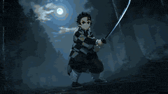

> 🔗 [Original Source](https://x.com/johnAGI168)

---

### Pixel Art Horror RPG Gameplay Scene

**Prompt:**
```
Screen recording of a 2D top-down pixel art horror RPG game, Japanese indie style reminiscent of The Witch's House and Ib. A stoic pale-haired anime girl sprite navigates a decaying Victorian mansion interior, dark muted palette with flickering candlelight casting long pixel shadows. Sparse windows reveal a pale moonlit night sky outside. [0s–3s] The girl sp
```

> 🔗 [Original Source](https://x.com/IamEmily2050)

---

### 2D Anime Action Sequence: Wind Knight vs Shadow Beast

**Prompt:**
```
A 23-second ultra-cinematic 2D anime action sequence at night. Dark blue sky, stars, bright full moon with strong rim light. Burning medieval village in background: flaming huts, black smoke, floating embers. Dry rocky hills, dusty ground. Fluid 24fps animation, painterly style, dynamic motion blur, dramatic cameras, epic orchestral swell. 0-2s: Sweeping low
```

> 🔗 [Original Source](https://x.com/Maercihh)

---

### Cartoon Child and Chicken Chase

**Prompt:**
```
The cartoon child walks left to right along the playground path, holding a half-eaten sandwich in the right hand. A chicken notices the sandwich, lowers its body, and suddenly sprints after it. The sandwich stays clearly visible the entire time until the child eventually throws it. The route remains unobstructed, moving from the path to the slide and then to
```

> 🔗 [Original Source](https://x.com/ChangningL29508)

---

### 3D Cartoon Ramen Eating Animation

**Prompt:**
```
The 3D character from Image 1 performs actions in the style of a 3D cartoon animation. The movements alternate between fast motion and sudden stops, proceeding with a good tempo. Scene: The character from Image 1 is eating ramen at a food stall. Scene 1: Angle from below. She looks at the bowl of ramen and raises her chopsticks, looking impatient and excited
```

> 🔗 [Original Source](https://x.com/L0fc54feio50017)

---

### Surreal Musical Sculpture Animation

**Prompt:**
```
A continuous dolly-in glides along a surreal wooden sound sculpture perched on a stone overlook above the sea, bathed in golden-hour light. The instrument twists upward in intersecting curves and blocky voids—planks of varying size, density, and color are embedded at odd angles across its looping form. Some beams curve like ribs, others jut out like cantilev
```

> 🔗 [Original Source](https://x.com/guicastellanos1)

---

### Anime Character Book Catch

**Prompt:**
```
A 5-second verification animation. The character is surprised and catches a book titled \"Meikyo\". [Character Settings] 100% complete maintenance of the character design, hairstyle, and outfit from the input image. [Background Settings] Solid flat studio background.
```

> 🔗 [Original Source](https://x.com/naoki2021n)

---

### Multi-Scene Calligraphy and Fairy Animation

**Prompt:**
```
Please refer to the provided image and generate the entire scene as a single animation video. SCENE 1 (0-4 seconds) - Shouting \"Wa~!\" - The fairy faces forward, opens her mouth wide, and shouts \"Wa~!\" energetically. - Rainbow ripple effects spread out from the front of her face as if sound is being emitted. - Her body vibrates slightly in time with the volum
```

> 🔗 [Original Source](https://x.com/aiehon_aya)

---

### 3D Animation Monkey Warrior Battle

**Prompt:**
```
[0:00-0:02] Pre-fight: An anthropomorphic monkey warrior in full traditional chinese armour is surrounded by an army of soldiers wearing metallic armor of gold and white. The warrior is laughing, finding his situation both exciting and halarious. The enemy soldiers are closing in all around him. He spins his staff playfully at his right side, twirling it beh
```

> 🔗 [Original Source](https://x.com/PocketScreenAI)

---

### Dreamy Fairytale Logo Animation

**Prompt:**
```
Referencing the image, create a gentle and dreamy logo appearance animation. Start with soft pink and light blue light gently and warmly enveloping a black background, then the logo slowly floats up to represent a weightless dream world. Small stars, hearts, and bubbles drift around to create a cute fairytale atmosphere, and the logo is completed with a sens
```

> 🔗 [Original Source](https://x.com/aiehon_aya)

---

### Stardust Shoujo Anime Prompt

**Prompt:**
```
[Video Concept] A 10-second scene of a girl surrounded by stardust, crying while thinking of someone. Three lines whispered in Japanese. Deep purple and silver colors. Particles synchronize with her emotions. [Character] A silver-haired girl with flowing hair and an ethereal gown. Transitioning from silence to earnestness to tears. [Background] Night sky wit
```

> 🔗 [Original Source](https://x.com/aiehon_aya)

---

### Chibi Phoebe Anime Description

**Prompt:**
```
POV: Someone stealthily stole Phoebe Chibi’s rice from her bowl Watch her instantly boil over😂 A super cute chibi-style Phoebe from Wuthering Waves as 'Phoebe Chupi' or 'Fibi Chupi', exaggerated big head, tiny body, adorable round face, big sparkling eyes with heart-shaped highlights, blonde hair with blue ribbons, wearing her signature oversized white and
```

> 🔗 [Original Source](https://x.com/ShamiWeb3)

---

### Cyberpunk K-Pop Animation

**Prompt:**
```
hand drawn dynamic k-pop dance sequence with k-pop choreography in a cyberpunk setting, fit, extremely high quality, alluring, wide lens, extreme foreshortening, pg-13, futuristic, hand drawn anime, expert choreography, backup dancers, in a crowded rave, smoke machines, light show, backlit, tutting, amazing choreography, hand drawn animation, masterpiece, ul
```

> 🔗 [Original Source](https://x.com/ChangningL29508)

---

### Crying Anime Girl Lip-Sync Prompt

**Prompt:**
```
High-quality Japanese anime, masterpiece, ultra-high definition, top-quality animation, cinematic. A cute anime girl is wailing in a comically exaggerated expression. A large volume of tears bursts out vigorously from her eyes in both directions, flying in a wide arching parabola to the sides. The tears continue to fly in a symmetrical arc, sparkling and pop
```

> 🔗 [Original Source](https://x.com/Naonekozamurai)

---

### Minimalist Brand Animation Template

**Prompt:**
```
Ultra-smooth motion design sequence. Solid black background throughout. Minimalist white-on-black aesthetic. No edits—a single, continuous, uninterrupted visual evolution. Fixed static center shot, no camera movement. All motion occurs within the subject. Self-luminous white forms on absolute black, no grain, no shadows. Style: Luxury tech brand motion logo,
```

> 🔗 [Original Source](https://x.com/AbleGPT)

---

### Anime character omelet cooking story template

**Prompt:**
```
[Video Content] A 2D anime style character acting in the real world. [Video Length] 15 seconds. [Frame Rate] 60fps. [Character] Refer to input image. [Character Action] Anime-exaggerated movements that show emotions and personality suitable for the character. [Character Style] 2D anime style. [Era/Season/Weather] Auto. [Location (Background)] Location suitab
```

> 🔗 [Original Source](https://x.com/seiiiiiiiiiiru)

---

### 3D Anime Character Scenario Template

**Prompt:**
```
[Video Content] A 3D anime style character acting in the real world. [Video Length] 15 seconds. [Frame Rate] 60fps. [Character] Refer to input image. [Character Action] Anime-style exaggerated movements that reflect emotions and personality suitable for the character. [Character Style] 3D anime style. [Era/Season/Climate] Leave to AI. [Location (Background)]
```

> 🔗 [Original Source](https://x.com/seiiiiiiiiiiru)

---

### Q-Style 3D Cartoon Character Consistency Prompt

**Prompt:**
```
Image 1 is the lead character — maintain identical facial features, proportions, and identity throughout. She is a Q-style 3D cartoon girl with long straight black hair parted in the center flowing to her waist, silky and smooth, wearing a jade-colored rabbit hair clip
```

> 🔗 [Original Source](https://x.com/crayon1267)

---

### Chibi Firefly Anime Style

**Prompt:**
```
Vertical 9:16 15 seconds, ultra-cute chibi anime style, AI-generated (AIGC). Adorable super-deformed chibi Firefly from Honkai
```

> 🔗 [Original Source](https://x.com/Just_sharon7)

---

### 90s Anime Sword Fart Fail

**Prompt:**
```
90s Japanese anime style. A character comes to pull out a legendary sword. They strike a pose and deliver grand lines, straining and shouting to pull it out with all their might, but they accidentally fart, leading to a pathetic moment. Great camera direction with wind blowing. Then they fart. Silence follows, the world stops for a moment, the sword comes ou
```

> 🔗 [Original Source](https://x.com/ponzponz15)

---

### 3D Cartoon Bear Beekeeper

**Prompt:**
```
Morning sun. Alps. A bear in a beekeeper suit lifts the hive lid. [0-3s] he greets the bees, \"good morning team\" \"this is Mike, I'm your new product manager\" [6-9s] The bees lean forward. he takes a step
```

> 🔗 [Original Source](https://x.com/sumi404_ai)

---

### Studio Ghibli Style Animation Scene

**Prompt:**
```
You are generating 9 sequential video clips for an animated short film titled \"Pip's Adventure — Scene 1: The Threshold\". Cinematic, Studio Ghibli style. The clips form a continuous story — a timid mouse discovers a crack in a garden wall and steps through into the unknown. Character: Pip is a small brown field mouse with oversized ears, pink inner ears, whi
```

> 🔗 [Original Source](https://x.com/miku_diffract)

---

### Baby Plush Anime Opening

**Prompt:**
```
Full-color Japanese anime. Fast camera movement, strong speed ramping, high animation density, a 24 FPS anime opening. A viewpoint darting left and right, with dynamic poses. type: anime_opening_continuous_camera_flythrough style: dark fantasy anime, cel-shaded 2D, high contrast; characters use the attached tiled baby plush mascot design: SD/chibi, pastel st
```

> 🔗 [Original Source](https://x.com/hAru_mAki_ch)

---

### Surreal Collage Animation Prompt

**Prompt:**
```
Mixed media collage animation, paper cutouts. An ultra-fast montage of cutout fragments featuring only the girl's parts. All cutout fragments are haphazardly pasted onto a concrete wall one after another as collage materials representing a body cut into pieces.
```

> 🔗 [Original Source](https://x.com/pan_soramame_da)

---

### Detailed Gacha Game Summon Animation

**Prompt:**
```
Reference image is used for reference only, not as a start frame. Social game gacha production style. Up-tempo, exciting BGM with sound effects like electronic tones, lottery sounds, and confirmation sounds. The girl with a pacifier does not speak and her mouth does not move at all. All transitions are flashy effects with impacts, flashes, and UI glows. Imme
```

> 🔗 [Original Source](https://x.com/Kashiko_AIart)

---

### Origami House Paper Animation

**Prompt:**
```
Top-down shot of a blank white sheet of paper on a desk. A pencil draws a small house. The drawing begins folding itself upward off the page — the house pops into a 3D paper structure. Trees sprout around it as origami folds, a paper river unfolds and starts flowing
```

> 🔗 [Original Source](https://x.com/rezkhere)

---

### Anime Promotion Video Ad Prompt

**Prompt:**
```
Create a 15-second anime advertising video referring to this image. The dialogue should be professional voice actor Japanese throughout. Use a multi-cut composition with diverse scenes every 0.5 to 3 seconds (emotional character expressions, immersive adventure/daily life scenes, beautiful background scenery, etc.) in a well-paced rhythm to create an engagin
```

> 🔗 [Original Source](https://x.com/SSSS_CRYPTOMAN)

---

### Cyberpunk Urban Runner Animation

**Prompt:**
```
Neon-drenched megacity at night. Rain-slick rooftops. A cyberpunk runner with glowing boots sparks fire with every stride while drones hunt her through the foggy skyline. Low-angle tracking, vertical leaps
```

> 🔗 [Original Source](https://x.com/nijokestu)

---

### Temple Rooftop Chase Animation

**Prompt:**
```
Now she’s sprinting across ancient temple rooftops, blue energy bursting from her body, leaping fearlessly as a spectral dragon coils around her mid-flight. The camera chases from below, then orbits wildly toward the blood moon.
```

> 🔗 [Original Source](https://x.com/nijokestu)

---

### Low FPS Flipbook Animation

**Prompt:**
```
A video produced frame-by-frame at 10 FPS, like a flipbook. Every line differs per frame, creating a flipbook-like animation. It maintains a pale color palette and the refined expression of ink wash painting, depicting a woman's natural movements exactly as they are.
```

> 🔗 [Original Source](https://x.com/eijo_AIart)

---

### Holographic Crystal Tree Animation

**Prompt:**
```
premium motion graphics video with floating holographic particles and crystal-like structures building into a majestic glowing tree with flowing light leaves. Dark void background, elegant and magical animation.
```

> 🔗 [Original Source](https://x.com/zeng_wt)

---

### Anime Parody Running with Bread Scene Prompt

**Prompt:**
```
Daytime, a slope lined with cherry blossoms (outdoors). She bursts out of the front door with a piece of toast in her mouth. A parody of the classic anime 'I'm late, I'm late!' trope. The camera captures her profile while only the background flows by at high speed. Along the way, she rhythmically avoids various obstacles. - Evades a stray cat jumping out wit
```

> 🔗 [Original Source](https://x.com/xc5_)

---

### Cartoon Kitchen Snack Chaos

**Prompt:**
```
Cartoon-style giant kitchen at night, warm fridge light + moonlight, Pixar-like rendering, vibrant colors, soft rounded characters, humorous tone. Three goofy pajama-clad characters grab snacks chaotically — stuffing cookies, drinks, and food into bags, crumbs and wrappers flying. [CUT] They hear a sound → freeze → panic and sprint toward the exit, bags boun
```

> 🔗 [Original Source](https://x.com/Just_sharon7)

---

### Pixar-style 3D animation of iridescent fabric on a marble pedestal

**Prompt:**
```
[00:00–00:05] Pixar-style 3D animation. A shimmering translucent fabric with a subtle iridescent weave rests perfectly folded on a clean white marble pedestal in a minimalist showroom — white walls, soft directional lighting, nothing else. Slow orbit shot circling the pedestal.
```

> 🔗 [Original Source](https://x.com/real_michal)

---

### Giantess Anime Climbing Scene Prompt

**Prompt:**
```
High-quality anime style, 2D animation. Warm, cinematic lighting with sunlight filtering through blinds. A tiny man wearing a green hoodie and blue jeans runs across a wooden floor toward a giantess. He climbs up her massive foot and leg, which are covered in black fishnet stockings, using the fishnet holes to climb. Dynamic low-angle camera following his as
```

> 🔗 [Original Source](https://x.com/EHuanglu)

---

### High-Speed Female Swordswoman Battle Animation

**Prompt:**
```
High-speed battle motion by a female swordswoman, performing a fierce sword dance (camera angle, subject distance, and focus are all left to the AI), executing various sword techniques such as Flame Slash, Explosive Ice Slash, and Thunder Slash without stopping from start to finish. Include effects that burst out to fill the screen, and generate a high-quali
```

> 🔗 [Original Source](https://x.com/souhiro_meem_ch)

---

### Chibi Anime Girl Ice Cream Tragedy Prompt

**Prompt:**
```
{ \"character\": { \"description\": \"A tiny chibi anime girl with a short black bob haircut, straight bangs, and a small metallic hair clip, wearing a soft plush penguin hoodie with a yellow beak on top, black outer texture, white belly patch, wing-style sleeves, and tiny yellow penguin feet\" }, \"scene\": { \"environment\": \"Park bench at sunset with warm golden li
```

> 🔗 [Original Source](https://x.com/ShamiWeb3)

---

### Video Prompt for Seasonal Tree Animation

**Prompt:**
```
FORMAT: 15s / 90 BPM / 8 SHOTS SUBJECT: Single tree STYLE: Stylized nature animation ENVIRONMENT: Minimal landscape MOOD: Calm, poetic, beautiful SHOT 1: Bare tree (winter). SHOT 2: Snow melts → buds appear. SHOT 3: Spring bloom explosion. SHOT 4: Leaves grow dense (summer).
```

> 🔗 [Original Source](https://x.com/aleenaamiir)

---

### Prompt for Dark Fantasy Anime Battle

**Prompt:**
```
Dark fantasy anime style 2D animation. Fast-paced magic battle. A white-haired sorceress instantly summons a massive glowing purple magic circle beneath her, arcane symbols spinning rapidly. She raises her hand and shouts: \"消え去れ！\" Multiple purple energy bolts fire forward
```

> 🔗 [Original Source](https://x.com/Mayz1169)

---

### Horror Animation Scene Breakdown

**Prompt:**
```
Scene 1 horror animation. Flat paper-puppet look, rough textures, dark muted colors, slight projector flicker. 15-second vertical video (9:16), 5 cuts. Cut1 (0-3s) Night Japanese street, flickering streetlight. Young woman alone at bus stop. Paper cut-out style, slow push-in.
```

> 🔗 [Original Source](https://x.com/TomaAIbijo)

---

### Tentacle Family Breakfast Animation Test

**Prompt:**
```
Morning. Kitchen. (Character 1) skillfully manipulates a frying pan with multiple tentacles, cooking pancakes. Beside him, (Character 2) holds a teapot with a suction-cup tentacle, brewing fragrant coffee. All the kitchen utensils have transformed into organic shapes, and iridescent steam rises from them. (Character 3) mutters, \"Mom and Dad, you look weird,\"
```

> 🔗 [Original Source](https://x.com/nanohana_hanana)

---

### Photorealistic 2.5D Anime Scene Prompt

**Prompt:**
```
Photorealistic, high-definition 2.5D anime. All dialogue is in Japanese. The girl's height is 153 cm and the man's height is 185 cm. shot1 On the street in Akihabara at night. Bust shot of the girl. The girl's height is 153 cm. The girl closes her eyes painfully and looks down. The camera also PANs down according to her movement.
```

> 🔗 [Original Source](https://x.com/_3912657840)

---

### High-speed anime duel in sky ruins

**Prompt:**
```
High-speed anime duel in ruins in the sky, lightning, energy clashes, cinematic action.
```

> 🔗 [Original Source](https://x.com/IATiago)

---

### Realistic to Anime Transition Video Prompt

**Prompt:**
```
Futuristic city transitioning from realistic film style to anime energy visuals, fast cinematic action.
```

> 🔗 [Original Source](https://x.com/OtakuMachine)

---

### 2.5D Anime Scene: Akihabara Night

**Prompt:**
```
Photorealistic, high-definition 2.5D anime. All dialogue is in Japanese. The woman's height is 153 cm and the man's height is 185 cm. shot1 Street in Akihabara at night. Bust shot of the girl. The girl's height is 153 cm. The girl closes her eyes in pain and looks down. The camera also pans down with the movement.
```

> 🔗 [Original Source](https://x.com/_3912657840)

---

### Cyberpunk Magical Girl Anime Video Prompt

**Prompt:**
```
16:9 widescreen, cel-shaded 2D anime style, hand-drawn look, cyberpunk magical girl color palette — deep midnight blue, electric cyan, holographic silver, neon purple accents, 24fps, shallow depth of field.
```

> 🔗 [Original Source](https://x.com/finshelley)

---

### Sci-fi Anime Single-Shot Action Sequence

**Prompt:**
```
15-second continuous single-shot action sequence. No cuts. No scene transitions. Sci-fi anime action aesthetic. Palette: cold whites, blue lighting, floating debris. Scene: Interior of space station with broken gravity. 0–3s — tension Camera drifts slowly. Character floating,
```

> 🔗 [Original Source](https://x.com/Artedeingenio)

---

### Chinese-Style Wuxia Battle Animation Prompt

**Prompt:**
```
9. Chinese-style animation Chinese-style animated wuxia battle scene, cinematic action sequence, a calm Shaolin monk in flowing orange and red robes fighting a fierce samurai in dark lacquered armor with a katana, ancient bamboo forest at dusk, drifting mist, falling leaves,
```

> 🔗 [Original Source](https://x.com/azed_ai)

---

### 3D Fantasy Animation Prompt

**Prompt:**
```
5. 3D animation 15-second 3D fantasy animation, cinematic storytelling, a young boy walking alone through a mysterious enchanted forest at golden dusk, soft volumetric light through the trees, magical atmosphere, detailed moss, roots, glowing particles in the air, the boy
```

> 🔗 [Original Source](https://x.com/azed_ai)

---

### Pastel Cloud Animation Prompt

**Prompt:**
```
Ultra-cute pastel cloud animation, soft rounded chibi style, bright sky tones, smooth bouncy physics, cinematic motion. 0–4s: Cloud floats → wakes with cute expression. 4–8s: Spins and zooms playfully, leaving puff trails. 8–12s: Interacts with sun/birds, energetic movement. 12–15s: Hero center frame, happy bounce, sparkle. Soft daylight, smooth camera, whol
```

> 🔗 [Original Source](https://x.com/Just_sharon7)

---

### Moonlit Piano Chase Animation

**Prompt:**
```
A moonlit piano chase where the mouse turns the whole instrument into a trap. What happens The mouse runs across piano keys, making playful notes. The cat stalks across the piano lid. The cat lunges, but the mouse slips into the piano. The cat gets nearly caught by the closing lid. Inside the piano, the mouse runs through strings and hammers. The cat’s tail
```

> 🔗 [Original Source](https://x.com/Dheepanratnam)

---

### Watercolor Cartoon Single-Shot Video Prompt

**Prompt:**
```
15-second continuous single-shot cartoon sequence. No cuts. No scene transitions. Soft watercolor illustration style, pastel colors, gentle textures, hand-drawn outlines, dreamy lighting, calm and magical tone Scene: A small animal character walking through a quiet meadow.
```

> 🔗 [Original Source](https://x.com/Artedeingenio)

---

### Anime Girl and Explosion Video Prompt

**Prompt:**
```
Japanese anime. Dialogue in Japanese. Flowing clouds. A girl walks, jumps cutely, and hits a red switch. At the moment of the explosion, it briefly becomes black and white high contrast, then flame-colored high contrast. The tower in the background explodes violently, creating a flame backlight high contrast. The girl says, \"Haa~!?\" Surprised by the explosio
```

> 🔗 [Original Source](https://x.com/_3912657840)

---

### Anime High-Speed Cut Test Prompt

**Prompt:**
```
Anime high-speed cut test — 20 hard cuts in 10 seconds (0.5 seconds per cut, no fade-in/fade-out, no transitions). [0.0 seconds to 0.5 seconds]: Cut 1 — Close-up. Anime Girl A: Long crimson hair, vivid green eyes. Winks at the camera.
```

> 🔗 [Original Source](https://x.com/tebasaki3D)

---

### Dragon Rider Action Anime Prompt

**Prompt:**
```
A super high-speed flight action scene of a girl riding a dragon. High number of frames, 24FPS Japanese full-color anime. Two dragons, one blue and one red, are flying high above the clouds. They are flying faster than 100 km/h, cutting through the wind and passing between the clouds. A sense of freedom, liberation from anything that might interfere, and spe
```

> 🔗 [Original Source](https://x.com/naoyuki_okada)

---

### 15-Second Continuous 3D Cartoon Sequence Prompt

**Prompt:**
```
15-second continuous single-shot cartoon sequence. No cuts. No scene transitions. Stylized 3D cartoon animation, vibrant colors, strong contrast lighting, exaggerated expressions, extreme squash and stretch, elastic motion, dynamic camera, high energy Clear motion direction,
```

> 🔗 [Original Source](https://x.com/Artedeingenio)

---

### Anime Girl Talking About Pudding

**Prompt:**
```
The character from \u003c\u003c\u003cImage1\u003e\u003e\u003e is an anime-style girl talking enthusiastically about pudding. She speaks with the voice and timing from ♪\u003c\u003c\u003cAudio1\u003e\u003e\u003e , with natural lip-sync matching the audio. Medium shot, slightly low angle, facing the camera. Bright, warm indoor
```

> 🔗 [Original Source](https://x.com/BeamManP)

---

### 3D Cartoon Sequence Video Prompt

**Prompt:**
```
15-second continuous single-shot cartoon sequence. No cuts. No scene transitions. Stylized 3D cartoon animation, bright vibrant colors, clean shapes, soft lighting, exaggerated expressions, squash and stretch, elastic motion, strong readability Clear comedic timing, progressive
```

> 🔗 [Original Source](https://x.com/Artedeingenio)

---

### Epic Cat Kung Fu Animation Trailer

**Prompt:**
```
Epic 13s Animation Trailer (Concise, English): Style: cinematic, ultra dynamic, DreamWorks-level animation, dramatic lighting, motion blur, epic scale, fast cuts, emotional arc 0–2s Clumsy gray cat in yellow kung fu suit slips and falls, gets smacked down by orange master cat in gray Taoist robe with long white eyebrows. Master (cold): “Too slow.” VO: “He wa
```

> 🔗 [Original Source](https://x.com/drjoetw)

---

### Kawaii Chibi Animation of Gugugaga and Doro

**Prompt:**
```
A super cute chibi anime cartoon animation in vibrant kawaii Arknights Endfield style: the adorable penguin-hooded baby administrator Gugugaga (black glossy penguin helmet with yellow beak, big sparkling blue eyes full of hearts and sparkles, dark bob hair with bangs, heavy blush, tiny body) playfully interacting and playing together with her bestie Doro in
```

> 🔗 [Original Source](https://x.com/Just_sharon7)

---

### Gugu Gaga Chibi Animation by the Lake

**Prompt:**
```
chibi kawaii anime style: a cute black-haired penguin-hoodie girl with blue eyes and metal collar sits on a wooden bench by a lake. She bobs her head and moves her mouth cutely while making silly baby-talk sounds synced to the audio: '9 Gugu... Lol... Gugu Ga... Lol... Guguga... Lol'. Gentle body wiggles and sparkling eye animations. Bright natural daylight,
```

> 🔗 [Original Source](https://x.com/Just_sharon7)

---

### Peaceful Lofi Train Ride Anime Video Prompt

**Prompt:**
```
A peaceful anime-inspired lofi train ride at sunset, warm hand-painted fantasy style, a quiet girl by the window wearing headphones, golden sky, distant mountains, passing trees, soft sunlight on her face, notebook in her lap, dreamy nostalgic atmosphere, calm travel mood, soft painterly textures, gentle motion, cuts only Shot 1: Wide shot inside a cozy trai
```

> 🔗 [Original Source](https://x.com/ChangningL29508)

---

### Anime Lofi Train Ride Prompt

**Prompt:**
```
A peaceful anime-inspired lofi train ride at sunset, warm hand-painted fantasy style, a quiet girl by the window wearing headphones, golden sky, distant mountains, passing trees, soft sunlight on her face, notebook in her lap, dreamy nostalgic atmosphere, calm travel mood, soft
```

> 🔗 [Original Source](https://x.com/azed_ai)

---

### Anime Witch Transformation with Bat Wings

**Prompt:**
```
\"Image1 is the reference for the entire video. It is a sketch art anime style. 1sec-3seconds the woman is standing still and the wind is blowing hard. Her dress and hair are blowing in the wind. 4sec-6sec the woman magically causes the staff in her hand to disappear. She smiles with an evil smile. 7sec-15sec She holds out her arms and large bat wings appear
```

> 🔗 [Original Source](https://x.com/VampireBella13)

---

### Futuristic Military Briefing in Anime Style

**Prompt:**
```
Inside a dark military command room, only two people sit at the table. An older woman with long silver-white hair in a dark black satin robe sits at the head and says \"The next target is...\" while gesturing toward the center of the table. A younger woman with long silver-white hair in a black and white ornate dress sits across from her, listening attentively
```

> 🔗 [Original Source](https://x.com/LurkShade)

---

### Technical animation of a levitating, exploding vintage television

**Prompt:**
```
The vintage orange television slowly lifts off the table and levitates into the air. As it rises, the outer casing smoothly peels away and separates into multiple floating panels, revealing the intricate internal circuitry and components in an \"exploded view\" style. The movement is slow, fluid, and weightless, with the pieces maintaining a symmetrical arrang
```


> 🔗 [Original Source](https://x.com/ChangningL29508)

---

### Anime Sakuga Fight Scene Prompt 1

**Prompt:**
```
Video 1: Exaggerated anime sakuga high-speed fight scene 10 seconds premium quality ultra-fluid masterpiece: tough delinquent schoolgirl unique street-tough design messy ponytail blonde streaks piercings loose torn sailor uniform toothpick in mouth cocky smirk narrowed focused
```

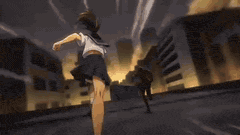

> 🔗 [Original Source](https://x.com/NACHOS2D_)

---

### 3D CG Animation of a Monk Riding a White Horse

**Prompt:**
```
High-saturation 3D CG animation, strong contrast gold and electric blue highlights, cinematic volumetric lighting, style of Ne Zha and Monkey King animated films. A bald Buddhist monk in flowing golden-yellow wide-sleeve robes with a bright red sash, riding a majestic white
```

> 🔗 [Original Source](https://x.com/Mayz1169)

---

### Shrimp Wars Animation Prompt

**Prompt:**
```
Shrimp Wars 🦐 This is an animation about a playful shrimp toss duel that hooks the viewer instantly and keeps them engaged through rhythm.
```


> 🔗 [Original Source](https://x.com/aimikoda)

---

### Gugu Gaga Chibi Anime Reaction

**Prompt:**
```
masterpiece, best quality, ultra-cute 3D chibi anime animation, adorable moe girl \"Gugu Gaga\" (Endministrator) wearing oversized fluffy black-and-white penguin kigurumi onesie with hood and beak details, yellow beak and feet accents, short black bob hair, enormous sparkling anime eyes with highlights, tiny stubby body and arms, rosy cheeks, holding and bitin
```


> 🔗 [Original Source](https://x.com/Just_sharon7)

---

### Chibi Moe Anime Penguin Girl

**Prompt:**
```
A high-quality 3D chibi moe anime short video, vertical 9:16. Adorable kawaii penguin girl character \"Aunt Gaga\" (Gugu Gaga), big sparkling doe eyes, chubby cheeks, tiny body, black-and-white penguin hoodie costume with yellow beak and feet details, soft blush, black hair peeking out, playful mischievous expression. Cozy dimly lit bedroom at night, warm desk
```


> 🔗 [Original Source](https://x.com/Just_sharon7)

---

### JSON Prompt for Modern Anime Sakuga Fight Sequence

**Prompt:**
```
{ \"title\": \"Modern Anime Sakuga Fight Sequence\", \"format\": \"text-to-video prompt\", \"language\": \"en\", \"genre\": \"anime action fight\", \"style\": { \"animation_style\": \"high-quality modern anime sakuga\", \"aesthetic\": \"modern anime\", \"finish\": \"fully finished professional production quality\", \"painting\": \"professional anime painting\", \"lighting\": \"cinematic anime l
```

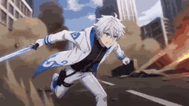

> 🔗 [Original Source](https://x.com/ertanlabs)

---

### Anime Energy Clash Fight Sequence

**Prompt:**
```
[Subject]: Two super-powered individuals with hardcore anime lines, a warrior in dark blue armor, and an opponent in a crimson red robe. Clear facial features, character faces remain stable and undistorted. [Action]: The two characters cross diagonally in the air, instantly generating intense energy clash light effects, with extreme particle sparks blooming
```


> 🔗 [Original Source](https://x.com/Adam38363368936)

---

### Stop-Motion Clay Animation Story Prompt

**Prompt:**
```
Stop-motion clay animation with handcrafted tactile materials and real fabric, set under warm afternoon park lighting. Wide shot: a clay figure with a matchbox head and a clay figure with a lit candle head sit together on a real tiny park bench, mid-conversation. The candle flame flickers gently, the matchbox drawer is slightly open, and they appear close an
```


> 🔗 [Original Source](https://x.com/Riya333S)

---

### Anubis Tickle Torture Animation

**Prompt:**
```
Traditional modern 3D animation style: 0.0s-4s: Mighty Anubis sits in his throne and a group of villains stand in front of him with a mecha robot. The mecha robot is currently holding Anubis arms above his head. The group of villains demand Anubis to reveal the secrets of his powers and Anubis nonchalantly and bored says that he won’t tell these mortals anyt
```


> 🔗 [Original Source](https://x.com/migrok293703)

---

### JRPG Style Anime Battle Scene

**Prompt:**
```
Anime style, JRPG style battle performance, cinematic camera movement. A red-haired, purple-eyed girl fights a giant earth dragon in a dark cave. She wears a white shirt with a red tie and a black studded belt. The girl bursts into a purple flash and splits into five figures, leaving purple afterimages as they quickly spread out around the earth dragon, poin
```

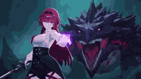

> 🔗 [Original Source](https://x.com/ShadeLurk)

---

### Pure Hand-Drawn 2D Cartoon Animation

**Prompt:**
```
Pure hand-drawn 2D cartoon animation only — absolutely no 3D. Ever. 24fps on ones, 16:9. Every line breathes with subtle hand-drawn imperfections. A young adventurous boy rides a flying paper airplane over a vibrant seaside town during sunset. The camera stays closely behind his back the entire time — we see his shoulders, messy hair, fragile paper wings, an
```

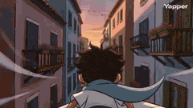

> 🔗 [Original Source](https://x.com/Itswsm105f)

---

### Emotional Underwater Anime Test Prompt

**Prompt:**
```
[Video Composition] A continuous story animation, 15 seconds (5 shots), emotional and moving, utilizing abundant use of polychromatic light and water effects. [Art Style] Extremely beautiful underwater drawing. High-quality 2D cell-look anime with light rays penetrating the water surface (God rays), sparkling bubbles, and overwhelming transparency. [Characte
```


> 🔗 [Original Source](https://x.com/aiehon_aya)

---

### Chibi Boxing Match with Anime Action Style

**Prompt:**
```
Two chibi fighters wearing oversized boxing gloves stand in a bright boxing ring surrounded by cheering crowds. The bell rings and they rush toward each other throwing rapid punches, dodging and sliding across the ring, ending with a dramatic slow-motion knockout punch, colorful arena lights, energetic anime action style.
```


> 🔗 [Original Source](https://x.com/AIwithSynthia)

---

### Cyberpunk Anime Trailer Test Prompt with Lip Sync

**Prompt:**
```
[Video Composition] A 15-second (4-shot) video replicating a cyberpunk animation movie trailer (teaser), including dialogue and lip-syncing. [Art Style] Detailed mechanical depiction and action animation drawing. Motion blur and neon light source effects indicating intense speed. [Characters] An excited, smiling girl with turquoise short hair. She wears a ye
```

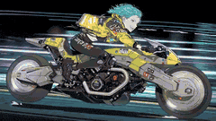

> 🔗 [Original Source](https://x.com/aiehon_aya)

---

### Structured Chibi Character Animation Prompt

**Prompt:**
```
{ \"video_generation_prompt\": { \"scenes\": [ { \"scene_name\": \"Intro Jump\", \"description\": \"Chibi character pops up from bottom of screen, big sparkling eyes, tiny hands waving, oversized head, cheerful smile, colorful outfit with cute accessories, soft pastel gradient background, short jump animation, cinematic soft lighting, adorable expression, 2 seconds\" },
```


> 🔗 [Original Source](https://x.com/Just_sharon7)

---

### Anime Combat Scene: Knight vs. Shadow Monster

**Prompt:**
```
Silver-haired knight vs horned shadow monster. Meteor dive attack. Afterimage blade combo. Cinematic camera movement.
```

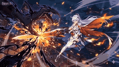

> 🔗 [Original Source](https://x.com/andrehutap775)

---

### The Saddest Story Told in Stop-Motion Clay Animation

**Prompt:**
```
Stop-motion clay animation, handcrafted tactile materials, real fabric, warm afternoon park lighting. Wide shot: a clay figure with a matchbox head and a clay figure with a lit candle head sit together on a real tiny park bench, mid-conversation — candle flame flickering gently, matchbox drawer slightly open, easy and close. [cut] A distant rumble. Both head
```


> 🔗 [Original Source](https://x.com/AleRVG)

---

### Fantasy Title Sequence Animation Prompt

**Prompt:**
```
The goal is to create a font animation for the four characters “哥飞出海” (Ge Fei Chu Hai). Chaos begins, sword intent surges, the screen starts from absolute pure black, without any light source. As low strings and metallic tremolo sounds, extremely faint cyan-white particle streams begin to emerge in the center of the screen, slowly converging like deep-sea un
```


> 🔗 [Original Source](https://x.com/gefei55)

---

### Anime Girl Skateboarding Transformation Prompt

**Prompt:**
```
Fast-paced FPV drone tracking shot from behind, closely following a 3D anime-style girl with white hair skateboarding down a steep, winding mountain road at incredibly high speed. Extreme forward momentum, wide-angle perspective, wind rushing effect. The video starts in a vibrant summer setting with lush green mountains, a bright sunny sky, a distant ocean,
```

> 🔗 [Original Source](https://x.com/0X0CLOWN)

---

### Chinese Paper-Cut Animation Style Video Prompt

**Prompt:**
```
Section 1: 16:9 landscape, traditional Chinese paper-cut animation style, with vermilion, golden yellow, and indigo blue as the main colors, clear cutout textures, and obvious paper texture. 0-3 seconds: Long shot, multi-layered paper-cut scene—the foremost layer is a red cutout window frame, the middle layer is a traditional courtyard paper-cut, and the bac
```

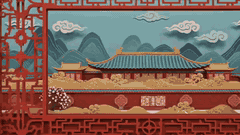

> 🔗 [Original Source](https://x.com/songguoxiansen)

---

### FPV Drone Shot of Anime Girl Skateboarding

**Prompt:**
```
Fast-paced FPV drone tracking shot from behind, closely following a 3D anime-style girl with white hair skateboarding down a steep, winding mountain road at incredibly high speed. Extreme forward momentum, wide-angle perspective, wind rushing effect. The video
```

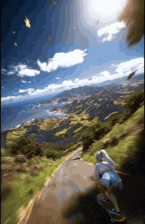

> 🔗 [Original Source](https://x.com/lexx_aura)

---

### Giant cartoon girl vlog at an amusement park

**Prompt:**
```
0–2s: A low-angle shot shows a giant cartoon girl @image1 (wearing a blue LA cap, sunglasses, holding a bouquet of flowers) peeking out from behind a colorful snack shop at a seaside amusement park @image2. One hand gently rests on the top of the awning, her eyes filled with curiosity. 2–5s: A tracking shot follows the giant girl @image1 as she strides acros
```


> 🔗 [Original Source](https://x.com/linyi_zheng)

---

### 2D Anime Video Prompt: White-Haired Girl Summons Water Dragon

**Prompt:**
```
Anime style, Guofeng 2D style, art style similar to Xuanji Technology, white-haired girl, tied hair, cool white skin, possessing a cold and glamorous appearance, the picture has a grainy feel. Phoenix eyes, closed eyes posture, lazy and calm expression, dignified demeanor, extreme detail, extreme impasto, glass texture, streamlined brushstrokes. White draped
```


> 🔗 [Original Source](https://x.com/liyue_ai)

---

### Storyboard to Anime Conversion Prompt

**Prompt:**
```
Video generated from reference image storyboard to anime with automatic coloring.
```


> 🔗 [Original Source](https://x.com/MaAyyoub)

---

### Multi-Shot Storyboard Prompt for Cartoon Generation

**Prompt:**
```
\"A man walks out of his house toward the parked car. [cut] The man gets into the car. [cut] Man turns on the engine; the flower on the dashboard slightly trembles. [cut] Man accelerates quickly and drives like crazy. [cut] Different shot of the man driving wildly, hitting trash bins and mailboxes on his way. [cut] People on the sidewalk scream. No music.\"
```

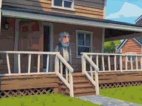

> 🔗 [Original Source](https://x.com/Framer_X)

---

### Anime 'Fa Tian Xiang Di' Transformation Effect Prompt

**Prompt:**
```
Cinematic CG, mythological epic, 4K, exquisite details, dynamic camera. 0-3 seconds: Close-up of the female protagonist's fingers with purple electric arcs. She points two fingers towards the third eye between her eyebrows. Purple light flashes intensely. Her eyes are tightly closed. She chants \"Fa Tian Xiang Di\" (Heaven and Earth Law) in a low voice. Low-fr
```

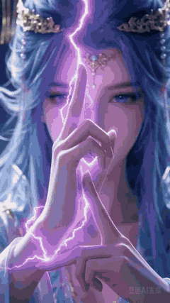

> 🔗 [Original Source](https://x.com/liyue_ai)

---

### Demon Slayer Live-Action Manga Adaptation Prompt

**Prompt:**
```
Live-action manga adaptation · Breathing Style Final Battle (15s · ultra-epic VFX version) Core highlights: Water Breathing (blue water dragon) VS Thunder Breathing (golden lightning), live-action high-speed duel. Style: Hollywood live-action manga movie vibe, dark samurai aesthetic, 4K ultra-clear, ultra-fast cuts, explosive particle effects, no gore. Durat
```

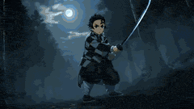

> 🔗 [Original Source](https://x.com/Rita53135643)

---

### Anime Girl Parkour Escape in Neon Night City

**Prompt:**
```
Anime girl parkour escape: rooftop flips between skyscrapers, wind-swept ponytail, pursued by black agents, neon night city, cel-shading, dynamic low-angle tracking, realistic jumps/physics.
```


> 🔗 [Original Source](https://x.com/HoneyAnimeX07)

---

### Nine-Panel Grid Interactive Animation

**Prompt:**
```
Image 1 is the first frame, 12 seconds, 3:4 vertical screen. Nine girls are static in their respective grids in the nine-panel composition. Seconds 1-3: All girls in the grids start moving slightly, maintaining their characteristic expressions. Suddenly, the girl in the top-left selfie grid realizes she is trapped and pushes the grid border with her hand, he
```


> 🔗 [Original Source](https://x.com/msjiaozhu)

---

### Anime Character Switching Prompt

**Prompt:**
```
Overall Structure: - Ultra-high-speed metric montage switching between anime-style characters every 0.1 seconds according to the sequence below. - Each cut must be a video, not a still image, and include camera work. - Sequence: - 0.0s: 😃 High School Girl - 0.1s: 😠 High School Girl - 0.2s: 😭 High School Girl - 0.3s: 😳 High School Girl - 0.4s: 😡 High Sch
```


> 🔗 [Original Source](https://x.com/projectmuse_ai)

---

### Pepe the Frog Speedcubing Animation Prompt

**Prompt:**
```
A high-quality animated scene of a Pepe the Frog character intensely speedcubing a standard 3x3 Rubik’s cube at a professional cubing desk. Pepe is sitting in front of a speedcubing mat and timer, rapidly solving the cube with realistic finger tricks (F2L, OLL, PLL movements), hands moving extremely fast with motion blur. The cube turns smoothly and accurate
```

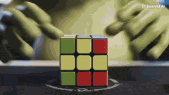

> 🔗 [Original Source](https://x.com/khushaltwt)

---

### 1990s OVA Anime Realism Prompt

**Prompt:**
```
1990s OVA anime realism (Prod I.G + Otomo), Japanese full-color, crisp thin genga linework, restrained cel shading + gentle gradients, subtle film grain, sharp shadows, high-contrast rim light. 24fps ultra-fast sakuga cuts, smear+impact frames, light motion blur
```

> 🔗 [Original Source](https://x.com/horacedodd)

---

### Biological Process Cellular Mechanism Animation Prompt

**Prompt:**
```
Biological process: Cellular mechanism animation, organ system function, ecosystem interaction, life cycle visualization. Micro-macro connection, living system complexity, natural wonder
```


> 🔗 [Original Source](https://x.com/airina_xyz)

---

### Epic Fantasy Anime Action Sequence

**Prompt:**
```
Epic fantasy anime action sequence in whimsical hand-drawn Japanese animation style: soft pastel colors, lush detailed backgrounds with ancient temples overgrown by vines, magical wind effects, glowing particles, fluid exaggerated motion, sense of wonder and drama.
```


> 🔗 [Original Source](https://x.com/TechyTricksAI)

---

### Anime Style Chibi Action Scene Prompt

**Prompt:**
```
24fps ultra-fast sakuga cuts; sharp shadows; smear+impact frames; light motion blur; premium VFX. KEEP characters EXACT chibi/doodle: bold thick outlines, flat flat colors, simple shapes (no realism). Setting: Neon Frontier Outpost alien desert—neon huts, towers, turbines,
```

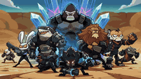

> 🔗 [Original Source](https://x.com/horacedodd)

---

### Anime Warrior vs. Octopus Alien

**Prompt:**
```
\"Astronaut anime warrior battling a massive octopus alien creature, dynamic mid-air clash, intense motion and impact, ultra realistic lighting, cinematic composition, 3D painterly rendering style inspired by Arcane, stylized brush-textured shading, volumetlic fog, dramatic rim
```

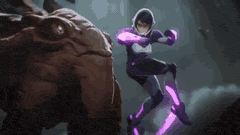

> 🔗 [Original Source](https://x.com/Boonsu28)

---

### Lego Assembly Time-Lapse Animation

**Prompt:**
```
A boy seriously assembling Lego bricks in his room, the scene adopts a 3D animation style, with bright colors, smooth lines, full of childlike fun and vitality, adding a time-lapse effect to show the assembly process. 0-3 seconds: Full view of the room, sunlight spills onto the desk through the window, the boy sits at the desk concentrating on assembling Leg
```

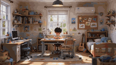

> 🔗 [Original Source](https://x.com/siveill)

---

### Bitcoin Destroys the Federal Reserve Anime

**Prompt:**
```
With both hands raised, floating ₿ panels converge into one massive glowing bitcoin symbol above him like a spirit bomb. the ground beneath cracking with orange light. full anime power-up moment. He then blasts the federal reserve and destroys the existing financial system with bitcoin, replacing it and ushering in a new golden age of orange abundance.
```


> 🔗 [Original Source](https://x.com/mirthtime)

---

### Classic Animation Adventure Scene

**Prompt:**
```
\"classic animation in the style of Disney, a friendly white wolf is playing with a beautiful blonde cute young woman in the snow, different cuts. Suddenly they fall into an ice cavern and find a skeleton with a map in the hand\"
```

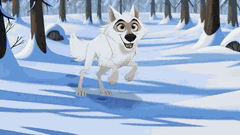

> 🔗 [Original Source](https://x.com/FragZero)

---

### Anime Video: Funny Chinese Officer Sequence

**Prompt:**
```
Use Seedance 2.0 to generate an anime video: funny sequence with Chinese Officer
```


> 🔗 [Original Source](https://x.com/airina_xyz)

---

### Dragon Ball Super Moro Arc Anime

**Prompt:**
```
Dragon Ball Super manga → animated Moro arc magic.
```


> 🔗 [Original Source](https://x.com/DataInsightsIN)

---

### Otter Mech Pilot Anime Scene

**Prompt:**
```
An anime where an otter goes into a large mech, with lots of quick shots of mechanical parts and gears turning. The otter gives a grim thumbs up, and then pilots the mech, flying into battle against an octopus made of marble.
```

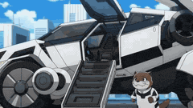

> 🔗 [Original Source](https://x.com/SRKDAN)

---

### Anime Scene of Lumine from Genshin Impact

**Prompt:**
```
Anime scene of Lumine from Genshin Impact dashing across a shattered temple courtyard, leaping into a mid-air somersault and delivering a spiral sword slash that sends glowing elemental energy and stone debris flying
```

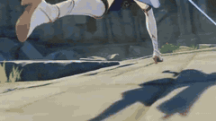

> 🔗 [Original Source](https://x.com/Kokoboy886711)

---

### Van Gogh Post-Impressionism Abstract Animation Prompt

**Prompt:**
```
【Style】Van Gogh Post-Impressionism oil painting, Heavy Impasto texture, signature swirling brushstrokes, dreamy feeling, high-saturation blue and yellow contrast. 【Duration】15 second animation [Visual Content] This is a dynamic world entirely composed of thick oil paint. Sky: In the deep blue night sky, huge yellow stars and a crescent moon are surrounded by
```

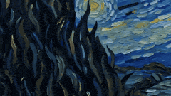

> 🔗 [Original Source](https://x.com/johnAGI168)

---

### Anime character battle generation examples

**Prompt:**
```
Gojo vs Naruto. Saitama vs Genos
```


> 🔗 [Original Source](https://x.com/impaulxyz)

---

### 90s Anime Action Sequence: Cafe Ambush

**Prompt:**
```
''90s anime style, action sequence. A woman with brown wavy hair in a black evening dress sits peacefully in a cafe drinking coffee. Suddenly, masked men with guns kick the door open. The woman flips the table for cover, revealing
```


> 🔗 [Original Source](https://x.com/Iancu_ai)

---
