# 🎌 Anime Prompts

Anime, manga and Japanese animation style prompts.

**Total: 44 prompts** | **21 with GIF preview**

[← Back to README](../README.md)

---

### Gugu Gaga Chibi Anime Reaction


**Prompt:**
```
masterpiece, best quality, ultra-cute 3D chibi anime animation, adorable moe girl \"Gugu Gaga\" (Endministrator) wearing oversized fluffy black-and-white penguin kigurumi onesie with hood and beak details, yellow beak and feet accents, short black bob hair, enormous sparkling anime eyes with highlights, tiny stubby body and arms, rosy cheeks, holding and bitin
```

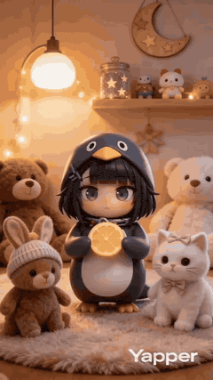

---

### Chibi Moe Anime Penguin Girl


**Prompt:**
```
A high-quality 3D chibi moe anime short video, vertical 9:16. Adorable kawaii penguin girl character \"Aunt Gaga\" (Gugu Gaga), big sparkling doe eyes, chubby cheeks, tiny body, black-and-white penguin hoodie costume with yellow beak and feet details, soft blush, black hair peeking out, playful mischievous expression. Cozy dimly lit bedroom at night, warm desk
```

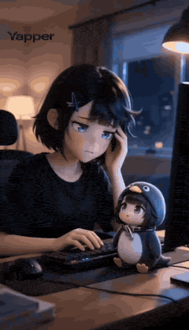

---

### Mecha-Armor Transformation Action Sequence Prompt Summary


**Prompt:**
```
A barefoot woman. Urban chaos. Then a full mecha-armor transformation mid-sequence
```


---

### Anime Energy Clash Fight Sequence


**Prompt:**
```
[Subject]: Two super-powered individuals with hardcore anime lines, a warrior in dark blue armor, and an opponent in a crimson red robe. Clear facial features, character faces remain stable and undistorted. [Action]: The two characters cross diagonally in the air, instantly generating intense energy clash light effects, with extreme particle sparks blooming 
```

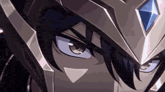

---

### Goku vs. Naruto 2D Battle


**Prompt:**
```
A battle between Goku and Naruto in a 2D animation style. Goku attacks with immense power, delivering a flurry of punches and kicks. The ground cracks and dust flies everywhere. Naruto dodges the strikes with quick turns and blocks, moving with great agility. Each impact creates shockwaves and loud sounds. The movement and body dynamics are clearly depicted,
```


---

### Anubis Tickle Torture Animation


**Prompt:**
```
Traditional modern 3D animation style: 0.0s-4s: Mighty Anubis sits in his throne and a group of villains stand in front of him with a mecha robot. The mecha robot is currently holding Anubis arms above his head. The group of villains demand Anubis to reveal the secrets of his powers and Anubis nonchalantly and bored says that he won’t tell these mortals anyt
```

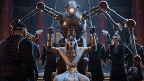

---

### Chibi Boxing Match with Anime Action Style


**Prompt:**
```
Two chibi fighters wearing oversized boxing gloves stand in a bright boxing ring surrounded by cheering crowds. The bell rings and they rush toward each other throwing rapid punches, dodging and sliding across the ring, ending with a dramatic slow-motion knockout punch, colorful arena lights, energetic anime action style.
```

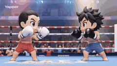

---

### Bus transforming into a Cybertronian mechanical giant caterpillar


**Prompt:**
```
an old, green, oversized, and extra-tall American-style bus is parked in a dilapidated parking lot in a forest. A young Asian driver slams on the brakes, looking tense and speechless. The bus begins to violently disassemble and reorganize from the inside out, transforming into a grumpy, evil Cybertronian mechanical giant caterpillar. The driver's cabin reass
```

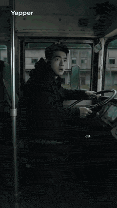

---

### 2D Anime Video Prompt: White-Haired Girl Summons Water Dragon


**Prompt:**
```
Anime style, Guofeng 2D style, art style similar to Xuanji Technology, white-haired girl, tied hair, cool white skin, possessing a cold and glamorous appearance, the picture has a grainy feel. Phoenix eyes, closed eyes posture, lazy and calm expression, dignified demeanor, extreme detail, extreme impasto, glass texture, streamlined brushstrokes. White draped
```

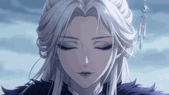

---

### Cyberpunk Android Skin Generation Sequence Prompt


**Prompt:**
```
Generate a cyberpunk-like mechanical body, female image, with only mechanical skeleton and circuitry. Then, starting from the chest, generate skin and tissue, gradually moving to the arms, abdomen, thighs, calves, and head, growing hair and putting on clothes. The entire process must focus on the physical transformation. The background music is cyberpunk sty
```

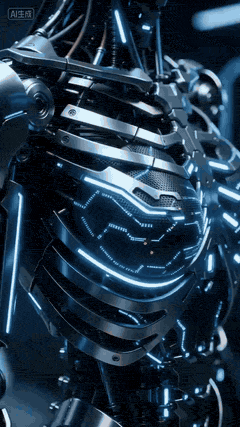

---

### Storyboard to Anime Conversion Prompt


**Prompt:**
```
Video generated from reference image storyboard to anime with automatic coloring.
```

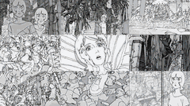

---

### Anime Girl Parkour Escape in Neon Night City


**Prompt:**
```
Anime girl parkour escape: rooftop flips between skyscrapers, wind-swept ponytail, pursued by black agents, neon night city, cel-shading, dynamic low-angle tracking, realistic jumps/physics.
```

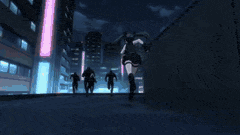

---

### Biological Process Cellular Mechanism Animation Prompt


**Prompt:**
```
Biological process: Cellular mechanism animation, organ system function, ecosystem interaction, life cycle visualization. Micro-macro connection, living system complexity, natural wonder
```

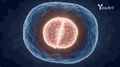

---

### Epic Fantasy Anime Action Sequence


**Prompt:**
```
Epic fantasy anime action sequence in whimsical hand-drawn Japanese animation style: soft pastel colors, lush detailed backgrounds with ancient temples overgrown by vines, magical wind effects, glowing particles, fluid exaggerated motion, sense of wonder and drama.
```

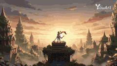

---

### Prompt Engineering for Vehicles


**Prompt:**
```
sleek bull racing car with aerodynamic body, mechanical robot transforming from vehicle to humanoid.
```


---

### Goku Punching a Buy Button and Going Super Saiyan


**Prompt:**
```
\"2d anime goku punching a green buy button at outdoor market that has a wood sign above that says BINDER than goku goes super saiyan\"
```


---

### One Piece Inspired Video Prompt: Loki Saves Hostages


**Prompt:**
```
The hostage children cannot stop walking and steadily approach the edge of the harbor and the hole opened in the sea clouds by the destruction of the ship. Sommers says, \"I don't care if they die; I can just kidnap other giant children later.\" Ripley and the children's families desperately try to stop them, but realizing they can't, they embrace the children
```


---

### Dragon Ball Super Moro Arc Anime


**Prompt:**
```
Dragon Ball Super manga → animated Moro arc magic.
```

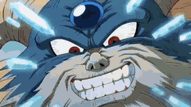

---

### Naruto coding intensely and throwing a laptop


**Prompt:**
```
Naruto coding intensely on a laptop in the Hokage’s office, growing more and more frustrated, then yelling in rage and hurling it out the window.
```


---

### Anime character battle generation examples


**Prompt:**
```
Gojo vs Naruto. Saitama vs Genos
```

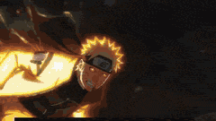

---

### 90s Anime Action Sequence: Cafe Ambush


**Prompt:**
```
''90s anime style, action sequence. A woman with brown wavy hair in a black evening dress sits peacefully in a cafe drinking coffee. Suddenly, masked men with guns kick the door open. The woman flips the table for cover, revealing
```

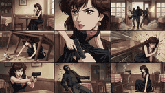

---

### Anime Character Book Catch


**Prompt:**
```
A 5-second verification animation. The character is surprised and catches a book titled \"Meikyo\". [Character Settings] 100% complete maintenance of the character design, hairstyle, and outfit from the input image. [Background Settings] Solid flat studio background.
```

---

### Kawaii Chibi Phoebe with Baby Chicks


**Prompt:**
```
Use the same face from the reference image without changing facial features. ultra-kawaii 3D chibi CGI animation, plush toy aesthetic with realistic fabric and fur textures. Cute blonde anime girl Phoebe from Wuthering Waves as chibi: huge head, tiny body, long blonde hair with white wide-brim hat, blue ribbon and butterfly clip, blue cape and white-black ou
```

---

### Glowing Humanoid Protagonist and Desert Ruins


**Prompt:**
```
image1 as the glowing humanoid protagonist and starting pose (lone powerful figure with dramatic blue energy glow, keep exact biomechanical design, intricate mechanical-organic fusion, and intense presence), image4 as the ancient desert coliseum ruins environment and awakening
```

---

### Chibi Phoebe Anime Description


**Prompt:**
```
POV: Someone stealthily stole Phoebe Chibi’s rice from her bowl Watch her instantly boil over😂 A super cute chibi-style Phoebe from Wuthering Waves as 'Phoebe Chupi' or 'Fibi Chupi', exaggerated big head, tiny body, adorable round face, big sparkling eyes with heart-shaped highlights, blonde hair with blue ribbons, wearing her signature oversized white and 
```

---

### Sci-Fi Warrior vs Giant Mecha Beast


**Prompt:**
```
Character Setting: Image 1 (Subject) A cold and dangerous female warrior with pale skin, black braided hair, wearing high-reflectivity black bio-mechanical armor (Image 2) with exposed skeleton and metal spine, wearing a starry-textured dark cloak and holding a giant black sword. Image 3 (Equipped Form): High-tech combat form with liquid black machinery cove
```

---

### Anime character omelet cooking story template


**Prompt:**
```
[Video Content] A 2D anime style character acting in the real world. [Video Length] 15 seconds. [Frame Rate] 60fps. [Character] Refer to input image. [Character Action] Anime-exaggerated movements that show emotions and personality suitable for the character. [Character Style] 2D anime style. [Era/Season/Weather] Auto. [Location (Background)] Location suitab
```

---

### 3D Anime Character Scenario Template


**Prompt:**
```
[Video Content] A 3D anime style character acting in the real world. [Video Length] 15 seconds. [Frame Rate] 60fps. [Character] Refer to input image. [Character Action] Anime-style exaggerated movements that reflect emotions and personality suitable for the character. [Character Style] 3D anime style. [Era/Season/Climate] Leave to AI. [Location (Background)]
```

---

### Chibi Firefly Anime Style


**Prompt:**
```
Vertical 9:16 15 seconds, ultra-cute chibi anime style, AI-generated (AIGC). Adorable super-deformed chibi Firefly from Honkai
```

---

### Chinese Dim Sum Shop Girl Character


**Prompt:**
```
SUBJECTS: Character: a young Chinese dim sum shop girl, delicate chibi proportions, refined and cute facial features but with a tense expression, slightly furrowed brows and rapid breathing, carrying a clear sense of pressure and a hint of fear; short hair slightly flipped
```

---

### Multi-Reference Chibi Adventure


**Prompt:**
```
SUBJECTS Character: Chibi-style young adventurer @[image1] Treasure Chest: Exquisite and noble treasure chest @[image2] Sword: Rare legendary sword @[image3] ENVIRONMENT A narrow cave extending in a single direction toward the end, with uneven ground featuring broken stone steps
```

---

### Steampunk Aviator Girl vs Mechanical Wolf


**Prompt:**
```
A bold little girl in a crimson aviator hood, brass goggles, and a satchel of clockwork tools swings into frame in the first two seconds from a dirigible mooring rope as a bronze-fanged mechanical wolf with piston legs bursts through the wall of a sky-bazaar behind her, instantly creating the hook, and the cartoon becomes a fast steampunk fairy-tale action r
```

---

### Prompt for Dark Fantasy Anime Battle


**Prompt:**
```
Dark fantasy anime style 2D animation. Fast-paced magic battle. A white-haired sorceress instantly summons a massive glowing purple magic circle beneath her, arcane symbols spinning rapidly. She raises her hand and shouts: \"消え去れ！\" Multiple purple energy bolts fire forward
```

---

### Cyberpunk Magical Girl Anime Video Prompt


**Prompt:**
```
16:9 widescreen, cel-shaded 2D anime style, hand-drawn look, cyberpunk magical girl color palette — deep midnight blue, electric cyan, holographic silver, neon purple accents, 24fps, shallow depth of field.
```

---

### Martial Arts Mechanic Video Prompt


**Prompt:**
```
Watch a grease-stained mechanic fix a violently rattling junker like it’s a martial arts fight. Wrenches flying, spark plugs thrown like knives, hood slammed with a thunderous boom. From rusty disaster to purring monster in seconds.
```

---

### Anime Girl and Explosion Video Prompt


**Prompt:**
```
Japanese anime. Dialogue in Japanese. Flowing clouds. A girl walks, jumps cutely, and hits a red switch. At the moment of the explosion, it briefly becomes black and white high contrast, then flame-colored high contrast. The tower in the background explodes violently, creating a flame backlight high contrast. The girl says, \"Haa~!?\" Surprised by the explosio
```

---

### Action Sequence Prompt for Video Generation


**Prompt:**
```
A stylish anime woman in a long coat, holding two pistols, confronts multiple armed enemies on the dark, neon-lit rooftop of a skyscraper. [0–2 seconds] She sprints straight toward the group of shooters. She dodges bullets with a low slide while rapidly firing both pistols.
```

---

### Kawaii Chibi Animation of Gugugaga and Doro


**Prompt:**
```
A super cute chibi anime cartoon animation in vibrant kawaii Arknights Endfield style: the adorable penguin-hooded baby administrator Gugugaga (black glossy penguin helmet with yellow beak, big sparkling blue eyes full of hearts and sparkles, dark bob hair with bangs, heavy blush, tiny body) playfully interacting and playing together with her bestie Doro in 
```

---

### Chibi Character on Hand with Annoyed Expression


**Prompt:**
```
create a mini chibi version of the character in the uploaded images, with a big head and small body, sitting on an open left palm for realistic scale. The right hand is gently pressing its cheek with an index finger. The character looks annoyed and pouty — with puffed cheeks, a slight frown, and squinting eyes. Ultra-detailed chibi style, soft pastel colors,
```

---

### Gugu Gaga Chibi Animation by the Lake


**Prompt:**
```
chibi kawaii anime style: a cute black-haired penguin-hoodie girl with blue eyes and metal collar sits on a wooden bench by a lake. She bobs her head and moves her mouth cutely while making silly baby-talk sounds synced to the audio: '9 Gugu... Lol... Gugu Ga... Lol... Guguga... Lol'. Gentle body wiggles and sparkling eye animations. Bright natural daylight,
```

---

### Anime Lofi Train Ride Prompt


**Prompt:**
```
A peaceful anime-inspired lofi train ride at sunset, warm hand-painted fantasy style, a quiet girl by the window wearing headphones, golden sky, distant mountains, passing trees, soft sunlight on her face, notebook in her lap, dreamy nostalgic atmosphere, calm travel mood, soft
```

---

### Anime Witch Transformation with Bat Wings


**Prompt:**
```
\"Image1 is the reference for the entire video. It is a sketch art anime style. 1sec-3seconds the woman is standing still and the wind is blowing hard. Her dress and hair are blowing in the wind. 4sec-6sec the woman magically causes the staff in her hand to disappear. She smiles with an evil smile. 7sec-15sec She holds out her arms and large bat wings appear 
```

---

### Futuristic Military Briefing in Anime Style


**Prompt:**
```
Inside a dark military command room, only two people sit at the table. An older woman with long silver-white hair in a dark black satin robe sits at the head and says \"The next target is...\" while gesturing toward the center of the table. A younger woman with long silver-white hair in a black and white ornate dress sits across from her, listening attentively
```

---

### Chibi penguin girl 'Gugu Gaga' cooking with an angry expression


**Prompt:**
```
Adorable super-deformed chibi penguin girl \"Gugu Gaga\" (Endministrator from Arknights Endfield), fluffy black-and-white penguin hood and body with big sparkling anime eyes, rosy cheeks, tiny body, oversized head, wearing vibrant pink blue white cute tactical outfit. Impatient frustrated expression shifting to playful defiance then triumphant confident smirk,
```

---
