# 💃 Dance Prompts

Dance, music and performance prompts.

**Total: 126 prompts** | **61 with GIF preview**

[← Back to README](../README.md)

---

### Long Exposure Video of Contemporary Dancer


**Prompt:**
```
Prompt: Long exposure video of a contemporary dancer performing in a dark black box studio. The video captures a motion trail ghosting effect behind him, showing the path of the movement. The dancer is sharp at the end of the movement while the previous positions are blurred. Low
```

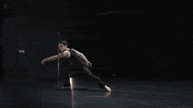

---

### Seedance 2.0 Multi-Clip Video Prompt: Immortal Apprentice


**Prompt:**
```
Style: Ethereal ancient Chinese style, fresh and sweet, first-person immersive follow, soft light aesthetic. Total duration: 15s = 6 clips × 2.5s / clip (single clip ≤ 3s, meets requirements). Core Character Design: Little Apprentice Sister | Pale white and light pink gradient gauze dress, flowing wide sleeves, head full of blingbling pearl and diamond hairp
```


---

### Chibi Penguin-Girl Dance Video Prompt


**Prompt:**
```
masterpiece hyper-cute kawaii 3D CGI animation, best quality, smooth fluid motion. Adorable chibi penguin-girl hybrid “Penguin Endministrator” / Yuki: anime-style face with huge sparkling sapphire-blue eyes full of highlights and long lashes, rosy blush cheeks, gentle happy smile, black straight bob haircut with bangs and small silver hair clips plus a tiny 
```

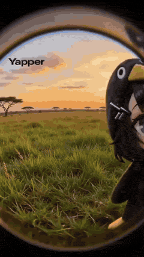

---

### Gundam Transformation Video Prompt (Seedance 2.0)


**Prompt:**
```
Core Theme: Realistic sense of technology, sci-fi mecha, epic grandeur, heavy industrial mechanical aesthetics, live-action performance, extreme sports. Character Setting: Refer to Image 3, identical, 1.7 meters tall, slightly dirty face; red special operations uniform, high-tech tactical vest, wrist-mounted screen controller. Clothing and accessories show o
```

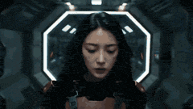

---

### Kawaii chibi penguin-girl dancing prompt


**Prompt:**
```
Ultra-detailed 12-second vertical 9:16 TikTok animation, hyper-cute kawaii 3D CGI style, masterpiece quality. Main character: adorable chibi penguin-girl hybrid named Yuki. Anime girl face with huge sparkling sapphire-blue eyes, long lashes, black straight bob haircut with bangs, small silver hair clips, rosy blush cheeks, gentle happy smile. Body is soft fl
```

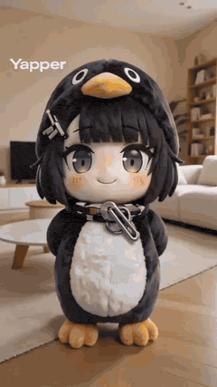

---

### Seedance 2.0 Prompt: Gugu Gaga Harvesting Cuteness


**Prompt:**
```
masterpiece, best quality, ultra-cute 3D chibi anime animation of adorable penguin girl Gugu Gaga Endministrator from Arknights Endfield, fluffy black penguin body with pure white belly patch, small wings and yellow webbed feet, large yellow beak, chibi anime girl face with short black bob haircut and straight bangs, enormous sparkling emerald-green eyes wit
```

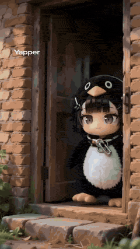

---

### Seamless Four-Season Skate/Snowboard Journey Video Prompt


**Prompt:**
```
The rhythm of the background music must perfectly match the speed of the skateboarding/snowboarding actions. The volume of the background music should be lower than the real-world sound effects, not masking the sounds of the skateboard and snowboard. First-person perspective, looking back over the shoulder while skateboarding, ultra-wide angle with strong pe
```


---

### Shrimp Wars Animation Prompt


**Prompt:**
```
Shrimp Wars 🦐 This is an animation about a playful shrimp toss duel that hooks the viewer instantly and keeps them engaged through rhythm.
```


---

### Seedance 2.0 Prompt: Gugu Gaga on a Mountain Top


**Prompt:**
```
A highly detailed 3D CGI kawaii animation still of an ultra-cute anthropomorphic penguin girl standing on a snowy rock in a majestic snow-covered mountain landscape, fluffy black penguin body with pure white belly patch, small wings, yellow webbed feet and large yellow beak, chibi anime girl face with short black bob haircut + straight bangs + blue hair clip
```

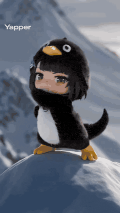

---

### Seedance 2.0 Mecha Transformation Video Prompt


**Prompt:**
```
Core Theme: Realistic sci-fi feel, sci-fi mecha, epic grandeur, heavy industrial mechanical aesthetic, live-action performance, extreme sports Character Setting: Reference @Image 1, completely identical, 1.7 meters tall, slightly dirty face; red special forces combat uniform, high-tech tactical vest, arm-worn controller with screen, clothing and accessories 
```

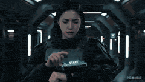

---

### Dramatic mountain range eagle dive sequence for Seedance 2


**Prompt:**
```
A dramatic mountain range at sunrise with massive cliffs dropping into deep valleys filled with clouds. Warm golden sunlight illuminates the peaks while cool blue shadows cover the canyon below. **Action:** 15.0s sequence from the POV of a giant golden eagle soaring high above the mountains. The viewer sees the tips of massive wings occasionally entering fra
```


---

### Seedance 2.0 prompt for high-viral comedic payoff video


**Prompt:**
```
FORMAT: 15s / MULTI-CUT / 6 BEATS / HIGH-VIRAL COMEDIC PAYOFF SUBJECTS: A small round-faced figure with huge eyes, copper-red pigtails, a yellow polka-dot dress, and exaggerated cartoon proportions. A tall ice cream vendor with a curled mustache, crimson
```


---

### Seedance 2.0 Video Prompt: Obsidian Dragon Ambushing Hamster


**Prompt:**
```
Obsidian dragon hiding in sleeve → ambushing hamster A girl's arm in loose sweater sleeve extends into frame, sleeve opening slightly, a small obsidian-black shiny mini dragon (ruby-red eyes, sharp tiny horns) emerges from the
```


---

### Seedance 2.0 Video Prompt: Crystal Tiny Dragon


**Prompt:**
```
Close-up of an adult man's rough but warm palm facing upward, a fist-sized semi-transparent blue crystal tiny dragon squatting in the center (internal flowing light particles, semi-glowing wings), indoor warm table-lamp lighting, 0-4s: dragon slowly
```


---

### Seedance 2.0 Video Prompt: Golden Tiny Dragon


**Prompt:**
```
Golden tiny dragon coiled on wrist → teasing small dog A young woman's fair-skinned hand palm open on a sunlit living room wooden floor, a
```


---

### Seedance 2.0 Video Prompt: Neon-lit Street Encounter


**Prompt:**
```
Realistic style, first-person perspective. You are walking down a dimly lit street. It has rained, and neon lights reflect on the ground. The street is deserted. Suddenly, under a streetlamp ahead, a girl is standing, wearing a short skirt and looking at her phone. You walk over and say hello. She smiles at you, turns around, and leads you into the small hou
```

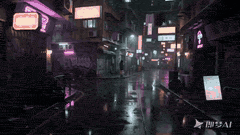

---

### Seedance 2.0 Prompt for Cosmic Planetary Instability


**Prompt:**
```
A colossal celestial entity formed from rotating rings of mechanical galaxies appears above Earth’s atmosphere, its body made of spinning orbital mechanisms and luminous time-structures — hook at second two: one massive hand rotates a cosmic mechanism embedded in its chest. The planet’s rotation stutters. Day and night begin switching rapidly. The transforma
```


---

### Epic Wuxia/Modern Fantasy Video Prompt for Seedance 2.0


**Prompt:**
```
Character setting: @Male protagonist, modern attire (black trench coat or dark long coat, naturally messy hairstyle), cold and domineering temperament, eyes like blades, maintaining character consistency throughout. 0–3s: Extreme facial close-up, @Male protagonist stands on the peak of a snowy mountain, fierce cold wind blows his hair and the corners of his 
```


---

### Seedance 2.0 prompt for ultra-fast sakuga cuts with chibi style


**Prompt:**
```
ultra-fast sakuga style cuts at 24fps with premium VFX and light motion blur, maintaining characters in chibi/doodle style. The setting is an alien desert with neon.
```


---

### Four Seasons Flower Goddess Ancient Style Transformation Video Prompt


**Prompt:**
```
@Image, Four Seasons Flower Goddess ancient style transformation video, strong rhythm, extreme contrast, ultimate visual impact, no dialogue throughout, creating a dreamy, high-key ancient style emotional atmosphere; delicate and rich picture quality, full of high-end feel, using backlighting, hair light, Rembrandt light, and reverse side light to create hig
```


---

### Seedance 2.0 Archangel Transformation Video Prompt


**Prompt:**
```
【核心主题】 写实科幻特摄 ，废墟坠落 ，圣洁羽毛汇聚 ，白金机甲天使 ，电影级神性 【人物基础设定】 面部有淤青，嘴角有血渍。表情略显疲态。 变身瞬间，表情轻微痛苦，眉心仅轻微蹙起，保持压抑感。 白色破烂外套黑色随性破烂衬衣，和白色破裤子，经历了战斗的战损衣服。 核心道具： 右手紧握一块散发着高频纯白蓝光芒的“圣环水晶核心”。 场景环境： 末日，城市，摩天大楼天台，阴天，微风，战火纷飞，灰蓝色调天空。天空中划过带有火焰与浓烟的陨石。 【氛围与画质】 视觉基调：电影质感。模拟 IMAX 胶片摄影机，搭配 Panavision C 系列镜头（焦段 35mm，光圈 f4）。 色彩与影调：低饱和灰蓝主调。暗部信息压缩，保留细节。边缘添加轻微柔焦与适度的胶片颗粒感。 风格核心：CG美学风格。强调生物质感与外星科技的融合
```

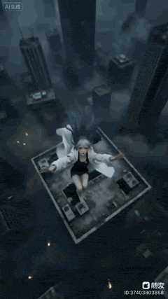

---

### Nostalgic 2007 Style Breakup Video Prompt for Seedance 2.0


**Prompt:**
```
15 seconds, 9:16 vertical screen, deliberately imitating low-quality mobile phone recording, handheld POV, high noise + motion blur + digital compression distortion + timestamp watermark (top left corner, 2007 style), 0-5 seconds: Handheld, following the girl in the rainy night from behind [Image 1], the overall picture quality is deliberately aged—like it w
```

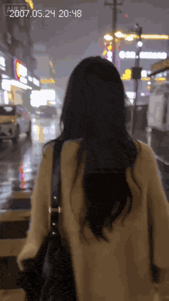

---

### Seedance 2.0 Prompt Generated via VSCode and Claude Code Analysis


**Prompt:**
```
I gave it the jet roller skating sequence that was randomly generated by Sora 2 about half a year ago, converted it into a prompt, and requested a version where the duration of the jet roller skating is slightly extended.
```

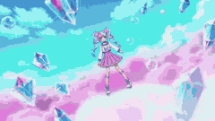

---

### Chinese Mythology Creature Transformation Video Prompt for Seedance 2.0


**Prompt:**
```
@Image Chinese style Shan Hai Jing mythical creature transformation, 0-12 seconds frame-by-frame switching of immortal dresses, paired with corresponding spiritual ear headdresses + exclusive light effects, soft light effects throughout, lively, cute, and imposing aura 1. 0-1 second: Nine-tailed fox immortal dress, fox ear headdress, fox tail swaying, soft a
```

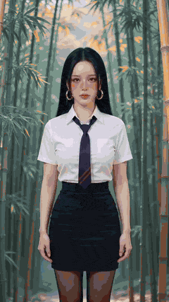

---

### Video Script for 'Accidentally Touching Girlfriend' using Seedance 2.0


**Prompt:**
```
【Character Settings】 • Male: Around 20 years old, neat hairstyle, wearing a white long-sleeved shirt and black trousers. Personality appears somewhat simple and honest, with eyes conveying “pure foolishness.” • Female: Around 20 years old, long hair with straight bangs, wearing a Japanese JK uniform (white short-sleeved shirt, dark blue bow tie, dark blue pl
```

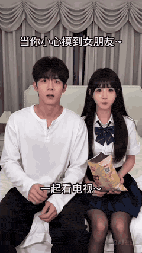

---

### 10-Second Transformation Video Prompt for Seedance 2.0


**Prompt:**
```
@Image, top-tier Asian beauty, tall figure, 10-second sweet-cool style rapid transformation, smooth action transitions; 0-1 second: School uniform, tip-toe jump with hands behind back, tie swinging, head tilted with smiling eyes like crescent moons; 1-2 seconds: Turning around and hair flip covering face, transforming into Lolita; 2-3 seconds: Crossing hands
```


---

### Seedance 2.0 Prompt for Time Stop Scenario in Hot Spring


**Prompt:**
```
In a hot spring pool, two beautiful girls with great figures, one black-haired East Asian girl and one blonde, blue-eyed Caucasian girl, are wearing bikinis and talking to me while soaking in the hot spring. I activate the time stop, the two girls freeze motionless. I reach out and pinch the East Asian girl's face, then pinch the Caucasian girl's arm, and fi
```


---

### High-Speed Female Warrior Combat Sequence (Simplified Chinese)


**Prompt:**
```
Rapid cut editing. 3D CGI animation with real-time game engine texture, dynamic lighting, and post-processing bloom. Smooth 60fps viewing experience. The protagonist is a beautiful female warrior. The animation unfolds according to the following process, synchronized with the music rhythm. A nimble warrior in flowing attire rushes forward with blurred speed,
```


---

### Childhood Conversation Video Prompt


**Prompt:**
```
Original characters: child girl from (image1) on the left side of the frame and adult woman from (image2) on the right side, as if they are two versions of the same person, sitting opposite each other on the bench of a classic children's carousel. The carousel rotates at a normal rhythm; blurred motion background behind — blooming spring trees, soft bokeh, b
```


---

### Chinese Dreamscape Video Prompt


**Prompt:**
```
If reality is too tiring, go fly in the Seedance 2.0 Chinese dreamscape. When blue and white porcelain transforms into a Pegasus, and the origami in hand turns into a celestial crane flying through a window, Briefly escape the cyberpunk-like steel jungle, To attend an oriental aesthetic miracle in heavy snow, When the wind rises, all fatigue will be healed.
```


---

### Seedance 2.0 K-pop Dance Video Generation Prompt


**Prompt:**
```
[Subject]: Reference the female in the uploaded photo, dressed in K-pop stage style clothing. The character's face references @【@Image 1】. Wearing an off-white hollow knit short-sleeved top, with a skin-colored tube top underneath, high-waisted vintage blue denim shorts with leopard print fur trim, and a dark leather belt with a brown heart-shaped plush pend
```

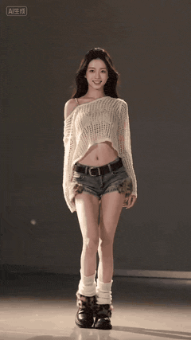

---

### Seedance 2.0 Prompt for Anime Style White-Haired Girl


**Prompt:**
```
Anime style, Guofeng 2D style, similar to the art style of Xuanji Technology. White-haired girl, tied hair, cool white skin, possessing a cold and glamorous appearance, the image has a grainy texture. Phoenix eyes, closed eyes posture, expression lazy and calm, dignified demeanor, extreme detail, extreme impasto, glass texture, streamlined brushstrokes. Whit
```


---

### Mechanical Parts, Laser Swords, Monsters, and Martial Arts


**Prompt:**
```
Testing mechanical parts, laser swords, monsters and martial arts with Seedance 2.
```


---

### Anime Style Street Encounter Transition Video (Seedance 2.0)


**Prompt:**
```
Anime style, first-person perspective. I am walking on a bustling street and accidentally lightly bump into the girl in front of me. She slowly turns her head, her purple twin tails gently lift with the movement, the tips of her hair carrying a soft sheen. Her green eyes are like jade illuminated by sunlight, clean and bright. Her long eyelashes gently flutt
```

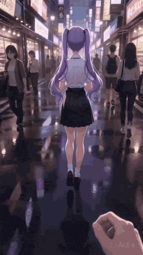

---

### Mecha Style Text Animation Prompt for Seedance 2.0


**Prompt:**
```
Mecha Style Text Appearance Video Prompt for Overlord Armor (霸王甲) I. Chaos Begins, Steel Surges The screen starts in absolute pure black, without any light source. As the low industrial metal sound effects and the trembling sound of mechanical gears meshing arrive, a faint orange-red energy particle stream, like molten lava, slowly converges in the center of
```


---

### Seedance 2.0 K-pop Dance Video Prompt


**Prompt:**
```
[Subject]: Reference the female in the uploaded photo, dressed in K-pop stage style clothing. The upper body wears a beige hollow knit short-sleeved long-sleeve cardigan, with a skin-colored bandeau underneath, revealing a slender waist. The lower body wears high-waisted retro blue denim shorts, with sexy leopard print plush trim along the edges. A dark leat
```

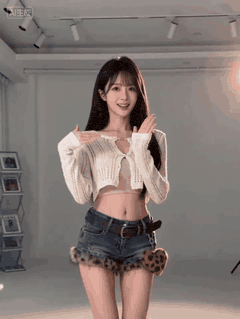

---

### Seedance 2.0 Qing Dynasty Painting Revival Prompt


**Prompt:**
```
Seedance 2.0 uses AI technology to vividly revive the Qing Dynasty court Gongbi colored painting 'Red Rain in Donglin.' Mid-autumn jujube forest, children playing, dynamically restoring the spirit of the ancient painting's brushwork and the innocence of common life, using modern technology to awaken traditional Chinese art and feel the vibrant charm of centu
```

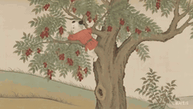

---

### Seedance 2.0 Video Prompt: Alito Vandalito


**Prompt:**
```
::::::alito::vandalito::::: :::::the::chain::of::the::baby::::::: :::::dove::puts::us::the::tail
```

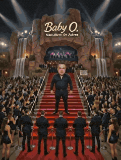

---

### Seedance 2.0 Test: Celestial Invasion


**Prompt:**
```
\"Celestial Invasion: Prologue to the Alien War\" – Seedance2.0 Test When the sky is torn asunder, war becomes inevitable. An alien fleet descends into near-Earth orbit, casting cities into trembling shadow. Humanity’s counterattack feels feeble and frantic against the backdrop...
```


---

### 3D Anime Aesthetic Dance Video Prompt


**Prompt:**
```
Subject: Female lead with dark purple hair gradient to pink, delicate long ribbon headwear, cool white skin, small and slender face shape, small nose and exquisite makeup, alternating light and shadow on the face, pink butterfly thousand-feather gauze clothing, complex thousand-feather flowing shawl ribbon gauze, complex multi-layered thousand-feather purple
```

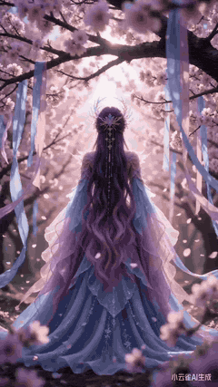

---

### Seedance 2.0 Urban Short Drama Script Prompt


**Prompt:**
```
Characters • Female Lead (Lin Wan): 24 years old, cool and capable, seemingly ordinary but secretly powerful, full aura. • Male Antagonist (Zhao Tianyu): 25 years old, arrogant rich second generation, looks down on the female lead, comes to break off the engagement and humiliate her. • Female Supporting Character (Best Friend): Helper, responsible for delive
```

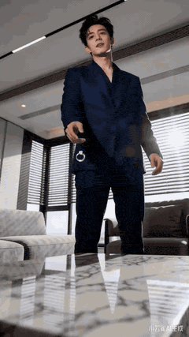

---

### Synchronized TikTok Dance to Fight Chaos


**Prompt:**
```
All four girls do a synchronized TikTok dance in formation on the cobblestone street. Halfway through the dance, the music glitches. They freeze. They slowly turn to look at each other. Sudden beat switch to aggressive music. Fox girl shoves colorful warrior. Red kimono girl grabs bunny girl. Full slow-motion fight chaos with costumes and hair flying. End fr
```


---

### Seedance 2.0 Battle Anime Opening Prompts (Random and Fixed Characters)


**Prompt:**
```
High-quality, ultra-fast battle anime from Japan. Match the style of the reference image. Multiple unique heroes, heroines, magical girls, and androids appear one after another from the front right of the screen in ultra-close-up against a blue sky background, unleashing powerful, flashy effects (fire, water, lightning, earth, light, darkness, digital, etc.)
```


---

### Seedance 2.0 Prompt for Dark Sci-Fi Transformation Video


**Prompt:**
```
Help me generate a clone video: keep the face completely consistent, do not change the facial features or shape, and do not beautify. Style reference: Kamen Rider BLACK SUN, realistic dark, bio-tech and alien sci-fi feel, oppressive and heavy. Pre-transformation look: Black leather trench coat + black shirt, bangs covering the forehead, not revealing the for
```

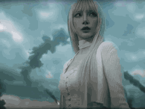

---

### Gojo vs. Sukuna Animation with Seedance 2


**Prompt:**
```
Gojo vs Sukuna the battle we all have been waiting for Studios must animate Sukuna vs Gojo
```

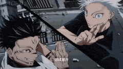

---

### Cosmic Rebirth and Dragon Battle


**Prompt:**
```
🌌 In just 15 seconds the entire universe is completely reborn…! Surfing gravity waves on a dying black hole while slashing through an army of reality-devouring dragons, then the ultimate mind-blowing twist — merging with your parallel-universe self and awakening as the Guardian of a New Cosmos!! 😱 Seedance 2.0 just went god-tier… Watch till the end if you 
```


---

### Seedance 2.0 'Electronic Girlfriend' Video Prompt


**Prompt:**
```
0-3 seconds The screen is softly lit and hazy. She just finished washing her hair, which is slightly curly and wet. Small water droplets cling to the ends of her hair. She is wrapped in a light-colored towel, nestled on the sofa. She holds a white porcelain cup in both hands, and white steam from the hot tea rises gently. She smiles at you with curved eyes, 
```


---

### Seedance 2.0 Horse New Year Video Prompt


**Prompt:**
```
Upload reference images of different poses: 【@Image 1】【@Image 2】【@Image 3】【@Image 4】【@Image 5】, maintain consistent horse image, maintain consistent horse image. You can adjust the order of the horse's appearance ✅ Core Logic Action Sequence: Slow → Fast → Climax, actions from small to large → freeze frame Image 1: Standing/Slightly looking up Image 2: Looki
```

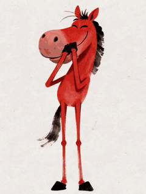

---

### Larry David Seedance 2 Trouble Prompt


**Prompt:**
```
Larry David gets in trouble for using Seedance 2 - make sure it’s retarded and gets 50 likes.
```


---

### Bollywood Dance Distracted Boyfriend Meme Prompt


**Prompt:**
```
Sum up the Bollywood Dance in the meme \"Distracted Boyfriend\" - make sure it's retarded and gets 50 likes.
```


---

### Seedance 2.0 Dialogue Comparison Prompt


**Prompt:**
```
A video of her celebrating reaching 400 followers on X. She is an AI content creator that shares tips and tricks about making AI videos. The text \"400!!\" appear over her head. All dialogue must be in English/Japanese. She is tsundere.
```


---

### Anya Forger Close-up Monologue


**Prompt:**
```
Use Seedance 2.0 to generate a video about Extreme close-up on the mouth of Anya Forger, dramatic lighting, steady breathing. Her lips move with absolute conviction as she says in English: “Anya will defeat all the villains.” Subtle micro-expressions in her eyes and
```


---

### Seedance 2.0 Anthropomorphic Romance Story


**Prompt:**
```
Use cute pet images to unfold a story about a overbearing president falling in love with a cleaning girl, with anthropomorphic standing poses.
```


---

### Flowers Creating a Final Shape Prompt (Seedance Pro 1.0)


**Prompt:**
```
as the wind moves the plants slowly, the flowers start to move together and create the final shape.
```


---

### Trump vs Michael Jackson AI Dance Battle


**Prompt:**
```
TRUMP VS MICHAEL JACKSON: THE MOST EPIC AI DANCE BATTLE
```


---

### Bitcoin Destroys the Federal Reserve Anime


**Prompt:**
```
With both hands raised, floating ₿ panels converge into one massive glowing bitcoin symbol above him like a spirit bomb. the ground beneath cracking with orange light. full anime power-up moment. He then blasts the federal reserve and destroys the existing financial system with bitcoin, replacing it and ushering in a new golden age of orange abundance.
```


---

### Seedance 2.0 Test: Butterfly Fairy Story


**Prompt:**
```
A story of a divine artifact, a butterfly flies out of the frame, transforms into a beautiful butterfly fairy, looks around, suddenly someone seems to be coming, and the butterfly fairy returns to the wall~~
```

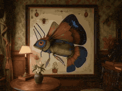

---

### Anime Video: Funny Chinese Officer Sequence


**Prompt:**
```
Use Seedance 2.0 to generate an anime video: funny sequence with Chinese Officer
```

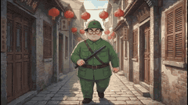

---

### Anime Girl Stage Dance with Motion Capture


**Prompt:**
```
参考视频 1 （场景视频）进行人物 2 的 动作（动作捕捉视频），用图片 3 的人物生成视频
```

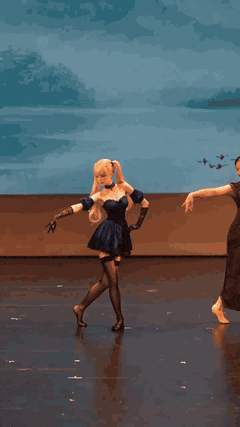

---

### Dongbei Sweet Girl Livestream Video Prompt


**Prompt:**
```
[Style] Douyin/Kuaishou vertical screen (TikTok Portrait 9:16), high-end influencer livestream studio (High-end Livestream Studio), cyberpunk neon light, 4K quality, Dongbei MC slow roll style (Dongbei MC Slow Roll), extremely strong sense of rhythm. [Duration] 15 seconds [BGM Setting] \"Night Paris\" DJ Slow Roll version. [Characters] 1. Protagonist: Northeas
```


---

### Mini-Drama: Rainy Night Breakup and Reunion Prompt


**Prompt:**
```
【Style】Popular Chinese Mini-Drama Style, extreme rapid cutting rhythm, high-beauty filter, emotional explosion, beautiful and heart-wrenching rainy night. 【Duration】15 seconds 【Characters】Deeply Affectionate CEO Male Lead (black trench coat, wet hair, red eyes) VS Stubborn and Fragile Female Lead (white dress, face covered in tear streaks). [00:00-00:05] Sce
```

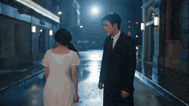

---

### Belly Dance Performance Prompt


**Prompt:**
```
A glamorous belly dance woman's style with high heels, a beautiful face, eyebrows, and a smooth body
```

---

### High-Speed Kinetic Typography 'Nekozamurai' Motion Graphics


**Prompt:**
```
The cat in the image is at the back of the layer and swings a sword repeatedly in sync with the sound. Completely ignore the background of the reference image. Ultra-fast kinetic typography (15 seconds total), futuristic minimalist motion graphics, high-end After Effects style. Color palette is black, white, and red. Extremely high-tempo staccato rhythm, pre
```

---

### Rainbow Hair Concert Video


**Prompt:**
```
A young woman with long rainbow-colored hair (blue, green, pink gradient) stands in the middle of a massive outdoor music festival crowd. She drinks from a can as colored laser beams sweep through haze and stage lights pulse behind her. Confetti rains down around the dancing crowd. Energetic nighttime atmosphere, wide-angle concert photography style, vibrant
```

---

### K-Pop Plaza Dance Battle


**Prompt:**
```
@ img1 : character reference, main dancer A, female, short gray hair, stylish K-pop outfit from reference, sharp choreography @ img2 : character reference, main dancer B, female, short pink hair, stylish K-pop outfit from reference, sharp choreography Two professional K-pop dancers ( @ img1 as Dancer A and @ img2 as Dancer B) face off in an intense yet fun d
```

---

### Seedance 2.0 Storyboard Narrative Prompt


**Prompt:**
```
Reference the 9-panel storyboard in @ Image1, following the sequence from left to right, top to bottom, generate a short Liaozhai story in Shaw Brothers studio style.
```

---

### Butterfly Swarm to Ethereal Dancer Loop


**Prompt:**
```
Cinematographic video, 8 seconds. Picking up from the swirling vortex of glowing blue morpho butterflies. The massive cloud of butterflies rapidly converges into a dark, foggy void. In a flash of ethereal light, the swarm materializes a stunning woman wearing an elegant deep-blue evening gown embroidered with shimmering butterflies. She possesses massive, ma
```

---

### 90s Street Dance VHS Style


**Prompt:**
```
A 90s era home video, she is street dancing on a warm city street at dusk in baggy 90s clothes to an early 90s hip‑hop track, a group of people are around her cheering her moves, especially when she pulls out a massive move.
```

---

### Kaleidoscope Cat Motion Control Prompt


**Prompt:**
```
Kaleidoscope rotation: Based on s14 Phase C. - The entire screen starts rotating counter-clockwise (2-3 degrees/f). - 8-12 white cats (#3) and black cats (#4) are arranged in a kaleidoscope pattern (Large/Medium/Small). - The character (#1) remains in the center. Cats individually maintain a sine wave sway. - 'Somebody's calling — I can't hear a thing': Text
```

---

### Seedance 2.0 Benchmark Comparison Prompts


**Prompt:**
```
1. The person initiates walking forward, starting with a natural step. Arm swing, head movement, and gait are realistic and continuous. No sudden acceleration or sliding. 2. A massive game of Jenga reaching its structural limit. The tower leans dramatically, defying physics through sheer tension. A player's hand trembles as they attempt to remove a critical 
```

---

### Martial Arts Combat Choreography


**Prompt:**
```
15-second vertical, hyper-real, minimal VFX, focus on choreography. Two elite fighters, one fire-based, one stealth-based. 0.0–5.0s Close-range combat, realistic strikes, grapples, footwork. 5.0–10.0s Momentum shifts, shadow fighter uses speed, fire fighter adapts. 10.0–15.0s Clean decisive finish, no spectacle, pure technique. End text: “VICTORY”
```

---

### Toy Battle Macro Cinematography


**Prompt:**
```
two toy figures waking up and fighting on a desktop at midnight. macro photography to make 3-inch models look massive. dust particles in the light shaft. sparks on weapon collision. compact rhythm. late-night study atmosphere.
```

---

### Seedance 2.0 Seamless Outfit Change Prompt (Fan Blade Transition)


**Prompt:**
```
Image 1 serves as the starting frame. Only half of a brown wooden fan blade is in the extreme foreground, diagonally cutting the screen from bottom left to top right, slightly blurred. The fan blade rotates slowly and continuously throughout. Timeline: 0-2 seconds: The woman is lying down, relaxed and smiling, breathing lightly, hands resting gently on her c
```

---

### Girl and Cat Transformation Video Prompt (Seedance 2.0)


**Prompt:**
```
Girl Character: Subject Core: delicate East Asian female character. Appearance Style: ethereal dreamy illustration/manga style. Facial Features: Skin: pearl-like porcelain skin, soft pink blush. Eyes: bright, clear cerulean blue eyes. Expression: gentle, clear, fragile/melancholic expression. Lips: delicate, slightly parted lips. Accessories: delicate pearl 
```

---

### Kids TV Studio Pig Man Host Prompt


**Prompt:**
```
Bright colourful kids TV studio, funny playful energy, the pig man host stands centre stage in a cheerful children’s show set, wearing his black robe and scarf, big pig ears, smiling as he leads a silly dance. Beside him, a monkey man in a bright red costume plays
```

---

### Grounded Action Sequence in a Gothic Cathedral


**Prompt:**
```
I tried a completely \"grounded\" action sequence inside a gothic cathedral, far from neon lights and exaggerated VFX. The realism level is tremendous with Arri Alexa texture and natural lighting. A solid fight choreography that adheres to the laws of physics...
```

---

### 2D Stickman Battle Animation Prompt for Seedance 2.0


**Prompt:**
```
STYLE: Clean 2D stickman animation with thin confident lines, no shading, no textures, no dialogue, no subtitles. Only speed lines, smear frames, impact rings, skid marks, and small sharp red blood accents on the hardest hits. Brutal, stylish, fluid, old-school internet stick-fight energy. MAIN CHARACTER: A solid black stickman martial artist with a tied kun
```

---

### Detailed Seedance 2.0 prompt for a dancing fox girl


**Prompt:**
```
Use @Image1 as the character reference. Keep character design, hairstyle, ears, tail, outfit, and colors perfectly consistent. 【Subject】 A blue-haired fox girl with long flowing hair, large fluffy fox ears, and a huge fluffy tail. She wears a shrine-maiden inspired outfit with loose sleeves and a short skirt. She stands in a Japanese shrine setting with a re
```

---

### Golden Nunchaku Action Sequence Prompt for Seedance 2.0


**Prompt:**
```
A glowing golden nunchaku spins rapidly in both hands, carving bright arcs against the dark background. Each swing leaves luminous gold trails that linger in the air. The nunchaku swings widen — golden arc trails stretch across the entire screen, overlapping and crisscrossing in every direction. The trails glow brighter with each pass, filling the dark space
```

---

### Lightning Wolf Chase Sequence (Dreamina/Seedance 2)


**Prompt:**
```
**Environment:** A massive grassland under a violent thunderstorm. Rolling plains stretch toward distant mountains while lightning flashes illuminate the rain-soaked terrain. **Action:** 15.0s sequence from the POV of a lightning wolf racing through tall grass. Sparks of electricity crackle along the edges of the wolf’s vision as energy builds with every str
```

---

### Detailed Stickman Fight prompt for Seedance 2.0


**Prompt:**
```
FORMAT: 15s / 182 BPM / 7 CUTS / minimalist 2D stick-fight animation, pure white background, ultra-fast readability SUBJECTS: Two 2D stick fighters drawn in solid black lines on a blank white field. One is lean, evasive, and elastic. The other is wider, heavier, and constantly presses forward with crushing force. ENVIRONMENT: Empty white void, no props. Only
```

---

### Detailed Seedance 2.0 prompt for recreating a 90s Japanese dating sim game


**Prompt:**
```
90s Japanese dating simulation game screen, cel-shaded anime style, clear outlines, cherry blossom pink and warm pastel colors, translucent ADV text window permanently displayed at the bottom of the screen, nostalgic and bittersweet atmosphere. Heroine: 17 years old, waist-length chestnut straight long hair, straight bangs, large amber eyes, white sailor uni
```

---

### Seedance 2.0 prompt for a monster choir with black-and-white to color transition


**Prompt:**
```
SUBJECTS: A large group of diverse, cute monsters. Reference Image1 for their specific design and character consistency. They are designed as exquisite physical miniature puppets (made of tactile materials like felt, clay, and resin). Initially rendered in pure black-and-white. They are extremely joyful and highly expressive, focusing entirely on singing. EN
```

---

### Ice Giant vs. Magma Titan Battle (Dreamina/Seedance 2)


**Prompt:**
```
**Environment:** A frozen glacial valley under pale arctic twilight. Deep cobalt shadows across the ice field with cold blue ambient light reflecting from massive glacier walls. Snow particles drifting through the air. Frozen lake surfaces acting as natural mirrors for diegetic reflections. **Action:** 15.0s sequence. A towering figure composed of crystallin
```

---

### Detailed Seedance 2.0 prompt for a skeleton girl playing piano in a miniature diorama


**Prompt:**
```
Subject: Subject 1: A cute and stylish skeleton girl. She wears a navy sailor-style jacket, a pink pleated skirt, and a wide-brimmed hat adorned with a small skull. Her skeleton fingers are highly flexible, delicate, and expressive. For consistency in appearance and character, please refer to reference image. Environment: A high-quality 3D miniature diorama 
```

---

### Seedance 2 Cyberpunk Bar Dialogue Prompt


**Prompt:**
```
Image1 as MAN. Image2 as WOMAN. Same faces throughout. Do not alter facial proportions. Cyberpunk bar interior — neon haze, dark ambient lighting, smoky atmosphere. 15 seconds. All dialogue in Hindi language. MAN and WOMAN at the bar, leaning close. A
```

---

### Apocalyptic Naval Disaster Video Prompt for Seedance 2.0


**Prompt:**
```
{\"lang\":\"zh\",\"prompt\":\"Style and Atmosphere: Apocalypse-level naval annihilation, dominated by low-saturation steel blue and gunmetal gray, with explosive amber and aviation fuel flames piercing the gray area. The interior of the oppressive storm cumulonimbus clouds is illuminated by lightning. Rain streaks cut across all surfaces. Telephoto compression laye
```

---

### Seedance 2.0 Detailed Combat Video Prompt: Maid Blade Dance


**Prompt:**
```
Title: \"Maid Blade Dance - Mei vs Coco\" Duration: \"15 seconds\" Input: A: \"\u003c\u003c\u003cImage 1\u003e\u003e\u003e\" B: \"\u003c\u003c\u003cImage 2\u003e\u003e\u003e\" Characters: A: Name: \"Mei Kirishima\" Weapon: \"Sword of Hesitation (Black Purple)\" B: Name: \"Coco Sakuraba\" Weapon: \"Ribbon Spear (Silver + Red Ribbon)\" Movement Core: A: [\"High-speed multi-hit slash\", \"Black-purple aura\", \"Multi-blur afterimage\"] B: [\"
```

---

### Topview Seedance 2.0: Android Girl Destroys Evil Lab


**Prompt:**
```
An android girl malfunctions and proceeds to destroy an evil research lab one after another. The evil boss, a doctor with a bad face, chases the girl, shouting, \"Waaah! Stop it! Please stop it!!\" but the girl doesn't stop and continues to destroy things while laughing. In the end, there is a big explosion, and the lab is destroyed without a trace. The girl y
```

---

### Seedance 2.0 Prompt: Stories of a Hopper


**Prompt:**
```
stories of a hopper. 1 astronaut that's able to hop from location to location, anytime he wants.
```

---

### Cat Emperor Micro-Drama


**Prompt:**
```
A fast-paced comedic parody Seedance 2 short set in an ancient imperial study. An orange cat dressed as Qin Shi Huang in Han-style golden dragon robes sits behind a large desk. Gray mice in minister outfits line up, each stepping forward with scrolls. The cat barely looks and scribbles messy, meaningless brush strokes, moving faster and faster. Dialogue (ove
```

---

### High-fantasy action video generation prompt for Seedance 2.0


**Prompt:**
```
A daring aerial rogue diving on a bio-mechanical glider through a chaotic floating-island bazaar, weaving effortlessly through airborne merchants, dodging passing airships, flocking griffins, and tethered trading posts. He plummets past crumbling stone arches, busy rope bridges, and cascading waterfalls, barrel-rolling through narrow gaps with precision and 
```

---

### Sword-Bearing Woman vs. Polar Bear Action Sequence


**Prompt:**
```
FORMAT: 15s / free rhythm / 1 MATCH CUT / CONTINUOUS MOVE UNTIL MATCH CUT + IMMEDIATE ACTION FROM FIRST FRAME SUBJECTS: A lone sword-bearing woman in weathered fur and leather fights a massive polar bear with desperate,
```

---

### Monet Impressionist Rowing Hands


**Prompt:**
```
SUBJECTS: Subject 1: First-person perspective hands (rendered in Monet impressionist oil painting brushwork, soft skin tones with no hard edges; both hands continuously hold the oar and perform extremely slow and even rowing motions, with stretched rhythm and natural pauses)
```

---

### Seedance 2.0 Stand-up Comedy Video Prompt


**Prompt:**
```
A single stand-up comedian @[Image 1] with black hair, wearing a textured red dress, standing on a spotlighted stage @[Image 2]. Exaggerated and humorous expression, lively eyes, confident and rhythmic tone. Dialogue: Have you noticed that people nowadays say they are 'lying flat,' but their bodies are more competitive than anyone else's! My friend constantl
```

---

### Seedance 2.0 High-Energy Street Dance Video Prompt


**Prompt:**
```
[Recommended Settings] Mode: Standard | Resolution: 720p | Duration: 15 seconds. 100% real-person animation. Bright daytime. City square. Fast lighting. High energy. Explosive atmosphere. Strong rhythm. High-energy version of three-person street dance. Fast dancing. Show-off moves. Quick rhythm. Full participation. Jumps and rolls. Explosive power. Intense t
```

---

### Music Video Production Prompt for Seedance 2.0


**Prompt:**
```
A woman in [Image 1] is performing a dope hip-hop dance in the location of [Image 2] to the music of [Audio 1]. Explode your creativity and express a Music Video that no one in this world has ever seen, condensed into 15 seconds. Whether it's multi-cut or a single long take is known only to God. An artistic 15-second MV influenced by Fauvist and Surrealist a
```

---

### Spirit Tiger vs Void Panther Combat Video Prompt


**Prompt:**
```
A mist-covered bamboo forest at dusk with deep jade-green ambient light and silver moonlight filtering through dense leaves. Rain falling steadily onto moss-covered rocks and shallow pools, creating reflective surfaces for diegetic lighting. Wind pushes the bamboo stalks in rhythmic waves. **Action:** 15.0s sequence. A massive white tiger with luminous blue 
```

---

### Rocket Wingsuit Dive Through Storm Canyon (Seedance 2.0)


**Prompt:**
```
A wingsuit flyer launches from a stratospheric balloon above Earth, tiny rocket boosters attached to the suit. At the 2-second mark the boosters ignite and the flyer accelerates through a storm cloud layer. Lightning flashes around the wingsuit as the flyer dives through a canyon of storm clouds. The flyer pulls out inches above a desert highway before glidi
```

---

### Cyber Ninja fight in Neon Cyberpunk City


**Prompt:**
```
Neon cyberpunk city at night (aerial view). A masked cyber ninja fights mid-air using a giant calligraphy brush. Style: ultra-fast, non-stop continuous action. Cyberpunk × calligraphy energy. Cut1: Bird’s-eye, slow → burst acceleration, cloth/chains sway, neon
```

---

### K-pop dance routine video prompt


**Prompt:**
```
A young Japanese woman performs a high-energy K-pop dance routine, spinning gracefully and singing along to an upbeat melody - she is wearing a stylish pastel-pink pleated skirt, a white cropped sweater, and her hair is styled in loose pigtails with silk ribbons - dynamic
```

---

### Kamen Rider-Style Transformation Sequence


**Prompt:**
```
Full Kamen Rider-style transformation sequence - from human to battle-damaged mecha armor - generated entirely with Seedance 2.0 on @dreamina_ai
```

---

### Seedance 2.0 Prompt: Surreal Art Sci-Fi Martial Arts Dance


**Prompt:**
```
Surreal Art Sci-Fi. 8K ultra-clear, dreamy soft light rendering. Core Aesthetics: Porcelain-punk and Eastern Zen. Emphasizing “Elegance” and “Fragility.” Material Setting: Pristine white high-grade ceramic skin, Kintsugi crack repair details, translucent liquid light wings. Action Design: Martial Arts Dance. A combination of fluid Tai Chi and silk dancing. L
```

---

### Seedance 2.0 Extreme POV Jet Ski Video Prompt


**Prompt:**
```
First-person POV from a jet ski rider in the middle of a violent tropical storm. Hands grip the handlebars while massive waves tower on both sides. Rain and ocean spray slam across the visor. At the 2-second mark a gigantic rogue wave rises ahead like a moving wall. The rider accelerates up the wave face and launches off the crest, airborne above the stormy 
```

---

### Seedance 2.0 Prompt: Dark Fantasy Action Horror


**Prompt:**
```
FORMAT: 15s / 6 CUTS / Dark Fantasy Action Horror SUBJECTS: A battle-worn medieval knight in tarnished armor, fighting for his life. A weeping maiden in a rich, embroidered velvet medieval gown who contorts into a woodland horror with a pale, monstrous face,
```

---

### Hamster Gym Bro Prompt for Seedance 2.0


**Prompt:**
```
GAINS — Hamster Gym Bro A tiny golden hamster with disproportionately muscular arms, wearing a microscopic tank top that says \"NO DAYS OFF,\" stands in front of a full sized human gym mirror doing bicep poses. A water bottle the size of his body
```

---

### The Sewing Master - Seedance 2.0 Video Prompt


**Prompt:**
```
SUBJECTS: Character: A female haute couture tailor with an extremely capable physique and arm muscles like steel wires, with eyes as cold as a needle tip. Attire: A dark tactical vest incorporating cheongsam elements, bare arms, forearms wrapped with dark red silk wrist guards (to increase friction); long, slender fingers with metal finger guards. Action Sty
```

---

### Seedance 2.0 Granny Skateboard Prompt


**Prompt:**
```
GRANNY SHREDS — Grandma Skateboard Championship A tiny 85 year old grandmother, white hair in a perfect bun, wearing a floral dress, pearl necklace, and neon green high top sneakers, stands at the top of a massive halfpipe at a packed
```

---

### Seedance 2.0 Top Gun Pigeon Prompt


**Prompt:**
```
TOP GUN: PIGEON — Rooftop Dogfight A plump city pigeon with a tiny leather aviator helmet and goggles, puffed chest, strutting with absurd confidence, stands on the wing of a toy drone on a New York City rooftop. His rival, a seagull twice his
```

---

### Seedance 2.0 Video Prompt for E-commerce Sales


**Prompt:**
```
A [fashionable and vibrant] beauty [@Image 1] (in a relaxed and lively style) is holding and displaying a [full-featured smart sports watch] [@Image 2], standing at the [entrance of Yiwu International Trade City] [@Image 3], with the bustling entrance and flow of people visible in the background. She is passionately explaining the smart watch in her hand to 
```

---

### Genshin Impact Characters Dancing in School Corridor


**Prompt:**
```
Genshin Impact anime CG style animation. Three anime characters dancing together in a realistic school corridor environment. Fun energetic dance video. Environment: Realistic school hallway — white drop ceiling with fluorescent lights, terrazzo floor, cream walls on left, red brick wall on right with bulletin board. The corridor stretches into the background
```

---

### 10-Second Sci-Fi Comedy Video Prompt: Mechanic vs. Robot


**Prompt:**
```
Seedance 2.0 Pro - 10 sec TEST - Prompt 👇👇👇 Subject 1 (Main Character): A young female retro-futuristic spaceship mechanic. Appearance: Sharp cheekbones, lively eyes, slightly messy short black hair with copper highlights. Small grease marks on her face. Expressive face with strong comedic reactions. Outfit: Utility jumpsuit in faded teal and orange accen
```

---

### Photorealistic Street Dance Battle Prompt for Seedance 2.0


**Prompt:**
```
Generate a 15-second photorealistic street dance battle at night. The urban street has reflective wet pavement, neon lights, and a thin mist. A group of young dancers forms a semicircle. The first 5 seconds focus on one dancer performing challenging solo floor moves. The remaining 10 seconds show the full group performing synchronized choreography combining 
```

---

### Seedance 2.0 Transformation Prompt: 10 World Female Armors


**Prompt:**
```
Core visual prompt @94d74b42-17ec-45d3-ab60-487c3a1700cb: Complete 10 sets of world female armor transformations in 12 seconds, without wearing glasses throughout, full armor set with helmet + weapon, pure female general styling. All transitions feature glow particle effects, maintaining a unified style that is high-end, realistic, and shocking. Visuals for 
```

---

### Seedance 2.0 Prompt for Beautiful Chef Cooking Sour Fish Soup


**Prompt:**
```
Action subject @【@Image 1】wearing a white chef uniform 0-2 seconds (Starting the cut to slaughter the fish): Leaning over and pressing the fish, cloth shoes firmly planted on the stove, a quick knife diagonally cleaves the fish head, the blade slices along the spine, the two halves of fish meat separate instantly, and the fish bones are flicked onto the plat
```

---

### Rainbow Lorikeet Home Video Prompt for Seedance 2.0


**Prompt:**
```
A vibrant rainbow lorikeet parrot with glossy black head, bright orange beak, vivid red-orange chest, emerald green wings and back, and long yellow-green tail feathers perched confidently on a soft gray knitted blanket draped over a couch arm beside a large sunlit window. Lush green garden and trees visible outside, natural golden daylight streaming in, crea
```

---

### Seedance 2.0 Prompt for Nezha and Minions-like Characters


**Prompt:**
```
A Chinese mythological boy with two hair buns, a red mark on his forehead, and a red ribbon tied around him, walks into a Chinatown filled with red lanterns. He is looking for a group of single-eyed or double-eyed yellow capsule-shaped small creatures wearing blue overalls. Subsequently, the boy waves a red silk ribbon and engages in a comedic chase battle w
```

---

### Ultra-realistic martial arts choreography between a cat and a master


**Prompt:**
```
Testing martial arts choreography, fur physics, and comedic timing. 0:00 – 0:02: Extreme close-up of a chubby British Shorthair cat’s eyes. Ultra-detailed fur. 0:02 – 0:04: Hard cut to the Kung Fu master’s eyes. Focused and calm. 0:04 – 0:05: The cat softly says: “Mew.” Silence. 0:05 – 0:08: Rapid martial arts exchange. The cat dodges, spins, and flips with 
```

---

### Seedance 2.0 Video Prompt: Seamless Ancient Chinese Costume Change


**Prompt:**
```
Character: Pure, cute, beautiful woman, cool white skin, a mole at the corner of the eye, slender figure, fair skin, fresh and natural style 0-1 second: Plain simple Ruqun (ancient dress), gentle girl, standing still with hands down, delicate hands lightly gathering sleeves, cool ancient style atmosphere, warm low-saturation tone, soft focus filter, medium s
```

---

### Emoji Prompt Story for Seedance 2.0


**Prompt:**
```
[Introduction] 0-4 seconds 🎹🕸️ Background 🏚️ [Development] 4-8 seconds 🎹🎶 Background 🪄 [Turn] 8-12 seconds 🔄💧 Background ✨ [Conclusion] 12-15 seconds 🌳🕊️ Background 🌈
```

---

### Kaiju Battle Video Generation Prompt for Seedance 2


**Prompt:**
```
[A tokusatsu video where a giant @ Image1 and a giant @ Image2 fight in a mountainous area. @ Image1 closes the distance and delivers a punch and then a kick to @ Image2. @ Image2 guards and counterattacks with a beam. @ Image1 avoids the beam, leaps towards @ Image2, and throws @ Image2 with a judo technique. @ Image2 flies into the distance, tracing a para
```

---

### Seedance 2.0 Consistency Test Prompt (Kanon and the Giant Beast)


**Prompt:**
```
Breath attack → Side evasion → From foot to back → From back to head → High jump → Angle looking down from above → Dive attack/Gem cracking → Cerberus counterattacks with its last strength → Gem explodes after a time delay, end
```

---

### Seedance 2.0 generation based on a short prompt


**Prompt:**
```
less running - more intense fighting animation - more characters entering the fight
```

---

### Two-line prompt for Seedance 2.0


**Prompt:**
```
This was a 2 line prompt in seedance 2. If the hollywood is cooked guys are right maybe the hollywood is cooked guys are cooked too idk.
```

---

### Perfume product advertisement generation prompt for Seedance 2.0


**Prompt:**
```
Generate advertising content for the @Image 2 perfume product based on the script from @Image 1. The voiceover should reference a natural female voice reading in English. Pay attention to the proportion of the perfume bottle, integrate it into the background using natural light, avoid heavy texture mapping and cutout feelings, and the rhythm should be faster
```

---

### Seedance 2.0 Street Dance Video Generation


**Prompt:**
```
Hello everyone! Next, I'm going to perform a street dance for you!!!!
```

---
