# 🌿 Nature & Landscape Prompts

Nature, landscape and environment prompts.

**Total: 60 prompts** | **36 with preview GIF**

[← Back to README](../README.md)

---

### Sky Kingdom Wuxia Fantasy

**Prompt:**
```
A beautiful young woman character exactly matching @img1[character consistency] wearing elegant flowing pastel pink wuxia hanfu robes with long wide sleeves, delicate silver embroidery, soft ribbons and fabric that billow gracefully in the wind, performing ethereal qinggong lightness skill. She is lightly floating and elegantly leaping between ornate pavilio
```

> 🔗 [Original Source](https://x.com/yuday9909)

---

### Rainbow Hair Concert Video

**Prompt:**
```
A young woman with long rainbow-colored hair (blue, green, pink gradient) stands in the middle of a massive outdoor music festival crowd. She drinks from a can as colored laser beams sweep through haze and stage lights pulse behind her. Confetti rains down around the dancing crowd. Energetic nighttime atmosphere, wide-angle concert photography style, vibrant
```

> 🔗 [Original Source](https://x.com/Itswsm105f)

---

### Ocean Trench to Surface Transition

**Prompt:**
```
A single continuous impossible camera shot begins deep underwater in a vast ocean trench — bioluminescent creatures drift past in the darkness. The camera accelerates upward at speed, bursting through the ocean surface in a wall of spray and light, then continues rising
```

> 🔗 [Original Source](https://x.com/HBCoop_)

---

### Underwater Coral Mech Chase

**Prompt:**
```
A young pearl diver kid with glowing coral armor, fluid hair drifting in water, and a shell-powered jet pack rockets into frame in the first two seconds, spiraling through a reef tunnel as a massive coral mech leviathan crashes through the ocean floor behind him, instantly creating the hook. The chase unfolds through a breathtaking underwater kingdom— swimmi
```

> 🔗 [Original Source](https://x.com/Ankit_patel211)

---

### Midnight Fog Steam Train in Highlands

**Prompt:**
```
A vintage steam train from the 1920s moves through a dense Scottish Highland fog at midnight, its headlamp cutting a yellow cone through the grey. The camera begins in a wide exterior shot tracking alongside the train as it
```

> 🔗 [Original Source](https://x.com/SaniBulaAI)

---

### Rainy Night Romantic Tension Scene

**Prompt:**
```
Style: Cinematic, romantic tension, realistic handheld Setting: Night, Italian city (Rome/Milan), heavy rain, warm streetlights reflecting on wet pavement Mood: Intimate + emotionally charged 0–2s Handheld close-up, slightly unstable camera.Heavy rain pouring onto the pavement.A man and a woman stand under one umbrella, very close. Water drips from the edges
```

> 🔗 [Original Source](https://x.com/craftian_keskin)

---

### Boxing Training Montage

**Prompt:**
```
Create a boxing training montage young boxer working with an old coach, hitting pads, jumping rope, heavy bag. Gritty gym lighting, sweat flying in slow motion. Give me that Rocky energy.
```

> 🔗 [Original Source](https://x.com/harboriis)

---

### Abandoned Train Station Rebuilding Prompt

**Prompt:**
```
Static wide shot of a crumbling abandoned train station at dusk. Dust hangs in the air, broken windows, overgrown vines. A single flickering light appears on the rusted tracks. Suddenly the station begins rebuilding itself
```

> 🔗 [Original Source](https://x.com/rezkhere)

---

### Rural Scene: Woman Walking in Rain

**Prompt:**
```
A blonde woman in a plaid shirt and green rubber boots walks down a muddy rural village road in the pouring rain, carrying two metal buckets towards a barn filled with cows.
```

> 🔗 [Original Source](https://x.com/aisocity)

---

### Melancholic Mountain Woman Video Prompt

**Prompt:**
```
A cinematic 15-second video of a beautiful young East Asian woman with long flowing silver hair, standing alone on a fog-covered mountain peak at dawn. She wears a dark minimalist coat, looking into the distance with a calm, melancholic expression. [00:00-03:00s] —
```

> 🔗 [Original Source](https://x.com/AyccAI)

---

### Catastrophic Ocean Event Prompt

**Prompt:**
```
Hyperrealistic catastrophic ocean event, extreme scale, violent water physics, ground-level survival perspective, continuous sprint motion, debris, wind force, pressure impact, high-speed destruction, no pauses, hard cuts only, no fade, no dissolve, no morph transition Shot 1: Camera running at full speed along a beach, people already screaming, wind buildin
```

> 🔗 [Original Source](https://x.com/AllaAisling)

---

### Nature Reclaiming Megacity Prompt

**Prompt:**
```
A woman in her mid-30s with dark braided hair entwined with living vines, wearing layered organic armor of bark and woven leaves, skin traced with glowing emerald root veins — opening frame is a medium close-up of her standing barefoot in the center of an abandoned concrete megacity plaza, completely still as small plants begin sprouting through cracks in th
```

> 🔗 [Original Source](https://x.com/LudovicCreator)

---

### Lone Traveler on a Glass Ocean under Twilight

**Prompt:**
```
A lone traveler walks across a vast, glass-like ocean under a violet twilight sky. Beneath the transparent water, millions of stars twinkle and pulse as if the entire universe is submerged. Each step ripples through the cosmic depths, distorting galaxies and nebulae like liquid reflections of infinity.
```

> 🔗 [Original Source](https://x.com/umesh_ai)

---

### Cyberpunk City Rainy Night Video Prompt

**Prompt:**
```
Vertical screen 9:16, cyberpunk future city rainy night, high-density skyscrapers, cyan-blue neon main tone, small amount of magenta highlights, wet streets with obvious mirror reflection, car light reflections and water reflections on the ground, thin fog and volumetric light in the air, rich details of futuristic architecture, overall atmosphere is cold, l
```

> 🔗 [Original Source](https://x.com/AyccAI)

---

### Snowboarder Avalanche Escape Prompt

**Prompt:**
```
A snowboarder in a neon blue suit races down a steep alpine ridge as a massive avalanche begins collapsing behind him. At the 2-second mark he hits a natural snow ramp and launches across a deep crevasse. Camera follows close behind as the avalanche wave explodes through the mountain slope. He lands on a narrow ice ridge and continues descending through flyi
```

> 🔗 [Original Source](https://x.com/LudovicCreator)

---

### Ray Traced Rain Scene with Character and Dragon Emergence

**Prompt:**
```
Ray tracing, Unreal Engine render, small town in heavy rain. @image1 character with identical hairstyle, outfit, realistic skin, dim lighting, IMAX cinematic, 35mm lens, 4:3 ratio, grey-blue low saturation, film grain, soft god-rays, cold expression, smooth motion, glowing sword trail. 1–3s: Camera tilts up from feet to full body; rain splashes burst under s
```

> 🔗 [Original Source](https://x.com/Gwsubsa)

---

### Tokyo Skyline Rollercoaster POV

**Prompt:**
```
{ \"location\": \"Tokyo Cityscape (Night)\", \"duration\": \"10s\", \"prompt\": \"A cinematic POV shot riding an invisible rollercoaster through Tokyo at night. A glowing neon rail 'creates itself' milliseconds before the camera hits it, weaving through the steel structures of Tokyo Tower and nearby buildings. As the camera passes, each building it touches instantly tr
```

> 🔗 [Original Source](https://x.com/TechTalkNAVI)

---

### Rainy Underground Alley Horror Prompt

**Prompt:**
```
Rainy Underground Alley Merge 15-second surreal horror in a narrow rainy underground service alley, neon signs reflecting on puddles, steam rising from grates. [0-1.5s] Shot 1: Wide tracking shot, young woman in black leather jacket walks cautiously through rain, breath visible,
```

> 🔗 [Original Source](https://x.com/Dheepanratnam)

---

### Volcanic Sky Realm Duel Prompt

**Prompt:**
```
A surreal volcanic sky realm where islands of black rock float above rivers of molten lava flowing through the air like suspended waterfalls. The sky burns with deep crimson clouds illuminated by lightning storms. **Action:** 15.0s sequence. A blazing phoenix composed of flowing flame and glowing embers spirals upward through the volcanic sky. Opposing it is
```

> 🔗 [Original Source](https://x.com/LudovicCreator)

---

### Impossible Camera Moves in Amazon Rainforest

**Prompt:**
```
Continuous single take, camera tilting, rolling, spinning, flying through a dense Amazonian rainforest ecosystem. Starts flying through the misty canopy dodging hanging vines and a sleeping sloth, camera dives downward into the hollow trunk of a massive ancient tree, gliding past bioluminescent fungi and a colony of bats. Sweeps out onto the humid forest flo
```

> 🔗 [Original Source](https://x.com/ChangningL29508)

---

### AI Wedding Video Prompt: Minimalist Forest Style with Light Effects

**Prompt:**
```
Theme 2: Minimalist Forest Style - The Wizard of Oz in the Green Wilderness, Love Bathed in Light. Visual Core: Utilize the Tyndall effect (God rays) and the texture of dappled light and shadow to create an ethereal, fresh, and vibrant fairy-like feeling. Live-action realistic style, fresh and spiritual, 4K high definition. 0-4 seconds: Drone perspective fly
```

> 🔗 [Original Source](https://x.com/Cosmoslucy13)

---

### Wuxia Comedy: Cat Hero, Duck Scholar, and Husky Doctor

**Prompt:**
```
Film Scene Setting (Global Style) Environment: A traditional Chinese courtyard late at night, with blue tiles and white walls, red lanterns swaying slightly in the wind. Moonlight and tree shadows intersect on the ground. The overall lighting has a strong retro Wuxia film texture. Character Design: Orange Cat (Hero): Wearing traditional Wuxia attire, cape sl
```

> 🔗 [Original Source](https://x.com/drjoetw)

---

### Photorealistic Cyberpunk Motorcycle-Robot Chase in Heavy Rain

**Prompt:**
```
Photorealistic cinematic 3D CGI scene, heavy rain and snow pouring down with white streaks, water splashing on wet dark road, same beautiful young woman with long dark hair flowing wildly, black face mask, red leather jacket and pants, riding the front bike section of the fully transformed massive black motorcycle-robot hybrid, the giant black humanoid comba
```

> 🔗 [Original Source](https://x.com/Riya333S)

---

### Dubai Skybridge Motorbike Stunt Video Prompt

**Prompt:**
```
A man in his early 30s, olive skin, short cropped hair, wearing a matte graphite riding suit with gold reflective piping and reinforced armored boots, accelerates a high-performance sport motorbike across a narrow glass skybridge connecting two skyscrapers in downtown Dubai at night — the city glowing gold beneath with traffic streams forming rivers of light
```

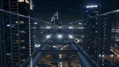

> 🔗 [Original Source](https://x.com/LudovicCreator)

---

### Seamless Four-Season Skate/Snowboard Journey Video Prompt

**Prompt:**
```
The rhythm of the background music must perfectly match the speed of the skateboarding/snowboarding actions. The volume of the background music should be lower than the real-world sound effects, not masking the sounds of the skateboard and snowboard. First-person perspective, looking back over the shoulder while skateboarding, ultra-wide angle with strong pe
```

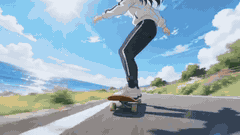

> 🔗 [Original Source](https://x.com/Adam38363368936)

---

### Furious Giant Dragon Emerging from Ocean

**Prompt:**
```
From the ocean emerges a furious giant (element) red dragon, leaping and flying above the ship at great speed, splashing through the great ocean waves. Dynamic shot following the dragon as it moves away through the storm, splashing through the giant waves
```

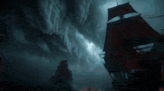

> 🔗 [Original Source](https://x.com/hedo_ist)

---

### Leopard Prowling Through a Surreal Forest in Henri Rousseau Style

**Prompt:**
```
\"Side shot of a leopard moving gracefully through a surreal forest, the camera tracking alongside it as it prowls between tall, blue-hued trees. The background glows with deep amber light, evoking an otherworldly dusk. [cut] Close-up side shot
```


> 🔗 [Original Source](https://x.com/Framer_X)

---

### Women Placing Glowing Lanterns on Water in Hieronymus Bosch Style

**Prompt:**
```
\"Women in white robes kneel by a dark river, gently placing glowing lanterns onto the still water. [cut] Close-up shot of woman placing a lantern onto the water. [cut] The water begins to burn - golden fire spreading outward like liquid light
```


> 🔗 [Original Source](https://x.com/Framer_X)

---

### Colossal Ocean Leviathan Attack on a Megacity Harbor

**Prompt:**
```
A colossal ocean leviathan, 300 meters long with armored whale-like plating and luminous bioluminescent currents flowing through translucent fins, rises from the deep ocean just offshore of a megacity harbor — hook at second two: the creature breaches vertically through the water, displacing millions of tons of ocean in a single eruption. The harbor instantl
```


> 🔗 [Original Source](https://x.com/LudovicCreator)

---

### The Desert Train Heist

**Prompt:**
```
A biker wearing desert goggles and a sand-colored jacket races a dirt bike alongside a speeding freight train in a vast Sahara landscape. At the 2-second mark he hits a dune ramp and launches toward the train roof. The bike lands across the top of a container car while sandstorms swirl around the convoy. Camera tracks low along the train as the rider speeds
```

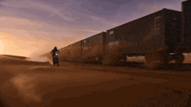

> 🔗 [Original Source](https://x.com/LudovicCreator)

---

### Impossible Golf Shot Tracking in a Rainstorm

**Prompt:**
```
A dramatic sports sequence begins on a lush, windswept coastal cliff during a violent rainstorm. A golfer in bright yellow rain gear stands on the tee box, gripping a driver. His stance is planted firmly, eyes locked on a distant green across a churning ocean cove. As he swings, the clubhead connects with a resounding crack, launching the dimpled white ball
```


> 🔗 [Original Source](https://x.com/noman23761)

---

### Motorcycle Rider Defying Collapsing Skyscraper

**Prompt:**
```
Defying a collapsing skyscraper, a lone rider rockets across shattered skybridges as concrete rains down and the city falls apart behind him. 🏍️🏙️💥
```

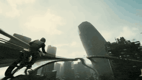

> 🔗 [Original Source](https://x.com/vadooai)

---

### Nordic Snowy Night Chase

**Prompt:**
```
Realistic Nordic snowy night. A man runs fast through deep snow, tracked closely from behind at foot level. A wolf chases him, maintaining a strong sense of speed. The man trips and rolls; the wolf lunges at him. A border collie jumps in, knocking the wolf aside. The animals wrestle; the wolf breaks free and howls. Multiple wolves slowly surround the man and
```

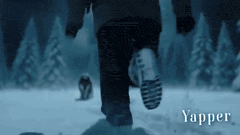

> 🔗 [Original Source](https://x.com/RizwanAly07)

---

### High-Speed Magical Forest Journey

**Prompt:**
```
High-quality dynamic 3D animation of a high-speed magical forest journey. A group of riders in ornate fantasy costumes are mounted on glowing magical creatures, including a glowing spirit wolf, a shimmering crystal stag, a giant phantom owl, and a spirit leopard. They are racing through a stunning forest filled with giant glowing crystals. The scene features
```

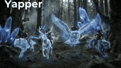

> 🔗 [Original Source](https://x.com/Riya333S)

---

### Wingsuit Proximity Flight along the Great Ocean Road

**Prompt:**
```
A wingsuit flyer in a bright orange suit leaps from a coastal cliff above the Pacific Ocean. The camera follows close behind as he dives through narrow rock arches along the cliffside. At the 2-second mark he skims just meters above crashing waves. He pulls upward along the cliff wall and flies directly through a sea cave tunnel. Ocean wingsuit proximity fli
```

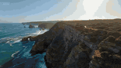

> 🔗 [Original Source](https://x.com/LudovicCreator)

---

### Modern Soldier vs. Ancient Samurai in Foggy Forest

**Prompt:**
```
In the middle of a fog-covered forest clearing at dawn, a modern special forces soldier cautiously advances with a rifle while an ancient samurai warrior stands silently with a drawn katana. Mist drifts between towering trees as tension thickens the air. The soldier fires,
```

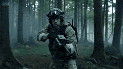

> 🔗 [Original Source](https://x.com/vadooai)

---

### Arctic Glacier Collapse and Snowmobile Escape

**Prompt:**
```
A woman in her mid-30s wearing a heavy arctic survival suit races across the deck of a massive icebreaker ship cutting through frozen seas. Behind her a towering wall of collapsing glacier ice crashes into the ocean. At the 2-second mark she jumps onto a snowmobile and accelerates toward the bow ramp as the ship tilts from the impact. The snowmobile launches
```

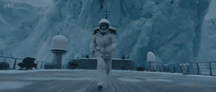

> 🔗 [Original Source](https://x.com/LudovicCreator)

---

### Massive Ancient Sea Dragon Emerging from the Ocean

**Prompt:**
```
A massive ancient sea dragon emerging from the deep ocean, its gigantic serpentine body rising through powerful crashing waves. Dark blue stormy sea with huge swells, water exploding around the creature as it surfaces. The dragon has detailed scales, glowing eyes,
```

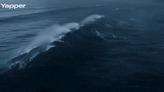

> 🔗 [Original Source](https://x.com/john_my07)

---

### Explorer discovering a hidden valley in the snow

**Prompt:**
```
Live-action cinematic sequence in real time. Aerial wide shot: a vast white mountain range, completely silent and endless. Cut to close-up of a compass in a gloved hand, needle spinning then settling. Cut to medium shot of a lone explorer trudging through deep snow, wind whipping around her. Cut to insert shot of footprints in the snow being erased by the wi
```

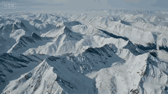

> 🔗 [Original Source](https://x.com/Kiber_Alla)

---

### Wong Kar-wai style rainy phone booth scene

**Prompt:**
```
[Film Style]: 90s Hong Kong Art Cinema style, retro film feel, high ISO grain, ambiguous yellow-green tint, frame stepping effect, melancholic atmosphere. [Core Dialogue (for emotion control)]: \"If memories were canned food, I hope they never expire.\" [Video Duration]: 10 seconds [Script]: [00:00-00:04] Shot 1: Through the Glass Peeping. Scene: A rain-covere
```


> 🔗 [Original Source](https://x.com/athianandam)

---

### Colossal Feline Titan Rising from the Ocean

**Prompt:**
```
Stormy night ocean, massive waves under lightning flashes. The sea churns violently as a colossal feline titan rises from the depths, water cascading off its fur in slow motion. Low-angle cinematic shot, glowing eyes piercing rain and fog. Navy warships surround it, firing missiles and cannons, explosions lighting the clouds. The giant cat roars, shockwaves
```


> 🔗 [Original Source](https://x.com/lexx_aura)

---

### Taiwanese Girlfriend Series: Rainy Day POV

**Prompt:**
```
15 seconds, vertical screen 9:16, overcast diffused natural light + wet texture of everything soaked by rain, occasional raindrops splashing on the phone lens causing local blur, under the arcade on a Taipei street, protagonist is a Taiwanese girl [Image 1], long hair wet and sticking to her cheeks and neck, white thin shirt slightly transparent from wetness
```


> 🔗 [Original Source](https://x.com/msjiaozhu)

---

### BRAIN DRAIN Stop-Motion Prompt

**Prompt:**
```
Hyperrealistic miniature diorama, stop-motion animation, handcrafted tactile materials — real fabric, clay, wire armatures, actual tiny props. A clay man sits at a miniature desk in a cozy office, a real tiny laptop open in front of him glowing with a familiar chat interface — white screen, alternating grey and white bubbles. His clay head is in cross-sectio
```


> 🔗 [Original Source](https://x.com/AleRVG)

---

### Cyberpunk Hacker in Rain Night Scene

**Prompt:**
```
0–4s: A hacker wearing a damaged trench coat and a hood covering their face walks down a rainy night street. Neon signs (pink and blue) serve as the main light source, projecting from the upper right of the frame. Rain is visible under the light, hitting the surface of the trench coat. Medium shot, handheld stabilizer following the walk, low angle. Environme
```

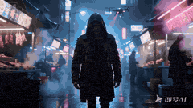

> 🔗 [Original Source](https://x.com/CD_Bana)

---

### Ethereal Wanderer in Fog-Shrouded Forest

**Prompt:**
```
[Scene opens in an ancient, fog-shrouded forest at midnight, towering trees twisting like living veins under a fractured moon. The camera glides seamlessly through the ethereal haze.] 0-3 seconds: A ethereal wanderer in flowing robes dashes between gnarled trunks, waving a hand
```


> 🔗 [Original Source](https://x.com/ibexdream)

---

### Snowy Eastern European Thriller Trailer

**Prompt:**
```
generate a trailer for a thriller movie set in snowy Eastern Europe. It should feature a quick montage of a detective, a love story, the process of falling in love, and a fast-paced investigation
```

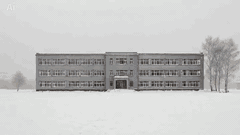

> 🔗 [Original Source](https://x.com/WorldEverett)

---

### Goblin traveller and steed in the mountains

**Prompt:**
```
A rugged mountain traveller crosses a snow-covered ridge under a cold, overcast sky. Wind carries light snowfall across the frame. His heavy boots press into fresh snow and scattered stone. The camera tracks low and slightly behind, capturing texture, atmosphere, and drifting frost. Nearby stands a large mountain boar used as a pack animal. Thick bristles ca
```

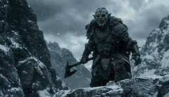

> 🔗 [Original Source](https://x.com/StevieMac03)

---

### Deep ocean trench scene with a peaceful giant

**Prompt:**
```
SCENE: DEEP OCEAN TRENCH - UNDERWATER Quick Cuts ATMOSPHERE: Awe-inspiring and primeval. The sheer, terrifying scale of a peaceful giant moving flawlessly through the quiet ocean water evokes a profound sense of majesty and the raw power of nature. SHOT DESCRIPTION: A
```

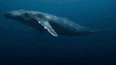

> 🔗 [Original Source](https://x.com/aimikoda)

---

### High in the rugged 1975 Ladakh mountains, Indian engineers harness newly discovered anti-gravity minerals nicknamed “Shakti Stones.”

**Prompt:**
```
High in the rugged 1975 Ladakh mountains, Indian engineers harness newly discovered anti-gravity minerals nicknamed “Shakti Stones.” In hidden shipyards, they construct floating vessels that fuse Himalayan architectural design with advanced levitation. Pilgrims from the plains, UFO spotters, and quantum physicists come, each with a motive: from spiritual jou
```

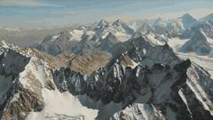

> 🔗 [Original Source](https://x.com/drashyakuruwa)

---

### Napoleon Charging at Waterloo Prompt

**Prompt:**
```
this absurd scene of Napoléon Bonaparte personally charging at the Battle of Waterloo.
```

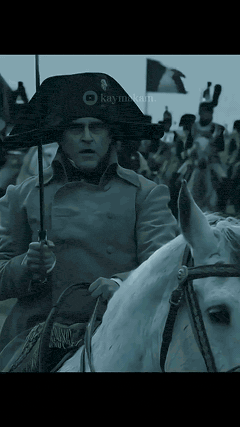

> 🔗 [Original Source](https://x.com/Tom_Antonov)

---

### Colossal Katamari Ball Emerging from the Ocean

**Prompt:**
```
From a balcony viewpoint, a colossal, brightly colored Katamari ball spins rapidly, emerging from the dark ocean toward a sprawling cityscape.
```

> 🔗 [Original Source](https://x.com/Willhart_H)

---

### The Leviathan's Throat: Underwater Megastructure Descent

**Prompt:**
```
A flooded subterranean megastructure, ancient stone corridors half-submerged in black water, bioluminescent algae pulsing along the walls like a heartbeat. A masked diver in scarred tactical gear, lit by a flickering wrist-mounted flare, is pulled downward through collapsing flooded chambers by the current of a colossal eyeless leviathan moving beneath the f
```


> 🔗 [Original Source](https://x.com/Dheepanratnam)

---

### Nature Documentary: Otter Flying an Airplane

**Prompt:**
```
\"A nature documentary about an otter flying an airplane\"
```

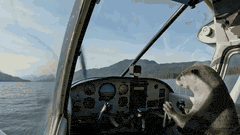

> 🔗 [Original Source](https://x.com/emollick)

---

### Rainy Neon Pursuit in Hong Kong

**Prompt:**
```
Lone trench coat runner sprints Hong Kong alleys, slams vendor cart—fruits scatter; shoulder-glued tracking shot, rain flying, sirens + pounding drums sync to terror; low-angle duck into dead-end.
```

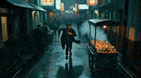

> 🔗 [Original Source](https://x.com/bigprompt)

---

### 1980s Training Montage VHS Style Prompt

**Prompt:**
```
title: \"Never Too Late\" duration: 15s style: era: 1980s training montage look: grainy VHS, stretched 9:16, tape warble, tracking lines, overscan crop audio: guitar-riff–driven arena rock, crowd-chant energy, hard snare hits color: slightly washed, warm highlights, crushed blacks
```


> 🔗 [Original Source](https://x.com/AIWarper)

---

### Epic Sci-Fi Scene Prompt: Robot on Mountain Peak

**Prompt:**
```
Epic sci-fi scene, ultra-wide cinematic lens. Scene: At the peak of a high mountain on Earth, a solitary robot {@image 1} stands on the mountaintop, facing the distant sky, stable and quiet. The mountaintop is surrounded by strong winds and clouds, the environment is desolate and magnificent.
```

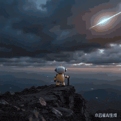

> 🔗 [Original Source](https://x.com/dashdot1205)

---

### Olympic Snowboard Big Air Competition

**Prompt:**
```
photorealistic shot of the women's snowboard big air competition at the olympics. the snowboarder from the united states races down the hill and then flies off the snow ramp and into the air, with the commentators exclaiming wildly
```


> 🔗 [Original Source](https://x.com/venturetwins)

---

### Moonlit Bamboo Forest Swordsman Scene

**Prompt:**
```
A bamboo forest under the moonlight. A swordsman in white stands deep within the bamboo grove, his robes fluttering in the wind. He slowly draws his sword, the blade reflecting the moonlight. The camera rotates 360 degrees around him, and bamboo leaves fall continuously. The swordsman suddenly strikes, a sword energy slashes through the bamboo forest, and se
```

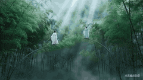

> 🔗 [Original Source](https://x.com/channelerHua)

---

### Watercolor Ink Sword Performance

**Prompt:**
```
watercolor ink sword performance.
```


> 🔗 [Original Source](https://x.com/Aicean_ai)

---

### Classical Wuxia Duel in Bamboo Forest

**Prompt:**
```
[Visual Style] Eastern Classical Wuxia Aesthetics, cinematic visual language, bamboo forest sea landscape, emerald green main color tone, rich layering of light and shadow, soft light beam effects visible within the forest. [Character Definition] 1. Male Swordsman: Dressed in a plain white long robe, steady posture, concise and powerful movements. 2. Female
```

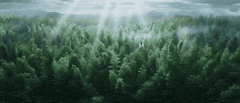

> 🔗 [Original Source](https://x.com/johnAGI168)

---
